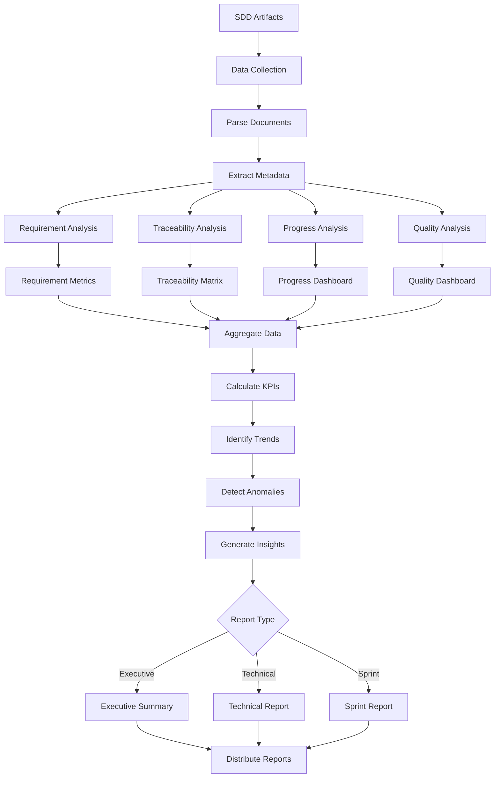
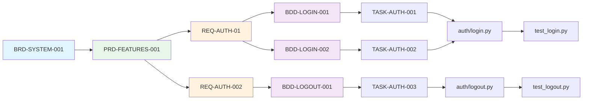

# analytics-flow

**Description**: Project metrics, documentation analytics, progress tracking, and trend analysis

**Category**: Data Analysis & Reporting

**Complexity**: Medium (data aggregation + visualization)

---

## Purpose

Provide visibility into project progress, documentation quality, requirement coverage, and development velocity. Generate actionable insights from SDD artifacts to identify bottlenecks and optimize workflows.

---

## Capabilities

### 1. Documentation Coverage Metrics
- Total documents by type (BRD, PRD, REQ, BDD, etc.)
- Token count distribution
- Documentation completeness percentage
- Outdated document identification
- Documentation debt tracking

### 2. Requirement Tracking
- Total requirements by category
- Requirement status (draft, approved, implemented, tested)
- Requirement coverage (REQ → BDD → TASK mapping)
- Orphaned requirements
- Requirement age and staleness

### 3. Traceability Analysis
- Complete traceability chains (BRD → ... → Code)
- Broken traceability links
- Traceability coverage percentage
- Gap identification
- Circular dependency detection

### 4. Implementation Progress
- Tasks completed vs total
- Implementation phase progress
- Blocked vs active tasks
- Timeline adherence
- Milestone tracking

### 5. Velocity Tracking
- Requirements completed per sprint/week
- Implementation velocity
- Documentation velocity
- Test coverage velocity
- Trend analysis over time

### 6. Quality Metrics
- Code review scores over time
- Test coverage trends
- Security vulnerability trends
- Code complexity trends
- Documentation quality scores

### 7. Bottleneck Identification
- Stuck requirements (no progress)
- Blocked tasks
- Resource constraints
- Dependency chains blocking progress
- Review bottlenecks

### 8. Custom Report Generation
- Executive summaries
- Sprint/weekly reports
- Milestone reports
- Team performance reports
- Risk assessment reports

---

## Analytics Workflow



---

## Usage Instructions

### Generate Project Dashboard

```bash
analytics-flow dashboard --output reports/dashboard.html
```

Generated dashboard sections:
```
Project Overview Dashboard
==========================

Overall Health: 78/100 (Good)

Documentation Coverage:
├─ BRD Documents: 3/3 (100%) ✓
├─ PRD Documents: 2/3 (67%) ⚠️
├─ Requirements: 146/150 (97%) ✓
├─ BDD Scenarios: 89/146 (61%) ⚠️
├─ ADR Documents: 12/12 (100%) ✓
├─ SPEC Documents: 5/8 (63%) ⚠️
└─ TASK Documents: 45/89 (51%) ❌

Implementation Progress:
├─ Phase 1: 100% (Completed) ✓
├─ Phase 2: 75% (In Progress) →
├─ Phase 3: 0% (Not Started) ○
└─ Overall: 58% complete

Traceability Coverage:
├─ Forward Traceability: 94% ✓
├─ Backward Traceability: 91% ✓
└─ Complete Chains: 87% ✓

Quality Metrics:
├─ Code Coverage: 87% ✓
├─ Code Review Score: 82/100 ✓
├─ Security Issues: 3 (1 Critical) ⚠️
└─ Documentation Quality: 89% ✓

Velocity (Last 4 Weeks):
├─ Requirements: 12/week (avg)
├─ Implementation: 8 tasks/week
├─ Tests Written: 45 tests/week
└─ Trend: ↗ Improving

Bottlenecks Identified:
├─ REQ-AUTH-015: Stuck for 3 weeks
├─ BDD Scenarios: 39% gap vs requirements
└─ Phase 2 Dependency: Blocked by external API
```

### Generate Requirement Report

```bash
analytics-flow requirements --format json --output reports/requirements.json
```

Output:
```json
{
  "summary": {
    "total_requirements": 146,
    "by_priority": {
      "MUST": 130,
      "SHOULD": 12,
      "MAY": 4
    },
    "by_status": {
      "draft": 5,
      "approved": 85,
      "implemented": 45,
      "tested": 38,
      "deployed": 30
    },
    "by_category": {
      "authentication": 15,
      "authorization": 12,
      "data_processing": 45,
      "api": 38,
      "ml_models": 32,
      "infrastructure": 4
    }
  },
  "coverage": {
    "with_bdd_scenarios": 89,
    "with_tasks": 78,
    "with_tests": 67,
    "complete_traceability": 127
  },
  "age_analysis": {
    "average_age_days": 45,
    "oldest_requirement": {
      "id": "REQ-AUTH-01",
      "age_days": 120,
      "status": "implemented"
    },
    "stale_requirements": [
      {"id": "REQ-ML-015", "age_days": 90, "status": "draft"}
    ]
  },
  "orphaned_requirements": [
    "REQ-AUTH-015",
    "REQ-DATA-023"
  ]
}
```

### Generate Traceability Matrix

```bash
analytics-flow traceability --format mermaid --output reports/traceability.mmd
```

Generated Mermaid diagram:


### Generate Sprint Report

```bash
analytics-flow sprint \
  --start-date 2025-01-01 \
  --end-date 2025-01-14 \
  --output reports/sprint-report.md
```

Generated report:
```markdown
# Sprint Report: Jan 1-14, 2025

## Sprint Summary
- Duration: 2 weeks
- Team Size: 5 developers
- Sprint Goal: Complete Phase 2 authentication features

## Accomplishments
✓ Completed: 12 requirements
✓ Implemented: 18 tasks
✓ Tests Written: 67 tests
✓ Code Coverage: 87% → 91% (+4%)

## Requirements Completed
1. REQ-AUTH-01: User login with JWT ✓
2. REQ-AUTH-002: User logout ✓
3. REQ-AUTH-003: Password reset ✓
4. REQ-AUTH-004: Email verification ✓
... (8 more)

## Velocity Metrics
- Requirements: 6/week (target: 5/week) ↗
- Tasks: 9/week (target: 8/week) ↗
- Tests: 33.5/week (target: 25/week) ↗

## Quality Metrics
- Code Review Score: 85/100 (+3 from last sprint)
- Security Issues: 2 (down from 5)
- Test Coverage: 91% (up from 87%)

## Blockers Resolved
1. External API integration (blocked 5 days) → Resolved
2. Database migration issue → Resolved

## Current Blockers
1. Waiting for design review on user profile page (2 days)

## Risks
⚠️ Phase 3 dependency on external service (mitigation: mock implementation)

## Next Sprint Goals
- Complete remaining 8 authentication requirements
- Begin authorization framework
- Improve test coverage to 93%
```

### Track Velocity Trends

```bash
analytics-flow velocity --weeks 12 --output reports/velocity.json
```

Output with trend analysis:
```json
{
  "period": "12 weeks",
  "metrics": [
    {
      "week": "2025-W01",
      "requirements_completed": 8,
      "tasks_completed": 15,
      "tests_written": 42,
      "code_coverage": 85
    },
    {
      "week": "2025-W02",
      "requirements_completed": 12,
      "tasks_completed": 18,
      "tests_written": 67,
      "code_coverage": 91
    }
  ],
  "trends": {
    "requirements": {
      "average": 10,
      "trend": "increasing",
      "velocity_change": "+15%"
    },
    "tasks": {
      "average": 16.5,
      "trend": "stable",
      "velocity_change": "+2%"
    },
    "tests": {
      "average": 54.5,
      "trend": "increasing",
      "velocity_change": "+25%"
    }
  },
  "forecast": {
    "next_sprint_requirements": 13,
    "completion_date_phase_2": "2025-02-15",
    "confidence": "high"
  }
}
```

---

## Key Performance Indicators (KPIs)

### Documentation KPIs

1. **Documentation Coverage**
   ```
   Coverage = (Completed Documents / Total Required Documents) × 100%
   Target: ≥95%
   ```

2. **Documentation Debt**
   ```
   Debt = Outdated Documents + Missing Documents
   Target: <5% of total documents
   ```

3. **Average Document Age**
   ```
   Age = Days since last update
   Target: <30 days for active documents
   ```

### Requirement KPIs

1. **Requirement Coverage**
   ```
   Coverage = (Requirements with Tests / Total Requirements) × 100%
   Target: 100% for MUST requirements
   ```

2. **Requirement Cycle Time**
   ```
   Cycle Time = Days from draft to deployed
   Target: <14 days (2 sprints)
   ```

3. **Orphaned Requirements**
   ```
   Orphaned = Requirements without forward/backward links
   Target: 0
   ```

### Implementation KPIs

1. **Implementation Velocity**
   ```
   Velocity = Tasks completed / Time period
   Track: Weekly, calculate 4-week moving average
   ```

2. **Task Completion Rate**
   ```
   Completion = (Completed Tasks / Total Tasks) × 100%
   Target: ≥90% per sprint
   ```

3. **Blocked Task Percentage**
   ```
   Blocked % = (Blocked Tasks / Active Tasks) × 100%
   Target: <10%
   ```

### Traceability KPIs

1. **Forward Traceability**
   ```
   Forward = (Requirements with downstream links / Total Requirements) × 100%
   Target: 100%
   ```

2. **Backward Traceability**
   ```
   Backward = (Tasks with upstream links / Total Tasks) × 100%
   Target: 100%
   ```

3. **Complete Traceability Chains**
   ```
   Complete = (Requirements with full BRD→Code chain / Total) × 100%
   Target: ≥95%
   ```

### Quality KPIs

1. **Code Coverage Trend**
   ```
   Track: Weekly, target: ≥90%
   Alert: If drops >5% week-over-week
   ```

2. **Code Review Score**
   ```
   Track: Per PR, target: ≥80/100
   Alert: If average <70 for 2 consecutive weeks
   ```

3. **Security Vulnerability Density**
   ```
   Density = Critical vulnerabilities / KLOC
   Target: 0 critical vulnerabilities
   ```

---

## Report Templates

### Executive Summary Template

```markdown
# Executive Project Summary
Date: {date}
Period: {period}

## Overall Status: {status_indicator}

### Progress
- Phase Completion: {phase_progress}%
- On Schedule: {schedule_status}
- Budget Status: {budget_status}

### Key Achievements
1. {achievement_1}
2. {achievement_2}
3. {achievement_3}

### Risks & Mitigation
| Risk | Impact | Probability | Mitigation |
|------|--------|-------------|------------|
| {risk_1} | {impact} | {prob} | {mitigation} |

### Next Milestone
- {milestone_name}: {milestone_date}
- {deliverables}

### Resource Requirements
- {resource_needs}
```

### Technical Report Template

```markdown
# Technical Project Report
Date: {date}

## Architecture
- ADRs Approved: {adr_count}
- Major Decisions: {decisions_summary}

## Implementation
- Requirements Completed: {req_completed}/{req_total}
- Code Coverage: {coverage}%
- Technical Debt: {tech_debt_score}

## Quality Metrics
- Code Review Score: {review_score}/100
- Security Issues: {security_count}
- Performance Benchmarks: {performance_data}

## Infrastructure
- Environments: {env_status}
- Deployments: {deployment_count}
- Uptime: {uptime}%

## Traceability
- Forward Coverage: {forward_trace}%
- Backward Coverage: {backward_trace}%
- Gaps: {gap_count}
```

---

## Data Sources

### Primary Sources
- All SDD artifact files (BRD, PRD, REQ, BDD, ADR, SPEC, TASK, CTR)
- Git commit history
- Test execution results
- Code coverage reports
- Security scan results
- CI/CD pipeline logs

### Derived Metrics
- Velocity calculations
- Trend analysis
- Predictive forecasting
- Anomaly detection

---

## Visualization Options

### Chart Types

1. **Burndown Chart**: Sprint/project progress
2. **Velocity Chart**: Weekly implementation velocity
3. **Coverage Trend**: Test coverage over time
4. **Traceability Matrix**: Requirement-to-code mapping
5. **Dependency Graph**: Task dependencies
6. **Risk Heat Map**: Risk probability vs impact
7. **Quality Dashboard**: Multi-metric visualization

### Export Formats
- HTML dashboards (interactive)
- PDF reports (static)
- JSON data (for integration)
- Markdown reports (for Git)
- Mermaid diagrams (for documentation)
- CSV data (for spreadsheets)

---

## Tool Access

Required tools:
- `Read`: Read all SDD artifacts
- `Glob`: Find all documents
- `Grep`: Search for patterns and IDs
- `Bash`: Execute analysis scripts

Required libraries:
- pandas: Data analysis
- matplotlib/plotly: Visualization
- jinja2: Report templating
- pyyaml: YAML parsing

---

## Integration Points

### With doc-flow
- Extract metadata from generated documents
- Track documentation workflow progress
- Identify documentation gaps

### With test-automation
- Aggregate test coverage data
- Track test execution trends
- Correlate tests with requirements

### With code-review
- Track code quality trends
- Aggregate review scores
- Identify quality patterns

### With project-mngt
- Validate timeline adherence
- Track milestone progress
- Resource utilization analysis

---

## Best Practices

1. **Update frequency**: Daily automated collection, weekly reports
2. **Baseline establishment**: Set baseline metrics at project start
3. **Trend analysis**: Focus on trends, not absolute numbers
4. **Actionable insights**: Every metric should inform decisions
5. **Anomaly detection**: Alert on unusual patterns
6. **Historical data**: Maintain 6+ months of history
7. **Stakeholder alignment**: Customize reports per audience
8. **Continuous improvement**: Evolve metrics based on feedback

---

## Limitations

1. Requires consistent SDD artifact structure
2. Historical analysis limited to available data
3. Predictive accuracy depends on data quality
4. Cannot measure subjective quality factors
5. Requires regular data collection for accuracy

---

## Success Criteria

- Real-time dashboard availability
- <5 minute report generation time
- 100% data accuracy
- All KPIs tracked automatically
- Trend analysis with 90% forecast accuracy
- Zero manual data collection required
- Stakeholder satisfaction ≥4/5

---

## Notes

- Reports saved to `reports/analytics/`
- Historical data stored in `metrics/history.json`
- Dashboard auto-refreshes every 15 minutes
- Alerts configured for KPI threshold breaches
- Custom metrics configurable via `.analytics.yml`
