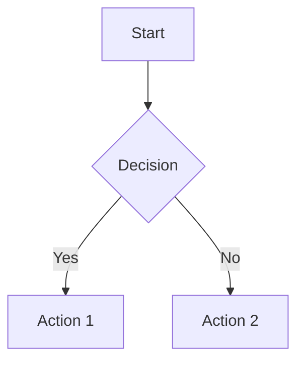
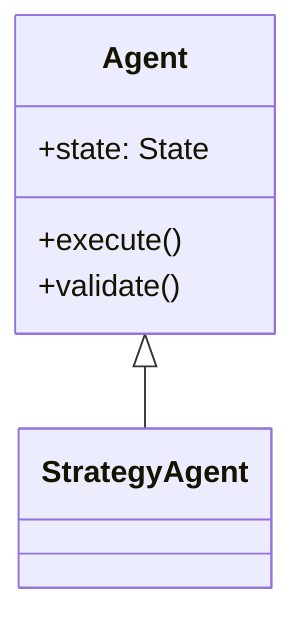
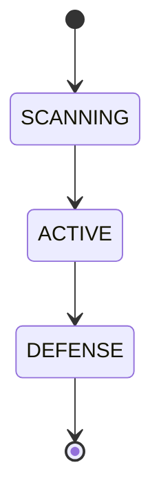
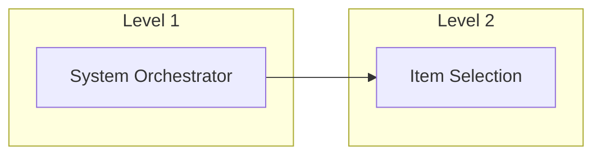
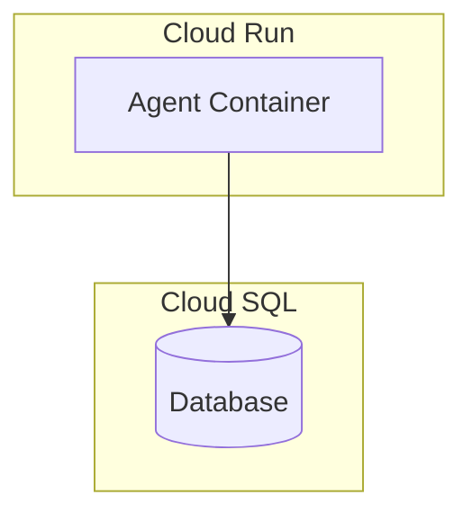

# charts-flow

## Purpose

The `charts-flow` skill automates creation and management of Mermaid diagrams for technical documentation. It separates diagram source files from main documents to improve rendering performance, provides automatic SVG conversion for human viewing, and maintains traceability between parent documents and diagram files.

**Key Benefits**:
- **Performance**: Separate diagram files load faster in documentation viewers
- **Dual Format**: Mermaid source for AI assistants, SVG preview for humans
- **Traceability**: Diagrams linked to parent documents with proper ID naming
- **Migration**: Extract existing inline diagrams to separate files
- **Consistency**: Standardized diagram file structure and metadata

## When to Use This Skill

**Use charts-flow when**:
- Creating architecture diagrams for PRD, BRD, ADR, SYS, or other technical documents
- Migrating existing inline Mermaid diagrams to separate files
- Main document becomes slow to render due to complex diagrams
- Diagram needs to be reused across multiple documents
- Creating flowcharts, component diagrams, deployment diagrams, sequence diagrams, state machines, or class diagrams

**Do NOT use charts-flow when**:
- Creating simple tables or text-based lists (use markdown)
- Diagram is < 20 lines and main document renders fast
- Creating data visualization charts (use appropriate charting libraries)
- Working with non-architecture diagrams (Gantt, pie charts - outside scope)

## Skill Inputs

### Required Inputs

| Input | Description | Example |
|-------|-------------|---------|
| **Parent File Path** | Absolute path to main document | `{project_root}/docs/PRD/PRD-01_multi_agent_system_architecture.md` |
| **Diagram Description** | Short name for diagram | `3_tier_agent_hierarchy` |
| **Diagram Type** | Architecture diagram type | `flowchart`, `sequence`, `class`, `state`, `component`, `deployment` |

### Optional Inputs

| Input | Description | Default |
|-------|-------------|---------|
| **Migration Mode** | Extract existing diagrams from document | `false` (create new) |
| **Diagram Title** | Human-readable title | Derived from description |
| **Styling Preferences** | Color scheme, layout direction | Project defaults |

## Skill Workflow

### Mode 1: Create New Diagram

**Step 1: Parse Parent Document**
- Extract parent document ID from filename (e.g., `PRD-01` from `PRD-01_multi_agent_system_architecture.md`)
- Identify parent document type (PRD, BRD, ADR, SYS, etc.)
- Determine correct `diagrams/` subfolder location

**Step 2: Generate Diagram File Path**
- Format: `{parent_folder}/diagrams/{PARENT-ID}-diag_{description}.md`
- The `diagrams/` subfolder is created in the same directory as the parent document
- Examples by document type:
  - BRD: `docs/BRD/diagrams/BRD-01-diag_workflow.md`
  - PRD: `docs/PRD/diagrams/PRD-01-diag_3_tier_agent_hierarchy.md`
  - ADR: `docs/ADR/diagrams/ADR-005-diag_cloud_deployment.md`
  - SYS: `docs/SYS/diagrams/SYS-002-diag_data_flow.md`
  - IMPL: `docs/IMPL/diagrams/IMPL-010-diag_implementation_phases.md`
- Create `diagrams/` folder if it doesn't exist

**Step 3: Create Diagram File**
- Use diagram file template (see Templates section below)
- Include Document Control section linking to parent
- Add diagram type metadata
- Create Mermaid code block with syntax appropriate for diagram type

**Step 4: Generate SVG**
- Attempt `mmdc` CLI conversion: `mmdc -i diagram.md -o diagram.svg`
- Fallback: Use Mermaid Live API if CLI unavailable
- Validate SVG output (check for errors, size < 1MB)

**Step 5: Encode SVG as Base64**
- Read generated SVG file
- Convert to Base64 string
- Prepare data URI: `data:image/svg+xml;base64,{BASE64_STRING}`

**Step 6: Update Parent Document**
- Add reference link to diagram file
- Embed Base64 SVG in collapsible `<details>` block
- Place in appropriate section of parent document

**Step 7: Validate**
- Verify diagram file exists and is readable
- Check Mermaid syntax validity
- Confirm SVG renders correctly
- Validate cross-references resolve

### Mode 2: Migrate Existing Diagrams

**Step 1: Scan Parent Document**
- Search for ````mermaid` code blocks
- Extract each diagram with surrounding context
- Preserve diagram content and styling

**Step 2: Create Diagram Files**
- For each extracted diagram, follow Steps 1-4 from Mode 1
- Auto-generate description from diagram content or context
- Number multiple diagrams: `_diagram_1`, `_diagram_2`, etc.

**Step 3: Replace in Parent Document**
- Remove original ````mermaid` blocks
- Insert SVG + reference link in same location
- Maintain document flow and readability

**Step 4: Validate Migration**
- Confirm all diagrams extracted
- Verify no broken references
- Check visual fidelity (SVG matches original Mermaid)

## Templates

### Diagram File Template

```markdown
# {PARENT-ID}-diag: {Diagram Title}

## Document Control

| Item | Details |
|------|---------|
| **Diagram ID** | {PARENT-ID}-diag |
| **Parent Document** | [{PARENT-ID}: {Parent Title}](../{PARENT-FILE}.md) |
| **Diagram Type** | {flowchart|sequence|class|state|component|deployment} |
| **Status** | Active |
| **Version** | 1.0.0 |
| **Created** | {YYYY-MM-DD} |
| **Last Updated** | {YYYY-MM-DD} |
| **Maintained By** | {Role} |

## Overview

{Brief description of what this diagram represents}

## {Diagram Title}

```mermaid
{Mermaid diagram code}
```

## Diagram Description

{Detailed explanation of diagram elements, flows, and purpose}

## Key Elements

{List or table of important nodes, components, actors, states, or flows}

## References

- **Parent Document**: [{PARENT-ID}: {Parent Title}](../{PARENT-FILE}.md)
- **Related Diagrams**: {Links to related diagram files if applicable}
- **Related Documents**: {Links to related requirements, ADRs, strategy docs}

---

**Diagram Version**: 1.0.0
**Created**: {YYYY-MM-DD}
**Maintained By**: {Role}
```

### Parent Document Reference Template

```markdown
**Visual Diagram**: [{PARENT-ID}-diag: {Diagram Title}](diagrams/{PARENT-ID}-diag_{description}.md)

<details>
<summary>View Diagram (SVG Preview)</summary>


</details>
```

## Supported Diagram Types

### Flowchart / Graph

**Use for**: Process flows, decision trees, workflows

### Sequence Diagram
```mermaid
sequenceDiagram
    Actor->>System: Request
    System->>Database: Query
    Database-->>System: Result
    System-->>Actor: Response
```
**Use for**: Agent interactions, API calls, message flows

### Class Diagram

**Use for**: Object relationships, system components

### State Diagram

**Use for**: State machines, lifecycle flows

### Component Diagram (using flowchart)

**Use for**: System architecture, component relationships

### Deployment Diagram (using flowchart)

**Use for**: Infrastructure architecture, deployment topology

## Tool Usage

### Check for Mermaid CLI

```bash
which mmdc
```

**If not installed**:
```bash
npm install -g @mermaid-js/mermaid-cli
```

**Alternative**: Use Puppeteer
```bash
npm install -g puppeteer
```

### Generate SVG from Mermaid

```bash
mmdc -i input.md -o output.svg -b transparent
```

**Parameters**:
- `-i`: Input file (Mermaid markdown)
- `-o`: Output file (SVG)
- `-b`: Background color (`transparent` recommended)

### Convert SVG to Base64

```bash
base64 -w 0 diagram.svg
```

**macOS**:
```bash
base64 -i diagram.svg
```

## Quality Gates (Definition of Done)

- [ ] **File Created**: Diagram file exists in correct `diagrams/` subfolder
- [ ] **Naming Convention**: File name follows `{PARENT-ID}-diag_{description}.md` pattern
- [ ] **Document Control**: Metadata section present with parent link back-reference
- [ ] **Mermaid Syntax**: Diagram syntax validates without errors
- [ ] **SVG Generated**: SVG file created successfully (if using file method)
- [ ] **SVG Embedded**: Base64 SVG embedded in parent document
- [ ] **Reference Added**: Link to diagram file added in parent document
- [ ] **Cross-References**: All links resolve correctly (bidirectional)
- [ ] **Rendering**: Diagram displays correctly in GitHub, VS Code, and documentation sites
- [ ] **Accessibility**: Collapsible `<details>` block used for SVG preview
- [ ] **File Size**: SVG < 1MB, Base64 string < 1.5MB

## Skill Constraints

### What NOT to Do

- **Do NOT** create diagrams in archived folders without explicit permission
- **Do NOT** modify existing diagram files without checking version history
- **Do NOT** embed large binary images (use SVG only)
- **Do NOT** use Gantt charts, pie charts, or git graphs (outside scope - architecture diagrams only)
- **Do NOT** create diagrams for simple lists or tables (use markdown)
- **Do NOT** skip Document Control metadata
- **Do NOT** use generic filenames like `diagram1.md` (use descriptive names)

### File Organization Rules

- **Always** create `diagrams/` subfolder in same directory as parent document
- **Always** use parent document ID as diagram file prefix
- **Always** maintain traceability with cross-references
- **Always** follow template structure for consistency

## Error Handling

### Error: `mmdc` command not found

**Cause**: Mermaid CLI not installed

**Resolution**:
```bash
npm install -g @mermaid-js/mermaid-cli
# OR
# Provide manual instructions to use Mermaid Live (https://mermaid.live)
```

### Error: Invalid Mermaid syntax

**Cause**: Syntax error in diagram code

**Resolution**:
- Validate syntax at https://mermaid.live
- Check for missing quotes, brackets, or keywords
- Review Mermaid documentation for diagram type

### Error: SVG file too large (> 1MB)

**Cause**: Diagram too complex

**Resolution**:
- Split into multiple diagrams
- Simplify diagram (remove redundant elements)
- Use subgraphs to organize complexity

### Error: Cannot determine parent document ID

**Cause**: Filename doesn't follow standard naming (e.g., no ID prefix)

**Resolution**:
- Prompt user to specify parent ID manually
- Suggest renaming parent file to follow conventions

### Error: `diagrams/` folder creation failed

**Cause**: Permission issues or invalid path

**Resolution**:
- Check file permissions
- Verify parent directory exists
- Use absolute paths

## Example Usage

### Example 1: Create New Flowchart Diagram for BRD

**User Request**:
> "Create a flowchart diagram showing the user workflow for BRD-01"

**Skill Actions**:
1. Parse parent: `{project_root}/docs/BRD/BRD-01_project_requirements.md`
2. Extract ID: `BRD-01`
3. Create file: `docs/BRD/diagrams/BRD-01-diag_user_workflow.md` (in BRD subfolder)
4. Generate Mermaid flowchart with user journey steps
5. Convert to SVG using `mmdc`
6. Embed Base64 SVG in BRD-01
7. Add reference link

**Result**:
- Diagram file created in `docs/BRD/diagrams/` (document type-specific subfolder)
- SVG preview visible in parent document
- Cross-references working in both directions

### Example 2: Migrate Existing Diagram

**User Request**:
> "Migrate the state machine diagram from strategy_state_machine.md to a separate file"

**Skill Actions**:
1. Scan `{project_root}/strategy/strategy_state_machine.md`
2. Find ```mermaid block (state diagram)
3. Extract diagram code
4. Create `{project_root}/strategy/diagrams/SSM-001-diag_state_transitions.md`
5. Generate SVG
6. Replace original block with SVG + reference
7. Validate migration

**Result**:
- Original Mermaid moved to separate file
- SVG preview embedded in main document
- Main document renders faster

### Example 3: Create Sequence Diagram for ADR

**User Request**:
> "Create a sequence diagram showing the agent communication flow for ADR-003"

**Skill Actions**:
1. Parent: `docs/ADR/ADR-003_agent_communication.md`
2. Create: `docs/ADR/diagrams/ADR-003-diag_agent_communication_sequence.md` (in ADR subfolder)
3. Generate sequence diagram: System Orchestrator → Selection Service → Strategy Agent → Risk Service
4. Add swimlanes for timing (A2A Protocol patterns)
5. Convert to SVG
6. Embed in ADR-003

**Result**:
- Sequence diagram in `docs/ADR/diagrams/` (document type-specific subfolder)
- Message flow with <50ms SLA annotations visible
- SVG preview in ADR document

## Output Format

### Generated Artifacts

1. **Diagram File** (`{PARENT-ID}-diag_{description}.md`)
   - Location: `{parent_folder}/diagrams/`
   - Format: Markdown with Mermaid code block
   - Includes: Document Control, diagram code, description, references

2. **SVG File** (optional, if using file-based approach)
   - Location: Same as diagram file, `.svg` extension
   - Format: Scalable Vector Graphics
   - Used for Base64 encoding

3. **Updated Parent Document**
   - Reference link added in appropriate section
   - SVG preview embedded in `<details>` block
   - Original content preserved

### File Organization After Execution

**Each document type has its own diagrams subfolder**:

```
docs/
├── BRD/
│   ├── BRD-01_project_requirements.md         ← Updated with SVG + link
│   └── diagrams/
│       ├── BRD-01-diag_user_workflow.md       ← BRD diagrams
│       └── BRD-01-diag_business_rules.md
├── PRD/
│   ├── PRD-01_multi_agent_system.md           ← Updated with SVG + link
│   └── diagrams/
│       ├── PRD-01-diag_3_tier_hierarchy.md    ← PRD diagrams
│       └── PRD-01-diag_cloud_architecture.md
├── ADR/
│   ├── ADR-005_deployment_strategy.md          ← Updated with SVG + link
│   └── diagrams/
│       └── ADR-005-diag_deployment_flow.md     ← ADR diagrams
├── SYS/
│   ├── SYS-002_data_pipeline.md                ← Updated with SVG + link
│   └── diagrams/
│       └── SYS-002-diag_data_flow.md           ← SYS diagrams
└── IMPL/
    ├── IMPL-010_phase_1_plan.md                ← Updated with SVG + link
    └── diagrams/
        └── IMPL-010-diag_implementation.md     ← IMPL diagrams
```

## Integration with Project Workflow

### Traceability Chain

```
Product Strategy ({project_root}/strategy/*.md)
  ↓
Requirements (docs/reqs/*.md)
  ↓
Architecture Decisions (docs/adrs/*.md) ← diagrams support ADRs
  ↓
System Specifications (docs/sys/*.md) ← diagrams show architecture
  ↓
BDD Scenarios (docs/BDD/*.feature)
  ↓
Code Implementation
```

**Diagrams enhance**: ADRs, SYS, PRD, BRD documents with visual architecture representations

### Relationship to Other Skills

- **doc-flow**: Creates specification documents; charts-flow adds diagrams to those documents
- **google-adk**: Defines agent framework; charts-flow visualizes agent hierarchies
- **project-mngt**: Creates implementation plans; charts-flow shows dependency graphs

## References

### Internal Documentation
- [Claude Code Skills README](./../README.md)
- [SDD Framework Guide]({project_root}/ai_dev_flow/SPEC_DRIVEN_DEVELOPMENT_GUIDE.md)

### External Resources
- [Mermaid Documentation](https://mermaid.js.org/)
- [Mermaid Live Editor](https://mermaid.live)
- [Mermaid CLI Documentation](https://github.com/mermaid-js/mermaid-cli)

### Related Templates
- [BRD Template]({project_root}/ai_dev_flow/BRD/BRD-TEMPLATE.md)
- [PRD Template]({project_root}/ai_dev_flow/PRD/PRD-TEMPLATE.md)
- [ADR Template]({project_root}/ai_dev_flow/ADR/ADR-TEMPLATE.md)
- [SYS Template]({project_root}/ai_dev_flow/SYS/SYS-TEMPLATE.md)
- [IMPL Template]({project_root}/ai_dev_flow/IMPL/IMPL-TEMPLATE.md)

---

**Skill Version**: 1.0.0
**Created**: 2025-01-04
**Last Updated**: 2025-01-04
**Maintained By**: Development Team
