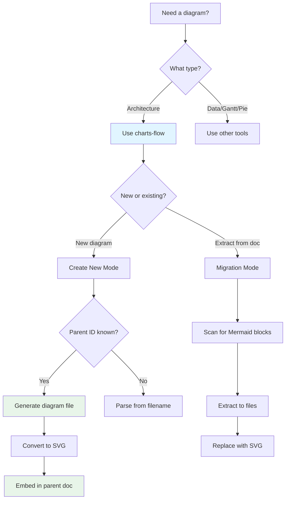
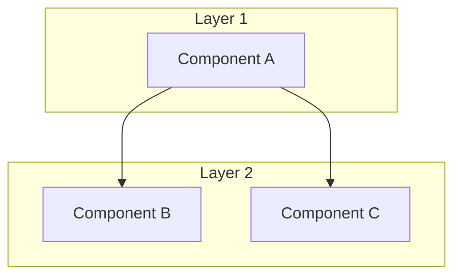
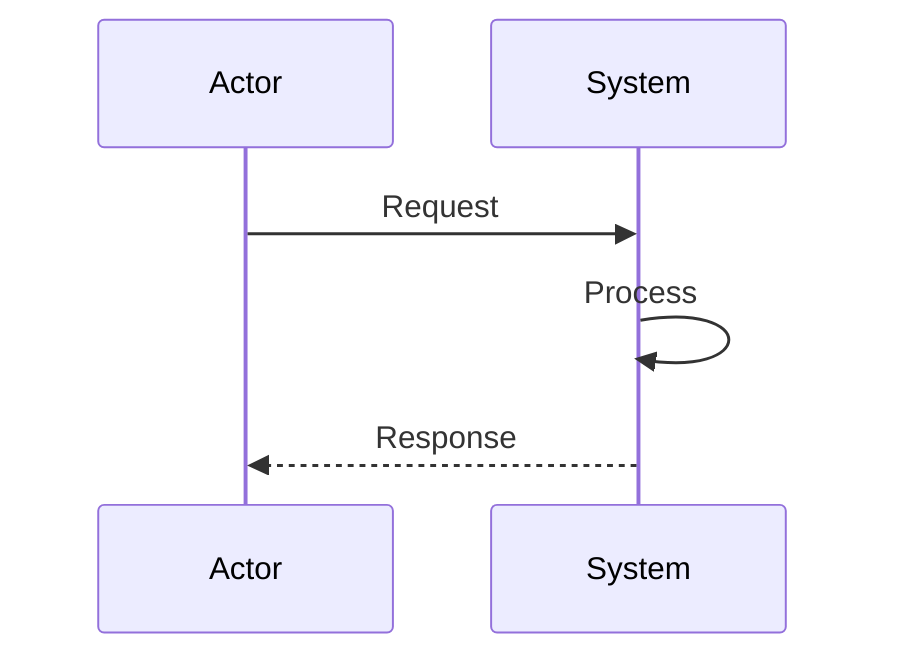
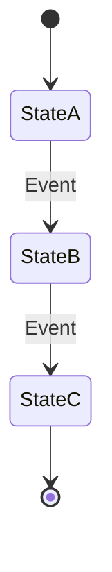
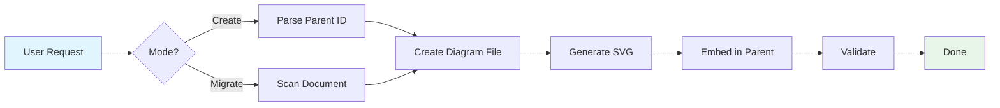

# charts-flow - Quick Reference

**Skill ID**: `charts-flow`
**Version**: 1.0.0
**Purpose**: Create and manage Mermaid architecture diagrams with automatic SVG generation

## Quick Decision Tree



## Invocation

```bash
/skill charts-flow
```

## Common Use Cases

### 1. Create New Flowchart
**When**: Visualizing process flows, decision trees, component hierarchies
**Input**: Parent file path, description, "flowchart"
**Output**: Diagram file + SVG in parent document

### 2. Create Sequence Diagram
**When**: Showing agent interactions, API calls, message flows
**Input**: Parent file path, description, "sequence"
**Output**: Sequence diagram with actors and messages

### 3. Create State Diagram
**When**: Documenting state machines, lifecycle flows
**Input**: Parent file path, description, "state"
**Output**: State transition diagram

### 4. Migrate Existing Diagrams
**When**: Main document has inline Mermaid blocks causing slow rendering
**Input**: Parent file path, migration mode ON
**Output**: Extracted diagram files + SVG previews

## File Naming Pattern

```
{parent_folder}/diagrams/{PARENT-ID}-diag_{description}.md
```

**Diagrams are stored in document type-specific subfolders**:
- BRD: `docs/BRD/diagrams/BRD-001-diag_user_workflow.md`
- PRD: `docs/PRD/diagrams/PRD-001-diag_3_tier_agent_hierarchy.md`
- ADR: `docs/ADR/diagrams/ADR-005-diag_cloud_deployment.md`
- SYS: `docs/SYS/diagrams/SYS-002-diag_data_flow.md`
- IMPL: `docs/IMPL/diagrams/IMPL-010-diag_phases.md`
- Strategy: `option_strategy/diagrams/SSM-V5-diag_state_transitions.md`

## Supported Diagram Types

| Type | Use Case | Example |
|------|----------|---------|
| **flowchart** | Process flows, architecture, component relationships | Agent hierarchies, deployment diagrams |
| **sequence** | Time-based interactions, message flows | API calls, agent communication patterns |
| **class** | Object relationships, data models | System components, data structures |
| **state** | State machines, lifecycle | Trading states, agent states |
| **component** | System architecture (using flowchart + subgraphs) | Multi-tier systems, microservices |
| **deployment** | Infrastructure topology (using flowchart + subgraphs) | Cloud architecture, server layout |

## Quick Templates

### Flowchart Template


### Sequence Template


### State Template


## SVG Generation

### Method 1: Mermaid CLI (Recommended)
```bash
# Install
npm install -g @mermaid-js/mermaid-cli

# Convert
mmdc -i diagram.md -o diagram.svg -b transparent
```

### Method 2: Fallback (Manual)
1. Copy Mermaid code
2. Open https://mermaid.live
3. Paste code
4. Export as SVG
5. Convert to Base64: `base64 -w 0 diagram.svg`

## Embedding in Parent Document

### Reference Link
```markdown
**Visual Diagram**: [PRD-001-diag: Title](diagrams/PRD-001-diag_name.md)
```

### SVG Preview (Collapsible)
```markdown
<details>
<summary>View Diagram (SVG Preview)</summary>


</details>
```

## Quality Checklist

Quick validation before completion:

- [ ] Diagram file in `diagrams/` subfolder
- [ ] Filename: `{PARENT-ID}-diag_{description}.md`
- [ ] Document Control section present
- [ ] Mermaid syntax valid (test at mermaid.live)
- [ ] SVG generated and < 1MB
- [ ] Base64 SVG embedded in parent doc
- [ ] Reference link added to parent doc
- [ ] Both files readable and links work

## Common Errors & Fixes

### Error: `mmdc: command not found`
**Fix**: Install Mermaid CLI
```bash
npm install -g @mermaid-js/mermaid-cli
```

### Error: Invalid Mermaid syntax
**Fix**: Validate at https://mermaid.live before generating SVG

### Error: SVG too large (> 1MB)
**Fix**: Split complex diagram into multiple simpler diagrams

### Error: Cannot determine parent ID
**Fix**: Manually specify parent ID or rename file to include ID prefix

## Workflow Summary



## Tips & Best Practices

1. **Keep diagrams focused**: One concept per diagram (better than one massive diagram)
2. **Use subgraphs**: Group related components for clarity
3. **Limit complexity**: < 20 nodes per diagram for readability
4. **Consistent naming**: Use descriptive, specific diagram names
5. **Test rendering**: Verify SVG displays correctly in GitHub/VS Code
6. **Update both**: If diagram changes, update both Mermaid source and SVG
7. **Version control**: Commit both diagram file and parent document together

## Integration Points

**Works with**:
- `doc-flow` skill (add diagrams to specification documents)
- `google-adk` skill (visualize agent architectures)
- `project-mngt` skill (show dependency graphs)

**Enhances**:
- PRD documents (product architecture)
- ADR documents (architecture decisions)
- SYS documents (system specifications)
- BRD documents (business workflows)

## Example Commands

### Create New Diagram
```
User: "Create a flowchart showing the 3-tier agent hierarchy for PRD-001"
AI: [Invokes charts-flow skill]
    → Parses PRD-001_multi_agent_system_architecture.md
    → Creates PRD-001-diag_3_tier_agent_hierarchy.md
    → Generates SVG
    → Embeds in parent document
```

### Migrate Existing
```
User: "Extract the state machine diagram from strategy_state_machine.md"
AI: [Invokes charts-flow skill in migration mode]
    → Scans for Mermaid blocks
    → Creates SSM-V5-diag_state_transitions.md
    → Replaces inline diagram with SVG + link
```

## File Structure Reference

**Each document type maintains its own diagrams subfolder**:

```
docs/
├── BRD/                              ← Business Requirements Documents
│   ├── BRD-001_trading_reqs.md      ← Parent document (with SVG)
│   └── diagrams/
│       ├── BRD-001-diag_workflow.md ← BRD diagrams
│       └── BRD-001-diag_rules.md
├── PRD/                              ← Product Requirements Documents
│   ├── PRD-001_multi_agent.md       ← Parent document (with SVG)
│   └── diagrams/
│       ├── PRD-001-diag_architecture.md ← PRD diagrams
│       └── PRD-001-diag_components.md
├── ADR/                              ← Architecture Decision Records
│   ├── ADR-005_deployment.md        ← Parent document (with SVG)
│   └── diagrams/
│       └── ADR-005-diag_deploy.md   ← ADR diagrams
├── SYS/                              ← System Specifications
│   ├── SYS-002_data_pipeline.md     ← Parent document (with SVG)
│   └── diagrams/
│       └── SYS-002-diag_flow.md     ← SYS diagrams
└── IMPL/                             ← Implementation Plans
    ├── IMPL-010_phase_1.md          ← Parent document (with SVG)
    └── diagrams/
        └── IMPL-010-diag_phases.md  ← IMPL diagrams
```

## Getting Help

- **Full documentation**: `.claude/skills/charts-flow/SKILL.md`
- **Mermaid syntax**: https://mermaid.js.org/
- **Live editor**: https://mermaid.live
- **Mermaid CLI**: https://github.com/mermaid-js/mermaid-cli

---

**Quick Reference Version**: 1.0.0
**Last Updated**: 2025-01-04
