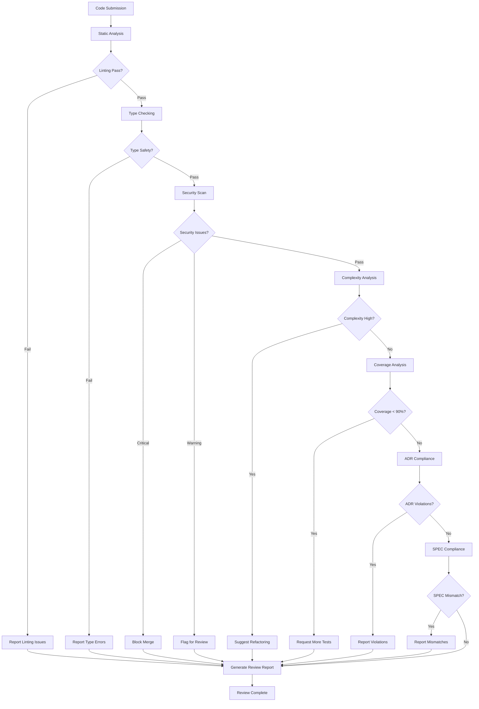

# code-review

**Description**: Automated code quality analysis, static analysis, security scanning, and best practices enforcement

**Category**: Code Quality Assurance

**Complexity**: High (multi-tool integration + analysis)

---

## Purpose

Perform comprehensive code review to ensure quality, security, maintainability, and compliance with architectural decisions (ADRs) and specifications (SPEC). Identifies issues before code reaches production.

---

## Capabilities

### 1. Static Analysis
- **Linting**: pylint, ruff, flake8 integration
- **Type checking**: mypy, pyright for type safety
- **Code style**: PEP 8 compliance, formatting issues
- **Complexity metrics**: cyclomatic complexity, cognitive complexity
- **Code smells**: duplicate code, long methods, god classes

### 2. Security Vulnerability Scanning
- **Dependency vulnerabilities**: bandit, safety checks
- **Security anti-patterns**: SQL injection, XSS, CSRF risks
- **Secret detection**: hardcoded credentials, API keys
- **OWASP Top 10**: Common security vulnerabilities
- **CWE mapping**: Common Weakness Enumeration references

### 3. Best Practices Enforcement
- **Design patterns**: Proper pattern usage
- **SOLID principles**: Violation detection
- **DRY principle**: Code duplication analysis
- **Error handling**: Exception management review
- **Resource management**: Memory leaks, file handle leaks

### 4. Code Coverage Analysis
- **Line coverage**: Percentage of executed lines
- **Branch coverage**: Conditional path coverage
- **Function coverage**: Tested vs untested functions
- **Gap identification**: Uncovered critical paths

### 5. Architectural Compliance
- **ADR validation**: Code aligns with architecture decisions
- **SPEC compliance**: Implementation matches specifications
- **Dependency rules**: No circular dependencies, proper layering
- **API contract adherence**: Matches CTR definitions

### 6. Performance Analysis
- **Inefficient algorithms**: O(n²) where O(n) possible
- **Memory usage**: Excessive allocations
- **Database queries**: N+1 query problems
- **Caching opportunities**: Repeated expensive operations

### 7. Documentation Quality
- **Docstring coverage**: Missing or inadequate documentation
- **Comment quality**: Outdated or misleading comments
- **API documentation**: Public method documentation
- **Type hints**: Missing type annotations

### 8. Automated Fix Suggestions
- **Auto-fixable issues**: Formatting, imports, simple refactorings
- **Refactoring recommendations**: Extract method, simplify conditions
- **Performance optimizations**: Suggest faster alternatives
- **Security patches**: Fix common vulnerabilities

---

## Code Review Workflow



---

## Usage Instructions

### Review Single File

```bash
code-review analyze --file src/auth/service.py
```

Output:
```
=== Code Review Report: src/auth/service.py ===

Issues Found: 8

[CRITICAL] Security Issue (Line 45)
- SQL Injection vulnerability in user_login()
- Direct string concatenation in SQL query
- CWE-89: SQL Injection
→ Fix: Use parameterized queries

[ERROR] Type Safety (Line 78)
- Missing return type annotation for validate_token()
- mypy: Function return type cannot be inferred
→ Fix: Add return type hint -> bool

[WARNING] Complexity (Line 112-156)
- Cyclomatic complexity: 12 (threshold: 10)
- Method authenticate_user() too complex
→ Suggestion: Extract validation logic to separate methods

[WARNING] Code Duplication (Lines 201-215, 234-248)
- 15 lines duplicated with 95% similarity
→ Suggestion: Extract common logic to validate_password_strength()

[INFO] Documentation (Line 89)
- Missing docstring for public method reset_password()
→ Suggestion: Add docstring with parameter and return descriptions

[INFO] Performance (Line 167)
- N+1 query detected in get_user_permissions()
→ Suggestion: Use JOIN or prefetch related data

Coverage: 87% (Below 90% threshold)
- Uncovered lines: 45-47, 89-91, 134-136
→ Action: Add tests for error handling paths

ADR Compliance: 1 violation
- ADR-003 requires JWT tokens, code uses session cookies
→ Action: Update implementation to use JWT

Total Score: 72/100 (Acceptable with improvements)
```

### Review Entire Module

```bash
code-review analyze --module src/auth
```

### Review Changed Files (Git)

```bash
code-review analyze --diff HEAD~1..HEAD
```

### Review with Auto-fix

```bash
code-review analyze --file src/auth/service.py --auto-fix
```

---

## Analysis Categories

### 1. Security Analysis

**Tools**: bandit, safety, semgrep

**Checks**:
- SQL injection vulnerabilities
- XSS attack vectors
- CSRF token validation
- Hardcoded secrets
- Insecure randomness
- Path traversal risks
- Command injection
- Insecure deserialization
- Weak cryptography

**Severity Levels**:
- **CRITICAL**: Immediate security risk (block merge)
- **HIGH**: Serious vulnerability (requires fix)
- **MEDIUM**: Potential security issue (review required)
- **LOW**: Security best practice violation

**Example**:
```python
# CRITICAL: SQL Injection
query = f"SELECT * FROM users WHERE username = '{username}'"  # ❌

# FIX
query = "SELECT * FROM users WHERE username = %s"
cursor.execute(query, (username,))  # ✓

# CRITICAL: Hardcoded Secret
API_KEY = "sk-1234567890abcdef"  # ❌

# FIX
API_KEY = os.environ.get('API_KEY')  # ✓
```

---

### 2. Code Quality Analysis

**Tools**: pylint, ruff, radon

**Checks**:
- PEP 8 compliance
- Cyclomatic complexity
- Maintainability index
- Code duplication
- Dead code
- Unused imports/variables
- Magic numbers
- Long functions/classes

**Complexity Thresholds**:
- **A (1-5)**: Simple, easy to maintain
- **B (6-10)**: Moderate complexity
- **C (11-20)**: High complexity (refactor recommended)
- **D (21-50)**: Very high complexity (refactor required)
- **F (>50)**: Extreme complexity (immediate refactor)

**Example**:
```python
# Complexity: 12 (High)
def process_order(order):  # ❌
    if order.status == 'pending':
        if order.payment_verified:
            if order.items_available:
                if order.shipping_valid:
                    # ... nested logic
                    pass

# FIX: Complexity: 4 (Simple)
def process_order(order):  # ✓
    if not can_process_order(order):
        return False

    return execute_order_processing(order)

def can_process_order(order):
    return (order.status == 'pending' and
            order.payment_verified and
            order.items_available and
            order.shipping_valid)
```

---

### 3. Type Safety Analysis

**Tools**: mypy, pyright

**Checks**:
- Missing type hints
- Type incompatibilities
- Invalid type casting
- Optional value handling
- Generic type usage
- Protocol compliance

**Example**:
```python
# Type error: Missing return type
def calculate_total(items):  # ❌
    return sum(item.price for item in items)

# FIX
def calculate_total(items: list[Item]) -> Decimal:  # ✓
    return sum(item.price for item in items)

# Type error: None not handled
def get_user(user_id: int) -> User:  # ❌
    return database.query(User).get(user_id)  # May return None

# FIX
def get_user(user_id: int) -> User | None:  # ✓
    return database.query(User).get(user_id)
```

---

### 4. Performance Analysis

**Checks**:
- Inefficient algorithms
- Memory leaks
- N+1 query problems
- Unnecessary loops
- Missing caching
- Blocking I/O operations
- Large memory allocations

**Example**:
```python
# Performance issue: N+1 queries
def get_users_with_permissions():  # ❌
    users = User.query.all()
    for user in users:
        user.permissions = Permission.query.filter_by(user_id=user.id).all()
    return users

# FIX: Single query with JOIN
def get_users_with_permissions():  # ✓
    return User.query.options(
        joinedload(User.permissions)
    ).all()

# Performance issue: Inefficient algorithm O(n²)
def find_duplicates(items):  # ❌
    duplicates = []
    for i, item1 in enumerate(items):
        for item2 in items[i+1:]:
            if item1 == item2:
                duplicates.append(item1)
    return duplicates

# FIX: O(n) with set
def find_duplicates(items):  # ✓
    seen = set()
    duplicates = set()
    for item in items:
        if item in seen:
            duplicates.add(item)
        seen.add(item)
    return list(duplicates)
```

---

### 5. Best Practices Analysis

**Checks**:
- SOLID principles
- DRY (Don't Repeat Yourself)
- KISS (Keep It Simple)
- YAGNI (You Aren't Gonna Need It)
- Error handling patterns
- Resource management
- Logging practices

**Example**:
```python
# Violation: Single Responsibility Principle
class UserManager:  # ❌
    def create_user(self, data):
        # Validates data
        # Saves to database
        # Sends email
        # Logs action
        pass

# FIX: Separate responsibilities
class UserValidator:  # ✓
    def validate(self, data): pass

class UserRepository:
    def save(self, user): pass

class EmailService:
    def send_welcome_email(self, user): pass

class AuditLogger:
    def log_user_creation(self, user): pass
```

---

### 6. Documentation Analysis

**Checks**:
- Missing docstrings
- Incomplete docstrings
- Outdated comments
- Type hint documentation
- API documentation
- Example usage

**Example**:
```python
# Poor documentation
def process(data):  # ❌
    # Process the data
    return result

# Good documentation
def process_user_registration(  # ✓
    user_data: dict[str, Any]
) -> User:
    """
    Process new user registration with validation and persistence.

    Args:
        user_data: Dictionary containing user registration information
            Required keys: username, email, password
            Optional keys: full_name, phone_number

    Returns:
        User: Newly created user instance with assigned ID

    Raises:
        ValidationError: If user_data fails validation
        DatabaseError: If user cannot be persisted
        DuplicateUserError: If username or email already exists

    Example:
        >>> user = process_user_registration({
        ...     'username': 'johndoe',
        ...     'email': 'john@example.com',
        ...     'password': 'SecureP@ss123'
        ... })
        >>> user.id
        12345
    """
    validated_data = UserValidator.validate(user_data)
    user = User.create(validated_data)
    return UserRepository.save(user)
```

---

### 7. ADR Compliance Analysis

**Checks**:
- Architecture decision adherence
- Technology stack compliance
- Design pattern usage
- API design standards
- Data flow patterns

**Example**:
```python
# ADR-003: All authentication must use JWT tokens

# Violation
@app.route('/login', methods=['POST'])  # ❌
def login():
    # ... authentication logic
    session['user_id'] = user.id  # Using sessions, not JWT
    return jsonify({'success': True})

# Compliant
@app.route('/login', methods=['POST'])  # ✓
def login():
    # ... authentication logic
    token = jwt.encode(
        {'user_id': user.id, 'exp': datetime.utcnow() + timedelta(hours=1)},
        SECRET_KEY,
        algorithm='HS256'
    )
    return jsonify({'token': token})
```

---

### 8. SPEC Compliance Analysis

**Checks**:
- Implementation matches specifications
- API signatures correct
- Data structures match schemas
- Business logic correct
- Error handling as specified

**Example**:
```python
# SPEC-AUTH-V1: Password validation requirements

# SPEC violation: Missing uppercase requirement
def validate_password(password: str) -> bool:  # ❌
    return (
        len(password) >= 8 and
        any(c.islower() for c in password) and
        any(c.isdigit() for c in password)
    )

# SPEC compliant
def validate_password(password: str) -> bool:  # ✓
    return (
        8 <= len(password) <= 20 and
        any(c.isupper() for c in password) and  # Missing requirement
        any(c.islower() for c in password) and
        any(c.isdigit() for c in password) and
        any(c in '!@#$%^&*' for c in password)
    )
```

---

## Review Score Calculation

```python
score = (
    security_score * 0.30 +      # 30% weight
    quality_score * 0.25 +        # 25% weight
    type_safety_score * 0.15 +    # 15% weight
    coverage_score * 0.15 +       # 15% weight
    documentation_score * 0.10 +  # 10% weight
    performance_score * 0.05      # 5% weight
)

# Score categories
90-100: Excellent (merge approved)
80-89:  Good (minor improvements recommended)
70-79:  Acceptable (improvements required)
60-69:  Needs work (significant issues)
<60:    Poor (major rework needed)
```

---

## Tool Access

Required tools:
- `Read`: Read source code files
- `Bash`: Execute analysis tools (pylint, mypy, bandit)
- `Grep`: Search for patterns and violations
- `Glob`: Find code files

Required libraries:
- pylint
- ruff
- mypy / pyright
- bandit
- safety
- radon
- coverage
- semgrep

---

## Integration Points

### With test-automation
- Verify test coverage meets thresholds
- Identify untested code paths
- Validate test quality

### With doc-validator
- Check code documentation quality
- Validate traceability references in code
- Ensure code comments follow standards

### With security-audit
- Share security vulnerability findings
- Coordinate security fixes
- Track security metrics

### With refactor-flow
- Identify refactoring opportunities
- Provide complexity metrics
- Suggest code improvements

---

## Auto-fix Capabilities

### Safe Auto-fixes (Applied Automatically)
- Import sorting
- Code formatting (black, autopep8)
- Trailing whitespace removal
- Missing blank lines
- Unused imports removal
- Simple type hint additions

### Suggested Fixes (Requires Approval)
- Extract method refactorings
- Complexity reduction
- Performance optimizations
- Security vulnerability patches
- Documentation additions

---

## CI/CD Integration

```yaml
# .github/workflows/code-review.yml
name: Automated Code Review

on: [pull_request]

jobs:
  code-review:
    runs-on: ubuntu-latest
    steps:
      - uses: actions/checkout@v3
      - name: Run code review
        run: |
          code-review analyze --diff origin/main..HEAD

      - name: Check quality gate
        run: |
          if [ $CODE_REVIEW_SCORE -lt 70 ]; then
            echo "Code quality below threshold"
            exit 1
          fi
```

---

## Best Practices

1. **Review early and often**: Don't wait until PR stage
2. **Fix critical issues immediately**: Security and correctness first
3. **Track metrics over time**: Monitor code quality trends
4. **Automate in CI/CD**: Prevent poor code from merging
5. **Prioritize issues**: Focus on high-impact problems
6. **Provide context**: Explain why issues matter
7. **Suggest solutions**: Don't just identify problems
8. **Balance strictness**: Don't block progress over minor style issues

---

## Limitations

1. Cannot understand business logic intent
2. May produce false positives (requires human review)
3. Cannot detect all security vulnerabilities
4. Performance analysis limited to obvious patterns
5. ADR/SPEC compliance requires manual rule definition
6. Tool installation and configuration required

---

## Future Enhancements

1. AI-powered code understanding and suggestions
2. Learning from historical code reviews
3. Custom rule engine for project-specific standards
4. Visual code quality dashboards
5. Automated dependency updates
6. Predictive bug detection
7. Code smell trend analysis

---

## Success Criteria

- Zero critical security vulnerabilities
- Code quality score ≥80/100
- Type safety: 100% type hints on public APIs
- Coverage ≥90%
- Complexity: No functions with complexity >10
- Zero ADR violations
- Zero SPEC mismatches

---

## Notes

- Review reports saved to `reports/code-review/`
- Historical metrics tracked in `metrics/code-quality.json`
- Auto-fixes require approval unless configured otherwise
- Security issues always block merge
- Can be customized per project with `.code-review.yml` config
