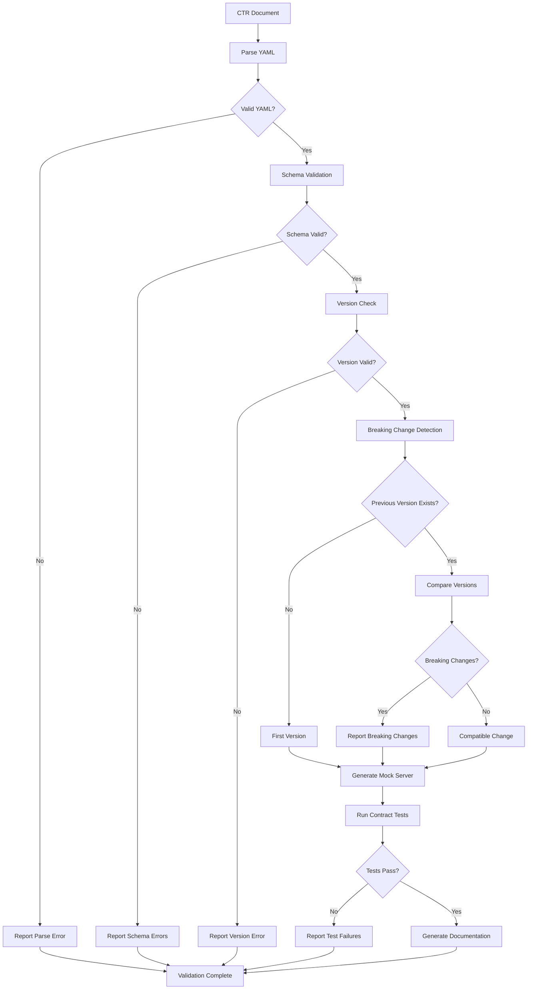

# contract-tester

**Description**: API contract validation, breaking change detection, and consumer-driven contract testing

**Category**: API Quality Assurance

**Complexity**: Medium-High (schema validation + contract compatibility)

---

## Purpose

Validate API implementations against CTR (Contract) documents, detect breaking changes, and ensure provider-consumer compatibility. Prevents API contract violations before deployment.

---

## Capabilities

### 1. CTR YAML Schema Validation
- Validate YAML structure against schema
- Check required fields completeness
- Verify data type correctness
- Validate enum values
- Check format specifications (email, URL, UUID)

### 2. OpenAPI/AsyncAPI Compliance
- Convert CTR to OpenAPI 3.0/3.1 spec
- Validate against OpenAPI schema
- AsyncAPI validation for event-driven APIs
- JSON Schema validation
- GraphQL schema validation

### 3. Contract Versioning
- Semantic versioning validation (MAJOR.MINOR.PATCH)
- Version compatibility checking
- Deprecation warnings
- Migration path validation

### 4. Breaking Change Detection
- Removed endpoints/operations
- Changed request/response schemas
- Removed required fields
- Changed field types
- Stricter validation rules
- Changed authentication requirements

### 5. Mock Server Generation
- Generate mock API server from CTR
- Realistic response generation
- Configurable response delays
- Error scenario simulation
- State management for stateful APIs

### 6. Consumer-Driven Contract Testing
- Pact contract testing
- Provider verification
- Consumer contract generation
- Bidirectional contract testing
- Contract evolution tracking

### 7. Contract Compatibility Matrix
- Provider version compatibility
- Consumer version support
- Deprecation timeline tracking
- Migration requirements

### 8. API Documentation Generation
- Generate API documentation from CTR
- Interactive API explorer
- Code examples in multiple languages
- Authentication guides

---

## Contract Testing Workflow



---

## Usage Instructions

### Validate CTR Document

```bash
contract-tester validate --file ctrs/CTR-USER-V1.yaml
```

Output:
```
=== Contract Validation Report: CTR-USER-V1 ===

Status: PASS

Schema Validation: ✓
- Service name: user-service
- Version: 1.0.0
- Protocol: REST
- Endpoints: 5
- Models: 3

OpenAPI Compliance: ✓
- Valid OpenAPI 3.1 specification
- All schemas properly defined
- Authentication specified (Bearer JWT)

Version Check: ✓
- Semantic versioning: 1.0.0
- No previous version (initial release)

Breaking Changes: N/A (initial release)

Warnings (1):
- Endpoint DELETE /users/{id} lacks rate limiting specification
  → Recommendation: Add rate limiting to prevent abuse

Summary: Contract is valid and ready for implementation
```

### Detect Breaking Changes

```bash
contract-tester diff \
  --previous ctrs/CTR-USER-V1.yaml \
  --current ctrs/CTR-USER-V2.yaml
```

Output:
```
=== Breaking Change Analysis: V1 → V2 ===

BREAKING CHANGES (3):

1. [CRITICAL] Removed endpoint
   - DELETE /users/{id}
   - Impact: Consumers using this endpoint will fail
   - Migration: Use DELETE /users/{id}/deactivate instead

2. [CRITICAL] Changed response type
   - Endpoint: GET /users/{id}
   - Field: created_at
   - V1: string (format: date-time)
   - V2: integer (unix timestamp)
   - Impact: Date parsing will fail in consumers
   - Migration: Update consumers to handle unix timestamp

3. [MAJOR] Added required field
   - Endpoint: POST /users
   - Field: email_verified (boolean, required)
   - Impact: Existing POST requests missing this field will fail
   - Migration: Update all POST requests to include email_verified

NON-BREAKING CHANGES (2):

1. [MINOR] Added optional field
   - Endpoint: GET /users/{id}
   - Field: last_login (string, optional)
   - Impact: None (backward compatible)

2. [PATCH] Fixed typo in description
   - Model: User
   - Field: username
   - Impact: Documentation only

RECOMMENDATION: Version should be 2.0.0 (MAJOR bump due to breaking changes)
Current version: 1.1.0 ❌
Suggested version: 2.0.0 ✓
```

### Generate Mock Server

```bash
contract-tester mock \
  --file ctrs/CTR-USER-V1.yaml \
  --port 8080 \
  --response-delay 100ms
```

Mock server features:
- Realistic data generation based on schemas
- Configurable response delays
- Error scenario injection
- Request validation
- Response logging

```bash
# Test against mock server
curl http://localhost:8080/api/users/123

# Response
{
  "user_id": "123e4567-e89b-12d3-a456-426614174000",
  "username": "john_doe",
  "email": "john.doe@example.com",
  "created_at": "2025-01-15T10:30:00Z",
  "status": "active"
}
```

### Run Consumer Contract Tests

```bash
contract-tester test-consumer \
  --contract ctrs/CTR-USER-V1.yaml \
  --consumer user-frontend \
  --provider user-service \
  --output reports/contract-tests/
```

Generated Pact test:
```python
import pytest
from pact import Consumer, Provider, Like, EachLike, Term

@pytest.fixture
def pact():
    return Consumer('user-frontend').has_pact_with(
        Provider('user-service'),
        pact_dir='./pacts'
    )

def test_get_user_contract(pact):
    """Verify GET /users/{id} contract"""
    expected_response = {
        'user_id': Like('123e4567-e89b-12d3-a456-426614174000'),
        'username': Like('john_doe'),
        'email': Term(r'.+@.+\..+', 'john.doe@example.com'),
        'created_at': Like('2025-01-15T10:30:00Z'),
        'status': Term(r'active|inactive|suspended', 'active')
    }

    (pact
     .given('user with id 123 exists')
     .upon_receiving('a request for user 123')
     .with_request('GET', '/api/users/123')
     .will_respond_with(200, body=expected_response))

    with pact:
        result = user_api.get_user('123')
        assert result.status_code == 200
        assert 'user_id' in result.json()
```

### Verify Provider Implementation

```bash
contract-tester test-provider \
  --contract ctrs/CTR-USER-V1.yaml \
  --provider-url http://localhost:8000 \
  --output reports/provider-verification/
```

---

## CTR Document Structure

### Complete CTR Example

```yaml
# ctrs/CTR-USER-V1.yaml
contract_id: CTR-USER-V1
version: 1.0.0
service_name: user-service
protocol: REST
base_path: /api

metadata:
  description: User management API contract
  owner: backend-team
  consumers:
    - user-frontend
    - admin-dashboard
  traceability:
    requirements:
      - REQ-USER-001
      - REQ-USER-002
    specifications:
      - SPEC-API-V1

authentication:
  type: bearer
  scheme: JWT
  token_location: header
  header_name: Authorization

endpoints:
  - operation_id: get_user
    method: GET
    path: /users/{id}
    summary: Retrieve user by ID
    parameters:
      - name: id
        in: path
        required: true
        schema:
          type: string
          format: uuid
    responses:
      200:
        description: User found
        content:
          application/json:
            schema:
              $ref: '#/components/schemas/User'
      404:
        description: User not found
        content:
          application/json:
            schema:
              $ref: '#/components/schemas/Error'
      401:
        description: Unauthorized
    rate_limit:
      requests: 100
      window: 60s

  - operation_id: create_user
    method: POST
    path: /users
    summary: Create new user
    request_body:
      required: true
      content:
        application/json:
          schema:
            $ref: '#/components/schemas/CreateUserRequest'
    responses:
      201:
        description: User created
        content:
          application/json:
            schema:
              $ref: '#/components/schemas/User'
      400:
        description: Invalid request
        content:
          application/json:
            schema:
              $ref: '#/components/schemas/Error'
      409:
        description: User already exists

  - operation_id: update_user
    method: PUT
    path: /users/{id}
    summary: Update user
    parameters:
      - name: id
        in: path
        required: true
        schema:
          type: string
          format: uuid
    request_body:
      required: true
      content:
        application/json:
          schema:
            $ref: '#/components/schemas/UpdateUserRequest'
    responses:
      200:
        description: User updated
        content:
          application/json:
            schema:
              $ref: '#/components/schemas/User'
      404:
        description: User not found

  - operation_id: delete_user
    method: DELETE
    path: /users/{id}
    summary: Delete user
    parameters:
      - name: id
        in: path
        required: true
        schema:
          type: string
          format: uuid
    responses:
      204:
        description: User deleted
      404:
        description: User not found

  - operation_id: list_users
    method: GET
    path: /users
    summary: List all users
    parameters:
      - name: page
        in: query
        schema:
          type: integer
          minimum: 1
          default: 1
      - name: limit
        in: query
        schema:
          type: integer
          minimum: 1
          maximum: 100
          default: 20
    responses:
      200:
        description: User list
        content:
          application/json:
            schema:
              type: object
              properties:
                users:
                  type: array
                  items:
                    $ref: '#/components/schemas/User'
                pagination:
                  $ref: '#/components/schemas/Pagination'

components:
  schemas:
    User:
      type: object
      required:
        - user_id
        - username
        - email
        - created_at
        - status
      properties:
        user_id:
          type: string
          format: uuid
          description: Unique user identifier
        username:
          type: string
          minLength: 3
          maxLength: 20
          pattern: '^[a-zA-Z0-9_]+$'
          description: Unique username
        email:
          type: string
          format: email
          description: User email address
        full_name:
          type: string
          maxLength: 100
          description: User's full name
        created_at:
          type: string
          format: date-time
          description: Account creation timestamp
        updated_at:
          type: string
          format: date-time
          description: Last update timestamp
        status:
          type: string
          enum: [active, inactive, suspended]
          description: Account status

    CreateUserRequest:
      type: object
      required:
        - username
        - email
        - password
      properties:
        username:
          type: string
          minLength: 3
          maxLength: 20
          pattern: '^[a-zA-Z0-9_]+$'
        email:
          type: string
          format: email
        password:
          type: string
          minLength: 8
          maxLength: 128
        full_name:
          type: string
          maxLength: 100

    UpdateUserRequest:
      type: object
      properties:
        email:
          type: string
          format: email
        full_name:
          type: string
          maxLength: 100
        status:
          type: string
          enum: [active, inactive, suspended]

    Error:
      type: object
      required:
        - error_code
        - message
      properties:
        error_code:
          type: string
          description: Machine-readable error code
        message:
          type: string
          description: Human-readable error message
        details:
          type: object
          description: Additional error details

    Pagination:
      type: object
      required:
        - page
        - limit
        - total
      properties:
        page:
          type: integer
          description: Current page number
        limit:
          type: integer
          description: Items per page
        total:
          type: integer
          description: Total number of items
        has_next:
          type: boolean
          description: Whether there are more pages
```

---

## Breaking Change Rules

### MAJOR Version Changes (X.0.0)

1. **Removed Endpoints**
   ```yaml
   # V1
   DELETE /users/{id}

   # V2 (BREAKING)
   # Endpoint removed
   ```

2. **Removed Required Fields**
   ```yaml
   # V1
   required: [username, email, password]

   # V2 (BREAKING)
   required: [username, email]  # password removed
   ```

3. **Changed Field Types**
   ```yaml
   # V1
   user_id:
     type: string

   # V2 (BREAKING)
   user_id:
     type: integer
   ```

4. **Stricter Validation**
   ```yaml
   # V1
   username:
     type: string

   # V2 (BREAKING)
   username:
     type: string
     pattern: '^[a-zA-Z0-9_]+$'  # New constraint
   ```

5. **Changed Authentication**
   ```yaml
   # V1
   authentication:
     type: basic

   # V2 (BREAKING)
   authentication:
     type: bearer
     scheme: JWT
   ```

### MINOR Version Changes (x.Y.0)

1. **New Endpoints**
   ```yaml
   # V1.0.0
   GET /users

   # V1.1.0 (Non-breaking)
   GET /users
   GET /users/search  # New endpoint
   ```

2. **New Optional Fields**
   ```yaml
   # V1.0.0
   properties:
     username: ...

   # V1.1.0 (Non-breaking)
   properties:
     username: ...
     nickname: ...  # New optional field
   ```

3. **Relaxed Validation**
   ```yaml
   # V1.0.0
   username:
     minLength: 5

   # V1.1.0 (Non-breaking)
   username:
     minLength: 3  # Less strict
   ```

### PATCH Version Changes (x.y.Z)

1. **Documentation Updates**
2. **Bug Fixes in Descriptions**
3. **Typo Corrections**
4. **Example Updates**

---

## Contract Compatibility Matrix

```
Provider Version Compatibility:

V1.0.0 consumers can use:
- V1.0.0, V1.0.1, V1.1.0, V1.2.0 providers ✓
- V2.0.0 providers ❌ (breaking changes)

V1.1.0 consumers can use:
- V1.1.0, V1.1.1, V1.2.0 providers ✓
- V1.0.0 providers ⚠️ (missing optional features)
- V2.0.0 providers ❌ (breaking changes)

V2.0.0 consumers can use:
- V2.0.0, V2.0.1, V2.1.0 providers ✓
- V1.x.x providers ❌ (incompatible)
```

---

## Tool Access

Required tools:
- `Read`: Read CTR YAML files
- `Write`: Generate test files and documentation
- `Bash`: Execute validation and testing tools
- `Grep`: Search for contract patterns

Required libraries:
- pyyaml: YAML parsing
- jsonschema: Schema validation
- openapi-spec-validator: OpenAPI validation
- pact-python: Consumer-driven contract testing
- faker: Mock data generation

---

## Integration Points

### With doc-flow
- Validate CTR documents during generation
- Ensure traceability to requirements
- Update documentation on contract changes

### With test-automation
- Generate contract tests automatically
- Integrate with test suites
- Track contract test coverage

### With code-review
- Validate API implementation against contracts
- Detect contract violations in code
- Suggest contract-compliant fixes

### With devops-flow
- Contract validation in CI/CD pipelines
- Block deployments with breaking changes
- Generate API gateway configurations

---

## Best Practices

1. **Semantic versioning**: Follow MAJOR.MINOR.PATCH strictly
2. **Backward compatibility**: Prefer additive changes
3. **Deprecation notices**: Warn before removing features
4. **Consumer feedback**: Involve consumers in contract changes
5. **Documentation**: Clear migration guides for breaking changes
6. **Testing**: Test all contract changes before release
7. **Versioning strategy**: Support N-1 versions minimum
8. **Change log**: Maintain comprehensive contract changelog

---

## Success Criteria

- 100% contract validation coverage
- Zero undetected breaking changes
- <5 minute contract validation time
- 100% consumer-provider compatibility in same MAJOR version
- All breaking changes documented with migration paths
- Mock servers available for all contracts
- All CTR documents include complete Document Control sections with:
  - Project metadata (name, version, date, owner, preparer, status)
  - Document Revision History table tracking all contract changes

---

## Notes

- Contract tests run in CI/CD before deployment
- Breaking changes require MAJOR version bump
- Provider must maintain backward compatibility within MAJOR version
- Consumers should handle minor version differences gracefully
- Contract changes trigger automatic notification to consumers
