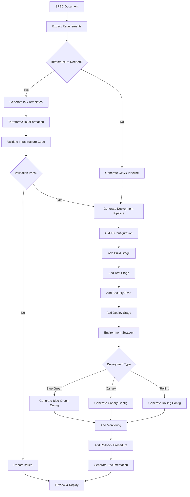

# devops-flow

**Description**: Infrastructure as Code, CI/CD pipeline automation, and deployment management

**Category**: DevOps & Deployment

**Complexity**: High (multi-cloud + orchestration + automation)

---

## Purpose

Automate infrastructure provisioning, CI/CD pipelines, and deployment processes based on SPEC documents and ADR decisions. Ensures consistent, repeatable, and secure deployments across environments.

---

## Capabilities

### 1. Infrastructure as Code (IaC)
- **Terraform**: Cloud-agnostic infrastructure provisioning
- **CloudFormation**: AWS-native infrastructure
- **Ansible**: Configuration management and provisioning
- **Pulumi**: Modern IaC with standard programming languages
- **Kubernetes manifests**: Container orchestration

### 2. CI/CD Pipeline Generation
- **GitHub Actions**: Workflow automation
- **GitLab CI**: Pipeline configuration
- **Jenkins**: Pipeline as code
- **CircleCI**: Cloud-native CI/CD
- **Azure DevOps**: Microsoft ecosystem integration

### 3. Container Configuration
- **Dockerfile**: Container image definition
- **Docker Compose**: Multi-container applications
- **Kubernetes**: Production orchestration
- **Helm charts**: Kubernetes package management
- **Container registry**: Image storage and versioning

### 4. Deployment Strategies
- **Blue-Green**: Zero-downtime deployments
- **Canary**: Gradual rollout with monitoring
- **Rolling**: Sequential instance updates
- **Feature flags**: Progressive feature enablement
- **Rollback procedures**: Automated failure recovery

### 5. Environment Management
- **Environment separation**: dev, staging, production
- **Configuration management**: Environment-specific configs
- **Secret management**: Vault, AWS Secrets Manager, etc.
- **Infrastructure versioning**: State management
- **Cost optimization**: Resource tagging and monitoring

### 6. Monitoring & Observability
- **Logging**: Centralized log aggregation
- **Metrics**: Performance and health monitoring
- **Alerting**: Incident response automation
- **Tracing**: Distributed request tracking
- **Dashboards**: Real-time visualization

### 7. Security & Compliance
- **Security scanning**: Container and infrastructure
- **Compliance checks**: Policy enforcement
- **Access control**: IAM and RBAC
- **Network security**: Firewall rules, VPC configuration
- **Audit logging**: Change tracking

### 8. Disaster Recovery
- **Backup automation**: Data and configuration backups
- **Recovery procedures**: Automated restoration
- **Failover**: Multi-region redundancy
- **Data replication**: Cross-region sync
- **RTO/RPO**: Recovery objectives implementation

---

## DevOps Workflow



---

## Usage Instructions

### Generate Infrastructure from SPEC

```bash
devops-flow generate-infra \
  --spec specs/SPEC-API-V1.md \
  --cloud aws \
  --output infrastructure/
```

Generated Terraform structure:
```
infrastructure/
├── main.tf              # Main configuration
├── variables.tf         # Input variables
├── outputs.tf           # Output values
├── providers.tf         # Cloud provider config
├── modules/
│   ├── vpc/            # Network infrastructure
│   ├── compute/        # EC2, Lambda, etc.
│   ├── database/       # RDS, DynamoDB
│   └── storage/        # S3, EBS
└── environments/
    ├── dev.tfvars      # Development config
    ├── staging.tfvars  # Staging config
    └── prod.tfvars     # Production config
```

### Generate CI/CD Pipeline

```bash
devops-flow generate-pipeline \
  --type github-actions \
  --language python \
  --deploy-strategy blue-green \
  --output .github/workflows/
```

Generated GitHub Actions workflow:
```yaml
name: CI/CD Pipeline

on:
  push:
    branches: [main, develop]
  pull_request:
    branches: [main]

env:
  PYTHON_VERSION: '3.11'
  AWS_REGION: us-east-1

jobs:
  lint:
    runs-on: ubuntu-latest
    steps:
      - uses: actions/checkout@v3
      - name: Set up Python
        uses: actions/setup-python@v4
        with:
          python-version: ${{ env.PYTHON_VERSION }}
      - name: Install dependencies
        run: |
          pip install ruff mypy
      - name: Run linters
        run: |
          ruff check .
          mypy .

  test:
    needs: lint
    runs-on: ubuntu-latest
    steps:
      - uses: actions/checkout@v3
      - name: Run tests
        run: |
          pytest --cov=. --cov-report=xml
      - name: Upload coverage
        uses: codecov/codecov-action@v3

  security:
    needs: test
    runs-on: ubuntu-latest
    steps:
      - uses: actions/checkout@v3
      - name: Security scan
        run: |
          bandit -r . -f json -o security-report.json
      - name: Upload security report
        uses: actions/upload-artifact@v3
        with:
          name: security-report
          path: security-report.json

  build:
    needs: [lint, test, security]
    runs-on: ubuntu-latest
    steps:
      - uses: actions/checkout@v3
      - name: Build Docker image
        run: |
          docker build -t app:${{ github.sha }} .
      - name: Push to registry
        run: |
          docker push registry.example.com/app:${{ github.sha }}

  deploy-staging:
    needs: build
    if: github.ref == 'refs/heads/develop'
    runs-on: ubuntu-latest
    environment: staging
    steps:
      - name: Deploy to staging
        run: |
          aws ecs update-service \
            --cluster staging-cluster \
            --service app-service \
            --force-new-deployment

  deploy-production:
    needs: build
    if: github.ref == 'refs/heads/main'
    runs-on: ubuntu-latest
    environment: production
    steps:
      - name: Deploy blue-green
        run: |
          # Deploy to green environment
          ./scripts/deploy-green.sh
          # Run smoke tests
          ./scripts/smoke-tests.sh
          # Switch traffic to green
          ./scripts/switch-traffic.sh
          # Keep blue for rollback
```

### Generate Kubernetes Configuration

```bash
devops-flow generate-k8s \
  --spec specs/SPEC-API-V1.md \
  --replicas 3 \
  --output k8s/
```

Generated Kubernetes manifests:
```yaml
# k8s/deployment.yaml
apiVersion: apps/v1
kind: Deployment
metadata:
  name: api-service
  labels:
    app: api
    version: v1
spec:
  replicas: 3
  selector:
    matchLabels:
      app: api
  template:
    metadata:
      labels:
        app: api
        version: v1
    spec:
      containers:
      - name: api
        image: registry.example.com/api:latest
        ports:
        - containerPort: 8000
        env:
        - name: DATABASE_URL
          valueFrom:
            secretKeyRef:
              name: api-secrets
              key: database-url
        resources:
          requests:
            memory: "256Mi"
            cpu: "250m"
          limits:
            memory: "512Mi"
            cpu: "500m"
        livenessProbe:
          httpGet:
            path: /health
            port: 8000
          initialDelaySeconds: 30
          periodSeconds: 10
        readinessProbe:
          httpGet:
            path: /ready
            port: 8000
          initialDelaySeconds: 5
          periodSeconds: 5

---
# k8s/service.yaml
apiVersion: v1
kind: Service
metadata:
  name: api-service
spec:
  selector:
    app: api
  ports:
  - protocol: TCP
    port: 80
    targetPort: 8000
  type: LoadBalancer

---
# k8s/hpa.yaml
apiVersion: autoscaling/v2
kind: HorizontalPodAutoscaler
metadata:
  name: api-hpa
spec:
  scaleTargetRef:
    apiVersion: apps/v1
    kind: Deployment
    name: api-service
  minReplicas: 3
  maxReplicas: 10
  metrics:
  - type: Resource
    resource:
      name: cpu
      target:
        type: Utilization
        averageUtilization: 70
  ```

---

## Generate Deployment Scripts from REQ

```bash
devops-flow generate-deployment-scripts \
  --req docs/07_REQ/REQ-NN.md \
  --spec docs/09_SPEC/SPEC-NN.yaml \
  --output scripts/
```

Generated shell scripts structure:
```
scripts/
├── setup.sh              # Initial environment setup
├── install.sh            # Application installation
├── deploy.sh             # Main deployment orchestration
├── rollback.sh           # Rollback to previous version
├── health-check.sh       # Health verification
└── cleanup.sh            # Cleanup old versions
```

**Script Generation Logic**:
- Parse REQ Section 9.5.3 for script requirements
- Parse SPEC deployment section for technical details
- Apply script standards (Bash 4.0+, error handling, logging)
- Reference cloud provider from REQ @adr tags
- Use environment-specific configurations from REQ 9.5.2

**Example generated script** (setup.sh):
```bash
#!/bin/bash
set -euo pipefail

# Setup environment for deployment
LOG_FILE="logs/deployment_$(date +%Y%m%d_%H%M%S).log"
mkdir -p logs

log() {
  echo "[$(date +%Y-%m-%d %H:%M:%S)] $*" | tee -a "$LOG_FILE"
}

log "Starting environment setup..."

# Install dependencies
if [ ! -f .tool-versions ]; then
  log "Installing Python dependencies..."
  pip install -r requirements.txt
fi

# Configure environment variables
if [ -f .env.deployment ]; then
  log "Loading deployment environment variables..."
  export $(cat .env.deployment | grep -v '^#' | xargs)
fi

log "Environment setup complete"
exit 0
```

**Example generated script** (deploy.sh):
```bash
#!/bin/bash
set -euo pipefail

# Main deployment orchestration script
LOG_FILE="logs/deployment_$(date +%Y%m%d_%H%M%S).log"
ENVIRONMENT="${1:-staging}"

log() {
  echo "[$(date +%Y-%m-%d %H:%M:%S)] $*" | tee -a "$LOG_FILE"
}

# Step 1: Setup
log "Running setup..."
./scripts/setup.sh

# Step 2: Install
log "Installing application..."
./scripts/install.sh --env "$ENVIRONMENT"

# Step 3: Deploy
log "Deploying application..."
if [ "$ENVIRONMENT" = "production" ]; then
  ./scripts/deploy-prod.sh
else
  ./scripts/deploy-staging.sh
fi

# Step 4: Health check
log "Running health check..."
./scripts/health-check.sh --env "$ENVIRONMENT"

if [ $? -eq 0 ]; then
  log "Deployment successful"
else
  log "Deployment failed, initiating rollback..."
  ./scripts/rollback.sh --env "$ENVIRONMENT"
  exit 1
fi
```

**Example generated script** (health-check.sh):
```bash
#!/bin/bash
set -euo pipefail

# Health verification script
HEALTH_URL="${1:-http://localhost:8000/health/live}"
TIMEOUT=60
RETRIES=3

log() {
  echo "[$(date +%Y-%m-%d %H:%M:%S)] $*"
}

log "Starting health check..."

for i in $(seq 1 $RETRIES); do
  log "Attempt $i of $RETRIES..."
  RESPONSE=$(curl -s -o /dev/null -w "%{http_code}" --max-time $TIMEOUT "$HEALTH_URL")
  
  if [ "$RESPONSE" = "200" ]; then
    log "Health check passed"
    exit 0
  fi
  
  log "Health check failed, sleeping before retry..."
  sleep 5
done

log "Health check failed after $RETRIES attempts"
exit 1
```

## Generate Ansible Playbooks from REQ

```bash
devops-flow generate-ansible-playbooks \
  --req docs/07_REQ/REQ-NN.md \
  --spec docs/09_SPEC/SPEC-NN.yaml \
  --output ansible/
```

Generated Ansible playbooks structure:
```
ansible/
├── provision_infra.yml         # Infrastructure provisioning
├── configure_instances.yml      # Instance configuration
├── deploy_app.yml              # Application deployment
├── configure_monitoring.yml     # Monitoring setup
├── configure_security.yml       # Security hardening
└── backup_restore.yml          # Backup/restore procedures
```

**Playbook Generation Logic**:
- Parse REQ Section 9.5.4 for playbook requirements
- Parse Section 9.5.1 for infrastructure configuration
- Apply Ansible standards (2.9+, modular roles, idempotency)
- Reference cloud provider from REQ @adr tags
- Use environment-specific variables from REQ 9.5.2

**Example generated playbook** (provision_infra.yml):
```yaml
---
- name: Provision Infrastructure
  hosts: localhost
  gather_facts: no
  vars_files:
    - "environments/{{ target_env }}.yml"

  tasks:
    - name: Create VPC
      ec2_vpc_net:
        name: "{{ vpc_name }}"
        cidr_block: "{{ vpc_cidr }}"
        region: "{{ aws_region }}"
        tags:
          Project: "{{ project_name }}"
          Environment: "{{ target_env }}"
          ManagedBy: "Ansible"

    - name: Create security groups
      ec2_security_group:
        name: "{{ security_group_name }}"
        description: "Security group for {{ application_name }}"
        vpc_id: "{{ vpc.vpc_id }}"
        rules:
          - proto: tcp
            from_port: 80
            to_port: 80
            cidr_ip: 0.0.0.0/0
          - proto: tcp
            from_port: 443
            to_port: 443
            cidr_ip: 0.0.0.0/0
        region: "{{ aws_region }}"
        tags:
          Project: "{{ project_name }}"
          Environment: "{{ target_env }}"

    - name: Create RDS instance
      rds:
        db_name: "{{ db_name }}"
        engine: postgres
        engine_version: "{{ db_version }}"
        instance_type: "{{ db_instance_class }}"
        allocated_storage: "{{ db_storage_gb }}"
        username: "{{ db_username }}"
        password: "{{ db_password }}"
        vpc_security_group_ids:
          - "{{ security_group.group_id }}"
        subnet_group_name: "{{ db_subnet_group }}"
        backup_retention_period: "{{ backup_retention_days }}"
        multi_az: true
        region: "{{ aws_region }}"
        tags:
          Project: "{{ project_name }}"
          Environment: "{{ target_env }}"
          ManagedBy: "Ansible"
```

**Example generated playbook** (deploy_app.yml):
```yaml
---
- name: Deploy Application
  hosts: app_servers
  gather_facts: yes
  become: yes
  vars_files:
    - "environments/{{ target_env }}.yml"

  tasks:
    - name: Ensure application directory exists
      file:
        path: "{{ app_directory }}"
        state: directory
        mode: '0755'
        owner: "{{ app_user }}"
        group: "{{ app_group }}"

    - name: Copy application code
      synchronize:
        src: "{{ app_source_directory }}/"
        dest: "{{ app_directory }}/"
        delete: yes
        recursive: yes

    - name: Install Python dependencies
      pip:
        requirements: "{{ app_directory }}/requirements.txt"
        virtualenv: "{{ app_venv }}"
        state: present

    - name: Configure application
      template:
        src: "templates/{{ target_env }}_config.yml"
        dest: "{{ app_directory }}/config.yml"
        owner: "{{ app_user }}"
        group: "{{ app_group }}"
        mode: '0640'

    - name: Restart application service
      systemd:
        name: "{{ app_service_name }}"
        state: restarted
        daemon_reload: yes
      notify: Run Health Check

    - name: Wait for application to be ready
      wait_for:
        port: 8000
        host: "{{ inventory_hostname }}"
        timeout: 300

  handlers:
    - name: Run Health Check
      uri:
        url: "http://localhost:8000/health/ready"
        method: GET
        status_code: 200
      register: health_check
```

---

## Infrastructure Templates

### AWS Infrastructure (Terraform)

```hcl
# main.tf
terraform {
  required_version = ">= 1.0"
  required_providers {
    aws = {
      source  = "hashicorp/aws"
      version = "~> 5.0"
    }
  }
  backend "s3" {
    bucket = "terraform-state-bucket"
    key    = "infrastructure/terraform.tfstate"
    region = "us-east-1"
  }
}

provider "aws" {
  region = var.aws_region
  default_tags {
    tags = {
      Project     = var.project_name
      Environment = var.environment
      ManagedBy   = "Terraform"
    }
  }
}

# VPC Module
module "vpc" {
  source = "./modules/vpc"

  vpc_cidr            = var.vpc_cidr
  availability_zones  = var.availability_zones
  public_subnet_cidrs = var.public_subnet_cidrs
  private_subnet_cidrs = var.private_subnet_cidrs
}

# ECS Cluster
resource "aws_ecs_cluster" "main" {
  name = "${var.project_name}-${var.environment}-cluster"

  setting {
    name  = "containerInsights"
    value = "enabled"
  }
}

# Application Load Balancer
resource "aws_lb" "main" {
  name               = "${var.project_name}-${var.environment}-alb"
  internal           = false
  load_balancer_type = "application"
  security_groups    = [aws_security_group.alb.id]
  subnets            = module.vpc.public_subnet_ids

  enable_deletion_protection = var.environment == "production"
}

# RDS Database
resource "aws_db_instance" "main" {
  identifier     = "${var.project_name}-${var.environment}-db"
  engine         = "postgres"
  engine_version = "15.3"
  instance_class = var.db_instance_class

  allocated_storage     = var.db_allocated_storage
  max_allocated_storage = var.db_max_allocated_storage
  storage_encrypted     = true

  db_name  = var.db_name
  username = var.db_username
  password = random_password.db_password.result

  vpc_security_group_ids = [aws_security_group.db.id]
  db_subnet_group_name   = aws_db_subnet_group.main.name

  backup_retention_period = var.environment == "production" ? 30 : 7
  skip_final_snapshot     = var.environment != "production"

  tags = {
    Name = "${var.project_name}-${var.environment}-db"
  }
}
```

### Docker Configuration

```dockerfile
# Dockerfile
FROM python:3.11-slim as base

WORKDIR /app

# Install system dependencies
RUN apt-get update && apt-get install -y \
    gcc \
    libpq-dev \
    && rm -rf /var/lib/apt/lists/*

# Copy requirements
COPY requirements.txt .
RUN pip install --no-cache-dir -r requirements.txt

# Copy application code
COPY . .

# Create non-root user
RUN useradd -m -u 1000 appuser && chown -R appuser:appuser /app
USER appuser

# Expose port
EXPOSE 8000

# Health check
HEALTHCHECK --interval=30s --timeout=3s --start-period=40s --retries=3 \
  CMD python -c "import requests; requests.get('http://localhost:8000/health')"

# Run application
CMD ["uvicorn", "main:app", "--host", "0.0.0.0", "--port", "8000"]

# Multi-stage build for smaller image
FROM base as production
ENV ENVIRONMENT=production
RUN pip install --no-cache-dir gunicorn
CMD ["gunicorn", "main:app", "-w", "4", "-k", "uvicorn.workers.UvicornWorker", "--bind", "0.0.0.0:8000"]
```

### Docker Compose (Local Development)

```yaml
# docker-compose.yml
version: '3.8'

services:
  api:
    build:
      context: .
      dockerfile: Dockerfile
      target: base
    ports:
      - "8000:8000"
    environment:
      - DATABASE_URL=postgresql://user:password@db:5432/appdb
      - REDIS_URL=redis://redis:6379/0
      - ENVIRONMENT=development
    volumes:
      - .:/app
    depends_on:
      db:
        condition: service_healthy
      redis:
        condition: service_started
    command: uvicorn main:app --host 0.0.0.0 --port 8000 --reload

  db:
    image: postgres:15
    environment:
      POSTGRES_USER: user
      POSTGRES_PASSWORD: password
      POSTGRES_DB: appdb
    ports:
      - "5432:5432"
    volumes:
      - postgres_data:/var/lib/postgresql/data
    healthcheck:
      test: ["CMD-SHELL", "pg_isready -U user"]
      interval: 10s
      timeout: 5s
      retries: 5

  redis:
    image: redis:7-alpine
    ports:
      - "6379:6379"
    volumes:
      - redis_data:/data

  nginx:
    image: nginx:alpine
    ports:
      - "80:80"
    volumes:
      - ./nginx.conf:/etc/nginx/nginx.conf:ro
    depends_on:
      - api

volumes:
  postgres_data:
  redis_data:
```

---

## Deployment Strategies

### Blue-Green Deployment

```bash
#!/bin/bash
# deploy-blue-green.sh

set -e

BLUE_ENV="production-blue"
GREEN_ENV="production-green"
CURRENT_ENV=$(get_active_environment)

if [ "$CURRENT_ENV" == "$BLUE_ENV" ]; then
    TARGET_ENV="$GREEN_ENV"
    OLD_ENV="$BLUE_ENV"
else
    TARGET_ENV="$BLUE_ENV"
    OLD_ENV="$GREEN_ENV"
fi

echo "Deploying to $TARGET_ENV (current: $OLD_ENV)"

# Deploy to target environment
deploy_to_environment "$TARGET_ENV"

# Run smoke tests
if ! run_smoke_tests "$TARGET_ENV"; then
    echo "Smoke tests failed, rolling back"
    exit 1
fi

# Switch traffic
switch_load_balancer "$TARGET_ENV"

# Monitor for 5 minutes
monitor_environment "$TARGET_ENV" 300

# If all good, keep old environment for quick rollback
echo "Deployment successful. Old environment $OLD_ENV kept for rollback."
```

### Canary Deployment

```yaml
# k8s/canary-deployment.yaml
apiVersion: v1
kind: Service
metadata:
  name: api-service
spec:
  selector:
    app: api
  ports:
  - port: 80
    targetPort: 8000

---
# Stable version (90% traffic)
apiVersion: apps/v1
kind: Deployment
metadata:
  name: api-stable
spec:
  replicas: 9
  selector:
    matchLabels:
      app: api
      version: stable
  template:
    metadata:
      labels:
        app: api
        version: stable
    spec:
      containers:
      - name: api
        image: registry.example.com/api:v1.0.0

---
# Canary version (10% traffic)
apiVersion: apps/v1
kind: Deployment
metadata:
  name: api-canary
spec:
  replicas: 1
  selector:
    matchLabels:
      app: api
      version: canary
  template:
    metadata:
      labels:
        app: api
        version: canary
    spec:
      containers:
      - name: api
        image: registry.example.com/api:v1.1.0
```

---

## Monitoring & Observability

### Prometheus Configuration

```yaml
# prometheus.yml
global:
  scrape_interval: 15s
  evaluation_interval: 15s

scrape_configs:
  - job_name: 'api-service'
    kubernetes_sd_configs:
      - role: pod
    relabel_configs:
      - source_labels: [__meta_kubernetes_pod_label_app]
        action: keep
        regex: api

  - job_name: 'node-exporter'
    static_configs:
      - targets: ['node-exporter:9100']

alerting:
  alertmanagers:
    - static_configs:
        - targets: ['alertmanager:9093']

rule_files:
  - /etc/prometheus/alerts/*.yml
```

### Alert Rules

```yaml
# alerts/api-alerts.yml
groups:
  - name: api-alerts
    interval: 30s
    rules:
      - alert: HighErrorRate
        expr: rate(http_requests_total{status=~"5.."}[5m]) > 0.05
        for: 5m
        labels:
          severity: critical
        annotations:
          summary: "High error rate detected"
          description: "{{ $labels.instance }} has error rate {{ $value }}"

      - alert: HighLatency
        expr: histogram_quantile(0.95, http_request_duration_seconds_bucket) > 1
        for: 10m
        labels:
          severity: warning
        annotations:
          summary: "High latency detected"
          description: "95th percentile latency is {{ $value }}s"

      - alert: PodDown
        expr: up{job="api-service"} == 0
        for: 2m
        labels:
          severity: critical
        annotations:
          summary: "Pod is down"
          description: "{{ $labels.instance }} has been down for 2 minutes"
```

---

## Security Configuration

### Network Security

```hcl
# security-groups.tf

# ALB Security Group
resource "aws_security_group" "alb" {
  name_prefix = "${var.project_name}-alb-"
  vpc_id      = module.vpc.vpc_id

  ingress {
    from_port   = 443
    to_port     = 443
    protocol    = "tcp"
    cidr_blocks = ["0.0.0.0/0"]
    description = "HTTPS from internet"
  }

  egress {
    from_port   = 0
    to_port     = 0
    protocol    = "-1"
    cidr_blocks = ["0.0.0.0/0"]
  }
}

# Application Security Group
resource "aws_security_group" "app" {
  name_prefix = "${var.project_name}-app-"
  vpc_id      = module.vpc.vpc_id

  ingress {
    from_port       = 8000
    to_port         = 8000
    protocol        = "tcp"
    security_groups = [aws_security_group.alb.id]
    description     = "From ALB"
  }

  egress {
    from_port   = 0
    to_port     = 0
    protocol    = "-1"
    cidr_blocks = ["0.0.0.0/0"]
  }
}

# Database Security Group
resource "aws_security_group" "db" {
  name_prefix = "${var.project_name}-db-"
  vpc_id      = module.vpc.vpc_id

  ingress {
    from_port       = 5432
    to_port         = 5432
    protocol        = "tcp"
    security_groups = [aws_security_group.app.id]
    description     = "From application"
  }
}
```

---

## Tool Access

Required tools:
- `Read`: Read SPEC documents and ADRs
- `Write`: Generate infrastructure and pipeline files
- `Bash`: Execute Terraform, Docker, kubectl commands
- `Grep`: Search for configuration patterns

Required software:
- Terraform / OpenTofu
- Docker / Podman
- kubectl / helm
- aws-cli / gcloud / az-cli
- Ansible (optional)

---

## Integration Points

### With doc-flow
- Extract infrastructure requirements from SPEC documents
- Validate ADR compliance in infrastructure code
- Generate deployment documentation

### With security-audit
- Security scanning of infrastructure code
- Vulnerability assessment of containers
- Compliance validation

### With test-automation
- Integration with CI/CD for automated testing
- Deployment smoke tests
- Infrastructure validation tests

### With analytics-flow
- Deployment metrics and trends
- Infrastructure cost tracking
- Performance monitoring integration

---

## Best Practices

1. **Infrastructure as Code**: All infrastructure versioned in Git
2. **Immutable infrastructure**: Replace, don't modify
3. **Environment parity**: Dev/staging/prod consistency
4. **Secret management**: Never commit secrets
5. **Monitoring from day one**: Observability built-in
6. **Automated rollbacks**: Fast failure recovery
7. **Cost optimization**: Tag resources, monitor spending
8. **Security by default**: Least privilege, encryption
9. **Documentation**: Runbooks for common operations
10. **Disaster recovery**: Regular backup testing

---

## Success Criteria

- Zero manual infrastructure provisioning
- Deployment time < 15 minutes
- Rollback time < 5 minutes
- Zero-downtime deployments
- Infrastructure drift detection automated
- Security compliance 100%
- Cost variance < 10% from budget

---

## Notes

- Generated configurations require review before production use
- Cloud provider credentials must be configured separately
- State management (Terraform) requires backend configuration
- Multi-region deployments require additional configuration
- Cost estimation available with `terraform plan`
