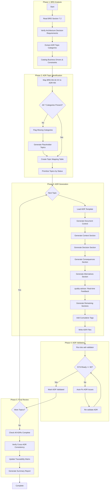

# doc-adr-autopilot

## Purpose

Automated **Architecture Decision Record (ADR)** generation pipeline that processes BRD Section 7.2 Architecture Decision Requirements to generate comprehensive ADRs with Context-Decision-Consequences format, validation, and traceability.

**Layer**: 5 (Architecture Decision Records)

**Upstream**: BRD (Layer 1), PRD (Layer 2), EARS (Layer 3), BDD (Layer 4)

**Downstream Artifacts**: SYS (Layer 6), REQ (Layer 7)

---

## Skill Dependencies

This autopilot orchestrates the following skills:

| Skill | Purpose | Phase |
|-------|---------|-------|
| `doc-naming` | Element ID format (ADR.NN.TT.SS), threshold tags, legacy pattern detection | All Phases |
| `doc-adr` | ADR creation rules, 17-section structure, lifecycle states | Phase 3: ADR Generation |
| `quality-advisor` | Real-time quality feedback during ADR generation | Phase 3: ADR Generation |
| `doc-adr-validator` | Validate ADR structure, content, SYS-Ready score | Phase 4: ADR Validation |

**Delegation Principle**: The autopilot orchestrates workflow but delegates:
- ADR structure/content rules -> `doc-adr` skill
- Real-time quality feedback -> `quality-advisor` skill
- ADR validation logic -> `doc-adr-validator` skill
- Element ID standards -> `doc-naming` skill

---

## When to Use This Skill

**Use `doc-adr-autopilot` when**:
- BRD Section 7.2 Architecture Decision Requirements is complete
- Need to generate all 7 mandatory ADR topic categories
- Want automated Context-Decision-Consequences generation
- Ensuring consistent ADR quality across the project
- Automating ADR generation in CI/CD pipelines

**Do NOT use when**:
- Manually creating a single ADR with extensive customization (use `doc-adr` directly)
- BRD Section 7.2 is incomplete or missing ADR topics
- Editing specific ADR sections (use `doc-adr` for guidance)
- Validating existing ADRs only (use `doc-adr-validator`)

---

## Workflow Overview



---

## Detailed Workflow

### Phase 1: BRD Analysis

Analyze BRD Section 7.2 to extract Architecture Decision Requirements.

**Input Sources**:

| Priority | Source | Location | Content Type |
|----------|--------|----------|--------------|
| 1 | BRD Section 7.2 | `docs/01_BRD/BRD-NN_{slug}/` | Architecture Decision Requirements |
| 2 | PRD Section 18 | `docs/02_PRD/PRD-NN_{slug}/` | Architecture Decision Requirements (inherited) |
| 3 | Technology Stack | `docs/ADR/ADR-00_technology_stack.md` | Approved technologies |

**Analysis Process**:

```bash
# Locate BRD Section 7.2
find docs/01_BRD/ -name "*.md" -exec grep -l "7.2.*Architecture Decision Requirements" {} \;

# Check for ADR topics in BRD
grep -E "BRD\.[0-9]+\.32\.[0-9]+" docs/01_BRD/BRD-NN_*.md
```

**Required BRD Section 7.2 Structure**:

| Subsection | Element ID Pattern | Content |
|------------|-------------------|---------|
| 7.2.1 Infrastructure | BRD.NN.32.01 | Cloud, compute, networking decisions |
| 7.2.2 Data Architecture | BRD.NN.32.02 | Database, storage, data flow decisions |
| 7.2.3 Integration | BRD.NN.32.03 | API, messaging, integration patterns |
| 7.2.4 Security | BRD.NN.32.04 | Authentication, authorization, encryption |
| 7.2.5 Observability | BRD.NN.32.05 | Logging, monitoring, tracing |
| 7.2.6 AI/ML | BRD.NN.32.06 | ML models, inference, training |
| 7.2.7 Technology Selection | BRD.NN.32.07 | Framework, language, tool choices |

**Output**: ADR topic catalog with business drivers, constraints, and status.

### Phase 2: ADR Topic Identification

Map BRD Section 7.2 topics to ADR documents.

> **Skill Delegation**: Element ID validation follows rules in `doc-naming` skill.
> See: `.claude/skills/doc-naming/SKILL.md` for element type codes.

**BRD to ADR Mapping**:

| BRD Element ID | ADR Document | Topic Category | ADR Element Prefix |
|----------------|--------------|----------------|-------------------|
| BRD.NN.32.01 | ADR-01 | Infrastructure | ADR.01.10.xx |
| BRD.NN.32.02 | ADR-02 | Data Architecture | ADR.02.10.xx |
| BRD.NN.32.03 | ADR-03 | Integration | ADR.03.10.xx |
| BRD.NN.32.04 | ADR-04 | Security | ADR.04.10.xx |
| BRD.NN.32.05 | ADR-05 | Observability | ADR.05.10.xx |
| BRD.NN.32.06 | ADR-06 | AI/ML | ADR.06.10.xx |
| BRD.NN.32.07 | ADR-07 | Technology Selection | ADR.07.10.xx |

**Topic Status Values** (from BRD Section 7.2):

| Status | Meaning | ADR Action |
|--------|---------|------------|
| Selected | Decision made, ready for ADR | Generate full ADR |
| Pending | Under evaluation | Generate ADR with Proposed status |
| N/A | Not applicable to project | Skip or generate minimal ADR with explanation |

**Required BRD Fields per Topic**:

| Field | Required | Description |
|-------|----------|-------------|
| Status | Yes | Selected/Pending/N/A |
| Business Driver | Yes | Why this decision matters |
| Business Constraints | Yes | Limitations affecting decision |
| Alternatives Overview | If Selected | Option comparison table |
| Cloud Provider Comparison | If Selected | GCP/Azure/AWS comparison |

**Topic Prioritization**:

```python
def prioritize_topics(topics: list) -> list:
    """
    Priority order:
    1. Selected topics (ready for full ADR)
    2. Pending topics (ADR with Proposed status)
    3. N/A topics (minimal ADR with explanation)
    """
    return sorted(topics, key=lambda t: (
        0 if t.status == "Selected" else
        1 if t.status == "Pending" else 2
    ))
```

### Phase 3: ADR Generation

Generate ADR documents with Context-Decision-Consequences format.

> **Skill Delegation**: This phase follows rules defined in `doc-adr` skill.
> See: `.claude/skills/doc-adr/SKILL.md` for complete ADR creation guidance.
>
> **Quality Guidance**: Uses `quality-advisor` skill for real-time feedback during generation.
> See: `.claude/skills/quality-advisor/SKILL.md` for quality monitoring.

**Generation Process**:

1. **Reserve ADR ID**:
   ```bash
   # Check for next available ID
   ls docs/ADR/ADR-*.md docs/ADR/ADR-*/ADR-*.0_*.md 2>/dev/null | \
     grep -oP 'ADR-\K\d+' | sort -n | tail -1
   # Increment for new ADR
   ```

2. **Load ADR Template**:
   - Primary: `ai_dev_flow/05_ADR/ADR-MVP-TEMPLATE.md`
   - Comprehensive: `ai_dev_flow/05_ADR/ADR-TEMPLATE.md`

3. **Generate Document Control Section**:

   | Field | Value |
   |-------|-------|
   | Project Name | From BRD |
   | Document Version | 0.1.0 |
   | Date Created | Current date (YYYY-MM-DD) |
   | Last Updated | Current date (YYYY-MM-DD) |
   | Document Owner | From BRD stakeholder analysis |
   | Prepared By | AI Assistant |
   | Status | Proposed (or Accepted if Selected) |
   | SYS-Ready Score | Calculated after generation |

4. **Generate Context Section (Section 4)**:

   **Section 4.1 Problem Statement** (from BRD):
   - Business Driver (BRD.NN.32.XX Business Driver field)
   - Business Constraints (BRD.NN.32.XX Constraints field)
   - Technical Options Evaluated (from PRD Section 18)
   - Evaluation Criteria (from PRD Section 18)

   **Section 4.2 Background**:
   - Current state description
   - Why decision is needed now
   - Stakeholder concerns

   **Section 4.3 Driving Forces**:
   - Business requirements pushing this decision
   - Technical requirements
   - Regulatory/compliance needs

   **Section 4.4 Constraints**:
   - Budget limitations
   - Timeline constraints
   - Technology restrictions
   - Team skills/capacity

5. **Generate Decision Section (Section 5)**:

   **Section 5.1 Chosen Solution**:
   - Clear statement of what is decided
   - Reference to technology stack (ADR-00)

   **Section 5.2 Key Components**:
   - Components involved in decision
   - Integration points
   - Dependencies

   **Section 5.3 Implementation Approach**:
   - High-level implementation strategy
   - Phasing if applicable
   - Migration considerations

6. **Generate Consequences Section (Section 7)**:

   **Section 7.1 Positive Outcomes**:
   - Benefits of the decision
   - Improvements enabled
   - Risk reductions

   **Section 7.2 Negative Outcomes**:
   - Trade-offs accepted
   - New risks introduced
   - Technical debt implications

7. **Generate Alternatives Section (Section 12)**:

   From BRD Alternatives Overview table:

   | Alternative | Description | Pros | Cons | Fit Score | Why Rejected |
   |-------------|-------------|------|------|-----------|--------------|
   | Option A | ... | ... | ... | Better | Selected |
   | Option B | ... | ... | ... | Good | Cost concerns |
   | Option C | ... | ... | ... | Poor | Scalability limits |

8. **Real-Time Quality Feedback** (via `quality-advisor` skill):
   - Monitor section completion as content is generated
   - Detect anti-patterns (AP-001 to AP-017) during creation
   - Validate element ID format compliance (ADR.NN.TT.SS)
   - Check for placeholder text ([TBD], TODO, XXX)
   - Verify Mermaid diagram presence (required for ADR)
   - Flag issues early to reduce post-generation rework

9. **Generate Remaining Sections**:
   - Section 6: Requirements Satisfied (link to BRD/PRD)
   - Section 8: Architecture Flow (Mermaid diagram REQUIRED)
   - Section 9: Implementation Assessment (complexity, dependencies)
   - Section 10: Impact Analysis
   - Section 11: Verification Approach
   - Section 13: Security Considerations
   - Section 14: Related Decisions
   - Section 15: Implementation Notes
   - Section 16: Traceability
   - Section 17: References

10. **Add Cumulative Tags (Section 16)**:

    **Layer 5 Required Tags**:
    ```markdown
    @brd: BRD.NN.32.XX
    @prd: PRD.NN.18.XX
    @ears: EARS.NN.25.XX
    @bdd: BDD.NN.14.XX
    ```

11. **File Output**:
    - **Monolithic** (<25KB): `docs/ADR/ADR-NN_{slug}.md`
    - **Sectioned** (>=25KB): `docs/ADR/ADR-NN_{slug}/ADR-NN.S_{section}.md`

**Element ID Format** (per `doc-naming` skill):

| Element Type | Code | Example |
|--------------|------|---------|
| Decision | 10 | ADR.02.10.01 |
| Alternative | 12 | ADR.02.12.01 |
| Consequence | 13 | ADR.02.13.01 |

### Phase 4: ADR Validation

After ADR generation, validate structure and SYS-Ready score.

> **Skill Delegation**: This phase uses validation rules from `doc-adr-validator` skill.
> See: `.claude/skills/doc-adr-validator/SKILL.md` for complete validation rules.

**Validation Command**:

```bash
python ai_dev_flow/scripts/validate_adr.py docs/ADR/ADR-NN_{slug}.md --verbose
```

**Validation Checks** (8 Total):

| Check | Type | Description |
|-------|------|-------------|
| CHECK 1 | Error | Required Document Control Fields (7 fields) |
| CHECK 2 | Error | ADR Structure Completeness (required sections) |
| CHECK 3 | Error | SYS-Ready Score Validation (format, threshold) |
| CHECK 4 | Error | Upstream Traceability Tags (@brd, @prd, @ears, @bdd) |
| CHECK 5 | Warning | Decision Quality Assessment |
| CHECK 6 | Warning | Architecture Documentation (Mermaid diagrams) |
| CHECK 7 | Warning | Implementation Readiness |
| CHECK 8 | Error | Element ID Format Compliance (unified 4-segment) |

**SYS-Ready Scoring Criteria (100%)**:

| Category | Weight | Criteria |
|----------|--------|----------|
| Decision Completeness | 30% | Context/Decision/Consequences/Alternatives documented |
| Architecture Clarity | 35% | Mermaid diagrams (REQUIRED), component responsibilities |
| Implementation Readiness | 20% | Complexity assessment, dependencies, rollback strategies |
| Verification Approach | 15% | Testing strategy, success metrics, operational readiness |

**Minimum Score**: 90%

**Auto-Fix Actions**:

| Issue | Auto-Fix Action |
|-------|-----------------|
| Invalid element ID format | Convert to ADR.NN.TT.SS format |
| Missing traceability section | Insert from template |
| Missing Document Control fields | Add placeholder fields |
| Legacy patterns (DEC-XXX, ALT-XXX, CON-XXX) | Convert to unified format |
| Missing SYS-Ready Score | Calculate and insert |
| Missing Mermaid diagram | Insert template diagram |

**Validation Loop**:

```
LOOP (max 3 iterations):
  1. Run doc-adr-validator
  2. IF errors found: Apply auto-fixes
  3. IF warnings found: Review and address if critical
  4. IF SYS-Ready Score < 90%: Enhance sections
  5. IF clean: Mark VALIDATED, proceed
  6. IF max iterations: Log issues, flag for manual review
```

### Phase 5: Final Review

Comprehensive final review before marking ADR generation complete.

**Review Checks**:

1. **All ADRs Complete**:
   - All 7 mandatory topic categories addressed
   - Each ADR has SYS-Ready score >= 90%
   - No placeholder text remaining

2. **Cross-ADR Consistency**:
   - No conflicting decisions between ADRs
   - Technology choices align with ADR-00 stack
   - Dependencies between ADRs documented

3. **Traceability Matrix Update**:
   ```bash
   # Update ADR-00_TRACEABILITY_MATRIX.md
   python ai_dev_flow/scripts/update_traceability_matrix.py \
     --type ADR \
     --matrix docs/ADR/ADR-00_TRACEABILITY_MATRIX.md
   ```

4. **Summary Report Generation**:
   ```
   ADR Generation Summary
   ======================
   Total ADRs Generated: 7

   Status Distribution:
     Accepted: 5
     Proposed: 2
     N/A: 0

   SYS-Ready Scores:
     ADR-01 (Infrastructure):     95%
     ADR-02 (Data Architecture):  92%
     ADR-03 (Integration):        94%
     ADR-04 (Security):           96%
     ADR-05 (Observability):      91%
     ADR-06 (AI/ML):              90%
     ADR-07 (Technology):         93%

   Average SYS-Ready Score: 93%

   Next Steps:
     1. Review Proposed ADRs for stakeholder approval
     2. Run doc-sys-autopilot to generate SYS from ADRs
   ```

---

## Execution Modes

### Single ADR Mode

Generate one ADR from a specific BRD topic.

```bash
# Example: Generate ADR-01 from Infrastructure topic
/doc-adr-autopilot BRD.01.32.01

# Output:
# Analyzing BRD.01.32.01 (Infrastructure)...
# Status: Selected
# Generating ADR-01_infrastructure.md...
# SYS-Ready Score: 94%
# Complete.
```

### Batch Mode (All 7 Topics)

Generate all ADRs from BRD Section 7.2.

```bash
# Example: Generate all ADRs from BRD-01
/doc-adr-autopilot BRD-01 --all-topics

# Output:
# Scanning BRD-01 Section 7.2...
# Found 7 ADR topics:
#   BRD.01.32.01 (Infrastructure) - Selected
#   BRD.01.32.02 (Data Architecture) - Selected
#   BRD.01.32.03 (Integration) - Selected
#   BRD.01.32.04 (Security) - Selected
#   BRD.01.32.05 (Observability) - Pending
#   BRD.01.32.06 (AI/ML) - Pending
#   BRD.01.32.07 (Technology) - Selected
#
# Generating ADRs...
# [================>          ] 5/7 Complete
```

### Dry Run Mode

Preview ADR generation plan without creating files.

```bash
/doc-adr-autopilot BRD-01 --dry-run

# Output:
# ADR Generation Plan (Dry Run)
# ============================
# Source: BRD-01 Section 7.2
#
# Planned ADRs:
# 1. ADR-01 (Infrastructure) - Full generation
# 2. ADR-02 (Data Architecture) - Full generation
# 3. ADR-03 (Integration) - Full generation
# 4. ADR-04 (Security) - Full generation
# 5. ADR-05 (Observability) - Proposed status
# 6. ADR-06 (AI/ML) - Proposed status
# 7. ADR-07 (Technology) - Full generation
#
# No files will be created in dry-run mode.
```

---

## Output Artifacts

### Generated Files

| File | Purpose | Location |
|------|---------|----------|
| ADR-NN_{slug}.md | Main ADR document (monolithic) | `docs/ADR/` |
| ADR-NN_{slug}/ | ADR folder (sectioned) | `docs/ADR/` |
| ADR-NN.0_index.md | Section index | `docs/ADR/ADR-NN_{slug}/` |
| ADR-NN.S_{section}.md | Section files | `docs/ADR/ADR-NN_{slug}/` |

### Validation Reports

| Report | Purpose | Location |
|--------|---------|----------|
| adr_validation_report.json | Validation results | `tmp/` |
| sys_ready_scores.json | SYS-Ready breakdown | `tmp/` |
| adr_autopilot_log.md | Execution log | `tmp/` |

---

## Error Handling

### Error Categories

| Category | Handling | Example |
|----------|----------|---------|
| BRD Section 7.2 Missing | Abort with message | No Architecture Decision Requirements found |
| Topic Status Invalid | Flag for manual review | Status not Selected/Pending/N/A |
| Validation Failure | Auto-fix, retry | Missing required section |
| SYS-Ready Below 90% | Enhance sections, retry | Score at 85% |
| Max Retries Exceeded | Flag for manual review | Persistent validation errors |

### Recovery Actions

```python
def handle_error(error_type: str, context: dict) -> Action:
    match error_type:
        case "BRD_SECTION_MISSING":
            return Action.ABORT_WITH_MESSAGE
        case "TOPIC_STATUS_INVALID":
            return Action.FLAG_MANUAL_REVIEW
        case "VALIDATION_FAILURE":
            if context["retry_count"] < 3:
                return Action.AUTO_FIX_RETRY
            return Action.FLAG_MANUAL_REVIEW
        case "SYS_READY_LOW":
            return Action.ENHANCE_SECTIONS
        case _:
            return Action.FLAG_MANUAL_REVIEW
```

---

## Configuration

### Default Configuration

```yaml
# config/adr_autopilot.yaml
adr_autopilot:
  version: "1.0"

  scoring:
    sys_ready_min: 90
    strict_mode: false

  execution:
    auto_fix: true
    continue_on_error: false
    timeout_per_topic: 180  # seconds

  output:
    structure: auto  # auto, monolithic, sectioned
    size_threshold_kb: 25
    report_format: markdown

  validation:
    skip_validation: false
    fix_iterations_max: 3
    require_mermaid: true

  topics:
    generate_all: true
    skip_na_topics: false
```

### Command Line Options

| Option | Default | Description |
|--------|---------|-------------|
| `--min-sys-ready` | 90 | Minimum SYS-Ready score |
| `--no-auto-fix` | false | Disable auto-fix (manual only) |
| `--continue-on-error` | false | Continue if one topic fails |
| `--dry-run` | false | Preview execution plan only |
| `--output-format` | auto | Force monolithic or sectioned output |
| `--skip-na` | false | Skip N/A topics entirely |

---

## Integration Points

### Pre-Execution Hooks

```bash
# Hook: pre_adr_generation
# Runs before ADR generation starts
./hooks/pre_adr_generation.sh

# Example: Verify BRD Section 7.2 exists
grep -q "7.2.*Architecture Decision Requirements" docs/01_BRD/BRD-*.md || {
  echo "ERROR: BRD Section 7.2 required"
  exit 1
}
```

### Post-Execution Hooks

```bash
# Hook: post_adr_generation
# Runs after ADR generation completes
./hooks/post_adr_generation.sh

# Example: Trigger SYS autopilot for validated ADRs
if [ "$ALL_ADRS_VALIDATED" = "true" ]; then
  python ai_dev_flow/scripts/sys_autopilot.py \
    --adr-dir docs/ADR/ \
    --output docs/SYS/
fi
```

### CI/CD Integration

```yaml
# .github/workflows/adr_autopilot.yml
name: ADR Autopilot

on:
  push:
    paths:
      - 'docs/01_BRD/**/BRD-*.md'

jobs:
  generate-adr:
    runs-on: ubuntu-latest
    steps:
      - uses: actions/checkout@v4

      - name: Run ADR Autopilot
        run: |
          python ai_dev_flow/scripts/adr_autopilot.py \
            --brd docs/01_BRD/ \
            --output docs/ADR/ \
            --validate

      - name: Upload Validation Report
        uses: actions/upload-artifact@v4
        with:
          name: adr-validation
          path: tmp/adr_validation_report.json
```

---

## Quality Gates

### Phase Gates

| Phase | Gate | Criteria |
|-------|------|----------|
| Phase 1 | BRD Gate | BRD Section 7.2 exists with ADR topics |
| Phase 2 | Topic Gate | All 7 categories identified |
| Phase 3 | Generation Gate | All sections generated per topic |
| Phase 4 | Validation Gate | SYS-Ready Score >= 90% |
| Phase 5 | Review Gate | No blocking issues remaining |

### Blocking vs Non-Blocking

| Issue Type | Blocking | Action |
|------------|----------|--------|
| Missing Context section | Yes | Must fix before proceeding |
| Missing Decision section | Yes | Must fix before proceeding |
| SYS-Ready Score < 90% | Yes | Must enhance sections |
| Invalid element ID format | Yes | Must convert to unified format |
| Missing Mermaid diagram | Yes | Must add architecture flow |
| Missing optional section | No | Log warning, continue |
| Style/formatting issues | No | Auto-fix, continue |

---

## Related Resources

- **ADR Creation Skill**: `.claude/skills/doc-adr/SKILL.md`
- **ADR Validator Skill**: `.claude/skills/doc-adr-validator/SKILL.md`
- **Quality Advisor Skill**: `.claude/skills/quality-advisor/SKILL.md`
- **Naming Standards Skill**: `.claude/skills/doc-naming/SKILL.md`
- **ADR Template**: `ai_dev_flow/05_ADR/ADR-MVP-TEMPLATE.md`
- **ADR Creation Rules**: `ai_dev_flow/05_ADR/ADR_CREATION_RULES.md`
- **ADR Validation Rules**: `ai_dev_flow/05_ADR/ADR_VALIDATION_RULES.md`
- **Technology Stack**: `docs/ADR/ADR-00_technology_stack.md`
- **BRD Autopilot Skill**: `.claude/skills/doc-brd-autopilot/SKILL.md`
- **PRD Autopilot Skill**: `.claude/skills/doc-prd-autopilot/SKILL.md`

---

## Quick Reference

| Input | Output | Key Metric |
|-------|--------|------------|
| BRD Section 7.2 | ADR-01 to ADR-07 | SYS-Ready >= 90% |

**Usage**:
```
/doc-adr-autopilot <BRD-ID> [OPTIONS]
```

**Common Commands**:
```bash
# Generate all ADRs from BRD-01
/doc-adr-autopilot BRD-01 --all-topics

# Generate single ADR from specific topic
/doc-adr-autopilot BRD.01.32.01

# Preview only
/doc-adr-autopilot BRD-01 --dry-run

# Resume after failure
/doc-adr-autopilot resume
```

**BRD Section 7.2 to ADR Mapping**:

| BRD Element | ADR | Topic |
|-------------|-----|-------|
| BRD.NN.32.01 | ADR-01 | Infrastructure |
| BRD.NN.32.02 | ADR-02 | Data Architecture |
| BRD.NN.32.03 | ADR-03 | Integration |
| BRD.NN.32.04 | ADR-04 | Security |
| BRD.NN.32.05 | ADR-05 | Observability |
| BRD.NN.32.06 | ADR-06 | AI/ML |
| BRD.NN.32.07 | ADR-07 | Technology Selection |

---

## Version History

| Version | Date | Changes |
|---------|------|---------|
| 1.0 | 2026-02-08 | Initial skill creation with 5-phase workflow; Integrated doc-naming, doc-adr, doc-adr-validator, quality-advisor skills; Added BRD Section 7.2 to ADR mapping; Context-Decision-Consequences generation |
