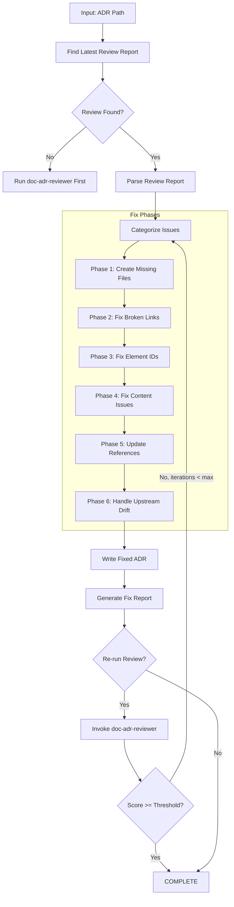
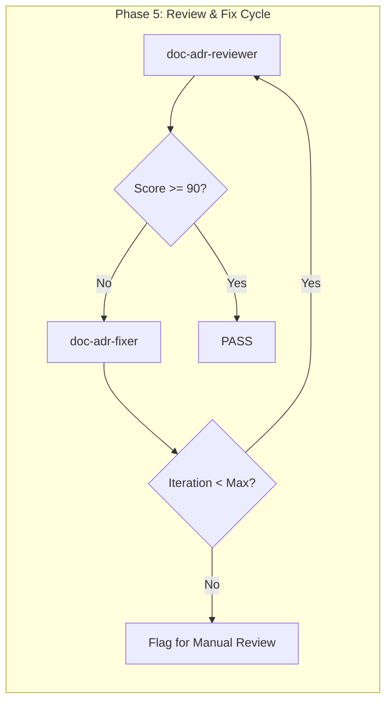

# doc-adr-fixer

## Purpose

Automated **fix skill** that reads the latest review report and applies fixes to ADR (Architecture Decision Record) documents. This skill bridges the gap between `doc-adr-reviewer` (which identifies issues) and the corrected ADR, enabling iterative improvement cycles.

**Layer**: 5 (ADR Quality Improvement)

**Upstream**: ADR document, Review Report (`ADR-NN.R_review_report_vNNN.md`), BDD (for behavior alignment), BRD (for topic alignment)

**Downstream**: Fixed ADR, Fix Report (`ADR-NN.F_fix_report_vNNN.md`)

---

## When to Use This Skill

Use `doc-adr-fixer` when:

- **After Review**: Run after `doc-adr-reviewer` identifies issues
- **Iterative Improvement**: Part of Review -> Fix -> Review cycle
- **Automated Pipeline**: CI/CD integration for quality gates
- **Batch Fixes**: Apply fixes to multiple ADRs based on review reports

**Do NOT use when**:
- No review report exists (run `doc-adr-reviewer` first)
- Creating new ADR (use `doc-adr` or `doc-adr-autopilot`)
- Only need validation (use `doc-adr-validator`)

---

## Skill Dependencies

| Skill | Purpose | When Used |
|-------|---------|-----------|
| `doc-adr-reviewer` | Source of issues to fix | Input (reads review report) |
| `doc-naming` | Element ID standards | Fix element IDs |
| `doc-adr` | ADR creation rules | Create missing sections |
| `doc-bdd` | BDD alignment reference | Verify behavior traceability |

---

## Workflow Overview



---

## Fix Phases

### Phase 1: Create Missing Files

Creates files that are referenced but don't exist.

**Scope**:

| Missing File | Action | Template Used |
|--------------|--------|---------------|
| `ADR-00_INDEX.md` | Create ADR index | Index template |
| `ARCH_*.md` | Create placeholder architecture doc | ARCH template |
| Reference docs (`*_REF_*.md`) | Create placeholder | REF template |

**ADR Index Template**:

```markdown
---
title: "ADR-00: Architecture Decision Records Index"
tags:
  - adr
  - index
  - reference
custom_fields:
  document_type: index
  artifact_type: ADR-REFERENCE
  layer: 5
---

# ADR-00: Architecture Decision Records Index

Master index of all Architecture Decision Records for this project.

## Active Decisions

| ADR ID | Title | Status | Date | Impact |
|--------|-------|--------|------|--------|
| ADR-01 | [Title] | Accepted | YYYY-MM-DD | High/Medium/Low |

## Superseded Decisions

| ADR ID | Title | Superseded By | Date |
|--------|-------|---------------|------|
| [None] | | | |

## Decision Categories

| Category | ADR IDs | Description |
|----------|---------|-------------|
| Infrastructure | | Infrastructure-related decisions |
| Security | | Security architecture decisions |
| Integration | | External integration decisions |
| Data | | Data management decisions |

---

*Maintained by doc-adr-fixer. Update when adding new ADRs.*
```

**Architecture Placeholder Template**:

```markdown
---
title: "Architecture Document: [Component Name]"
tags:
  - architecture
  - reference
custom_fields:
  document_type: architecture
  status: placeholder
  created_by: doc-adr-fixer
---

# Architecture Document: [Component Name]

> **Status**: Placeholder - Requires completion

## 1. Overview

[TODO: Document architecture overview]

## 2. Components

| Component | Description | Responsibility |
|-----------|-------------|----------------|
| [Name] | [Description] | [What it does] |

## 3. Interfaces

[TODO: Document component interfaces]

## 4. Design Decisions

[TODO: Link to relevant ADRs]

---

*Created by doc-adr-fixer as placeholder. Complete this document to resolve broken link issues.*
```

---

### Phase 2: Fix Broken Links

Updates links to point to correct locations.

**Fix Actions**:

| Issue Code | Issue | Fix Action |
|------------|-------|------------|
| REV-L001 | Broken internal link | Update path or create target file |
| REV-L002 | External link unreachable | Add warning comment, keep link |
| REV-L003 | Absolute path used | Convert to relative path |
| REV-L004 | Missing BDD traceability link | Add link to corresponding BDD scenario |

**Path Resolution Logic**:

```python
def fix_link_path(adr_location: str, target_path: str) -> str:
    """Calculate correct relative path based on ADR location."""

    # Monolithic ADR: docs/05_ADR/ADR-01.md
    # Sectioned ADR: docs/05_ADR/ADR-01_slug/ADR-01.3_section.md

    if is_sectioned_adr(adr_location):
        # Need to go up one more level
        return "../" + calculate_relative_path(adr_location, target_path)
    else:
        return calculate_relative_path(adr_location, target_path)
```

**Cross-Layer Link Fix**:

| Source | Target | Link Pattern |
|--------|--------|--------------|
| ADR | BDD | `../04_BDD/BDD-NN.feature` |
| ADR | BRD | `../01_BRD/BRD-NN.md` |
| ADR | SYS | `../06_SYS/SYS-NN.md` |

---

### Phase 3: Fix Element IDs

Converts invalid element IDs to correct format.

**Conversion Rules**:

| Pattern | Issue | Conversion |
|---------|-------|------------|
| `ADR.NN.01.SS` | Code 01 invalid for ADR | `ADR.NN.13.SS` (Decision Context) |
| `DEC-XXX` | Legacy pattern | `ADR.NN.14.SS` |
| `OPT-XXX` | Legacy pattern | `ADR.NN.15.SS` |
| `CON-XXX` | Legacy pattern | `ADR.NN.16.SS` |

**Type Code Mapping** (ADR-specific valid codes: 13, 14, 15, 16):

| Code | Element Type | Description |
|------|--------------|-------------|
| 13 | Decision Context | Background and problem statement |
| 14 | Decision Statement | The actual decision made |
| 15 | Option Considered | Alternative options evaluated |
| 16 | Consequence | Implications of the decision |

**Invalid Code Conversions**:

| Invalid Code | Valid Code | Element Type |
|--------------|------------|--------------|
| 01 | 13 | Decision Context (was Functional Requirement) |
| 05 | 14 | Decision Statement (was Use Case) |
| 06 | 16 | Consequence (was Acceptance Criteria) |

**Regex Patterns**:

```python
# Find element IDs with invalid type codes for ADR
invalid_adr_type_01 = r'ADR\.(\d{2})\.01\.(\d{2})'
replacement_01 = r'ADR.\1.13.\2'

invalid_adr_type_05 = r'ADR\.(\d{2})\.05\.(\d{2})'
replacement_05 = r'ADR.\1.14.\2'

# Find legacy patterns
legacy_dec = r'###\s+DEC-(\d+):'
legacy_opt = r'###\s+OPT-(\d+):'
legacy_con = r'###\s+CON-(\d+):'
```

---

### Phase 4: Fix Content Issues

Addresses placeholders and incomplete content.

**Fix Actions**:

| Issue Code | Issue | Fix Action |
|------------|-------|------------|
| REV-P001 | `[TODO]` placeholder | Flag for manual completion (cannot auto-fix) |
| REV-P002 | `[TBD]` placeholder | Flag for manual completion (cannot auto-fix) |
| REV-P003 | Template date `YYYY-MM-DD` | Replace with current date |
| REV-P004 | Template name `[Name]` | Replace with metadata author or flag |
| REV-P005 | Empty section | Add minimum template content |
| REV-P006 | Missing decision status | Add "Proposed" as default status |

**Auto-Replacements**:

```python
replacements = {
    'YYYY-MM-DD': datetime.now().strftime('%Y-%m-%d'),
    'MM/DD/YYYY': datetime.now().strftime('%m/%d/%Y'),
    '[Current date]': datetime.now().strftime('%Y-%m-%d'),
    '[Status]': 'Proposed',
}
```

**ADR-Specific Content Fixes**:

| Section | Missing Content | Auto-Fill |
|---------|-----------------|-----------|
| Status | Empty | "Proposed" |
| Decision Date | Empty | Current date |
| Deciders | Empty | "[Pending assignment]" |

---

### Phase 5: Update References

Ensures traceability and cross-references are correct.

**Fix Actions**:

| Issue | Fix Action |
|-------|------------|
| Missing `@ref:` for created files | Add reference tag |
| Incorrect cross-ADR path | Update to correct relative path |
| Missing BDD traceability | Add `@trace: BDD-NN.SS` tag |
| Missing BRD alignment | Add `@trace: BRD-NN.SS` tag |

**Traceability Matrix Update**:

```markdown
## Traceability

| ADR Element | Traces To | Type |
|-------------|-----------|------|
| ADR.01.14.01 | BDD.01.09.03 | Behavior Implementation |
| ADR.01.13.01 | BRD.01.22.05 | Business Context |
```

---

### Phase 6: Handle Upstream Drift

Addresses issues where upstream source documents (BDD, BRD) have changed since ADR creation.

**Drift Issue Codes** (from `doc-adr-reviewer` Check #9):

| Code | Severity | Description | Auto-Fix Possible |
|------|----------|-------------|-------------------|
| REV-D001 | Warning | BDD document modified after ADR | No (flag for review) |
| REV-D002 | Warning | BRD topic changed | No (flag for review) |
| REV-D003 | Info | Upstream document version incremented | Yes (update @ref version) |
| REV-D004 | Info | New scenarios added to BDD | No (flag for review) |
| REV-D005 | Error | Critical upstream modification (>20% change) | No (flag for review) |

**Fix Actions**:

| Issue | Auto-Fix | Action |
|-------|----------|--------|
| REV-D001/D002/D004/D005 | No | Add `[DRIFT]` marker to affected references, generate drift summary |
| REV-D003 (version change) | Yes | Update `@ref:` tag to include current version |

**Drift Marker Format**:

```markdown
<!-- DRIFT: BDD-01.feature modified 2026-02-08 (ADR created 2026-02-05) -->
@ref: [BDD Scenario 3](../../04_BDD/BDD-01.feature#scenario-3)
```

**Drift Summary Block** (added to Fix Report):

```markdown
## Upstream Drift Summary

| Upstream Document | Reference | Modified | ADR Updated | Days Stale | Action Required |
|-------------------|-----------|----------|-------------|------------|-----------------|
| BDD-01.feature | ADR-01:L57 | 2026-02-08 | 2026-02-05 | 3 | Review behavior changes |
| BRD-01.md | ADR-01:L89 | 2026-02-10 | 2026-02-05 | 5 | Review business context |

**Recommendation**: Review upstream documents and update ADR sections if architecture decisions are affected.
Sections potentially affected:
- ADR-01 Context (Section 2)
- ADR-01 Decision (Section 4)
```

**Drift Cache Update**:

After processing drift issues, update `.drift_cache.json`:

```json
{
  "adr_version": "1.0",
  "adr_updated": "2026-02-10",
  "drift_reviewed": "2026-02-10",
  "upstream_hashes": {
    "../../04_BDD/BDD-01.feature#scenario-3": "a1b2c3d4...",
    "../../01_BRD/BRD-01.md#section-5": "e5f6g7h8..."
  },
  "acknowledged_drift": [
    {
      "document": "BDD-01.feature",
      "acknowledged_date": "2026-02-10",
      "reason": "Reviewed - no ADR impact"
    }
  ]
}
```

**Drift Acknowledgment Workflow**:

When drift is flagged but no ADR update is needed:

1. Run `/doc-adr-fixer ADR-01 --acknowledge-drift`
2. Fixer prompts: "Review drift for BDD-01.feature?"
3. User confirms no ADR changes needed
4. Fixer adds to `acknowledged_drift` array
5. Future reviews skip this drift until upstream changes again

---

## Command Usage

### Basic Usage

```bash
# Fix ADR based on latest review
/doc-adr-fixer ADR-01

# Fix with explicit review report
/doc-adr-fixer ADR-01 --review-report ADR-01.R_review_report_v001.md

# Fix and re-run review
/doc-adr-fixer ADR-01 --revalidate

# Fix with iteration limit
/doc-adr-fixer ADR-01 --revalidate --max-iterations 3
```

### Options

| Option | Default | Description |
|--------|---------|-------------|
| `--review-report` | latest | Specific review report to use |
| `--revalidate` | false | Run reviewer after fixes |
| `--max-iterations` | 3 | Max fix-review cycles |
| `--fix-types` | all | Specific fix types (comma-separated) |
| `--create-missing` | true | Create missing reference files |
| `--backup` | true | Backup ADR before fixing |
| `--dry-run` | false | Preview fixes without applying |
| `--acknowledge-drift` | false | Interactive drift acknowledgment mode |
| `--update-drift-cache` | true | Update .drift_cache.json after fixes |

### Fix Types

| Type | Description |
|------|-------------|
| `missing_files` | Create missing index, architecture docs |
| `broken_links` | Fix link paths |
| `element_ids` | Convert invalid/legacy element IDs |
| `content` | Fix placeholders, dates, status |
| `references` | Update traceability and cross-references |
| `drift` | Handle upstream drift detection issues |
| `all` | All fix types (default) |

---

## Output Artifacts

### Fix Report

**File Naming**: `ADR-NN.F_fix_report_vNNN.md`

**Location**: Same folder as the ADR document.

**Structure**:

```markdown
---
title: "ADR-NN.F: Fix Report v001"
tags:
  - adr
  - fix-report
  - quality-assurance
custom_fields:
  document_type: fix-report
  artifact_type: ADR-FIX
  layer: 5
  parent_doc: ADR-NN
  source_review: ADR-NN.R_review_report_v001.md
  fix_date: "YYYY-MM-DD"
  fix_tool: doc-adr-fixer
  fix_version: "1.0"
---

# ADR-NN Fix Report v001

## Summary

| Metric | Value |
|--------|-------|
| Source Review | ADR-NN.R_review_report_v001.md |
| Issues in Review | 12 |
| Issues Fixed | 10 |
| Issues Remaining | 2 (manual review required) |
| Files Created | 2 |
| Files Modified | 3 |

## Files Created

| File | Type | Location |
|------|------|----------|
| ADR-00_INDEX.md | ADR Index | docs/05_ADR/ |
| ARCH_Authentication.md | Arch Placeholder | docs/00_REF/architecture/ |

## Fixes Applied

| # | Issue Code | Issue | Fix Applied | File |
|---|------------|-------|-------------|------|
| 1 | REV-L001 | Broken index link | Created ADR-00_INDEX.md | ADR-01.md |
| 2 | REV-L001 | Broken arch link | Created placeholder ARCH file | ADR-01.md |
| 3 | REV-N004 | Element type 01 invalid | Converted to type 13 | ADR-01.md |
| 4 | REV-L003 | Absolute path used | Converted to relative | ADR-02.md |

## Issues Requiring Manual Review

| # | Issue Code | Issue | Location | Reason |
|---|------------|-------|----------|--------|
| 1 | REV-P001 | [TODO] placeholder | ADR-01:L45 | Architecture expertise needed |
| 2 | REV-D001 | BDD drift detected | ADR-01:L120 | Review behavior changes |

## Validation After Fix

| Metric | Before | After | Delta |
|--------|--------|-------|-------|
| Review Score | 88 | 95 | +7 |
| Errors | 3 | 0 | -3 |
| Warnings | 5 | 2 | -3 |

## Next Steps

1. Complete ARCH_Authentication.md placeholder
2. Address remaining [TODO] placeholders
3. Review BDD drift and update decision if needed
4. Run `/doc-adr-reviewer ADR-01` to verify fixes
```

---

## Integration with Autopilot

This skill is invoked by `doc-adr-autopilot` in the Review -> Fix cycle:



**Autopilot Integration Points**:

| Phase | Action | Skill |
|-------|--------|-------|
| Phase 5a | Run initial review | `doc-adr-reviewer` |
| Phase 5b | Apply fixes if issues found | `doc-adr-fixer` |
| Phase 5c | Re-run review | `doc-adr-reviewer` |
| Phase 5d | Repeat until pass or max iterations | Loop |

---

## Error Handling

### Recovery Actions

| Error | Action |
|-------|--------|
| Review report not found | Prompt to run `doc-adr-reviewer` first |
| Cannot create file (permissions) | Log error, continue with other fixes |
| Cannot parse review report | Abort with clear error message |
| Max iterations exceeded | Generate report, flag for manual review |

### Backup Strategy

Before applying any fixes:

1. Create backup in `tmp/backup/ADR-NN_YYYYMMDD_HHMMSS/`
2. Copy all ADR files to backup location
3. Apply fixes to original files
4. If error during fix, restore from backup

---

## Related Skills

| Skill | Relationship |
|-------|--------------|
| `doc-adr-reviewer` | Provides review report (input) |
| `doc-adr-autopilot` | Orchestrates Review -> Fix cycle |
| `doc-adr-validator` | Structural validation |
| `doc-naming` | Element ID standards |
| `doc-adr` | ADR creation rules |
| `doc-bdd` | Upstream behavior reference |
| `doc-brd` | Upstream business context |

---

## Version History

| Version | Date | Changes |
|---------|------|---------|
| 1.0 | 2026-02-10 | Initial skill creation; 6-phase fix workflow; ADR Index and Architecture file creation; Element ID conversion (types 13, 14, 15, 16); Broken link fixes; BDD/BRD upstream drift handling; Integration with autopilot Review->Fix cycle |
