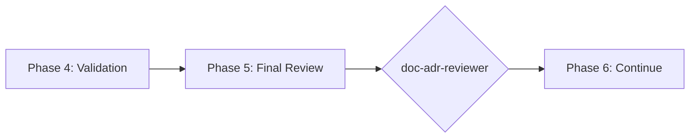

# doc-adr-reviewer

## Purpose

Comprehensive **content review and quality assurance** for Architecture Decision Records (ADR). This skill performs deep content analysis beyond structural validation, checking decision completeness, BRD topic alignment, consequence coverage, alternative evaluation, and identifying issues that require manual architectural review.

**Layer**: 5 (ADR Quality Assurance)

**Upstream**: ADR (from `doc-adr-autopilot` or `doc-adr`)

**Downstream**: None (final QA gate before SYS generation)

---

## When to Use This Skill

Use `doc-adr-reviewer` when:

- **After ADR Generation**: Run immediately after `doc-adr-autopilot` completes
- **Manual ADR Edits**: After making manual changes to ADR
- **Pre-SYS Check**: Before running `doc-sys-autopilot`
- **Periodic Review**: Regular quality checks on existing ADRs
- **Architecture Reviews**: During formal architecture review sessions

**Do NOT use when**:
- ADR does not exist yet (use `doc-adr` or `doc-adr-autopilot` first)
- Need structural/schema validation only (use `doc-adr-validator`)
- Generating new ADR content (use `doc-adr`)

---

## Skill vs Validator: Key Differences

| Aspect | `doc-adr-validator` | `doc-adr-reviewer` |
|--------|---------------------|-------------------|
| **Focus** | Schema compliance, SYS-Ready score | Content quality, decision rationale |
| **Checks** | Required sections, format | Consequence coverage, alternative evaluation |
| **Auto-Fix** | Structural issues only | Content issues (links, formatting) |
| **Output** | SYS-Ready score (numeric) | Review score + issue list |
| **Phase** | Phase 4 (Validation) | Phase 5 (Final Review) |
| **Blocking** | SYS-Ready < threshold blocks | Review score < threshold flags |

---

## Review Checks

### 1. Decision Completeness

Validates ADR has all required decision components.

**Scope**:
- Context clearly stated
- Decision explicitly documented
- Rationale provided
- Status defined
- Date recorded

**Error Codes**:

| Code | Severity | Description |
|------|----------|-------------|
| REV-DC001 | Error | Context section missing or empty |
| REV-DC002 | Error | Decision not explicitly stated |
| REV-DC003 | Error | Rationale missing |
| REV-DC004 | Warning | Status not defined |
| REV-DC005 | Warning | Date not recorded |

---

### 2. BRD Topic Alignment

Validates ADR addresses BRD Section 7.2 topics.

**Scope**:
- ADR maps to BRD ADR topic
- Topic category correct (Infrastructure, Data, Security, etc.)
- Decision matches topic requirements
- All BRD topics have corresponding ADRs

**Error Codes**:

| Code | Severity | Description |
|------|----------|-------------|
| REV-BA001 | Error | ADR not linked to BRD topic |
| REV-BA002 | Error | Topic category mismatch |
| REV-BA003 | Warning | Decision doesn't fully address topic |
| REV-BA004 | Info | BRD topic not yet addressed by ADR |

---

### 3. Consequence Coverage

Validates positive and negative consequences documented.

**Scope**:
- Positive consequences listed
- Negative consequences/trade-offs acknowledged
- Risk assessment included
- Mitigation strategies defined

**Error Codes**:

| Code | Severity | Description |
|------|----------|-------------|
| REV-CC001 | Error | No consequences documented |
| REV-CC002 | Warning | Only positive consequences (unrealistic) |
| REV-CC003 | Warning | Negative consequences without mitigation |
| REV-CC004 | Info | Risk assessment could be more detailed |

---

### 4. Alternative Evaluation

Validates alternatives were properly considered.

**Scope**:
- Multiple alternatives evaluated
- Comparison criteria defined
- Trade-off analysis present
- Rejection reasons documented

**Error Codes**:

| Code | Severity | Description |
|------|----------|-------------|
| REV-AE001 | Error | No alternatives considered |
| REV-AE002 | Warning | Only one alternative (insufficient) |
| REV-AE003 | Warning | Missing comparison criteria |
| REV-AE004 | Info | Alternative rejection reason unclear |

---

### 5. Cross-Reference Integrity

Validates links to related ADRs and documents.

**Scope**:
- Related ADRs referenced
- Superseded ADRs linked
- BRD/PRD traceability tags present
- External references valid

**Error Codes**:

| Code | Severity | Description |
|------|----------|-------------|
| REV-CR001 | Error | Broken cross-reference |
| REV-CR002 | Warning | Missing related ADR link |
| REV-CR003 | Warning | Superseded ADR not referenced |
| REV-CR004 | Info | External link unverified |

---

### 6. Placeholder Detection

Identifies incomplete content requiring replacement.

**Error Codes**:

| Code | Severity | Description |
|------|----------|-------------|
| REV-P001 | Error | [TODO] placeholder found |
| REV-P002 | Error | [TBD] placeholder found |
| REV-P003 | Warning | Template value not replaced |

---

### 7. Naming Compliance

Validates element IDs follow `doc-naming` standards.

**Scope**:
- Element IDs use `ADR.NN.TT.SS` format
- Element type codes valid for ADR (13, 14, 15, 16)
- ADR numbering sequential

**Error Codes**:

| Code | Severity | Description |
|------|----------|-------------|
| REV-N001 | Error | Invalid element ID format |
| REV-N002 | Error | Element type code not valid for ADR |
| REV-N003 | Warning | ADR numbering gap detected |

---

## Review Score Calculation

**Scoring Formula**:

| Category | Weight | Calculation |
|----------|--------|-------------|
| Decision Completeness | 25% | (complete_fields / required_fields) × 25 |
| BRD Topic Alignment | 20% | (aligned_topics / total_topics) × 20 |
| Consequence Coverage | 20% | (coverage_score) × 20 |
| Alternative Evaluation | 15% | (alternatives_evaluated / 3) × 15 |
| Cross-Reference Integrity | 5% | (valid_refs / total_refs) × 5 |
| Placeholder Detection | 5% | (no_placeholders ? 5 : 5 - count) |
| Naming Compliance | 10% | (valid_ids / total_ids) × 10 |

**Total**: Sum of all categories (max 100)

**Thresholds**:
- **PASS**: ≥ 90
- **WARNING**: 80-89
- **FAIL**: < 80

---

## Command Usage

```bash
# Review specific ADR
/doc-adr-reviewer ADR-01

# Review ADR by path
/doc-adr-reviewer docs/05_ADR/ADR-01_authentication_strategy.md

# Review all ADRs
/doc-adr-reviewer all
```

---

## Output Report

Review reports are stored alongside the reviewed document per project standards.

**File Naming**: `ADR-NN.R_review_report.md`

**Location**: Same folder as the reviewed ADR document.

See `REVIEW_DOCUMENT_STANDARDS.md` for complete requirements.

---

## Integration with doc-adr-autopilot

This skill is invoked during Phase 5 of `doc-adr-autopilot`:



---

## Related Skills

| Skill | Relationship |
|-------|--------------|
| `doc-naming` | Naming standards for Check #7 |
| `doc-adr-autopilot` | Invokes this skill in Phase 5 |
| `doc-adr-validator` | Structural validation (Phase 4) |
| `doc-adr` | ADR creation rules |
| `doc-bdd-reviewer` | Upstream QA |
| `doc-sys-autopilot` | Downstream consumer |

---

## Version History

| Version | Date | Changes |
|---------|------|---------|
| 1.0 | 2026-02-10 | Initial skill creation with 7 review checks; Decision completeness; Consequence coverage; Alternative evaluation |
