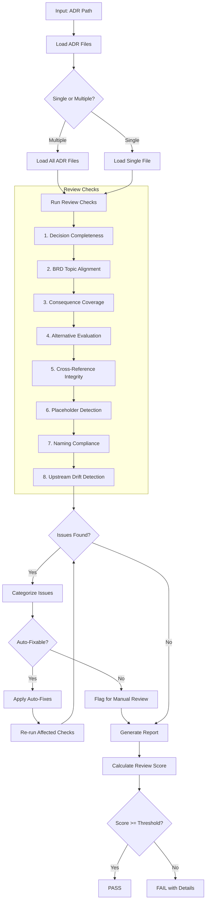
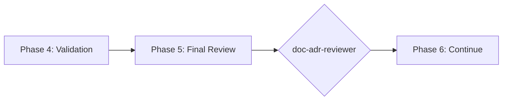

# doc-adr-reviewer

## Purpose

Comprehensive **content review and quality assurance** for Architecture Decision Records (ADR). This skill performs deep content analysis beyond structural validation, checking decision completeness, BRD topic alignment, consequence coverage, alternative evaluation, and identifying issues that require manual architectural review.

**Layer**: 5 (ADR Quality Assurance)

**Upstream**: ADR (from `doc-adr-autopilot` or `doc-adr`)

**Downstream**: None (final QA gate before SYS generation)

---

## When to Use This Skill

Use `doc-adr-reviewer` when:

- **After ADR Generation**: Run immediately after `doc-adr-autopilot` completes
- **Manual ADR Edits**: After making manual changes to ADR
- **Pre-SYS Check**: Before running `doc-sys-autopilot`
- **Periodic Review**: Regular quality checks on existing ADRs
- **Architecture Reviews**: During formal architecture review sessions

**Do NOT use when**:
- ADR does not exist yet (use `doc-adr` or `doc-adr-autopilot` first)
- Need structural/schema validation only (use `doc-adr-validator`)
- Generating new ADR content (use `doc-adr`)

---

## Skill vs Validator: Key Differences

| Aspect | `doc-adr-validator` | `doc-adr-reviewer` |
|--------|---------------------|-------------------|
| **Focus** | Schema compliance, SYS-Ready score | Content quality, decision rationale |
| **Checks** | Required sections, format | Consequence coverage, alternative evaluation |
| **Auto-Fix** | Structural issues only | Content issues (links, formatting) |
| **Output** | SYS-Ready score (numeric) | Review score + issue list |
| **Phase** | Phase 4 (Validation) | Phase 5 (Final Review) |
| **Blocking** | SYS-Ready < threshold blocks | Review score < threshold flags |

---

## Review Workflow



---

## Review Checks

### 0. Structure Compliance (12/12) - BLOCKING

Validates ADR follows the mandatory nested folder rule.

**Nested Folder Rule**: ALL ADR documents MUST be in nested folders.

**Required Structure**:

| ADR Type | Required Location |
|----------|-------------------|
| Monolithic | `docs/05_ADR/ADR-NN_{slug}/ADR-NN_{slug}.md` |

**Error Codes**:

| Code | Severity | Description |
|------|----------|-------------|
| REV-STR001 | Error | ADR not in nested folder (BLOCKING) |
| REV-STR002 | Error | Folder name doesn't match ADR ID |
| REV-STR003 | Warning | File name doesn't match folder name |

**This check is BLOCKING** - ADR must pass structure validation before other checks proceed.

---

### 1. Decision Completeness

Validates ADR has all required decision components.

**Scope**:
- Context clearly stated
- Decision explicitly documented
- Rationale provided
- Status defined
- Date recorded

**Error Codes**:

| Code | Severity | Description |
|------|----------|-------------|
| REV-DC001 | Error | Context section missing or empty |
| REV-DC002 | Error | Decision not explicitly stated |
| REV-DC003 | Error | Rationale missing |
| REV-DC004 | Warning | Status not defined |
| REV-DC005 | Warning | Date not recorded |

---

### 2. BRD Topic Alignment

Validates ADR addresses BRD Section 7.2 topics.

**Scope**:
- ADR maps to BRD ADR topic
- Topic category correct (Infrastructure, Data, Security, etc.)
- Decision matches topic requirements
- All BRD topics have corresponding ADRs

**Error Codes**:

| Code | Severity | Description |
|------|----------|-------------|
| REV-BA001 | Error | ADR not linked to BRD topic |
| REV-BA002 | Error | Topic category mismatch |
| REV-BA003 | Warning | Decision doesn't fully address topic |
| REV-BA004 | Info | BRD topic not yet addressed by ADR |

---

### 3. Consequence Coverage

Validates positive and negative consequences documented.

**Scope**:
- Positive consequences listed
- Negative consequences/trade-offs acknowledged
- Risk assessment included
- Mitigation strategies defined

**Error Codes**:

| Code | Severity | Description |
|------|----------|-------------|
| REV-CC001 | Error | No consequences documented |
| REV-CC002 | Warning | Only positive consequences (unrealistic) |
| REV-CC003 | Warning | Negative consequences without mitigation |
| REV-CC004 | Info | Risk assessment could be more detailed |

---

### 4. Alternative Evaluation

Validates alternatives were properly considered.

**Scope**:
- Multiple alternatives evaluated
- Comparison criteria defined
- Trade-off analysis present
- Rejection reasons documented

**Error Codes**:

| Code | Severity | Description |
|------|----------|-------------|
| REV-AE001 | Error | No alternatives considered |
| REV-AE002 | Warning | Only one alternative (insufficient) |
| REV-AE003 | Warning | Missing comparison criteria |
| REV-AE004 | Info | Alternative rejection reason unclear |

---

### 5. Cross-Reference Integrity

Validates links to related ADRs and documents.

**Scope**:
- Related ADRs referenced
- Superseded ADRs linked
- BRD/PRD traceability tags present
- External references valid

**Error Codes**:

| Code | Severity | Description |
|------|----------|-------------|
| REV-CR001 | Error | Broken cross-reference |
| REV-CR002 | Warning | Missing related ADR link |
| REV-CR003 | Warning | Superseded ADR not referenced |
| REV-CR004 | Info | External link unverified |

---

### 6. Placeholder Detection

Identifies incomplete content requiring replacement.

**Error Codes**:

| Code | Severity | Description |
|------|----------|-------------|
| REV-P001 | Error | [TODO] placeholder found |
| REV-P002 | Error | [TBD] placeholder found |
| REV-P003 | Warning | Template value not replaced |

---

### 7. Naming Compliance

Validates element IDs follow `doc-naming` standards.

**Scope**:
- Element IDs use `ADR.NN.TT.SS` format
- Element type codes valid for ADR (13, 14, 15, 16)
- ADR numbering sequential

**Error Codes**:

| Code | Severity | Description |
|------|----------|-------------|
| REV-N001 | Error | Invalid element ID format |
| REV-N002 | Error | Element type code not valid for ADR |
| REV-N003 | Warning | ADR numbering gap detected |

---

### 8. Upstream Drift Detection (Mandatory Cache)

Detects when upstream source documents have been modified after the ADR was created or last updated.

**The drift cache is mandatory.** All drift detection operations must read from and write to the cache file. Reviewers must fail with REV-D006 if the cache file cannot be created or accessed.

**Purpose**: Identifies stale ADR content that may not reflect current BDD scenarios. When upstream documents change, the ADR may need updates to maintain alignment.

**Upstream Documents**:
- **BDD documents**: Feature files and scenario definitions that ADR decisions must support

**Scope**:
- `@bdd:` tag targets (BDD feature files)
- Traceability section upstream artifact links
- Any markdown links to `../04_BDD/`

---

#### Drift Cache File (MANDATORY)

**Location**: `docs/05_ADR/.drift_cache.json`

**Schema**:

```json
{
  "cache_version": "1.0",
  "last_updated": "2026-02-10T17:00:00",
  "documents": {
    "ADR-01_authentication_strategy.md": {
      "adr_hash": "sha256:abc123...",
      "adr_updated": "2026-02-10T17:00:00",
      "upstream_refs": {
        "../../04_BDD/BDD-01_authentication.feature": {
          "hash": "sha256:def456...",
          "last_checked": "2026-02-10T17:00:00",
          "status": "current"
        }
      }
    }
  }
}
```

**Cache Requirements**:
1. Cache file MUST be created on first review if it does not exist
2. Cache MUST be updated after every review run
3. Cache entries MUST include SHA-256 hashes for all upstream references
4. Stale cache entries (>30 days) MUST trigger re-validation

---

#### Three-Phase Detection Algorithm

```
PHASE 1: Cache Initialization
   1. Check if .drift_cache.json exists
   2. If not exists → create with empty documents object
   3. If exists → load and validate schema
   4. If schema invalid → backup and recreate

PHASE 2: Upstream Reference Extraction
   1. Extract all upstream references from ADR:
      - @bdd: tags → [path, scenario anchor]
      - Links to ../04_BDD/ → [path]
      - Traceability table upstream artifacts → [path]

   2. For each upstream reference:
      a. Resolve path to absolute file path
      b. Check file exists (already covered by Check #5)
      c. Read file content
      d. Compute SHA-256 hash of content

PHASE 3: Drift Comparison
   1. For each upstream reference:
      a. Look up cached hash for this reference
      b. If no cached hash → flag as NEW_REFERENCE
      c. If hash matches → status = "current"
      d. If hash differs → flag as CONTENT_DRIFT

   2. Calculate drift severity:
      a. Compare content size change percentage
      b. If >20% change → CRITICAL (REV-D005)
      c. If <20% change → WARNING (REV-D002)

   3. Update cache with new hashes and timestamps
```

---

#### Hash Calculation

**Algorithm**: SHA-256

**Python Implementation**:

```python
import hashlib

def compute_file_hash(file_path: str) -> str:
    """Compute SHA-256 hash of file content."""
    with open(file_path, 'rb') as f:
        content = f.read()
    return f"sha256:{hashlib.sha256(content).hexdigest()}"
```

**Hash Scope**:
- Full file content for BDD feature files
- Specific section content when anchor specified (e.g., `#scenario-login`)

---

#### Error Codes

| Code | Severity | Description |
|------|----------|-------------|
| REV-D001 | Warning | Upstream document modified after ADR creation |
| REV-D002 | Warning | Referenced section content has changed (hash mismatch) |
| REV-D003 | Info | Upstream document version incremented |
| REV-D004 | Info | New content added to upstream document |
| REV-D005 | Error | Critical upstream document substantially modified (>20% change) |
| REV-D006 | Error | Drift cache file cannot be created or accessed (mandatory) |

---

#### Report Output

```markdown
## Upstream Drift Analysis

**Cache Status**: Active | Last Updated: 2026-02-10T17:00:00

| Upstream Document | ADR Reference | Current Hash | Cached Hash | Status | Severity |
|-------------------|---------------|--------------|-------------|--------|----------|
| BDD-01_authentication.feature | @bdd Section 3 | sha256:abc... | sha256:def... | DRIFT | Warning |
| BDD-02_authorization.feature | @bdd Section 5 | sha256:ghi... | sha256:ghi... | Current | - |

**Drift Summary**:
- Documents checked: 2
- Current: 1
- Drifted: 1
- Critical: 0

**Recommendation**: Review upstream changes and update ADR if decision context has changed.
```

---

#### Auto-Actions

1. **Cache Update**: Update `.drift_cache.json` with current hashes after every review
2. **Drift Markers**: Add `[DRIFT]` marker to affected @bdd tags (optional)
3. **Report Generation**: Include drift summary in review report
4. **Cache Backup**: Create `.drift_cache.json.bak` before updates

---

#### Configuration

| Setting | Default | Description |
|---------|---------|-------------|
| `cache_enabled` | true | Enable drift cache (Mandatory - cannot be disabled) |
| `drift_threshold_days` | 7 | Days before drift becomes Warning |
| `critical_threshold_days` | 30 | Days before drift becomes Error |
| `tracked_patterns` | `@bdd:` | Patterns to track for drift |
| `cache_backup` | true | Create backup before cache updates |

---

## Review Score Calculation

**Scoring Formula**:

| Category | Weight | Calculation |
|----------|--------|-------------|
| Decision Completeness | 24% | (complete_fields / required_fields) × 24 |
| BRD Topic Alignment | 19% | (aligned_topics / total_topics) × 19 |
| Consequence Coverage | 19% | (coverage_score) × 19 |
| Alternative Evaluation | 14% | (alternatives_evaluated / 3) × 14 |
| Cross-Reference Integrity | 5% | (valid_refs / total_refs) × 5 |
| Placeholder Detection | 5% | (no_placeholders ? 5 : 5 - count) |
| Naming Compliance | 9% | (valid_ids / total_ids) × 9 |
| Upstream Drift | 5% | (fresh_refs / total_refs) × 5 |

**Total**: Sum of all categories (max 100)

**Thresholds**:
- **PASS**: ≥ 90
- **WARNING**: 80-89
- **FAIL**: < 80

---

## Command Usage

```bash
# Review specific ADR
/doc-adr-reviewer ADR-01

# Review ADR by path
/doc-adr-reviewer docs/05_ADR/ADR-01_authentication_strategy.md

# Review all ADRs
/doc-adr-reviewer all
```

---

## Output Report

Review reports are stored alongside the reviewed document per project standards.

**Nested Folder Rule**: ALL ADRs use nested folders (`ADR-NN_{slug}/`) regardless of size. This ensures review reports, fix reports, and drift cache files are organized with their parent document.

**File Naming**: `ADR-NN.R_review_report_vNNN.md`

**Location**: Inside the ADR nested folder: `docs/ADR/ADR-NN_{slug}/`

### Versioning Rules

1. **First Review**: Creates `ADR-NN.R_review_report_v001.md`
2. **Subsequent Reviews**: Auto-increments version (v002, v003, etc.)
3. **Same-Day Reviews**: Each review gets unique version number

**Version Detection**: Scans folder for existing `ADR-NN.R_review_report_v*.md` files and increments.

**Example**:

```
docs/ADR/ADR-01_authentication_strategy/
├── ADR-01_authentication_strategy.md
├── ADR-01.R_review_report_v001.md    # First review
├── ADR-01.R_review_report_v002.md    # After fixes
└── .drift_cache.json
```

### Delta Reporting

When previous reviews exist, include score comparison in the report.

See `REVIEW_DOCUMENT_STANDARDS.md` for complete versioning requirements.

---

## Integration with doc-adr-autopilot

This skill is invoked during Phase 5 of `doc-adr-autopilot`:



---

## Related Skills

| Skill | Relationship |
|-------|--------------|
| `doc-naming` | Naming standards for Check #7 |
| `doc-adr-autopilot` | Invokes this skill in Phase 5 |
| `doc-adr-validator` | Structural validation (Phase 4) |
| `doc-adr-fixer` | Applies fixes based on review findings |
| `doc-adr` | ADR creation rules |
| `doc-bdd-reviewer` | Upstream QA |
| `doc-sys-autopilot` | Downstream consumer |

---

## Version History

| Version | Date | Changes |
|---------|------|---------|
| 1.4 | 2026-02-11 | Added Check #0: Structure Compliance (BLOCKING) - validates ADR follows mandatory nested folder rule; Added REV-STR001-003 error codes; Structure check blocks other checks if failed |
| 1.3 | 2026-02-10 | Made drift cache mandatory; Added REV-D006 error code for cache access failures; Three-phase detection algorithm; SHA-256 hash calculation with Python example; Updated cache schema with document-level tracking; Focused upstream on BDD documents only; Added cache status to report output |
| 1.2 | 2026-02-10 | Added Check #8: Upstream Drift Detection - detects when BDD/BRD documents modified after ADR creation; REV-D001-D005 error codes; drift cache support; configurable thresholds; Added doc-adr-fixer to Related Skills |
| 1.1 | 2026-02-10 | Added review versioning support (_vNNN pattern); Delta reporting for score comparison |
| 1.0 | 2026-02-10 | Initial skill creation with 7 review checks; Decision completeness; Consequence coverage; Alternative evaluation |
