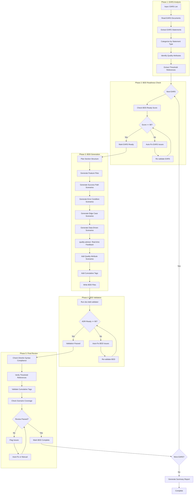
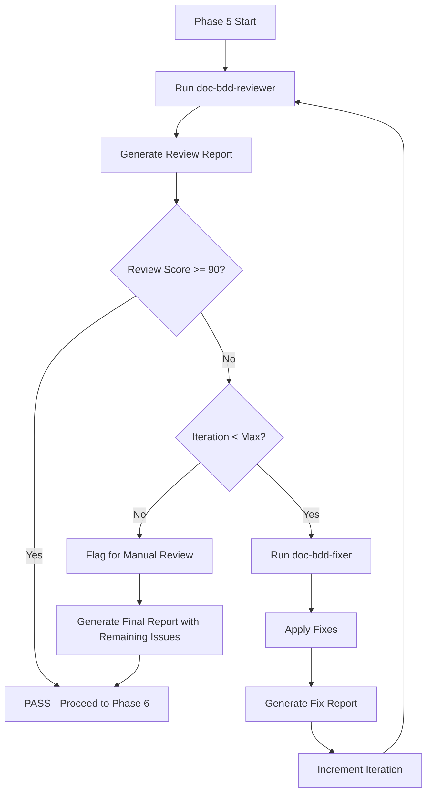
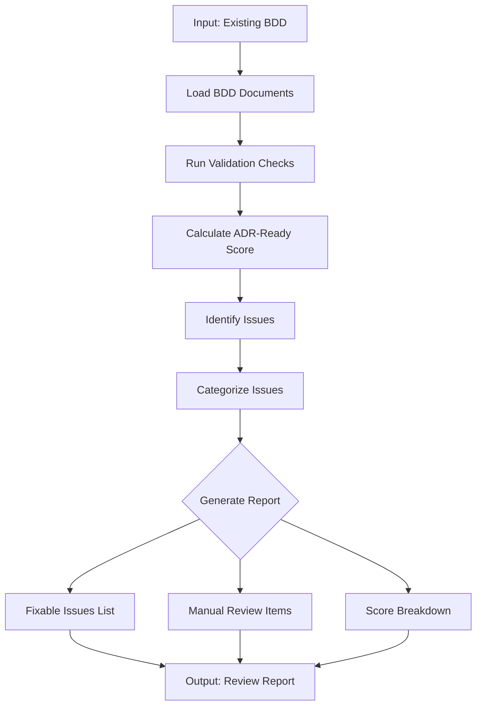
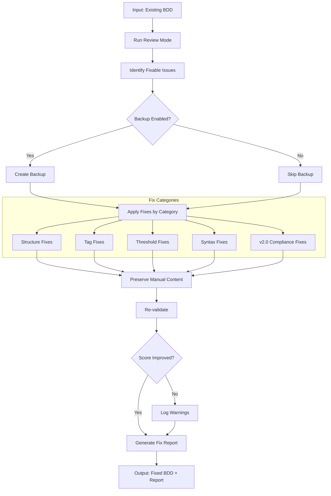

# doc-bdd-autopilot

## Purpose

Automated **BDD (Behavior-Driven Development)** generation pipeline that processes EARS documents and generates Gherkin scenarios with readiness validation, scenario categorization, and ADR-Ready score compliance.

**Layer**: 4 (BDD Generation)

**Upstream**: BRD (Layer 1), PRD (Layer 2), EARS (Layer 3)

**Downstream Artifacts**: ADR (Layer 5), SYS (Layer 6), REQ (Layer 7)

---

## Skill Dependencies

This autopilot orchestrates the following skills:

| Skill | Purpose | Phase |
|-------|---------|-------|
| `doc-naming` | Element ID format (BDD.NN.14.SS, BDD.NN.15.SS), scenario/step codes | All Phases |
| `doc-ears-validator` | Validate EARS BDD-Ready score | Phase 2: EARS Readiness |
| `doc-bdd` | BDD creation rules, Gherkin syntax, section-based structure | Phase 3: BDD Generation |
| `quality-advisor` | Real-time quality feedback during BDD generation | Phase 3: BDD Generation |
| `doc-bdd-validator` | Validate BDD structure, content, ADR-Ready score | Phase 4: BDD Validation |
| `doc-bdd-reviewer` | Content review, link validation, quality scoring | Phase 5: Review |
| `doc-bdd-fixer` | Apply fixes from review report, create missing files | Phase 5: Fix |

**Delegation Principle**: The autopilot orchestrates workflow but delegates:
- BDD structure/content rules -> `doc-bdd` skill
- Real-time quality feedback -> `quality-advisor` skill
- BDD validation logic -> `doc-bdd-validator` skill
- Content review and scoring -> `doc-bdd-reviewer` skill
- Issue resolution and fixes -> `doc-bdd-fixer` skill
- EARS validation logic -> `doc-ears-validator` skill
- Element ID standards -> `doc-naming` skill

---

## When to Use This Skill

**Use `doc-bdd-autopilot` when**:
- You have one or more completed EARS documents ready for BDD generation
- You want automated scenario categorization (Success, Error, Edge, Data-Driven)
- You need BDD-Ready score validation before generation
- You want automatic ADR-Ready score validation after BDD creation
- You need to generate Gherkin Given-When-Then scenarios from EARS statements

**Do NOT use when**:
- Creating a single BDD suite with extensive manual customization (use `doc-bdd` directly)
- EARS documents are incomplete or in Draft status
- You need fine-grained control over each scenario
- EARS BDD-Ready score is below 90%

---

## Workflow Overview



---

## Detailed Workflow

### Phase 1: EARS Analysis

Analyze EARS documents to extract requirements for BDD scenario generation.

**Input Sources** (from EARS):

| EARS Section | BDD Content | Mapping |
|--------------|-------------|---------|
| Event-Driven Statements (001-099) | User action scenarios | Success/Error scenarios |
| State-Driven Statements (101-199) | System state scenarios | State validation scenarios |
| Unwanted Behavior Statements (201-299) | Error handling scenarios | Negative/Recovery scenarios |
| Ubiquitous Statements (401-499) | Cross-cutting scenarios | Quality attribute scenarios |
| Quality Attributes Section | Performance/Security tests | Quality attribute scenarios |
| Threshold References | Parameterized values | @threshold tags in steps |

**Analysis Process**:

```bash
# Check for EARS documents
ls -la docs/03_EARS/

# Expected structure:
# - EARS-NN_{slug}.md (monolithic)
# - EARS-NN_{slug}/ (sectioned with EARS-NN.S_{section}.md files)
```

**Output**: Scenario catalog with categorization hints, threshold references, and traceability links.

### Phase 2: BDD Readiness Check

Validate that source EARS meet BDD-Ready requirements before generation.

> **Skill Delegation**: This phase uses validation rules from `doc-ears-validator` skill.
> See: `.claude/skills/doc-ears-validator/SKILL.md` for complete EARS validation rules.

**BDD-Ready Scoring Criteria (100%)**:

| Category | Weight | Criteria |
|----------|--------|----------|
| Requirements Clarity | 40% | EARS syntax compliance, statement atomicity, quantifiable constraints |
| Testability | 35% | BDD translation readiness, observable verification, edge cases specified |
| Quality Attributes | 15% | Performance targets, security requirements, reliability targets |
| Strategic Alignment | 10% | Business objective links, implementation paths |

**Minimum Score**: 90% (configurable)

**Auto-Fix Actions**:

| Issue | Auto-Fix Action |
|-------|-----------------|
| Missing WHEN-THE-SHALL syntax | Reformat statement |
| Non-atomic statements | Split into multiple statements |
| Missing quantifiable constraints | Add placeholder constraints |
| Missing edge case specifications | Flag for manual review |
| Incomplete quality attributes | Add template quality attributes |

**Validation Command** (internal):

```bash
python ai_dev_flow/scripts/validate_bdd_ready.py \
  --ears docs/03_EARS/EARS-01_{slug}/ \
  --min-score 90 \
  --auto-fix
```

### Phase 3: BDD Generation

Generate BDD scenarios from validated EARS with real-time quality feedback.

> **Skill Delegation**: This phase follows rules defined in `doc-bdd` skill.
> See: `.claude/skills/doc-bdd/SKILL.md` for complete BDD creation guidance.
>
> **Quality Guidance**: Uses `quality-advisor` skill for real-time feedback during generation.
> See: `.claude/skills/quality-advisor/SKILL.md` for quality monitoring.

**Generation Process**:

1. **Reserve BDD ID**:
   ```bash
   # Check for next available ID
   ls docs/04_BDD/BDD-*.feature docs/04_BDD/BDD-*/BDD-*.0_*.md 2>/dev/null | \
     grep -oP 'BDD-\K\d+' | sort -n | tail -1
   # Increment for new BDD
   ```

2. **Create Suite Directory**:
   ```bash
   mkdir -p docs/04_BDD/BDD-NN_{slug}/
   ```

3. **Plan Section Structure**:

   **Section Planning Based on EARS Scope**:

   | EARS Statement Count | BDD Structure | Rationale |
   |---------------------|---------------|-----------|
   | 1-10 statements | 2-3 sections | Compact coverage |
   | 11-30 statements | 4-8 sections | Standard grouping |
   | 31+ statements | 9+ sections with subsections | Complex domain |

4. **Generate Index File** (`BDD-NN.0_index.md`):

   | Field | Value |
   |-------|-------|
   | BDD ID | BDD-NN |
   | Version | 0.1.0 |
   | Date Created | Current date (YYYY-MM-DD) |
   | Last Updated | Current date (YYYY-MM-DD) |
   | Status | Draft |
   | Priority | From EARS priority |
   | Source Document | @ears: EARS.NN.25.SS (single value) |
   | ADR-Ready Score | Calculated after generation |

5. **Generate Feature Files by Section**:

   **Section File Pattern**: `BDD-NN.S_{section_name}.feature`

   **Subsection Pattern** (if >500 lines): `BDD-NN.S.SS_{subsection_name}.feature`

6. **Generate Scenarios by Category**:

   **Success Path Scenarios** (@primary):
   ```gherkin
   @section: NN.SS
   @parent_doc: BDD-NN
   @index: BDD-NN.0_index.md
   @brd:BRD.NN.01.SS
   @prd:PRD.NN.07.SS
   @ears:EARS.NN.25.SS

   Feature: BDD-NN.SS: [Feature Name]
     As a [role]
     I want [feature]
     So that [benefit]

     Background:
       Given the system timezone is "America/New_York"
       And the current time is "09:30:00" in "America/New_York"

     @primary @functional @scenario-id:BDD.NN.14.01
     Scenario: Successful [action description]
       Given [precondition from EARS WHEN clause]
       When [action from EARS trigger]
       Then [outcome from EARS SHALL clause]
       And response time is less than @threshold:PRD.NN.perf.api.p95_latency
   ```

   **Error Condition Scenarios** (@negative):
   ```gherkin
   @negative @error_handling @scenario-id:BDD.NN.14.10
   Scenario: [Error condition] results in [expected behavior]
     Given [error precondition from EARS IF clause]
     When [action that triggers error]
     Then [error handling from EARS prevention/recovery]
     And error code "[ERROR_CODE]" is returned
   ```

   **Edge Case Scenarios** (@edge_case, @boundary):
   ```gherkin
   @edge_case @boundary @scenario-id:BDD.NN.14.20
   Scenario: [Boundary condition] at [limit value]
     Given [boundary precondition]
     When [action at boundary]
     Then [expected boundary behavior]
   ```

   **Data-Driven Scenarios** (@data_driven):
   ```gherkin
   @data_driven @scenario-id:BDD.NN.14.30
   Scenario Outline: [Parameterized test description]
     Given [context with <variable>]
     When [action with <variable>]
     Then [outcome with <variable>]
     Examples:
       | variable | expected |
       | value1   | result1  |
       | value2   | result2  |
   ```

   **Quality Attribute Scenarios** (@quality_attribute):
   ```gherkin
   @quality_attribute @performance @scenario-id:BDD.NN.14.40
   Scenario: API response meets performance threshold
     Given system is under normal load
     When user submits request
     Then response time is less than @threshold:PRD.NN.perf.api.p95_latency
     And throughput exceeds @threshold:PRD.NN.perf.api.min_throughput
   ```

   **Integration Scenarios** (@integration):
   ```gherkin
   @integration @external_system @scenario-id:BDD.NN.14.50
   Scenario: External system integration succeeds
     Given external service is available
     When system initiates integration call
     Then integration completes within @threshold:PRD.NN.timeout.integration.max
   ```

   **Failure Recovery Scenarios** (@failure_recovery):
   ```gherkin
   @failure_recovery @circuit_breaker @scenario-id:BDD.NN.14.60
   Scenario: System recovers from transient failure
     Given external service experiences transient failure
     When retry mechanism activates
     Then system recovers within @threshold:PRD.NN.retry.max_attempts attempts
     And circuit breaker state is updated
   ```

7. **Real-Time Quality Feedback** (via `quality-advisor` skill):
   - Monitor Gherkin syntax compliance as scenarios are generated
   - Detect anti-patterns (missing Given/When/Then, hardcoded values)
   - Validate @threshold tag format and references
   - Check element ID format compliance (BDD.NN.14.SS, BDD.NN.15.SS)
   - Flag issues early to reduce post-generation rework

8. **Add Cumulative Traceability Tags**:

   **Required Tags per Feature** (Gherkin-native, NOT in comments):
   ```gherkin
   @brd:BRD.NN.01.SS
   @prd:PRD.NN.07.SS
   @ears:EARS.NN.25.SS
   Feature: BDD-NN.SS: Feature Name
   ```

   **Layer 4 Cumulative Tag Requirement**: @brd, @prd, @ears (3+ tags)

9. **Generate Redirect Stub**:
   ```bash
   # Create redirect stub at docs/04_BDD/ root
   touch docs/04_BDD/BDD-NN_{slug}.feature
   ```

   **Redirect Stub Content**:
   ```gherkin
   @redirect
   @section: NN.00
   @parent_doc: BDD-NN
   @index: BDD-NN.0_index.md

   Feature: BDD-NN: [Suite Name] (Redirect)

     This is a redirect stub. Test scenarios are in section files:
     - BDD-NN.1_{section1}.feature - [Description]
     - BDD-NN.2_{section2}.feature - [Description]

   Background:
     Given the system timezone is "America/New_York"
     # No scenarios in redirect stub
   ```

10. **Update Index File**:
    - List all section files with scenario counts and line counts
    - Add traceability matrix linking EARS to BDD sections
    - Calculate and display ADR-Ready Score

### Phase 4: BDD Validation

After BDD generation, validate structure and ADR-Ready score.

> **Skill Delegation**: This phase uses validation rules from `doc-bdd-validator` skill.
> See: `.claude/skills/doc-bdd-validator/SKILL.md` for complete validation rules.

**Validation Command**:

```bash
python ai_dev_flow/scripts/validate_bdd.py docs/04_BDD/BDD-NN_{slug}/ --verbose
```

**Validation Checks**:

| Check | Requirement | Error Code |
|-------|-------------|------------|
| Section Structure | Index file exists, valid patterns | CHECK 9.1-9.7 |
| Document Control | All required fields in index | BDD-E001 to BDD-E009 |
| Gherkin Syntax | Valid Given-When-Then structure | BDD-E010, BDD-E011 |
| Element ID Format | BDD.NN.14.SS (scenarios), BDD.NN.15.SS (steps) | BDD-E008 |
| Tags Placement | Gherkin-native, not in comments | BDD-E041 |
| Cumulative Tags | @brd, @prd, @ears present | BDD-W002 |
| ADR-Ready Score | >= 90% | BDD-W003 |
| File Size | < 500 lines per .feature file | CHECK 9.4 |
| Scenario Count | <= 12 per Feature block | CHECK 9.4 |
| Scenario Type Tag | @scenario-type present on each scenario | BDD-E050 |
| Priority Tag | @p0/@p1/@p2/@p3 present on each scenario | BDD-E051 |
| Timing Constraint Format | WITHIN @threshold format for timed ops | BDD-E052 |
| 5-Category Coverage | success, optional, recovery, parameterized, error | BDD-E053 |
| Threshold Format | @threshold:PRD.NN.category.field syntax | BDD-E054 |
| WITHIN Constraint | Required for performance scenarios | BDD-E055 |

**Auto-Fix Actions**:

| Issue | Auto-Fix Action |
|-------|-----------------|
| Missing Given-When-Then | Add template step structure |
| Invalid element ID format | Convert to BDD.NN.14.SS format |
| Tags in comments | Move to Gherkin-native position |
| Missing @threshold tags | Add placeholder tags |
| Hardcoded numeric values | Replace with @threshold references |
| Missing ADR-Ready Score | Calculate and insert |

**Validation Loop**:

```
LOOP (max 3 iterations):
  1. Run doc-bdd-validator
  2. IF errors found: Apply auto-fixes
  3. IF warnings found: Review and address if critical
  4. IF ADR-Ready Score < 90%: Enhance scenarios
  5. IF clean: Mark VALIDATED, proceed
  6. IF max iterations: Log issues, flag for manual review
```

### Phase 5: Review & Fix Cycle (v2.1)

Iterative review and fix cycle to ensure BDD quality before completion.



#### 5.1 Initial Review

Run `doc-bdd-reviewer` to identify issues.

```bash
/doc-bdd-reviewer BDD-NN
```

**Output**: `BDD-NN.R_review_report_v001.md`

**Review Checks**:

1. **Gherkin Syntax Compliance**:
   - All scenarios use Given-When-Then structure
   - No vague language ("fast", "efficient", "user-friendly")
   - All steps are atomic and actionable
   - Background steps are appropriate

2. **Threshold Reference Consistency**:
   - All @threshold tags reference valid PRD thresholds
   - Threshold values match PRD source
   - No orphan threshold references
   - No hardcoded numeric values in steps

3. **Cumulative Tag Validation**:
   - @brd tags reference valid BRD elements
   - @prd tags reference valid PRD elements
   - @ears tags reference valid EARS elements
   - Tags are Gherkin-native (not in comments)

4. **Scenario Coverage**:
   - All 8 scenario categories represented
   - Success path scenarios for each EARS event-driven statement
   - Error scenarios for each EARS unwanted behavior statement
   - Edge cases for boundary conditions
   - Data-driven scenarios for parameterized tests

#### 5.2 Fix Cycle

If review score < 90%, invoke `doc-bdd-fixer`.

```bash
/doc-bdd-fixer BDD-NN --revalidate
```

**Fix Categories**:

| Category | Fixes Applied |
|----------|---------------|
| Missing Files | Create index, redirect stubs |
| Broken Links | Update paths, create targets |
| Element IDs | Convert legacy patterns to BDD.NN.14.SS/BDD.NN.15.SS |
| Tags | Move comment tags to Gherkin-native, add missing tags |
| Thresholds | Replace hardcoded values with @threshold references |
| v2.0 Compliance | Add @scenario-type, @priority, WITHIN constraints |

**Output**: `BDD-NN.F_fix_report_v001.md`

#### 5.3 Re-Review

After fixes, automatically re-run reviewer.

```bash
/doc-bdd-reviewer BDD-NN
```

**Output**: `BDD-NN.R_review_report_v002.md`

#### 5.4 Iteration Control

| Parameter | Default | Description |
|-----------|---------|-------------|
| `max_iterations` | 3 | Maximum fix-review cycles |
| `target_score` | 90 | Minimum passing score |
| `stop_on_manual` | false | Stop if only manual issues remain |

**Iteration Example**:

```
Iteration 1:
  Review v001: Score 84 (3 errors, 6 warnings)
  Fix v001: Fixed 7 issues, added 5 threshold references

Iteration 2:
  Review v002: Score 92 (0 errors, 4 warnings)
  Status: PASS (score >= 90)
```

#### 5.5 Quality Checks (Post-Fix)

After passing the fix cycle:

1. **ADR-Ready Report** (with Visual Indicators):

   **Score Display Format**:
   - ✅ >= 90% (Target Met)
   - 🟡 85-89% (Near Threshold)
   - ❌ < 85% (Failing)

   ```
   ADR-Ready Score Breakdown
   =========================
   Scenario Completeness:      35/35 ✅
     EARS Translation:         15/15
     Success/Error/Edge:       15/15
     Observable Verification:  5/5

   Testability:               30/30 ✅
     Automatable Scenarios:   15/15
     Data-Driven Examples:    10/10
     Performance Benchmarks:  5/5

   Architecture Requirements: 25/25 ✅
     Quality Attributes:      15/15
     Integration Points:      10/10

   Business Validation:       10/10 ✅
     Acceptance Criteria:     5/5
     Success Outcomes:        5/5

   v2.0 Compliance:           (Bonus)
     Scenario Type Tags:      ✅ All scenarios tagged
     Priority Tags:           ✅ All scenarios prioritized
     SHALL+WITHIN Language:   ✅ 15/15 timed scenarios
     5-Category Coverage:     ✅ All 5 categories present
     Threshold Format:        ✅ @threshold:PRD.NN format
   ----------------------------
   Total ADR-Ready Score:     ✅ 100/100 (Target: >= 90)
   Status: READY FOR ADR GENERATION
   ```

2. **Traceability Matrix Update**:

   ```bash
   # Update BDD-00_TRACEABILITY_MATRIX.md
   python ai_dev_flow/scripts/update_traceability_matrix.py \
     --bdd docs/04_BDD/BDD-NN_{slug}/ \
     --matrix docs/04_BDD/BDD-00_TRACEABILITY_MATRIX.md
   ```

---

## Scenario Category Reference

### 1. Success Path Scenarios (@primary)

**Purpose**: Validate happy path functionality

**Source**: EARS Event-Driven statements (WHEN...THE...SHALL)

**Example**:
```gherkin
@primary @functional
Scenario: User successfully authenticates with valid credentials
  Given user has valid credentials
  And authentication service is available
  When user submits authentication request
  Then user session is created
  And session token is returned
  And response time is less than @threshold:PRD.01.auth.response.p95
```

**Coverage Target**: Every EARS event-driven requirement

### 2. Alternative Path Scenarios (@alternative)

**Purpose**: Validate optional parameters and alternate workflows

**Source**: EARS variations and optional paths

**Example**:
```gherkin
@alternative @optional_params
Scenario: User authenticates with remember-me option
  Given user has valid credentials
  When user submits authentication with remember-me enabled
  Then extended session token is returned
  And session expiry is set to @threshold:PRD.01.session.extended_ttl
```

**Coverage Target**: Each optional parameter combination

### 3. Error Condition Scenarios (@negative)

**Purpose**: Validate error handling and invalid inputs

**Source**: EARS Unwanted Behavior statements (IF...THEN...SHALL)

**Example**:
```gherkin
@negative @error_handling
Scenario: Authentication fails with invalid credentials
  Given user has invalid credentials
  When user submits authentication request
  Then authentication is rejected
  And error code "AUTH_INVALID_CREDENTIALS" is returned
  And failed attempt is logged
```

**Coverage Target**: Every EARS unwanted behavior statement

### 4. Edge Case Scenarios (@edge_case, @boundary)

**Purpose**: Validate boundary conditions and limits

**Source**: EARS constraints and threshold boundaries

**Example**:
```gherkin
@edge_case @boundary
Scenario: Session expires at exact timeout boundary
  Given session was created at "09:00:00" in "America/New_York"
  And session timeout is @threshold:PRD.01.session.idle_timeout
  When current time reaches session expiry
  Then session is invalidated
  And user is prompted to re-authenticate
```

**Coverage Target**: Each numeric threshold and boundary condition

### 5. Data-Driven Scenarios (@data_driven)

**Purpose**: Validate behavior across multiple data combinations

**Source**: EARS statements with parameterized values

**Example**:
```gherkin
@data_driven
Scenario Outline: Validate user role authorization
  Given user has role <role>
  When user attempts to access <resource>
  Then access is <result>

  Examples:
    | role    | resource    | result  |
    | admin   | /admin      | granted |
    | user    | /admin      | denied  |
    | user    | /dashboard  | granted |
    | guest   | /dashboard  | denied  |
```

**Coverage Target**: Each parameterized requirement

### 6. Integration Scenarios (@integration)

**Purpose**: Validate external system interactions

**Source**: EARS statements involving external dependencies

**Example**:
```gherkin
@integration @external_api
Scenario: System integrates with external identity provider
  Given external identity provider is configured
  When user initiates SSO authentication
  Then system redirects to identity provider
  And callback is processed within @threshold:PRD.01.sso.callback_timeout
```

**Coverage Target**: Each external system dependency

### 7. Quality Attribute Scenarios (@quality_attribute)

**Purpose**: Validate non-functional requirements

**Source**: EARS Quality Attributes section

**Example**:
```gherkin
@quality_attribute @performance
Scenario: Authentication endpoint meets performance SLA
  Given system is under normal load
  When 100 concurrent authentication requests are submitted
  Then p95 response time is less than @threshold:PRD.01.perf.auth.p95_latency
  And no requests fail due to timeout
```

**Coverage Target**: Each quality attribute (performance, security, reliability)

### 8. Failure Recovery Scenarios (@failure_recovery)

**Purpose**: Validate resilience and recovery mechanisms

**Source**: EARS Unwanted Behavior recovery statements

**Example**:
```gherkin
@failure_recovery @circuit_breaker
Scenario: Authentication service recovers from database failure
  Given database connection fails
  When authentication request is received
  Then circuit breaker activates
  And fallback authentication is attempted
  And service recovers within @threshold:PRD.01.recovery.max_time
```

**Coverage Target**: Each recovery and resilience mechanism

---

## Enhanced Scenario Tagging (v2.0)

### Scenario Type Classification

All scenarios MUST include a `@scenario-type` tag for classification:

| Tag | Purpose | Priority Default | Coverage Requirement |
|-----|---------|------------------|---------------------|
| `@scenario-type:success` | Primary happy path | @p0-critical | Required for all EARS event-driven |
| `@scenario-type:optional` | Alternative workflows | @p2-medium | Optional parameters |
| `@scenario-type:recovery` | Failure recovery | @p1-high | Resilience patterns |
| `@scenario-type:parameterized` | Data-driven | @p2-medium | Multi-value validation |
| `@scenario-type:error` | Negative cases | @p1-high | Error handling |

### Priority Classification

All scenarios MUST include a priority tag:

| Tag | Definition | Impact |
|-----|------------|--------|
| `@p0-critical` | MVP blocking - must pass for release | Blocks deployment |
| `@p1-high` | Sprint required - must pass within sprint | Sprint scope |
| `@p2-medium` | Next iteration - important but deferrable | Next planning cycle |
| `@p3-low` | Backlog - nice to have | Future consideration |

### SHALL+WITHIN Language Pattern

For timed operations, use formal EARS-derived language with WITHIN constraints:

```gherkin
@scenario-type:success @p0-critical
Scenario: Authentication completes within performance threshold
  Given user has valid credentials
  When user submits authentication request
  Then the system SHALL authenticate the user
  And the response SHALL be returned WITHIN @threshold:PRD.01.perf.auth.p95_latency
```

**WITHIN Constraint Rules**:

1. All performance-related scenarios MUST include WITHIN clauses
2. WITHIN values MUST reference threshold registry (no hardcoded values)
3. Format: `WITHIN @threshold:PRD.NN.category.field`

### Enhanced Scenario Template

```gherkin
@section: NN.SS
@parent_doc: BDD-NN
@index: BDD-NN.0_index.md
@brd:BRD.NN.01.SS
@prd:PRD.NN.07.SS
@ears:EARS.NN.25.SS

Feature: BDD-NN.SS: [Feature Name]
  As a [role]
  I want [feature]
  So that [benefit]

  Background:
    Given the system timezone is "America/New_York"
    And the current time is "09:30:00" in "America/New_York"

  @scenario-type:success @p0-critical @scenario-id:BDD.NN.14.01
  Scenario: [Primary success path description]
    Given [precondition from EARS WHEN clause]
    When [action from EARS trigger]
    Then the system SHALL [outcome from EARS SHALL clause]
    And the response SHALL be returned WITHIN @threshold:PRD.NN.perf.api.p95_latency

  @scenario-type:error @p1-high @scenario-id:BDD.NN.14.10
  Scenario: [Error condition] results in [expected behavior]
    Given [error precondition from EARS IF clause]
    When [action that triggers error]
    Then the system SHALL NOT [prevented behavior]
    And error code "[ERROR_CODE]" SHALL be returned WITHIN @threshold:PRD.NN.timeout.error.response

  @scenario-type:recovery @p1-high @scenario-id:BDD.NN.14.20
  Scenario: System recovers from [failure type]
    Given [failure condition]
    When [recovery trigger]
    Then the system SHALL recover WITHIN @threshold:PRD.NN.recovery.max_time
    And circuit breaker state SHALL transition to "half-open"

  @scenario-type:parameterized @p2-medium @scenario-id:BDD.NN.14.30
  Scenario Outline: [Parameterized test description]
    Given [context with <variable>]
    When [action with <variable>]
    Then the system SHALL [outcome with <expected>]

    Examples:
      | variable | expected |
      | value1   | result1  |
      | value2   | result2  |

  @scenario-type:optional @p2-medium @scenario-id:BDD.NN.14.40
  Scenario: [Alternative path with optional parameter]
    Given [optional context]
    When [alternative action]
    Then the system SHALL [alternative outcome]
```

### 5-Category Coverage Matrix

| Category | Minimum Scenarios | Priority Distribution |
|----------|-------------------|----------------------|
| Success | 1 per EARS event-driven | 100% @p0-critical or @p1-high |
| Error | 1 per EARS unwanted behavior | 80% @p1-high, 20% @p2-medium |
| Recovery | 1 per circuit breaker pattern | 100% @p1-high |
| Parameterized | 1 per multi-value requirement | 50% @p1-high, 50% @p2-medium |
| Optional | 1 per optional parameter | 100% @p2-medium or @p3-low |

---

## Execution Modes

### Single EARS Mode

Generate BDD from one EARS document.

```bash
# Example: Generate BDD from EARS-01
python ai_dev_flow/scripts/bdd_autopilot.py \
  --ears docs/03_EARS/EARS-01_f1_iam/ \
  --output docs/04_BDD/ \
  --id 01 \
  --slug f1_iam_scenarios
```

### Batch Mode

Generate BDD from multiple EARS in sequence.

```bash
# Example: Generate BDD from all EARS
python ai_dev_flow/scripts/bdd_autopilot.py \
  --batch config/bdd_batch.yaml \
  --output docs/04_BDD/
```

**Batch Configuration** (`config/bdd_batch.yaml`):

```yaml
bdd_generation:
  - id: "01"
    slug: "f1_iam_scenarios"
    ears: "EARS-01"
    priority: 1

  - id: "02"
    slug: "f2_data_scenarios"
    ears: "EARS-02"
    priority: 2

  - id: "03"
    slug: "f3_api_scenarios"
    ears: "EARS-03"
    priority: 2

execution:
  parallel: false
  fail_fast: true
```

### Dry Run Mode

Preview execution plan without generating files.

```bash
python ai_dev_flow/scripts/bdd_autopilot.py \
  --ears docs/03_EARS/EARS-01_f1_iam/ \
  --dry-run
```

### Review Mode (v2.1)

Validate existing BDD documents and generate a quality report without modification.

**Purpose**: Audit existing BDD documents for compliance, quality scores, and identify issues.

**Command**:
```bash
# Review single BDD suite
python ai_dev_flow/scripts/bdd_autopilot.py \
  --bdd docs/04_BDD/BDD-01_f1_iam/ \
  --mode review

# Review all BDD suites
python ai_dev_flow/scripts/bdd_autopilot.py \
  --bdd docs/04_BDD/ \
  --mode review \
  --output-report tmp/bdd_review_report.md
```

**Review Process**:



**Review Report Structure**:

```markdown
# BDD Review Report: BDD-01_f1_iam

## Summary
- **ADR-Ready Score**: 87% 🟡
- **Total Issues**: 12
- **Auto-Fixable**: 8
- **Manual Review**: 4

## Score Breakdown
| Category | Score | Status |
|----------|-------|--------|
| Scenario Completeness | 32/35 | 🟡 |
| Testability | 28/30 | ✅ |
| Architecture Requirements | 20/25 | 🟡 |
| Business Validation | 7/10 | ❌ |

## v2.0 Compliance
| Check | Status | Details |
|-------|--------|---------|
| Scenario Type Tags | ❌ | 5 scenarios missing @scenario-type |
| Priority Tags | 🟡 | 3 scenarios missing priority |
| SHALL+WITHIN Language | ❌ | 8 timed scenarios lack WITHIN |
| 5-Category Coverage | ✅ | All categories present |
| Threshold Format | 🟡 | 2 hardcoded values found |

## Auto-Fixable Issues
| # | Issue | Location | Fix Action |
|---|-------|----------|------------|
| 1 | Missing @scenario-type tag | BDD-01.1:L45 | Add @scenario-type:success |
| 2 | Hardcoded timeout value | BDD-01.2:L78 | Replace with @threshold |
| ... | ... | ... | ... |

## Manual Review Required
| # | Issue | Location | Reason |
|---|-------|----------|--------|
| 1 | Ambiguous step definition | BDD-01.3:L102 | Requires domain knowledge |
| 2 | Missing edge case scenario | BDD-01.1 | Content decision needed |
| ... | ... | ... | ... |

## Recommendations
1. Run fix mode to address 8 auto-fixable issues
2. Review and update 4 items requiring manual attention
3. Add 2 missing edge case scenarios for full coverage
```

**Review Configuration**:

```yaml
review_mode:
  enabled: true
  checks:
    - structure_validation      # Index, sections, redirects
    - gherkin_syntax           # Given-When-Then compliance
    - tag_validation           # Cumulative tags, scenario tags
    - threshold_references     # @threshold format and validity
    - v2_compliance            # Scenario types, priorities, WITHIN
    - coverage_analysis        # 5-category coverage
    - score_calculation        # ADR-Ready score
  output:
    format: markdown           # markdown, json, html
    include_line_numbers: true
    include_fix_suggestions: true
  thresholds:
    pass: 90
    warning: 85
    fail: 0
```

### Fix Mode (v2.1)

Auto-repair existing BDD documents while preserving manual content.

**Purpose**: Apply automated fixes to BDD documents to improve quality scores and compliance.

**Command**:
```bash
# Fix single BDD suite
python ai_dev_flow/scripts/bdd_autopilot.py \
  --bdd docs/04_BDD/BDD-01_f1_iam/ \
  --mode fix

# Fix with backup
python ai_dev_flow/scripts/bdd_autopilot.py \
  --bdd docs/04_BDD/BDD-01_f1_iam/ \
  --mode fix \
  --backup

# Fix specific issue types only
python ai_dev_flow/scripts/bdd_autopilot.py \
  --bdd docs/04_BDD/BDD-01_f1_iam/ \
  --mode fix \
  --fix-types "tags,thresholds,syntax"

# Dry-run fix (preview changes)
python ai_dev_flow/scripts/bdd_autopilot.py \
  --bdd docs/04_BDD/BDD-01_f1_iam/ \
  --mode fix \
  --dry-run
```

**Fix Process**:



**Fix Categories and Actions**:

| Category | Issue | Auto-Fix Action | Preserves Content |
|----------|-------|-----------------|-------------------|
| **Structure** | Missing index file | Generate from existing sections | ✅ |
| **Structure** | Missing redirect stub | Create redirect stub | ✅ |
| **Tags** | Missing @scenario-type | Add based on scenario content analysis | ✅ |
| **Tags** | Missing @priority | Add default @p2-medium | ✅ |
| **Tags** | Tags in comments | Move to Gherkin-native position | ✅ |
| **Tags** | Missing cumulative tags | Add with placeholder references | ✅ |
| **Thresholds** | Hardcoded numeric values | Replace with @threshold:PRD.NN.xxx | ✅ |
| **Thresholds** | Invalid threshold format | Convert to @threshold:PRD.NN.category.field | ✅ |
| **Syntax** | Missing Given/When/Then | Flag for manual (content needed) | N/A |
| **Syntax** | Vague language | Suggest replacements in report | ✅ |
| **v2.0** | Missing WITHIN clause | Add WITHIN @threshold for timed ops | ✅ |
| **v2.0** | Missing SHALL language | Convert "should" to "SHALL" | ✅ |

**Content Preservation Rules**:

1. **Never delete** existing scenario content
2. **Never modify** step definitions (Given/When/Then text)
3. **Never change** Examples table data
4. **Only add** missing tags and metadata
5. **Only replace** hardcoded values with threshold references
6. **Backup first** if `--backup` flag is set

**Fix Report Structure**:

```markdown
# BDD Fix Report: BDD-01_f1_iam

## Summary
- **Before ADR-Ready Score**: 87% 🟡
- **After ADR-Ready Score**: 94% ✅
- **Issues Fixed**: 8
- **Issues Remaining**: 4 (manual review required)

## Fixes Applied
| # | Issue | Location | Fix Applied |
|---|-------|----------|-------------|
| 1 | Missing @scenario-type | BDD-01.1:L45 | Added @scenario-type:success |
| 2 | Hardcoded timeout | BDD-01.2:L78 | Replaced with @threshold:PRD.01.timeout.api.max |
| 3 | Tags in comments | BDD-01.3:L12 | Moved to Gherkin-native position |
| ... | ... | ... | ... |

## Files Modified
- docs/04_BDD/BDD-01_f1_iam/BDD-01.1_authentication.feature
- docs/04_BDD/BDD-01_f1_iam/BDD-01.2_session.feature
- docs/04_BDD/BDD-01_f1_iam/BDD-01.3_authorization.feature

## Backup Location
- tmp/backup/BDD-01_f1_iam_20260209_143022/

## Remaining Issues (Manual Review)
| # | Issue | Location | Reason |
|---|-------|----------|--------|
| 1 | Ambiguous step | BDD-01.3:L102 | Requires domain knowledge |
| ... | ... | ... | ... |

## Next Steps
1. Review manually flagged items
2. Re-run validation to confirm score
3. Commit changes if satisfied
```

**Fix Configuration**:

```yaml
fix_mode:
  enabled: true
  backup:
    enabled: true
    location: "tmp/backup/"
    retention_days: 7

  fix_categories:
    structure: true          # Index, redirects
    tags: true               # Scenario tags, cumulative tags
    thresholds: true         # @threshold references
    syntax: false            # Gherkin syntax (risky, disabled by default)
    v2_compliance: true      # Scenario types, priorities, WITHIN

  preservation:
    step_definitions: true   # Never modify step text
    examples_data: true      # Never modify Examples tables
    comments: true           # Preserve user comments
    custom_tags: true        # Preserve non-standard tags

  validation:
    re_validate_after_fix: true
    require_score_improvement: false
    max_fix_iterations: 3
```

**Command Line Options (Review/Fix)**:

| Option | Mode | Default | Description |
|--------|------|---------|-------------|
| `--mode review` | Review | - | Run review mode only |
| `--mode fix` | Fix | - | Run fix mode |
| `--output-report` | Both | auto | Report output path |
| `--backup` | Fix | true | Create backup before fixing |
| `--fix-types` | Fix | all | Comma-separated fix categories |
| `--dry-run` | Fix | false | Preview fixes without applying |
| `--preserve-all` | Fix | false | Extra cautious preservation |
| `--min-score-gain` | Fix | 0 | Minimum score improvement required |

---

## Configuration

### Default Configuration

```yaml
# config/bdd_autopilot.yaml
bdd_autopilot:
  version: "2.0"

  scoring:
    bdd_ready_min: 90
    adr_ready_min: 90
    strict_mode: false
    # NEW: Visual score indicators
    score_display:
      pass_icon: "✅"      # >= 90%
      warning_icon: "🟡"   # 85-89%
      fail_icon: "❌"      # < 85%

  execution:
    max_parallel: 3        # HARD LIMIT - do not exceed
    chunk_size: 3          # Documents per chunk
    pause_between_chunks: true
    auto_fix: true
    continue_on_error: false
    timeout_per_ears: 300  # seconds

  output:
    structure: sectioned  # always sectioned for BDD
    size_threshold_lines: 500
    max_scenarios_per_feature: 12
    report_format: markdown

  validation:
    skip_validation: false
    fix_iterations_max: 3
    # NEW: Enhanced validation checks
    require_scenario_type_tags: true
    require_priority_tags: true
    require_within_constraints: true
    require_5_category_coverage: true

  review:
    enabled: true
    check_gherkin: true
    check_thresholds: true
    check_coverage: true
    check_tags: true
    auto_fix_gherkin: true
    # NEW: SHALL+WITHIN enforcement
    check_timing_constraints: true

  coverage:
    require_success_paths: true
    require_error_scenarios: true
    require_edge_cases: true
    require_data_driven: true
    require_quality_attributes: true
    # NEW: 5-Category Coverage
    categories:
      - success      # Primary happy path
      - optional     # Alternative paths
      - recovery     # Failure recovery
      - parameterized # Data-driven
      - error        # Negative cases

  # NEW: Scenario Classification
  scenario_classification:
    type_tags:
      - "@scenario-type:success"
      - "@scenario-type:optional"
      - "@scenario-type:recovery"
      - "@scenario-type:parameterized"
      - "@scenario-type:error"
    priority_tags:
      - "@p0-critical"  # MVP blocking
      - "@p1-high"      # Sprint required
      - "@p2-medium"    # Next iteration
      - "@p3-low"       # Backlog

  # NEW: Threshold Reference Format
  threshold_format:
    pattern: "@threshold:PRD.NN.category.field"
    examples:
      - "@threshold:PRD.01.perf.auth.p95_latency"
      - "@threshold:PRD.01.timeout.session.idle"
      - "@threshold:PRD.01.retry.max_attempts"
```

### Command Line Options

| Option | Default | Description |
|--------|---------|-------------|
| `--min-bdd-ready` | 90 | Minimum BDD-Ready score (EARS) |
| `--min-adr-ready` | 90 | Minimum ADR-Ready score (BDD) |
| `--no-auto-fix` | false | Disable auto-fix (manual only) |
| `--continue-on-error` | false | Continue if one EARS fails |
| `--dry-run` | false | Preview execution plan only |
| `--skip-review` | false | Skip final review phase |
| `--all-categories` | true | Require all 8 scenario categories |

---

## Context Management

### Chunked Parallel Execution (MANDATORY)

**CRITICAL**: To prevent conversation context overflow errors ("Prompt is too long", "Conversation too long"), all autopilot operations MUST follow chunked execution rules:

**Chunk Size Limit**: Maximum 3 documents per chunk

**Chunking Rules**:

1. **Chunk Formation**: Group EARS documents into chunks of maximum 3 at a time
2. **Sequential Chunk Processing**: Process one chunk at a time, completing all BDDs in a chunk before starting the next
3. **Context Pause**: After completing each chunk, provide a summary and pause for user acknowledgment
4. **Progress Tracking**: Display chunk progress (e.g., "Chunk 2/5: Processing EARS-04, EARS-05, EARS-06")

**Execution Pattern**:

```text
EARS: EARS-01, EARS-02, EARS-03, EARS-04, EARS-05, EARS-06, EARS-07

Chunk 1: [EARS-01, EARS-02, EARS-03] → Process → Summary → Pause
Chunk 2: [EARS-04, EARS-05, EARS-06] → Process → Summary → Pause
Chunk 3: [EARS-07]                    → Process → Summary → Complete
```

**Chunk Completion Summary Template**:

```text
Chunk N/M Complete:
├── Generated: BDD-01, BDD-02, BDD-03
├── ADR-Ready Scores: 94%, 92%, 91%
├── Status: All validated
└── Next: Continue with Chunk N+1? [Y/n]
```

**Why Chunking is Required**:

- Prevents "Conversation too long" errors during batch processing
- Allows context compaction between chunks
- Enables recovery from failures without losing all progress
- Provides natural checkpoints for user review

---

## Output Artifacts

### Generated Files

**All BDD suites use nested folders** (`BDD-NN_{slug}/`). This keeps feature files and companion files (review reports, fix reports, drift cache) organized together.

| File | Purpose | Location |
|------|---------|----------|
| BDD-NN_{slug}/ | BDD suite folder (ALWAYS created) | `docs/04_BDD/` |
| BDD-NN.0_index.md | Suite index | `docs/04_BDD/BDD-NN_{slug}/` |
| BDD-NN.S_{section}.feature | Section files | `docs/04_BDD/BDD-NN_{slug}/` |
| BDD-NN_{slug}.feature | Redirect stub | `docs/04_BDD/` |
| BDD-NN.R_review_report_v{VVV}.md | Review report | `docs/04_BDD/BDD-NN_{slug}/` |
| BDD-NN.F_fix_report_v{VVV}.md | Fix report | `docs/04_BDD/BDD-NN_{slug}/` |
| .drift_cache.json | Drift detection cache | `docs/04_BDD/BDD-NN_{slug}/` |

### Section File Structure

| Pattern | Example | Purpose |
|---------|---------|---------|
| Section-Only | `BDD-01.1_authentication.feature` | Standard section |
| Subsection | `BDD-01.2.01_session_creation.feature` | Large section split |
| Aggregator | `BDD-01.2.00_session.feature` | Organizing subsections (@redirect) |

### Validation Reports

| Report | Purpose | Location |
|--------|---------|----------|
| bdd_validation_report.json | Validation results | `tmp/` |
| adr_ready_score.json | ADR-Ready breakdown | `tmp/` |
| autopilot_log.md | Execution log | `tmp/` |

---

## Error Handling

### Error Categories

| Category | Handling | Example |
|----------|----------|---------|
| EARS Missing | Abort with message | No EARS document found |
| BDD-Ready Below 90% | Auto-fix EARS, retry | EARS score at 85% |
| Validation Failure | Auto-fix, retry | Missing required section |
| ADR-Ready Below 90% | Enhance scenarios, retry | Score at 88% |
| Max Retries Exceeded | Flag for manual review | Persistent validation errors |

### Recovery Actions

```python
def handle_error(error_type: str, context: dict) -> Action:
    match error_type:
        case "EARS_MISSING":
            return Action.ABORT_WITH_MESSAGE
        case "BDD_READY_LOW":
            return Action.AUTO_FIX_EARS
        case "VALIDATION_FAILURE":
            if context["retry_count"] < 3:
                return Action.AUTO_FIX_RETRY
            return Action.FLAG_MANUAL_REVIEW
        case "ADR_READY_LOW":
            return Action.ENHANCE_SCENARIOS
        case _:
            return Action.FLAG_MANUAL_REVIEW
```

---

## Integration Points

### Pre-Execution Hooks

```bash
# Hook: pre_bdd_generation
# Runs before BDD generation starts
./hooks/pre_bdd_generation.sh

# Example: Validate EARS exists and is ready
if [ ! -d "docs/03_EARS/EARS-01_*" ]; then
  echo "ERROR: EARS-01 required"
  exit 1
fi
```

### Post-Execution Hooks

```bash
# Hook: post_bdd_generation
# Runs after BDD generation completes
./hooks/post_bdd_generation.sh

# Example: Trigger ADR autopilot for validated BDD
if [ "$BDD_VALIDATED" = "true" ]; then
  python ai_dev_flow/scripts/adr_autopilot.py \
    --bdd "$BDD_PATH" \
    --output docs/05_ADR/
fi
```

### CI/CD Integration

```yaml
# .github/workflows/bdd_autopilot.yml
name: BDD Autopilot

on:
  push:
    paths:
      - 'docs/03_EARS/**'

jobs:
  generate-bdd:
    runs-on: ubuntu-latest
    steps:
      - uses: actions/checkout@v4

      - name: Run BDD Autopilot
        run: |
          python ai_dev_flow/scripts/bdd_autopilot.py \
            --ears docs/03_EARS/ \
            --output docs/04_BDD/ \
            --validate

      - name: Upload Validation Report
        uses: actions/upload-artifact@v4
        with:
          name: bdd-validation
          path: tmp/bdd_validation_report.json
```

---

## Quality Gates

### Phase Gates

| Phase | Gate | Criteria |
|-------|------|----------|
| Phase 1 | Input Gate | At least one EARS document found |
| Phase 2 | Readiness Gate | EARS BDD-Ready Score >= 90% |
| Phase 3 | Generation Gate | All scenario categories populated |
| Phase 4 | Validation Gate | ADR-Ready Score >= 90% |
| Phase 5 | Review Gate | No blocking issues remaining |

### Blocking vs Non-Blocking

| Issue Type | Blocking | Action |
|------------|----------|--------|
| Missing required section | Yes | Must fix before proceeding |
| ADR-Ready Score < 90% | Yes | Must enhance scenarios |
| Invalid Gherkin syntax | Yes | Must correct step format |
| Tags in comments | Yes | Must move to Gherkin-native |
| Missing @threshold tags | No | Log warning, continue |
| Style/formatting issues | No | Auto-fix, continue |

---

## Validation Checklist

After autopilot completion:

- [ ] All target BDD suites generated
- [ ] Each BDD has ADR-Ready score >= 90%
- [ ] Traceability matrix updated (`BDD-00_TRACEABILITY_MATRIX.md`)
- [ ] Each BDD references upstream EARS with @ears tags
- [ ] Each BDD references upstream PRD with @prd tags
- [ ] Each BDD references upstream BRD with @brd tags
- [ ] All scenarios use Given-When-Then structure
- [ ] All quantitative values use @threshold references
- [ ] Tags are Gherkin-native (not in comments)
- [ ] Times include seconds (HH:MM:SS) with IANA timezone
- [ ] All 8 scenario categories represented
- [ ] No .feature file exceeds 500 lines
- [ ] No Feature block exceeds 12 scenarios
- [ ] Element IDs use BDD.NN.14.SS (scenarios), BDD.NN.15.SS (steps) format
- [ ] Index file (BDD-NN.0_index.md) exists with section file map
- [ ] Redirect stub exists at docs/04_BDD/ root

---

## Quick Reference

| Input | Output | Key Metric |
|-------|--------|------------|
| EARS(s) | BDD(s) | ADR-Ready >= 90% |

**Usage**:
```
/doc-bdd-autopilot <EARS-LIST> [OPTIONS]
```

**Common Commands**:
```bash
# Single EARS
/doc-bdd-autopilot EARS-01

# All EARS (automatic)
/doc-bdd-autopilot all --auto

# Preview only
/doc-bdd-autopilot all --dry-run

# Resume after failure
/doc-bdd-autopilot resume
```

---

## Related Resources

### Skills (Delegated)

- **BDD Skill**: `.claude/skills/doc-bdd/SKILL.md` - BDD creation rules and Gherkin syntax
- **BDD Validator Skill**: `.claude/skills/doc-bdd-validator/SKILL.md` - Validation rules and error codes
- **EARS Validator Skill**: `.claude/skills/doc-ears-validator/SKILL.md` - EARS BDD-Ready validation
- **Quality Advisor Skill**: `.claude/skills/quality-advisor/SKILL.md` - Real-time quality feedback
- **Naming Standards Skill**: `.claude/skills/doc-naming/SKILL.md` - Element ID format

### Templates and Rules

- **BDD Template**: `ai_dev_flow/04_BDD/BDD-MVP-TEMPLATE.feature`
- **Section Template**: `ai_dev_flow/04_BDD/BDD-SECTION-TEMPLATE.feature`
- **Index Template**: `ai_dev_flow/04_BDD/BDD-SECTION-0-TEMPLATE.md`
- **Aggregator Template**: `ai_dev_flow/04_BDD/BDD-AGGREGATOR-TEMPLATE.feature`
- **BDD Schema**: `ai_dev_flow/04_BDD/BDD_SCHEMA.yaml`
- **BDD Creation Rules**: `ai_dev_flow/04_BDD/BDD_CREATION_RULES.md`
- **BDD Validation Rules**: `ai_dev_flow/04_BDD/BDD_VALIDATION_RULES.md`
- **BDD Splitting Rules**: `ai_dev_flow/04_BDD/BDD_SPLITTING_RULES.md`

### Framework References

- **SDD Workflow**: `ai_dev_flow/SPEC_DRIVEN_DEVELOPMENT_GUIDE.md`
- **MVP Autopilot**: `ai_dev_flow/AUTOPILOT/MVP_AUTOPILOT.md`
- **EARS Autopilot Skill**: `.claude/skills/doc-ears-autopilot/SKILL.md`
- **ADR Autopilot Skill**: `.claude/skills/doc-adr-autopilot/SKILL.md`

---

## Review Document Standards (v2.2)

**IMPORTANT**: Review reports generated by this autopilot are formal project documents.

See: `.claude/skills/REVIEW_DOCUMENT_STANDARDS.md` for complete standards.

### Quick Reference

| Requirement | Value |
|-------------|-------|
| Storage Location | Same folder as reviewed BDD |
| File Name | `BDD-NN.R_review_report.md` |
| YAML Frontmatter | MANDATORY - see shared standards |
| Parent Reference | MANDATORY - link to BDD feature file |

**Example Location**:

```
docs/04_BDD/
├── BDD-03_f3_observability.feature
└── BDD-03.R_review_report.md    # ← Review report stored here
```

---

## Version History

| Version | Date | Changes |
|---------|------|---------|
| 2.1 | 2026-02-10 | **Review & Fix Cycle**: Replaced Phase 5 (Final Review) with iterative Review -> Fix cycle using `doc-bdd-reviewer` and `doc-bdd-fixer`; Added `doc-bdd-fixer` skill dependency; Added iteration control with max 3 cycles and 90% target score; Added Review Document Standards |
| 2.0 | 2026-02-09 | Added scenario type classification with 5 categories (@scenario-type:success/optional/recovery/parameterized/error); Added priority tagging (@p0-critical/@p1-high/@p2-medium/@p3-low); Added SHALL+WITHIN language support for timing constraints; Added enhanced threshold reference format (@threshold:PRD.NN.category.field); Added 5-category coverage matrix with priority distribution; Added visual score indicators; Added validation rules BDD-E050 to BDD-E055 for new features; Updated ADR-Ready Report with v2.0 compliance section; Added Review Mode for validating existing BDD documents; Added Fix Mode for auto-repairing BDD documents |
| 1.0 | 2026-02-08 | Initial skill creation with 5-phase workflow; Integrated doc-naming, doc-bdd, doc-bdd-validator, quality-advisor skills; Added scenario category reference (8 categories); Added section-based structure requirements; Added Gherkin-native tag enforcement |
