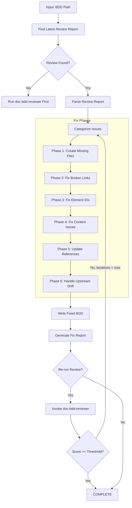
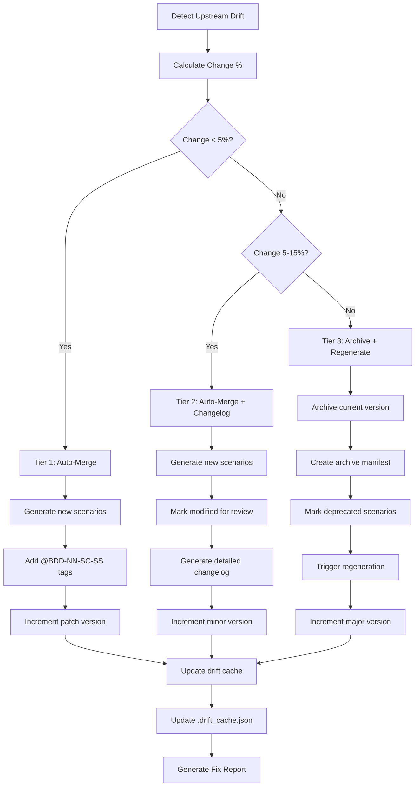
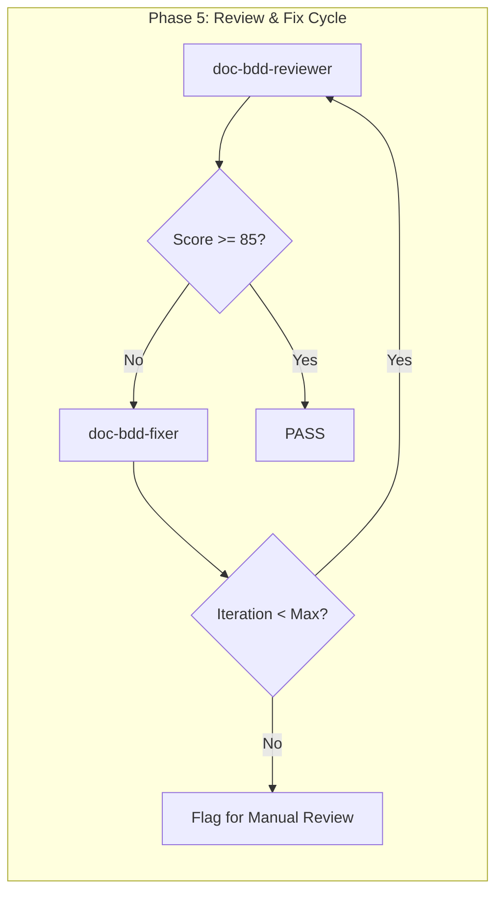

# doc-bdd-fixer

## Purpose

Automated **fix skill** that reads the latest review report and applies fixes to BDD (Behavior-Driven Development) documents. This skill bridges the gap between `doc-bdd-reviewer` (which identifies issues) and the corrected BDD, enabling iterative improvement cycles.

**Layer**: 4 (BDD Quality Improvement)

**Upstream**: BDD document, Review Report (`BDD-NN.R_review_report_vNNN.md`), EARS (source requirements)

**Downstream**: Fixed BDD, Fix Report (`BDD-NN.F_fix_report_vNNN.md`)

---

## When to Use This Skill

Use `doc-bdd-fixer` when:

- **After Review**: Run after `doc-bdd-reviewer` identifies issues
- **Iterative Improvement**: Part of Review -> Fix -> Review cycle
- **Automated Pipeline**: CI/CD integration for quality gates
- **Batch Fixes**: Apply fixes to multiple BDD based on review reports

**Do NOT use when**:
- No review report exists (run `doc-bdd-reviewer` first)
- Creating new BDD (use `doc-bdd` or `doc-bdd-autopilot`)
- Only need validation (use `doc-bdd-validator`)

---

## Skill Dependencies

| Skill | Purpose | When Used |
|-------|---------|-----------|
| `doc-bdd-reviewer` | Source of issues to fix | Input (reads review report) |
| `doc-naming` | Element ID standards | Fix element IDs |
| `doc-bdd` | BDD creation rules | Create missing sections |
| `doc-ears-reviewer` | Upstream EARS validation | Check upstream alignment |

---

## Workflow Overview



---

## Fix Phases

### Phase 1: Create Missing Files

Creates files that are referenced but don't exist.

**Scope**:

| Missing File | Action | Template Used |
|--------------|--------|---------------|
| `BDD-00_GLOSSARY.md` | Create BDD glossary | Glossary template |
| `BDD-NN_STEP_DEFS.md` | Create step definitions placeholder | Step Defs template |
| Feature files (`*.feature`) | Create placeholder with TODO sections | Feature template |
| Shared context files | Create placeholder | Context template |

**BDD Glossary Template**:

```markdown
---
title: "BDD-00: Behavior Glossary"
tags:
  - bdd
  - glossary
  - reference
custom_fields:
  document_type: glossary
  artifact_type: BDD-REFERENCE
  layer: 4
---

# BDD-00: Behavior Glossary

Common terminology used across all BDD Feature Documents.

## Gherkin Keywords

| Term | Definition | Context |
|------|------------|---------|
| Feature | High-level behavior description | Feature header |
| Scenario | Specific test case | Test definition |
| Scenario Outline | Parameterized scenario | Data-driven tests |
| Given | Precondition setup | Context |
| When | Action trigger | Event |
| Then | Expected outcome | Assertion |
| And | Additional step | Continuation |
| But | Negative continuation | Exception |
| Background | Shared preconditions | Reusable setup |
| Examples | Data table for outlines | Test data |

## Step Definition Terms

| Term | Definition | Context |
|------|------------|---------|
| Step Definition | Code binding for Gherkin step | Implementation |
| World | Shared context object | State management |
| Hook | Before/After lifecycle method | Setup/teardown |
| Tag | Scenario/Feature annotation | Filtering |

## Domain Terms

<!-- Add project-specific terminology below -->

| Term | Definition | Context |
|------|------------|---------|
| [Term] | [Definition] | [Where used] |
```

**Feature Placeholder Template**:

```gherkin
# language: en
# encoding: UTF-8

@placeholder @needs-completion
Feature: [Feature Name]
  As a [role]
  I want [capability]
  So that [benefit]

  # TODO: Created by doc-bdd-fixer as placeholder
  # Complete this feature file to resolve broken link issues

  Background:
    Given [TODO: Define shared preconditions]

  @todo
  Scenario: [TODO: Define scenario name]
    Given [TODO: Define precondition]
    When [TODO: Define action]
    Then [TODO: Define expected outcome]
```

**Step Definitions Placeholder Template**:

```markdown
---
title: "BDD Step Definitions: [Module Name]"
tags:
  - bdd
  - step-definitions
  - reference
custom_fields:
  document_type: step-definitions
  status: placeholder
  created_by: doc-bdd-fixer
---

# BDD Step Definitions: [Module Name]

> **Status**: Placeholder - Requires completion

## 1. Overview

[TODO: Document step definitions overview]

## 2. Given Steps

| Step Pattern | Implementation | Status |
|--------------|----------------|--------|
| `Given [pattern]` | [TODO] | Placeholder |

## 3. When Steps

| Step Pattern | Implementation | Status |
|--------------|----------------|--------|
| `When [pattern]` | [TODO] | Placeholder |

## 4. Then Steps

| Step Pattern | Implementation | Status |
|--------------|----------------|--------|
| `Then [pattern]` | [TODO] | Placeholder |

## 5. Shared Helpers

[TODO: Document shared helper functions]

---

*Created by doc-bdd-fixer as placeholder. Complete this document to resolve broken link issues.*
```

---

### Phase 2: Fix Broken Links

Updates links to point to correct locations.

**Fix Actions**:

| Issue Code | Issue | Fix Action |
|------------|-------|------------|
| REV-L001 | Broken internal link | Update path or create target file |
| REV-L002 | External link unreachable | Add warning comment, keep link |
| REV-L003 | Absolute path used | Convert to relative path |
| REV-L004 | Broken EARS reference | Update to correct EARS path |
| REV-L005 | Broken feature file reference | Update or create feature file |

**Path Resolution Logic**:

```python
def fix_link_path(bdd_location: str, target_path: str) -> str:
    """Calculate correct relative path based on BDD location."""

    # Monolithic BDD: docs/04_BDD/BDD-01.md
    # Sectioned BDD: docs/04_BDD/BDD-01_slug/BDD-01.3_section.md
    # Feature files: tests/bdd/features/*.feature

    if is_sectioned_bdd(bdd_location):
        # Need to go up one more level
        return "../" + calculate_relative_path(bdd_location, target_path)
    else:
        return calculate_relative_path(bdd_location, target_path)
```

**EARS Link Fix**:

| BDD Type | Original Link | Fixed Link |
|----------|---------------|------------|
| Monolithic | `../03_EARS/EARS-01.md` | `../03_EARS/EARS-01.md` |
| Sectioned | `../03_EARS/EARS-01.md` | `../../03_EARS/EARS-01.md` |

**Feature File Link Fix**:

| BDD Type | Original Link | Fixed Link |
|----------|---------------|------------|
| Monolithic | `../../tests/bdd/features/auth.feature` | `../../tests/bdd/features/auth.feature` |
| Sectioned | `../../tests/bdd/features/auth.feature` | `../../../tests/bdd/features/auth.feature` |

---

### Phase 3: Fix Element IDs

Converts invalid element IDs to correct format.

**Conversion Rules**:

| Pattern | Issue | Conversion |
|---------|-------|------------|
| `BDD.NN.01.SS` | Code 01 invalid for BDD | `BDD.NN.35.SS` (Feature Spec) |
| `BDD.NN.25.SS` | Code 25 invalid for BDD | `BDD.NN.36.SS` (Scenario Spec) |
| `BDD.NN.22.SS` | Code 22 invalid for BDD | `BDD.NN.37.SS` (Step Definition) |
| `FEAT-XXX` | Legacy pattern | `BDD.NN.35.SS` |
| `SCEN-XXX` | Legacy pattern | `BDD.NN.36.SS` |
| `STEP-XXX` | Legacy pattern | `BDD.NN.37.SS` |

**Type Code Mapping** (BDD-specific valid codes: 35, 36, 37):

| Invalid Code | Valid Code | Element Type |
|--------------|------------|--------------|
| 01 | 35 | Feature Specification |
| 02 | 36 | Scenario Specification |
| 03 | 37 | Step Definition |
| 05 | 36 | Scenario Specification |
| 06 | 37 | Step Definition |
| 22 | 35 | Feature Specification |
| 25 | 36 | Scenario Specification |
| 26 | 37 | Step Definition |

**Regex Patterns**:

```python
# Find element IDs with invalid type codes for BDD
invalid_bdd_type_01 = r'BDD\.(\d{2})\.01\.(\d{2})'
replacement_01 = r'BDD.\1.35.\2'

invalid_bdd_type_25 = r'BDD\.(\d{2})\.25\.(\d{2})'
replacement_25 = r'BDD.\1.36.\2'

invalid_bdd_type_22 = r'BDD\.(\d{2})\.22\.(\d{2})'
replacement_22 = r'BDD.\1.37.\2'

# Find legacy patterns
legacy_feat = r'###\s+FEAT-(\d+):'
legacy_scen = r'###\s+SCEN-(\d+):'
legacy_step = r'###\s+STEP-(\d+):'
```

---

### Phase 4: Fix Content Issues

Addresses placeholders, incomplete content, and BDD-specific syntax issues.

**Fix Actions**:

| Issue Code | Issue | Fix Action |
|------------|-------|------------|
| REV-P001 | `[TODO]` placeholder | Flag for manual completion (cannot auto-fix) |
| REV-P002 | `[TBD]` placeholder | Flag for manual completion (cannot auto-fix) |
| REV-P003 | Template date `YYYY-MM-DD` | Replace with current date |
| REV-P004 | Template name `[Name]` | Replace with metadata author or flag |
| REV-P005 | Empty section | Add minimum template content |
| REV-B001 | Missing Gherkin keyword | Flag for manual review |
| REV-B002 | Invalid scenario structure | Flag for manual review |
| REV-B003 | Missing Given/When/Then | Flag for manual review |
| REV-B004 | Orphan step definition | Flag for manual review |

**Auto-Replacements**:

```python
replacements = {
    'YYYY-MM-DDTHH:MM:SS': datetime.now().strftime('%Y-%m-%dT%H:%M:%S'),
    'YYYY-MM-DD': datetime.now().strftime('%Y-%m-%d'),
    'MM/DD/YYYY': datetime.now().strftime('%m/%d/%Y'),
    '[Current date]': datetime.now().strftime('%Y-%m-%dT%H:%M:%S'),
    '[Feature Name]': extract_feature_name_from_metadata(),
}
```

**Gherkin Structure Validation**:

| Pattern Type | Required Structure | Auto-Fix |
|--------------|-------------------|----------|
| Feature | Feature: [name] + user story format | No (flag) |
| Scenario | Scenario: [name] + Given/When/Then | No (flag) |
| Scenario Outline | Scenario Outline + Examples table | No (flag) |
| Background | Background: + Given steps only | No (flag) |
| Step | Given/When/Then/And/But + description | No (flag) |

---

### Phase 5: Update References

Ensures traceability and cross-references are correct.

**Fix Actions**:

| Issue | Fix Action |
|-------|------------|
| Missing `@ref:` for created files | Add reference tag |
| Incorrect cross-BDD path | Update to correct relative path |
| Missing EARS traceability | Add EARS reference with `@trace: EARS-NN` |
| Missing traceability entry | Add to traceability matrix |
| Missing feature tag | Add appropriate tag |

**Traceability Format**:

```markdown
<!-- Traceability to EARS -->
@trace: EARS-01.25.01 -> BDD-01.35.01

<!-- Reference to upstream -->
@ref: [EARS-01 Section 3](../03_EARS/EARS-01.md#3-functional-requirements)
```

**Tag Traceability in Feature Files**:

```gherkin
@trace:EARS-01.25.01 @feature:BDD-01.35.01
Feature: User Authentication
```

---

### Phase 6: Handle Upstream Drift (Auto-Merge)

Addresses issues where upstream EARS documents have changed since BDD creation. Uses a tiered auto-merge system based on change percentage to automatically incorporate new requirements.

**Upstream**: EARS (Layer 3)
**Downstream**: ADR (Layer 5)

---

#### 6.1 Change Percentage Calculation

Calculate drift percentage by comparing EARS content hashes:

```python
def calculate_change_percentage(
    original_ears_hash: str,
    current_ears_hash: str,
    original_content: str,
    current_content: str
) -> float:
    """Calculate percentage of content changed in upstream EARS."""

    if original_ears_hash == current_ears_hash:
        return 0.0

    # Line-based diff calculation
    original_lines = set(original_content.strip().split('\n'))
    current_lines = set(current_content.strip().split('\n'))

    added_lines = current_lines - original_lines
    removed_lines = original_lines - current_lines

    total_original = len(original_lines)
    if total_original == 0:
        return 100.0 if current_lines else 0.0

    change_percentage = (len(added_lines) + len(removed_lines)) / total_original * 100
    return round(change_percentage, 2)
```

---

#### 6.2 Tiered Auto-Merge Thresholds

| Tier | Change % | Action | Version Increment | User Approval |
|------|----------|--------|-------------------|---------------|
| **Tier 1** | < 5% | Auto-merge new scenarios | Patch (1.0.0 -> 1.0.1) | No |
| **Tier 2** | 5-15% | Auto-merge with detailed changelog | Minor (1.0.1 -> 1.1.0) | No |
| **Tier 3** | > 15% | Archive current, trigger regeneration | Major (1.1.0 -> 2.0.0) | Yes (recommended) |

---

#### 6.3 Tier 1: Minor Drift (< 5%)

**Trigger**: Small additions or clarifications in upstream EARS.

**Actions**:

1. Parse new EARS requirements not covered by existing BDD scenarios
2. Generate new scenarios with auto-generated tags
3. Append to appropriate feature file
4. Increment patch version

**Auto-Generated Scenario Tag Format**:

```
@BDD-{NN}-SC-{SS}
```

Where:
- `NN` = BDD document number (01-99)
- `SC` = Scenario identifier
- `SS` = Sequential scenario number (01-99)

**Example**:

```gherkin
# Auto-merged from EARS-01 drift (2026-02-10)
@BDD-01-SC-13 @auto-merged @trace:EARS-01.25.12
Scenario: User receives notification on password expiry
  Given a user with password expiring in 7 days
  When the daily notification job runs
  Then the user receives an expiry warning email
```

**Tier 1 Changelog Entry**:

```markdown
### v1.0.1 (2026-02-10) - Patch

**Drift Merge**: Tier 1 (3.2% change detected in EARS-01)

| Added Scenarios | Tag | Source |
|-----------------|-----|--------|
| User receives notification on password expiry | @BDD-01-SC-13 | EARS-01.25.12 |
```

---

#### 6.4 Tier 2: Moderate Drift (5-15%)

**Trigger**: Significant additions or modifications in upstream EARS.

**Actions**:

1. Parse all new/modified EARS requirements
2. Generate new scenarios for additions
3. Mark existing scenarios for review if source requirement modified
4. Generate detailed changelog
5. Increment minor version

**Detailed Changelog Format**:

```markdown
### v1.1.0 (2026-02-10) - Minor

**Drift Merge**: Tier 2 (8.7% change detected in EARS-01, EARS-02)

#### New Scenarios Added

| Scenario | Tag | Feature File | Source |
|----------|-----|--------------|--------|
| User receives notification on password expiry | @BDD-01-SC-13 | auth.feature | EARS-01.25.12 |
| Admin can force password reset | @BDD-01-SC-14 | auth.feature | EARS-01.25.13 |
| Session timeout configurable per role | @BDD-01-SC-15 | session.feature | EARS-02.25.05 |

#### Scenarios Marked for Review

| Scenario | Tag | Reason | Source Change |
|----------|-----|--------|---------------|
| User authenticates with valid credentials | @BDD-01-SC-01 | Source requirement modified | EARS-01.25.01 v2 |

#### Upstream Changes Summary

| Document | Sections Changed | Lines Added | Lines Removed |
|----------|------------------|-------------|---------------|
| EARS-01.md | 3.1, 3.5, 4.2 | 24 | 6 |
| EARS-02.md | 5.1 | 8 | 0 |
```

**Review Marker for Modified Source**:

```gherkin
# REVIEW: Source requirement EARS-01.25.01 modified on 2026-02-10
# Original: "User must authenticate with username and password"
# Updated: "User must authenticate with username and password or SSO"
@BDD-01-SC-01 @needs-review @trace:EARS-01.25.01
Scenario: User authenticates with valid credentials
  # ... existing steps ...
```

---

#### 6.5 Tier 3: Major Drift (> 15%)

**Trigger**: Substantial changes indicating major requirement evolution.

**Actions**:

1. Archive current BDD version
2. Create archive manifest
3. Trigger regeneration workflow
4. Increment major version

**No Deletion Policy**:

Existing scenarios are NEVER deleted. Instead:

```gherkin
# DEPRECATED: Superseded by EARS-01 v3 changes (2026-02-10)
# Reason: Authentication flow redesigned to support SSO-only mode
# Archive: BDD-01_v1.1.0_archive/auth.feature
@BDD-01-SC-01 @deprecated @archive:v1.1.0
Scenario: User authenticates with username and password
  # ... existing steps preserved ...
```

**Archive Manifest Creation**:

Location: `docs/04_BDD/BDD-{NN}_v{X.Y.Z}_archive/MANIFEST.md`

```markdown
---
title: "BDD-01 Archive Manifest v1.1.0"
tags:
  - bdd
  - archive
  - manifest
custom_fields:
  archive_date: "2026-02-10T16:00:00"
  archive_reason: "Tier 3 drift (22.4% change in EARS-01)"
  original_version: "1.1.0"
  new_version: "2.0.0"
  triggering_upstream: "EARS-01 v3"
---

# BDD-01 Archive Manifest v1.1.0

## Archive Summary

| Field | Value |
|-------|-------|
| Archived Version | 1.1.0 |
| Archive Date | 2026-02-10T16:00:00 |
| Reason | Tier 3 upstream drift (22.4% change) |
| Triggering Upstream | EARS-01 v3 |
| New Version | 2.0.0 (regeneration triggered) |

## Archived Files

| File | Scenarios | Status |
|------|-----------|--------|
| BDD-01.md | - | Archived |
| auth.feature | 5 | 3 deprecated, 2 preserved |
| session.feature | 3 | 1 deprecated, 2 preserved |
| api.feature | 8 | 4 deprecated, 4 preserved |

## Deprecated Scenarios

| Tag | Scenario | Deprecation Reason |
|-----|----------|-------------------|
| @BDD-01-SC-01 | User authenticates with username and password | SSO-only authentication in v3 |
| @BDD-01-SC-02 | User fails authentication with wrong password | Replaced by SSO error handling |
| @BDD-01-SC-05 | Password complexity validation | Removed - SSO handles auth |

## Preserved Scenarios

| Tag | Scenario | Preserved In |
|-----|----------|--------------|
| @BDD-01-SC-03 | User session expires after timeout | BDD-01 v2.0.0 |
| @BDD-01-SC-04 | User can logout from all devices | BDD-01 v2.0.0 |

## Regeneration Trigger

Command to regenerate BDD from updated EARS:

```bash
/doc-bdd-autopilot EARS-01 --version 2.0.0 --preserve-from BDD-01_v1.1.0_archive
```
```

---

#### 6.6 Enhanced Drift Cache

After processing drift issues, update `.drift_cache.json`:

```json
{
  "bdd_id": "BDD-01",
  "bdd_version": "1.1.0",
  "bdd_updated": "2026-02-10T16:00:00",
  "drift_reviewed": "2026-02-10T16:00:00",
  "upstream_type": "EARS",
  "downstream_type": "ADR",
  "upstream_hashes": {
    "EARS-01.md": {
      "hash": "a1b2c3d4e5f6...",
      "version": "2.0",
      "last_checked": "2026-02-10T16:00:00"
    },
    "EARS-02.md": {
      "hash": "e5f6g7h8i9j0...",
      "version": "1.5",
      "last_checked": "2026-02-10T16:00:00"
    }
  },
  "merge_history": [
    {
      "date": "2026-02-08T10:00:00",
      "tier": 1,
      "change_percentage": 3.2,
      "version_before": "1.0.0",
      "version_after": "1.0.1",
      "scenarios_added": ["@BDD-01-SC-10"],
      "scenarios_deprecated": [],
      "upstream_trigger": "EARS-01 v1.8"
    },
    {
      "date": "2026-02-10T16:00:00",
      "tier": 2,
      "change_percentage": 8.7,
      "version_before": "1.0.1",
      "version_after": "1.1.0",
      "scenarios_added": ["@BDD-01-SC-13", "@BDD-01-SC-14", "@BDD-01-SC-15"],
      "scenarios_deprecated": [],
      "upstream_trigger": "EARS-01 v2.0, EARS-02 v1.5"
    }
  ],
  "acknowledged_drift": [
    {
      "document": "EARS-03.md",
      "acknowledged_date": "2026-02-09",
      "reason": "Documentation-only change - no BDD impact"
    }
  ],
  "next_scenario_number": 16
}
```

---

#### 6.7 Auto-Merge Workflow



---

#### 6.8 Drift Issue Codes

| Code | Severity | Description | Tier | Auto-Fix |
|------|----------|-------------|------|----------|
| REV-D001 | Info | EARS modified after BDD (< 5%) | 1 | Yes (auto-merge) |
| REV-D002 | Warning | EARS modified after BDD (5-15%) | 2 | Yes (auto-merge + changelog) |
| REV-D003 | Info | EARS version incremented | 1-2 | Yes (update version ref) |
| REV-D004 | Info | New requirements added to EARS | 1-2 | Yes (generate scenarios) |
| REV-D005 | Warning | Critical EARS modification (> 15%) | 3 | Partial (archive + trigger regen) |
| REV-D006 | Info | Scenario added via auto-merge | - | N/A (informational) |
| REV-D007 | Warning | Scenario marked @deprecated | 3 | Yes (add deprecation marker) |

---

#### 6.9 Drift Acknowledgment Workflow

When drift is flagged but no BDD update is needed:

1. Run `/doc-bdd-fixer BDD-01 --acknowledge-drift`
2. Fixer prompts: "Review drift for EARS-01.md?"
3. User confirms no BDD changes needed
4. Fixer adds to `acknowledged_drift` array
5. Future reviews skip this drift until upstream changes again

---

## Command Usage

### Basic Usage

```bash
# Fix BDD based on latest review
/doc-bdd-fixer BDD-01

# Fix with explicit review report
/doc-bdd-fixer BDD-01 --review-report BDD-01.R_review_report_v001.md

# Fix and re-run review
/doc-bdd-fixer BDD-01 --revalidate

# Fix with iteration limit
/doc-bdd-fixer BDD-01 --revalidate --max-iterations 3
```

### Options

| Option | Default | Description |
|--------|---------|-------------|
| `--review-report` | latest | Specific review report to use |
| `--revalidate` | false | Run reviewer after fixes |
| `--max-iterations` | 3 | Max fix-review cycles |
| `--fix-types` | all | Specific fix types (comma-separated) |
| `--create-missing` | true | Create missing reference files |
| `--backup` | true | Backup BDD before fixing |
| `--dry-run` | false | Preview fixes without applying |
| `--acknowledge-drift` | false | Interactive drift acknowledgment mode |
| `--update-drift-cache` | true | Update .drift_cache.json after fixes |
| `--fix-features` | true | Also fix linked .feature files |

### Fix Types

| Type | Description |
|------|-------------|
| `missing_files` | Create missing glossary, step defs, feature files |
| `broken_links` | Fix link paths |
| `element_ids` | Convert invalid/legacy element IDs |
| `content` | Fix placeholders, dates, names |
| `references` | Update traceability and cross-references |
| `drift` | Handle upstream drift detection issues |
| `gherkin` | Fix Gherkin syntax issues (limited) |
| `all` | All fix types (default) |

---

## Output Artifacts

### Fix Report

**File Naming**: `BDD-NN.F_fix_report_vNNN.md`

**Location**: Same folder as the BDD document.

**Structure**:

```markdown
---
title: "BDD-NN.F: Fix Report v001"
tags:
  - bdd
  - fix-report
  - quality-assurance
custom_fields:
  document_type: fix-report
  artifact_type: BDD-FIX
  layer: 4
  parent_doc: BDD-NN
  source_review: BDD-NN.R_review_report_v001.md
  fix_date: "YYYY-MM-DDTHH:MM:SS"
  fix_tool: doc-bdd-fixer
  fix_version: "1.0"
---

# BDD-NN Fix Report v001

## Summary

| Metric | Value |
|--------|-------|
| Source Review | BDD-NN.R_review_report_v001.md |
| Issues in Review | 12 |
| Issues Fixed | 10 |
| Issues Remaining | 2 (manual review required) |
| Files Created | 3 |
| Files Modified | 5 |
| Feature Files Fixed | 2 |

## Files Created

| File | Type | Location |
|------|------|----------|
| BDD-00_GLOSSARY.md | Behavior Glossary | docs/04_BDD/ |
| BDD-01_STEP_DEFS.md | Step Definitions Placeholder | docs/04_BDD/ |
| auth_placeholder.feature | Feature Placeholder | tests/bdd/features/ |

## Fixes Applied

| # | Issue Code | Issue | Fix Applied | File |
|---|------------|-------|-------------|------|
| 1 | REV-L001 | Broken glossary link | Created BDD-00_GLOSSARY.md | BDD-01.3_scenarios.md |
| 2 | REV-L004 | Broken EARS reference | Updated path to ../03_EARS/EARS-01.md | BDD-01.1_core.md |
| 3 | REV-N004 | Element type 01 invalid | Converted to type 35 | BDD-01.1_core.md |
| 4 | REV-L005 | Broken feature file link | Created auth_placeholder.feature | BDD-01.2_features.md |

## Feature File Fixes

| File | Fixes Applied |
|------|---------------|
| auth.feature | Added @trace tag, fixed step reference |
| api.feature | Updated Examples table format |

## Issues Requiring Manual Review

| # | Issue Code | Issue | Location | Reason |
|---|------------|-------|----------|--------|
| 1 | REV-B001 | Missing Gherkin keyword | BDD-01.2:L45 | Scenario syntax needed |
| 2 | REV-B003 | Missing Given/When/Then | auth.feature:L32 | Step structure required |

## Validation After Fix

| Metric | Before | After | Delta |
|--------|--------|-------|-------|
| Review Score | 92 | 97 | +5 |
| Errors | 2 | 0 | -2 |
| Warnings | 4 | 1 | -3 |

## Next Steps

1. Complete BDD-01_STEP_DEFS.md placeholder
2. Complete auth_placeholder.feature with proper scenarios
3. Address missing Gherkin keywords in flagged scenarios
4. Run `/doc-bdd-reviewer BDD-01` to verify fixes
```

---

## Integration with Autopilot

This skill is invoked by `doc-bdd-autopilot` in the Review -> Fix cycle:



**Autopilot Integration Points**:

| Phase | Action | Skill |
|-------|--------|-------|
| Phase 5a | Run initial review | `doc-bdd-reviewer` |
| Phase 5b | Apply fixes if issues found | `doc-bdd-fixer` |
| Phase 5c | Re-run review | `doc-bdd-reviewer` |
| Phase 5d | Repeat until pass or max iterations | Loop |

---

## Error Handling

### Recovery Actions

| Error | Action |
|-------|--------|
| Review report not found | Prompt to run `doc-bdd-reviewer` first |
| Cannot create file (permissions) | Log error, continue with other fixes |
| Cannot parse review report | Abort with clear error message |
| Max iterations exceeded | Generate report, flag for manual review |
| EARS not found | Log warning, skip EARS-dependent fixes |
| Feature file parse error | Log error, skip Gherkin fixes for that file |

### Backup Strategy

Before applying any fixes:

1. Create backup in `tmp/backup/BDD-NN_YYYYMMDD_HHMMSS/`
2. Copy all BDD files and linked feature files to backup location
3. Apply fixes to original files
4. If error during fix, restore from backup

---

## Related Skills

| Skill | Relationship |
|-------|--------------|
| `doc-bdd-reviewer` | Provides review report (input) |
| `doc-bdd-autopilot` | Orchestrates Review -> Fix cycle |
| `doc-bdd-validator` | Structural validation |
| `doc-naming` | Element ID standards |
| `doc-bdd` | BDD creation rules |
| `doc-ears-reviewer` | Upstream EARS validation |

---

## Version History

| Version | Date | Changes |
|---------|------|---------|
| 2.0 | 2026-02-10 | Enhanced Phase 6 with tiered auto-merge system; Added Tier 1 (< 5%) auto-merge with patch version; Added Tier 2 (5-15%) auto-merge with detailed changelog and minor version; Added Tier 3 (> 15%) archive and regeneration with major version; Implemented no-deletion policy with @deprecated markers; Added archive manifest creation; Enhanced drift cache with merge history; Added scenario tag pattern @BDD-NN-SC-SS; Defined EARS as upstream, ADR as downstream |
| 1.0 | 2026-02-10 | Initial skill creation; 6-phase fix workflow; Glossary, step definitions, and feature file creation; Element ID conversion for BDD codes (35, 36, 37); Broken link fixes including feature files; EARS drift detection; Gherkin syntax validation; Integration with autopilot Review->Fix cycle |
