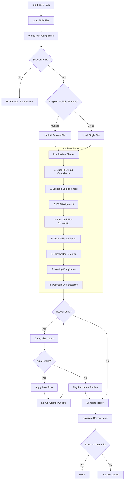
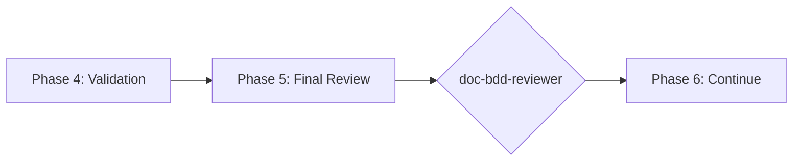

# doc-bdd-reviewer

## Purpose

Comprehensive **content review and quality assurance** for Behavior-Driven Development (BDD) documents. This skill performs deep content analysis beyond structural validation, checking Gherkin syntax correctness, scenario completeness, EARS alignment, step definition reusability, and identifying issues that require manual review.

**Layer**: 4 (BDD Quality Assurance)

**Upstream**: BDD (from `doc-bdd-autopilot` or `doc-bdd`)

**Downstream**: None (final QA gate before ADR generation)

---

## When to Use This Skill

Use `doc-bdd-reviewer` when:

- **After BDD Generation**: Run immediately after `doc-bdd-autopilot` completes
- **Manual BDD Edits**: After making manual changes to BDD scenarios
- **Pre-ADR Check**: Before running `doc-adr-autopilot`
- **Periodic Review**: Regular quality checks on existing BDD
- **CI/CD Integration**: Automated review gate in documentation pipelines

**Do NOT use when**:
- BDD does not exist yet (use `doc-bdd` or `doc-bdd-autopilot` first)
- Need structural/schema validation only (use `doc-bdd-validator`)
- Generating new BDD content (use `doc-bdd`)

---

## Skill vs Validator: Key Differences

| Aspect | `doc-bdd-validator` | `doc-bdd-reviewer` |
|--------|---------------------|-------------------|
| **Focus** | Schema compliance, ADR-Ready score | Content quality, step reusability |
| **Checks** | Required sections, Gherkin syntax | Scenario coverage, EARS traceability |
| **Auto-Fix** | Structural issues only | Content issues (syntax, formatting) |
| **Output** | ADR-Ready score (numeric) | Review score + issue list |
| **Phase** | Phase 4 (Validation) | Phase 5 (Final Review) |
| **Blocking** | ADR-Ready < threshold blocks | Review score < threshold flags |

---

## Review Workflow



---

## Review Checks

### 0. Structure Compliance (12/12) - BLOCKING

Validates BDD follows the mandatory nested folder rule.

**Nested Folder Rule**: ALL BDD documents MUST be in nested folders.

**Required Structure**:

| BDD Type | Required Location |
|----------|-------------------|
| Markdown | `docs/04_BDD/BDD-NN_{slug}/BDD-NN_{slug}.md` |
| Feature | `docs/04_BDD/BDD-NN_{slug}/BDD-NN_{slug}.feature` |

**Error Codes**:

| Code | Severity | Description |
|------|----------|-------------|
| REV-STR001 | Error | BDD not in nested folder (BLOCKING) |
| REV-STR002 | Error | Folder name doesn't match BDD ID |
| REV-STR003 | Warning | File name doesn't match folder name |

**This check is BLOCKING** - BDD must pass structure validation before other checks proceed.

---

### 1. Gherkin Syntax Compliance

Validates all scenarios follow correct Gherkin syntax.

**Scope**:
- Feature files have proper structure
- Given-When-Then order correct
- Background used appropriately
- Scenario Outline with Examples
- Tags properly formatted

**Error Codes**:

| Code | Severity | Description |
|------|----------|-------------|
| REV-GS001 | Error | Missing Feature keyword |
| REV-GS002 | Error | Given-When-Then order incorrect |
| REV-GS003 | Warning | Background could simplify scenarios |
| REV-GS004 | Warning | Scenario Outline missing Examples |
| REV-GS005 | Info | Tag format non-standard |

---

### 2. Scenario Completeness

Validates scenarios cover all requirement aspects.

**Scope**:
- Happy path covered
- Error conditions tested
- Edge cases identified
- Boundary values checked
- Negative scenarios present

**Error Codes**:

| Code | Severity | Description |
|------|----------|-------------|
| REV-SC001 | Error | No happy path scenario |
| REV-SC002 | Warning | Error condition not tested |
| REV-SC003 | Warning | Edge case not covered |
| REV-SC004 | Info | Boundary value not tested |
| REV-SC005 | Info | Negative scenario missing |

---

### 3. EARS Alignment

Validates BDD scenarios trace to EARS requirements.

**Scope**:
- Every scenario maps to EARS requirement
- No orphaned scenarios
- Coverage complete for all EARS
- Feature IDs consistent

**Error Codes**:

| Code | Severity | Description |
|------|----------|-------------|
| REV-EA001 | Error | Scenario without EARS source |
| REV-EA002 | Warning | EARS requirement without scenario |
| REV-EA003 | Warning | Feature ID mismatch |
| REV-EA004 | Info | Multiple scenarios for single EARS (acceptable) |

---

### 4. Step Definition Reusability

Analyzes step definitions for reuse potential.

**Scope**:
- Similar steps identified
- Parameterized steps suggested
- Duplicate steps flagged
- Step library consistency

**Error Codes**:

| Code | Severity | Description |
|------|----------|-------------|
| REV-SD001 | Warning | Duplicate step definition |
| REV-SD002 | Info | Step could be parameterized |
| REV-SD003 | Info | Similar steps could be combined |
| REV-SD004 | Warning | Step not reusable (too specific) |

---

### 5. Data Table Validation

Validates Examples and data tables are complete.

**Scope**:
- Examples table has headers
- Data rows present
- Column values appropriate
- Boundary values included

**Error Codes**:

| Code | Severity | Description |
|------|----------|-------------|
| REV-DT001 | Error | Examples table empty |
| REV-DT002 | Warning | Missing column header |
| REV-DT003 | Info | Consider boundary value |
| REV-DT004 | Warning | Inconsistent data format |

---

### 6. Placeholder Detection

Identifies incomplete content requiring replacement.

**Error Codes**:

| Code | Severity | Description |
|------|----------|-------------|
| REV-P001 | Error | [TODO] placeholder found |
| REV-P002 | Error | [TBD] placeholder found |
| REV-P003 | Warning | Template value not replaced |

---

### 7. Naming Compliance

Validates element IDs follow `doc-naming` standards.

**Scope**:
- Element IDs use `BDD.NN.TT.SS` format
- Element type codes valid for BDD (35, 36, 37)
- No legacy patterns (SC-NNN, TC-NNN)

**Error Codes**:

| Code | Severity | Description |
|------|----------|-------------|
| REV-N001 | Error | Invalid element ID format |
| REV-N002 | Error | Element type code not valid for BDD |
| REV-N003 | Error | Legacy pattern detected |

---

### 8. Upstream Drift Detection (Mandatory Cache)

Detects when upstream source documents have been modified after the BDD was created or last updated.

**Purpose**: Identifies stale BDD content that may not reflect current EARS documentation.

**The drift cache is mandatory** - the reviewer MUST create/update it after every review.

**Scope**:
- `@ref:` tag targets
- `@ears:` tag references
- Traceability section upstream artifact links

#### Drift Cache File (MANDATORY)

**Location**: `docs/04_BDD/.drift_cache.json`

**Cache Schema**:

```json
{
  "cache_version": "1.0",
  "last_updated": "2026-02-10T17:00:00Z",
  "upstream_type": "EARS",
  "documents": {
    "BDD-01_f1_iam.feature": {
      "bdd_hash": "sha256:abc123...",
      "bdd_mtime": "2026-02-10T15:00:00Z",
      "upstream_refs": {
        "docs/03_EARS/EARS-01_f1_iam.md": {
          "content_hash": "sha256:def456...",
          "version": "1.2",
          "mtime": "2026-02-09T12:00:00Z",
          "sections_referenced": ["REQ-F1-001", "REQ-F1-002"]
        }
      },
      "last_review": "2026-02-10T16:30:00Z",
      "drift_status": "fresh"
    }
  }
}
```

#### Three-Phase Detection Algorithm

**Phase 1: Load Cache**
1. Check if `.drift_cache.json` exists
2. If exists, load and validate schema
3. If not exists, initialize empty cache structure

**Phase 2: Detect Drift**
1. For each BDD document being reviewed:
   - Extract all `@ears:` and `@ref:` references
   - For each upstream reference:
     - Calculate current content hash
     - Compare with cached hash
     - Check `mtime` and `version` fields
   - Flag drift if any mismatch detected

**Phase 3: Update Cache (MANDATORY)**
1. Update document entry with current hashes
2. Update `last_review` timestamp
3. Set `drift_status` based on detection results
4. Write cache file atomically
5. Log cache update in review report

#### Hash Calculation

```python
import hashlib

def calculate_content_hash(file_path: str) -> str:
    """Calculate SHA-256 hash of file content."""
    with open(file_path, 'rb') as f:
        content = f.read()
    return f"sha256:{hashlib.sha256(content).hexdigest()}"
```

**Detection Methods**:

| Method | Description | Precision |
|--------|-------------|-----------|
| **Timestamp Comparison** | Compares source doc `mtime` vs BDD creation/update date | Medium |
| **Content Hash** | SHA-256 hash of referenced sections | High |
| **Version Tracking** | Checks `version` field in YAML frontmatter | High |

**Error Codes**:

| Code | Severity | Description |
|------|----------|-------------|
| REV-D001 | Warning | Upstream document modified after BDD creation |
| REV-D002 | Warning | Referenced section content changed |
| REV-D003 | Info | Upstream document version incremented |
| REV-D004 | Info | New content added to upstream |
| REV-D005 | Error | Critical upstream modification (>20% change) |
| REV-D006 | Info | Cache created (first review of this document) |

**Report Output**:

```markdown
### Drift Detection Results

**Cache Status**: Updated (docs/04_BDD/.drift_cache.json)
**Documents Checked**: 5
**Fresh**: 4
**Drifted**: 1 (BDD-03_f3_observability.feature)

| Document | Upstream | Status | Hash Match | Details |
|----------|----------|--------|------------|---------|
| BDD-01 | EARS-01 | Fresh | Yes | - |
| BDD-03 | EARS-03 | Drifted | No | Section 4.2 modified |
```

**Configuration**:

| Setting | Default | Description |
|---------|---------|-------------|
| `cache_enabled` | true | Mandatory - cannot be disabled |
| `drift_threshold_days` | 7 | Days before drift becomes Warning |
| `critical_threshold_days` | 30 | Days before drift becomes Error |
| `enable_hash_check` | true | SHA-256 content hashing (mandatory with cache) |

---

## Review Score Calculation

**Scoring Formula**:

| Category | Weight | Calculation |
|----------|--------|-------------|
| Gherkin Syntax Compliance | 19% | (valid_syntax / total) × 19 |
| Scenario Completeness | 23% | (complete / total_scenarios) × 23 |
| EARS Alignment | 19% | (aligned / total_scenarios) × 19 |
| Step Definition Reusability | 10% | (reusable / total_steps) × 10 |
| Data Table Validation | 9% | (valid_tables / total_tables) × 9 |
| Placeholder Detection | 5% | (no_placeholders ? 5 : 5 - count) |
| Naming Compliance | 10% | (valid_ids / total_ids) × 10 |
| Upstream Drift | 5% | (fresh_refs / total_refs) × 5 |

**Total**: Sum of all categories (max 100)

**Thresholds**:
- **PASS**: ≥ 90
- **WARNING**: 80-89
- **FAIL**: < 80

---

## Command Usage

```bash
# Review specific BDD
/doc-bdd-reviewer BDD-01

# Review BDD by path
/doc-bdd-reviewer docs/04_BDD/BDD-01_f1_iam.feature

# Review all BDD
/doc-bdd-reviewer all
```

---

## Output Report

Review reports are stored alongside the reviewed document per project standards.

**Nested Folder Rule**: ALL BDD suites use nested folders (`BDD-NN_{slug}/`). This ensures review reports, fix reports, and drift cache files are organized with their parent document.

**File Naming**: `BDD-NN.R_review_report_vNNN.md`

**Location**: Inside the BDD nested folder: `docs/04_BDD/BDD-NN_{slug}/`

### Versioning Rules

1. **First Review**: Creates `BDD-NN.R_review_report_v001.md`
2. **Subsequent Reviews**: Auto-increments version (v002, v003, etc.)
3. **Same-Day Reviews**: Each review gets unique version number

**Version Detection**: Scans folder for existing `BDD-NN.R_review_report_v*.md` files and increments.

**Example**:

```
docs/04_BDD/BDD-01_f1_iam/
├── BDD-01.0_index.md
├── BDD-01.1_authentication.feature
├── BDD-01.2_authorization.feature
├── BDD-01.R_review_report_v001.md    # First review
├── BDD-01.R_review_report_v002.md    # After fixes
└── .drift_cache.json
```

### Delta Reporting

When previous reviews exist, include score comparison in the report.

See `REVIEW_DOCUMENT_STANDARDS.md` for complete versioning requirements.

---

## Integration with doc-bdd-autopilot

This skill is invoked during Phase 5 of `doc-bdd-autopilot`:



---

## Related Skills

| Skill | Relationship |
|-------|--------------|
| `doc-naming` | Naming standards for Check #7 |
| `doc-bdd-autopilot` | Invokes this skill in Phase 5 |
| `doc-bdd-validator` | Structural validation (Phase 4) |
| `doc-bdd-fixer` | Applies fixes based on review findings |
| `doc-bdd` | BDD creation rules |
| `doc-ears-reviewer` | Upstream QA |
| `doc-adr-autopilot` | Downstream consumer |

---

## Version History

| Version | Date | Changes |
|---------|------|---------|
| 1.4 | 2026-02-11 | Added Check #0: Structure Compliance as BLOCKING check - validates BDD follows mandatory nested folder rule; REV-STR001-STR003 error codes; Updated workflow diagram with structure validation gate |
| 1.3 | 2026-02-10 | Mandatory drift cache implementation - cache at `docs/04_BDD/.drift_cache.json`; Three-phase detection algorithm (Load Cache, Detect Drift, Update Cache); SHA-256 hash calculation; REV-D006 error code (Cache created); Report output with cache status; `cache_enabled: true` mandatory |
| 1.2 | 2026-02-10 | Added Check #8: Upstream Drift Detection - detects when EARS documents modified after BDD creation; REV-D001-D005 error codes; drift configuration; Added doc-bdd-fixer to related skills |
| 1.1 | 2026-02-10 | Added review versioning support (_vNNN pattern); Delta reporting for score comparison |
| 1.0 | 2026-02-10 | Initial skill creation with 7 review checks; Gherkin syntax compliance; Scenario completeness; Step definition reusability |
