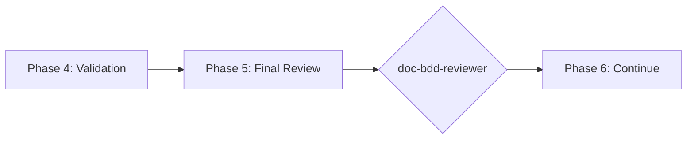

# doc-bdd-reviewer

## Purpose

Comprehensive **content review and quality assurance** for Behavior-Driven Development (BDD) documents. This skill performs deep content analysis beyond structural validation, checking Gherkin syntax correctness, scenario completeness, EARS alignment, step definition reusability, and identifying issues that require manual review.

**Layer**: 4 (BDD Quality Assurance)

**Upstream**: BDD (from `doc-bdd-autopilot` or `doc-bdd`)

**Downstream**: None (final QA gate before ADR generation)

---

## When to Use This Skill

Use `doc-bdd-reviewer` when:

- **After BDD Generation**: Run immediately after `doc-bdd-autopilot` completes
- **Manual BDD Edits**: After making manual changes to BDD scenarios
- **Pre-ADR Check**: Before running `doc-adr-autopilot`
- **Periodic Review**: Regular quality checks on existing BDD
- **CI/CD Integration**: Automated review gate in documentation pipelines

**Do NOT use when**:
- BDD does not exist yet (use `doc-bdd` or `doc-bdd-autopilot` first)
- Need structural/schema validation only (use `doc-bdd-validator`)
- Generating new BDD content (use `doc-bdd`)

---

## Skill vs Validator: Key Differences

| Aspect | `doc-bdd-validator` | `doc-bdd-reviewer` |
|--------|---------------------|-------------------|
| **Focus** | Schema compliance, ADR-Ready score | Content quality, step reusability |
| **Checks** | Required sections, Gherkin syntax | Scenario coverage, EARS traceability |
| **Auto-Fix** | Structural issues only | Content issues (syntax, formatting) |
| **Output** | ADR-Ready score (numeric) | Review score + issue list |
| **Phase** | Phase 4 (Validation) | Phase 5 (Final Review) |
| **Blocking** | ADR-Ready < threshold blocks | Review score < threshold flags |

---

## Review Checks

### 1. Gherkin Syntax Compliance

Validates all scenarios follow correct Gherkin syntax.

**Scope**:
- Feature files have proper structure
- Given-When-Then order correct
- Background used appropriately
- Scenario Outline with Examples
- Tags properly formatted

**Error Codes**:

| Code | Severity | Description |
|------|----------|-------------|
| REV-GS001 | Error | Missing Feature keyword |
| REV-GS002 | Error | Given-When-Then order incorrect |
| REV-GS003 | Warning | Background could simplify scenarios |
| REV-GS004 | Warning | Scenario Outline missing Examples |
| REV-GS005 | Info | Tag format non-standard |

---

### 2. Scenario Completeness

Validates scenarios cover all requirement aspects.

**Scope**:
- Happy path covered
- Error conditions tested
- Edge cases identified
- Boundary values checked
- Negative scenarios present

**Error Codes**:

| Code | Severity | Description |
|------|----------|-------------|
| REV-SC001 | Error | No happy path scenario |
| REV-SC002 | Warning | Error condition not tested |
| REV-SC003 | Warning | Edge case not covered |
| REV-SC004 | Info | Boundary value not tested |
| REV-SC005 | Info | Negative scenario missing |

---

### 3. EARS Alignment

Validates BDD scenarios trace to EARS requirements.

**Scope**:
- Every scenario maps to EARS requirement
- No orphaned scenarios
- Coverage complete for all EARS
- Feature IDs consistent

**Error Codes**:

| Code | Severity | Description |
|------|----------|-------------|
| REV-EA001 | Error | Scenario without EARS source |
| REV-EA002 | Warning | EARS requirement without scenario |
| REV-EA003 | Warning | Feature ID mismatch |
| REV-EA004 | Info | Multiple scenarios for single EARS (acceptable) |

---

### 4. Step Definition Reusability

Analyzes step definitions for reuse potential.

**Scope**:
- Similar steps identified
- Parameterized steps suggested
- Duplicate steps flagged
- Step library consistency

**Error Codes**:

| Code | Severity | Description |
|------|----------|-------------|
| REV-SD001 | Warning | Duplicate step definition |
| REV-SD002 | Info | Step could be parameterized |
| REV-SD003 | Info | Similar steps could be combined |
| REV-SD004 | Warning | Step not reusable (too specific) |

---

### 5. Data Table Validation

Validates Examples and data tables are complete.

**Scope**:
- Examples table has headers
- Data rows present
- Column values appropriate
- Boundary values included

**Error Codes**:

| Code | Severity | Description |
|------|----------|-------------|
| REV-DT001 | Error | Examples table empty |
| REV-DT002 | Warning | Missing column header |
| REV-DT003 | Info | Consider boundary value |
| REV-DT004 | Warning | Inconsistent data format |

---

### 6. Placeholder Detection

Identifies incomplete content requiring replacement.

**Error Codes**:

| Code | Severity | Description |
|------|----------|-------------|
| REV-P001 | Error | [TODO] placeholder found |
| REV-P002 | Error | [TBD] placeholder found |
| REV-P003 | Warning | Template value not replaced |

---

### 7. Naming Compliance

Validates element IDs follow `doc-naming` standards.

**Scope**:
- Element IDs use `BDD.NN.TT.SS` format
- Element type codes valid for BDD (35, 36, 37)
- No legacy patterns (SC-NNN, TC-NNN)

**Error Codes**:

| Code | Severity | Description |
|------|----------|-------------|
| REV-N001 | Error | Invalid element ID format |
| REV-N002 | Error | Element type code not valid for BDD |
| REV-N003 | Error | Legacy pattern detected |

---

## Review Score Calculation

**Scoring Formula**:

| Category | Weight | Calculation |
|----------|--------|-------------|
| Gherkin Syntax Compliance | 20% | (valid_syntax / total) × 20 |
| Scenario Completeness | 25% | (complete / total_scenarios) × 25 |
| EARS Alignment | 20% | (aligned / total_scenarios) × 20 |
| Step Definition Reusability | 10% | (reusable / total_steps) × 10 |
| Data Table Validation | 10% | (valid_tables / total_tables) × 10 |
| Placeholder Detection | 5% | (no_placeholders ? 5 : 5 - count) |
| Naming Compliance | 10% | (valid_ids / total_ids) × 10 |

**Total**: Sum of all categories (max 100)

**Thresholds**:
- **PASS**: ≥ 90
- **WARNING**: 80-89
- **FAIL**: < 80

---

## Command Usage

```bash
# Review specific BDD
/doc-bdd-reviewer BDD-01

# Review BDD by path
/doc-bdd-reviewer docs/04_BDD/BDD-01_f1_iam.feature

# Review all BDD
/doc-bdd-reviewer all
```

---

## Output Report

Review reports are stored alongside the reviewed document per project standards.

**File Naming**: `BDD-NN.R_review_report.md`

**Location**: Same folder as the reviewed BDD document.

See `REVIEW_DOCUMENT_STANDARDS.md` for complete requirements.

---

## Integration with doc-bdd-autopilot

This skill is invoked during Phase 5 of `doc-bdd-autopilot`:



---

## Related Skills

| Skill | Relationship |
|-------|--------------|
| `doc-naming` | Naming standards for Check #7 |
| `doc-bdd-autopilot` | Invokes this skill in Phase 5 |
| `doc-bdd-validator` | Structural validation (Phase 4) |
| `doc-bdd` | BDD creation rules |
| `doc-ears-reviewer` | Upstream QA |
| `doc-adr-autopilot` | Downstream consumer |

---

## Version History

| Version | Date | Changes |
|---------|------|---------|
| 1.0 | 2026-02-10 | Initial skill creation with 7 review checks; Gherkin syntax compliance; Scenario completeness; Step definition reusability |
