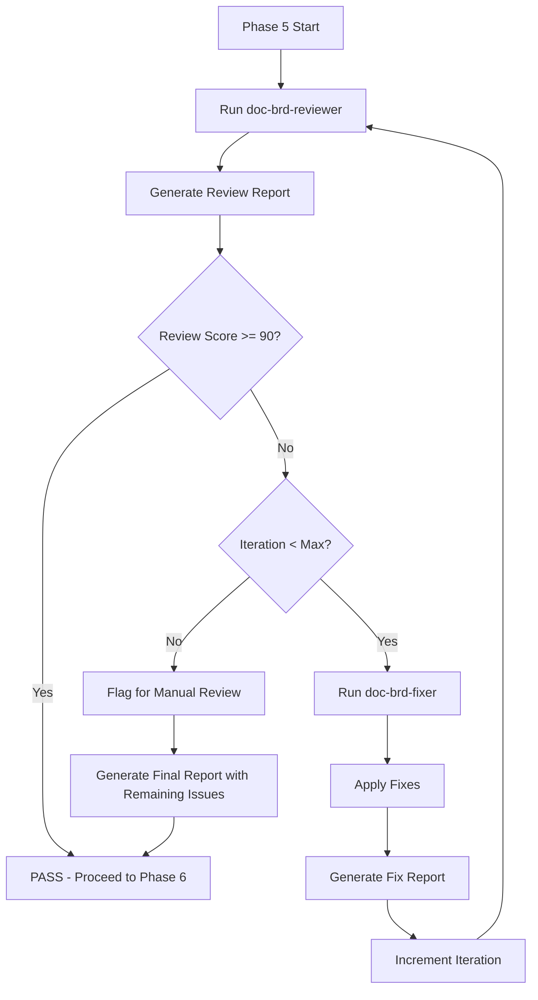
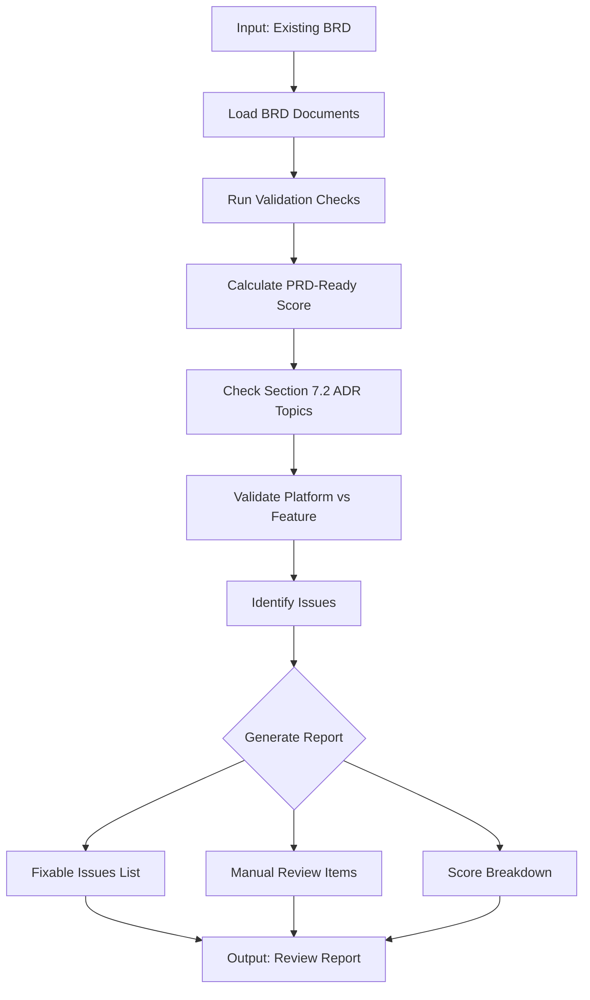
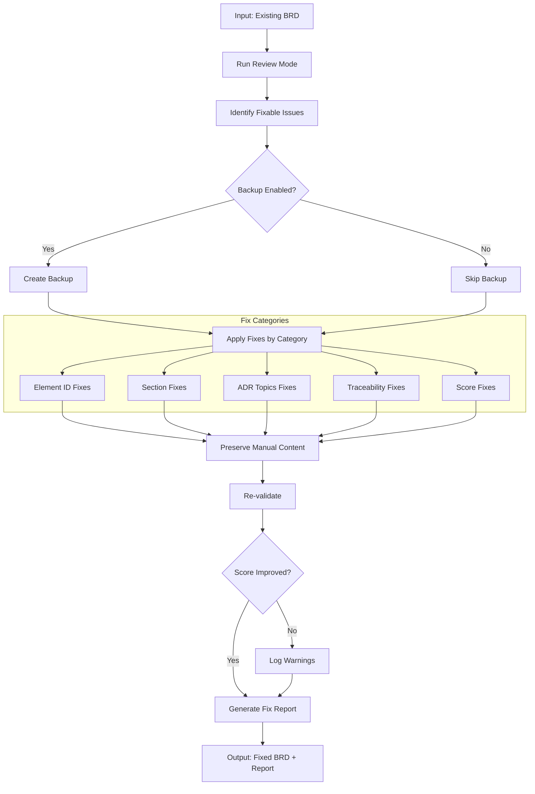
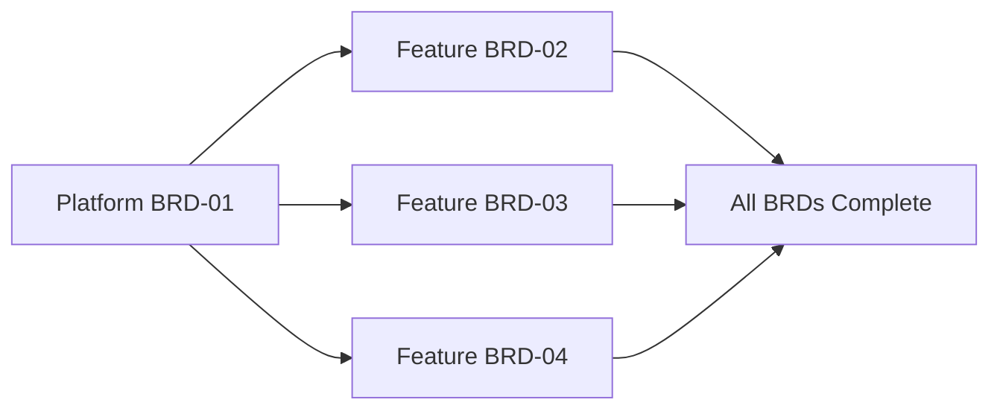

# doc-brd-autopilot

## Purpose

Automated **Business Requirements Document (BRD)** generation pipeline that processes reference documents (`docs/00_REF/` or `REF/`) or user prompts to generate comprehensive BRDs with type determination, readiness validation, master index management, and parallel execution support.

**Layer**: 1 (Entry point - no upstream document dependencies)

**Downstream Artifacts**: PRD (Layer 2), EARS (Layer 3), BDD (Layer 4), ADR (Layer 5)

---

## Skill Dependencies

This autopilot orchestrates the following skills:

| Skill | Purpose | Phase |
|-------|---------|-------|
| `doc-naming` | Element ID format (BRD.NN.TT.SS), threshold tags, legacy pattern detection | All Phases |
| `doc-brd` | BRD creation rules, template, section structure, Platform vs Feature guidance | Phase 3: BRD Generation |
| `quality-advisor` | Real-time quality feedback during BRD generation | Phase 3: BRD Generation |
| `doc-brd-validator` | Validate BRD structure, content, PRD-Ready score | Phase 4: BRD Validation |
| `doc-brd-reviewer` | Content review, link validation, quality scoring | Phase 5: Review |
| `doc-brd-fixer` | Apply fixes from review report, create missing files | Phase 5: Fix |

**Delegation Principle**: The autopilot orchestrates workflow but delegates:
- BRD structure/content rules → `doc-brd` skill
- Real-time quality feedback → `quality-advisor` skill
- BRD validation logic → `doc-brd-validator` skill
- Content review and scoring → `doc-brd-reviewer` skill
- Issue resolution and fixes → `doc-brd-fixer` skill
- Element ID standards → `doc-naming` skill

---

## When to Use This Skill

**Use `doc-brd-autopilot` when**:
- Starting a new project and need to create the initial BRD
- Converting business requirements or strategy documents to formal BRD format
- Creating multiple BRDs for a project (platform + feature BRDs)
- Automating BRD generation in CI/CD pipelines
- Ensuring consistent BRD quality across team members

**Do NOT use when**:
- Manually reviewing an existing BRD (use `doc-brd-validator`)
- Creating a simple single-section BRD (use `doc-brd` directly)
- Editing specific BRD sections (use `doc-brd` for guidance)

---

## Workflow Overview

```mermaid
flowchart TD
    subgraph Phase1["Phase 1: Input Analysis"]
        A[Start] --> B[Read Strategy Documents]
        B --> C[Identify Stakeholder Requirements]
        C --> D[Extract Business Context]
        D --> E[Catalog Input Sources]
        E --> E1[Validate @ref Targets]
        E1 --> E2{All refs valid?}
        E2 -->|No| E3[Flag missing docs]
        E3 --> E4{Required doc?}
        E4 -->|Yes| E5[ABORT: Create missing doc first]
        E4 -->|No| E6[Continue with warning]
        E2 -->|Yes| E6
    end

    subgraph Phase2["Phase 2: BRD Type Determination"]
        E6 --> F[Run Platform vs Feature Questionnaire]
        F --> G{Platform BRD?}
        G -->|Yes| H[Configure Platform BRD Mode]
        G -->|No| I[Configure Feature BRD Mode]
        H --> J[Check for Platform BRD Dependencies]
        I --> K[Verify Platform BRD Exists]
        K -->|Missing| L[Queue Platform BRD First]
        L --> J
        K -->|Exists| J
    end

    subgraph Phase3["Phase 3: BRD Generation"]
        J --> M[Load BRD Template]
        M --> N[Generate Document Control]
        N --> O[Generate Core Sections 1-9]
        O --> O2[Generate Section 7.2: ADR Topics]
        O2 --> P[quality-advisor: Real-time Feedback]
        P --> Q[Generate Sections 10-18]
        Q --> Q2[Handle Master Glossary]
        Q2 --> Q3{Glossary exists?}
        Q3 -->|No| Q4[Create BRD-00_GLOSSARY.md]
        Q3 -->|Yes| Q5[Update path reference]
        Q4 --> Q5
        Q5 --> R[Add Traceability References]
        R --> S[Write BRD Files]
    end

    subgraph Phase4["Phase 4: BRD Validation"]
        S --> T[Run doc-brd-validator]
        T --> U{PRD-Ready >= 90?}
        U -->|No| V[Auto-Fix BRD Issues]
        V --> W[Re-validate BRD]
        W --> U
        U -->|Yes| X[Mark BRD Validated]
    end

    subgraph Phase5["Phase 5: Review & Fix Cycle"]
        X --> Y[Run doc-brd-reviewer]
        Y --> Y2{Score >= 90?}
        Y2 -->|No| Y3[Run doc-brd-fixer]
        Y3 --> Y4{Iteration < Max?}
        Y4 -->|Yes| Y
        Y4 -->|No| Y5[Flag Manual Review]
        Y2 -->|Yes| Z[Verify Quality Checks]
        Y5 --> Z
        Z --> AA[Generate PRD-Ready Report]
        AA --> AB[Update Traceability Matrix]
    end

    AB --> AC[Complete]
```



---

## Detailed Workflow

### Phase 1: Input Analysis

Analyze available input sources to extract business requirements.

**Input Sources** (priority order):

| Priority | Source | Location | Content Type |
|----------|--------|----------|--------------|
| 1 | Reference Documents | `docs/00_REF/` | Technical specs, gap analysis, architecture |
| 2 | Reference Documents (alt) | `REF/` | Alternative location for reference docs |
| 3 | Existing Documentation | `docs/` or `README.md` | Project context, scope |
| 4 | User Prompts | Interactive | Business context, objectives, constraints |

**Analysis Process**:

```bash
# Check for reference documents (primary location)
ls -la docs/00_REF/

# Alternative location
ls -la REF/

# Expected structure:
# docs/00_REF/
# ├── foundation/           # Foundation module specs (F1-F7)
# │   ├── F1_IAM_Technical_Specification.md
# │   ├── F2_Session_Technical_Specification.md
# │   └── GAP_Foundation_Module_Gap_Analysis.md
# ├── domain/               # Domain module specs (D1-D7)
# │   ├── D1_Agent_Technical_Specification.md
# │   └── architecture/     # Architecture documents
# └── external/             # External references
```

**Output**: Input catalog with extracted requirements, objectives, and constraints.

#### 1.1 Source Document Link Validation (NEW in v2.3)

**Purpose**: Validate that all referenced source documents exist before proceeding to generation. This prevents broken `@ref:` links in the generated BRD.

**Validation Checks**:

| Check | Action | Severity |
|-------|--------|----------|
| Reference documents exist | Verify files in `docs/00_REF/` or `REF/` | Error - blocks generation |
| `@ref:` targets in source docs | Verify referenced files exist | Error - blocks generation |
| Gap analysis documents | Verify `GAP_*.md` files if referenced | Warning - flag for creation |
| Cross-reference documents | Verify upstream docs exist | Warning - document dependency |

**Validation Process**:

```bash
# Check for referenced documents
grep -h "@ref:" docs/00_REF/**/*.md REF/**/*.md 2>/dev/null | \
  grep -oP '\[.*?\]\(([^)]+)\)' | \
  while read link; do
    file=$(echo "$link" | grep -oP '\(([^)]+)\)' | tr -d '()')
    if [ ! -f "$file" ]; then
      echo "WARNING: Referenced file not found: $file"
    fi
  done
```

**Error Handling**:

| Scenario | Action |
|----------|--------|
| Required source doc missing | Abort with clear error message |
| Optional reference missing | Log warning, continue with placeholder note |
| Gap analysis doc missing | Prompt user: create doc or update references |

**Example Output**:

```
Phase 1: Input Analysis
=======================
Reference documents found: 5
  ✅ docs/00_REF/foundation/F1_IAM_Technical_Specification.md
  ✅ docs/00_REF/foundation/F2_Session_Technical_Specification.md
  ✅ docs/00_REF/foundation/F3_Observability_Technical_Specification.md
  ✅ docs/00_REF/domain/D1_Agent_Technical_Specification.md
  ✅ docs/00_REF/GLOSSARY_Master.md

Reference Validation:
  ✅ docs/00_REF/foundation/F1_IAM_Technical_Specification.md
  ❌ docs/00_REF/foundation/GAP_Foundation_Module_Gap_Analysis.md (NOT FOUND)

ACTION REQUIRED: Create missing reference document or update source references.
```

### Phase 2: BRD Type Determination

Determine if creating a Platform BRD or Feature BRD.

> **Skill Delegation**: This phase follows rules defined in `doc-brd` skill.
> See: `.claude/skills/doc-brd/SKILL.md` Section "BRD Categorization: Platform vs Feature"

**Questionnaire** (automated):

| Question | Platform Indicator | Feature Indicator |
|----------|-------------------|-------------------|
| Defines infrastructure/technology stack? | Yes | No |
| Describes specific user-facing workflow? | No | Yes |
| Other BRDs will depend on this? | Yes | No |
| Establishes patterns/standards for multiple features? | Yes | No |
| Implements functionality on existing platform? | No | Yes |

**Auto-Detection Logic**:

```python
def determine_brd_type(title: str, content: str) -> str:
    platform_keywords = ["Platform", "Architecture", "Infrastructure", "Integration", "Foundation"]
    feature_keywords = ["B2C", "B2B", "Workflow", "User", "Feature", "Module"]

    if any(kw in title for kw in platform_keywords):
        return "PLATFORM"
    if any(kw in title for kw in feature_keywords):
        return "FEATURE"
    if references_platform_brd(content):
        return "FEATURE"
    return "PLATFORM"  # Default to Platform for new projects
```

**Feature BRD Dependency Check**:

```bash
# Verify Platform BRD exists before creating Feature BRD
ls docs/01_BRD/BRD-01_* 2>/dev/null || echo "ERROR: Platform BRD-01 required"
```

### Phase 3: BRD Generation

Generate the BRD document with real-time quality feedback.

> **Skill Delegation**: This phase follows rules defined in `doc-brd` skill.
> See: `.claude/skills/doc-brd/SKILL.md` for complete BRD creation guidance.
>
> **Quality Guidance**: Uses `quality-advisor` skill for real-time feedback during generation.
> See: `.claude/skills/quality-advisor/SKILL.md` for quality monitoring.

**Generation Process**:

1. **Reserve BRD ID**:
   ```bash
   # Check for next available ID
   ls docs/01_BRD/BRD-*.md docs/01_BRD/BRD-*/BRD-*.0_*.md 2>/dev/null | \
     grep -oP 'BRD-\K\d+' | sort -n | tail -1
   # Increment for new BRD
   ```

2. **Load BRD Template**:
   - Primary: `ai_dev_flow/01_BRD/BRD-MVP-TEMPLATE.md`
   - Comprehensive: `ai_dev_flow/01_BRD/BRD-TEMPLATE.md`

3. **Generate Document Control Section**:
   | Field | Value |
   |-------|-------|
   | Project Name | From input analysis |
   | Document Version | 0.1.0 |
   | Date Created | Current date (YYYY-MM-DD) |
   | Last Updated | Current date (YYYY-MM-DD) |
   | Document Owner | From stakeholder input |
   | Prepared By | AI Assistant |
   | Status | Draft |
   | PRD-Ready Score | Calculated after generation |

4. **Generate Core Sections (1-9)**:
   - Section 1: Executive Summary
   - Section 2: Business Context
   - Section 3: Stakeholder Analysis
   - Section 4: Business Requirements (using BRD.NN.01.SS format)
   - Section 5: Success Criteria
   - Section 6: Constraints and Assumptions
   - Section 7: Architecture Decision Requirements
   - Section 8: Risk Assessment
   - Section 9: Traceability

5. **Generate Section 7.2: Architecture Decision Requirements**:

   **7 Mandatory ADR Topic Categories** (per `doc-brd` skill):

   | # | Category | Element ID | Fields Required |
   |---|----------|------------|-----------------|
   | 1 | Infrastructure | BRD.NN.32.01 | Status, Business Driver, Constraints, Alternatives, Cloud Comparison |
   | 2 | Data Architecture | BRD.NN.32.02 | Status, Business Driver, Constraints, Alternatives, Cloud Comparison |
   | 3 | Integration | BRD.NN.32.03 | Status, Business Driver, Constraints, Alternatives, Cloud Comparison |
   | 4 | Security | BRD.NN.32.04 | Status, Business Driver, Constraints, Alternatives, Cloud Comparison |
   | 5 | Observability | BRD.NN.32.05 | Status, Business Driver, Constraints, Alternatives, Cloud Comparison |
   | 6 | AI/ML | BRD.NN.32.06 | Status, Business Driver, Constraints, Alternatives, Cloud Comparison |
   | 7 | Technology Selection | BRD.NN.32.07 | Status, Business Driver, Constraints, Alternatives, Cloud Comparison |

   **Status Values**: `Selected`, `Pending`, `N/A`

   **Required Tables** (for Status=Selected):
   - Alternatives Overview table (Option | Function | Est. Monthly Cost | Selection Rationale)
   - Cloud Provider Comparison table (Criterion | GCP | Azure | AWS)

6. **Real-Time Quality Feedback** (via `quality-advisor` skill):
   - Monitor section completion as content is generated
   - Detect anti-patterns (AP-001 to AP-017) during creation
   - Validate element ID format compliance (BRD.NN.TT.SS)
   - Check for placeholder text ([TBD], TODO, XXX)
   - Flag issues early to reduce post-generation rework

7. **Generate Sections 10-18**:
   - Section 10: Market Context
   - Section 11: Regulatory Compliance
   - Section 12: Integration Requirements
   - Section 13: Data Requirements
   - Section 14: Performance Requirements
   - Section 15: Security Requirements
   - Section 16: Operational Requirements
   - Section 17: Glossary
   - Section 18: Appendices

8. **Platform vs Feature Section Handling**:

   | BRD Type | Section 3.6 | Section 3.7 |
   |----------|-------------|-------------|
   | Platform | MUST populate with technology details | MUST populate with conditions |
   | Feature | "N/A - See Platform BRD-NN Section 3.6" | "N/A - See Platform BRD-NN Section 3.7" |

9. **Traceability References**:
   ```markdown
   ## 9. Traceability

   ### Upstream Sources
   | Source | Type | Reference |
   |--------|------|-----------|
   | docs/00_REF/foundation/F1_Technical_Specification.md | Reference Document | Technical specifications |
   | docs/00_REF/foundation/GAP_Analysis.md | Reference Document | Gap analysis |
   | [Stakeholder] | Business Input | Initial requirements |

   ### Downstream Artifacts
   | Artifact | Type | Status |
   |----------|------|--------|
   | PRD-NN | Product Requirements | Pending |
   | ADR-NN | Architecture Decisions | Pending |
   ```

10. **Master Glossary Handling** (NEW in v2.3):

    The BRD template references a master glossary. The autopilot MUST handle this reference correctly.

    **Glossary Check Process**:

    | Scenario | Action |
    |----------|--------|
    | `docs/BRD-00_GLOSSARY.md` exists | Use correct relative path in Section 14 |
    | Glossary missing, first BRD | Create `docs/01_BRD/BRD-00_GLOSSARY.md` with template |
    | Glossary missing, subsequent BRD | Reference existing glossary or create if missing |

    **Glossary Creation Template**:

    ```markdown
    ---
    title: "BRD-00: Master Glossary"
    tags:
      - brd
      - glossary
      - reference
    custom_fields:
      document_type: glossary
      artifact_type: BRD-REFERENCE
      layer: 1
    ---

    # BRD-00: Master Glossary

    Common terminology used across all Business Requirements Documents.

    ## Business Terms

    | Term | Definition | Context |
    |------|------------|---------|
    | MVP | Minimum Viable Product | Scope definition |
    | SLA | Service Level Agreement | Quality requirements |

    ## Technical Terms

    | Term | Definition | Context |
    |------|------------|---------|
    | API | Application Programming Interface | Integration |
    | JWT | JSON Web Token | Authentication |

    ## Domain Terms

    [Add project-specific terminology here]
    ```

    **Section 14 Glossary Reference Format**:

    ```markdown
    ## 14. Glossary

    📚 **Master Glossary**: For common terminology, see [BRD-00_GLOSSARY.md](../BRD-00_GLOSSARY.md)

    ### {BRD-NN}-Specific Terms

    | Term | Definition | Context |
    |------|------------|---------|
    | [Term 1] | [Definition] | [Where used] |
    ```

    **Path Resolution**:

    | BRD Location | Glossary Path |
    |--------------|---------------|
    | `docs/01_BRD/BRD-01.md` (monolithic) | `BRD-00_GLOSSARY.md` |
    | `docs/01_BRD/BRD-01_slug/BRD-01.3_*.md` (sectioned) | `../BRD-00_GLOSSARY.md` |

11. **BRD Index Handling** (NEW in v2.4):

    The autopilot MUST create or update `BRD-00_index.md` to serve as the master index for all BRD documents.

    **Index Check Process**:

    | Scenario | Action |
    |----------|--------|
    | `docs/01_BRD/BRD-00_index.md` exists | Update with new BRD entry |
    | Index missing | Create `docs/01_BRD/BRD-00_index.md` with template |

    **BRD-00_index.md Creation Template**:

    ```markdown
    ---
    title: "BRD-00: Business Requirements Document Index"
    tags:
      - brd
      - index
      - layer-1-artifact
    custom_fields:
      document_type: brd-index
      artifact_type: BRD-INDEX
      layer: 1
      last_updated: "YYYY-MM-DDTHH:MM:SS"
    ---

    # BRD-00: Business Requirements Document Index

    Master index of all Business Requirements Documents for the project.

    ---

    ## Document Registry

    | BRD ID | Module | Type | Status | PRD-Ready | Location |
    |--------|--------|------|--------|-----------|----------|
    | BRD-01 | F1 IAM | Foundation | Draft | 97% | [BRD-01](BRD-01_f1_iam/BRD-01.0_index.md) |

    ---

    ## Module Categories

    ### Foundation Modules (F1-F7)

    Domain-agnostic, reusable infrastructure modules.

    | ID | Module Name | BRD | Status |
    |----|-------------|-----|--------|
    | F1 | Identity & Access Management | [BRD-01](BRD-01_f1_iam/BRD-01.0_index.md) | Draft |
    | F2 | Session Management | Pending | - |
    | F3 | Observability | Pending | - |
    | F4 | SecOps | Pending | - |
    | F5 | Events | Pending | - |
    | F6 | Infrastructure | Pending | - |
    | F7 | Configuration | Pending | - |

    ### Domain Modules (D1-D7)

    Business-specific modules for cost monitoring.

    | ID | Module Name | BRD | Status |
    |----|-------------|-----|--------|
    | D1 | Agent Orchestration | Pending | - |
    | D2 | Cloud Accounts | Pending | - |
    | D3 | Cost Analytics | Pending | - |
    | D4 | Recommendations | Pending | - |
    | D5 | Reporting | Pending | - |
    | D6 | Alerting | Pending | - |
    | D7 | Budgets | Pending | - |

    ---

    ## Quick Links

    - **Glossary**: [BRD-00_GLOSSARY.md](BRD-00_GLOSSARY.md)
    - **Reference Documents**: [00_REF](../00_REF/)
    - **PRD Layer**: [02_PRD](../02_PRD/)

    ---

    ## Statistics

    | Metric | Value |
    |--------|-------|
    | Total BRDs | 1 |
    | Foundation Modules | 1/7 |
    | Domain Modules | 0/7 |
    | Average PRD-Ready Score | 97% |

    ---

    *Last Updated: YYYY-MM-DDTHH:MM:SS*
    ```

    **Index Update Logic**:

    After generating each BRD:
    1. Read existing `BRD-00_index.md`
    2. Parse Document Registry table
    3. Add or update entry for new BRD
    4. Update Statistics section
    5. Update `last_updated` timestamp
    6. Write updated index

    **Entry Format**:

    ```markdown
    | BRD-NN | {Module Name} | {Foundation/Domain} | {Status} | {Score}% | [BRD-NN](BRD-NN_{slug}/BRD-NN.0_index.md) |
    ```

12. **File Output** (ALWAYS use nested folder):
    - **Monolithic** (<20k tokens): `docs/01_BRD/BRD-NN_{slug}/BRD-NN_{slug}.md`
    - **Sectioned** (>=20k tokens): `docs/01_BRD/BRD-NN_{slug}/BRD-NN.0_index.md`, `BRD-NN.1_core.md`, etc.
    - **Master Index** (always): `docs/01_BRD/BRD-00_index.md` (create or update)

    **Nested Folder Rule**: ALL BRDs use nested folders (`BRD-NN_{slug}/`) regardless of size. This keeps companion files (review reports, fix reports, drift cache) organized with their parent document.

### Phase 4: BRD Validation

After BRD generation, validate structure and PRD-Ready score.

> **Skill Delegation**: This phase uses validation rules from `doc-brd-validator` skill.
> See: `.claude/skills/doc-brd-validator/SKILL.md` for complete validation rules.

**Validation Command**:

```bash
python ai_dev_flow/scripts/validate_brd.py docs/01_BRD/BRD-NN_{slug}.md --verbose
```

**Validation Checks**:

| Check | Requirement | Error Code |
|-------|-------------|------------|
| YAML Frontmatter | Valid metadata fields | BRD-E001 to BRD-E005 |
| Section Structure | 18 required sections | BRD-E006 to BRD-E008 |
| Document Control | All required fields | BRD-E009 |
| Business Objectives | BRD.NN.23.SS format | BRD-W001 |
| Business Requirements | BRD.NN.01.SS format | BRD-W002 |
| Section 7.2 ADR Topics | All 7 categories present | BRD-E013 to BRD-E018 |
| Element ID Format | BRD.NN.TT.SS (4-segment) | BRD-E019 to BRD-E021 |
| PRD-Ready Score | >= 90% | BRD-W004 |

**Auto-Fix Actions**:

| Issue | Auto-Fix Action |
|-------|-----------------|
| Invalid element ID format | Convert to BRD.NN.TT.SS format |
| Missing traceability section | Insert from template |
| Missing Document Control fields | Add placeholder fields |
| Deprecated ID patterns (BO-XXX, FR-XXX) | Convert to unified format |
| Missing PRD-Ready Score | Calculate and insert |

**Validation Loop**:

```
LOOP (max 3 iterations):
  1. Run doc-brd-validator
  2. IF errors found: Apply auto-fixes
  3. IF warnings found: Review and address if critical
  4. IF PRD-Ready Score < 90%: Enhance sections
  5. IF clean: Mark VALIDATED, proceed
  6. IF max iterations: Log issues, flag for manual review
```

### Phase 5: Review & Fix Cycle (v2.3)

Iterative review and fix cycle to ensure BRD quality before completion.



#### 5.1 Initial Review

Run `doc-brd-reviewer` to identify issues.

```bash
/doc-brd-reviewer BRD-NN
```

**Output**: `BRD-NN.R_review_report_v001.md`

#### 5.2 Fix Cycle

If review score < 90%, invoke `doc-brd-fixer`.

```bash
/doc-brd-fixer BRD-NN --revalidate
```

**Fix Categories**:

| Category | Fixes Applied |
|----------|---------------|
| Missing Files | Create glossary, GAP placeholders, reference docs |
| Broken Links | Update paths, create targets |
| Element IDs | Convert legacy patterns, fix invalid type codes |
| Content | Replace template placeholders, dates |
| References | Update traceability tags |

**Output**: `BRD-NN.F_fix_report_v001.md`

#### 5.3 Re-Review

After fixes, automatically re-run reviewer.

```bash
/doc-brd-reviewer BRD-NN
```

**Output**: `BRD-NN.R_review_report_v002.md`

#### 5.4 Iteration Control

| Parameter | Default | Description |
|-----------|---------|-------------|
| `max_iterations` | 3 | Maximum fix-review cycles |
| `target_score` | 90 | Minimum passing score |
| `stop_on_manual` | false | Stop if only manual issues remain |

**Iteration Example**:

```
Iteration 1:
  Review v001: Score 85 (2 errors, 4 warnings)
  Fix v001: Fixed 5 issues, created 2 files

Iteration 2:
  Review v002: Score 94 (0 errors, 2 warnings)
  Status: PASS (score >= 90)
```

#### 5.5 Quality Checks (Post-Fix)

After passing the fix cycle:

1. **Section Completeness**:
   - All 18 sections present and populated
   - No placeholder text remaining ([TBD], TODO, XXX)
   - Minimum content length per section

2. **ADR Topics Coverage**:
   - All 7 mandatory categories addressed
   - Selected topics have Alternatives Overview table
   - Selected topics have Cloud Provider Comparison table
   - N/A topics have explicit reasons

3. **Element ID Compliance** (per `doc-naming` skill):
   - All IDs use BRD.NN.TT.SS format
   - Element type codes valid for BRD (01, 02, 03, 04, 05, 06, 07, 08, 09, 10, 22, 23, 24, 32, 33)
   - No legacy patterns (BO-XXX, FR-XXX, AC-XXX, BC-XXX)

4. **PRD-Ready Report**:
   ```
   PRD-Ready Score Breakdown
   =========================
   Business Objectives:    15/15 (BRD.NN.23.SS format)
   Requirements Complete:  20/20 (BRD.NN.01.SS format)
   Success Metrics:        10/10 (quantifiable)
   Constraints Defined:    10/10 (documented)
   Stakeholder Analysis:   10/10 (complete)
   Risk Assessment:        10/10 (identified)
   Traceability:           10/10 (sources cited)
   ADR Topics:             15/15 (all 7 categories)
   ----------------------------
   Total PRD-Ready Score:  100/100 (Target: >= 90)
   Status: READY FOR PRD GENERATION
   ```

5. **Traceability Matrix Update**:
   ```bash
   # Update BRD-00_TRACEABILITY_MATRIX.md
   python ai_dev_flow/scripts/update_traceability_matrix.py \
     --brd docs/01_BRD/BRD-NN_{slug}.md \
     --matrix docs/01_BRD/BRD-00_TRACEABILITY_MATRIX.md
   ```

---

## Execution Modes

### Single BRD Mode

Generate one BRD from input sources.

```bash
# Example: Generate Platform BRD from reference documents
python ai_dev_flow/scripts/brd_autopilot.py \
  --ref docs/00_REF/ \
  --type platform \
  --output docs/01_BRD/ \
  --id 01 \
  --slug platform_architecture

# Alternative: Generate from REF/ directory
python ai_dev_flow/scripts/brd_autopilot.py \
  --ref REF/ \
  --type platform \
  --output docs/01_BRD/ \
  --id 01 \
  --slug platform_architecture
```

### Batch Mode

Generate multiple BRDs in sequence with dependency awareness.

```bash
# Example: Generate Platform BRD then Feature BRDs
python ai_dev_flow/scripts/brd_autopilot.py \
  --batch config/brd_batch.yaml \
  --output docs/01_BRD/
```

**Batch Configuration** (`config/brd_batch.yaml`):

```yaml
brds:
  - id: "01"
    slug: "f1_iam"
    type: "platform"
    priority: 1
    sources:
      - docs/00_REF/foundation/F1_IAM_Technical_Specification.md
      - docs/00_REF/foundation/GAP_Foundation_Module_Gap_Analysis.md

  - id: "02"
    slug: "f2_session"
    type: "platform"
    priority: 1
    sources:
      - docs/00_REF/foundation/F2_Session_Technical_Specification.md

  - id: "03"
    slug: "f3_observability"
    type: "platform"
    priority: 1
    sources:
      - docs/00_REF/foundation/F3_Observability_Technical_Specification.md

execution:
  parallel: true
  max_parallel: 3        # HARD LIMIT - do not exceed
  chunk_size: 3          # Documents per chunk
  pause_between_chunks: true
  max_workers: 2
  fail_fast: false
```

### Dry Run Mode

Preview execution plan without generating files.

```bash
python ai_dev_flow/scripts/brd_autopilot.py \
  --ref docs/00_REF/ \
  --output docs/01_BRD/ \
  --dry-run
```

### Review Mode (v2.1)

Validate existing BRD documents and generate a quality report without modification.

**Purpose**: Audit existing BRD documents for compliance, quality scores, and identify issues.

**Command**:

```bash
# Review single BRD
python ai_dev_flow/scripts/brd_autopilot.py \
  --brd docs/01_BRD/BRD-01_platform.md \
  --mode review

# Review all BRDs
python ai_dev_flow/scripts/brd_autopilot.py \
  --brd docs/01_BRD/ \
  --mode review \
  --output-report tmp/brd_review_report.md
```

**Review Process**:



**Review Report Structure**:

```markdown
# BRD Review Report: BRD-01_platform

## Summary
- **PRD-Ready Score**: 87% 🟡
- **Total Issues**: 14
- **Auto-Fixable**: 10
- **Manual Review**: 4

## Score Breakdown
| Category | Score | Status |
|----------|-------|--------|
| Business Objectives | 14/15 | 🟡 |
| Requirements Complete | 18/20 | 🟡 |
| Success Metrics | 10/10 | ✅ |
| Constraints Defined | 10/10 | ✅ |
| Stakeholder Analysis | 10/10 | ✅ |
| Risk Assessment | 8/10 | 🟡 |
| Traceability | 10/10 | ✅ |
| ADR Topics | 12/15 | 🟡 |

## Section 7.2 ADR Topics Check
| Category | Status | Details |
|----------|--------|---------|
| Infrastructure | ✅ | Complete with tables |
| Data Architecture | ✅ | Complete with tables |
| Integration | 🟡 | Missing Cloud Comparison |
| Security | ✅ | Complete with tables |
| Observability | ❌ | Missing alternatives table |
| AI/ML | ✅ | Complete with tables |
| Technology Selection | ✅ | Complete with tables |

## Platform vs Feature Check
| Check | Status | Details |
|-------|--------|---------|
| BRD Type | Platform | Correctly identified |
| Section 3.6 | ✅ | Technology details present |
| Section 3.7 | ✅ | Conditions populated |
| Cross-references | ✅ | Valid references |

## Auto-Fixable Issues
| # | Issue | Location | Fix Action |
|---|-------|----------|------------|
| 1 | Legacy element ID | Section 4:L45 | Convert BO-001 to BRD.01.23.01 |
| 2 | Missing PRD-Ready score | Document Control | Calculate and insert |
| 3 | Invalid ID format | Section 5:L78 | Convert FR-001 to BRD.01.01.01 |
| ... | ... | ... | ... |

## Manual Review Required
| # | Issue | Location | Reason |
|---|-------|----------|--------|
| 1 | Incomplete risk assessment | Section 8:L102 | Domain knowledge needed |
| 2 | Missing Observability tables | Section 7.2.5 | Architecture decision required |
| ... | ... | ... | ... |

## Recommendations
1. Run fix mode to address 10 auto-fixable issues
2. Complete Observability ADR topic tables
3. Review and complete risk assessment section
```

**Review Configuration**:

```yaml
review_mode:
  enabled: true
  checks:
    - structure_validation      # 18 sections, Document Control
    - element_id_compliance     # BRD.NN.TT.SS format
    - adr_topics_validation     # 7 ADR categories in Section 7.2
    - platform_feature_check    # Correct section handling
    - cumulative_tags           # Traceability references
    - score_calculation         # PRD-Ready score
  output:
    format: markdown           # markdown, json, html
    include_line_numbers: true
    include_fix_suggestions: true
  thresholds:
    pass: 90
    warning: 85
    fail: 0
```

### Fix Mode (v2.1)

Auto-repair existing BRD documents while preserving manual content.

**Purpose**: Apply automated fixes to BRD documents to improve quality scores and compliance.

**Command**:

```bash
# Fix single BRD
python ai_dev_flow/scripts/brd_autopilot.py \
  --brd docs/01_BRD/BRD-01_platform.md \
  --mode fix

# Fix with backup
python ai_dev_flow/scripts/brd_autopilot.py \
  --brd docs/01_BRD/BRD-01_platform.md \
  --mode fix \
  --backup

# Fix specific issue types only
python ai_dev_flow/scripts/brd_autopilot.py \
  --brd docs/01_BRD/BRD-01_platform.md \
  --mode fix \
  --fix-types "element_ids,sections,adr_topics"

# Dry-run fix (preview changes)
python ai_dev_flow/scripts/brd_autopilot.py \
  --brd docs/01_BRD/BRD-01_platform.md \
  --mode fix \
  --dry-run
```

**Fix Process**:



**Fix Categories and Actions**:

| Category | Issue | Auto-Fix Action | Preserves Content |
|----------|-------|-----------------|-------------------|
| **Element IDs** | Legacy BO-XXX format | Convert to BRD.NN.23.SS | ✅ |
| **Element IDs** | Legacy FR-XXX format | Convert to BRD.NN.01.SS | ✅ |
| **Element IDs** | Legacy AC-XXX format | Convert to BRD.NN.06.SS | ✅ |
| **Element IDs** | Legacy BC-XXX format | Convert to BRD.NN.09.SS | ✅ |
| **Element IDs** | Invalid type code for BRD | Suggest correct code (e.g., 25→33 for Benefits) | ✅ |
| **Sections** | Missing Document Control fields | Add from template | ✅ |
| **Sections** | Missing traceability section | Insert from template | ✅ |
| **Sections** | Missing PRD-Ready score | Calculate and insert | ✅ |
| **ADR Topics** | Missing category | Add template entry | ✅ |
| **ADR Topics** | Missing Alternatives table | Add table template | ✅ |
| **ADR Topics** | Missing Cloud Comparison table | Add table template | ✅ |
| **Traceability** | Missing upstream sources | Add template structure | ✅ |
| **Traceability** | Missing downstream artifacts | Add template structure | ✅ |
| **Score** | Missing PRD-Ready breakdown | Calculate and add | ✅ |
| **Broken Links** | Missing glossary file | Create BRD-00_GLOSSARY.md | ✅ |
| **Broken Links** | Missing reference doc | Prompt to create or update link | ⚠️ |
| **Broken Links** | Invalid relative path | Fix path based on BRD location | ✅ |

**Content Preservation Rules**:

1. **Never delete** existing business requirements
2. **Never modify** executive summary content
3. **Never change** stakeholder analysis details
4. **Only add** missing sections and metadata
5. **Only replace** legacy element IDs with unified format
6. **Backup first** if `--backup` flag is set

**Element ID Migration**:

| Legacy Pattern | New Format | Example |
|----------------|------------|---------|
| `BO-XXX` | `BRD.NN.23.SS` | BO-001 → BRD.01.23.01 |
| `FR-XXX` | `BRD.NN.01.SS` | FR-001 → BRD.01.01.01 |
| `AC-XXX` | `BRD.NN.06.SS` | AC-001 → BRD.01.06.01 |
| `BC-XXX` | `BRD.NN.09.SS` | BC-001 → BRD.01.09.01 |
| `ADR-T-XXX` | `BRD.NN.32.SS` | ADR-T-001 → BRD.01.32.01 |

**Element Type Code Migration** (v2.3):

| Invalid Code | Correct Code | Context | Example |
|--------------|--------------|---------|---------|
| 25 in BRD | 33 | Benefits section | BRD.01.25.01 → BRD.01.33.01 |

**Note**: Code 25 is valid only for EARS documents (EARS Statement). For BRD Benefits, use code 33 (Benefit Statement).

**Broken Link Fixes** (v2.3):

| Issue | Fix Action | Creates File |
|-------|------------|--------------|
| Missing `BRD-00_GLOSSARY.md` | Create from template | ✅ Yes |
| Missing reference doc (GAP, REF) | Prompt user with options: (1) Create placeholder, (2) Update link, (3) Remove reference | ⚠️ Optional |
| Wrong relative path | Recalculate path based on BRD location | ❌ No |
| Cross-BRD reference to non-existent BRD | Log warning, suggest creating BRD | ❌ No |

**Fix Report Structure**:

```markdown
# BRD Fix Report: BRD-01_platform

## Summary
- **Before PRD-Ready Score**: 87% 🟡
- **After PRD-Ready Score**: 94% ✅
- **Issues Fixed**: 10
- **Issues Remaining**: 4 (manual review required)

## Fixes Applied
| # | Issue | Location | Fix Applied |
|---|-------|----------|-------------|
| 1 | Legacy element ID | Section 4:L45 | Converted BO-001 → BRD.01.23.01 |
| 2 | Missing PRD-Ready score | Document Control | Added 94% with breakdown |
| 3 | Missing Cloud Comparison | Section 7.2.3 | Added template table |
| ... | ... | ... | ... |

## Files Modified
- docs/01_BRD/BRD-01_platform.md

## Backup Location
- tmp/backup/BRD-01_platform_20260209_143022.md

## Remaining Issues (Manual Review)
| # | Issue | Location | Reason |
|---|-------|----------|--------|
| 1 | Incomplete risk assessment | Section 8:L102 | Domain knowledge needed |
| 2 | Missing Observability tables | Section 7.2.5 | Architecture decision required |
| ... | ... | ... | ... |

## Score Breakdown Impact
| Category | Before | After | Delta |
|----------|--------|-------|-------|
| Business Objectives | 14/15 | 15/15 | +1 |
| Requirements Complete | 18/20 | 20/20 | +2 |
| ADR Topics | 12/15 | 14/15 | +2 |
| Traceability | 10/10 | 10/10 | 0 |

## Next Steps
1. Review manually flagged items
2. Complete Observability ADR topic
3. Re-run validation to confirm score
```

**Fix Configuration**:

```yaml
fix_mode:
  enabled: true
  backup:
    enabled: true
    location: "tmp/backup/"
    retention_days: 7

  fix_categories:
    element_ids: true        # Legacy ID conversion
    sections: true           # Missing sections
    adr_topics: true         # Section 7.2 ADR topics
    traceability: true       # Upstream/downstream refs
    score: true              # PRD-Ready score

  preservation:
    executive_summary: true      # Never modify
    business_requirements: true  # Never modify content
    stakeholder_analysis: true   # Never modify
    comments: true               # Preserve user comments

  validation:
    re_validate_after_fix: true
    require_score_improvement: false
    max_fix_iterations: 3

  element_id_migration:
    BO_XXX_to_BRD_NN_23_SS: true   # BO-001 → BRD.01.23.01
    FR_XXX_to_BRD_NN_01_SS: true   # FR-001 → BRD.01.01.01
    AC_XXX_to_BRD_NN_06_SS: true   # AC-001 → BRD.01.06.01
    BC_XXX_to_BRD_NN_09_SS: true   # BC-001 → BRD.01.09.01
```

**Command Line Options (Review/Fix)**:

| Option | Mode | Default | Description |
|--------|------|---------|-------------|
| `--mode review` | Review | - | Run review mode only |
| `--mode fix` | Fix | - | Run fix mode |
| `--output-report` | Both | auto | Report output path |
| `--backup` | Fix | true | Create backup before fixing |
| `--fix-types` | Fix | all | Comma-separated fix categories |
| `--dry-run` | Fix | false | Preview fixes without applying |
| `--preserve-all` | Fix | false | Extra cautious preservation |

### Parallel Execution

Execute independent BRDs concurrently after Platform BRD.



**Dependency Rules**:
- Platform BRD (BRD-01) must complete first
- Feature BRDs can execute in parallel after Platform BRD
- Cross-dependent Feature BRDs execute sequentially

---

## Output Artifacts

### Generated Files

**All BRDs use nested folders** (`BRD-NN_{slug}/`) regardless of size. Document sectioning (monolithic vs sectioned) depends only on document size (>20k tokens = sectioned).

| File | Purpose | Location |
|------|---------|----------|
| BRD-00_index.md | Master BRD index (created/updated) | `docs/01_BRD/` |
| BRD-00_GLOSSARY.md | Master glossary (created if missing) | `docs/01_BRD/` |
| BRD-NN_{slug}/ | BRD folder (ALWAYS created) | `docs/01_BRD/` |
| BRD-NN_{slug}.md | Main BRD document (monolithic <20k tokens) | `docs/01_BRD/BRD-NN_{slug}/` |
| BRD-NN.0_index.md | Section index (sectioned ≥20k tokens) | `docs/01_BRD/BRD-NN_{slug}/` |
| BRD-NN.S_{section}.md | Section files (sectioned ≥20k tokens) | `docs/01_BRD/BRD-NN_{slug}/` |

### Review Reports (v2.3)

**IMPORTANT**: Review reports are project documents and MUST be stored alongside the reviewed documents in the nested folder, not in temporary folders.

| Report Type | File Name | Location |
|-------------|-----------|----------|
| BRD Review Report | `BRD-NN.R_review_report_v{VVV}.md` | `docs/01_BRD/BRD-NN_{slug}/` |
| BRD Fix Report | `BRD-NN.F_fix_report_v{VVV}.md` | `docs/01_BRD/BRD-NN_{slug}/` |
| Drift Cache | `.drift_cache.json` | `docs/01_BRD/BRD-NN_{slug}/` |

**Note**: ALL BRDs (both monolithic and sectioned) use nested folders, so all companion files go in the same location.

**Review Document Requirements**:

Review reports are formal project documents and MUST comply with all project document standards:

1. **YAML Frontmatter** (MANDATORY):

   ```yaml
   ---
   title: "BRD-NN.R: {Module Name} - Review Report"
   tags:
     - brd
     - {module-type}
     - layer-1-artifact
     - review-report
     - quality-assurance
   custom_fields:
     document_type: review-report
     artifact_type: BRD-REVIEW
     layer: 1
     parent_doc: BRD-NN
     reviewed_document: BRD-NN_{slug}
     module_id: {module_id}
     module_name: {module_name}
     review_date: "YYYY-MM-DD"
     review_tool: doc-brd-autopilot
     review_version: "{version}"
     review_mode: read-only
     prd_ready_score_claimed: {claimed}
     prd_ready_score_validated: {validated}
     validation_status: PASS|FAIL
     errors_count: {n}
     warnings_count: {n}
     info_count: {n}
     auto_fixable_count: {n}
   ---
   ```

2. **Parent Document Reference** (MANDATORY):
   - Navigation link to parent document index
   - `@parent-brd: BRD-NN` tag in Traceability section
   - Cross-references using relative paths

3. **Section Structure** (MANDATORY):

   | Section | Content |
   |---------|---------|
   | 0. Document Control | Report metadata, review date, tool version |
   | 1. Executive Summary | Score, status, issue counts |
   | 2. Document Overview | Reviewed document details, files reviewed |
   | 3. Score Breakdown | Category scores with max values |
   | 4-N. Validation Details | Section-specific validation results |
   | N+1. Issues Summary | Errors, warnings, info categorized |
   | N+2. Recommendations | Priority-ordered fix recommendations |
   | N+3. Traceability | Parent document reference |

4. **File Naming Convention**:
   - Pattern: `{ARTIFACT}-NN.R_review_report.md`
   - `R` suffix indicates Review document type
   - Example: `BRD-03.R_review_report.md`

**Example Folder Structures**:

```
# Monolithic BRD (document <20k tokens)
docs/01_BRD/
├── BRD-07_f7_config/
│   ├── BRD-07_f7_config.md              # ← Monolithic document
│   ├── BRD-07.R_review_report_v001.md   # ← Review report
│   ├── BRD-07.F_fix_report_v001.md      # ← Fix report
│   └── .drift_cache.json                 # ← Drift cache

# Sectioned BRD (document ≥20k tokens)
docs/01_BRD/
├── BRD-01_f1_iam/
│   ├── BRD-01.0_index.md                # ← Section index
│   ├── BRD-01.1_core.md                 # ← Section 1
│   ├── BRD-01.2_requirements.md         # ← Section 2
│   ├── BRD-01.3_quality_ops.md          # ← Section 3
│   ├── BRD-01.R_review_report_v001.md   # ← Review report
│   ├── BRD-01.F_fix_report_v001.md      # ← Fix report
│   └── .drift_cache.json                 # ← Drift cache
```

### Temporary Files

| Report | Purpose | Location |
|--------|---------|----------|
| brd_validation_report.json | Machine-readable validation data | `tmp/` |
| prd_ready_score.json | PRD-Ready score calculation | `tmp/` |
| autopilot_log.md | Execution log | `tmp/` |

**Note**: JSON reports in `tmp/` are for programmatic access. Human-readable review reports MUST be stored with the reviewed documents.

---

## Error Handling

### Error Categories

| Category | Handling | Example |
|----------|----------|---------|
| Input Missing | Abort with message | No strategy documents found |
| Validation Failure | Auto-fix, retry | Missing required section |
| PRD-Ready Below 90% | Enhance sections, retry | Score at 85% |
| Platform BRD Missing | Queue Platform BRD first | Feature BRD without BRD-01 |
| Max Retries Exceeded | Flag for manual review | Persistent validation errors |

### Recovery Actions

```python
def handle_error(error_type: str, context: dict) -> Action:
    match error_type:
        case "INPUT_MISSING":
            return Action.ABORT_WITH_MESSAGE
        case "VALIDATION_FAILURE":
            if context["retry_count"] < 3:
                return Action.AUTO_FIX_RETRY
            return Action.FLAG_MANUAL_REVIEW
        case "PRD_READY_LOW":
            return Action.ENHANCE_SECTIONS
        case "PLATFORM_BRD_MISSING":
            return Action.QUEUE_PLATFORM_FIRST
        case _:
            return Action.FLAG_MANUAL_REVIEW
```

---

## Context Management

### Chunked Parallel Execution (MANDATORY)

**CRITICAL**: To prevent conversation context overflow errors ("Prompt is too long", "Conversation too long"), all autopilot operations MUST follow chunked execution rules:

**Chunk Size Limit**: Maximum 3 documents per chunk

**Chunking Rules**:

1. **Chunk Formation**: Group documents into chunks of maximum 3 at a time
2. **Sequential Chunk Processing**: Process one chunk at a time, completing all documents in a chunk before starting the next
3. **Context Pause**: After completing each chunk, provide a summary and pause for user acknowledgment
4. **Progress Tracking**: Display chunk progress (e.g., "Chunk 2/5: Processing BRD-04, BRD-05, BRD-06...")

**Why Chunking is Required**:

- Prevents "Conversation too long" errors during batch processing
- Allows context compaction between chunks
- Enables recovery from failures without losing all progress
- Provides natural checkpoints for user review

**Execution Pattern**:

```
For BRD batch of N documents:
  Chunk 1: BRD-01, BRD-02, BRD-03 → Complete → Summary
  [Context compaction opportunity]
  Chunk 2: BRD-04, BRD-05, BRD-06 → Complete → Summary
  [Context compaction opportunity]
  ...continue until all documents processed
```

**Chunk Completion Template**:

```markdown
## Chunk N/M Complete

Generated:
- BRD-XX: PRD-Ready Score 94%
- BRD-YY: PRD-Ready Score 92%
- BRD-ZZ: PRD-Ready Score 95%

Proceeding to next chunk...
```

---

## Integration Points

### Pre-Execution Hooks

```bash
# Hook: pre_brd_generation
# Runs before BRD generation starts
./hooks/pre_brd_generation.sh

# Example: Validate input sources exist
if [ ! -d "docs/00_REF/" ] && [ ! -d "REF/" ]; then
  echo "ERROR: docs/00_REF/ or REF/ directory required"
  exit 1
fi
```

### Post-Execution Hooks

```bash
# Hook: post_brd_generation
# Runs after BRD generation completes
./hooks/post_brd_generation.sh

# Example: Trigger PRD autopilot for validated BRD
if [ "$BRD_VALIDATED" = "true" ]; then
  python ai_dev_flow/scripts/prd_autopilot.py \
    --brd "$BRD_PATH" \
    --output docs/02_PRD/
fi
```

### CI/CD Integration

```yaml
# .github/workflows/brd_autopilot.yml
name: BRD Autopilot

on:
  push:
    paths:
      - 'docs/00_REF/**'
      - 'REF/**'

jobs:
  generate-brd:
    runs-on: ubuntu-latest
    steps:
      - uses: actions/checkout@v4

      - name: Run BRD Autopilot
        run: |
          python ai_dev_flow/scripts/brd_autopilot.py \
            --ref docs/00_REF/ \
            --output docs/01_BRD/ \
            --validate

      - name: Upload Validation Report
        uses: actions/upload-artifact@v4
        with:
          name: brd-validation
          path: tmp/brd_validation_report.json
```

---

## Quality Gates

### Phase Gates

| Phase | Gate | Criteria |
|-------|------|----------|
| Phase 1 | Input Gate | At least one reference document found in `docs/00_REF/` or `REF/`, or user prompts provided |
| Phase 2 | Type Gate | BRD type determined (Platform/Feature) |
| Phase 3 | Generation Gate | All 18 sections generated |
| Phase 4 | Validation Gate | PRD-Ready Score >= 90% |
| Phase 5 | Review Gate | No blocking issues remaining |

### Blocking vs Non-Blocking

| Issue Type | Blocking | Action |
|------------|----------|--------|
| Missing required section | Yes | Must fix before proceeding |
| PRD-Ready Score < 90% | Yes | Must enhance sections |
| Invalid element ID format | Yes | Must convert to unified format |
| Missing optional section | No | Log warning, continue |
| Style/formatting issues | No | Auto-fix, continue |

---

## Related Resources

- **BRD Creation Skill**: `.claude/skills/doc-brd/SKILL.md`
- **BRD Validator Skill**: `.claude/skills/doc-brd-validator/SKILL.md`
- **Quality Advisor Skill**: `.claude/skills/quality-advisor/SKILL.md`
- **Naming Standards Skill**: `.claude/skills/doc-naming/SKILL.md`
- **BRD Template**: `ai_dev_flow/01_BRD/BRD-MVP-TEMPLATE.md`
- **BRD Creation Rules**: `ai_dev_flow/01_BRD/BRD_CREATION_RULES.md`
- **BRD Validation Rules**: `ai_dev_flow/01_BRD/BRD_VALIDATION_RULES.md`
- **Platform vs Feature Guide**: `ai_dev_flow/PLATFORM_VS_FEATURE_BRD.md`
- **PRD Autopilot Skill**: `.claude/skills/doc-prd-autopilot/SKILL.md`

---

## Version History

| Version | Date | Changes |
|---------|------|---------|
| 2.4 | 2026-02-10 | **Source Directory Update**: Changed input sources from `strategy/`, `docs/inputs/` to `docs/00_REF/` (primary), `REF/` (alternative), user prompts (fallback); **BRD Index**: Added automatic creation/update of `BRD-00_index.md` master index with Document Registry, Module Categories, Statistics; Updated all examples and CI/CD configurations |
| 2.3 | 2026-02-10 | **Review & Fix Cycle**: Replaced Phase 5 with iterative Review → Fix cycle using `doc-brd-reviewer` and `doc-brd-fixer`; Added `doc-brd-fixer` skill dependency; **Link Validation**: Added Phase 1.1 Source Document Link Validation to verify `@ref:` targets exist before generation; **Glossary Handling**: Added Phase 3 Step 10 Master Glossary Handling with automatic creation/path resolution; **Element ID Fixes**: Added type code migration (25→33) and broken link fix categories |
| 2.2 | 2026-02-10 | Added Review Document Standards: review reports stored alongside reviewed documents (not in tmp/); review reports require YAML frontmatter, parent document references, and structured sections; file naming convention `{ARTIFACT}-NN.R_review_report.md` |
| 2.1 | 2026-02-09 | Added Review Mode for validating existing BRD documents without modification; Added Fix Mode for auto-repairing BRD documents while preserving manual content; Added fix categories (element_ids, sections, adr_topics, traceability, score); Added content preservation rules; Added backup functionality; Added element ID migration (BO_XXX, FR_XXX, AC_XXX, BC_XXX to unified format) |
| 1.0 | 2026-02-08 | Initial skill creation with 5-phase workflow; Integrated doc-naming, doc-brd, doc-brd-validator, quality-advisor skills; Added Platform vs Feature BRD handling; Added Section 7.2 ADR Topics generation |
