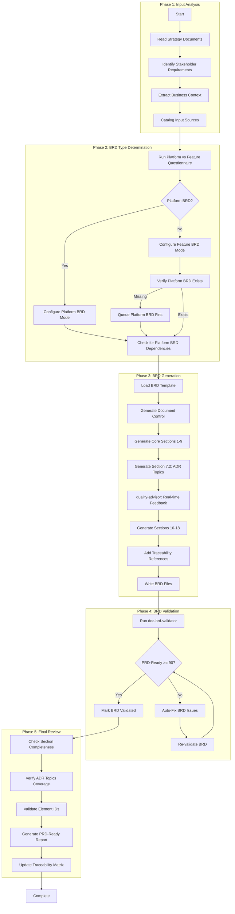
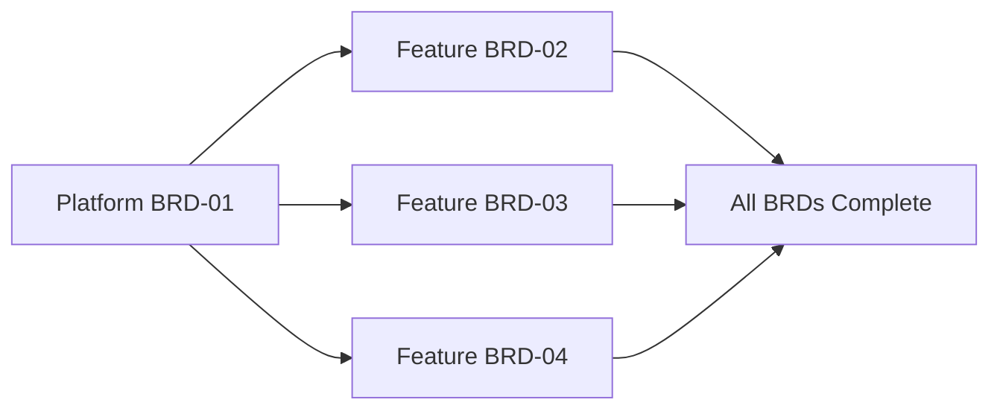

# doc-brd-autopilot

## Purpose

Automated **Business Requirements Document (BRD)** generation pipeline that processes strategy documents, stakeholder requirements, and business context to generate comprehensive BRDs with type determination, readiness validation, and parallel execution support.

**Layer**: 1 (Entry point - no upstream document dependencies)

**Downstream Artifacts**: PRD (Layer 2), EARS (Layer 3), BDD (Layer 4), ADR (Layer 5)

---

## Skill Dependencies

This autopilot orchestrates the following skills:

| Skill | Purpose | Phase |
|-------|---------|-------|
| `doc-naming` | Element ID format (BRD.NN.TT.SS), threshold tags, legacy pattern detection | All Phases |
| `doc-brd` | BRD creation rules, template, section structure, Platform vs Feature guidance | Phase 3: BRD Generation |
| `quality-advisor` | Real-time quality feedback during BRD generation | Phase 3: BRD Generation |
| `doc-brd-validator` | Validate BRD structure, content, PRD-Ready score | Phase 4: BRD Validation |

**Delegation Principle**: The autopilot orchestrates workflow but delegates:
- BRD structure/content rules → `doc-brd` skill
- Real-time quality feedback → `quality-advisor` skill
- BRD validation logic → `doc-brd-validator` skill
- Element ID standards → `doc-naming` skill

---

## When to Use This Skill

**Use `doc-brd-autopilot` when**:
- Starting a new project and need to create the initial BRD
- Converting business requirements or strategy documents to formal BRD format
- Creating multiple BRDs for a project (platform + feature BRDs)
- Automating BRD generation in CI/CD pipelines
- Ensuring consistent BRD quality across team members

**Do NOT use when**:
- Manually reviewing an existing BRD (use `doc-brd-validator`)
- Creating a simple single-section BRD (use `doc-brd` directly)
- Editing specific BRD sections (use `doc-brd` for guidance)

---

## Workflow Overview



---

## Detailed Workflow

### Phase 1: Input Analysis

Analyze available input sources to extract business requirements.

**Input Sources** (priority order):

| Priority | Source | Location | Content Type |
|----------|--------|----------|--------------|
| 1 | Strategy Documents | `{project_root}/strategy/` | Business goals, targets, algorithms |
| 2 | Stakeholder Requirements | User-provided or `docs/inputs/` | Business needs, constraints |
| 3 | Market Analysis | `docs/inputs/market/` | Competitive context, opportunities |
| 4 | Existing Documentation | `docs/` or `README.md` | Project context, scope |

**Analysis Process**:

```bash
# Check for strategy documents
ls -la {project_root}/strategy/

# Expected files:
# - README.md (performance targets, strategy goals)
# - strategy_overview.md (strategic framework)
# - core_algorithm.md (primary algorithm specs)
# - risk_management.md (risk policies)
# - selection_criteria/ (entry criteria)
```

**Output**: Input catalog with extracted requirements, objectives, and constraints.

### Phase 2: BRD Type Determination

Determine if creating a Platform BRD or Feature BRD.

> **Skill Delegation**: This phase follows rules defined in `doc-brd` skill.
> See: `.claude/skills/doc-brd/SKILL.md` Section "BRD Categorization: Platform vs Feature"

**Questionnaire** (automated):

| Question | Platform Indicator | Feature Indicator |
|----------|-------------------|-------------------|
| Defines infrastructure/technology stack? | Yes | No |
| Describes specific user-facing workflow? | No | Yes |
| Other BRDs will depend on this? | Yes | No |
| Establishes patterns/standards for multiple features? | Yes | No |
| Implements functionality on existing platform? | No | Yes |

**Auto-Detection Logic**:

```python
def determine_brd_type(title: str, content: str) -> str:
    platform_keywords = ["Platform", "Architecture", "Infrastructure", "Integration", "Foundation"]
    feature_keywords = ["B2C", "B2B", "Workflow", "User", "Feature", "Module"]

    if any(kw in title for kw in platform_keywords):
        return "PLATFORM"
    if any(kw in title for kw in feature_keywords):
        return "FEATURE"
    if references_platform_brd(content):
        return "FEATURE"
    return "PLATFORM"  # Default to Platform for new projects
```

**Feature BRD Dependency Check**:

```bash
# Verify Platform BRD exists before creating Feature BRD
ls docs/01_BRD/BRD-01_* 2>/dev/null || echo "ERROR: Platform BRD-01 required"
```

### Phase 3: BRD Generation

Generate the BRD document with real-time quality feedback.

> **Skill Delegation**: This phase follows rules defined in `doc-brd` skill.
> See: `.claude/skills/doc-brd/SKILL.md` for complete BRD creation guidance.
>
> **Quality Guidance**: Uses `quality-advisor` skill for real-time feedback during generation.
> See: `.claude/skills/quality-advisor/SKILL.md` for quality monitoring.

**Generation Process**:

1. **Reserve BRD ID**:
   ```bash
   # Check for next available ID
   ls docs/01_BRD/BRD-*.md docs/01_BRD/BRD-*/BRD-*.0_*.md 2>/dev/null | \
     grep -oP 'BRD-\K\d+' | sort -n | tail -1
   # Increment for new BRD
   ```

2. **Load BRD Template**:
   - Primary: `ai_dev_flow/01_BRD/BRD-MVP-TEMPLATE.md`
   - Comprehensive: `ai_dev_flow/01_BRD/BRD-TEMPLATE.md`

3. **Generate Document Control Section**:
   | Field | Value |
   |-------|-------|
   | Project Name | From input analysis |
   | Document Version | 0.1.0 |
   | Date Created | Current date (YYYY-MM-DD) |
   | Last Updated | Current date (YYYY-MM-DD) |
   | Document Owner | From stakeholder input |
   | Prepared By | AI Assistant |
   | Status | Draft |
   | PRD-Ready Score | Calculated after generation |

4. **Generate Core Sections (1-9)**:
   - Section 1: Executive Summary
   - Section 2: Business Context
   - Section 3: Stakeholder Analysis
   - Section 4: Business Requirements (using BRD.NN.01.SS format)
   - Section 5: Success Criteria
   - Section 6: Constraints and Assumptions
   - Section 7: Architecture Decision Requirements
   - Section 8: Risk Assessment
   - Section 9: Traceability

5. **Generate Section 7.2: Architecture Decision Requirements**:

   **7 Mandatory ADR Topic Categories** (per `doc-brd` skill):

   | # | Category | Element ID | Fields Required |
   |---|----------|------------|-----------------|
   | 1 | Infrastructure | BRD.NN.32.01 | Status, Business Driver, Constraints, Alternatives, Cloud Comparison |
   | 2 | Data Architecture | BRD.NN.32.02 | Status, Business Driver, Constraints, Alternatives, Cloud Comparison |
   | 3 | Integration | BRD.NN.32.03 | Status, Business Driver, Constraints, Alternatives, Cloud Comparison |
   | 4 | Security | BRD.NN.32.04 | Status, Business Driver, Constraints, Alternatives, Cloud Comparison |
   | 5 | Observability | BRD.NN.32.05 | Status, Business Driver, Constraints, Alternatives, Cloud Comparison |
   | 6 | AI/ML | BRD.NN.32.06 | Status, Business Driver, Constraints, Alternatives, Cloud Comparison |
   | 7 | Technology Selection | BRD.NN.32.07 | Status, Business Driver, Constraints, Alternatives, Cloud Comparison |

   **Status Values**: `Selected`, `Pending`, `N/A`

   **Required Tables** (for Status=Selected):
   - Alternatives Overview table (Option | Function | Est. Monthly Cost | Selection Rationale)
   - Cloud Provider Comparison table (Criterion | GCP | Azure | AWS)

6. **Real-Time Quality Feedback** (via `quality-advisor` skill):
   - Monitor section completion as content is generated
   - Detect anti-patterns (AP-001 to AP-017) during creation
   - Validate element ID format compliance (BRD.NN.TT.SS)
   - Check for placeholder text ([TBD], TODO, XXX)
   - Flag issues early to reduce post-generation rework

7. **Generate Sections 10-18**:
   - Section 10: Market Context
   - Section 11: Regulatory Compliance
   - Section 12: Integration Requirements
   - Section 13: Data Requirements
   - Section 14: Performance Requirements
   - Section 15: Security Requirements
   - Section 16: Operational Requirements
   - Section 17: Glossary
   - Section 18: Appendices

8. **Platform vs Feature Section Handling**:

   | BRD Type | Section 3.6 | Section 3.7 |
   |----------|-------------|-------------|
   | Platform | MUST populate with technology details | MUST populate with conditions |
   | Feature | "N/A - See Platform BRD-NN Section 3.6" | "N/A - See Platform BRD-NN Section 3.7" |

9. **Traceability References**:
   ```markdown
   ## 9. Traceability

   ### Upstream Sources
   | Source | Type | Reference |
   |--------|------|-----------|
   | strategy/README.md | Strategy Document | Performance targets |
   | strategy/core_algorithm.md | Strategy Document | Algorithm specifications |
   | [Stakeholder] | Business Input | Initial requirements |

   ### Downstream Artifacts
   | Artifact | Type | Status |
   |----------|------|--------|
   | PRD-NN | Product Requirements | Pending |
   | ADR-NN | Architecture Decisions | Pending |
   ```

10. **File Output**:
    - **Monolithic** (<25KB): `docs/01_BRD/BRD-NN_{slug}.md`
    - **Sectioned** (>=25KB): `docs/01_BRD/BRD-NN_{slug}/BRD-NN.S_{section}.md`

### Phase 4: BRD Validation

After BRD generation, validate structure and PRD-Ready score.

> **Skill Delegation**: This phase uses validation rules from `doc-brd-validator` skill.
> See: `.claude/skills/doc-brd-validator/SKILL.md` for complete validation rules.

**Validation Command**:

```bash
python ai_dev_flow/scripts/validate_brd.py docs/01_BRD/BRD-NN_{slug}.md --verbose
```

**Validation Checks**:

| Check | Requirement | Error Code |
|-------|-------------|------------|
| YAML Frontmatter | Valid metadata fields | BRD-E001 to BRD-E005 |
| Section Structure | 18 required sections | BRD-E006 to BRD-E008 |
| Document Control | All required fields | BRD-E009 |
| Business Objectives | BRD.NN.23.SS format | BRD-W001 |
| Business Requirements | BRD.NN.01.SS format | BRD-W002 |
| Section 7.2 ADR Topics | All 7 categories present | BRD-E013 to BRD-E018 |
| Element ID Format | BRD.NN.TT.SS (4-segment) | BRD-E019 to BRD-E021 |
| PRD-Ready Score | >= 90% | BRD-W004 |

**Auto-Fix Actions**:

| Issue | Auto-Fix Action |
|-------|-----------------|
| Invalid element ID format | Convert to BRD.NN.TT.SS format |
| Missing traceability section | Insert from template |
| Missing Document Control fields | Add placeholder fields |
| Deprecated ID patterns (BO-XXX, FR-XXX) | Convert to unified format |
| Missing PRD-Ready Score | Calculate and insert |

**Validation Loop**:

```
LOOP (max 3 iterations):
  1. Run doc-brd-validator
  2. IF errors found: Apply auto-fixes
  3. IF warnings found: Review and address if critical
  4. IF PRD-Ready Score < 90%: Enhance sections
  5. IF clean: Mark VALIDATED, proceed
  6. IF max iterations: Log issues, flag for manual review
```

### Phase 5: Final Review

Comprehensive final review before marking BRD complete.

**Review Checks**:

1. **Section Completeness**:
   - All 18 sections present and populated
   - No placeholder text remaining ([TBD], TODO, XXX)
   - Minimum content length per section

2. **ADR Topics Coverage**:
   - All 7 mandatory categories addressed
   - Selected topics have Alternatives Overview table
   - Selected topics have Cloud Provider Comparison table
   - N/A topics have explicit reasons

3. **Element ID Compliance** (per `doc-naming` skill):
   - All IDs use BRD.NN.TT.SS format
   - Element type codes valid for BRD (01, 02, 03, 04, 05, 06, 07, 08, 09, 10, 22, 23, 24, 32)
   - No legacy patterns (BO-XXX, FR-XXX, AC-XXX, BC-XXX)

4. **PRD-Ready Report**:
   ```
   PRD-Ready Score Breakdown
   =========================
   Business Objectives:    15/15 (BRD.NN.23.SS format)
   Requirements Complete:  20/20 (BRD.NN.01.SS format)
   Success Metrics:        10/10 (quantifiable)
   Constraints Defined:    10/10 (documented)
   Stakeholder Analysis:   10/10 (complete)
   Risk Assessment:        10/10 (identified)
   Traceability:           10/10 (sources cited)
   ADR Topics:             15/15 (all 7 categories)
   ----------------------------
   Total PRD-Ready Score:  100/100 (Target: >= 90)
   Status: READY FOR PRD GENERATION
   ```

5. **Traceability Matrix Update**:
   ```bash
   # Update BRD-00_TRACEABILITY_MATRIX.md
   python ai_dev_flow/scripts/update_traceability_matrix.py \
     --brd docs/01_BRD/BRD-NN_{slug}.md \
     --matrix docs/01_BRD/BRD-00_TRACEABILITY_MATRIX.md
   ```

---

## Execution Modes

### Single BRD Mode

Generate one BRD from input sources.

```bash
# Example: Generate Platform BRD
python ai_dev_flow/scripts/brd_autopilot.py \
  --strategy strategy/ \
  --type platform \
  --output docs/01_BRD/ \
  --id 01 \
  --slug platform_architecture
```

### Batch Mode

Generate multiple BRDs in sequence with dependency awareness.

```bash
# Example: Generate Platform BRD then Feature BRDs
python ai_dev_flow/scripts/brd_autopilot.py \
  --batch config/brd_batch.yaml \
  --output docs/01_BRD/
```

**Batch Configuration** (`config/brd_batch.yaml`):

```yaml
brds:
  - id: "01"
    slug: "platform_architecture"
    type: "platform"
    priority: 1
    sources:
      - strategy/README.md
      - strategy/core_algorithm.md

  - id: "02"
    slug: "user_authentication"
    type: "feature"
    priority: 2
    depends_on: ["01"]
    sources:
      - docs/inputs/auth_requirements.md

  - id: "03"
    slug: "data_analytics"
    type: "feature"
    priority: 2
    depends_on: ["01"]
    sources:
      - docs/inputs/analytics_requirements.md

execution:
  parallel: true
  max_workers: 2
  fail_fast: false
```

### Parallel Execution

Execute independent BRDs concurrently after Platform BRD.



**Dependency Rules**:
- Platform BRD (BRD-01) must complete first
- Feature BRDs can execute in parallel after Platform BRD
- Cross-dependent Feature BRDs execute sequentially

---

## Output Artifacts

### Generated Files

| File | Purpose | Location |
|------|---------|----------|
| BRD-NN_{slug}.md | Main BRD document (monolithic) | `docs/01_BRD/` |
| BRD-NN_{slug}/ | BRD folder (sectioned) | `docs/01_BRD/` |
| BRD-NN.0_index.md | Section index | `docs/01_BRD/BRD-NN_{slug}/` |
| BRD-NN.S_{section}.md | Section files | `docs/01_BRD/BRD-NN_{slug}/` |

### Validation Reports

| Report | Purpose | Location |
|--------|---------|----------|
| brd_validation_report.json | Validation results | `tmp/` |
| prd_ready_score.json | PRD-Ready breakdown | `tmp/` |
| autopilot_log.md | Execution log | `tmp/` |

---

## Error Handling

### Error Categories

| Category | Handling | Example |
|----------|----------|---------|
| Input Missing | Abort with message | No strategy documents found |
| Validation Failure | Auto-fix, retry | Missing required section |
| PRD-Ready Below 90% | Enhance sections, retry | Score at 85% |
| Platform BRD Missing | Queue Platform BRD first | Feature BRD without BRD-01 |
| Max Retries Exceeded | Flag for manual review | Persistent validation errors |

### Recovery Actions

```python
def handle_error(error_type: str, context: dict) -> Action:
    match error_type:
        case "INPUT_MISSING":
            return Action.ABORT_WITH_MESSAGE
        case "VALIDATION_FAILURE":
            if context["retry_count"] < 3:
                return Action.AUTO_FIX_RETRY
            return Action.FLAG_MANUAL_REVIEW
        case "PRD_READY_LOW":
            return Action.ENHANCE_SECTIONS
        case "PLATFORM_BRD_MISSING":
            return Action.QUEUE_PLATFORM_FIRST
        case _:
            return Action.FLAG_MANUAL_REVIEW
```

---

## Integration Points

### Pre-Execution Hooks

```bash
# Hook: pre_brd_generation
# Runs before BRD generation starts
./hooks/pre_brd_generation.sh

# Example: Validate input sources exist
if [ ! -d "strategy/" ]; then
  echo "ERROR: strategy/ directory required"
  exit 1
fi
```

### Post-Execution Hooks

```bash
# Hook: post_brd_generation
# Runs after BRD generation completes
./hooks/post_brd_generation.sh

# Example: Trigger PRD autopilot for validated BRD
if [ "$BRD_VALIDATED" = "true" ]; then
  python ai_dev_flow/scripts/prd_autopilot.py \
    --brd "$BRD_PATH" \
    --output docs/02_PRD/
fi
```

### CI/CD Integration

```yaml
# .github/workflows/brd_autopilot.yml
name: BRD Autopilot

on:
  push:
    paths:
      - 'strategy/**'
      - 'docs/inputs/**'

jobs:
  generate-brd:
    runs-on: ubuntu-latest
    steps:
      - uses: actions/checkout@v4

      - name: Run BRD Autopilot
        run: |
          python ai_dev_flow/scripts/brd_autopilot.py \
            --strategy strategy/ \
            --output docs/01_BRD/ \
            --validate

      - name: Upload Validation Report
        uses: actions/upload-artifact@v4
        with:
          name: brd-validation
          path: tmp/brd_validation_report.json
```

---

## Quality Gates

### Phase Gates

| Phase | Gate | Criteria |
|-------|------|----------|
| Phase 1 | Input Gate | At least one strategy document found |
| Phase 2 | Type Gate | BRD type determined (Platform/Feature) |
| Phase 3 | Generation Gate | All 18 sections generated |
| Phase 4 | Validation Gate | PRD-Ready Score >= 90% |
| Phase 5 | Review Gate | No blocking issues remaining |

### Blocking vs Non-Blocking

| Issue Type | Blocking | Action |
|------------|----------|--------|
| Missing required section | Yes | Must fix before proceeding |
| PRD-Ready Score < 90% | Yes | Must enhance sections |
| Invalid element ID format | Yes | Must convert to unified format |
| Missing optional section | No | Log warning, continue |
| Style/formatting issues | No | Auto-fix, continue |

---

## Related Resources

- **BRD Creation Skill**: `.claude/skills/doc-brd/SKILL.md`
- **BRD Validator Skill**: `.claude/skills/doc-brd-validator/SKILL.md`
- **Quality Advisor Skill**: `.claude/skills/quality-advisor/SKILL.md`
- **Naming Standards Skill**: `.claude/skills/doc-naming/SKILL.md`
- **BRD Template**: `ai_dev_flow/01_BRD/BRD-MVP-TEMPLATE.md`
- **BRD Creation Rules**: `ai_dev_flow/01_BRD/BRD_CREATION_RULES.md`
- **BRD Validation Rules**: `ai_dev_flow/01_BRD/BRD_VALIDATION_RULES.md`
- **Platform vs Feature Guide**: `ai_dev_flow/PLATFORM_VS_FEATURE_BRD.md`
- **PRD Autopilot Skill**: `.claude/skills/doc-prd-autopilot/SKILL.md`

---

## Version History

| Version | Date | Changes |
|---------|------|---------|
| 1.0 | 2026-02-08 | Initial skill creation with 5-phase workflow; Integrated doc-naming, doc-brd, doc-brd-validator, quality-advisor skills; Added Platform vs Feature BRD handling; Added Section 7.2 ADR Topics generation |
