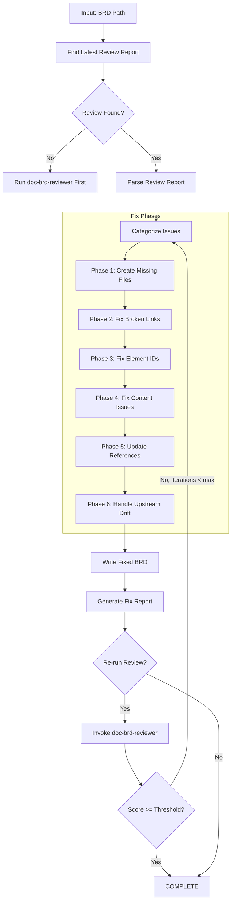
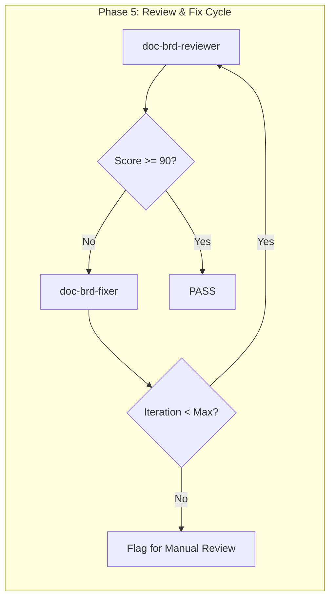

# doc-brd-fixer

## Purpose

Automated **fix skill** that reads the latest review report and applies fixes to BRD documents. This skill bridges the gap between `doc-brd-reviewer` (which identifies issues) and the corrected BRD, enabling iterative improvement cycles.

**Layer**: 1 (BRD Quality Improvement)

**Upstream**: BRD document, Review Report (`BRD-NN.R_review_report_vNNN.md`)

**Downstream**: Fixed BRD, Fix Report (`BRD-NN.F_fix_report_vNNN.md`)

---

## When to Use This Skill

Use `doc-brd-fixer` when:

- **After Review**: Run after `doc-brd-reviewer` identifies issues
- **Iterative Improvement**: Part of Review → Fix → Review cycle
- **Automated Pipeline**: CI/CD integration for quality gates
- **Batch Fixes**: Apply fixes to multiple BRDs based on review reports

**Do NOT use when**:
- No review report exists (run `doc-brd-reviewer` first)
- Creating new BRD (use `doc-brd` or `doc-brd-autopilot`)
- Only need validation (use `doc-brd-validator`)

---

## Skill Dependencies

| Skill | Purpose | When Used |
|-------|---------|-----------|
| `doc-brd-reviewer` | Source of issues to fix | Input (reads review report) |
| `doc-naming` | Element ID standards | Fix element IDs |
| `doc-brd` | BRD creation rules | Create missing sections |

---

## Workflow Overview



---

## Fix Phases

### Phase 1: Create Missing Files

Creates files that are referenced but don't exist.

**Scope**:

| Missing File | Action | Template Used |
|--------------|--------|---------------|
| `BRD-00_GLOSSARY.md` | Create master glossary | Glossary template |
| `GAP_*.md` | Create placeholder with TODO sections | GAP template |
| Reference docs (`*_REF_*.md`) | Create placeholder | REF template |

**Glossary Template**:

```markdown
---
title: "BRD-00: Master Glossary"
tags:
  - brd
  - glossary
  - reference
custom_fields:
  document_type: glossary
  artifact_type: BRD-REFERENCE
  layer: 1
---

# BRD-00: Master Glossary

Common terminology used across all Business Requirements Documents.

## Business Terms

| Term | Definition | Context |
|------|------------|---------|
| MVP | Minimum Viable Product | Scope definition |
| SLA | Service Level Agreement | Quality requirements |
| KPI | Key Performance Indicator | Success metrics |

## Technical Terms

| Term | Definition | Context |
|------|------------|---------|
| API | Application Programming Interface | Integration |
| JWT | JSON Web Token | Authentication |
| OIDC | OpenID Connect | Identity federation |

## Domain Terms

<!-- Add project-specific terminology below -->

| Term | Definition | Context |
|------|------------|---------|
| [Term] | [Definition] | [Where used] |
```

**GAP Analysis Placeholder Template**:

```markdown
---
title: "GAP Analysis: [Module Name]"
tags:
  - gap-analysis
  - reference
custom_fields:
  document_type: gap-analysis
  status: placeholder
  created_by: doc-brd-fixer
---

# GAP Analysis: [Module Name]

> **Status**: Placeholder - Requires completion

## 1. Current State

[TODO: Document current implementation state]

## 2. Identified Gaps

| Gap ID | Description | Priority | Status |
|--------|-------------|----------|--------|
| GAP-XX-01 | [Description] | P1/P2/P3 | Open |

## 3. Remediation Plan

[TODO: Document remediation approach]

---

*Created by doc-brd-fixer as placeholder. Complete this document to resolve broken link issues.*
```

---

### Phase 2: Fix Broken Links

Updates links to point to correct locations.

**Fix Actions**:

| Issue Code | Issue | Fix Action |
|------------|-------|------------|
| REV-L001 | Broken internal link | Update path or create target file |
| REV-L002 | External link unreachable | Add warning comment, keep link |
| REV-L003 | Absolute path used | Convert to relative path |

**Path Resolution Logic**:

```python
def fix_link_path(brd_location: str, target_path: str) -> str:
    """Calculate correct relative path based on BRD location."""

    # Monolithic BRD: docs/01_BRD/BRD-01.md
    # Sectioned BRD: docs/01_BRD/BRD-01_slug/BRD-01.3_section.md

    if is_sectioned_brd(brd_location):
        # Need to go up one more level
        return "../" + calculate_relative_path(brd_location, target_path)
    else:
        return calculate_relative_path(brd_location, target_path)
```

**Glossary Link Fix**:

| BRD Type | Original Link | Fixed Link |
|----------|---------------|------------|
| Monolithic | `BRD-00_GLOSSARY.md` | `BRD-00_GLOSSARY.md` |
| Sectioned | `BRD-00_GLOSSARY.md` | `../BRD-00_GLOSSARY.md` |

---

### Phase 3: Fix Element IDs

Converts invalid element IDs to correct format.

**Conversion Rules**:

| Pattern | Issue | Conversion |
|---------|-------|------------|
| `BRD.NN.25.SS` | Code 25 invalid for BRD | `BRD.NN.33.SS` (Benefit Statement) |
| `BO-XXX` | Legacy pattern | `BRD.NN.23.SS` |
| `FR-XXX` | Legacy pattern | `BRD.NN.01.SS` |
| `AC-XXX` | Legacy pattern | `BRD.NN.06.SS` |
| `BC-XXX` | Legacy pattern | `BRD.NN.03.SS` |

**Type Code Mapping** (BRD-specific):

| Invalid Code | Valid Code | Element Type |
|--------------|------------|--------------|
| 25 | 33 | Benefit Statement |
| 19 | 22 | Feature Item (deprecated 19) |
| 31 | 32 | Architecture Topic (deprecated 31) |

**Regex Patterns**:

```python
# Find element IDs with invalid type codes for BRD
invalid_brd_type_25 = r'BRD\.(\d{2})\.25\.(\d{2})'
replacement = r'BRD.\1.33.\2'

# Find legacy patterns
legacy_bo = r'###\s+BO-(\d+):'
legacy_fr = r'###\s+FR-(\d+):'
```

---

### Phase 4: Fix Content Issues

Addresses placeholders and incomplete content.

**Fix Actions**:

| Issue Code | Issue | Fix Action |
|------------|-------|------------|
| REV-P001 | `[TODO]` placeholder | Flag for manual completion (cannot auto-fix) |
| REV-P002 | `[TBD]` placeholder | Flag for manual completion (cannot auto-fix) |
| REV-P003 | Template date `YYYY-MM-DD` | Replace with current date |
| REV-P004 | Template name `[Name]` | Replace with metadata author or flag |
| REV-P005 | Empty section | Add minimum template content |

**Auto-Replacements**:

```python
replacements = {
    'YYYY-MM-DD': datetime.now().strftime('%Y-%m-%d'),
    'MM/DD/YYYY': datetime.now().strftime('%m/%d/%Y'),
    '[Current date]': datetime.now().strftime('%Y-%m-%d'),
}
```

---

### Phase 5: Update References

Ensures traceability and cross-references are correct.

**Fix Actions**:

| Issue | Fix Action |
|-------|------------|
| Missing `@ref:` for created files | Add reference tag |
| Incorrect cross-BRD path | Update to correct relative path |
| Missing traceability entry | Add to traceability matrix |

---

### Phase 6: Handle Upstream Drift

Addresses issues where upstream source documents have changed since BRD creation.

**Drift Issue Codes** (from `doc-brd-reviewer` Check #9):

| Code | Severity | Description | Auto-Fix Possible |
|------|----------|-------------|-------------------|
| REV-D001 | Warning | Upstream document modified after BRD | No (flag for review) |
| REV-D002 | Warning | Referenced section content changed | No (flag for review) |
| REV-D003 | Info | Upstream document version incremented | Yes (update @ref version) |
| REV-D004 | Info | New content added to upstream | No (flag for review) |
| REV-D005 | Error | Critical upstream modification (>20% change) | No (flag for review) |

**Fix Actions**:

| Issue | Auto-Fix | Action |
|-------|----------|--------|
| REV-D001/D002/D004/D005 | No | Add `[DRIFT]` marker to affected references, generate drift summary |
| REV-D003 (version change) | Yes | Update `@ref:` tag to include current version |

**Drift Marker Format**:

```markdown
<!-- DRIFT: F1_IAM_Technical_Specification.md modified 2026-02-08 (BRD created 2026-02-05) -->
@ref: [F1 Section 3](../../00_REF/foundation/F1_IAM_Technical_Specification.md#3-authentication)
```

**Drift Summary Block** (added to Fix Report):

```markdown
## Upstream Drift Summary

| Upstream Document | Reference | Modified | BRD Updated | Days Stale | Action Required |
|-------------------|-----------|----------|-------------|------------|-----------------|
| F1_IAM_Technical_Specification.md | BRD-01.1:L57 | 2026-02-08 | 2026-02-05 | 3 | Review for changes |
| GAP_Foundation_Module_Gap_Analysis.md | BRD-01.3:L319 | 2026-02-10 | 2026-02-05 | 5 | Review gap updates |

**Recommendation**: Review upstream documents and update BRD sections if requirements have changed.
Sections potentially affected:
- BRD-01.1 Section 3 (Authentication System)
- BRD-01.3 Section 13.1 (Upstream Dependencies)
```

**Drift Cache Update**:

After processing drift issues, update `.drift_cache.json`:

```json
{
  "brd_version": "1.0",
  "brd_updated": "2026-02-10",
  "drift_reviewed": "2026-02-10",
  "upstream_hashes": {
    "../../00_REF/foundation/F1_IAM_Technical_Specification.md#3": "a1b2c3d4...",
    "../../00_REF/foundation/GAP_Foundation_Module_Gap_Analysis.md": "e5f6g7h8..."
  },
  "acknowledged_drift": [
    {
      "document": "F1_IAM_Technical_Specification.md",
      "acknowledged_date": "2026-02-10",
      "reason": "Reviewed - no BRD impact"
    }
  ]
}
```

**Drift Acknowledgment Workflow**:

When drift is flagged but no BRD update is needed:

1. Run `/doc-brd-fixer BRD-01 --acknowledge-drift`
2. Fixer prompts: "Review drift for F1_IAM_Technical_Specification.md?"
3. User confirms no BRD changes needed
4. Fixer adds to `acknowledged_drift` array
5. Future reviews skip this drift until upstream changes again

---

## Command Usage

### Basic Usage

```bash
# Fix BRD based on latest review
/doc-brd-fixer BRD-01

# Fix with explicit review report
/doc-brd-fixer BRD-01 --review-report BRD-01.R_review_report_v001.md

# Fix and re-run review
/doc-brd-fixer BRD-01 --revalidate

# Fix with iteration limit
/doc-brd-fixer BRD-01 --revalidate --max-iterations 3
```

### Options

| Option | Default | Description |
|--------|---------|-------------|
| `--review-report` | latest | Specific review report to use |
| `--revalidate` | false | Run reviewer after fixes |
| `--max-iterations` | 3 | Max fix-review cycles |
| `--fix-types` | all | Specific fix types (comma-separated) |
| `--create-missing` | true | Create missing reference files |
| `--backup` | true | Backup BRD before fixing |
| `--dry-run` | false | Preview fixes without applying |
| `--acknowledge-drift` | false | Interactive drift acknowledgment mode |
| `--update-drift-cache` | true | Update .drift_cache.json after fixes |

### Fix Types

| Type | Description |
|------|-------------|
| `missing_files` | Create missing glossary, GAP, reference docs |
| `broken_links` | Fix link paths |
| `element_ids` | Convert invalid/legacy element IDs |
| `content` | Fix placeholders, dates, names |
| `references` | Update traceability and cross-references |
| `drift` | Handle upstream drift detection issues |
| `all` | All fix types (default) |

---

## Output Artifacts

### Fix Report

**File Naming**: `BRD-NN.F_fix_report_vNNN.md`

**Location**: Same folder as the BRD document.

**Structure**:

```markdown
---
title: "BRD-NN.F: Fix Report v001"
tags:
  - brd
  - fix-report
  - quality-assurance
custom_fields:
  document_type: fix-report
  artifact_type: BRD-FIX
  layer: 1
  parent_doc: BRD-NN
  source_review: BRD-NN.R_review_report_v001.md
  fix_date: "YYYY-MM-DD"
  fix_tool: doc-brd-fixer
  fix_version: "1.0"
---

# BRD-NN Fix Report v001

## Summary

| Metric | Value |
|--------|-------|
| Source Review | BRD-NN.R_review_report_v001.md |
| Issues in Review | 12 |
| Issues Fixed | 10 |
| Issues Remaining | 2 (manual review required) |
| Files Created | 2 |
| Files Modified | 4 |

## Files Created

| File | Type | Location |
|------|------|----------|
| BRD-00_GLOSSARY.md | Master Glossary | docs/01_BRD/ |
| GAP_Foundation_Module_Gap_Analysis.md | GAP Placeholder | docs/00_REF/foundation/ |

## Fixes Applied

| # | Issue Code | Issue | Fix Applied | File |
|---|------------|-------|-------------|------|
| 1 | REV-L001 | Broken glossary link | Created BRD-00_GLOSSARY.md | BRD-01.3_quality_ops.md |
| 2 | REV-L001 | Broken GAP link | Created placeholder GAP file | BRD-01.1_core.md |
| 3 | REV-N004 | Element type 25 invalid | Converted to type 33 | BRD-01.1_core.md |
| 4 | REV-L003 | Absolute path used | Converted to relative | BRD-01.2_requirements.md |

## Issues Requiring Manual Review

| # | Issue Code | Issue | Location | Reason |
|---|------------|-------|----------|--------|
| 1 | REV-P001 | [TODO] placeholder | BRD-01.2:L45 | Domain knowledge needed |
| 2 | REV-R001 | Missing acceptance criteria | BRD-01.2:L120 | Business input required |

## Validation After Fix

| Metric | Before | After | Delta |
|--------|--------|-------|-------|
| Review Score | 92 | 97 | +5 |
| Errors | 2 | 0 | -2 |
| Warnings | 4 | 1 | -3 |

## Next Steps

1. Complete GAP_Foundation_Module_Gap_Analysis.md placeholder
2. Address remaining [TODO] placeholders
3. Run `/doc-brd-reviewer BRD-01` to verify fixes
```

---

## Integration with Autopilot

This skill is invoked by `doc-brd-autopilot` in the Review → Fix cycle:



**Autopilot Integration Points**:

| Phase | Action | Skill |
|-------|--------|-------|
| Phase 5a | Run initial review | `doc-brd-reviewer` |
| Phase 5b | Apply fixes if issues found | `doc-brd-fixer` |
| Phase 5c | Re-run review | `doc-brd-reviewer` |
| Phase 5d | Repeat until pass or max iterations | Loop |

---

## Error Handling

### Recovery Actions

| Error | Action |
|-------|--------|
| Review report not found | Prompt to run `doc-brd-reviewer` first |
| Cannot create file (permissions) | Log error, continue with other fixes |
| Cannot parse review report | Abort with clear error message |
| Max iterations exceeded | Generate report, flag for manual review |

### Backup Strategy

Before applying any fixes:

1. Create backup in `tmp/backup/BRD-NN_YYYYMMDD_HHMMSS/`
2. Copy all BRD files to backup location
3. Apply fixes to original files
4. If error during fix, restore from backup

---

## Related Skills

| Skill | Relationship |
|-------|--------------|
| `doc-brd-reviewer` | Provides review report (input) |
| `doc-brd-autopilot` | Orchestrates Review → Fix cycle |
| `doc-brd-validator` | Structural validation |
| `doc-naming` | Element ID standards |
| `doc-brd` | BRD creation rules |

---

## Version History

| Version | Date | Changes |
|---------|------|---------|
| 1.1 | 2026-02-10 | Added Phase 6: Handle Upstream Drift - processes REV-D001-D005 issues from reviewer Check #9; drift marker insertion; drift cache management; acknowledgment workflow |
| 1.0 | 2026-02-10 | Initial skill creation; 5-phase fix workflow; Glossary and GAP file creation; Element ID conversion (type 25→33); Broken link fixes; Integration with autopilot Review→Fix cycle |
