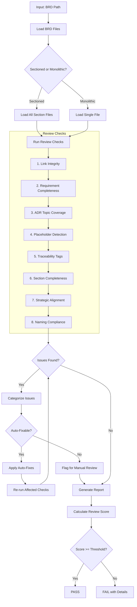
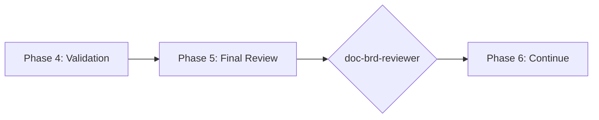

# doc-brd-reviewer

## Purpose

Comprehensive **content review and quality assurance** for Business Requirements Documents (BRD). This skill performs deep content analysis beyond structural validation, checking link integrity, requirement completeness, ADR topic coverage, strategic alignment, and identifying issues that require manual business review.

**Layer**: 1 (BRD Quality Assurance)

**Upstream**: Strategy documents, stakeholder requirements

**Downstream**: None (final QA gate before PRD generation)

---

## When to Use This Skill

Use `doc-brd-reviewer` when:

- **After BRD Generation**: Run immediately after `doc-brd-autopilot` completes
- **Manual BRD Edits**: After making manual changes to a BRD
- **Pre-PRD Check**: Before running `doc-prd-autopilot`
- **Periodic Review**: Regular quality checks on existing BRDs
- **CI/CD Integration**: Automated review gate in documentation pipelines

**Do NOT use when**:
- BRD does not exist yet (use `doc-brd` or `doc-brd-autopilot` first)
- Need structural/schema validation only (use `doc-brd-validator`)
- Generating new BRD content (use `doc-brd`)

---

## Skill vs Validator: Key Differences

| Aspect | `doc-brd-validator` | `doc-brd-reviewer` |
|--------|---------------------|-------------------|
| **Focus** | Schema compliance, PRD-Ready score | Content quality, strategic alignment |
| **Checks** | Required sections, field formats | Link integrity, ADR completeness, placeholders |
| **Auto-Fix** | Structural issues only | Content issues (links, dates, placeholders) |
| **Output** | PRD-Ready score (numeric) | Review score + issue list |
| **Phase** | Phase 4 (Validation) | Phase 5 (Final Review) |
| **Blocking** | PRD-Ready < threshold blocks | Review score < threshold flags |

---

## Review Workflow



---

## Review Checks

### 1. Link Integrity

Validates all internal document links resolve correctly.

**Scope**:
- Navigation links (`[Previous: ...]`, `[Next: ...]`)
- Section cross-references (`[See Section 7.2](...)`)
- Index to section links
- External documentation links (warns if unreachable)

**Error Codes**:

| Code | Severity | Description |
|------|----------|-------------|
| REV-L001 | Error | Broken internal link |
| REV-L002 | Warning | External link unreachable |
| REV-L003 | Info | Link path uses absolute instead of relative |

---

### 2. Requirement Completeness

Validates all business requirements have complete specifications.

**Scope**:
- Each requirement has acceptance criteria
- Success metrics defined
- Scope boundaries clear (in/out)
- Priority assignments present
- Dependencies documented

**Error Codes**:

| Code | Severity | Description |
|------|----------|-------------|
| REV-R001 | Error | Requirement missing acceptance criteria |
| REV-R002 | Error | No success metrics defined |
| REV-R003 | Warning | Scope boundaries unclear |
| REV-R004 | Warning | Missing priority assignment |
| REV-R005 | Info | Dependency not documented |

---

### 3. ADR Topic Coverage

Validates Section 7.2 ADR Topics have complete coverage.

**Scope**:
- All 7 mandatory categories present (Infrastructure, Data Architecture, Integration, Security, Observability, AI/ML, Technology Selection)
- Each topic has Status, Alternatives Overview, Decision Drivers
- Selected topics have Cloud Provider Comparison table
- Deferred topics have justification

**Error Codes**:

| Code | Severity | Description |
|------|----------|-------------|
| REV-ADR001 | Error | Mandatory ADR category missing |
| REV-ADR002 | Error | Topic missing Alternatives Overview |
| REV-ADR003 | Error | Selected topic missing comparison table |
| REV-ADR004 | Warning | Topic missing Decision Drivers |
| REV-ADR005 | Info | Deferred topic needs justification |

---

### 4. Placeholder Detection

Identifies incomplete content requiring replacement.

**Scope**:
- `[TODO]`, `[TBD]`, `[PLACEHOLDER]` text
- Template dates: `YYYY-MM-DD`, `MM/DD/YYYY`
- Template names: `[Name]`, `[Author]`, `[Reviewer]`
- Empty sections: `<!-- Content here -->`
- Lorem ipsum or sample text

**Auto-Fix**:
- Replace `YYYY-MM-DD` with current date
- Replace `[Name]` with document author from metadata
- Remove empty comment placeholders
- Flag `[TODO]`/`[TBD]` for manual completion

**Error Codes**:

| Code | Severity | Description |
|------|----------|-------------|
| REV-P001 | Error | [TODO] placeholder found |
| REV-P002 | Error | [TBD] placeholder found |
| REV-P003 | Warning | Template date not replaced |
| REV-P004 | Warning | Template name not replaced |
| REV-P005 | Warning | Empty section content |

---

### 5. Traceability Tags

Validates `@strategy:` and cross-reference tags.

**Scope**:
- `@strategy: DOC-XX` tags reference valid source documents
- Element IDs properly formatted
- Cross-references consistent

**Error Codes**:

| Code | Severity | Description |
|------|----------|-------------|
| REV-TR001 | Error | Invalid strategy reference |
| REV-TR002 | Warning | Missing element ID |
| REV-TR003 | Info | Inconsistent cross-reference format |
| REV-TR004 | Warning | Tag format malformed |

---

### 6. Section Completeness

Verifies all required sections have substantive content.

**Scope**:
- Minimum word count per section (configurable)
- Section headers present
- Tables have data rows (not just headers)
- Mermaid diagrams render properly

**Minimum Word Counts** (configurable):

| Section | Minimum Words |
|---------|---------------|
| Executive Summary | 100 |
| Problem Statement | 75 |
| Business Objectives | 150 |
| Functional Requirements | 200 |
| Non-Functional Requirements | 150 |
| ADR Topics | 300 |
| Appendices | 100 |

**Error Codes**:

| Code | Severity | Description |
|------|----------|-------------|
| REV-S001 | Error | Required section missing entirely |
| REV-S002 | Warning | Section below minimum word count |
| REV-S003 | Warning | Table has no data rows |
| REV-S004 | Error | Mermaid diagram syntax error |

---

### 7. Strategic Alignment

Validates BRD aligns with business strategy and objectives.

**Scope**:
- Business objectives trace to strategic goals
- Success metrics align with KPIs
- Scope matches project charter
- Stakeholder concerns addressed

**Error Codes**:

| Code | Severity | Description |
|------|----------|-------------|
| REV-SA001 | Warning | Business objective not traced to strategy |
| REV-SA002 | Info | Success metric may not align with KPI |
| REV-SA003 | Warning | Scope may exceed project charter |
| REV-SA004 | Flag | Requires stakeholder review |

---

### 8. Naming Compliance

Validates element IDs follow `doc-naming` standards.

**Scope**:
- Element IDs use `BRD.NN.TT.SS` format
- Element type codes valid for BRD (01, 02, 03, 04, 05, 06, 07, 08, 09, 10, 22, 23, 24, 32)
- No legacy patterns (BO-NNN, FR-NNN, etc.)

**Auto-Fix**:
- Convert legacy patterns to unified format
- Suggest correct element type codes

**Error Codes**:

| Code | Severity | Description |
|------|----------|-------------|
| REV-N001 | Error | Invalid element ID format |
| REV-N002 | Error | Element type code not valid for BRD |
| REV-N003 | Error | Legacy pattern detected |
| REV-N004 | Warning | Inconsistent ID sequencing |

---

## Review Score Calculation

**Scoring Formula**:

| Category | Weight | Calculation |
|----------|--------|-------------|
| Link Integrity | 10% | (valid_links / total_links) × 10 |
| Requirement Completeness | 20% | (complete_reqs / total_reqs) × 20 |
| ADR Topic Coverage | 20% | (covered_topics / required_topics) × 20 |
| Placeholder Detection | 10% | (no_placeholders ? 10 : 10 - (count × 2)) |
| Traceability Tags | 10% | (valid_tags / total_tags) × 10 |
| Section Completeness | 15% | (complete_sections / total_sections) × 15 |
| Strategic Alignment | 5% | (aligned_objectives / total_objectives) × 5 |
| Naming Compliance | 10% | (valid_ids / total_ids) × 10 |

**Total**: Sum of all categories (max 100)

**Thresholds**:
- **PASS**: ≥ 90 (configurable)
- **WARNING**: 80-89
- **FAIL**: < 80

---

## Command Usage

### Basic Usage

```bash
# Review specific BRD
/doc-brd-reviewer BRD-01

# Review BRD by path
/doc-brd-reviewer docs/01_BRD/BRD-01_platform/

# Review all BRDs
/doc-brd-reviewer all
```

### Options

| Option | Default | Description |
|--------|---------|-------------|
| `--min-score` | 90 | Minimum passing review score |
| `--auto-fix` | true | Apply automatic fixes |
| `--no-auto-fix` | false | Disable auto-fix (report only) |
| `--check` | all | Specific checks to run (comma-separated) |
| `--skip` | none | Checks to skip (comma-separated) |
| `--verbose` | false | Detailed output per check |
| `--report` | true | Generate markdown report |

---

## Output Report

Review reports are stored alongside the reviewed document per project standards.

**File Naming**: `BRD-NN.R_review_report_vNNN.md`

**Location**: Same folder as the reviewed BRD document.

### Versioning Rules

1. **First Review**: Creates `BRD-NN.R_review_report_v001.md`
2. **Subsequent Reviews**: Auto-increments version (v002, v003, etc.)
3. **Same-Day Reviews**: Each review gets unique version number

**Version Detection Algorithm**:

```
1. Scan folder for pattern: BRD-NN.R_review_report_v*.md
2. Extract highest version number (N)
3. Create new file with version (N + 1)
```

**Example**:

```
docs/01_BRD/BRD-03_f3_observability/
├── BRD-03.R_review_report_v001.md    # First review
├── BRD-03.R_review_report_v002.md    # After fixes
└── BRD-03.R_review_report_v003.md    # Final review
```

### Delta Reporting

When previous reviews exist, include score comparison:

```markdown
## Score Comparison

| Metric | Previous (v002) | Current (v003) | Delta |
|--------|-----------------|----------------|-------|
| Overall Score | 85 | 94 | +9 |
| Errors | 3 | 0 | -3 |
| Warnings | 5 | 2 | -3 |
```

See `REVIEW_DOCUMENT_STANDARDS.md` for complete requirements.

---

## Integration with doc-brd-autopilot

This skill is invoked during Phase 5 of `doc-brd-autopilot`:



---

## Related Skills

| Skill | Relationship |
|-------|--------------|
| `doc-naming` | Naming standards for Check #8 |
| `doc-brd-autopilot` | Invokes this skill in Phase 5 |
| `doc-brd-validator` | Structural validation (Phase 4) |
| `doc-brd` | BRD creation rules |
| `doc-prd-autopilot` | Downstream consumer |

---

## Version History

| Version | Date | Changes |
|---------|------|---------|
| 1.1 | 2026-02-10 | Added review versioning support (_vNNN pattern); Delta reporting for score comparison |
| 1.0 | 2026-02-10 | Initial skill creation with 8 review checks; ADR topic coverage validation; Strategic alignment check |
