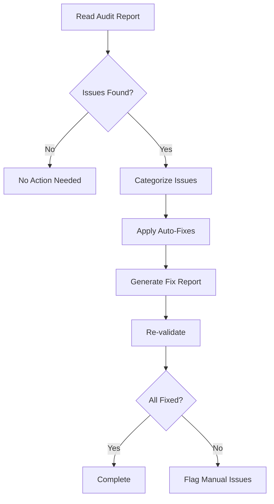

# doc-cspec-fixer

## Purpose

Automated **fix skill** that reads the latest review report and applies fixes to CSPEC (Code Specification) documents. This skill bridges the gap between `doc-cspec-reviewer` (which identifies issues) and the corrected CSPEC, enabling iterative improvement cycles.

**Layer**: 9.50 (CSPEC Quality Improvement)

**Upstream**: REQ, CTR, CSPEC, Review Report (`CSPEC-NN.A_audit_report_vNNN.md`)

**Downstream**: Fixed CSPEC, Fix Report (`CSPEC-NN.F_fix_report_vNNN.md`)

---

## When to Use

Use `doc-cspec-fixer` when:
- **After Review**: Run after `doc-cspec-reviewer` identifies issues
- **Iterative Improvement**: Part of Review → Fix → Review cycle
- **CTR Alignment**: Fix CTR compliance issues
- **YAML Structure Issues**: CSPEC contains malformed YAML blocks

**Do NOT use when**:
- No review report exists (run `doc-cspec-reviewer` first)
- Issues require manual architectural decisions
- CTR contract itself needs modification

---

## Fixable Issue Types

### Automatic Fixes

| Issue Type | Fix Action |
|------------|------------|
| Missing `document_type` | Add `document_type: cspec-document` |
| Missing `subtype_code` | Add `subtype_code: 50` |
| Broken internal links | Update to correct paths |
| Missing traceability tags | Add required cumulative tags |
| YAML syntax errors | Fix formatting issues |
| Incomplete metadata | Add required fields |

### Semi-Automatic Fixes (Require Confirmation)

| Issue Type | Fix Action |
|------------|------------|
| Missing interface definitions | Generate skeleton from CTR |
| Incomplete test mapping | Generate test case placeholders |
| Missing algorithm details | Add TODO markers |

### Manual Review Required

| Issue Type | Action |
|------------|--------|
| Architectural changes | Flag for human review |
| CTR contract mismatches | Escalate to CTR owner |
| Business logic errors | Requires domain expertise |

---

## Execution Flow



---

## Fix Report Format

```markdown
# CSPEC-NN Fix Report

## Summary
- **Document**: CSPEC-NN_{slug}
- **Fix Date**: YYYY-MM-DD
- **Source Report**: CSPEC-NN.A_audit_report_v001.md
- **Issues Fixed**: N
- **Issues Remaining**: N

## Fixes Applied

### Fix 1: [Issue Title]
- **Type**: [Auto/Semi-Auto]
- **Location**: [section/path]
- **Before**: [old value]
- **After**: [new value]

## Remaining Issues

### Issue 1: [Issue Title]
- **Reason**: Requires manual review
- **Recommendation**: [action needed]

## Validation
- **Post-Fix CODE-Ready Score**: NN%
- **Status**: PASS/FAIL
```

---

## Output Files

| File | Purpose |
|------|---------|
| Updated CSPEC YAML | Fixed document |
| `CSPEC-NN.F_fix_report_vNNN.md` | Fix report documenting changes |

---

## Integration

### With Reviewer
```
doc-cspec-reviewer → CSPEC-NN.A_audit_report.md → doc-cspec-fixer → Fixed CSPEC
```

### Iterative Loop
```
CSPEC → reviewer → audit_report → fixer → fixed_CSPEC → reviewer → ...
```

Maximum iterations: 3 (to prevent infinite loops)

---

## References

- Template: `ai_dev_ssd_flow/09_SPEC/CSPEC/CSPEC-MVP-TEMPLATE.yaml`
- Schema: `ai_dev_ssd_flow/09_SPEC/CSPEC/CSPEC_MVP_SCHEMA.yaml`
- Validation Rules: `ai_dev_ssd_flow/09_SPEC/CSPEC/CSPEC_MVP_SCHEMA.yaml`
