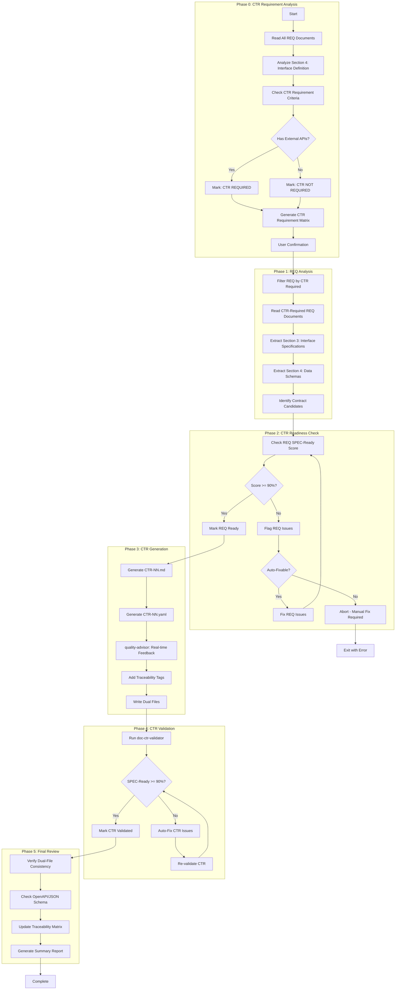

# doc-ctr-autopilot

## Purpose

Automated **Data Contracts (CTR)** generation pipeline that first analyzes which modules require CTR documents, then processes REQ documents to generate dual-file contracts (markdown + YAML) with SPEC-Ready scoring.

**Layer**: 8 (Optional layer for API/data contracts)

**Upstream**: REQ (Layer 7) - Section 3 Interface Specifications, Section 4 Data Schemas

**Downstream**: SPEC (Layer 9), TSPEC (Layer 10), TASKS (Layer 11)

---

## Skill Dependencies

| Skill | Purpose | Phase |
|-------|---------|-------|
| `doc-naming` | Element ID format (CTR.NN.TT.SS, codes 16, 17, 20) | All Phases |
| `doc-req-validator` | Validate REQ SPEC-Ready score | Phase 2 |
| `doc-ctr` | CTR creation rules, dual-file format | Phase 3 |
| `quality-advisor` | Real-time quality feedback | Phase 3 |
| `doc-ctr-validator` | Validation with SPEC-Ready scoring | Phase 4 |

---

## Workflow Overview



---

## Detailed Workflow

### Phase 0: CTR Requirement Analysis (MANDATORY FIRST STEP)

Determine which REQ documents require CTR (Data Contracts) generation.

**IMPORTANT**: Not all modules need CTR documents. CTR is only required for modules with external-facing APIs or contracts.

#### CTR Requirement Criteria

| Criterion | Detection Method | CTR Required? |
|-----------|------------------|---------------|
| **REST API Endpoints** | Section 4 contains `Endpoint:` or HTTP methods with `/api/` paths | ✅ YES |
| **SSE/Streaming APIs** | Section 4 contains SSE, streaming, or `/chat` endpoints | ✅ YES |
| **Webhook Contracts** | Section 4 contains webhook configurations or `/webhooks/` | ✅ YES |
| **A2A Gateway** | Section 4 contains `/a2a/` or agent-to-agent protocols | ✅ YES |
| **External Integration** | Section 4 references external service contracts | ✅ YES |
| **Internal Protocol Only** | Section 3.4 has Python Protocol, no HTTP endpoints | ❌ NO |
| **Infrastructure Only** | No client-facing APIs, internal infrastructure | ❌ NO |
| **Prometheus /metrics** | Only `/metrics` endpoint (standard Prometheus format) | ❌ NO |
| **Frontend Consumer** | Consumes APIs but doesn't define backend APIs | ❌ NO |
| **Internal Middleware** | Security/validation middleware, no external API | ❌ NO |

#### CTR Requirement Keywords (Detection Patterns)

**POSITIVE Indicators** (CTR Required):
```regex
# REST API patterns
Endpoint:\s*(POST|GET|PUT|DELETE|PATCH)
(POST|GET|PUT|DELETE|PATCH)\s+/api/
/api/v[0-9]+/

# Streaming patterns
SSE|Server-Sent Events
/chat|/stream
EventSource|text/event-stream

# Webhook patterns
/webhooks/
webhook.*configuration
webhook.*endpoint

# Contract patterns
OpenAPI|openapi:
Request:|Response:
Response \(Success\):|Response \(Error\):
```

**NEGATIVE Indicators** (CTR NOT Required):
```regex
# Internal only
internal only|internal interface|internal use
consumed by|consumer of

# Standard endpoints (no contract needed)
/metrics|/health|/ready|/live

# Infrastructure
infrastructure platform|internal platform
repository pattern|storage layer

# Middleware
middleware|security layer|validation layer
```

#### Phase 0 Execution Steps

1. **Read All REQ Documents**
   ```bash
   # Read docs/07_REQ/REQ-*.md files
   ```

2. **For Each REQ Document, Check**:
   - Does Section 4 (Interface Definition) contain HTTP endpoints?
   - Does Section 4.1 (API Contract) define request/response formats?
   - Are there external-facing API surfaces?

3. **Generate CTR Requirement Matrix**:

```markdown
## CTR Requirement Analysis Matrix

| REQ ID | Module | Has External API? | Key Indicators | CTR Required? |
|--------|--------|-------------------|----------------|---------------|
| REQ-01 | F1 IAM | ✅ | `POST /api/v1/auth/login`, `POST /api/v1/auth/refresh` | ✅ YES |
| REQ-02 | F2 Session | ✅ | `POST /api/v1/sessions`, session management endpoints | ✅ YES |
| REQ-03 | F3 Observability | ❌ | Only `/metrics` (Prometheus standard) | ❌ NO |
| REQ-04 | F4 SecOps | ❌ | Internal security operations, audit APIs internal | ❌ NO |
| REQ-05 | F5 SelfOps | ❌ | Internal automation, health checks internal | ❌ NO |
| REQ-06 | F6 Infrastructure | ❌ | Internal infrastructure platform | ❌ NO |
| REQ-07 | F7 Config | ❌ | Internal configuration management | ❌ NO |
| REQ-08 | D1 Agent Orch | ✅ | AG-UI SSE `/api/v1/chat`, streaming protocol | ✅ YES |
| REQ-09 | D2 Cost Analytics | ✅ | `/api/v1/costs/*` query endpoints | ✅ YES |
| REQ-10 | D3 User Experience | ❌ | Frontend - consumes APIs, no backend | ❌ NO |
| REQ-11 | D4 Multi-Cloud | ❌ | Internal cloud integration layer | ❌ NO |
| REQ-12 | D5 Data Persistence | ❌ | Internal storage, repository pattern | ❌ NO |
| REQ-13 | D6 REST APIs | ✅ | Primary API gateway, all external endpoints | ✅ YES |
| REQ-14 | D7 Security | ❌ | Internal security middleware | ❌ NO |
```

4. **Present Summary and Request Confirmation**:

```markdown
## Phase 0 Complete: CTR Requirement Analysis

### Modules Requiring CTR (External APIs)

| CTR ID | Source REQ | Module | Key API Surfaces |
|--------|------------|--------|------------------|
| CTR-01 | REQ-01 | F1 IAM | Authentication, token refresh, session APIs |
| CTR-02 | REQ-02 | F2 Session | Session CRUD, context management |
| CTR-08 | REQ-08 | D1 Agent Orch | AG-UI SSE streaming, chat endpoints |
| CTR-09 | REQ-09 | D2 Cost Analytics | Cost query, breakdown, forecast endpoints |
| CTR-13 | REQ-13 | D6 REST APIs | Full API gateway (aggregates all endpoints) |

### Modules NOT Requiring CTR (Internal Only)

| REQ ID | Module | Reason |
|--------|--------|--------|
| REQ-03 | F3 Observability | Prometheus /metrics only (standard format) |
| REQ-04 | F4 SecOps | Internal security operations |
| REQ-05 | F5 SelfOps | Internal automation |
| REQ-06 | F6 Infrastructure | Internal platform |
| REQ-07 | F7 Config | Internal configuration |
| REQ-10 | D3 User Experience | Frontend consumer |
| REQ-11 | D4 Multi-Cloud | Internal integration |
| REQ-12 | D5 Data Persistence | Internal storage |
| REQ-14 | D7 Security | Internal middleware |

### Summary
- **CTR Required**: 5 modules
- **CTR Not Required**: 9 modules
- **Total CTR Documents to Generate**: 5 (dual-file: 10 files total)

Proceed with CTR generation for 5 modules? [Y/n]
```

---

### Phase 1: REQ Analysis

Extract interface and data schema information from **CTR-required** REQ documents only.

**REQ Sections to Extract**:

| REQ Section | Content | CTR Element |
|-------------|---------|-------------|
| Section 3.4: Interface Protocol | Python Protocol interfaces | Reference only |
| Section 4.1: API Contract | HTTP endpoints, request/response | CTR.NN.16.SS (Interface) |
| Section 4.2: Data Schema | Pydantic models, JSON Schema | CTR.NN.17.SS (Data Model) |
| Section 5: Error Handling | Error responses, RFC 7807 | CTR.NN.20.SS (Contract Clause) |

---

### Phase 2: CTR Readiness Check

Validate that source REQ documents meet quality thresholds.

**Validation Criteria**:
- REQ SPEC-Ready Score ≥ 90%
- REQ CTR-Ready Score ≥ 90%
- Section 4 (Interface Definition) complete
- Error catalog defined in Section 5

---

### Phase 3: CTR Generation

Generate dual-file contracts for each CTR-required module.

**Dual-File Structure**:

```
docs/08_CTR/
├── CTR-01_f1_iam_api.md        # Documentation file
├── CTR-01_f1_iam_api.yaml      # OpenAPI specification
├── CTR-02_f2_session_api.md
├── CTR-02_f2_session_api.yaml
├── CTR-08_d1_agent_api.md
├── CTR-08_d1_agent_api.yaml
├── CTR-09_d2_cost_api.md
├── CTR-09_d2_cost_api.yaml
├── CTR-13_d6_gateway_api.md
└── CTR-13_d6_gateway_api.yaml
```

**Markdown File Structure** (CTR-NN_{slug}.md):
- Document Control
- Contract Overview
- Business Context
- Interface Documentation
- Usage Examples
- Error Handling
- Traceability

**YAML File Structure** (CTR-NN_{slug}.yaml):
```yaml
openapi: "3.0.3"
info:
  title: "Contract Title"
  version: "1.0.0"
  description: "Contract description"
  contact:
    name: "API Team"
servers:
  - url: "https://api.example.com/v1"
paths:
  /api/v1/resource:
    get:
      operationId: getResource
      summary: "Get resource"
      security:
        - bearerAuth: []
      responses:
        '200':
          description: Success
          content:
            application/json:
              schema:
                $ref: '#/components/schemas/ResourceModel'
        '401':
          $ref: '#/components/responses/Unauthorized'
components:
  securitySchemes:
    bearerAuth:
      type: http
      scheme: bearer
      bearerFormat: JWT
  schemas:
    ResourceModel:
      type: object
      properties: {}
  responses:
    Unauthorized:
      description: Authentication required
      content:
        application/problem+json:
          schema:
            $ref: '#/components/schemas/ProblemDetails'
```

### Cumulative Tags (7 Required)

```markdown
@brd: BRD-NN
@prd: PRD-NN
@ears: EARS-NN
@bdd: BDD-NN
@adr: ADR-NN
@sys: SYS-NN
@req: REQ-NN
```

---

### Phase 4: CTR Validation

Run `doc-ctr-validator` on each generated CTR document.

**Validation Criteria**:
- SPEC-Ready Score ≥ 90%
- OpenAPI schema valid
- All endpoints documented
- Error responses complete
- Security schemes defined

---

### Phase 5: Final Review

Complete the CTR generation process.

**Final Checks**:
- Dual-file consistency (md ↔ yaml)
- OpenAPI schema validation
- Update CTR index
- Generate summary report

---

## Element Type Codes

| Code | Element Type | Example |
|------|--------------|---------|
| 16 | Interface | CTR.01.16.01 |
| 17 | Data Model | CTR.01.17.01 |
| 20 | Contract Clause | CTR.01.20.01 |

---

## Configuration

### Default Configuration

```yaml
ctr_autopilot:
  version: "2.0"

  phase0:
    enabled: true  # Always analyze CTR requirements first
    user_confirmation: true  # Pause for user approval

  scoring:
    spec_ready_min: 90
    ctr_ready_min: 90
    strict_mode: false

  execution:
    max_parallel: 3        # HARD LIMIT - do not exceed
    chunk_size: 3          # Documents per chunk
    pause_between_chunks: true
    auto_fix: true
    continue_on_error: false
    timeout_per_req: 180  # seconds

  output:
    dual_file: true  # md + yaml
    report_format: markdown

  validation:
    skip_validation: false
    fix_iterations_max: 3
```

---

## Context Management

### Chunked Parallel Execution (MANDATORY)

**CRITICAL**: To prevent conversation context overflow errors ("Prompt is too long", "Conversation too long"), all autopilot operations MUST follow chunked execution rules:

**Chunk Size Limit**: Maximum 3 documents per chunk

**Chunking Rules**:

1. **Chunk Formation**: Group CTR-required modules into chunks of maximum 3 at a time
2. **Sequential Chunk Processing**: Process one chunk at a time, completing all documents in a chunk before starting the next
3. **Context Pause**: After completing each chunk, provide a summary and pause for user acknowledgment
4. **Progress Tracking**: Display chunk progress (e.g., "Chunk 2/2: Processing CTR-08, CTR-09, CTR-13...")

**Why Chunking is Required**:

- Prevents "Conversation too long" errors during batch processing
- Allows context compaction between chunks
- Enables recovery from failures without losing all progress
- Provides natural checkpoints for user review

**Chunk Completion Template**:

```markdown
## Chunk N/M Complete

Generated:
- CTR-XX: SPEC-Ready Score 94% (md + yaml)
- CTR-YY: SPEC-Ready Score 92% (md + yaml)
- CTR-ZZ: SPEC-Ready Score 95% (md + yaml)

Proceeding to next chunk...
```

---

## Command Usage

### Analyze CTR Requirements Only
```bash
/doc-ctr-autopilot --analyze
```
Runs Phase 0 only, outputs CTR Requirement Matrix without generating files.

### Generate CTR for Specific Modules
```bash
/doc-ctr-autopilot REQ-01 REQ-13
```
Generates CTR for specified REQ documents (skips Phase 0 analysis for these).

### Generate All Required CTR
```bash
/doc-ctr-autopilot --all
```
Runs full workflow: Phase 0 analysis → user confirmation → generate all CTR-required modules.

### Skip Phase 0 (Force Generate)
```bash
/doc-ctr-autopilot --all --skip-analysis
```
Skip Phase 0 and generate CTR for ALL REQ documents (not recommended).

---

## Related Resources

- **CTR Skill**: `.claude/skills/doc-ctr/SKILL.md`
- **CTR Validator**: `.claude/skills/doc-ctr-validator/SKILL.md`
- **Naming Standards**: `.claude/skills/doc-naming/SKILL.md`
- **Quality Advisor**: `.claude/skills/quality-advisor/SKILL.md`
- **CTR Template**: `ai_dev_flow/08_CTR/CTR-TEMPLATE.md`

---

## Version History

| Version | Date | Changes |
|---------|------|---------|
| 2.0 | 2026-02-09 | Added Phase 0: CTR Requirement Analysis; Added detection criteria for external APIs; Added user confirmation step; Renumbered phases; Added command options |
| 1.0 | 2026-02-08 | Initial skill creation with 5-phase workflow; Integrated doc-naming, doc-ctr, quality-advisor, doc-ctr-validator |
