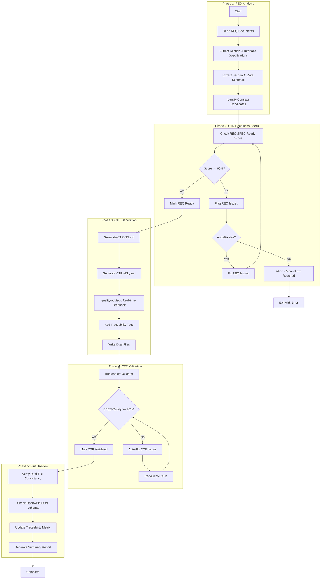

# doc-ctr-autopilot

## Purpose

Automated **Data Contracts (CTR)** generation pipeline that processes REQ documents and generates dual-file contracts (markdown + YAML) with SPEC-Ready scoring.

**Layer**: 8 (Optional layer for API/data contracts)

**Upstream**: REQ (Layer 7) - Section 3 Interface Specifications, Section 4 Data Schemas

**Downstream**: SPEC (Layer 9), TSPEC (Layer 10), TASKS (Layer 11)

---

## Skill Dependencies

| Skill | Purpose | Phase |
|-------|---------|-------|
| `doc-naming` | Element ID format (CTR.NN.TT.SS, codes 16, 17, 20) | All Phases |
| `doc-req-validator` | Validate REQ SPEC-Ready score | Phase 2 |
| `doc-ctr` | CTR creation rules, dual-file format | Phase 3 |
| `quality-advisor` | Real-time quality feedback | Phase 3 |
| `doc-ctr-validator` | Validation with SPEC-Ready scoring | Phase 4 |

---

## Workflow Overview



---

## Detailed Workflow

### Phase 1: REQ Analysis

Extract interface and data schema information from REQ documents.

**REQ Sections to Extract**:

| REQ Section | Content | CTR Element |
|-------------|---------|-------------|
| Section 3: Interface Specifications | API endpoints, protocols | CTR.NN.16.SS (Interface) |
| Section 4: Data Schemas | JSON Schema, Pydantic models | CTR.NN.17.SS (Data Model) |
| Section 5: Error Handling | Error responses | CTR.NN.20.SS (Contract Clause) |

### Phase 3: CTR Generation

Generate dual-file contracts.

**Dual-File Structure**:

```
docs/08_CTR/
├── CTR-01_user_api.md      # Documentation file
├── CTR-01_user_api.yaml    # OpenAPI/JSON Schema
├── CTR-02_order_api.md
└── CTR-02_order_api.yaml
```

**Markdown File Structure** (CTR-NN_{slug}.md):
- Document Control
- Contract Overview
- Business Context
- Interface Documentation
- Usage Examples
- Error Handling
- Traceability

**YAML File Structure** (CTR-NN_{slug}.yaml):
```yaml
openapi: "3.0.3"
info:
  title: "Contract Title"
  version: "1.0.0"
paths:
  /api/v1/resource:
    get:
      operationId: getResource
      responses:
        '200':
          description: Success
components:
  schemas:
    ResourceModel:
      type: object
      properties: {}
```

### Cumulative Tags (7 Required)

```markdown
@brd: BRD.NN.TT.SS
@prd: PRD.NN.TT.SS
@ears: EARS.NN.TT.SS
@bdd: BDD.NN.TT.SS
@adr: ADR-NN
@sys: SYS.NN.TT.SS
@req: REQ.NN.TT.SS
```

---

## Element Type Codes

| Code | Element Type | Example |
|------|--------------|---------|
| 16 | Interface | CTR.01.16.01 |
| 17 | Data Model | CTR.01.17.01 |
| 20 | Contract Clause | CTR.01.20.01 |

---

## Configuration

### Default Configuration

```yaml
ctr_autopilot:
  version: "1.0"

  scoring:
    spec_ready_min: 90
    strict_mode: false

  execution:
    max_parallel: 3        # HARD LIMIT - do not exceed
    chunk_size: 3          # Documents per chunk
    pause_between_chunks: true
    auto_fix: true
    continue_on_error: false
    timeout_per_req: 180  # seconds

  output:
    dual_file: true  # md + yaml
    report_format: markdown

  validation:
    skip_validation: false
    fix_iterations_max: 3
```

---

## Context Management

### Chunked Parallel Execution (MANDATORY)

**CRITICAL**: To prevent conversation context overflow errors ("Prompt is too long", "Conversation too long"), all autopilot operations MUST follow chunked execution rules:

**Chunk Size Limit**: Maximum 3 documents per chunk

**Chunking Rules**:

1. **Chunk Formation**: Group REQ-derived CTR contracts into chunks of maximum 3 at a time
2. **Sequential Chunk Processing**: Process one chunk at a time, completing all documents in a chunk before starting the next
3. **Context Pause**: After completing each chunk, provide a summary and pause for user acknowledgment
4. **Progress Tracking**: Display chunk progress (e.g., "Chunk 2/3: Processing CTR-04, CTR-05, CTR-06...")

**Why Chunking is Required**:

- Prevents "Conversation too long" errors during batch processing
- Allows context compaction between chunks
- Enables recovery from failures without losing all progress
- Provides natural checkpoints for user review

**Chunk Completion Template**:

```markdown
## Chunk N/M Complete

Generated:
- CTR-XX: SPEC-Ready Score 94% (md + yaml)
- CTR-YY: SPEC-Ready Score 92% (md + yaml)
- CTR-ZZ: SPEC-Ready Score 95% (md + yaml)

Proceeding to next chunk...
```

---

## Related Resources

- **CTR Skill**: `.claude/skills/doc-ctr/SKILL.md`
- **CTR Validator**: `.claude/skills/doc-ctr-validator/SKILL.md`
- **Naming Standards**: `.claude/skills/doc-naming/SKILL.md`
- **Quality Advisor**: `.claude/skills/quality-advisor/SKILL.md`
- **CTR Template**: `ai_dev_flow/08_CTR/CTR-TEMPLATE.md`

---

## Version History

| Version | Date | Changes |
|---------|------|---------|
| 1.0 | 2026-02-08 | Initial skill creation with 5-phase workflow; Integrated doc-naming, doc-ctr, quality-advisor, doc-ctr-validator |
