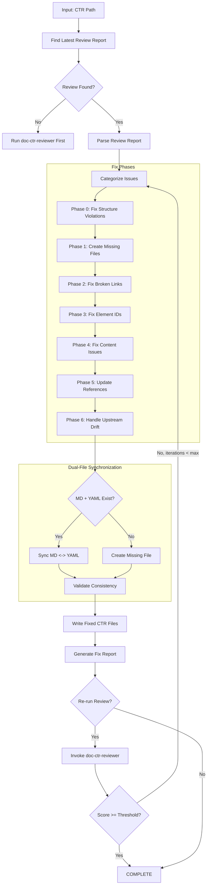
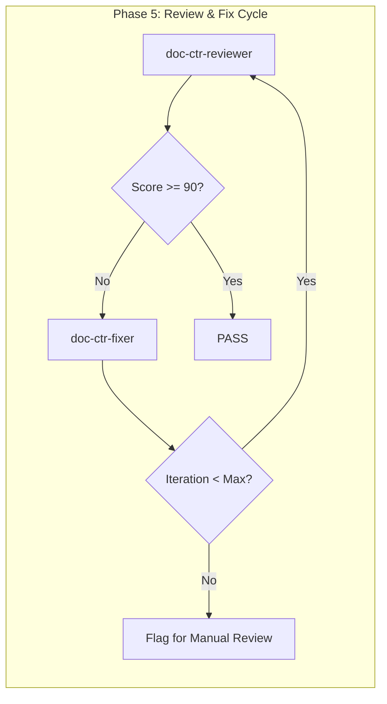

# doc-ctr-fixer

## Purpose

Automated **fix skill** that reads the latest review report and applies fixes to CTR (Contract) documents. This skill bridges the gap between `doc-ctr-reviewer` (which identifies issues) and the corrected CTR, enabling iterative improvement cycles.

**Layer**: 8 (CTR Quality Improvement)

**Upstream**: REQ documents, CTR document, Review Report (`CTR-NN-SSS.R_review_report_vNNN.md`)

**Downstream**: Fixed CTR (MD + YAML), Fix Report (`CTR-NN-SSS.F_fix_report_vNNN.md`)

---

## When to Use This Skill

Use `doc-ctr-fixer` when:

- **After Review**: Run after `doc-ctr-reviewer` identifies issues
- **Iterative Improvement**: Part of Review -> Fix -> Review cycle
- **Automated Pipeline**: CI/CD integration for quality gates
- **Batch Fixes**: Apply fixes to multiple CTRs based on review reports
- **Dual-File Sync Issues**: MD and YAML content has diverged

**Do NOT use when**:
- No review report exists (run `doc-ctr-reviewer` first)
- Creating new CTR (use `doc-ctr` or `doc-ctr-autopilot`)
- Only need validation (use `doc-ctr-validator`)

---

## Skill Dependencies

| Skill | Purpose | When Used |
|-------|---------|-----------|
| `doc-ctr-reviewer` | Source of issues to fix | Input (reads review report) |
| `doc-naming` | Element ID standards | Fix element IDs |
| `doc-ctr` | CTR creation rules | Create missing sections |
| `doc-req` | REQ traceability | Validate upstream links |

---

## Workflow Overview



---

## Fix Phases

### Phase 0: Fix Structure Violations (CRITICAL)

Fixes CTR documents that are not in nested folders. This phase runs FIRST because all subsequent phases depend on correct folder structure.

**Nested Folder Rule**: ALL CTR documents MUST be in nested folders regardless of document size.

**Required Structure**:
| CTR Type | Required Location |
|----------|-------------------|
| Dual-File | `docs/08_CTR/CTR-NN_{slug}/CTR-NN_{slug}.md` + `CTR-NN_{slug}.yaml` |

**Fix Actions**:

| Issue Code | Issue | Fix Action |
|------------|-------|------------|
| REV-STR001 | CTR not in nested folder | Create folder, move both files, update all links |
| REV-STR002 | CTR folder name doesn't match CTR ID | Rename folder to match |
| REV-STR003 | CTR >25KB should be sectioned | Flag for manual review |

**Structure Fix Workflow**:

```python
def fix_ctr_structure(ctr_path: str) -> list[Fix]:
    """Fix CTR structure violations."""
    fixes = []

    filename = os.path.basename(ctr_path)
    parent_folder = os.path.dirname(ctr_path)

    # Extract CTR ID and slug from filename
    match = re.match(r'CTR-(\d+)_([^/]+)\.(md|yaml)', filename)
    if not match:
        return []  # Cannot auto-fix invalid filename

    ctr_id = match.group(1)
    slug = match.group(2)
    expected_folder = f"CTR-{ctr_id}_{slug}"

    # Check if already in nested folder
    if os.path.basename(parent_folder) != expected_folder:
        # Create nested folder
        new_folder = os.path.join(os.path.dirname(parent_folder), expected_folder)
        os.makedirs(new_folder, exist_ok=True)

        # Move both .md and .yaml files
        base_name = f"CTR-{ctr_id}_{slug}"
        for ext in ['.md', '.yaml']:
            old_file = os.path.join(parent_folder, base_name + ext)
            if os.path.exists(old_file):
                new_file = os.path.join(new_folder, base_name + ext)
                shutil.move(old_file, new_file)
                fixes.append(f"Moved {old_file} to {new_file}")

        # Update upstream links in moved .md file
        md_path = os.path.join(new_folder, base_name + '.md')
        if os.path.exists(md_path):
            content = Path(md_path).read_text()
            updated_content = content.replace('../07_REQ/', '../../07_REQ/')
            updated_content = updated_content.replace('../06_SYS/', '../../06_SYS/')
            Path(md_path).write_text(updated_content)
            fixes.append(f"Updated relative links for nested folder structure")

    return fixes
```

**Link Path Updates After Move**:

| Original Path | Updated Path |
|---------------|--------------|
| `../07_REQ/REQ-01_slug/REQ-01.md` | `../../07_REQ/REQ-01_slug/REQ-01.md` |

---

### Phase 1: Create Missing Files

Creates files that are referenced but don't exist.

**Scope**:

| Missing File | Action | Template Used |
|--------------|--------|---------------|
| `CTR-NN-SSS.yaml` | Create YAML contract from MD | YAML contract template |
| `CTR-NN-SSS.md` | Create MD documentation from YAML | MD contract template |
| Schema files (`*_schema.json`) | Create placeholder schema | JSON Schema template |
| Reference docs | Create placeholder | REF template |

**YAML Contract Template**:

```yaml
# CTR-NN-SSS: [Contract Name]
# Auto-generated by doc-ctr-fixer - requires completion

contract:
  id: CTR-NN-SSS
  name: "[Contract Name]"
  version: "1.0.0"
  status: draft
  created: "YYYY-MM-DD"

metadata:
  layer: 8
  artifact_type: CTR
  upstream_req: REQ-NN

interface:
  type: "[API|EVENT|DATA|SERVICE]"
  protocol: "[HTTP|gRPC|AMQP|Kafka]"

endpoints: []
  # TODO: Define endpoints

schemas: []
  # TODO: Define schemas

validation:
  # TODO: Define validation rules
```

**MD Contract Template**:

```markdown
---
title: "CTR-NN-SSS: [Contract Name]"
tags:
  - ctr
  - contract
  - layer-8
custom_fields:
  document_type: contract
  artifact_type: CTR
  layer: 8
  upstream_req: REQ-NN
  yaml_companion: CTR-NN-SSS.yaml
---

# CTR-NN-SSS: [Contract Name]

> **Status**: Placeholder - Requires completion

## 1. Contract Overview

[TODO: Document contract purpose and scope]

## 2. Interface Definition

[TODO: Define interface specifications]

## 3. Data Schemas

[TODO: Document data schemas]

## 4. Validation Rules

[TODO: Define validation rules]

---

*Created by doc-ctr-fixer as placeholder. Complete this document to resolve issues.*
```

---

### Phase 2: Fix Broken Links

Updates links to point to correct locations.

**Fix Actions**:

| Issue Code | Issue | Fix Action |
|------------|-------|------------|
| REV-L001 | Broken internal link | Update path or create target file |
| REV-L002 | External link unreachable | Add warning comment, keep link |
| REV-L003 | Absolute path used | Convert to relative path |
| REV-L004 | YAML reference broken | Update YAML $ref path |
| REV-L005 | Schema reference invalid | Fix JSON Schema $ref |

**Path Resolution Logic**:

```python
def fix_link_path(ctr_location: str, target_path: str) -> str:
    """Calculate correct relative path based on CTR location."""

    # CTR files: docs/08_CTR/CTR-01-API.md + CTR-01-API.yaml
    # Schema files: docs/08_CTR/schemas/

    if is_yaml_reference(target_path):
        return fix_yaml_ref(ctr_location, target_path)
    elif is_schema_reference(target_path):
        return fix_schema_ref(ctr_location, target_path)
    else:
        return calculate_relative_path(ctr_location, target_path)
```

**YAML Reference Fix**:

| Reference Type | Original | Fixed |
|----------------|----------|-------|
| Schema ref | `$ref: schema.json` | `$ref: ./schemas/schema.json` |
| Component ref | `$ref: #/components/` | Validate path exists |
| External ref | `$ref: http://...` | Add warning if unreachable |

---

### Phase 3: Fix Element IDs

Converts invalid element IDs to correct format.

**Conversion Rules**:

| Pattern | Issue | Conversion |
|---------|-------|------------|
| `CTR.NN.XX.SS` | Invalid type code | Convert to valid CTR code |
| `API-XXX` | Legacy pattern | `CTR.NN.28.SS` |
| `EVT-XXX` | Legacy pattern | `CTR.NN.29.SS` |
| `SCHEMA-XXX` | Legacy pattern | `CTR.NN.28.SS` |

**Type Code Mapping** (CTR-specific):

| Invalid Code | Valid Code | Element Type |
|--------------|------------|--------------|
| 01 | 28 | Contract Interface |
| 02 | 29 | Contract Event |
| Any other | 28/29 | Map to interface or event |

**Valid CTR Type Codes**:

| Code | Element Type | Description |
|------|--------------|-------------|
| 28 | Contract Interface | API endpoints, service interfaces |
| 29 | Contract Event | Event definitions, message contracts |

**Regex Patterns**:

```python
# Find element IDs with invalid type codes for CTR
invalid_ctr_type = r'CTR\.(\d{2})\.(?!28|29)(\d{2})\.(\d{2})'

# Find legacy patterns
legacy_api = r'###\s+API-(\d+):'
legacy_evt = r'###\s+EVT-(\d+):'
legacy_schema = r'###\s+SCHEMA-(\d+):'
```

---

### Phase 4: Fix Content Issues

Addresses placeholders and incomplete content.

**Fix Actions**:

| Issue Code | Issue | Fix Action |
|------------|-------|------------|
| REV-P001 | `[TODO]` placeholder | Flag for manual completion (cannot auto-fix) |
| REV-P002 | `[TBD]` placeholder | Flag for manual completion (cannot auto-fix) |
| REV-P003 | Template date `YYYY-MM-DD` | Replace with current date |
| REV-P004 | Template name `[Name]` | Replace with metadata author or flag |
| REV-P005 | Empty section | Add minimum template content |
| REV-Y001 | Invalid YAML syntax | Attempt YAML repair |
| REV-Y002 | Missing required YAML field | Add field with placeholder |

**Auto-Replacements**:

```python
replacements = {
    'YYYY-MM-DDTHH:MM:SS': datetime.now().strftime('%Y-%m-%dT%H:%M:%S'),
    'YYYY-MM-DD': datetime.now().strftime('%Y-%m-%d'),
    'MM/DD/YYYY': datetime.now().strftime('%m/%d/%Y'),
    '[Current date]': datetime.now().strftime('%Y-%m-%dT%H:%M:%S'),
    '"1.0.0"': f'"{calculate_version()}"',
}
```

**YAML Repair Actions**:

| YAML Issue | Repair Action |
|------------|---------------|
| Missing quotes | Add quotes around string values |
| Invalid indentation | Fix to 2-space indent |
| Duplicate keys | Keep first, comment duplicates |
| Missing colons | Add colons after keys |

---

### Phase 5: Update References

Ensures traceability and cross-references are correct.

**Fix Actions**:

| Issue | Fix Action |
|-------|------------|
| Missing `@req:` reference | Add REQ traceability tag |
| Incorrect REQ path | Update to correct relative path |
| Missing traceability entry | Add to traceability matrix |
| Orphan YAML companion | Link MD and YAML files |

**REQ Traceability Fix**:

```markdown
<!-- Before -->
## 3. Interface Endpoints

<!-- After -->
## 3. Interface Endpoints

@req: [REQ-01.28.01](../07_REQ/REQ-01.md#req-01-28-01)
```

---

### Phase 6: Handle Upstream Drift (Auto-Merge)

Addresses issues where upstream REQ documents have changed since CTR creation using a tiered auto-merge system.

**Upstream**: REQ (Layer 7)
**Downstream**: SPEC (Layer 9)

#### Contract ID Pattern

**Format**: `CTR-NN-TYPE-SS`

| Component | Description | Examples |
|-----------|-------------|----------|
| `CTR` | Artifact prefix | CTR |
| `NN` | Document number (01-99) | 01, 02, 15 |
| `TYPE` | Contract type | API, DATA, EVENT, SERVICE |
| `SS` | Sequence within type (01-99) | 01, 02, 13 |

**Auto-Generated ID Examples**:
- `CTR-01-API-01` - First API contract in document 01
- `CTR-01-API-13` - 13th API contract in document 01
- `CTR-02-DATA-05` - 5th data contract in document 02
- `CTR-03-EVENT-02` - 2nd event contract in document 03

#### Tiered Auto-Merge System

Change percentage is calculated by comparing upstream REQ content hash at CTR creation vs current:

```python
def calculate_drift_percentage(ctr_path: str, req_path: str) -> float:
    """Calculate percentage of upstream REQ changes affecting CTR."""
    drift_cache = load_drift_cache(ctr_path)
    original_hash = drift_cache.get('req_content_hash')
    current_hash = compute_content_hash(req_path)

    if original_hash == current_hash:
        return 0.0

    # Line-by-line diff comparison
    original_lines = drift_cache.get('req_snapshot_lines', [])
    current_lines = read_file_lines(req_path)

    changed_lines = len(set(original_lines) ^ set(current_lines))
    total_lines = max(len(original_lines), len(current_lines))

    return (changed_lines / total_lines) * 100
```

| Tier | Change % | Action | Version Impact |
|------|----------|--------|----------------|
| **Tier 1** | < 5% | Auto-merge contract updates | Patch increment (1.0.0 → 1.0.1) |
| **Tier 2** | 5-15% | Auto-merge with detailed changelog | Minor increment (1.0.0 → 1.1.0) |
| **Tier 3** | > 15% | Archive current, trigger regeneration | Major increment (1.0.0 → 2.0.0) |

#### Tier 1: Minor Drift (< 5%)

Auto-merge with minimal disruption:

**Actions**:
1. Update `@req:` references to current REQ version
2. Sync metadata fields from REQ
3. Increment contract patch version
4. Update drift cache

**Example Update**:

```yaml
# Before (CTR-01-API-05.yaml)
contract:
  id: CTR-01-API-05
  version: "1.0.0"
  req_version: "1.0.0"

# After auto-merge
contract:
  id: CTR-01-API-05
  version: "1.0.1"
  req_version: "1.0.1"
  last_merge: "2026-02-10T16:00:00"
```

#### Tier 2: Moderate Drift (5-15%)

Auto-merge with detailed changelog:

**Actions**:
1. All Tier 1 actions
2. Generate detailed changelog entry
3. Add `[MERGED]` markers to affected sections
4. Increment contract minor version
5. Update companion MD file with changelog

**Changelog Format**:

```markdown
## Changelog

### v1.1.0 (2026-02-10) - Auto-Merged

**Upstream Changes** (REQ-01.md v1.0.0 → v1.1.0):
- Modified: REQ-01.28.03 - Updated validation rules
- Added: REQ-01.28.07 - New authentication requirement
- Drift: 8.5%

**Contract Updates**:
- [MERGED] Section 3.2: Updated schema validation
- [MERGED] Section 4.1: Added auth contract reference
```

#### Tier 3: Significant Drift (> 15%)

Archive and regenerate:

**Actions**:
1. Create archive manifest
2. Move current CTR to archive
3. Trigger CTR regeneration via `doc-ctr-autopilot`
4. Increment major version
5. Link archive in new CTR

**Archive Manifest** (`CTR-NN-TYPE_archive_manifest.yaml`):

```yaml
# CTR Archive Manifest
archive:
  original_id: CTR-01-API-05
  archived_version: "1.1.0"
  archive_date: "2026-02-10T16:00:00"
  archive_reason: "upstream_drift_exceeded_15%"
  drift_percentage: 23.5

upstream_trigger:
  document: REQ-01.md
  original_version: "1.0.0"
  current_version: "2.0.0"

archived_files:
  - path: "archive/CTR-01-API-05_v1.1.0.md"
    hash: "sha256:abc123..."
  - path: "archive/CTR-01-API-05_v1.1.0.yaml"
    hash: "sha256:def456..."

regeneration:
  new_id: CTR-01-API-05
  new_version: "2.0.0"
  trigger_skill: doc-ctr-autopilot
  regenerated: "2026-02-10T16:05:00"
```

#### No Deletion Policy

Contracts are NEVER deleted. When a contract becomes obsolete:

**Deprecation Marker**:

```yaml
# CTR-01-API-03.yaml
contract:
  id: CTR-01-API-03
  status: "[DEPRECATED]"
  deprecated_date: "2026-02-10"
  deprecated_reason: "Superseded by CTR-01-API-15"
  successor: CTR-01-API-15
```

**MD Deprecation Header**:

```markdown
---
status: deprecated
deprecated_date: "2026-02-10"
successor: CTR-01-API-15
---

# CTR-01-API-03: Legacy User Authentication Contract

> **[DEPRECATED]** This contract has been superseded by [CTR-01-API-15](./CTR-01-API-15.md).
> Retained for historical reference and backward compatibility documentation.
```

#### Enhanced Drift Cache

The drift cache tracks merge history for audit purposes:

**File**: `.drift_cache.json` (per CTR directory)

```json
{
  "CTR-01-API-05": {
    "current_version": "1.1.0",
    "req_content_hash": "sha256:abc123...",
    "req_snapshot_lines": ["line1", "line2", "..."],
    "last_checked": "2026-02-10T16:00:00",
    "last_modified": "2026-02-10T15:30:00",
    "merge_history": [
      {
        "date": "2026-02-08T14:00:00",
        "tier": 1,
        "drift_percentage": 3.2,
        "version_before": "1.0.0",
        "version_after": "1.0.1",
        "req_version": "1.0.1"
      },
      {
        "date": "2026-02-10T16:00:00",
        "tier": 2,
        "drift_percentage": 8.5,
        "version_before": "1.0.1",
        "version_after": "1.1.0",
        "req_version": "1.1.0",
        "changelog_entries": 3
      }
    ],
    "archive_history": []
  }
}
```

#### File Type Handling

Both `.md` and `.yaml` contract files are processed:

| File Type | Merge Actions |
|-----------|---------------|
| `.md` | Update frontmatter, @req references, changelog section |
| `.yaml` | Update contract metadata, version, timestamps |
| Both | Sync version numbers, maintain dual-file consistency |

**Sync Order**:
1. Process YAML first (authoritative for contract data)
2. Sync changes to MD companion
3. Update drift cache
4. Generate fix report entry

#### Drift Issue Codes

| Code | Severity | Tier | Description | Action |
|------|----------|------|-------------|--------|
| REV-D001 | Info | 1 | Minor REQ modification (< 5%) | Auto-merge, patch version |
| REV-D002 | Warning | 2 | Moderate REQ modification (5-15%) | Auto-merge with changelog, minor version |
| REV-D003 | Error | 3 | Major REQ modification (> 15%) | Archive and regenerate, major version |
| REV-D004 | Info | 1-2 | New requirements added | Add contract stubs |
| REV-D005 | Warning | N/A | Deprecated contract referenced | Update reference to successor |

---

## Dual-File Synchronization

CTR documents consist of paired MD + YAML files that must remain synchronized.

### Sync Detection

| Sync Issue | Detection | Resolution |
|------------|-----------|------------|
| MD exists, YAML missing | Check for companion file | Generate YAML from MD |
| YAML exists, MD missing | Check for companion file | Generate MD from YAML |
| Content mismatch | Compare key fields | Reconcile differences |
| Version mismatch | Compare version fields | Update to latest |

### Sync Actions

**MD to YAML Sync**:

| MD Section | YAML Field |
|------------|------------|
| Title | `contract.name` |
| Version | `contract.version` |
| Interface endpoints | `endpoints[]` |
| Data schemas | `schemas[]` |
| Validation rules | `validation` |

**YAML to MD Sync**:

| YAML Field | MD Section |
|------------|------------|
| `contract.name` | Title |
| `endpoints[]` | Interface Endpoints section |
| `schemas[]` | Data Schemas section |
| `validation` | Validation Rules section |

### Conflict Resolution

| Conflict Type | Resolution Strategy |
|---------------|---------------------|
| Both modified same field | Flag for manual review |
| YAML has newer data | Update MD from YAML |
| MD has newer data | Update YAML from MD |
| Structural difference | Keep MD structure, sync data |

---

## Command Usage

### Basic Usage

```bash
# Fix CTR based on latest review
/doc-ctr-fixer CTR-01-API

# Fix with explicit review report
/doc-ctr-fixer CTR-01-API --review-report CTR-01-API.R_review_report_v001.md

# Fix and re-run review
/doc-ctr-fixer CTR-01-API --revalidate

# Fix with iteration limit
/doc-ctr-fixer CTR-01-API --revalidate --max-iterations 3

# Sync dual files only
/doc-ctr-fixer CTR-01-API --sync-only
```

### Options

| Option | Default | Description |
|--------|---------|-------------|
| `--review-report` | latest | Specific review report to use |
| `--revalidate` | false | Run reviewer after fixes |
| `--max-iterations` | 3 | Max fix-review cycles |
| `--fix-types` | all | Specific fix types (comma-separated) |
| `--create-missing` | true | Create missing reference files |
| `--backup` | true | Backup CTR before fixing |
| `--dry-run` | false | Preview fixes without applying |
| `--sync-only` | false | Only sync MD/YAML, skip other fixes |
| `--acknowledge-drift` | false | Interactive drift acknowledgment mode |
| `--update-drift-cache` | true | Update .drift_cache.json after fixes |

### Fix Types

| Type | Description |
|------|-------------|
| `missing_files` | Create missing YAML, MD, schema docs |
| `broken_links` | Fix link paths and YAML refs |
| `element_ids` | Convert invalid/legacy element IDs |
| `content` | Fix placeholders, dates, YAML syntax |
| `references` | Update REQ traceability and cross-references |
| `drift` | Handle upstream drift detection issues |
| `sync` | Synchronize MD and YAML companion files |
| `all` | All fix types (default) |

---

## Output Artifacts

### Fix Report

**Nested Folder Rule**: ALL CTR use nested folders (`CTR-NN_{slug}/`) regardless of size. Fix reports are stored alongside the CTR dual files (.md + .yaml) in the nested folder.

**File Naming**: `CTR-NN-SSS.F_fix_report_vNNN.md`

**Location**: Inside the CTR nested folder: `docs/08_CTR/CTR-NN_{slug}/`

**Structure**:

```markdown
---
title: "CTR-NN-SSS.F: Fix Report v001"
tags:
  - ctr
  - fix-report
  - quality-assurance
custom_fields:
  document_type: fix-report
  artifact_type: CTR-FIX
  layer: 8
  parent_doc: CTR-NN-SSS
  source_review: CTR-NN-SSS.R_review_report_v001.md
  fix_date: "YYYY-MM-DDTHH:MM:SS"
  fix_tool: doc-ctr-fixer
  fix_version: "1.0"
---

# CTR-NN-SSS Fix Report v001

## Summary

| Metric | Value |
|--------|-------|
| Source Review | CTR-NN-SSS.R_review_report_v001.md |
| Issues in Review | 15 |
| Issues Fixed | 12 |
| Issues Remaining | 3 (manual review required) |
| Files Created | 1 |
| Files Modified | 2 |
| Dual-File Sync | Completed |

## Files Created

| File | Type | Location |
|------|------|----------|
| CTR-01-API.yaml | YAML Contract | docs/08_CTR/ |

## Dual-File Sync Status

| MD File | YAML File | Sync Status | Action |
|---------|-----------|-------------|--------|
| CTR-01-API.md | CTR-01-API.yaml | Synchronized | Generated YAML from MD |

## Fixes Applied

| # | Issue Code | Issue | Fix Applied | File |
|---|------------|-------|-------------|------|
| 1 | REV-L004 | Broken YAML ref | Updated schema path | CTR-01-API.yaml |
| 2 | REV-N004 | Invalid element type | Converted to type 28 | CTR-01-API.md |
| 3 | REV-Y001 | Invalid YAML syntax | Fixed indentation | CTR-01-API.yaml |

## Issues Requiring Manual Review

| # | Issue Code | Issue | Location | Reason |
|---|------------|-------|----------|--------|
| 1 | REV-P001 | [TODO] placeholder | CTR-01-API.md:L45 | Domain knowledge needed |
| 2 | REV-D002 | REQ content changed | REQ-01.28.01 | Review requirement update |

## Upstream Drift Summary

| Upstream Document | Reference | Modified | CTR Updated | Days Stale | Action Required |
|-------------------|-----------|----------|-------------|------------|-----------------|
| REQ-01.md | CTR-01-API:L57 | 2026-02-08 | 2026-02-05 | 3 | Review for changes |

## Validation After Fix

| Metric | Before | After | Delta |
|--------|--------|-------|-------|
| Review Score | 88 | 96 | +8 |
| Errors | 3 | 0 | -3 |
| Warnings | 5 | 2 | -3 |

## Next Steps

1. Complete [TODO] placeholders in CTR-01-API.md
2. Review upstream REQ drift
3. Run `/doc-ctr-reviewer CTR-01-API` to verify fixes
```

---

## Integration with Autopilot

This skill is invoked by `doc-ctr-autopilot` in the Review -> Fix cycle:



**Autopilot Integration Points**:

| Phase | Action | Skill |
|-------|--------|-------|
| Phase 5a | Run initial review | `doc-ctr-reviewer` |
| Phase 5b | Apply fixes if issues found | `doc-ctr-fixer` |
| Phase 5c | Re-run review | `doc-ctr-reviewer` |
| Phase 5d | Repeat until pass or max iterations | Loop |

---

## Error Handling

### Recovery Actions

| Error | Action |
|-------|--------|
| Review report not found | Prompt to run `doc-ctr-reviewer` first |
| Cannot create file (permissions) | Log error, continue with other fixes |
| Cannot parse review report | Abort with clear error message |
| YAML parse error | Attempt repair, flag if unrecoverable |
| Max iterations exceeded | Generate report, flag for manual review |
| Dual-file conflict | Flag for manual resolution |

### Backup Strategy

Before applying any fixes:

1. Create backup in `tmp/backup/CTR-NN-SSS_YYYYMMDD_HHMMSS/`
2. Copy all CTR files (MD + YAML) to backup location
3. Apply fixes to original files
4. If error during fix, restore from backup

---

## Related Skills

| Skill | Relationship |
|-------|--------------|
| `doc-ctr-reviewer` | Provides review report (input) |
| `doc-ctr-autopilot` | Orchestrates Review -> Fix cycle |
| `doc-ctr-validator` | Structural validation |
| `doc-naming` | Element ID standards |
| `doc-ctr` | CTR creation rules |
| `doc-req` | REQ upstream traceability |

---

## Version History

| Version | Date | Changes |
|---------|------|---------|
| 2.1 | 2026-02-11 | **Structure Compliance**: Added Phase 0 for nested folder rule enforcement (REV-STR001-STR003); Runs FIRST before other fix phases |
| 2.0 | 2026-02-10 | Enhanced Phase 6 with tiered auto-merge system; Added Tier 1/2/3 thresholds (<5%, 5-15%, >15%); Contract ID pattern CTR-NN-TYPE-SS; No deletion policy with [DEPRECATED] markers; Archive manifest for Tier 3; Enhanced drift cache with merge history; Support for both .md and .yaml contract files |
| 1.0 | 2026-02-10 | Initial skill creation; 6-phase fix workflow; Dual-file (MD + YAML) synchronization; Element ID conversion (types 28, 29); YAML syntax repair; REQ drift handling; Integration with autopilot Review->Fix cycle |
