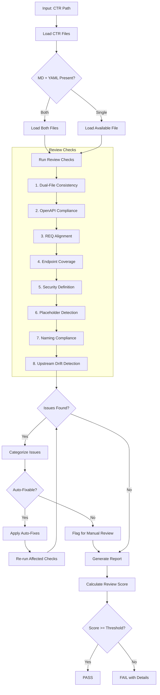
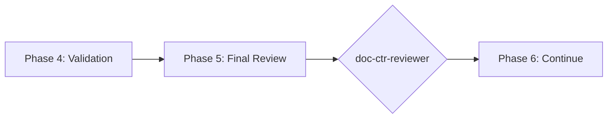

# doc-ctr-reviewer

## Purpose

Comprehensive **content review and quality assurance** for Data Contract (CTR) documents. This skill performs deep content analysis beyond structural validation, checking contract completeness, dual-file consistency (MD + YAML), OpenAPI compliance, REQ alignment, and identifying issues that require manual review.

**Layer**: 8 (CTR Quality Assurance)

**Upstream**: CTR (from `doc-ctr-autopilot` or `doc-ctr`)

**Downstream**: None (final QA gate before SPEC generation)

---

## When to Use This Skill

Use `doc-ctr-reviewer` when:

- **After CTR Generation**: Run immediately after `doc-ctr-autopilot` completes
- **Manual CTR Edits**: After making manual changes to CTR
- **Pre-SPEC Check**: Before running `doc-spec-autopilot`
- **API Changes**: When external APIs are modified
- **Periodic Review**: Regular quality checks on existing CTRs

**Do NOT use when**:
- CTR does not exist yet (use `doc-ctr` or `doc-ctr-autopilot` first)
- Need structural/schema validation only (use `doc-ctr-validator`)
- Generating new CTR content (use `doc-ctr`)

---

## Skill vs Validator: Key Differences

| Aspect | `doc-ctr-validator` | `doc-ctr-reviewer` |
|--------|---------------------|-------------------|
| **Focus** | Schema compliance, SPEC-Ready score | Content quality, API consistency |
| **Checks** | Required sections, OpenAPI schema | Dual-file sync, endpoint coverage |
| **Auto-Fix** | Structural issues only | Content issues (sync, formatting) |
| **Output** | SPEC-Ready score (numeric) | Review score + issue list |
| **Phase** | Phase 4 (Validation) | Phase 5 (Final Review) |
| **Blocking** | SPEC-Ready < threshold blocks | Review score < threshold flags |

---

## Review Workflow



---

## Review Checks

### 1. Dual-File Consistency

Validates MD and YAML files are synchronized.

**Scope**:
- Endpoint definitions match
- Schema definitions aligned
- Version numbers consistent
- Descriptions synchronized

**Error Codes**:

| Code | Severity | Description |
|------|----------|-------------|
| REV-DF001 | Error | Endpoint in YAML not in MD |
| REV-DF002 | Error | Schema mismatch between files |
| REV-DF003 | Warning | Version number inconsistent |
| REV-DF004 | Info | Description differs (may be intentional) |

---

### 2. OpenAPI Compliance

Validates YAML follows OpenAPI 3.x specification.

**Scope**:
- Valid OpenAPI version
- Required fields present
- Schema types correct
- Response codes documented

**Error Codes**:

| Code | Severity | Description |
|------|----------|-------------|
| REV-OA001 | Error | Invalid OpenAPI version |
| REV-OA002 | Error | Required OpenAPI field missing |
| REV-OA003 | Error | Invalid schema type |
| REV-OA004 | Warning | Response code not documented |
| REV-OA005 | Info | Example values missing |

---

### 3. REQ Alignment

Validates CTR traces to REQ requirements.

**Scope**:
- Every endpoint maps to REQ
- External API requirements covered
- Interface contracts complete

**Error Codes**:

| Code | Severity | Description |
|------|----------|-------------|
| REV-RA001 | Error | Endpoint without REQ source |
| REV-RA002 | Warning | REQ interface not in CTR |
| REV-RA003 | Info | Multiple CTRs from single REQ (acceptable) |

---

### 4. Endpoint Coverage

Validates all expected endpoints documented.

**Scope**:
- CRUD operations complete
- Error endpoints defined
- Health check endpoints present
- Versioning strategy documented

**Error Codes**:

| Code | Severity | Description |
|------|----------|-------------|
| REV-EC001 | Warning | Missing CRUD operation |
| REV-EC002 | Warning | No error endpoint defined |
| REV-EC003 | Info | Health check endpoint missing |
| REV-EC004 | Info | API versioning not documented |

---

### 5. Security Definition

Validates security schemes documented.

**Scope**:
- Authentication method defined
- Authorization scopes documented
- Security schemes in OpenAPI
- Rate limiting documented

**Error Codes**:

| Code | Severity | Description |
|------|----------|-------------|
| REV-SD001 | Error | No security scheme defined |
| REV-SD002 | Warning | Authorization scopes missing |
| REV-SD003 | Warning | Rate limiting not documented |
| REV-SD004 | Info | Security examples missing |

---

### 6. Placeholder Detection

Identifies incomplete content requiring replacement.

**Error Codes**:

| Code | Severity | Description |
|------|----------|-------------|
| REV-P001 | Error | [TODO] placeholder found |
| REV-P002 | Error | [TBD] placeholder found |
| REV-P003 | Warning | Template value not replaced |

---

### 7. Naming Compliance

Validates element IDs follow `doc-naming` standards.

**Scope**:
- Element IDs use `CTR.NN.TT.SS` format
- Element type codes valid for CTR (28, 29)
- Contract naming convention

**Error Codes**:

| Code | Severity | Description |
|------|----------|-------------|
| REV-N001 | Error | Invalid element ID format |
| REV-N002 | Error | Element type code not valid for CTR |
| REV-N003 | Error | Legacy pattern detected |

---

### 8. Upstream Drift Detection (Mandatory Cache)

Detects when upstream REQ documents have been modified after the CTR was created or last updated.

**The drift cache is mandatory**. All CTR reviewer operations must maintain the drift cache to enable reliable change detection across sessions.

**Purpose**: Identifies stale CTR content that may not reflect current REQ documentation. When REQ documents (interface requirements, external API specifications) change, the CTR may need updates to maintain alignment.

**Scope**:
- `@req:` tag targets (REQ documents)
- Traceability section upstream artifact links
- Any markdown links to `../07_REQ/` or REQ source documents

#### Drift Cache File (MANDATORY)

**Location**: `docs/08_CTR/.drift_cache.json`

**Schema**:

```json
{
  "schema_version": "1.0",
  "last_updated": "2026-02-10T17:00:00",
  "documents": {
    "CTR-03-001": {
      "ctr_path": "docs/08_CTR/CTR-03-001_provider_api/CTR-03-001.md",
      "ctr_updated": "2026-02-10T14:30:00",
      "upstream_hashes": {
        "docs/07_REQ/REQ-03.md": {
          "full_hash": "a1b2c3d4e5f6...",
          "section_hashes": {
            "interfaces": "1a2b3c4d...",
            "external_apis": "5e6f7g8h..."
          },
          "last_checked": "2026-02-10T17:00:00"
        }
      }
    }
  }
}
```

#### Three-Phase Detection Algorithm

```
Phase 1: Cache Initialization
  1. Check if docs/08_CTR/.drift_cache.json exists
  2. If not exists → create with schema_version: "1.0"
  3. Load cache into memory

Phase 2: Reference Extraction and Hash Comparison
  1. Extract all upstream references from CTR:
     - @req: tags → [path, section anchor]
     - Links to ../07_REQ/ → [path]
     - Traceability table upstream artifacts → [path]

  2. For each upstream reference:
     a. Resolve path to absolute file path
     b. Check file exists (already covered by Check #3)
     c. Compute SHA-256 hash of full file content
     d. If section anchor specified → compute section hash
     e. Compare hashes against cached values
     f. If hash differs → flag as DRIFT

Phase 3: Cache Update
  1. Update upstream_hashes with current values
  2. Set last_checked timestamp
  3. Write cache to disk
  4. Report cache status in output
```

#### Hash Calculation

**Full File Hash**:

```python
import hashlib

def compute_file_hash(file_path: str) -> str:
    """Compute SHA-256 hash of file content."""
    with open(file_path, 'rb') as f:
        return hashlib.sha256(f.read()).hexdigest()
```

**Section Hash**:

```python
def compute_section_hash(file_path: str, section_anchor: str) -> str:
    """Compute SHA-256 hash of specific section content."""
    content = extract_section(file_path, section_anchor)
    return hashlib.sha256(content.encode()).hexdigest()
```

**Error Codes**:

| Code | Severity | Description |
|------|----------|-------------|
| REV-D001 | Warning | Upstream REQ document modified after CTR creation |
| REV-D002 | Warning | Referenced section content has changed (hash mismatch) |
| REV-D003 | Info | Upstream document version incremented |
| REV-D004 | Info | New content added to upstream document |
| REV-D005 | Error | Critical upstream document substantially modified (>20% change) |
| REV-D006 | Error | Drift cache missing or corrupted - regenerating |

**Report Output**:

```markdown
## Upstream Drift Analysis

**Cache Status**: Active | Last Updated: 2026-02-10T17:00:00

| Upstream Document | CTR Reference | Hash Status | Last Modified | Days Stale | Severity |
|-------------------|---------------|-------------|---------------|------------|----------|
| REQ-03.md | @req interfaces | CHANGED | 2026-02-08 | 3 | Warning |
| REQ-03.md | Traceability | UNCHANGED | 2026-02-05 | 0 | OK |

**Drift Summary**:
- Total References: 5
- Unchanged: 3
- Changed: 2
- New (uncached): 0

**Recommendation**: Review upstream REQ changes and update CTR if interface requirements have changed.
```

**Auto-Actions**:
- Create `.drift_cache.json` if not exists
- Update cache with current hashes after every review
- Add `[DRIFT]` marker to affected @req tags (optional)
- Generate drift summary in review report

**Configuration**:

| Setting | Default | Description |
|---------|---------|-------------|
| `cache_enabled` | true | Drift cache (Mandatory - cannot be disabled) |
| `drift_threshold_days` | 7 | Days before drift becomes Warning |
| `critical_threshold_days` | 30 | Days before drift becomes Error |
| `tracked_patterns` | `@req:` | Patterns to track for drift |

---

## Review Score Calculation

**Scoring Formula**:

| Category | Weight | Calculation |
|----------|--------|-------------|
| Dual-File Consistency | 24% | (consistent_elements / total) × 24 |
| OpenAPI Compliance | 19% | (valid_fields / required_fields) × 19 |
| REQ Alignment | 14% | (aligned_endpoints / total) × 14 |
| Endpoint Coverage | 14% | (covered / expected) × 14 |
| Security Definition | 10% | (security_score) × 10 |
| Placeholder Detection | 5% | (no_placeholders ? 5 : 5 - count) |
| Naming Compliance | 9% | (valid_ids / total_ids) × 9 |
| Upstream Drift | 5% | (fresh_refs / total_refs) × 5 |

**Total**: Sum of all categories (max 100)

**Thresholds**:
- **PASS**: >= 90
- **WARNING**: 80-89
- **FAIL**: < 80

---

## Command Usage

```bash
# Review specific CTR
/doc-ctr-reviewer CTR-03-001

# Review CTR by path
/doc-ctr-reviewer docs/08_CTR/CTR-03-001_provider_api/

# Review all CTRs
/doc-ctr-reviewer all
```

---

## Output Report

Review reports are stored alongside the reviewed document per project standards.

**File Naming**: `CTR-NN-SSS.R_review_report_vNNN.md`

**Location**: Same folder as the reviewed CTR document.

### Versioning Rules

1. **First Review**: Creates `CTR-NN-SSS.R_review_report_v001.md`
2. **Subsequent Reviews**: Auto-increments version (v002, v003, etc.)
3. **Same-Day Reviews**: Each review gets unique version number

**Version Detection**: Scans folder for existing `CTR-NN-SSS.R_review_report_v*.md` files and increments.

**Example**:

```
docs/08_CTR/CTR-03-001_provider_api/
├── CTR-03-001.md
├── CTR-03-001.yaml
├── CTR-03-001.R_review_report_v001.md    # First review
└── CTR-03-001.R_review_report_v002.md    # After fixes
```

### Delta Reporting

When previous reviews exist, include score comparison in the report.

See `REVIEW_DOCUMENT_STANDARDS.md` for complete versioning requirements.

---

## Integration with doc-ctr-autopilot

This skill is invoked during Phase 5 of `doc-ctr-autopilot`:



---

## Related Skills

| Skill | Relationship |
|-------|--------------|
| `doc-naming` | Naming standards for Check #7 |
| `doc-ctr-autopilot` | Invokes this skill in Phase 5 |
| `doc-ctr-validator` | Structural validation (Phase 4) |
| `doc-ctr-fixer` | Applies fixes based on review findings |
| `doc-ctr` | CTR creation rules |
| `doc-req-reviewer` | Upstream QA |
| `doc-spec-autopilot` | Downstream consumer |

---

## Version History

| Version | Date | Changes |
|---------|------|---------|
| 1.3 | 2026-02-10 | Mandatory drift cache implementation - cache now required; Three-Phase Detection Algorithm; SHA-256 hash calculation with Python examples; REV-D006 error code for missing/corrupted cache; cache status in report output; centralized cache at docs/08_CTR/.drift_cache.json |
| 1.2 | 2026-02-10 | Added Check #8: Upstream Drift Detection - detects when REQ documents modified after CTR creation; REV-D001-D005 error codes; drift cache support; configurable thresholds; added doc-ctr-fixer to related skills |
| 1.1 | 2026-02-10 | Added review versioning support (_vNNN pattern); Delta reporting for score comparison |
| 1.0 | 2026-02-10 | Initial skill creation with 7 review checks; Dual-file consistency; OpenAPI compliance; Security definition |
