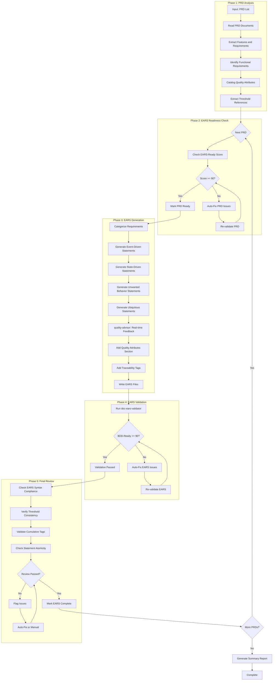
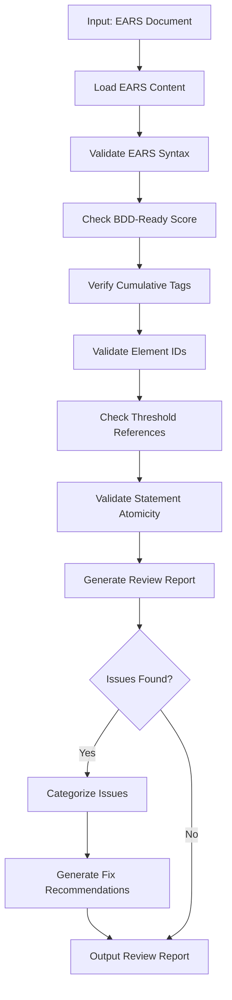
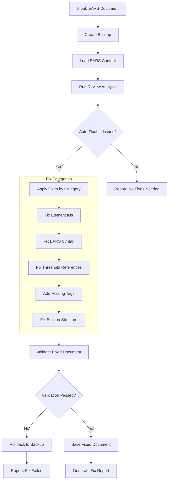

# doc-ears-autopilot

## Purpose

Automated **EARS (Easy Approach to Requirements Syntax)** generation pipeline that processes PRD documents and generates formal EARS statements with readiness validation, statement categorization, and BDD-Ready score compliance.

**Layer**: 3 (EARS Generation)

**Upstream**: BRD (Layer 1), PRD (Layer 2)

**Downstream Artifacts**: BDD (Layer 4), ADR (Layer 5), SYS (Layer 6)

---

## Skill Dependencies

This autopilot orchestrates the following skills:

| Skill | Purpose | Phase |
|-------|---------|-------|
| `doc-naming` | Element ID format (EARS.NN.25.SS), threshold tags, category ID ranges | All Phases |
| `doc-prd-validator` | Validate PRD EARS-Ready score | Phase 2: PRD Readiness |
| `doc-ears` | EARS creation rules, WHEN-THE-SHALL syntax, template, section structure | Phase 3: EARS Generation |
| `quality-advisor` | Real-time quality feedback during EARS generation | Phase 3: EARS Generation |
| `doc-ears-validator` | Validate EARS structure, content, BDD-Ready score | Phase 4: EARS Validation |

**Delegation Principle**: The autopilot orchestrates workflow but delegates:
- EARS structure/content rules -> `doc-ears` skill
- Real-time quality feedback -> `quality-advisor` skill
- EARS validation logic -> `doc-ears-validator` skill
- PRD validation logic -> `doc-prd-validator` skill
- Element ID standards -> `doc-naming` skill

---

## When to Use This Skill

**Use `doc-ears-autopilot` when**:
- You have one or more completed PRD documents ready for EARS generation
- You want automated requirement categorization (Event, State, Unwanted, Ubiquitous)
- You need EARS-Ready score validation before generation
- You want automatic BDD-Ready score validation after EARS creation
- You need to generate formal WHEN-THE-SHALL-WITHIN statements from PRD features

**Do NOT use when**:
- Creating a single EARS with extensive manual customization (use `doc-ears` directly)
- PRDs are incomplete or in Draft status
- You need fine-grained control over each EARS statement
- PRD EARS-Ready score is below 90%

---

## Workflow Overview



---

## Detailed Workflow

### Phase 1: PRD Analysis

Analyze PRD documents to extract requirements for EARS formalization.

**Input Sources** (from PRD):

| PRD Section | EARS Content | Mapping |
|-------------|--------------|---------|
| Section 6: Goals & Objectives | Business-driven requirements | Ubiquitous statements |
| Section 9: Functional Requirements | Feature behaviors | Event-Driven, State-Driven |
| Section 10: Customer-Facing Content | User interactions | Event-Driven statements |
| Section 11: Acceptance Criteria | Validation rules | Event-Driven, Unwanted Behavior |
| Section 14: Success Definition | Go-live criteria | Ubiquitous statements |
| Section 20: EARS Enhancement Appendix | Timing, boundary, state, fallback | All statement types |
| Quality Attributes | Performance, Security, Reliability | Quality Attributes section |

**Analysis Process**:

```bash
# Check for PRD documents
ls -la docs/02_PRD/

# Expected structure:
# - PRD-NN_{slug}.md (monolithic)
# - PRD-NN_{slug}/ (sectioned with PRD-NN.S_{section}.md files)
```

**Output**: Requirement catalog with categorization hints, threshold references, and traceability links.

### Phase 2: EARS Readiness Check

Validate that source PRDs meet EARS-Ready requirements before generation.

> **Skill Delegation**: This phase uses validation rules from `doc-prd-validator` skill.
> See: `.claude/skills/doc-prd-validator/SKILL.md` for complete PRD validation rules.

**EARS-Ready Scoring Criteria (100%)**:

| Category | Weight | Criteria |
|----------|--------|----------|
| Business Requirements Clarity | 40% | SMART objectives, functional requirements, acceptance criteria |
| Requirements Maturity | 35% | System boundaries, stakeholder requirements, problem statement |
| EARS Translation Readiness | 20% | User journeys, quality attributes quantified, timing profiles |
| Strategic Alignment | 5% | Domain-specific business logic references |

**Minimum Score**: 90% (configurable)

**Auto-Fix Actions**:

| Issue | Auto-Fix Action |
|-------|-----------------|
| Missing timing profile matrix | Add Section 20.1 template |
| Missing boundary value matrix | Add Section 20.2 template |
| Missing state transition diagram | Add Section 20.3 Mermaid template |
| Missing fallback documentation | Add Section 20.4 template |
| Incomplete acceptance criteria | Flag for manual review |

**Validation Command** (internal):

```bash
python ai_dev_flow/scripts/validate_ears_ready.py \
  --prd docs/02_PRD/PRD-01_{slug}/ \
  --min-score 90 \
  --auto-fix
```

### Phase 3: EARS Generation

Generate EARS statements from validated PRD with real-time quality feedback.

> **Skill Delegation**: This phase follows rules defined in `doc-ears` skill.
> See: `.claude/skills/doc-ears/SKILL.md` for complete EARS creation guidance.
>
> **Quality Guidance**: Uses `quality-advisor` skill for real-time feedback during generation.
> See: `.claude/skills/quality-advisor/SKILL.md` for quality monitoring.

**Generation Process**:

1. **Reserve EARS ID**:
   ```bash
   # Check for next available ID
   ls docs/03_EARS/EARS-*.md docs/03_EARS/EARS-*/EARS-*.0_*.md 2>/dev/null | \
     grep -oP 'EARS-\K\d+' | sort -n | tail -1
   # Increment for new EARS
   ```

2. **Load EARS Template**:
   - Primary: `ai_dev_flow/03_EARS/EARS-MVP-TEMPLATE.md`
   - Section templates: For sectioned EARS (>300 lines)

3. **Generate Document Control Section**:

   | Field | Value |
   |-------|-------|
   | EARS ID | EARS-NN |
   | Version | 0.1.0 |
   | Date Created | Current date (YYYY-MM-DD) |
   | Last Updated | Current date (YYYY-MM-DD) |
   | Status | Draft |
   | Priority | From PRD priority |
   | Source Document | @prd: PRD.NN.EE.SS (single value) |
   | BDD-Ready Score | Calculated after generation |

4. **Categorize Requirements**:

   **Requirement Category Detection**:

   | PRD Pattern | EARS Category | ID Range |
   |-------------|---------------|----------|
   | "when user...", "upon receiving...", "triggered by..." | Event-Driven | 001-099 |
   | "while connected...", "during session...", "maintaining..." | State-Driven | 101-199 |
   | "if error...", "prevent...", "handle failure..." | Unwanted Behavior | 201-299 |
   | "always...", "system-wide...", "all requests..." | Ubiquitous | 401-499 |

5. **Generate EARS Statements by Category**:

   **Event-Driven Requirements** (ID Range: 001-099):
   ```
   #### EARS.NN.25.001: [Requirement Name]
   ```
   WHEN [trigger condition],
   THE [system component] SHALL [action 1],
   [action 2],
   and [action 3]
   WITHIN [timing constraint] (@threshold: PRD.NN.category.key).
   ```
   **Traceability**: @brd: BRD.NN.01.SS | @prd: PRD.NN.07.SS
   ```

   **State-Driven Requirements** (ID Range: 101-199):
   ```
   #### EARS.NN.25.101: [Requirement Name]
   ```
   WHILE [state condition],
   THE [system component] SHALL [continuous behavior]
   WITHIN [operational context].
   ```
   **Traceability**: @brd: BRD.NN.01.SS | @prd: PRD.NN.07.SS
   ```

   **Unwanted Behavior Requirements** (ID Range: 201-299):
   ```
   #### EARS.NN.25.201: [Requirement Name]
   ```
   IF [error condition],
   THE [system component] SHALL [prevention/recovery action]
   WITHIN [timing constraint].
   ```
   **Traceability**: @brd: BRD.NN.01.SS | @prd: PRD.NN.07.SS
   ```

   **Ubiquitous Requirements** (ID Range: 401-499):
   ```
   #### EARS.NN.25.401: [Requirement Name]
   ```
   THE [system component] SHALL [universal behavior]
   for [scope/context].
   ```
   **Traceability**: @brd: BRD.NN.01.SS | @prd: PRD.NN.07.SS
   ```

6. **Real-Time Quality Feedback** (via `quality-advisor` skill):
   - Monitor EARS syntax compliance as statements are generated
   - Detect anti-patterns (missing SHALL, ambiguous terms, non-atomic statements)
   - Validate @threshold tag format and references
   - Check element ID format compliance (EARS.NN.25.SS)
   - Flag issues early to reduce post-generation rework

7. **Generate Quality Attributes Section**:

   **Performance Requirements Table**:

   | QA ID | Requirement Statement | Metric | Target | Priority | Measurement Method |
   |-------|----------------------|--------|--------|----------|-------------------|
   | EARS.NN.02.01 | THE [component] SHALL complete [operation] | Latency | p95 < NNms | High | [method] |
   | EARS.NN.02.02 | THE [component] SHALL process [workload] | Throughput | NN/s | Medium | [method] |

   **Security Requirements Table**:

   | QA ID | Requirement Statement | Control | Compliance | Priority |
   |-------|----------------------|---------|------------|----------|
   | EARS.NN.03.01 | THE [component] SHALL authenticate using [method] | Authentication | [standard] | High |

   **Reliability Requirements Table**:

   | QA ID | Requirement Statement | Metric | Target | Priority |
   |-------|----------------------|--------|--------|----------|
   | EARS.NN.04.01 | THE [component] SHALL maintain availability | Uptime | 99.9% | High |

8. **Add Cumulative Traceability Tags**:

   ```markdown
   ## Traceability

   **Required Tags** (Cumulative Tagging Hierarchy - Layer 3):
   @brd: BRD.01.01.03, BRD.01.01.10
   @prd: PRD.01.07.02, PRD.01.07.15
   ```

9. **Add Threshold References Section**:

   ```markdown
   ### Thresholds Referenced

   | Threshold ID | Category | Value | Source |
   |--------------|----------|-------|--------|
   | @threshold: PRD.01.timeout.auth.sso | Timing | 500ms | PRD Section 20.1 |
   | @threshold: PRD.01.perf.api.p95 | Performance | 100ms | PRD Section 14 |
   ```

10. **File Output**:
    - **Monolithic** (<300 lines): `docs/03_EARS/EARS-NN_{slug}.md`
    - **Sectioned** (>=300 lines): `docs/03_EARS/EARS-NN_{slug}/EARS-NN.S_{section}.md`

### Phase 4: EARS Validation

After EARS generation, validate structure and BDD-Ready score.

> **Skill Delegation**: This phase uses validation rules from `doc-ears-validator` skill.
> See: `.claude/skills/doc-ears-validator/SKILL.md` for complete validation rules.

**Validation Command**:

```bash
python ai_dev_flow/scripts/validate_ears.py docs/03_EARS/EARS-NN_{slug}.md --verbose
```

**Validation Checks**:

| Check | Requirement | Error Code |
|-------|-------------|------------|
| YAML Frontmatter | Valid metadata fields | EARS-E001 to EARS-E005 |
| Section Structure | Required sections present | EARS-E006 |
| Document Control | All required fields | EARS-E009 |
| EARS Syntax | WHEN-THE-SHALL-WITHIN patterns | EARS-E010 |
| Element ID Format | EARS.NN.25.SS (4-segment) | EARS-E030 |
| Source Document | Single @prd: PRD.NN.EE.SS value | EARS-E040, EARS-E044 |
| Cumulative Tags | @brd, @prd present | EARS-W002 |
| BDD-Ready Score | >= 90% | EARS-W003 |

**Auto-Fix Actions**:

| Issue | Auto-Fix Action |
|-------|-----------------|
| Missing SHALL keyword | Add SHALL to statement |
| Invalid element ID format | Convert to EARS.NN.25.SS format |
| Missing traceability section | Insert from template |
| Missing @threshold tags | Add placeholder tags |
| Deprecated ID patterns | Convert to unified format |
| Missing BDD-Ready Score | Calculate and insert |

**Validation Loop**:

```
LOOP (max 3 iterations):
  1. Run doc-ears-validator
  2. IF errors found: Apply auto-fixes
  3. IF warnings found: Review and address if critical
  4. IF BDD-Ready Score < 90%: Enhance statements
  5. IF clean: Mark VALIDATED, proceed
  6. IF max iterations: Log issues, flag for manual review
```

### Phase 5: Final Review

Comprehensive final review before marking EARS complete.

**Review Checks**:

1. **EARS Syntax Compliance**:
   - All statements use WHEN-THE-SHALL-WITHIN format
   - SHALL/SHOULD/MAY keywords used correctly
   - No ambiguous terms ("fast", "efficient", "user-friendly")
   - All constraints quantifiable

2. **Threshold Consistency**:
   - All @threshold tags reference valid PRD thresholds
   - Threshold values match PRD source
   - No orphan threshold references

3. **Cumulative Tag Validation**:
   - @brd tags reference valid BRD elements
   - @prd tags reference valid PRD elements
   - Tag format uses pipe separators for inline

4. **Statement Atomicity**:
   - Each EARS statement defines one testable concept
   - No compound requirements in single statements
   - Clear trigger-action-constraint structure

5. **BDD-Ready Report**:

   ```
   BDD-Ready Score Breakdown
   =========================
   Requirements Clarity:       40/40
     EARS Syntax Compliance:   20/20
     Statement Atomicity:      15/15
     Quantifiable Constraints: 5/5

   Testability:               35/35
     BDD Translation Ready:   15/15
     Observable Verification: 10/10
     Edge Cases Specified:    10/10

   Quality Attributes:        15/15
     Performance Targets:     5/5
     Security Requirements:   5/5
     Reliability Targets:     5/5

   Strategic Alignment:       10/10
     Business Objective Links: 5/5
     Implementation Paths:     5/5
   ----------------------------
   Total BDD-Ready Score:     100/100 (Target: >= 90)
   Status: READY FOR BDD GENERATION
   ```

6. **Traceability Matrix Update**:

   ```bash
   # Update EARS-00_TRACEABILITY_MATRIX.md
   python ai_dev_flow/scripts/update_traceability_matrix.py \
     --ears docs/03_EARS/EARS-NN_{slug}.md \
     --matrix docs/03_EARS/EARS-00_TRACEABILITY_MATRIX.md
   ```

---

## EARS Statement Types Reference

### 1. Event-Driven Requirements

**Pattern**: WHEN [trigger] THE [system] SHALL [action] WITHIN [constraint]

**Keywords**: "when", "upon", "triggered by", "on receipt of", "after"

**Example**:
```
WHEN user submits authentication request,
THE identity service SHALL validate credentials,
generate session token,
and return authentication response
WITHIN 100ms (@threshold: PRD.01.auth.response.p95).
```

**Use Cases**:
- User-initiated actions
- External system events
- Timer-triggered operations
- Message receipt handling

### 2. State-Driven Requirements

**Pattern**: WHILE [state] THE [system] SHALL [behavior] WITHIN [context]

**Keywords**: "while", "during", "as long as", "when in state"

**Example**:
```
WHILE user session is active,
THE session manager SHALL maintain heartbeat connection
and refresh token before expiration.
```

**Use Cases**:
- Continuous monitoring
- Persistent connections
- Background processes
- State maintenance

### 3. Unwanted Behavior Requirements

**Pattern**: IF [condition] THEN THE [system] SHALL [prevention/recovery]

**Keywords**: "if error", "when failure", "prevent", "handle", "recover from"

**Example**:
```
IF authentication timeout occurs,
THEN THE identity service SHALL retry authentication once
and log failure event
WITHIN 50ms (@threshold: PRD.01.auth.retry.timeout).
```

**Use Cases**:
- Error handling
- Failure recovery
- Prevention mechanisms
- Fallback behaviors

### 4. Ubiquitous Requirements

**Pattern**: THE [system] SHALL [behavior] for [scope]

**Keywords**: "always", "all", "every", "system-wide", "unconditionally"

**Example**:
```
THE logging service SHALL record all authentication events
with timestamp, user ID, and outcome status.
```

**Use Cases**:
- System-wide policies
- Compliance requirements
- Universal behaviors
- Cross-cutting concerns

---

## Execution Modes

### Single PRD Mode

Generate EARS from one PRD document.

```bash
# Example: Generate EARS from PRD-01
python ai_dev_flow/scripts/ears_autopilot.py \
  --prd docs/02_PRD/PRD-01_f1_iam/ \
  --output docs/03_EARS/ \
  --id 01 \
  --slug f1_iam_requirements
```

### Batch Mode

Generate EARS from multiple PRDs in sequence.

```bash
# Example: Generate EARS from all PRDs
python ai_dev_flow/scripts/ears_autopilot.py \
  --batch config/ears_batch.yaml \
  --output docs/03_EARS/
```

**Batch Configuration** (`config/ears_batch.yaml`):

```yaml
ears_generation:
  - id: "01"
    slug: "f1_iam_requirements"
    prd: "PRD-01"
    priority: 1

  - id: "02"
    slug: "f2_data_requirements"
    prd: "PRD-02"
    priority: 2

  - id: "03"
    slug: "f3_api_requirements"
    prd: "PRD-03"
    priority: 2

execution:
  parallel: false
  fail_fast: true
```

### Dry Run Mode

Preview execution plan without generating files.

```bash
python ai_dev_flow/scripts/ears_autopilot.py \
  --prd docs/02_PRD/PRD-01_f1_iam/ \
  --dry-run
```

### Mode 4: Review Mode (v2.1)

Validate existing EARS documents without modification. Generates quality report with actionable recommendations.

**Command**:
```bash
# Review single EARS
/doc-ears-autopilot EARS-01 --review

# Review all EARS in directory
/doc-ears-autopilot docs/03_EARS/ --review --all

# Review with detailed report
/doc-ears-autopilot EARS-01 --review --verbose
```

**Review Process**:



**Review Report Template**:

```markdown
# EARS Review Report: EARS-NN_{slug}

## Summary
- **BDD-Ready Score**: NN% (✅/🟡/❌)
- **Total Issues**: N (E errors, W warnings)
- **Auto-Fixable**: N issues
- **Manual Review**: N issues

## Score Breakdown
| Category | Score | Max | Status |
|----------|-------|-----|--------|
| EARS Syntax Compliance | NN | 25 | ✅/🟡/❌ |
| Statement Atomicity | NN | 20 | ✅/🟡/❌ |
| Quantifiable Constraints | NN | 15 | ✅/🟡/❌ |
| BDD Translation Ready | NN | 15 | ✅/🟡/❌ |
| Traceability Tags | NN | 15 | ✅/🟡/❌ |
| Threshold References | NN | 10 | ✅/🟡/❌ |

## Issues by Category

### Auto-Fixable Issues
| Issue | Location | Fix Action |
|-------|----------|------------|
| Legacy ID pattern | EARS.01.25.001 | Convert ER-001 → EARS.01.25.001 |
| Missing @threshold | Line 45 | Add @threshold: PRD.01.xx.yy |

### Manual Review Required
| Issue | Location | Recommendation |
|-------|----------|----------------|
| Ambiguous term | Line 23 | Replace "fast" with quantified value |
| Compound requirement | Line 67 | Split into atomic statements |
```

**Score Indicators**:
- ✅ Green (>=90%): BDD-Ready
- 🟡 Yellow (70-89%): Needs improvement
- ❌ Red (<70%): Significant issues

**Review Configuration**:

```yaml
review_mode:
  enabled: true
  checks:
    - ears_syntax          # WHEN-THE-SHALL-WITHIN patterns
    - statement_atomicity  # One testable concept per statement
    - threshold_refs       # @threshold tag validation
    - cumulative_tags      # @brd, @prd presence
    - element_ids          # EARS.NN.25.SS format
    - quantifiable         # No ambiguous terms
  output:
    format: markdown       # markdown, json, html
    include_recommendations: true
    include_fix_commands: true
```

### Mode 5: Fix Mode (v2.1)

Auto-repair existing EARS documents with backup and content preservation.

**Command**:
```bash
# Fix single EARS
/doc-ears-autopilot EARS-01 --fix

# Fix with backup
/doc-ears-autopilot EARS-01 --fix --backup

# Fix all EARS
/doc-ears-autopilot docs/03_EARS/ --fix --all

# Fix specific categories only
/doc-ears-autopilot EARS-01 --fix --only element_ids,thresholds

# Dry-run fix (preview changes)
/doc-ears-autopilot EARS-01 --fix --dry-run
```

**Fix Process**:



**EARS-Specific Fix Categories**:

| Category | Description | Auto-Fix Actions |
|----------|-------------|------------------|
| `element_ids` | Element ID format | Convert legacy patterns to EARS.NN.25.SS |
| `ears_syntax` | EARS statement format | Add missing SHALL, fix WHEN-THE-SHALL structure |
| `thresholds` | @threshold tags | Add missing threshold references from PRD |
| `cumulative_tags` | Traceability tags | Add missing @brd, @prd tags |
| `sections` | Section structure | Add missing Quality Attributes, Traceability sections |
| `atomicity` | Statement atomicity | Flag compound statements (manual split required) |
| `ambiguous_terms` | Vague language | Flag "fast", "efficient", etc. (manual fix) |

**Element ID Migration** (Layer 3):

| Legacy Pattern | New Format | Example |
|----------------|------------|---------|
| ER-XXX | EARS.NN.25.0XX | ER-001 → EARS.01.25.001 |
| SR-XXX | EARS.NN.25.1XX | SR-101 → EARS.01.25.101 |
| UB-XXX | EARS.NN.25.2XX | UB-201 → EARS.01.25.201 |
| UQ-XXX | EARS.NN.25.4XX | UQ-401 → EARS.01.25.401 |
| QA-XXX | EARS.NN.02.SS | QA-001 → EARS.01.02.01 |

**Content Preservation Rules**:

| Content Type | Preservation Rule |
|--------------|-------------------|
| Custom EARS statements | Never delete, only enhance |
| Business context | Preserve all domain-specific content |
| Threshold values | Update format, preserve values |
| PRD references | Validate and update format only |
| Quality Attributes | Add missing, preserve existing |
| Traceability section | Append missing tags, keep existing |

**Fix Configuration**:

```yaml
fix_mode:
  enabled: true
  backup:
    enabled: true
    location: "tmp/backups/"
    timestamp: true
  fix_categories:
    element_ids: true      # Convert legacy ID patterns
    ears_syntax: true      # Fix WHEN-THE-SHALL structure
    thresholds: true       # Add @threshold references
    cumulative_tags: true  # Add @brd, @prd tags
    sections: true         # Add missing sections
    atomicity: false       # Manual only (flag but don't auto-fix)
    ambiguous_terms: false # Manual only (flag but don't auto-fix)
  validation:
    post_fix: true         # Validate after fixes
    rollback_on_fail: true # Restore backup if validation fails
  preserve:
    custom_statements: true
    domain_content: true
    threshold_values: true
```

**Fix Report Template**:

```markdown
# EARS Fix Report: EARS-NN_{slug}

## Summary
- **Backup Created**: tmp/backups/EARS-NN_{slug}_20260209_143022.md
- **Issues Fixed**: N of M auto-fixable issues
- **Manual Review**: N issues flagged

## Fixes Applied

### Element ID Migration
| Original | Fixed | Location |
|----------|-------|----------|
| ER-001 | EARS.01.25.001 | Line 45 |
| SR-101 | EARS.01.25.101 | Line 78 |

### Threshold References Added
| Statement | Threshold Added |
|-----------|-----------------|
| EARS.01.25.001 | @threshold: PRD.01.auth.p95 |

### Cumulative Tags Added
- @brd: BRD.01.01.03 (added)
- @prd: PRD.01.07.02 (verified)

## Manual Review Required

### Compound Statements (Split Required)
| Statement ID | Issue | Recommendation |
|--------------|-------|----------------|
| EARS.01.25.015 | Multiple actions | Split into EARS.01.25.015, .016 |

### Ambiguous Terms
| Location | Term | Suggested Replacement |
|----------|------|----------------------|
| Line 89 | "quickly" | "WITHIN 100ms" |
| Line 156 | "efficiently" | Remove or quantify |

## Validation Results
- **BDD-Ready Score**: Before: 78% → After: 94%
- **Syntax Errors**: Before: 5 → After: 0
- **Status**: ✅ All auto-fixes validated
```

**Command Line Options** (Review/Fix Modes):

| Option | Default | Description |
|--------|---------|-------------|
| `--review` | false | Run review mode only |
| `--fix` | false | Run fix mode |
| `--backup` | true | Create backup before fixing |
| `--dry-run` | false | Preview fixes without applying |
| `--only` | all | Comma-separated fix categories |
| `--verbose` | false | Detailed output |
| `--all` | false | Process all EARS in directory |
| `--output-format` | markdown | Report format (markdown, json) |

---

## Configuration

### Default Configuration

```yaml
# config/ears_autopilot.yaml
ears_autopilot:
  version: "1.0"

  scoring:
    ears_ready_min: 90
    bdd_ready_min: 90
    strict_mode: false

  execution:
    max_parallel: 3        # HARD LIMIT - do not exceed
    chunk_size: 3          # Documents per chunk
    pause_between_chunks: true
    auto_fix: true
    continue_on_error: false
    timeout_per_prd: 300  # seconds

  output:
    structure: auto  # auto, monolithic, sectioned
    size_threshold_lines: 300
    report_format: markdown

  validation:
    skip_validation: false
    fix_iterations_max: 3

  review:
    enabled: true
    check_syntax: true
    check_thresholds: true
    check_atomicity: true
    check_tags: true
    auto_fix_syntax: true
```

### Command Line Options

| Option | Default | Description |
|--------|---------|-------------|
| `--min-ears-ready` | 90 | Minimum EARS-Ready score (PRD) |
| `--min-bdd-ready` | 90 | Minimum BDD-Ready score (EARS) |
| `--no-auto-fix` | false | Disable auto-fix (manual only) |
| `--continue-on-error` | false | Continue if one PRD fails |
| `--dry-run` | false | Preview execution plan only |
| `--output-format` | auto | Force monolithic or sectioned output |
| `--skip-review` | false | Skip final review phase |

---

## Context Management

### Chunked Parallel Execution (MANDATORY)

**CRITICAL**: To prevent conversation context overflow errors ("Prompt is too long", "Conversation too long"), all autopilot operations MUST follow chunked execution rules:

**Chunk Size Limit**: Maximum 3 documents per chunk

**Chunking Rules**:

1. **Chunk Formation**: Group PRD documents into chunks of maximum 3 at a time
2. **Sequential Chunk Processing**: Process one chunk at a time, completing all EARS in a chunk before starting the next
3. **Context Pause**: After completing each chunk, provide a summary and pause for user acknowledgment
4. **Progress Tracking**: Display chunk progress (e.g., "Chunk 2/5: Processing PRD-04, PRD-05, PRD-06")

**Execution Pattern**:

```text
PRDs: PRD-01, PRD-02, PRD-03, PRD-04, PRD-05, PRD-06, PRD-07

Chunk 1: [PRD-01, PRD-02, PRD-03] → Process → Summary → Pause
Chunk 2: [PRD-04, PRD-05, PRD-06] → Process → Summary → Pause
Chunk 3: [PRD-07]                  → Process → Summary → Complete
```

**Chunk Completion Summary Template**:

```text
Chunk N/M Complete:
├── Generated: EARS-01, EARS-02, EARS-03
├── BDD-Ready Scores: 94%, 92%, 91%
├── Status: All validated
└── Next: Continue with Chunk N+1? [Y/n]
```

**Why Chunking is Required**:

- Prevents "Conversation too long" errors during batch processing
- Allows context compaction between chunks
- Enables recovery from failures without losing all progress
- Provides natural checkpoints for user review

---

## Output Artifacts

### Generated Files

| File | Purpose | Location |
|------|---------|----------|
| EARS-NN_{slug}.md | Main EARS document (monolithic) | `docs/03_EARS/` |
| EARS-NN_{slug}/ | EARS folder (sectioned) | `docs/03_EARS/` |
| EARS-NN.0_index.md | Section index | `docs/03_EARS/EARS-NN_{slug}/` |
| EARS-NN.S_{section}.md | Section files | `docs/03_EARS/EARS-NN_{slug}/` |

### Validation Reports

| Report | Purpose | Location |
|--------|---------|----------|
| ears_validation_report.json | Validation results | `tmp/` |
| bdd_ready_score.json | BDD-Ready breakdown | `tmp/` |
| autopilot_log.md | Execution log | `tmp/` |

---

## Error Handling

### Error Categories

| Category | Handling | Example |
|----------|----------|---------|
| PRD Missing | Abort with message | No PRD document found |
| EARS-Ready Below 90% | Auto-fix PRD, retry | PRD score at 85% |
| Validation Failure | Auto-fix, retry | Missing required section |
| BDD-Ready Below 90% | Enhance statements, retry | Score at 88% |
| Max Retries Exceeded | Flag for manual review | Persistent validation errors |

### Recovery Actions

```python
def handle_error(error_type: str, context: dict) -> Action:
    match error_type:
        case "PRD_MISSING":
            return Action.ABORT_WITH_MESSAGE
        case "EARS_READY_LOW":
            return Action.AUTO_FIX_PRD
        case "VALIDATION_FAILURE":
            if context["retry_count"] < 3:
                return Action.AUTO_FIX_RETRY
            return Action.FLAG_MANUAL_REVIEW
        case "BDD_READY_LOW":
            return Action.ENHANCE_STATEMENTS
        case _:
            return Action.FLAG_MANUAL_REVIEW
```

---

## Integration Points

### Pre-Execution Hooks

```bash
# Hook: pre_ears_generation
# Runs before EARS generation starts
./hooks/pre_ears_generation.sh

# Example: Validate PRD exists and is ready
if [ ! -d "docs/02_PRD/PRD-01_*" ]; then
  echo "ERROR: PRD-01 required"
  exit 1
fi
```

### Post-Execution Hooks

```bash
# Hook: post_ears_generation
# Runs after EARS generation completes
./hooks/post_ears_generation.sh

# Example: Trigger BDD autopilot for validated EARS
if [ "$EARS_VALIDATED" = "true" ]; then
  python ai_dev_flow/scripts/bdd_autopilot.py \
    --ears "$EARS_PATH" \
    --output docs/04_BDD/
fi
```

### CI/CD Integration

```yaml
# .github/workflows/ears_autopilot.yml
name: EARS Autopilot

on:
  push:
    paths:
      - 'docs/02_PRD/**'

jobs:
  generate-ears:
    runs-on: ubuntu-latest
    steps:
      - uses: actions/checkout@v4

      - name: Run EARS Autopilot
        run: |
          python ai_dev_flow/scripts/ears_autopilot.py \
            --prd docs/02_PRD/ \
            --output docs/03_EARS/ \
            --validate

      - name: Upload Validation Report
        uses: actions/upload-artifact@v4
        with:
          name: ears-validation
          path: tmp/ears_validation_report.json
```

---

## Quality Gates

### Phase Gates

| Phase | Gate | Criteria |
|-------|------|----------|
| Phase 1 | Input Gate | At least one PRD document found |
| Phase 2 | Readiness Gate | PRD EARS-Ready Score >= 90% |
| Phase 3 | Generation Gate | All statement categories populated |
| Phase 4 | Validation Gate | BDD-Ready Score >= 90% |
| Phase 5 | Review Gate | No blocking issues remaining |

### Blocking vs Non-Blocking

| Issue Type | Blocking | Action |
|------------|----------|--------|
| Missing required section | Yes | Must fix before proceeding |
| BDD-Ready Score < 90% | Yes | Must enhance statements |
| Invalid EARS syntax | Yes | Must correct statement format |
| Missing @threshold tags | No | Log warning, continue |
| Style/formatting issues | No | Auto-fix, continue |

---

## Validation Checklist

After autopilot completion:

- [ ] All target EARS documents generated
- [ ] Each EARS has BDD-Ready score >= 90%
- [ ] Traceability matrix updated (`EARS-00_TRACEABILITY_MATRIX.md`)
- [ ] Each EARS references upstream PRD with @prd tags
- [ ] Each EARS references upstream BRD with @brd tags
- [ ] All statements use WHEN-THE-SHALL-WITHIN syntax
- [ ] All constraints have @threshold references
- [ ] No ambiguous terms in statements
- [ ] Each statement is atomic (one testable concept)
- [ ] Quality Attributes section uses tabular format
- [ ] Element IDs use EARS.NN.25.SS format
- [ ] Source Document has single @prd value

---

## Quick Reference

| Input | Output | Key Metric |
|-------|--------|------------|
| PRD(s) | EARS(s) | BDD-Ready >= 90% |

**Usage**:
```
/doc-ears-autopilot <PRD-LIST> [OPTIONS]
```

**Common Commands**:
```bash
# Single PRD
/doc-ears-autopilot PRD-01

# All PRDs (automatic)
/doc-ears-autopilot all --auto

# Preview only
/doc-ears-autopilot all --dry-run

# Resume after failure
/doc-ears-autopilot resume
```

---

## Related Resources

### Skills (Delegated)

- **EARS Skill**: `.claude/skills/doc-ears/SKILL.md` - EARS creation rules and WHEN-THE-SHALL syntax
- **EARS Validator Skill**: `.claude/skills/doc-ears-validator/SKILL.md` - Validation rules and error codes
- **PRD Validator Skill**: `.claude/skills/doc-prd-validator/SKILL.md` - PRD readiness validation
- **Quality Advisor Skill**: `.claude/skills/quality-advisor/SKILL.md` - Real-time quality feedback
- **Naming Standards Skill**: `.claude/skills/doc-naming/SKILL.md` - Element ID format

### Templates and Rules

- **EARS Template**: `ai_dev_flow/03_EARS/EARS-MVP-TEMPLATE.md`
- **EARS Schema**: `ai_dev_flow/03_EARS/EARS_SCHEMA.yaml`
- **EARS Creation Rules**: `ai_dev_flow/03_EARS/EARS_CREATION_RULES.md`
- **EARS Validation Rules**: `ai_dev_flow/03_EARS/EARS_VALIDATION_RULES.md`

### Section Templates (for documents >300 lines)

- Index template: `ai_dev_flow/03_EARS/EARS-SECTION-0-TEMPLATE.md`
- Content template: `ai_dev_flow/03_EARS/EARS-SECTION-TEMPLATE.md`

### Framework References

- **SDD Workflow**: `ai_dev_flow/SPEC_DRIVEN_DEVELOPMENT_GUIDE.md`
- **MVP Autopilot**: `ai_dev_flow/AUTOPILOT/MVP_AUTOPILOT.md`
- **PRD Autopilot Skill**: `.claude/skills/doc-prd-autopilot/SKILL.md`
- **BRD Autopilot Skill**: `.claude/skills/doc-brd-autopilot/SKILL.md`

---

## Version History

| Version | Date | Changes |
|---------|------|---------|
| 2.1 | 2026-02-09 | Added Mode 4: Review Mode for validation-only analysis with visual score indicators; Added Mode 5: Fix Mode for auto-repair with backup and content preservation; Element ID migration (ER-XXX→EARS.NN.25.0XX, SR-XXX→EARS.NN.25.1XX, UB-XXX→EARS.NN.25.2XX, UQ-XXX→EARS.NN.25.4XX) |
| 1.0 | 2026-02-08 | Initial skill creation with 5-phase workflow; Integrated doc-naming, doc-ears, doc-ears-validator, quality-advisor skills; Added EARS statement type reference (Event-Driven, State-Driven, Unwanted Behavior, Ubiquitous); Added requirement categorization and ID range mapping |
