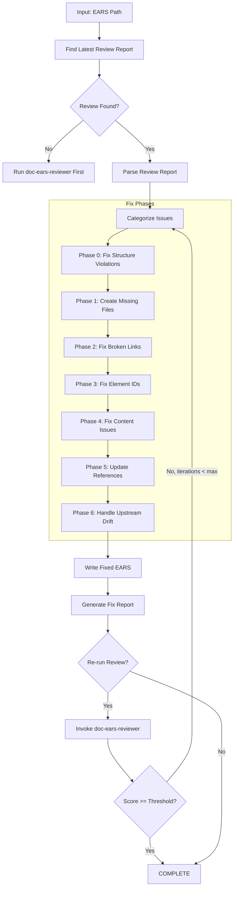
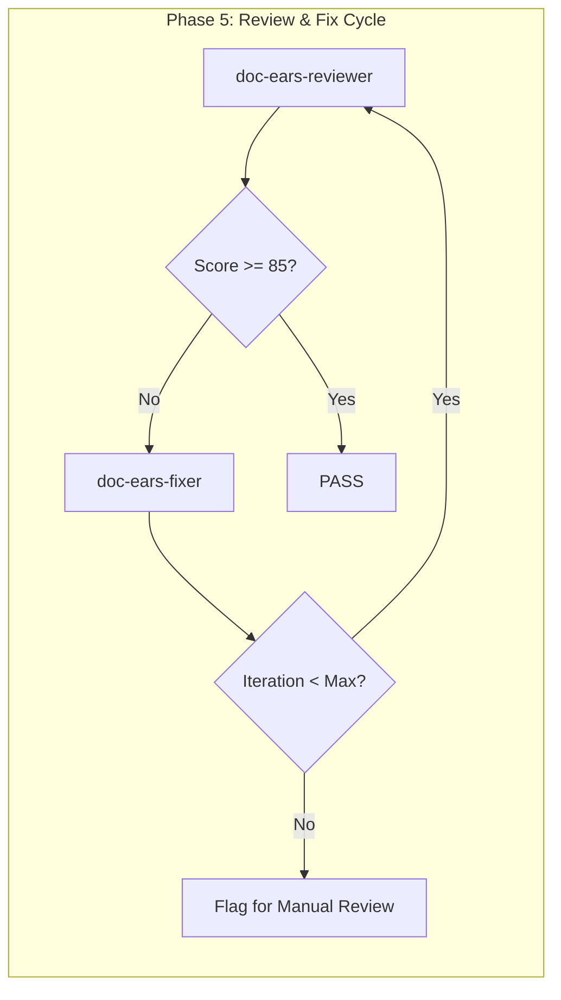

# doc-ears-fixer

## Purpose

Automated **fix skill** that reads the latest review report and applies fixes to EARS (Easy Approach to Requirements Syntax) documents. This skill bridges the gap between `doc-ears-reviewer` (which identifies issues) and the corrected EARS, enabling iterative improvement cycles.

**Layer**: 3 (EARS Quality Improvement)

**Upstream**: EARS document, Review Report (`EARS-NN.R_review_report_vNNN.md`), PRD (source requirements)

**Downstream**: Fixed EARS, Fix Report (`EARS-NN.F_fix_report_vNNN.md`)

---

## When to Use This Skill

Use `doc-ears-fixer` when:

- **After Review**: Run after `doc-ears-reviewer` identifies issues
- **Iterative Improvement**: Part of Review -> Fix -> Review cycle
- **Automated Pipeline**: CI/CD integration for quality gates
- **Batch Fixes**: Apply fixes to multiple EARS based on review reports

**Do NOT use when**:
- No review report exists (run `doc-ears-reviewer` first)
- Creating new EARS (use `doc-ears` or `doc-ears-autopilot`)
- Only need validation (use `doc-ears-validator`)

---

## Skill Dependencies

| Skill | Purpose | When Used |
|-------|---------|-----------|
| `doc-ears-reviewer` | Source of issues to fix | Input (reads review report) |
| `doc-naming` | Element ID standards | Fix element IDs |
| `doc-ears` | EARS creation rules | Create missing sections |
| `doc-prd-reviewer` | Upstream PRD validation | Check upstream alignment |

---

## Workflow Overview



---

## Fix Phases

### Phase 0: Fix Structure Violations (CRITICAL)

Fixes EARS documents that are not in nested folders. This phase runs FIRST because all subsequent phases depend on correct folder structure.

**Nested Folder Rule**: ALL EARS MUST be in nested folders regardless of document size.

**Required Structure**:
| EARS Type | Required Location |
|-----------|-------------------|
| Monolithic | `docs/03_EARS/EARS-NN_{slug}/EARS-NN_{slug}.md` |

**Fix Actions**:

| Issue Code | Issue | Fix Action |
|------------|-------|------------|
| REV-STR001 | EARS not in nested folder | Create folder, move file, update all links |
| REV-STR002 | EARS folder name doesn't match EARS ID | Rename folder to match |
| REV-STR003 | Monolithic EARS >25KB should be sectioned | Flag for manual review |

**Structure Fix Workflow**:

```python
def fix_ears_structure(ears_path: str) -> list[Fix]:
    """Fix EARS structure violations."""
    fixes = []

    filename = os.path.basename(ears_path)
    parent_folder = os.path.dirname(ears_path)

    # Extract EARS ID and slug from filename
    match = re.match(r'EARS-(\d+)_([^/]+)\.md', filename)
    if not match:
        return []  # Cannot auto-fix invalid filename

    ears_id = match.group(1)
    slug = match.group(2)
    expected_folder = f"EARS-{ears_id}_{slug}"

    # Check if already in nested folder
    if os.path.basename(parent_folder) != expected_folder:
        # Create nested folder
        new_folder = os.path.join(os.path.dirname(parent_folder), expected_folder)
        os.makedirs(new_folder, exist_ok=True)

        # Move file
        new_path = os.path.join(new_folder, filename)
        shutil.move(ears_path, new_path)
        fixes.append(f"Moved {ears_path} to {new_path}")

        # Update upstream links in moved file
        content = Path(new_path).read_text()
        updated_content = content.replace('../02_PRD/', '../../02_PRD/')
        updated_content = updated_content.replace('../01_BRD/', '../../01_BRD/')
        Path(new_path).write_text(updated_content)
        fixes.append(f"Updated relative links for nested folder structure")

    return fixes
```

**Link Path Updates After Move**:

| Original Path | Updated Path |
|---------------|--------------|
| `../02_PRD/PRD-01_slug/PRD-01.md` | `../../02_PRD/PRD-01_slug/PRD-01.md` |
| `../01_BRD/BRD-01_slug/BRD-01.md` | `../../01_BRD/BRD-01_slug/BRD-01.md` |

---

### Phase 1: Create Missing Files

Creates files that are referenced but don't exist.

**Scope**:

| Missing File | Action | Template Used |
|--------------|--------|---------------|
| `EARS-00_GLOSSARY.md` | Create EARS glossary | Glossary template |
| `EARS-NN_APPENDIX_*.md` | Create appendix placeholder | Appendix template |
| Pattern library files | Create placeholder with TODO sections | Pattern template |
| Constraint files | Create placeholder | Constraint template |

**EARS Glossary Template**:

```markdown
---
title: "EARS-00: Requirements Glossary"
tags:
  - ears
  - glossary
  - reference
custom_fields:
  document_type: glossary
  artifact_type: EARS-REFERENCE
  layer: 3
---

# EARS-00: Requirements Glossary

Common terminology used across all EARS Requirements Documents.

## EARS Pattern Terms

| Term | Definition | Context |
|------|------------|---------|
| Ubiquitous | Always active requirement | Pattern type |
| Event-Driven | Triggered by specific event | Pattern type |
| Unwanted Behavior | Exception handling requirement | Pattern type |
| State-Driven | Active in specific state | Pattern type |
| Optional Feature | Conditionally included requirement | Pattern type |
| Complex | Multi-condition requirement | Pattern type |

## Requirement Keywords

| Term | Definition | Context |
|------|------------|---------|
| SHALL | Mandatory requirement | Normative |
| SHOULD | Recommended requirement | Advisory |
| MAY | Optional requirement | Permissive |
| MUST | Absolute requirement | Critical |

## Domain Terms

<!-- Add project-specific terminology below -->

| Term | Definition | Context |
|------|------------|---------|
| [Term] | [Definition] | [Where used] |
```

**Pattern Placeholder Template**:

```markdown
---
title: "EARS Pattern: [Pattern Name]"
tags:
  - ears
  - pattern-spec
  - reference
custom_fields:
  document_type: pattern-spec
  status: placeholder
  created_by: doc-ears-fixer
---

# EARS Pattern: [Pattern Name]

> **Status**: Placeholder - Requires completion

## 1. Pattern Overview

[TODO: Document pattern overview]

## 2. Pattern Template

```text
[TODO: Define EARS pattern template]
```

## 3. Pattern Examples

| Example ID | Requirement | Pattern Type |
|------------|-------------|--------------|
| EX-XX-01 | [Example requirement] | [Type] |

## 4. Constraints

[TODO: Document pattern constraints]

---

*Created by doc-ears-fixer as placeholder. Complete this document to resolve broken link issues.*
```

---

### Phase 2: Fix Broken Links

Updates links to point to correct locations.

**Fix Actions**:

| Issue Code | Issue | Fix Action |
|------------|-------|------------|
| REV-L001 | Broken internal link | Update path or create target file |
| REV-L002 | External link unreachable | Add warning comment, keep link |
| REV-L003 | Absolute path used | Convert to relative path |
| REV-L004 | Broken PRD reference | Update to correct PRD path |

**Path Resolution Logic**:

```python
def fix_link_path(ears_location: str, target_path: str) -> str:
    """Calculate correct relative path based on EARS location."""

    # Monolithic EARS: docs/03_EARS/EARS-01.md
    # Sectioned EARS: docs/03_EARS/EARS-01_slug/EARS-01.3_section.md

    if is_sectioned_ears(ears_location):
        # Need to go up one more level
        return "../" + calculate_relative_path(ears_location, target_path)
    else:
        return calculate_relative_path(ears_location, target_path)
```

**PRD Link Fix**:

| EARS Type | Original Link | Fixed Link |
|-----------|---------------|------------|
| Monolithic | `../02_PRD/PRD-01.md` | `../02_PRD/PRD-01.md` |
| Sectioned | `../02_PRD/PRD-01.md` | `../../02_PRD/PRD-01.md` |

---

### Phase 3: Fix Element IDs

Converts invalid element IDs to correct format.

**Conversion Rules**:

| Pattern | Issue | Conversion |
|---------|-------|------------|
| `EARS.NN.01.SS` | Code 01 invalid for EARS | `EARS.NN.25.SS` (EARS Statement) |
| `EARS.NN.22.SS` | Code 22 invalid for EARS | `EARS.NN.26.SS` (Constraint Statement) |
| `REQ-XXX` | Legacy pattern | `EARS.NN.25.SS` |
| `CON-XXX` | Legacy pattern | `EARS.NN.26.SS` |
| `PAT-XXX` | Legacy pattern | `EARS.NN.25.SS` |

**Type Code Mapping** (EARS-specific valid codes: 25, 26):

| Invalid Code | Valid Code | Element Type |
|--------------|------------|--------------|
| 01 | 25 | EARS Statement |
| 02 | 25 | EARS Statement |
| 03 | 26 | Constraint Statement |
| 05 | 25 | EARS Statement |
| 06 | 26 | Constraint Statement |
| 22 | 25 | EARS Statement |
| 33 | 26 | Constraint Statement |

**Regex Patterns**:

```python
# Find element IDs with invalid type codes for EARS
invalid_ears_type_01 = r'EARS\.(\d{2})\.01\.(\d{2})'
replacement_01 = r'EARS.\1.25.\2'

invalid_ears_type_22 = r'EARS\.(\d{2})\.22\.(\d{2})'
replacement_22 = r'EARS.\1.26.\2'

# Find legacy patterns
legacy_req = r'###\s+REQ-(\d+):'
legacy_con = r'###\s+CON-(\d+):'
legacy_pat = r'###\s+PAT-(\d+):'
```

---

### Phase 4: Fix Content Issues

Addresses placeholders, incomplete content, and EARS-specific syntax issues.

**Fix Actions**:

| Issue Code | Issue | Fix Action |
|------------|-------|------------|
| REV-P001 | `[TODO]` placeholder | Flag for manual completion (cannot auto-fix) |
| REV-P002 | `[TBD]` placeholder | Flag for manual completion (cannot auto-fix) |
| REV-P003 | Template date `YYYY-MM-DD` | Replace with current date |
| REV-P004 | Template name `[Name]` | Replace with metadata author or flag |
| REV-P005 | Empty section | Add minimum template content |
| REV-E001 | Missing EARS keyword (shall/should/may) | Flag for manual review |
| REV-E002 | Invalid EARS pattern structure | Flag for manual review |
| REV-E003 | Missing trigger condition | Flag for manual review |

**Auto-Replacements**:

```python
replacements = {
    'YYYY-MM-DDTHH:MM:SS': datetime.now().strftime('%Y-%m-%dT%H:%M:%S'),
    'YYYY-MM-DD': datetime.now().strftime('%Y-%m-%d'),
    'MM/DD/YYYY': datetime.now().strftime('%m/%d/%Y'),
    '[Current date]': datetime.now().strftime('%Y-%m-%dT%H:%M:%S'),
    '[System Name]': extract_system_name_from_metadata(),
}
```

**EARS Pattern Validation**:

| Pattern Type | Required Structure | Auto-Fix |
|--------------|-------------------|----------|
| Ubiquitous | "The [system] shall [action]" | No (flag) |
| Event-Driven | "When [trigger], the [system] shall [action]" | No (flag) |
| State-Driven | "While [state], the [system] shall [action]" | No (flag) |
| Unwanted | "If [condition], then the [system] shall [action]" | No (flag) |
| Optional | "Where [feature], the [system] shall [action]" | No (flag) |

---

### Phase 5: Update References

Ensures traceability and cross-references are correct.

**Fix Actions**:

| Issue | Fix Action |
|-------|------------|
| Missing `@ref:` for created files | Add reference tag |
| Incorrect cross-EARS path | Update to correct relative path |
| Missing PRD traceability | Add PRD reference with `@trace: PRD-NN` |
| Missing traceability entry | Add to traceability matrix |

**Traceability Format**:

```markdown
<!-- Traceability to PRD -->
@trace: PRD-01.22.01 -> EARS-01.25.01

<!-- Reference to upstream -->
@ref: [PRD-01 Section 3](../02_PRD/PRD-01.md#3-feature-requirements)
```

---

### Phase 6: Handle Upstream Drift (Auto-Merge)

Addresses issues where upstream PRD documents have changed since EARS creation. This phase implements a tiered auto-merge system based on drift percentage.

**Upstream**: PRD (Layer 2)
**Downstream**: BDD (Layer 4)
**ID Pattern**: `EARS.NN.TT.SS` (e.g., `EARS.01.25.13`)

#### Drift Issue Codes (from `doc-ears-reviewer` Check #9)

| Code | Severity | Description | Auto-Fix Tier |
|------|----------|-------------|---------------|
| REV-D001 | Warning | PRD modified after EARS | Tier 1-2 |
| REV-D002 | Warning | Referenced PRD section content changed | Tier 1-3 |
| REV-D003 | Info | PRD version incremented | Tier 1 |
| REV-D004 | Info | New features added to PRD | Tier 1-2 |
| REV-D005 | Error | Critical PRD modification (>20% change) | Tier 3 |

#### Tiered Auto-Merge System

**Tier Classification**:

| Tier | Change % | Auto-Merge | Version Action | Description |
|------|----------|------------|----------------|-------------|
| Tier 1 | < 5% | Full auto-merge | Patch (+0.0.1) | Additions, threshold updates |
| Tier 2 | 5-15% | Auto-merge with changelog | Minor (+0.1.0) | Significant additions, minor modifications |
| Tier 3 | > 15% | Archive + regenerate | Major (+1.0.0) | Structural changes, major content drift |

#### Change Percentage Calculation

```python
def calculate_drift_percentage(
    upstream_current: str,
    upstream_cached: str,
    referenced_sections: list[str]
) -> float:
    """
    Calculate drift percentage between cached and current upstream.

    Args:
        upstream_current: Current PRD content
        upstream_cached: Cached PRD content from last sync
        referenced_sections: List of PRD sections referenced by EARS

    Returns:
        Drift percentage (0.0 - 100.0)
    """
    # Extract referenced sections only
    current_sections = extract_sections(upstream_current, referenced_sections)
    cached_sections = extract_sections(upstream_cached, referenced_sections)

    # Calculate line-based diff
    diff = unified_diff(cached_sections.splitlines(), current_sections.splitlines())

    added_lines = sum(1 for line in diff if line.startswith('+') and not line.startswith('+++'))
    removed_lines = sum(1 for line in diff if line.startswith('-') and not line.startswith('---'))
    total_lines = max(len(cached_sections.splitlines()), 1)

    # Weighted calculation: additions weighted 1.0, removals weighted 1.5
    drift_score = (added_lines * 1.0 + removed_lines * 1.5) / total_lines * 100

    return min(drift_score, 100.0)

def determine_tier(drift_percentage: float) -> int:
    """Determine merge tier based on drift percentage."""
    if drift_percentage < 5.0:
        return 1
    elif drift_percentage <= 15.0:
        return 2
    else:
        return 3
```

#### Tier 1: Auto-Merge (< 5% Drift)

**Trigger Conditions**:
- Minor additions to PRD sections
- Threshold/limit updates
- Clarification text additions
- No structural changes

**Auto-Merge Actions**:

| Change Type | Action | ID Assignment |
|-------------|--------|---------------|
| New requirement in PRD | Add EARS statement | Next sequential ID (e.g., `EARS.01.25.13`) |
| Updated threshold | Update constraint value | Keep existing ID |
| Added clarification | Append to existing statement | Keep existing ID |

**ID Generation for New Requirements**:

```python
def generate_next_ears_id(ears_doc: str, type_code: str = "25") -> str:
    """
    Generate next sequential EARS ID.

    ID Pattern: EARS.NN.TT.SS
    - NN: Document number (01-99)
    - TT: Type code (25=Statement, 26=Constraint)
    - SS: Sequence number (01-99)

    Args:
        ears_doc: Path to EARS document
        type_code: Type code ("25" for statement, "26" for constraint)

    Returns:
        Next available EARS ID
    """
    # Extract document number from filename
    doc_num = extract_doc_number(ears_doc)  # e.g., "01" from "EARS-01.md"

    # Find highest existing sequence for this type
    pattern = rf'EARS\.{doc_num}\.{type_code}\.(\d{{2}})'
    existing_ids = re.findall(pattern, read_file(ears_doc))

    if existing_ids:
        max_seq = max(int(seq) for seq in existing_ids)
        next_seq = str(max_seq + 1).zfill(2)
    else:
        next_seq = "01"

    return f"EARS.{doc_num}.{type_code}.{next_seq}"
```

**Version Update**:

```python
# Tier 1: Increment patch version
# 1.0.0 -> 1.0.1
current_version = "1.0.0"
new_version = increment_version(current_version, "patch")  # "1.0.1"
```

#### Tier 2: Auto-Merge with Changelog (5-15% Drift)

**Trigger Conditions**:
- Multiple new features in PRD
- Section reorganization (minor)
- Requirement refinements
- New constraint categories

**Auto-Merge Actions**:

| Change Type | Action | Documentation |
|-------------|--------|---------------|
| New feature section | Generate EARS statements | Changelog entry |
| Modified requirements | Update existing statements | Changelog + diff |
| New constraints | Add constraint statements | Changelog entry |

**Changelog Entry Format**:

```markdown
## Changelog Entry (Auto-Merge Tier 2)

**Date**: 2026-02-10T16:00:00
**Source**: PRD-01.md (v1.2.0 -> v1.3.0)
**Drift Percentage**: 8.3%

### Additions

| New ID | Statement Summary | Source PRD Section |
|--------|-------------------|-------------------|
| EARS.01.25.13 | System shall support batch processing | PRD-01 Section 5.2 |
| EARS.01.25.14 | System shall provide progress notifications | PRD-01 Section 5.3 |
| EARS.01.26.05 | Response time constraint for batch ops | PRD-01 Section 7.1 |

### Modifications

| ID | Previous | Updated | Reason |
|----|----------|---------|--------|
| EARS.01.25.07 | "within 100ms" | "within 50ms" | Performance threshold tightened |

### No Deletions (See No-Deletion Policy)
```

**Version Update**:

```python
# Tier 2: Increment minor version
# 1.0.1 -> 1.1.0
current_version = "1.0.1"
new_version = increment_version(current_version, "minor")  # "1.1.0"
```

#### Tier 3: Archive and Regenerate (> 15% Drift)

**Trigger Conditions**:
- Major PRD restructuring
- Feature scope changes
- Fundamental requirement changes
- More than 15% content drift

**Archive Process**:

1. **Create Archive Manifest**:

```markdown
---
title: "EARS-NN Archive Manifest"
tags:
  - ears
  - archive
  - drift-management
custom_fields:
  archive_date: "2026-02-10T16:00:00"
  archived_version: "1.1.0"
  drift_percentage: 23.5
  trigger: "Tier 3 - Major Drift"
  upstream_source: "PRD-01.md v2.0.0"
---

# EARS-NN Archive Manifest

## Archive Details

| Field | Value |
|-------|-------|
| Archive Date | 2026-02-10T16:00:00 |
| Archived Version | 1.1.0 |
| Archive Location | `archive/EARS-01_v1.1.0_20260210/` |
| Drift Percentage | 23.5% |
| Reason | Major PRD restructuring |

## Archived Files

| File | Original Location | Archive Location |
|------|-------------------|------------------|
| EARS-01.md | docs/03_EARS/ | archive/EARS-01_v1.1.0_20260210/ |
| EARS-01.1_core.md | docs/03_EARS/EARS-01_slug/ | archive/EARS-01_v1.1.0_20260210/ |
| EARS-01.2_requirements.md | docs/03_EARS/EARS-01_slug/ | archive/EARS-01_v1.1.0_20260210/ |

## Regeneration Instructions

1. Run `/doc-ears-autopilot PRD-01` to generate new EARS
2. New version will be 2.0.0
3. Review archived statements for potential reuse
4. Update downstream BDD references
```

2. **Move to Archive**:

```python
def archive_ears_document(ears_path: str, version: str, drift_pct: float) -> str:
    """
    Archive EARS document before regeneration.

    Args:
        ears_path: Path to EARS document
        version: Current version being archived
        drift_pct: Drift percentage that triggered archive

    Returns:
        Archive directory path
    """
    timestamp = datetime.now().strftime('%Y%m%d')
    archive_dir = f"archive/EARS-{doc_num}_v{version}_{timestamp}/"

    # Create archive directory
    os.makedirs(archive_dir, exist_ok=True)

    # Copy all EARS files
    for ears_file in glob(f"{ears_dir}/EARS-{doc_num}*"):
        shutil.copy2(ears_file, archive_dir)

    # Generate archive manifest
    generate_archive_manifest(archive_dir, version, drift_pct)

    return archive_dir
```

3. **Trigger Regeneration**:

```python
# Invoke doc-ears-autopilot with major version increment
regeneration_params = {
    "source_prd": "PRD-01",
    "version_override": "2.0.0",
    "archive_reference": archive_dir,
    "preserve_custom_statements": True
}
```

**Version Update**:

```python
# Tier 3: Increment major version
# 1.1.0 -> 2.0.0
current_version = "1.1.0"
new_version = increment_version(current_version, "major")  # "2.0.0"
```

#### No-Deletion Policy

**Critical**: EARS requirements are NEVER deleted during auto-merge. Items removed from upstream PRD are marked as deprecated.

**Deprecation Marker Format**:

```markdown
### EARS.01.25.05 [DEPRECATED]

> **Deprecation Date**: 2026-02-10
> **Reason**: Removed from PRD-01 v1.3.0 (Section 4.2 deleted)
> **Downstream Impact**: BDD-01.2 scenarios affected

**Original Statement**:
When the user initiates export, the system shall generate CSV output within 5 seconds.

**Status**: Deprecated - Do not implement. Retained for traceability.
```

**Deprecation Tracking**:

```python
def mark_deprecated(
    ears_id: str,
    reason: str,
    upstream_ref: str,
    downstream_refs: list[str]
) -> None:
    """
    Mark EARS requirement as deprecated instead of deleting.

    Args:
        ears_id: EARS ID to deprecate (e.g., "EARS.01.25.05")
        reason: Reason for deprecation
        upstream_ref: PRD reference that triggered deprecation
        downstream_refs: List of downstream BDD references affected
    """
    deprecation_block = f"""
### {ears_id} [DEPRECATED]

> **Deprecation Date**: {datetime.now().strftime('%Y-%m-%d')}
> **Reason**: {reason}
> **Upstream Reference**: {upstream_ref}
> **Downstream Impact**: {', '.join(downstream_refs) if downstream_refs else 'None identified'}

**Status**: Deprecated - Do not implement. Retained for traceability.
"""
    # Insert deprecation block, preserve original statement
```

#### Enhanced Drift Cache

After processing drift issues, update `.drift_cache.json`:

```json
{
  "ears_document": "EARS-01",
  "ears_version": "1.1.0",
  "ears_updated": "2026-02-10T16:00:00",
  "drift_reviewed": "2026-02-10T16:00:00",
  "upstream": {
    "document": "PRD-01.md",
    "version": "1.3.0",
    "last_sync": "2026-02-10T16:00:00"
  },
  "downstream": {
    "documents": ["BDD-01.md"],
    "notification_sent": "2026-02-10T16:05:00"
  },
  "section_hashes": {
    "PRD-01#section-3": "a1b2c3d4e5f6...",
    "PRD-01#section-5": "g7h8i9j0k1l2...",
    "PRD-01#section-7": "m3n4o5p6q7r8..."
  },
  "merge_history": [
    {
      "date": "2026-02-10T16:00:00",
      "tier": 2,
      "drift_percentage": 8.3,
      "version_before": "1.0.1",
      "version_after": "1.1.0",
      "additions": ["EARS.01.25.13", "EARS.01.25.14", "EARS.01.26.05"],
      "modifications": ["EARS.01.25.07"],
      "deprecations": []
    }
  ],
  "acknowledged_drift": [
    {
      "document": "PRD-01.md",
      "section": "section-8",
      "acknowledged_date": "2026-02-08",
      "reason": "Informational section - no EARS impact"
    }
  ]
}
```

#### Drift Acknowledgment Workflow

When drift is flagged but no EARS update is needed:

1. Run `/doc-ears-fixer EARS-01 --acknowledge-drift`
2. Fixer prompts: "Review drift for PRD-01.md Section 8?"
3. User confirms no EARS changes needed
4. Fixer adds to `acknowledged_drift` array
5. Future reviews skip this drift until upstream changes again

#### Downstream Notification

After any auto-merge, notify downstream BDD documents:

```python
def notify_downstream(ears_id: str, changes: list[dict]) -> None:
    """
    Create notification for downstream BDD documents.

    Args:
        ears_id: EARS document ID (e.g., "EARS-01")
        changes: List of changes made during auto-merge
    """
    notification = {
        "type": "UPSTREAM_CHANGE",
        "source": ears_id,
        "timestamp": datetime.now().isoformat(),
        "changes": changes,
        "action_required": "Run /doc-bdd-fixer to sync"
    }

    # Write to .downstream_notifications.json
    write_notification(f"docs/04_BDD/.downstream_notifications.json", notification)
```

---

## Command Usage

### Basic Usage

```bash
# Fix EARS based on latest review
/doc-ears-fixer EARS-01

# Fix with explicit review report
/doc-ears-fixer EARS-01 --review-report EARS-01.R_review_report_v001.md

# Fix and re-run review
/doc-ears-fixer EARS-01 --revalidate

# Fix with iteration limit
/doc-ears-fixer EARS-01 --revalidate --max-iterations 3
```

### Options

| Option | Default | Description |
|--------|---------|-------------|
| `--review-report` | latest | Specific review report to use |
| `--revalidate` | false | Run reviewer after fixes |
| `--max-iterations` | 3 | Max fix-review cycles |
| `--fix-types` | all | Specific fix types (comma-separated) |
| `--create-missing` | true | Create missing reference files |
| `--backup` | true | Backup EARS before fixing |
| `--dry-run` | false | Preview fixes without applying |
| `--acknowledge-drift` | false | Interactive drift acknowledgment mode |
| `--update-drift-cache` | true | Update .drift_cache.json after fixes |
| `--auto-merge-tier` | auto | Force specific tier (1, 2, 3, or auto) |
| `--skip-archive` | false | Skip archiving for Tier 3 (regenerate in-place) |
| `--notify-downstream` | true | Send notifications to downstream BDD documents |
| `--preserve-deprecated` | true | Keep deprecated items (no-deletion policy) |

### Fix Types

| Type | Description |
|------|-------------|
| `missing_files` | Create missing glossary, pattern, constraint docs |
| `broken_links` | Fix link paths |
| `element_ids` | Convert invalid/legacy element IDs |
| `content` | Fix placeholders, dates, names |
| `references` | Update traceability and cross-references |
| `drift` | Handle upstream drift detection issues |
| `auto_merge` | Apply tiered auto-merge for upstream changes |
| `deprecate` | Mark removed upstream items as deprecated |
| `all` | All fix types (default) |

---

## Output Artifacts

### Fix Report

**Nested Folder Rule**: ALL EARS use nested folders (`EARS-NN_{slug}/`) regardless of size. Fix reports are stored alongside the EARS document in the nested folder.

**File Naming**: `EARS-NN.F_fix_report_vNNN.md`

**Location**: Inside the EARS nested folder: `docs/03_EARS/EARS-NN_{slug}/`

**Structure**:

```markdown
---
title: "EARS-NN.F: Fix Report v001"
tags:
  - ears
  - fix-report
  - quality-assurance
custom_fields:
  document_type: fix-report
  artifact_type: EARS-FIX
  layer: 3
  parent_doc: EARS-NN
  source_review: EARS-NN.R_review_report_v001.md
  fix_date: "YYYY-MM-DDTHH:MM:SS"
  fix_tool: doc-ears-fixer
  fix_version: "1.0"
---

# EARS-NN Fix Report v001

## Summary

| Metric | Value |
|--------|-------|
| Source Review | EARS-NN.R_review_report_v001.md |
| Issues in Review | 12 |
| Issues Fixed | 10 |
| Issues Remaining | 2 (manual review required) |
| Files Created | 2 |
| Files Modified | 4 |

## Files Created

| File | Type | Location |
|------|------|----------|
| EARS-00_GLOSSARY.md | Requirements Glossary | docs/03_EARS/ |
| EARS-01_PATTERN_LIB.md | Pattern Library Placeholder | docs/03_EARS/ |

## Fixes Applied

| # | Issue Code | Issue | Fix Applied | File |
|---|------------|-------|-------------|------|
| 1 | REV-L001 | Broken glossary link | Created EARS-00_GLOSSARY.md | EARS-01.3_constraints.md |
| 2 | REV-L004 | Broken PRD reference | Updated path to ../02_PRD/PRD-01.md | EARS-01.1_core.md |
| 3 | REV-N004 | Element type 01 invalid | Converted to type 25 | EARS-01.1_core.md |
| 4 | REV-L003 | Absolute path used | Converted to relative | EARS-01.2_requirements.md |

## Issues Requiring Manual Review

| # | Issue Code | Issue | Location | Reason |
|---|------------|-------|----------|--------|
| 1 | REV-E001 | Missing EARS keyword | EARS-01.2:L45 | Requirement syntax needed |
| 2 | REV-E002 | Invalid pattern structure | EARS-01.2:L120 | Pattern refinement required |

## Validation After Fix

| Metric | Before | After | Delta |
|--------|--------|-------|-------|
| Review Score | 92 | 97 | +5 |
| Errors | 2 | 0 | -2 |
| Warnings | 4 | 1 | -3 |

## Next Steps

1. Complete EARS-01_PATTERN_LIB.md placeholder
2. Address missing EARS keywords in flagged requirements
3. Run `/doc-ears-reviewer EARS-01` to verify fixes
```

---

## Integration with Autopilot

This skill is invoked by `doc-ears-autopilot` in the Review -> Fix cycle:



**Autopilot Integration Points**:

| Phase | Action | Skill |
|-------|--------|-------|
| Phase 5a | Run initial review | `doc-ears-reviewer` |
| Phase 5b | Apply fixes if issues found | `doc-ears-fixer` |
| Phase 5c | Re-run review | `doc-ears-reviewer` |
| Phase 5d | Repeat until pass or max iterations | Loop |

---

## Error Handling

### Recovery Actions

| Error | Action |
|-------|--------|
| Review report not found | Prompt to run `doc-ears-reviewer` first |
| Cannot create file (permissions) | Log error, continue with other fixes |
| Cannot parse review report | Abort with clear error message |
| Max iterations exceeded | Generate report, flag for manual review |
| PRD not found | Log warning, skip PRD-dependent fixes |

### Backup Strategy

Before applying any fixes:

1. Create backup in `tmp/backup/EARS-NN_YYYYMMDD_HHMMSS/`
2. Copy all EARS files to backup location
3. Apply fixes to original files
4. If error during fix, restore from backup

---

## Related Skills

| Skill | Relationship |
|-------|--------------|
| `doc-ears-reviewer` | Provides review report (input) |
| `doc-ears-autopilot` | Orchestrates Review -> Fix cycle |
| `doc-ears-validator` | Structural validation |
| `doc-naming` | Element ID standards |
| `doc-ears` | EARS creation rules |
| `doc-prd-reviewer` | Upstream PRD validation |

---

## Version History

| Version | Date | Changes |
|---------|------|---------|
| 2.1 | 2026-02-11 | **Structure Compliance**: Added Phase 0 for nested folder rule enforcement (REV-STR001-STR003); Runs FIRST before other fix phases |
| 2.0 | 2026-02-10 | Enhanced Phase 6 with tiered auto-merge system; Tier 1 (< 5%): auto-merge additions with patch version; Tier 2 (5-15%): auto-merge with changelog and minor version; Tier 3 (> 15%): archive + regenerate with major version; No-deletion policy with deprecation markers; Auto-generated IDs (EARS.NN.TT.SS pattern); Enhanced drift cache with merge history; Downstream BDD notification system |
| 1.0 | 2026-02-10 | Initial skill creation; 6-phase fix workflow; Glossary and pattern file creation; Element ID conversion for EARS codes (25, 26); Broken link fixes; PRD drift detection; EARS pattern syntax validation; Integration with autopilot Review->Fix cycle |
