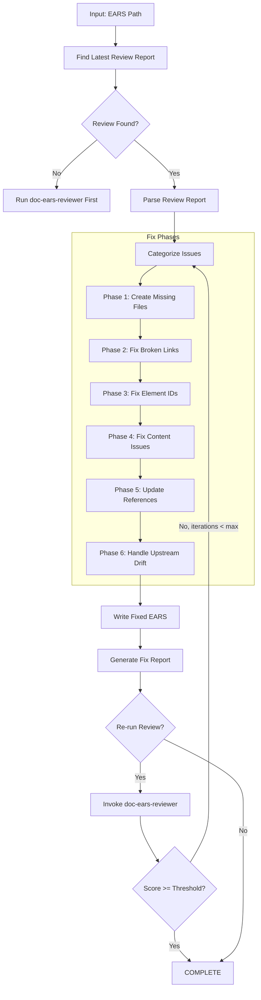
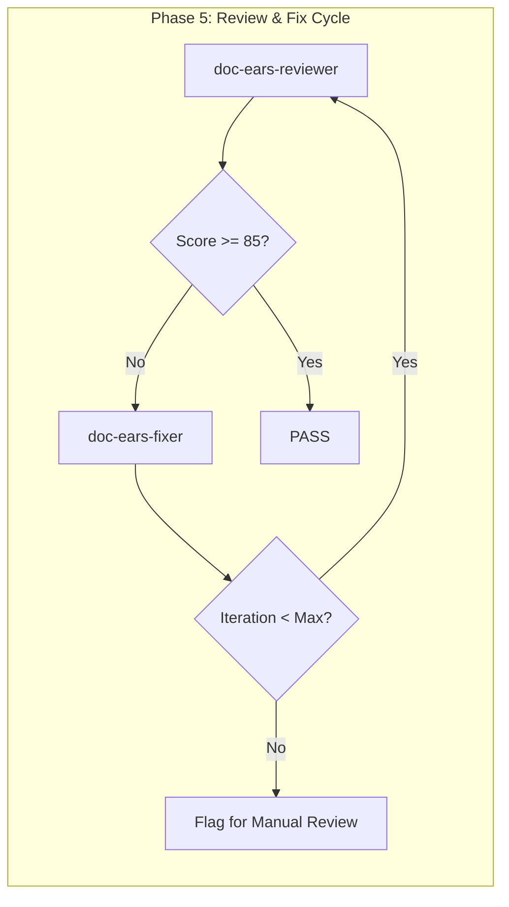

# doc-ears-fixer

## Purpose

Automated **fix skill** that reads the latest review report and applies fixes to EARS (Easy Approach to Requirements Syntax) documents. This skill bridges the gap between `doc-ears-reviewer` (which identifies issues) and the corrected EARS, enabling iterative improvement cycles.

**Layer**: 3 (EARS Quality Improvement)

**Upstream**: EARS document, Review Report (`EARS-NN.R_review_report_vNNN.md`), PRD (source requirements)

**Downstream**: Fixed EARS, Fix Report (`EARS-NN.F_fix_report_vNNN.md`)

---

## When to Use This Skill

Use `doc-ears-fixer` when:

- **After Review**: Run after `doc-ears-reviewer` identifies issues
- **Iterative Improvement**: Part of Review -> Fix -> Review cycle
- **Automated Pipeline**: CI/CD integration for quality gates
- **Batch Fixes**: Apply fixes to multiple EARS based on review reports

**Do NOT use when**:
- No review report exists (run `doc-ears-reviewer` first)
- Creating new EARS (use `doc-ears` or `doc-ears-autopilot`)
- Only need validation (use `doc-ears-validator`)

---

## Skill Dependencies

| Skill | Purpose | When Used |
|-------|---------|-----------|
| `doc-ears-reviewer` | Source of issues to fix | Input (reads review report) |
| `doc-naming` | Element ID standards | Fix element IDs |
| `doc-ears` | EARS creation rules | Create missing sections |
| `doc-prd-reviewer` | Upstream PRD validation | Check upstream alignment |

---

## Workflow Overview



---

## Fix Phases

### Phase 1: Create Missing Files

Creates files that are referenced but don't exist.

**Scope**:

| Missing File | Action | Template Used |
|--------------|--------|---------------|
| `EARS-00_GLOSSARY.md` | Create EARS glossary | Glossary template |
| `EARS-NN_APPENDIX_*.md` | Create appendix placeholder | Appendix template |
| Pattern library files | Create placeholder with TODO sections | Pattern template |
| Constraint files | Create placeholder | Constraint template |

**EARS Glossary Template**:

```markdown
---
title: "EARS-00: Requirements Glossary"
tags:
  - ears
  - glossary
  - reference
custom_fields:
  document_type: glossary
  artifact_type: EARS-REFERENCE
  layer: 3
---

# EARS-00: Requirements Glossary

Common terminology used across all EARS Requirements Documents.

## EARS Pattern Terms

| Term | Definition | Context |
|------|------------|---------|
| Ubiquitous | Always active requirement | Pattern type |
| Event-Driven | Triggered by specific event | Pattern type |
| Unwanted Behavior | Exception handling requirement | Pattern type |
| State-Driven | Active in specific state | Pattern type |
| Optional Feature | Conditionally included requirement | Pattern type |
| Complex | Multi-condition requirement | Pattern type |

## Requirement Keywords

| Term | Definition | Context |
|------|------------|---------|
| SHALL | Mandatory requirement | Normative |
| SHOULD | Recommended requirement | Advisory |
| MAY | Optional requirement | Permissive |
| MUST | Absolute requirement | Critical |

## Domain Terms

<!-- Add project-specific terminology below -->

| Term | Definition | Context |
|------|------------|---------|
| [Term] | [Definition] | [Where used] |
```

**Pattern Placeholder Template**:

```markdown
---
title: "EARS Pattern: [Pattern Name]"
tags:
  - ears
  - pattern-spec
  - reference
custom_fields:
  document_type: pattern-spec
  status: placeholder
  created_by: doc-ears-fixer
---

# EARS Pattern: [Pattern Name]

> **Status**: Placeholder - Requires completion

## 1. Pattern Overview

[TODO: Document pattern overview]

## 2. Pattern Template

```text
[TODO: Define EARS pattern template]
```

## 3. Pattern Examples

| Example ID | Requirement | Pattern Type |
|------------|-------------|--------------|
| EX-XX-01 | [Example requirement] | [Type] |

## 4. Constraints

[TODO: Document pattern constraints]

---

*Created by doc-ears-fixer as placeholder. Complete this document to resolve broken link issues.*
```

---

### Phase 2: Fix Broken Links

Updates links to point to correct locations.

**Fix Actions**:

| Issue Code | Issue | Fix Action |
|------------|-------|------------|
| REV-L001 | Broken internal link | Update path or create target file |
| REV-L002 | External link unreachable | Add warning comment, keep link |
| REV-L003 | Absolute path used | Convert to relative path |
| REV-L004 | Broken PRD reference | Update to correct PRD path |

**Path Resolution Logic**:

```python
def fix_link_path(ears_location: str, target_path: str) -> str:
    """Calculate correct relative path based on EARS location."""

    # Monolithic EARS: docs/03_EARS/EARS-01.md
    # Sectioned EARS: docs/03_EARS/EARS-01_slug/EARS-01.3_section.md

    if is_sectioned_ears(ears_location):
        # Need to go up one more level
        return "../" + calculate_relative_path(ears_location, target_path)
    else:
        return calculate_relative_path(ears_location, target_path)
```

**PRD Link Fix**:

| EARS Type | Original Link | Fixed Link |
|-----------|---------------|------------|
| Monolithic | `../02_PRD/PRD-01.md` | `../02_PRD/PRD-01.md` |
| Sectioned | `../02_PRD/PRD-01.md` | `../../02_PRD/PRD-01.md` |

---

### Phase 3: Fix Element IDs

Converts invalid element IDs to correct format.

**Conversion Rules**:

| Pattern | Issue | Conversion |
|---------|-------|------------|
| `EARS.NN.01.SS` | Code 01 invalid for EARS | `EARS.NN.25.SS` (EARS Statement) |
| `EARS.NN.22.SS` | Code 22 invalid for EARS | `EARS.NN.26.SS` (Constraint Statement) |
| `REQ-XXX` | Legacy pattern | `EARS.NN.25.SS` |
| `CON-XXX` | Legacy pattern | `EARS.NN.26.SS` |
| `PAT-XXX` | Legacy pattern | `EARS.NN.25.SS` |

**Type Code Mapping** (EARS-specific valid codes: 25, 26):

| Invalid Code | Valid Code | Element Type |
|--------------|------------|--------------|
| 01 | 25 | EARS Statement |
| 02 | 25 | EARS Statement |
| 03 | 26 | Constraint Statement |
| 05 | 25 | EARS Statement |
| 06 | 26 | Constraint Statement |
| 22 | 25 | EARS Statement |
| 33 | 26 | Constraint Statement |

**Regex Patterns**:

```python
# Find element IDs with invalid type codes for EARS
invalid_ears_type_01 = r'EARS\.(\d{2})\.01\.(\d{2})'
replacement_01 = r'EARS.\1.25.\2'

invalid_ears_type_22 = r'EARS\.(\d{2})\.22\.(\d{2})'
replacement_22 = r'EARS.\1.26.\2'

# Find legacy patterns
legacy_req = r'###\s+REQ-(\d+):'
legacy_con = r'###\s+CON-(\d+):'
legacy_pat = r'###\s+PAT-(\d+):'
```

---

### Phase 4: Fix Content Issues

Addresses placeholders, incomplete content, and EARS-specific syntax issues.

**Fix Actions**:

| Issue Code | Issue | Fix Action |
|------------|-------|------------|
| REV-P001 | `[TODO]` placeholder | Flag for manual completion (cannot auto-fix) |
| REV-P002 | `[TBD]` placeholder | Flag for manual completion (cannot auto-fix) |
| REV-P003 | Template date `YYYY-MM-DD` | Replace with current date |
| REV-P004 | Template name `[Name]` | Replace with metadata author or flag |
| REV-P005 | Empty section | Add minimum template content |
| REV-E001 | Missing EARS keyword (shall/should/may) | Flag for manual review |
| REV-E002 | Invalid EARS pattern structure | Flag for manual review |
| REV-E003 | Missing trigger condition | Flag for manual review |

**Auto-Replacements**:

```python
replacements = {
    'YYYY-MM-DDTHH:MM:SS': datetime.now().strftime('%Y-%m-%dT%H:%M:%S'),
    'YYYY-MM-DD': datetime.now().strftime('%Y-%m-%d'),
    'MM/DD/YYYY': datetime.now().strftime('%m/%d/%Y'),
    '[Current date]': datetime.now().strftime('%Y-%m-%dT%H:%M:%S'),
    '[System Name]': extract_system_name_from_metadata(),
}
```

**EARS Pattern Validation**:

| Pattern Type | Required Structure | Auto-Fix |
|--------------|-------------------|----------|
| Ubiquitous | "The [system] shall [action]" | No (flag) |
| Event-Driven | "When [trigger], the [system] shall [action]" | No (flag) |
| State-Driven | "While [state], the [system] shall [action]" | No (flag) |
| Unwanted | "If [condition], then the [system] shall [action]" | No (flag) |
| Optional | "Where [feature], the [system] shall [action]" | No (flag) |

---

### Phase 5: Update References

Ensures traceability and cross-references are correct.

**Fix Actions**:

| Issue | Fix Action |
|-------|------------|
| Missing `@ref:` for created files | Add reference tag |
| Incorrect cross-EARS path | Update to correct relative path |
| Missing PRD traceability | Add PRD reference with `@trace: PRD-NN` |
| Missing traceability entry | Add to traceability matrix |

**Traceability Format**:

```markdown
<!-- Traceability to PRD -->
@trace: PRD-01.22.01 -> EARS-01.25.01

<!-- Reference to upstream -->
@ref: [PRD-01 Section 3](../02_PRD/PRD-01.md#3-feature-requirements)
```

---

### Phase 6: Handle Upstream Drift

Addresses issues where upstream PRD documents have changed since EARS creation.

**Drift Issue Codes** (from `doc-ears-reviewer` Check #9):

| Code | Severity | Description | Auto-Fix Possible |
|------|----------|-------------|-------------------|
| REV-D001 | Warning | PRD modified after EARS | No (flag for review) |
| REV-D002 | Warning | Referenced PRD section content changed | No (flag for review) |
| REV-D003 | Info | PRD version incremented | Yes (update @ref version) |
| REV-D004 | Info | New features added to PRD | No (flag for review) |
| REV-D005 | Error | Critical PRD modification (>20% change) | No (flag for review) |

**Fix Actions**:

| Issue | Auto-Fix | Action |
|-------|----------|--------|
| REV-D001/D002/D004/D005 | No | Add `[DRIFT]` marker to affected references, generate drift summary |
| REV-D003 (version change) | Yes | Update `@ref:` tag to include current version |

**Drift Marker Format**:

```markdown
<!-- DRIFT: PRD-01.md modified 2026-02-08 (EARS created 2026-02-05) -->
@ref: [PRD-01 Section 3](../02_PRD/PRD-01.md#3-feature-requirements)
```

**Drift Summary Block** (added to Fix Report):

```markdown
## Upstream Drift Summary

| Upstream Document | Reference | Modified | EARS Updated | Days Stale | Action Required |
|-------------------|-----------|----------|--------------|------------|-----------------|
| PRD-01.md | EARS-01.1:L57 | 2026-02-08 | 2026-02-05 | 3 | Review for changes |
| PRD-02.md | EARS-01.3:L319 | 2026-02-10 | 2026-02-05 | 5 | Review feature updates |

**Recommendation**: Review upstream PRD documents and update EARS statements if requirements have changed.
Sections potentially affected:
- EARS-01.1 Section 3 (Functional Requirements)
- EARS-01.3 Section 13.1 (Upstream Dependencies)
```

**Drift Cache Update**:

After processing drift issues, update `.drift_cache.json`:

```json
{
  "ears_version": "1.0",
  "ears_updated": "2026-02-10",
  "drift_reviewed": "2026-02-10",
  "upstream_hashes": {
    "../02_PRD/PRD-01.md#3": "a1b2c3d4...",
    "../02_PRD/PRD-02.md": "e5f6g7h8..."
  },
  "acknowledged_drift": [
    {
      "document": "PRD-01.md",
      "acknowledged_date": "2026-02-10",
      "reason": "Reviewed - no EARS impact"
    }
  ]
}
```

**Drift Acknowledgment Workflow**:

When drift is flagged but no EARS update is needed:

1. Run `/doc-ears-fixer EARS-01 --acknowledge-drift`
2. Fixer prompts: "Review drift for PRD-01.md?"
3. User confirms no EARS changes needed
4. Fixer adds to `acknowledged_drift` array
5. Future reviews skip this drift until upstream changes again

---

## Command Usage

### Basic Usage

```bash
# Fix EARS based on latest review
/doc-ears-fixer EARS-01

# Fix with explicit review report
/doc-ears-fixer EARS-01 --review-report EARS-01.R_review_report_v001.md

# Fix and re-run review
/doc-ears-fixer EARS-01 --revalidate

# Fix with iteration limit
/doc-ears-fixer EARS-01 --revalidate --max-iterations 3
```

### Options

| Option | Default | Description |
|--------|---------|-------------|
| `--review-report` | latest | Specific review report to use |
| `--revalidate` | false | Run reviewer after fixes |
| `--max-iterations` | 3 | Max fix-review cycles |
| `--fix-types` | all | Specific fix types (comma-separated) |
| `--create-missing` | true | Create missing reference files |
| `--backup` | true | Backup EARS before fixing |
| `--dry-run` | false | Preview fixes without applying |
| `--acknowledge-drift` | false | Interactive drift acknowledgment mode |
| `--update-drift-cache` | true | Update .drift_cache.json after fixes |

### Fix Types

| Type | Description |
|------|-------------|
| `missing_files` | Create missing glossary, pattern, constraint docs |
| `broken_links` | Fix link paths |
| `element_ids` | Convert invalid/legacy element IDs |
| `content` | Fix placeholders, dates, names |
| `references` | Update traceability and cross-references |
| `drift` | Handle upstream drift detection issues |
| `all` | All fix types (default) |

---

## Output Artifacts

### Fix Report

**File Naming**: `EARS-NN.F_fix_report_vNNN.md`

**Location**: Same folder as the EARS document.

**Structure**:

```markdown
---
title: "EARS-NN.F: Fix Report v001"
tags:
  - ears
  - fix-report
  - quality-assurance
custom_fields:
  document_type: fix-report
  artifact_type: EARS-FIX
  layer: 3
  parent_doc: EARS-NN
  source_review: EARS-NN.R_review_report_v001.md
  fix_date: "YYYY-MM-DDTHH:MM:SS"
  fix_tool: doc-ears-fixer
  fix_version: "1.0"
---

# EARS-NN Fix Report v001

## Summary

| Metric | Value |
|--------|-------|
| Source Review | EARS-NN.R_review_report_v001.md |
| Issues in Review | 12 |
| Issues Fixed | 10 |
| Issues Remaining | 2 (manual review required) |
| Files Created | 2 |
| Files Modified | 4 |

## Files Created

| File | Type | Location |
|------|------|----------|
| EARS-00_GLOSSARY.md | Requirements Glossary | docs/03_EARS/ |
| EARS-01_PATTERN_LIB.md | Pattern Library Placeholder | docs/03_EARS/ |

## Fixes Applied

| # | Issue Code | Issue | Fix Applied | File |
|---|------------|-------|-------------|------|
| 1 | REV-L001 | Broken glossary link | Created EARS-00_GLOSSARY.md | EARS-01.3_constraints.md |
| 2 | REV-L004 | Broken PRD reference | Updated path to ../02_PRD/PRD-01.md | EARS-01.1_core.md |
| 3 | REV-N004 | Element type 01 invalid | Converted to type 25 | EARS-01.1_core.md |
| 4 | REV-L003 | Absolute path used | Converted to relative | EARS-01.2_requirements.md |

## Issues Requiring Manual Review

| # | Issue Code | Issue | Location | Reason |
|---|------------|-------|----------|--------|
| 1 | REV-E001 | Missing EARS keyword | EARS-01.2:L45 | Requirement syntax needed |
| 2 | REV-E002 | Invalid pattern structure | EARS-01.2:L120 | Pattern refinement required |

## Validation After Fix

| Metric | Before | After | Delta |
|--------|--------|-------|-------|
| Review Score | 92 | 97 | +5 |
| Errors | 2 | 0 | -2 |
| Warnings | 4 | 1 | -3 |

## Next Steps

1. Complete EARS-01_PATTERN_LIB.md placeholder
2. Address missing EARS keywords in flagged requirements
3. Run `/doc-ears-reviewer EARS-01` to verify fixes
```

---

## Integration with Autopilot

This skill is invoked by `doc-ears-autopilot` in the Review -> Fix cycle:



**Autopilot Integration Points**:

| Phase | Action | Skill |
|-------|--------|-------|
| Phase 5a | Run initial review | `doc-ears-reviewer` |
| Phase 5b | Apply fixes if issues found | `doc-ears-fixer` |
| Phase 5c | Re-run review | `doc-ears-reviewer` |
| Phase 5d | Repeat until pass or max iterations | Loop |

---

## Error Handling

### Recovery Actions

| Error | Action |
|-------|--------|
| Review report not found | Prompt to run `doc-ears-reviewer` first |
| Cannot create file (permissions) | Log error, continue with other fixes |
| Cannot parse review report | Abort with clear error message |
| Max iterations exceeded | Generate report, flag for manual review |
| PRD not found | Log warning, skip PRD-dependent fixes |

### Backup Strategy

Before applying any fixes:

1. Create backup in `tmp/backup/EARS-NN_YYYYMMDD_HHMMSS/`
2. Copy all EARS files to backup location
3. Apply fixes to original files
4. If error during fix, restore from backup

---

## Related Skills

| Skill | Relationship |
|-------|--------------|
| `doc-ears-reviewer` | Provides review report (input) |
| `doc-ears-autopilot` | Orchestrates Review -> Fix cycle |
| `doc-ears-validator` | Structural validation |
| `doc-naming` | Element ID standards |
| `doc-ears` | EARS creation rules |
| `doc-prd-reviewer` | Upstream PRD validation |

---

## Version History

| Version | Date | Changes |
|---------|------|---------|
| 1.0 | 2026-02-10 | Initial skill creation; 6-phase fix workflow; Glossary and pattern file creation; Element ID conversion for EARS codes (25, 26); Broken link fixes; PRD drift detection; EARS pattern syntax validation; Integration with autopilot Review->Fix cycle |
