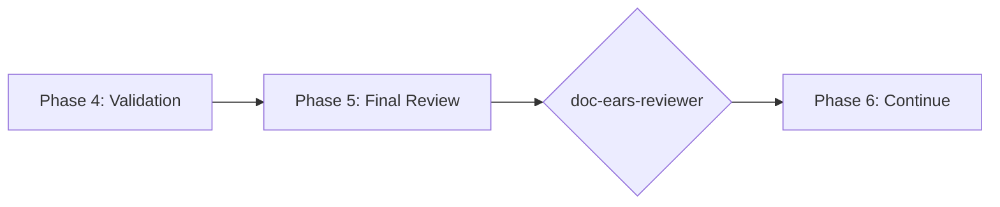

# doc-ears-reviewer

## Purpose

Comprehensive **content review and quality assurance** for EARS (Easy Approach to Requirements Syntax) documents. This skill performs deep content analysis beyond structural validation, checking requirement syntax correctness, PRD alignment, testability, quantifiable thresholds, and identifying issues that require manual review.

**Layer**: 3 (EARS Quality Assurance)

**Upstream**: EARS (from `doc-ears-autopilot` or `doc-ears`)

**Downstream**: None (final QA gate before BDD generation)

---

## When to Use This Skill

Use `doc-ears-reviewer` when:

- **After EARS Generation**: Run immediately after `doc-ears-autopilot` completes
- **Manual EARS Edits**: After making manual changes to EARS
- **Pre-BDD Check**: Before running `doc-bdd-autopilot`
- **Periodic Review**: Regular quality checks on existing EARS
- **CI/CD Integration**: Automated review gate in documentation pipelines

**Do NOT use when**:
- EARS does not exist yet (use `doc-ears` or `doc-ears-autopilot` first)
- Need structural/schema validation only (use `doc-ears-validator`)
- Generating new EARS content (use `doc-ears`)

---

## Skill vs Validator: Key Differences

| Aspect | `doc-ears-validator` | `doc-ears-reviewer` |
|--------|----------------------|---------------------|
| **Focus** | Schema compliance, BDD-Ready score | Content quality, testability |
| **Checks** | Required sections, EARS syntax | Threshold quantification, PRD traceability |
| **Auto-Fix** | Structural issues only | Content issues (syntax, thresholds) |
| **Output** | BDD-Ready score (numeric) | Review score + issue list |
| **Phase** | Phase 4 (Validation) | Phase 5 (Final Review) |
| **Blocking** | BDD-Ready < threshold blocks | Review score < threshold flags |

---

## Review Checks

### 1. EARS Syntax Compliance

Validates all requirements follow correct EARS patterns.

**EARS Patterns**:
- **Ubiquitous**: `THE {system} SHALL {action}`
- **Event-Driven**: `WHEN {event} THE {system} SHALL {action}`
- **State-Driven**: `WHILE {state} THE {system} SHALL {action}`
- **Optional**: `WHERE {feature} THE {system} SHALL {action}`
- **Complex**: `WHEN {event} WHILE {state} THE {system} SHALL {action}`
- **Unwanted**: `IF {condition} THEN THE {system} SHALL {action} WITHIN {time}`

**Error Codes**:

| Code | Severity | Description |
|------|----------|-------------|
| REV-ES001 | Error | Requirement missing SHALL keyword |
| REV-ES002 | Error | WHEN clause without condition |
| REV-ES003 | Warning | Ambiguous subject (system not specified) |
| REV-ES004 | Warning | Action verb not quantifiable |
| REV-ES005 | Info | Complex pattern may be split |

---

### 2. Threshold Quantification

Validates all timing/performance thresholds are specific.

**Scope**:
- WITHIN clauses have numeric values
- Units specified (ms, s, min)
- Consistent with PRD thresholds
- No vague terms ("quickly", "fast", "responsive")

**Error Codes**:

| Code | Severity | Description |
|------|----------|-------------|
| REV-TQ001 | Error | Missing WITHIN clause for time-bound requirement |
| REV-TQ002 | Error | Threshold uses vague term |
| REV-TQ003 | Warning | Threshold inconsistent with PRD |
| REV-TQ004 | Info | Consider adding failure threshold |

---

### 3. PRD Alignment

Validates EARS requirements trace to PRD source.

**Scope**:
- Every EARS requirement maps to PRD requirement
- No orphaned requirements
- No missing requirements (PRD without EARS)
- Feature IDs consistent

**Error Codes**:

| Code | Severity | Description |
|------|----------|-------------|
| REV-PA001 | Error | EARS requirement without PRD source |
| REV-PA002 | Warning | PRD requirement without EARS mapping |
| REV-PA003 | Warning | Feature ID mismatch |
| REV-PA004 | Info | Requirement correctly marked as deferred |

---

### 4. Testability Assessment

Evaluates if requirements can be tested.

**Scope**:
- Measurable outcomes defined
- Pass/fail criteria clear
- Edge cases identified
- Negative cases covered

**Error Codes**:

| Code | Severity | Description |
|------|----------|-------------|
| REV-TA001 | Error | No measurable outcome |
| REV-TA002 | Warning | Pass/fail criteria unclear |
| REV-TA003 | Info | Edge case not covered |
| REV-TA004 | Info | Consider negative test case |

---

### 5. Placeholder Detection

Identifies incomplete content requiring replacement.

**Error Codes**:

| Code | Severity | Description |
|------|----------|-------------|
| REV-P001 | Error | [TODO] placeholder found |
| REV-P002 | Error | [TBD] placeholder found |
| REV-P003 | Warning | Template value not replaced |

---

### 6. Section Completeness

Verifies all required sections have substantive content.

**Error Codes**:

| Code | Severity | Description |
|------|----------|-------------|
| REV-S001 | Error | Required section missing |
| REV-S002 | Warning | Section below minimum content |
| REV-S003 | Warning | Table has no data rows |

---

### 7. Naming Compliance

Validates element IDs follow `doc-naming` standards.

**Scope**:
- Element IDs use `EARS.NN.TT.SS` format
- Element type codes valid for EARS (25, 26)
- No legacy patterns (REQ-NNN, R-NNN)

**Error Codes**:

| Code | Severity | Description |
|------|----------|-------------|
| REV-N001 | Error | Invalid element ID format |
| REV-N002 | Error | Element type code not valid for EARS |
| REV-N003 | Error | Legacy pattern detected |

---

## Review Score Calculation

**Scoring Formula**:

| Category | Weight | Calculation |
|----------|--------|-------------|
| EARS Syntax Compliance | 25% | (valid_syntax / total_reqs) × 25 |
| Threshold Quantification | 20% | (quantified / requiring_threshold) × 20 |
| PRD Alignment | 20% | (aligned_reqs / total_reqs) × 20 |
| Testability Assessment | 15% | (testable_reqs / total_reqs) × 15 |
| Placeholder Detection | 5% | (no_placeholders ? 5 : 5 - count) |
| Section Completeness | 10% | (complete / total_sections) × 10 |
| Naming Compliance | 5% | (valid_ids / total_ids) × 5 |

**Total**: Sum of all categories (max 100)

**Thresholds**:
- **PASS**: ≥ 90
- **WARNING**: 80-89
- **FAIL**: < 80

---

## Command Usage

```bash
# Review specific EARS
/doc-ears-reviewer EARS-01

# Review EARS by path
/doc-ears-reviewer docs/03_EARS/EARS-01_f1_iam.md

# Review all EARS
/doc-ears-reviewer all
```

---

## Output Report

Review reports are stored alongside the reviewed document per project standards.

**File Naming**: `EARS-NN.R_review_report.md`

**Location**: Same folder as the reviewed EARS document.

See `REVIEW_DOCUMENT_STANDARDS.md` for complete requirements.

---

## Integration with doc-ears-autopilot

This skill is invoked during Phase 5 of `doc-ears-autopilot`:



---

## Related Skills

| Skill | Relationship |
|-------|--------------|
| `doc-naming` | Naming standards for Check #7 |
| `doc-ears-autopilot` | Invokes this skill in Phase 5 |
| `doc-ears-validator` | Structural validation (Phase 4) |
| `doc-ears` | EARS creation rules |
| `doc-prd-reviewer` | Upstream QA |
| `doc-bdd-autopilot` | Downstream consumer |

---

## Version History

| Version | Date | Changes |
|---------|------|---------|
| 1.0 | 2026-02-10 | Initial skill creation with 7 review checks; EARS syntax compliance; Threshold quantification; Testability assessment |
