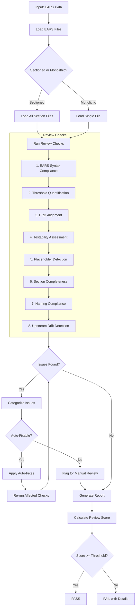

# doc-ears-reviewer

## Purpose

Comprehensive **content review and quality assurance** for EARS (Easy Approach to Requirements Syntax) documents. This skill performs deep content analysis beyond structural validation, checking requirement syntax correctness, PRD alignment, testability, quantifiable thresholds, and identifying issues that require manual review.

**Layer**: 3 (EARS Quality Assurance)

**Upstream**: EARS (from `doc-ears-autopilot` or `doc-ears`)

**Downstream**: None (final QA gate before BDD generation)

---

## When to Use This Skill

Use `doc-ears-reviewer` when:

- **After EARS Generation**: Run immediately after `doc-ears-autopilot` completes
- **Manual EARS Edits**: After making manual changes to EARS
- **Pre-BDD Check**: Before running `doc-bdd-autopilot`
- **Periodic Review**: Regular quality checks on existing EARS
- **CI/CD Integration**: Automated review gate in documentation pipelines

**Do NOT use when**:
- EARS does not exist yet (use `doc-ears` or `doc-ears-autopilot` first)
- Need structural/schema validation only (use `doc-ears-validator`)
- Generating new EARS content (use `doc-ears`)

---

## Skill vs Validator: Key Differences

| Aspect | `doc-ears-validator` | `doc-ears-reviewer` |
|--------|----------------------|---------------------|
| **Focus** | Schema compliance, BDD-Ready score | Content quality, testability |
| **Checks** | Required sections, EARS syntax | Threshold quantification, PRD traceability |
| **Auto-Fix** | Structural issues only | Content issues (syntax, thresholds) |
| **Output** | BDD-Ready score (numeric) | Review score + issue list |
| **Phase** | Phase 4 (Validation) | Phase 5 (Final Review) |
| **Blocking** | BDD-Ready < threshold blocks | Review score < threshold flags |

---

## Review Workflow



---

## Review Checks

### 1. EARS Syntax Compliance

Validates all requirements follow correct EARS patterns.

**EARS Patterns**:
- **Ubiquitous**: `THE {system} SHALL {action}`
- **Event-Driven**: `WHEN {event} THE {system} SHALL {action}`
- **State-Driven**: `WHILE {state} THE {system} SHALL {action}`
- **Optional**: `WHERE {feature} THE {system} SHALL {action}`
- **Complex**: `WHEN {event} WHILE {state} THE {system} SHALL {action}`
- **Unwanted**: `IF {condition} THEN THE {system} SHALL {action} WITHIN {time}`

**Error Codes**:

| Code | Severity | Description |
|------|----------|-------------|
| REV-ES001 | Error | Requirement missing SHALL keyword |
| REV-ES002 | Error | WHEN clause without condition |
| REV-ES003 | Warning | Ambiguous subject (system not specified) |
| REV-ES004 | Warning | Action verb not quantifiable |
| REV-ES005 | Info | Complex pattern may be split |

---

### 2. Threshold Quantification

Validates all timing/performance thresholds are specific.

**Scope**:
- WITHIN clauses have numeric values
- Units specified (ms, s, min)
- Consistent with PRD thresholds
- No vague terms ("quickly", "fast", "responsive")

**Error Codes**:

| Code | Severity | Description |
|------|----------|-------------|
| REV-TQ001 | Error | Missing WITHIN clause for time-bound requirement |
| REV-TQ002 | Error | Threshold uses vague term |
| REV-TQ003 | Warning | Threshold inconsistent with PRD |
| REV-TQ004 | Info | Consider adding failure threshold |

---

### 3. PRD Alignment

Validates EARS requirements trace to PRD source.

**Scope**:
- Every EARS requirement maps to PRD requirement
- No orphaned requirements
- No missing requirements (PRD without EARS)
- Feature IDs consistent

**Error Codes**:

| Code | Severity | Description |
|------|----------|-------------|
| REV-PA001 | Error | EARS requirement without PRD source |
| REV-PA002 | Warning | PRD requirement without EARS mapping |
| REV-PA003 | Warning | Feature ID mismatch |
| REV-PA004 | Info | Requirement correctly marked as deferred |

---

### 4. Testability Assessment

Evaluates if requirements can be tested.

**Scope**:
- Measurable outcomes defined
- Pass/fail criteria clear
- Edge cases identified
- Negative cases covered

**Error Codes**:

| Code | Severity | Description |
|------|----------|-------------|
| REV-TA001 | Error | No measurable outcome |
| REV-TA002 | Warning | Pass/fail criteria unclear |
| REV-TA003 | Info | Edge case not covered |
| REV-TA004 | Info | Consider negative test case |

---

### 5. Placeholder Detection

Identifies incomplete content requiring replacement.

**Error Codes**:

| Code | Severity | Description |
|------|----------|-------------|
| REV-P001 | Error | [TODO] placeholder found |
| REV-P002 | Error | [TBD] placeholder found |
| REV-P003 | Warning | Template value not replaced |

---

### 6. Section Completeness

Verifies all required sections have substantive content.

**Error Codes**:

| Code | Severity | Description |
|------|----------|-------------|
| REV-S001 | Error | Required section missing |
| REV-S002 | Warning | Section below minimum content |
| REV-S003 | Warning | Table has no data rows |

---

### 7. Naming Compliance

Validates element IDs follow `doc-naming` standards.

**Scope**:
- Element IDs use `EARS.NN.TT.SS` format
- Element type codes valid for EARS (25, 26)
- No legacy patterns (REQ-NNN, R-NNN)

**Error Codes**:

| Code | Severity | Description |
|------|----------|-------------|
| REV-N001 | Error | Invalid element ID format |
| REV-N002 | Error | Element type code not valid for EARS |
| REV-N003 | Error | Legacy pattern detected |

---

### 8. Upstream Drift Detection (Mandatory Cache)

Detects when upstream source documents have been modified after the EARS was created or last updated.

**The drift cache is mandatory** - the reviewer MUST create/update it after every review.

**Purpose**: Identifies stale EARS content that may not reflect current PRD documentation.

**Scope**:
- `@ref:` tag targets
- `@prd:` tag references
- Traceability section upstream artifact links

#### 8.1 Drift Cache File (MANDATORY)

**Location**: `docs/03_EARS/.drift_cache.json`

**Schema**:

```json
{
  "cache_version": "1.0",
  "artifact_type": "EARS",
  "upstream_type": "PRD",
  "last_updated": "2026-02-10T17:00:00Z",
  "entries": {
    "EARS-01": {
      "ears_file": "docs/03_EARS/EARS-01_f1_iam.md",
      "ears_hash": "sha256:abc123...",
      "ears_mtime": "2026-02-10T15:00:00Z",
      "upstream_refs": [
        {
          "prd_id": "PRD-01",
          "prd_file": "docs/02_PRD/PRD-01_f1_iam.md",
          "prd_hash": "sha256:def456...",
          "prd_mtime": "2026-02-10T14:00:00Z",
          "prd_version": "1.2"
        }
      ],
      "last_review": "2026-02-10T16:00:00Z",
      "drift_status": "clean"
    }
  }
}
```

#### 8.2 Detection Algorithm (Three-Phase)

**Phase 1: Load Cache**
```
IF cache file exists:
    Load existing cache
    Validate cache schema
ELSE:
    Initialize empty cache
    Mark as first review (REV-D006)
```

**Phase 2: Detect Drift**
```
FOR each EARS document:
    Calculate current EARS hash
    FOR each upstream PRD reference:
        Calculate current PRD hash
        IF cache entry exists:
            Compare PRD hash with cached hash
            IF hashes differ:
                Flag drift (REV-D001/D002/D005)
            Compare PRD mtime with cached mtime
            IF mtime newer:
                Flag potential drift (REV-D003)
        ELSE:
            New reference - no drift comparison possible
```

**Phase 3: Update Cache (MANDATORY)**
```
FOR each reviewed EARS document:
    Update EARS hash and mtime
    FOR each upstream PRD reference:
        Update PRD hash, mtime, and version
    Set drift_status based on review results
    Set last_review to current timestamp
Write updated cache to disk
```

#### 8.3 Hash Calculation

```python
import hashlib

def calculate_content_hash(file_path: str) -> str:
    """Calculate SHA-256 hash of file content."""
    with open(file_path, 'rb') as f:
        content = f.read()
    return f"sha256:{hashlib.sha256(content).hexdigest()}"
```

**Error Codes**:

| Code | Severity | Description |
|------|----------|-------------|
| REV-D001 | Warning | Upstream document modified after EARS creation |
| REV-D002 | Warning | Referenced section content changed |
| REV-D003 | Info | Upstream document version incremented |
| REV-D004 | Info | New content added to upstream |
| REV-D005 | Error | Critical upstream modification (>20% change) |
| REV-D006 | Info | Cache created - first review |

#### 8.5 Report Output

The review report MUST include cache status:

```markdown
## Upstream Drift Detection

**Cache Status**: Updated | Created | Error
**Cache Location**: `docs/03_EARS/.drift_cache.json`

| EARS | Upstream PRD | Drift Status | Last Verified |
|------|--------------|--------------|---------------|
| EARS-01 | PRD-01 | Clean | 2026-02-10T17:00:00Z |
| EARS-02 | PRD-02 | Drift Detected (REV-D002) | 2026-02-10T17:00:00Z |
```

**Configuration**:

| Setting | Default | Description |
|---------|---------|-------------|
| `cache_enabled` | true | Mandatory - cannot be disabled |
| `drift_threshold_days` | 7 | Days before drift becomes Warning |
| `critical_threshold_days` | 30 | Days before drift becomes Error |
| `enable_hash_check` | true | SHA-256 content hashing enabled |

---

## Review Score Calculation

**Scoring Formula**:

| Category | Weight | Calculation |
|----------|--------|-------------|
| EARS Syntax Compliance | 23% | (valid_syntax / total_reqs) × 23 |
| Threshold Quantification | 19% | (quantified / requiring_threshold) × 19 |
| PRD Alignment | 19% | (aligned_reqs / total_reqs) × 19 |
| Testability Assessment | 14% | (testable_reqs / total_reqs) × 14 |
| Placeholder Detection | 5% | (no_placeholders ? 5 : 5 - count) |
| Section Completeness | 10% | (complete / total_sections) × 10 |
| Naming Compliance | 5% | (valid_ids / total_ids) × 5 |
| Upstream Drift | 5% | (fresh_refs / total_refs) × 5 |

**Total**: Sum of all categories (max 100)

**Thresholds**:
- **PASS**: ≥ 90
- **WARNING**: 80-89
- **FAIL**: < 80

---

## Command Usage

```bash
# Review specific EARS
/doc-ears-reviewer EARS-01

# Review EARS by path
/doc-ears-reviewer docs/03_EARS/EARS-01_f1_iam.md

# Review all EARS
/doc-ears-reviewer all
```

---

## Output Report

Review reports are stored alongside the reviewed document per project standards.

**Nested Folder Rule**: ALL EARS use nested folders (`EARS-NN_{slug}/`) regardless of size. This ensures review reports, fix reports, and drift cache files are organized with their parent document.

**File Naming**: `EARS-NN.R_review_report_vNNN.md`

**Location**: Inside the EARS nested folder: `docs/03_EARS/EARS-NN_{slug}/`

### Versioning Rules

1. **First Review**: Creates `EARS-NN.R_review_report_v001.md`
2. **Subsequent Reviews**: Auto-increments version (v002, v003, etc.)
3. **Same-Day Reviews**: Each review gets unique version number

**Version Detection**: Scans folder for existing `EARS-NN.R_review_report_v*.md` files and increments.

**Example**:

```
docs/03_EARS/EARS-01_f1_iam/
├── EARS-01_f1_iam.md
├── EARS-01.R_review_report_v001.md    # First review
├── EARS-01.R_review_report_v002.md    # After fixes
└── .drift_cache.json
```

### Delta Reporting

When previous reviews exist, include score comparison in the report.

See `REVIEW_DOCUMENT_STANDARDS.md` for complete versioning requirements.

---

## Integration with doc-ears-autopilot

This skill is invoked during Phase 5 of `doc-ears-autopilot`:


---

## Related Skills

| Skill | Relationship |
|-------|--------------|
| `doc-naming` | Naming standards for Check #7 |
| `doc-ears-autopilot` | Invokes this skill in Phase 5 |
| `doc-ears-validator` | Structural validation (Phase 4) |
| `doc-ears-fixer` | Applies fixes based on review findings |
| `doc-ears` | EARS creation rules |
| `doc-prd-reviewer` | Upstream QA |
| `doc-bdd-autopilot` | Downstream consumer |

---

## Version History

| Version | Date | Changes |
|---------|------|---------|
| 1.3 | 2026-02-10 | Made drift cache mandatory; Added cache schema and location (`docs/03_EARS/.drift_cache.json`); Three-phase detection algorithm; SHA-256 hash calculation; REV-D006 error code for cache creation; Cache status in report output |
| 1.2 | 2026-02-10 | Added Check #8: Upstream Drift Detection - detects when PRD documents modified after EARS creation; REV-D001-D005 error codes; drift configuration; Added doc-ears-fixer to related skills |
| 1.1 | 2026-02-10 | Added review versioning support (_vNNN pattern); Delta reporting for score comparison |
| 1.0 | 2026-02-10 | Initial skill creation with 7 review checks; EARS syntax compliance; Threshold quantification; Testability assessment |
