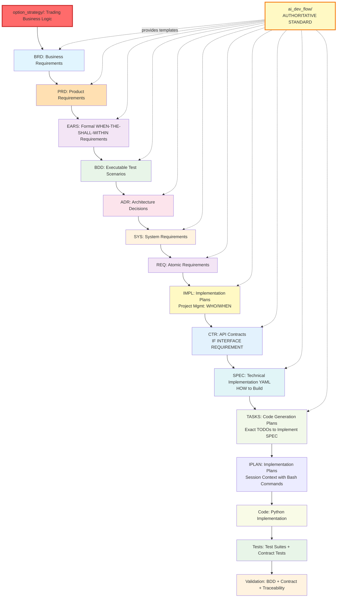

# doc-flow

## Prerequisites

**⚠️ For New Projects (Greenfield)**: If starting a brand new project with no existing folder structure, use the **`project-init`** skill FIRST to initialize project structure, select domain, create folders, and configure setup. Then return here to begin workflow execution.

**For Existing Projects**: If project is already initialized (docs/ folders exist, domain configured), proceed directly with this skill.

---

## Purpose
Provide AI assistants with structured guidance on implementing the AI-Driven Specification-Driven Development (SDD) workflow defined in `ai_dev_flow/SPEC_DRIVEN_DEVELOPMENT_GUIDE.md` as the **authoritative development standard**. This skill enables complete traceability from business requirements to production code through formal artifacts, with clear separation between strategy (Product Owner voice), project documentation, and development templates.

**⚠️ CRITICAL**: Always reference [SPEC_DRIVEN_DEVELOPMENT_GUIDE.md]({project_root}/ai_dev_flow/SPEC_DRIVEN_DEVELOPMENT_GUIDE.md) as the single source of truth for workflow steps, artifact definitions, and quality gates.

## Directory Structure and Roles

**Critical Context**: This project has three key directories with distinct roles:

### 📁 `option_strategy/` - WHAT (Product Owner Voice)
**Primary Authority**: Authoritative trading strategy and business logic

- `integrated_strategy_algo_v5.md` - Bot-executable algorithm specifications
- `Integrated_strategy_desc.md` - Strategic framework and market regimes
- `delta_hedging.md` - Portfolio-level risk management
- `greeks_adjustment.md` - Position-level Greeks management
- `stock_selection/` - Entry criteria and scoring algorithms
- Performance targets, state machines, risk budgets

**Golden Rule**: All trading logic must trace back to these strategy documents.

### 📚 `docs/` - PROJECT DOCUMENTATION
**Implementation Documentation**: Requirements, architecture, specifications

- `docs/BRD/` - Business Requirements Documents
- `docs/PRD/` - Product Requirements Documents
- `docs/ADR/` - Architecture Decision Records (HOW)
- `docs/BDD/` - BDD acceptance tests (Behavior-Driven Development)
- `docs/CTR/` - API Contracts (dual-file format: .md + .yaml)
- `docs/IMPL/` - Implementation Plans (Project Management: WHO/WHEN)
- `docs/SPEC/` - YAML technical specifications
- `docs/TASKS/` - Code Generation Plans (AI-structured implementation tasks)
- `docs/IPLAN/` - Implementation Plans (session-based execution with bash commands)

**Purpose**: Document how strategy is implemented through architecture and code.

### 📝 `ai_dev_flow/` - AUTHORITATIVE DEVELOPMENT STANDARD
**Development Standard and Templates**: The single source of truth for SDD workflow

- **Status**: Authoritative development standard for this project
- **Contents**: Complete SDD workflow (BRD → PRD → SYS → EARS → REQ → ADR → BDD → SPEC → TASKS → Code)
- **Templates**: `{TYPE}-TEMPLATE.{ext}` for each artifact type (BRD, PRD, EARS, REQ, ADR, BDD, SPEC, TASKS)
- **Indices**: `{TYPE}-000_index.{ext}` listing all documents of each type
- **READMEs**: Detailed usage guides and best practices for each artifact type
- **Standards**: ID naming, traceability format, cross-referencing rules
- **Examples**: Reference implementations with full traceability chains

**Purpose**: Define the complete development methodology with templates, standards, and examples for creating all artifacts.

### ⚠️ CRITICAL: Archived Documents Restriction

**STRICTLY PROHIBITED: DO NOT access, reference, link to, or use ANY files or directories containing the word "archived" in their path.**

**Automatic Filtering Rules:**
- ❌ Skip any path containing `archived`, `Archived`, `ARCHIVED`, or `archive`
- ❌ Ignore files in directories with "archived" in the name
- ❌ Do not read, suggest, or reference archived content
- ❌ Do not use archived documents even if they appear in search results

**Active Documentation Only:**
- ✅ `option_strategy/` (current V5 strategy - excludes archived subdirs)
- ✅ `docs/` (active project documentation)
- ✅ `ai_dev_flow/` (authoritative templates and standards)

**If archived content is needed:**
- Stop immediately
- Inform user that content is in archived location
- Request explicit permission before proceeding

**Examples of Prohibited Paths:**
- ❌ `archived/` (any files or subdirectories)
- ❌ `option_strategy/archived_v3_strategy/`
- ❌ `option_strategy/archived_v4_strategy/`
- ❌ `option_strategy/iron_condor/archived_pre_earnings/`
- ❌ `docs/specs_backup_archived_20241015/`
- ❌ Any path matching `**/archived*/**` or `**/archive*/**`

## Information Flow Hierarchy

**Changes flow DOWN (never UP):**
```
📁 option_strategy/ (WHAT - Product Owner Voice)
    ├── Strategy business logic
    └── Performance targets
              ↓
              ↓ Referenced by
              ↓
📚 docs/ (WHY + HOW - Project Documentation)
    ├── Requirements (WHY)
    ├── Architecture (HOW)
    └── Specifications (IMPLEMENTATION)
              ↓
              ↓ Generates
              ↓
💻 Source Code (Python/Infrastructure)

📝 ai_dev_flow/ feeds into 📚 docs/ for consistency
```

**Golden Rules**:
- Strategy → Documentation → Code (one-way flow)
- Code cannot change strategy
- Always use templates from `ai_dev_flow/` when creating docs in `docs/`
- All trading logic must reference `option_strategy/` sections

## Core Workflow Chain

**Reference**: `ai_dev_flow/SPEC_DRIVEN_DEVELOPMENT_GUIDE.md` (Authoritative Standard)

```
Strategy → BRD → PRD → EARS → BDD → ADR → SYS → REQ → IMPL → CTR → SPEC → TASKS → IPLAN → Code → Tests → Validation
                                                                   ↓
                                                           [IF INTERFACE REQUIREMENT]
```

**Workflow Steps** (per authoritative guide):
1. **BRD** (Business Requirements Document) - High-level business needs
2. **PRD** (Product Requirements Document) - User needs and features
3. **EARS** (Easy Approach to Requirements Syntax) - Formal WHEN-THE-SHALL-WITHIN statements
4. **BDD** (Behavior-Driven Development) - Executable Gherkin scenarios
5. **ADR** (Architecture Decision Records) - Architectural decisions with rationale
6. **SYS** (System Requirements) - Technical interpretation of business requirements
7. **REQ** (Atomic Requirements) - Single, testable requirements decomposed from EARS and SYS
8. **IMPL** (Implementation Plans) - Project management: WHO does WHAT, WHEN (identifies which CTR, SPEC, TASKS to create)
9. **CTR** (API Contracts) - [IF INTERFACE REQUIREMENT] Formal interface specifications for component-to-component communication
10. **SPEC** (Technical Specifications) - YAML implementation blueprints: HOW to build (references CTR contracts when implementing interfaces)
11. **TASKS** (Code Generation Plans) - AI-structured task breakdowns with exact TODOs to implement SPEC
12. **IPLAN** (Implementation Plans) - Session-based execution plans with bash commands and verification steps
13. **Code** - Python implementation matching SPEC exactly
14. **Tests** - Test suites (unit, integration, BDD execution, contract tests)
15. **Validation** - BDD scenario verification, contract validation, and traceability checks

**When to Create CTR**: Create API contracts when REQ specifies interface requirements for component-to-component communication. Skip CTR for purely internal logic with no external interfaces. CTR uses dual-file format (.md + .yaml) to provide both human-readable context and machine-readable schemas.

**IMPL vs SPEC Distinction**:
- **IMPL**: Project management document organizing work (WHO does WHAT, WHEN) - NOT technical specifications
- **SPEC**: Technical implementation specification (HOW to build components) - YAML format for code generation

**Flow Visualization** (see [index.md]({project_root}/ai_dev_flow/index.md#traceability-flow) for authoritative diagram):


**Important Traceability Notes:**
- **Strategy First**: All requirements must reference `option_strategy/` business logic
- **Authoritative Standard**: `ai_dev_flow/` defines the complete SDD methodology
- **Templates Required**: ALWAYS use templates from `ai_dev_flow/{TYPE}-TEMPLATE.{ext}` when creating any artifact
- **One-Way Flow**: Changes flow from strategy → BRD → PRD → EARS → BDD → ADR → SYS → REQ → IMPL → CTR → SPEC → TASKS → IPLAN → code (never reverse)
- **Order Matters**: Follow the exact sequence defined in `SPEC_DRIVEN_DEVELOPMENT_GUIDE.md`

## Key Instructions

**⚠️ CRITICAL**: All instructions below are defined in `ai_dev_flow/` (authoritative standard). When in doubt, consult the source documents in that directory.

### 1. Document ID Standards
**Authoritative Reference**: `ai_dev_flow/ID_NAMING_STANDARDS.md`

**Universal Numbering Pattern (All Document Types):**
- **Primary Number (NNN)**: 3-4 digit sequential number for atomic logical document (001-999, then 1000-9999 when needed)
- **Sub-Document Number (YY)**: 2-3 digit sequential number within atomic document [OPTIONAL] (01-99, then 100-999 when needed)
- **Format**: `TYPE-NNN` or `TYPE-NNN-YY` (e.g., `REQ-001`, `BRD-009-02`, `ADR-1000`)
- **Zero-Padding**: Always pad to minimum digit count (001, 01) until exceeding range
- **Uniqueness Rule**: Each NNN number is unique and can be used EITHER as:
  - Atomic document: `TYPE-NNN_{slug}.md` (e.g., `BRD-001_foundation.md`)
  - Multi-document group: `TYPE-NNN-01_{slug}.md`, `TYPE-NNN-02_{slug}.md`, etc.
  - ❌ INVALID: Cannot have both `BRD-009_{slug}.md` AND `BRD-009-01_{slug}.md` (NNN=009 collision)
  - ✅ VALID: Can have `BRD-009-01_{slug}.md` AND `BRD-009-02_{slug}.md` (same NNN, different YY)

**File Naming Patterns:**
- BRD: `BRD/BRD-NNN_{slug}.md` or `BRD-NNN-YY_{slug}.md` (Business Requirements Documents) - **NEW location: docs/BRD/**
- PRD: `PRD/PRD-NNN_{slug}.md` or `PRD-NNN-YY_{slug}.md` (Product Requirements) - **NEW location: docs/PRD/**
- SYS: `SYS/SYS-NNN_{slug}.md` or `SYS-NNN-YY_{slug}.md` (System Requirements) - **Template location: ai_dev_flow/SYS/**
- EARS: `EARS/EARS-NNN_{slug}.md` or `EARS-NNN-YY_{slug}.md` (Formal Requirements) - **Template location: ai_dev_flow/EARS/**
- REQ: `REQ/{domain}/{subdomain}/REQ-NNN_{slug}.md` or `REQ-NNN-YY_{slug}.md` (Atomic Requirements) - **Template location: ai_dev_flow/REQ/**
- ADR: `ADR/ADR-NNN_{slug}.md` or `ADR-NNN-YY_{slug}.md` (Architecture Decisions) - **NEW location: docs/ADR/**
- BDD: `BDD/BDD-NNN_{slug}.feature` or `BDD-NNN-YY_{slug}.feature` (Behavior-Driven Tests) - **NEW location: docs/BDD/**
- CTR: `CTR/CTR-NNN_{slug}.md` + `CTR-NNN_{slug}.yaml` or `CTR-NNN-YY_{slug}.{md,yaml}` (API Contracts - dual-file format) - **NEW location: docs/CTR/**
- SPEC: `SPEC/SPEC-NNN_{slug}.yaml` or `SPEC-NNN-YY_{slug}.yaml` (Technical Specifications, references CTR contracts) - **NEW location: docs/SPEC/**
- TASKS: `TASKS/TASKS-NNN_{slug}.md` or `TASKS-NNN-YY_{slug}.md` (Code Generation Plans) - **NEW location: docs/TASKS/**
- IMPL: `IMPL/IMPL-NNN_{slug}.md` or `IMPL-NNN-YY_{slug}.md` (Implementation Plans) - **NEW location: docs/IMPL/**

**ID Format Rules:**
- H1 headers contain full document IDs: `# REQ-003: Position Limit Enforcement` or `# BRD-009-01: Prerequisites`
- SPEC YAML uses `id:` field with lowercase_snake_case: `position_limit_service`
- Categories encoded in folder paths, not ID prefixes
- Sub-numbering (-YY) used ONLY when single logical document requires multiple related files with sequential reading order
- Each NNN number must be unique (no collisions between atomic and multi-doc patterns)

**⚠️ CRITICAL: Document ID Independence**

- **ID Numbers Do NOT Match Content**: A document's ID number does NOT necessarily correspond to related documents in other artifact types
  - Example: BRD-009 covers "Broker Integration" but PRD-009 might cover "Cash-Secured Put Workflow" (unrelated)
  - The corresponding PRD for broker integration might be PRD-016 or any other number

- **Always Use Index Files for Discovery**: To find documents by topic/content:
  - Index files use ID `000` in their identifier (e.g., PRD-000, REQ-000, ADR-000)
  - Index filenames include "index" in the name
  - Index files contain descriptions and summaries of all documents of that artifact type
  - Organized by domain, category, or functional area

**Best Practice for AI Assistants**:
1. When searching for related documents, **find and read the index file first** (ID: 000, name contains "index")
2. Search index descriptions for keywords related to your topic
3. Do NOT assume document IDs match across artifact types
4. Use traceability tags within documents to find explicitly linked artifacts
5. Verify document content matches your topic before assuming relationship

### 2. Traceability Requirements
**Authoritative Reference**: `ai_dev_flow/TRACEABILITY.md`

**Traceability Section (Required):**
- Every document must include a `## Traceability` section (typically Section 7)
- Standard fields:
  - **Upstream Sources**: Prior artifacts this document derives from
  - **Downstream Artifacts**: Artifacts that depend on this document
  - **Anchors/IDs**: Primary anchor(s) in this file (e.g., `# REQ-003`)
  - **Code Path(s)**: Where related implementation resides

**Traceability Template:**
```markdown
## Traceability
- Upstream Sources: [link], [link]
- Downstream Artifacts: [link], [link]
- Anchors/IDs: `# <PRIMARY-ID-IF-ANY>`
- Code Path(s): `path/to/file.py`
```

**Cross-Reference Link Format (Mandatory):**
- Use markdown links with standardized paths: `[ADR-033](../ADR/ADR-033_risk_architecture.md#ADR-033)`
- Include anchors: `#ADR-033`, `#BDD-003`, `#CTR-001`
- Use relative paths from current file location
- Examples:
  - From docs/BRD/: `[ADR-033](../ADR/ADR-033_risk_architecture.md#ADR-033)`
  - From docs/SPEC/: `[CTR-001](../CTR/CTR-001_api_contract.md#CTR-001)`

### Tag-Based Traceability Workflow

**Principle:** Code is the single source of truth. Matrices are generated automatically.

**Process:**
1. **Write Code:** Add @brd/@sys/@spec tags to docstrings
2. **Validate Tags:** Run `python scripts/validate_tags_against_docs.py --strict`
3. **Generate Matrices:** Run `python scripts/generate_traceability_matrices.py --auto`
4. **Review:** Check generated matrices in docs/generated/matrices/
5. **Commit:** Pre-commit hook validates tags automatically

**Tag Format:**
```python
"""Service implementation.

@brd: BRD-001:FR-030, BRD-001:NFR-006
@prd: PRD-003
@req: REQ-003:interface-spec
@adr: ADR-033
@contract: CTR-001
@spec: SPEC-002
@test: BDD-003:scenario-1
@impl-status: complete
"""
```

**Tag Structure:** `@tag-type: DOCUMENT-ID:REQUIREMENT-ID`

**Tag Types:**
- `@brd:` - Business Requirements Document (use namespace: BRD-001:FR-030)
- `@prd:` - Product Requirements Document
- `@req:` - Requirements Document
- `@adr:` - Architecture Decision Record
- `@contract:` - Contract references (CTR)
- `@spec:` - Specification references
- `@test:` - Test scenario references (BDD-003:scenario-name)
- `@impl-status:` - Implementation status (pending|in-progress|complete|deprecated)

**Benefits:**
- No manual Section 7 maintenance
- Tags embedded in code (single source of truth)
- Automated validation prevents drift
- Bidirectional matrices auto-generated
- CI/CD enforcement via pre-commit hooks
- Namespace clarity prevents ambiguity

**Automation Commands:**
```bash
# Complete workflow (extract → validate → generate)
python scripts/generate_traceability_matrices.py --auto

# Individual steps
python scripts/extract_tags.py --source src/ docs/ tests/
python scripts/validate_tags_against_docs.py --strict
python scripts/generate_traceability_matrices.py --output docs/generated/matrices/
```

### 2.5 Cumulative Tagging Hierarchy

**Authoritative Reference**: `ai_dev_flow/TRACEABILITY.md#cumulative-tagging-hierarchy`

**Principle**: Each artifact layer must include traceability tags from ALL upstream artifact layers, creating a complete audit trail from business requirements through production code.

**Cumulative Tagging Table** (16 layers: Layer 0 through Layer 15):

| Layer | Artifact Type | Required Tags | Tag Count | Format | Notes |
|-------|---------------|---------------|-----------|--------|-------|
| 0 | **Strategy** | None | 0 | External | Business owner documents, no formal artifact |
| 1 | **BRD** | None | 0 | Markdown | Top level, no upstream dependencies |
| 2 | **PRD** | `@brd` | 1 | Markdown | References parent BRD |
| 3 | **EARS** | `@brd`, `@prd` | 2 | Markdown | Cumulative: BRD + PRD |
| 4 | **BDD** | `@brd`, `@prd`, `@ears` | 3+ | Gherkin Tags | Cumulative: BRD through EARS |
| 5 | **ADR** | `@brd` through `@bdd` | 4 | Markdown | Cumulative: BRD through BDD |
| 6 | **SYS** | `@brd` through `@adr` | 5 | Markdown | Cumulative: BRD through ADR |
| 7 | **REQ** | `@brd` through `@sys` | 6 | Markdown | Cumulative: BRD through SYS |
| 8 | **IMPL** | `@brd` through `@req` | 7 | Markdown | Optional layer |
| 9 | **CTR** | `@brd` through `@impl` | 8 | Markdown + YAML | Optional layer |
| 10 | **SPEC** | `@brd` through `@req` + optional | 7-9 | YAML (`cumulative_tags`) | YAML cumulative_tags section |
| 11 | **TASKS** | `@brd` through `@spec` | 8-10 | Markdown | Cumulative: BRD through SPEC |
| 12 | **IPLAN** | `@brd` through `@tasks` | 9-11 | Markdown | Implementation session plans |
| 13 | **Code** | `@brd` through `@tasks` | 9-11 | Docstrings | Python/source code |
| 14 | **Tests** | `@brd` through `@code` | 10-12 | Docstrings | Test suites |
| 15 | **Validation** | All upstream | 10-15 | Various | Validation results |

**Tag Format**:
```markdown
@brd: BRD-009:FR-015, BRD-009:NFR-006
@prd: PRD-016:FEATURE-003
@ears: EARS-012:EVENT-002, EARS-012:STATE-001
@bdd: BDD-015:scenario-place-order
@adr: ADR-033
@sys: SYS-012:PERF-001, SYS-012:RELIABILITY-002
@req: REQ-045:interface-spec
@impl: IMPL-003:phase2  # Optional - include only if exists
@ctr: CTR-005  # Optional - include only if exists
@spec: SPEC-018
@tasks: TASKS-015
```

**Format Rules**:
- Separator: Use colon (`:`) to separate DOCUMENT-ID from REQUIREMENT-ID
- Multiple refs: Comma-separated list within same tag line
- Optional layers: Include `@impl` and `@ctr` tags only if those artifacts exist in chain
- SPEC format: Use YAML `cumulative_tags:` mapping instead of markdown comments
- BDD format: Use Gherkin `@` tags at feature/scenario level

**Validation Rules**:
1. **No gaps**: Each layer must include ALL upstream tags from previous layers
2. **Format compliance**: Tags must follow `@artifact-type: DOC-ID:REQ-ID` pattern
3. **Valid references**: All tagged document IDs must exist and be reachable
4. **Optional layers**: `@impl` and `@ctr` included only if they exist in chain
5. **SPEC exception**: SPEC uses YAML format, not markdown tags

**Tag Discovery Commands**:
```bash
# Extract all tags from an artifact
python scripts/extract_tags.py --artifact-id REQ-045 --show-all-upstream

# Validate cumulative tagging for specific artifact
python scripts/validate_tags_against_docs.py \
  --artifact REQ-045 \
  --expected-layers brd,prd,ears,bdd,adr,sys \
  --strict

# Generate traceability coverage report
python scripts/generate_traceability_matrices.py \
  --type REQ \
  --show-coverage \
  --validate-cumulative-tags
```

**Cumulative Tagging Example - REQ Layer** (6 tags required):

```markdown
## 7. Traceability

**Required Tags** (Cumulative Tagging Hierarchy - Layer 7):
```markdown
@brd: BRD-009:FR-015, BRD-009:NFR-006
@prd: PRD-016:FEATURE-003
@ears: EARS-012:EVENT-002, EARS-012:STATE-001
@bdd: BDD-015:scenario-place-order
@adr: ADR-033
@sys: SYS-012:PERF-001, SYS-012:RELIABILITY-002
```

- BRD-009:FR-015 - Functional requirement for broker integration
- BRD-009:NFR-006 - Non-functional requirement for trade execution performance
- PRD-016:FEATURE-003 - Order placement UI feature
- EARS-012:EVENT-002 - Event-driven requirement for order validation
- EARS-012:STATE-001 - State-driven requirement for order status
- BDD-015:scenario-place-order - Acceptance test scenario
- ADR-033 - Architecture decision for risk limit enforcement
- SYS-012:PERF-001 - Performance requirement
- SYS-012:RELIABILITY-002 - Reliability requirement
```

**SPEC YAML Format Example** (7-9 tags):

```yaml
# SPEC-018: Order Placement Service Specification

spec_id: SPEC-018
title: "Order Placement Service Technical Specification"
version: "1.0.0"

# Cumulative Tagging Hierarchy (Layer 10)
cumulative_tags:
  brd: "BRD-009:FR-015, BRD-009:NFR-006"
  prd: "PRD-016:FEATURE-003"
  ears: "EARS-012:EVENT-002, EARS-012:STATE-001"
  bdd: "BDD-015:scenario-place-order"
  adr: "ADR-033"
  sys: "SYS-012:PERF-001, SYS-012:RELIABILITY-002"
  req: "REQ-045:interface-spec, REQ-045:validation-logic"
  impl: "IMPL-003:phase2"  # Optional
  ctr: "CTR-005"  # Optional
```

**Benefits of Cumulative Tagging**:
- **Complete Audit Trail**: Every artifact traces back to original business requirements
- **Impact Analysis**: Instantly identify all downstream artifacts affected by upstream changes
- **Regulatory Compliance**: SEC, FINRA, FDA, ISO audit requirements satisfied automatically
- **Automated Validation**: Scripts enforce tagging compliance in CI/CD pipeline
- **Change Management**: Know exactly what breaks when requirements change
- **Coverage Metrics**: Measure traceability completeness across entire codebase

**AI Assistant Rules**:
1. **Always include cumulative tags**: When creating ANY artifact, include ALL upstream tags
2. **Validate before commit**: Run tag validation scripts before committing
3. **No gaps allowed**: Missing upstream tags will fail CI/CD validation
4. **Update traceability matrices**: Cumulative tags must match matrix entries
5. **SPEC format exception**: Remember SPEC uses YAML `cumulative_tags:` not markdown tags
6. **Optional layer handling**: Only include `@impl` and `@ctr` if they actually exist in chain

### 3. Development Workflow Steps
**Authoritative Reference**: `ai_dev_flow/SPEC_DRIVEN_DEVELOPMENT_GUIDE.md`

**Technology Stack Reference**:
Before making any technology decisions in ADRs, specifications, or implementation plans:
1. Read `{project_root}/docs/ADR/ADR-000_technology_stack.md` for approved project-wide technologies
2. Ensure consistency with core technologies: Google ADK, MCP, A2A Protocol, GCP infrastructure
3. If proposing new technology not in ADR-000, create a new ADR justifying the addition

**Step-by-Step Process:**

**PREREQUISITE: Review Strategy Documents (option_strategy/)**
   - **ALWAYS START HERE**: Read relevant sections from `option_strategy/`
   - Reading order:
     1. `option_strategy/README.md` - Performance targets, strategy goals
     2. `option_strategy/Integrated_strategy_desc.md` - Strategic framework
     3. `option_strategy/integrated_strategy_algo_v5.md` - Bot-executable algorithm
     4. `option_strategy/delta_hedging.md` + `greeks_adjustment.md` - Risk management
     5. `option_strategy/stock_selection/` - Entry criteria
   - **Critical**: Every requirement must cite specific strategy document sections

1. **Define Business Requirements (BRD)**
   - Input: High-level business objectives, market context, strategic goals, **strategy documents**
   - Output: BRD with business case, stakeholder needs, success criteria, **Architecture Decision Requirements**
   - Focus: Business objectives, market requirements, strategic alignment
   - **Architecture Approach**: Identify architectural topics requiring decisions; do NOT reference specific ADR numbers (ADRs created in later phase)
   - Templates: `ai_dev_flow/BRD/BRD-TEMPLATE.md` (3 templates available)
   - **Traceability**: Must reference `option_strategy/` sections

#### 1.1 BRD Categorization: Platform vs Feature

Before creating a BRD, determine if it's a **Platform BRD** or **Feature BRD** using this questionnaire:

**Questionnaire**:
1. Does this BRD define infrastructure, technology stack, or cross-cutting concerns?
   - Yes → Likely Platform BRD
   - No → Continue

2. Does this BRD describe a specific user-facing workflow or feature?
   - Yes → Likely Feature BRD
   - No → Continue

3. Will other BRDs depend on or reference this BRD's architectural decisions?
   - Yes → Likely Platform BRD
   - No → Likely Feature BRD

4. Does this BRD establish patterns, standards, or capabilities used across multiple features?
   - Yes → Platform BRD
   - No → Feature BRD

5. Does this BRD implement functionality on top of existing platform capabilities?
   - Yes → Feature BRD
   - No → Platform BRD

**Auto-Detection Logic**:
- Title contains "Platform", "Architecture", "Infrastructure", "Integration" → Platform BRD
- Title contains specific workflow names, user types (B2C, B2B), or feature names → Feature BRD
- References/depends on BRD-001 or foundation ADRs → Feature BRD
- Establishes technology choices or system-wide patterns → Platform BRD

**Reference**: See `/opt/data/docs_flow_framework/ai_dev_flow/PLATFORM_VS_FEATURE_BRD.md` for detailed guidance

2. **Capture Product Requirements (PRD)**
   - Input: Business needs from BRD, stakeholder priorities
   - Output: PRD with problem/goals/non-goals/KPIs, **Architecture Decision Requirements**
   - Focus: Product features, user needs, measurable success criteria
   - **Architecture Approach**: Document what architectural decisions are needed and why; do NOT reference specific ADR numbers (ADRs created in later phase)

3. **Formalize Requirements (EARS)**
   - Input: PRD objectives translated to precise behavioral statements
   - Output: EARS statements using WHEN-THE-SHALL-WITHIN format
   - Types: Event-driven, State-driven, Unwanted Behavior, Ubiquitous
   - Example: `WHEN [position limit exceeded] THE [system] SHALL [reject trade] WITHIN [100ms]`

4. **Specify Behavior (BDD)**
   - Input: EARS statements expressed as executable scenarios
   - Output: Gherkin feature files with Given-When-Then scenarios
   - Tagging: `@requirement:[REQ-...]` and `@adr:[ADR-...]`
   - Scenario Types: Success paths, error conditions, edge cases

5. **Record Architectural Decisions (ADR)**
   - Input: Technical alternatives evaluated, **Architecture Decision Requirements from BRD/PRD**
   - Output: ADR with context, decision, consequences, alternatives
   - **Relationship to BRD/PRD**: BRD/PRD documents identify WHAT decisions are needed; ADRs document WHICH option was chosen and WHY
   - Lifecycle: Proposed → Accepted → Superseded
   - Template: Context, Decision, Consequences, Verification, Alternatives, Relations
   - Location: `docs/ADR/` - NEW standardized location (moved from `docs/adrs/`)
   - **Technology Stack**: Reference ADR-000_technology_stack.md in `docs/ADR/` for approved technologies before proposing new tech choices

6. **Create System Requirements (SYS)**
   - Input: ADR architecture decisions and constraints
   - Output: SYS with functional/non-functional requirements, system flows
   - Focus: Technical interpretation of business requirements within architectural framework

7. **Define Atomic Requirements (REQ)**
   - Input: EARS statements and SYS requirements decomposed into granular requirements
   - Output: REQ files with description, acceptance criteria, verification
   - Structure: One requirement per file
   - Organization: `REQ/{domain}/{subdomain}/REQ-NNN_*.md`

8. **Plan Implementation (IMPL)** [CONDITIONAL - see decision guide]
   - **Decision Guide**: [WHEN_TO_CREATE_IMPL.md]({project_root}/ai_dev_flow/WHEN_TO_CREATE_IMPL.md) - When to create IMPL vs skip to CTR/SPEC
   - **Create IMPL When**: Duration ≥2 weeks, teams ≥3, components ≥5, critical budget/timeline, external dependencies
   - **Skip IMPL When**: Single component, duration <2 weeks, single developer, low risk
   - Input: REQ atomic requirements, ADR architecture decisions
   - Output: IMPL document organizing work into phases, teams, deliverables
   - Focus: Project management (WHO does WHAT, WHEN) - NOT technical specifications
   - Identifies: Which CTR, SPEC, TASKS documents need to be created
   - Purpose: Coordinate team activities and track deliverables

9. **Define API Contracts (CTR) [IF INTERFACE REQUIREMENT]**
   - **Policy**: [ADR-CTR_SEPARATE_FILES_POLICY.md]({project_root}/ai_dev_flow/ADR/ADR-CTR_SEPARATE_FILES_POLICY.md) - MANDATORY dual-file format
   - **Decision Guide**: [WHEN_TO_CREATE_IMPL.md]({project_root}/ai_dev_flow/WHEN_TO_CREATE_IMPL.md#when-to-create-ctr-after-impl) - CTR creation criteria
   - **Create CTR When**: Public APIs, event schemas, data models, version compatibility requirements
   - **Skip CTR When**: Internal logic only, no external interface, no serialization
   - Input: Interface-focused REQ, ADR architecture decisions, IMPL deliverables list (if IMPL exists)
   - Output: Dual-file contract (CTR-NNN_slug.md + CTR-NNN_slug.yaml)
   - Process: Define contract in markdown (context), define schema in YAML (JSON Schema), update traceability
   - Validation: Both files must exist, slugs must match, schema must be valid OpenAPI/AsyncAPI

10. **Author Technical Specifications (SPEC)**
    - Input: REQ acceptance criteria, ADR constraints, BDD scenarios, CTR contracts (if applicable), IMPL deliverables
    - Output: YAML blueprints for code generation (HOW to build)
    - Sections: Interface implementations (references CTR), behavioral specs, operational requirements, performance targets
    - Contract Reference: Use `contract_ref:` field when implementing CTR
    - Machine-readable format for automated code generation
    - **Distinction**: SPEC defines HOW to build; IMPL defines WHO builds WHEN

11. **Plan Implementation Tasks (TASKS)**
    - Input: SPEC interfaces (including CTR references), behavioral specifications, IMPL schedules
    - Output: AI-structured implementation guidance with exact TODOs to implement SPEC
    - Structure: Scope, Plan, Constraints, Acceptance
    - Purpose: Break work into parallel tasks with clear acceptance criteria
    - **One TASKS per SPEC**: Each TASKS document corresponds to one SPEC

12. **Implement Code**
    - Input: SPEC interfaces, CTR contracts (if implementing interface), TASKS plans, BDD scenarios
    - Output: Source code matching SPEC and CTR exactly
    - Requirements: Interface compliance (from SPEC/CTR), BDD validation, contract tests, observability
    - Traceability: Docstring links to all artifacts including CTR

13. **Verify Implementation**
    - Methods: BDD execution, interface validation (against SPEC), contract testing (against CTR), performance benchmarking, integration testing
    - Output: Verification that implementation satisfies all requirements, matches SPEC interfaces, and complies with CTR contracts
    - Automation: Automated verification with traceable results, contract test frameworks (Pact, Spring Cloud Contract)

14. **Validate Traceability**
    - Checks: Link resolution, ID format compliance, tagging consistency, requirement coverage, contract/SPEC alignment
    - CTR Validation: Both .md and .yaml files exist, slugs match, schema valid
    - Tools: `python scripts/validate_requirement_ids.py`
    - Pre-commit: Automated validation before commit

### 4. Documentation Standards
**Authoritative Reference**: `ai_dev_flow/SPEC_DRIVEN_DEVELOPMENT_GUIDE.md` (Appendix sections)

**Language Requirements:**
- Objective, factual language only
- No promotional content or subjective claims
- Document implementation complexity (scale 1-5)
- Include resource requirements and constraints
- Specify failure modes and error conditions

**Code Separation:**
- No Python code blocks in markdown documentation
- Use Mermaid flowcharts for logic representation
- Create separate `.py` files for code examples
- Reference format: `[See Code Example: filename.py - function_name()]`

**Token Efficiency (Tool-Optimized):**
- Claude Code: Maximum 50,000 tokens (200KB) standard, 100,000 tokens (400KB) absolute maximum
- Gemini CLI: Use file read tool (not `@`) for files >10,000 tokens - no splitting needed
- GitHub Copilot: Keep <30KB or create companion summaries
- Create sequential files only when exceeding 100,000 tokens or logical boundaries
- One sentence per function description maximum
- Use tabular format for parameter specifications
- Employ bullet points for configuration options
- See: [TOOL_OPTIMIZATION_GUIDE.md]({project_root}/ai_dev_flow/TOOL_OPTIMIZATION_GUIDE.md)

### 5. Quality Gates (Definition of Done)

**Pre-Commit Checklist:**
- [ ] Document Control section completed with all required metadata (project name, version, date, owner, preparer, status)
- [ ] Document Revision History table initialized with at least initial version entry
- [ ] IDs comply with `ID_NAMING_STANDARDS.md` (NNN or NNN-YY format, H1 anchors, zero-padding)
- [ ] No ID collisions: each NNN number used only once (either atomic TYPE-NNN OR multi-doc TYPE-NNN-YY group, never both)
- [ ] All cross-references use markdown links with valid paths and anchors
- [ ] **IMPL decision validated**: Followed `WHEN_TO_CREATE_IMPL.md` decision criteria (created IMPL if complex project, skipped if simple task)
- [ ] **CTR decision validated**: Followed `WHEN_TO_CREATE_IMPL.md` CTR criteria (created CTR if interface requirement, skipped if internal logic)
- [ ] SPEC interfaces match CTR contracts (if applicable) and implementation exactly
- [ ] **CTR dual-file format**: Both .md and .yaml exist with matching slugs (MANDATORY per ADR-CTR if CTR created)
- [ ] CTR YAML schema validation passes (if applicable)
- [ ] BDD scenarios tagged with `@requirement` and `@adr` links
- [ ] Non-functional requirements defined (latency, error handling, logging)
- [ ] Observability requirements specified (logs, metrics, traces)
- [ ] Code docstrings include full traceability chain (including CTR if applicable)
- [ ] Contract tests pass (if implementing CTR)
- [ ] Validation scripts pass: `python scripts/validate_requirement_ids.py`
- [ ] No broken links or missing anchors
- [ ] File size under 50,000 tokens (Claude Code) or 100,000 tokens maximum
- [ ] For Gemini CLI users: Note to use file read tool (not `@`) if >10,000 tokens

### 6. Example: Position Risk Limits Flow

**Complete Artifact Chain:**
- **Strategy**: `option_strategy/integrated_strategy_algo_v5.md` - Risk budget and position limits business logic
- **BRD**: Business requirements document (if applicable)
- **PRD**: Product requirements for position risk limits
- **SYS**: System requirements specification
- **EARS**: Formal WHEN-THE-SHALL-WITHIN requirements
- **REQ**: [REQ-003_position_limit_enforcement.md]({project_root}/ai_dev_flow/REQ/risk/lim/REQ-003_position_limit_enforcement.md)
- **ADR**: Architecture decision for risk limit enforcement
- **BDD**: Gherkin feature file with test scenarios
- **CTR**: [CTR-001_position_risk_validation.md + .yaml]({project_root}/ai_dev_flow/CTR/) (if interface requirement)
  - Markdown: Contract context, definitions, error handling, NFRs, versioning
  - YAML: JSON Schema request/response definitions, error codes, endpoint specifications
- **SPEC**: YAML technical specification referencing CTR contract
  - `contract_ref: CTR-001_position_risk_validation` - Links to contract
  - `requirements_source:` - Links to REQ-003
  - `architecture:` - Links to ADR
  - `verification:` - Links to BDD scenarios and contract tests
- **TASKS**: Implementation plan for AI-assisted development
- **Code**: `position_limit_service.py` (implements CTR contract interface)
  - Docstring includes CTR traceability
  - Contract tests validate compliance

### 7. Validation Commands

**Tag-Based Traceability Validation (Recommended):**
```bash
# Extract all tags from codebase
python scripts/extract_tags.py --source src/ docs/ tests/ --output docs/generated/tags.json

# Validate tags against documents
python scripts/validate_tags_against_docs.py --tags docs/generated/tags.json --strict

# Validate cumulative tagging hierarchy
python scripts/validate_tags_against_docs.py --source src/ docs/ tests/ --docs docs/ --validate-cumulative --strict

# Generate bidirectional matrices
python scripts/generate_traceability_matrices.py --tags docs/generated/tags.json --output docs/generated/matrices/

# Complete workflow (extract → validate → generate)
python scripts/generate_traceability_matrices.py --auto
```

**Legacy Manual Validation (Optional):**
```bash
# Validate requirement IDs and format
python scripts/validate_requirement_ids.py

# Check broken references
python scripts/check_broken_references.py

# Generate traceability matrix
python scripts/complete_traceability_matrix.py
```

**Pre-Commit Validation:**
```bash
# Validate only (no output) - for pre-commit hooks
python scripts/extract_tags.py --validate-only
```

### 8. AI Assistant Best Practices

**When Creating New Artifacts:**
1. **START WITH STRATEGY**: Read relevant `option_strategy/` documents FIRST
1a. **Categorize BRD** (for BRD creation only): Use questionnaire (Section 1.1) to determine Platform vs Feature BRD
   - Platform BRD: Complete sections 3.6 (Technology Stack Prerequisites) and 3.7 (Mandatory Technology Conditions)
   - Feature BRD: Mark sections 3.6 and 3.7 as "N/A - See Platform BRD-XXX"
2. **Check Technology Stack** (for ADRs/SPECs): Read `docs/ADR/ADR-000_technology_stack.md` for approved technologies
3. **Use Templates**: Browse `ai_dev_flow/` for applicable template
4. **Reading order**: Strategy → Technology Stack (if applicable) → Template → Index → Workflow → Implementation Guide → Referenced artifacts
5. Reserve next sequential ID number before creating file
6. Include universal tag header at top of file
7. Follow document structure from templates
8. **Fill Document Control Section**: Complete project metadata (name, version, date, owner, preparer, status) and initialize Document Revision History table
9. **Add Strategy References**: Link to specific `option_strategy/` sections in Traceability
10. **CREATE/UPDATE TRACEABILITY MATRIX** ⚠️ **MANDATORY**:
   - File: `docs/[TYPE]/[TYPE]-000_TRACEABILITY_MATRIX.md`
   - Template: `ai_dev_flow/[TYPE]/[TYPE]-000_TRACEABILITY_MATRIX-TEMPLATE.md`
   - Update within same commit as artifact creation
   - Add upstream sources (which docs drove this)
   - Add downstream artifacts (which docs/code derive from this)
   - Matrix must be created/updated BEFORE committing artifact
11. Validate all cross-references resolve
12. Run validation scripts before committing

**Understanding Document Roles:**
- **IMPL**: Answers "WHO does WHAT, WHEN" - project management coordination
- **SPEC**: Answers "HOW to build" - technical implementation blueprints
- **TASKS**: Answers "WHAT exact steps" - AI-readable TODOs to implement SPEC
- **CTR**: Answers "WHAT interface" - formal contracts between components (dual-file: .md + .yaml)

**Directory Context Rules:**
- Creating docs in `docs/`: Use templates from `ai_dev_flow/`
- Implementing trading logic: Reference `option_strategy/` sections (current V5 only)
- Creating new strategy: Only with explicit user permission (Product Owner role)
- Infrastructure/DevOps: Strategy references not required
- **STRICTLY PROHIBITED: Any path containing "archived"**: Skip automatically, inform user, request permission

**Task Decomposition:**
- Provide 3-6 linear steps per task
- Minimal scope per task
- Name exact files and symbols
- Include "do not touch" constraints
- State precise acceptance criteria

**Change Management:**
- Upstream changes (PRD/EARS/REQ): Update ADR/BDD/SPEC; re-run validations
- SPEC changes: Update Code + BDD; maintain backward compatibility
- Code changes: Update BDD scenarios; verify traceability
- Always update traceability sections and code docstrings

### 9. Traceability Matrix Enforcement (MANDATORY)

#### Policy

**CRITICAL RULE**: EVERY time you create or update a document of ANY artifact type (BRD, PRD, EARS, BDD, ADR, SYS, REQ, IMPL, CTR, SPEC, TASKS, IPLAN), you MUST:

1. **Check for existing traceability matrix**: Look for `[TYPE]-000_TRACEABILITY_MATRIX.md`
2. **Create if missing**: Use template from `ai_dev_flow/[TYPE]/[TYPE]-000_TRACEABILITY_MATRIX-TEMPLATE.md`
3. **Update if exists**: Add new document entry with:
   - Document ID and title
   - Upstream sources (documents that drove this artifact)
   - Downstream artifacts (documents/code derived from this)
   - Status and completion percentage
4. **Validate bidirectional links**: Ensure all references resolve correctly

#### Quality Gate

**Hard Requirement**: Pull requests will be rejected if traceability matrix is not updated.

**Zero Exceptions**: This applies to ALL artifact types without exception.

#### Example Workflow

**Scenario**: User requests "Create PRD-001 for IB MCP Server"

**AI Assistant Actions**:
```bash
1. ✅ Read BRD-001 (upstream source)
2. ✅ Create PRD-001_ib_mcp_server_product.md
3. ✅ **Create/Update PRD-000_TRACEABILITY_MATRIX.md** ← MANDATORY STEP
   - Add PRD-001 entry to Section 2 (Complete PRD Inventory)
   - Link upstream: BRD-001 (Section 3.1)
   - Link downstream: EARS-001 (to be created), BDD-NNN (to be created)
   - Status: Draft, Completion: 0%
4. ✅ Update PRD-000_index.md
5. ✅ Validate all links resolve
6. ✅ Commit all 3 files together (artifact + matrix + index)
7. ✅ Report to user: "Created PRD-001, updated traceability matrix, updated index"
```

#### Matrix Contents

Each traceability matrix tracks:

**Section 2: Complete Inventory**: All documents of this type with status
**Section 3: Upstream Traceability**: Which documents drove creation (BRD → PRD → EARS, etc.)
**Section 4: Downstream Traceability**: Which documents/code derive from this (PRD → EARS → BDD → REQ)
**Section 5: Cross-Dependencies**: Relationships between documents of same type
**Section 8: Implementation Status**: Completion percentage and validation status

#### Templates Location

All artifact types have traceability matrix templates:

```
ai_dev_flow/
├── BRD/BRD-000_TRACEABILITY_MATRIX-TEMPLATE.md
├── PRD/PRD-000_TRACEABILITY_MATRIX-TEMPLATE.md
├── EARS/EARS-000_TRACEABILITY_MATRIX-TEMPLATE.md
├── BDD/BDD-000_TRACEABILITY_MATRIX-TEMPLATE.md
├── ADR/ADR-000_TRACEABILITY_MATRIX-TEMPLATE.md
├── SYS/SYS-000_TRACEABILITY_MATRIX-TEMPLATE.md
├── REQ/REQ-000_TRACEABILITY_MATRIX-TEMPLATE.md
├── IMPL/IMPL-000_TRACEABILITY_MATRIX-TEMPLATE.md
├── CTR/CTR-000_TRACEABILITY_MATRIX-TEMPLATE.md
├── SPEC/SPEC-000_TRACEABILITY_MATRIX-TEMPLATE.md
└── TASKS/TASKS-000_TRACEABILITY_MATRIX-TEMPLATE.md
```

#### Why This Matters

**Impact Analysis**: When BRD-001 changes, matrix shows affected PRDs, EARS, BDD, REQ, SPEC, Code
**Coverage Validation**: Ensures no orphaned requirements (100% traceability)
**Regulatory Compliance**: Audit trails required for SEC, FINRA, FDA, ISO compliance
**Change Management**: Know exactly what breaks when upstream requirements change
**Quality Assurance**: Automated validation prevents missing links

## Related Skills

This skill integrates with other skills in the AI Dev Flow framework:

**Core Workflow Skills:**

- **`project-init`** - Initialize new project structure with artifact directories and domain configuration
  - Use BEFORE doc-flow for greenfield projects
  - Creates folder structure, domain setup, and baseline files
  - Reference: `.claude/skills/project-init/SKILL.md`

- **`trace-check`** - Validate traceability and document compliance after creating artifacts
  - Use AFTER doc-flow to verify bidirectional links
  - Validates cumulative tagging, ID formats, and link resolution
  - Detects orphaned artifacts and traceability gaps
  - Reference: `.claude/skills/trace-check/SKILL.md`

**Planning & Architecture:**

- **`adr-roadmap`** - Generate phased implementation roadmaps from ADRs
  - Use AFTER creating ADR artifacts to plan rollout strategy
  - Creates timeline, risk assessment, and dependency mapping
  - Reference: `.claude/skills/adr-roadmap/SKILL.md`

- **`project-mngt`** - MVP/MMP/MMR planning and task organization
  - Use for strategic release planning across artifact lifecycle
  - Integrates with IMPL artifacts for project management
  - Reference: `.claude/skills/project-mngt/SKILL.md`

**Typical Workflow Integration:**

```text
1. project-init    → Initialize project structure (greenfield only)
2. doc-flow        → Create artifact chain (BRD → PRD → ... → TASKS → IPLAN)
3. trace-check     → Validate traceability and compliance
4. adr-roadmap     → Generate implementation roadmap from ADRs
5. Implementation  → Execute based on IPLAN and TASKS
6. trace-check     → Re-validate after code implementation
```

## Related Resources

**⭐ Primary Reference - Authoritative Development Standard:**

All documentation below is located in `ai_dev_flow/` - the **single source of truth** for SDD methodology.

**Core Standards:**
- **Main Guide**: [SPEC_DRIVEN_DEVELOPMENT_GUIDE.md]({project_root}/ai_dev_flow/SPEC_DRIVEN_DEVELOPMENT_GUIDE.md) - Complete 13-step workflow
- **Authoritative Workflow Diagram**: [index.md]({project_root}/ai_dev_flow/index.md#traceability-flow) - Complete Mermaid diagram (single source of truth)
- **ID Standards**: [ID_NAMING_STANDARDS.md]({project_root}/ai_dev_flow/ID_NAMING_STANDARDS.md) - File naming, ID format rules
- **Traceability**: [TRACEABILITY.md]({project_root}/ai_dev_flow/TRACEABILITY.md) - Cross-reference format, link standards
- **When to Create IMPL**: [WHEN_TO_CREATE_IMPL.md]({project_root}/ai_dev_flow/WHEN_TO_CREATE_IMPL.md) - IMPL vs direct REQ→SPEC decision guide
- **README**: [README.md]({project_root}/ai_dev_flow/README.md) - Getting started guide

**Project Documentation:**
- Project Configuration: `.claude/CLAUDE.md` (project-specific instructions)
- SDD Framework: [SPEC_DRIVEN_DEVELOPMENT_GUIDE.md]({project_root}/ai_dev_flow/SPEC_DRIVEN_DEVELOPMENT_GUIDE.md)

**Templates and READMEs** (all in `ai_dev_flow/`):

**⚠️ Important Path Distinction:**
- **Templates**: Located in `ai_dev_flow/{lowercase_dir}/` (lowercase directory names)
- **Production Documents**: Created in `docs/{UPPERCASE_DIR}/` (uppercase directory names)
- **Example**: Copy template from `ai_dev_flow/ADR/ADR-TEMPLATE.md` → Create document in `docs/ADR/ADR-033_risk_architecture.md`

Each artifact type directory contains:
- **Index File**: `{TYPE}-000_index.{ext}` - Lists all documents of that type
- **Template File**: `{TYPE}-TEMPLATE.{ext}` - **ALWAYS use this as starting point for new documents**
- **README.md**: Detailed usage guide and best practices

**Available Templates** (location: `ai_dev_flow/{artifact_type}/`):
- **BRD** (`BRD/`): **3 templates available** for different use cases
  - `BRD-TEMPLATE.md` - Comprehensive business requirements (general purpose)
  - `BRD-template-2.md` - Alternative format (simplified structure)
  - `BRD-trading-template.md` - Trading-specific requirements (options trading focus)
  - Index: `BRD-000_index.md`
  - **Usage**: Choose template based on project context (general, simplified, or trading-focused)
  - **Document Control**: All templates include Document Control section with project metadata and Document Revision History table
- **PRD** (`PRD/`): `PRD-TEMPLATE.md`, Index: `PRD-000_index.md`, README
- **SYS** (`SYS/`): `SYS-TEMPLATE.md`, Index: `SYS-000_index.md`, README
- **EARS** (`EARS/`): `EARS-TEMPLATE.md`, Index: `EARS-000_index.md`, README
- **REQ** (`REQ/`): `REQ-TEMPLATE.md`, Index: `REQ-000_index.md`, README
  - Organized by domain: `api/`, `risk/`, `ml/`, `data/`
- **ADR** (`ADR/`): `ADR-TEMPLATE.md`, Index: `ADR-000_index-TEMPLATE.md`, README
  - **Document Control**: Template includes Document Control section with project metadata and Document Revision History table
- **BDD** (`BDD/`): `BDD-TEMPLATE.feature`, Index: `BDD-000_index.md`, README
  - **Document Control**: Template includes Document Control section with project metadata and Document Revision History table
- **CTR** (`CTR/`): `CTR-TEMPLATE.md`, `CTR-TEMPLATE.yaml` (dual-file), Index: `CTR-000_index.md`, README
  - **MANDATORY dual-file format**: Both .md and .yaml required per contract (see ADR-CTR)
  - **Document Control**: Template includes Document Control section with project metadata and Document Revision History table
  - Policy: [ADR-CTR_SEPARATE_FILES_POLICY.md]({project_root}/ai_dev_flow/ADR/ADR-CTR_SEPARATE_FILES_POLICY.md) - Authoritative policy
  - Optional organization: subdirectories by service type (agents/, mcp/, infra/, shared/)
  - Examples: [CTR-001_risk_validator_api.md/.yaml]({project_root}/ai_dev_flow/CTR/examples/) - Complete reference implementation
- **SPEC** (`SPEC/`): `SPEC-TEMPLATE.yaml`, Index: `SPEC-000_index.md`, README
  - Organized by type: `services/`, `agents/`, `infrastructure/`
  - References CTR contracts via `contract_ref:` field
- **TASKS** (`TASKS/`): `TASKS-TEMPLATE.md`, Index: `TASKS-000_index.md`, README

## Quick Reference

**Reading Order for New Components:**

1. Specification Index
2. Component Type Workflow (Agent/MCP/Infrastructure)
3. Implementation Guide with YAML spec
4. Referenced Requirements
5. Referenced ADRs
6. Business Logic

**Development ROI:**

- Traditional: 70 hours/component
- SDD: 1.5 hours/component
- Speed increase: 48x faster
- Consistency: 100% (template-based)
- Traceability: Automatic, bidirectional

## Usage Example

When asked to implement a new feature:

1. **Start**: "I'll use the doc-flow skill to implement this using SDD methodology per `ai_dev_flow/SPEC_DRIVEN_DEVELOPMENT_GUIDE.md`"
2. **Read Strategy**: Review relevant `option_strategy/` documents FIRST (Product Owner voice)
3. **Read Standard**: Review `ai_dev_flow/SPEC_DRIVEN_DEVELOPMENT_GUIDE.md` for workflow steps
4. **Find Templates**: Browse `ai_dev_flow/{artifact_type}/` for applicable templates
5. **Create Artifacts**: Generate in CORRECT order: BRD → PRD → **EARS** → BDD → ADR → SYS → REQ → IMPL [IF COMPLEX] → **CTR** [IF INTERFACE] → SPEC → TASKS
6. **Use Templates**: ALWAYS copy from `{TYPE}-TEMPLATE.{ext}` for each new document (both .md and .yaml for CTR)
7. **Link**: Add traceability tags to each artifact (including strategy references and CTR contracts)
8. **Validate**: Run validation scripts (`python scripts/validate_requirement_ids.py`), verify CTR dual-file format
9. **Implement**: Generate code from SPEC (implementing CTR contracts if applicable)
10. **Verify**: Execute BDD tests, contract tests, and traceability validation

**Example invocation:**

```text
User: "Implement position risk limit validation"
Assistant: "I'll use the doc-flow skill to implement this feature following the authoritative SDD methodology defined in ai_dev_flow/.

Step 1: Read strategy business logic
- option_strategy/integrated_strategy_algo_v5.md - for risk budget algorithms (Section 4.2)
- option_strategy/delta_hedging.md - for portfolio-level limits

Step 2: Read development standard
- ai_dev_flow/SPEC_DRIVEN_DEVELOPMENT_GUIDE.md - for complete workflow

Step 3: Create artifact chain using templates from ai_dev_flow/
- BRD-015 (copy template → create in docs/BRD/)
  - Includes "Architecture Decision Requirements" section listing topics needing ADRs
  - Does NOT reference specific ADR numbers (ADRs created later)
- PRD-015 (copy template → create in docs/PRD/)
  - Includes "Architecture Decision Requirements" section
  - Does NOT reference specific ADR numbers (ADRs created later)
- EARS-015 (copy template) ← After PRD
- BDD-003 (copy template → create in docs/BDD/) ← After EARS
- ADR-033 (copy template → create in docs/ADR/) ← **NOW CREATE ADRs based on topics identified in BRD/PRD**
- SYS-015 (copy template) ← After ADR
- REQ-003 (copy template) ← After SYS
- IMPL-005 (copy template → create in docs/IMPL/) ← IF complex project (see WHEN_TO_CREATE_IMPL.md)
- CTR-001 (copy both templates → create in docs/CTR/) ← IF interface requirement
- SPEC-015 (copy template → create in docs/SPEC/, reference CTR-001 if applicable)
- TASKS-015 (copy template → create in docs/TASKS/)

Each artifact will include full traceability to upstream strategy documents, CTR contracts (if applicable), and downstream implementation."
```

**What NOT to do:**

```text
User: "Implement position risk limit validation"
Assistant: "Let me check the archived/ folder for examples..." ❌ STRICTLY PROHIBITED

Correct: "Let me check option_strategy/ for current V5 strategy requirements..." ✅ CORRECT
```

**Archived Content Detection:**

- If search/glob results include paths with "archived": Filter them out automatically
- If only archived content found: Inform user and request permission
- Never suggest archived content as alternative without explicit user request
