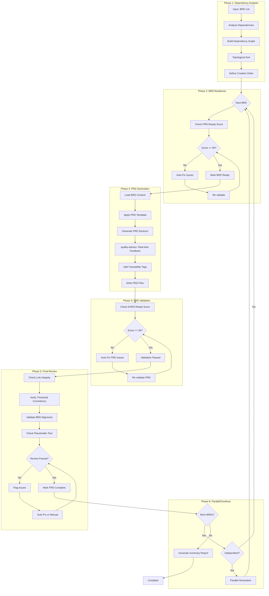
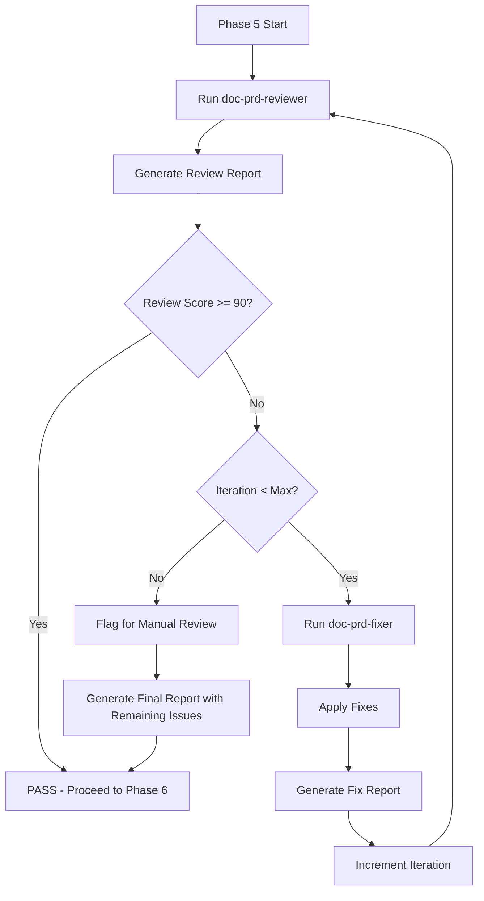

# doc-prd-autopilot

## Purpose

Automated **Product Requirements Document (PRD)** generation pipeline that processes one or more BRD documents and generates their corresponding PRDs with dependency awareness, readiness validation, and parallel execution support.

**Layer**: 2 (PRD Generation)

**Upstream**: BRD (Layer 1)

**Downstream**: EARS (Layer 3), BDD (Layer 4), ADR (Layer 5)

---

## Skill Dependencies

This autopilot orchestrates the following skills:

| Skill | Purpose | Phase |
|-------|---------|-------|
| `doc-naming` | Element ID format, threshold tags, legacy pattern detection | All Phases |
| `doc-brd-validator` | Validate BRD PRD-Ready score | Phase 2: BRD Readiness |
| `doc-prd` | PRD creation rules, template, section structure | Phase 3: PRD Generation |
| `quality-advisor` | Real-time quality feedback during PRD generation | Phase 3: PRD Generation |
| `doc-prd-validator` | Validate PRD structure, content, EARS-Ready score | Phase 4: PRD Validation |
| `doc-prd-reviewer` | Content review, link validation, quality scoring | Phase 5: Review |
| `doc-prd-fixer` | Apply fixes from review report, create missing files | Phase 5: Fix |

**Delegation Principle**: The autopilot orchestrates workflow but delegates:
- PRD structure/content rules → `doc-prd` skill
- Real-time quality feedback → `quality-advisor` skill
- PRD validation logic → `doc-prd-validator` skill
- BRD validation logic → `doc-brd-validator` skill
- Content review and scoring → `doc-prd-reviewer` skill
- Issue resolution and fixes → `doc-prd-fixer` skill

---

## When to Use This Skill

Use `doc-prd-autopilot` when:
- You have one or more completed BRD documents ready for PRD generation
- You want automated dependency analysis to determine optimal PRD creation order
- You need PRD-Ready score validation before generation
- You want automatic EARS-Ready score validation after PRD creation
- You need parallel PRD generation for independent BRDs

**Do NOT use when**:
- Creating a single PRD with extensive manual customization (use `doc-prd` instead)
- BRDs are incomplete or in Draft status
- You need fine-grained control over each PRD section

---

## 8-Step Autopilot Workflow

### Overview Diagram



### Step 1: Input BRD List

**Command Format**:
```
/doc-prd-autopilot <BRD_LIST>
```

**Input Options**:
- **Single BRD**: `BRD-01` or `docs/01_BRD/BRD-01_f1_iam/`
- **Multiple BRDs**: `BRD-01,BRD-02,BRD-03` (comma-separated)
- **All BRDs**: `all` or `*` (scan entire docs/01_BRD/ directory)
- **Pattern Match**: `BRD-0*` (glob patterns)

**Example Invocations**:
```bash
# Single BRD
/doc-prd-autopilot BRD-01

# Multiple specific BRDs
/doc-prd-autopilot BRD-01,BRD-02,BRD-05

# All available BRDs
/doc-prd-autopilot all

# Pattern match (foundation modules)
/doc-prd-autopilot BRD-0[1-7]
```

### Step 2: Dependency Analysis & Creation Order

The autopilot analyzes cross-BRD dependencies to determine optimal PRD creation order.

**Dependency Sources**:
1. **Explicit References**: `@depends-brd: BRD-NN` tags in BRD documents
2. **Cross-BRD References**: References to other BRDs in Traceability sections
3. **Module Dependencies**: Foundation module (F1-F7) vs Domain module (D1-D7) hierarchy
4. **Platform vs Feature**: Platform BRDs before Feature BRDs

**Algorithm**:
```python
def analyze_dependencies(brd_list):
    """
    1. Build directed graph of BRD dependencies
    2. Detect circular dependencies (error if found)
    3. Perform topological sort
    4. Group independent BRDs for parallel processing
    5. Return ordered execution plan
    """
    graph = build_dependency_graph(brd_list)

    if has_cycle(graph):
        raise CircularDependencyError()

    sorted_order = topological_sort(graph)
    parallel_groups = identify_independent_groups(sorted_order)

    return ExecutionPlan(sorted_order, parallel_groups)
```

**Output Example**:
```
Dependency Analysis Complete:
├── Execution Order: BRD-06 → BRD-07 → [BRD-01, BRD-02] → BRD-03 → BRD-04 → BRD-05
├── Parallel Groups:
│   ├── Group 1: [BRD-06] (Infrastructure)
│   ├── Group 2: [BRD-07] (Config)
│   ├── Group 3: [BRD-01, BRD-02] (Parallel - no dependencies)
│   ├── Group 4: [BRD-03] (depends on BRD-01)
│   └── Group 5: [BRD-04, BRD-05] (Parallel - depend on BRD-03)
└── Estimated Time: Sequential 7 units, Parallel 4 units
```

### Step 3: PRD-Ready Score Validation

Before generating a PRD, validate that the source BRD meets PRD-Ready requirements.

> **Skill Delegation**: This phase uses validation rules from `doc-brd-validator` skill.
> See: `.claude/skills/doc-brd-validator/SKILL.md` for complete BRD validation rules.

**PRD-Ready Scoring Criteria (100%)**:

| Category | Weight | Criteria |
|----------|--------|----------|
| Business Requirements Completeness | 40% | All 18 BRD sections present, objectives defined, stakeholders identified |
| Technical Readiness | 30% | Architecture Decision Requirements section complete, technology prerequisites documented |
| Business Alignment | 20% | Success criteria quantified, risks assessed, constraints documented |
| Traceability | 10% | Strategy references included, downstream placeholders defined |

**Minimum Score**: 90% (configurable)

**Auto-Fix Actions**:
| Issue | Auto-Fix Action |
|-------|-----------------|
| Missing timing profiles (p50/p95/p99) | Add template timing table |
| Pending ADR topics without elaboration | Add business driver and constraints placeholders |
| Missing threshold registry | Add Appendix with threshold template |
| Incomplete Document Control | Add missing required fields |
| Missing section numbers | Renumber sections sequentially |

**Validation Command** (internal):
```bash
python ai_dev_flow/scripts/validate_prd_ready.py \
  --brd docs/01_BRD/BRD-01_f1_iam/ \
  --min-score 90 \
  --auto-fix
```

### Step 4: PRD Generation

Generate the PRD document from the validated BRD with real-time quality feedback.

> **Skill Delegation**: This phase follows rules defined in `doc-prd` skill.
> See: `.claude/skills/doc-prd/SKILL.md` for complete PRD creation guidance.
>
> **Quality Guidance**: Uses `quality-advisor` skill for real-time feedback during generation.
> See: `.claude/skills/quality-advisor/SKILL.md` for quality monitoring.

**Generation Process**:

1. **Load BRD Content**:
   - Read all BRD section files (for sectioned BRDs)
   - Extract business requirements, objectives, stakeholders
   - Parse Architecture Decision Requirements topics

2. **Template Selection** (per `doc-prd` skill):
   - **MVP Template** (default): `ai_dev_flow/02_PRD/PRD-MVP-TEMPLATE.md` (17 sections, ≥85% thresholds)
   - **Full Template**: For enterprise/regulatory projects (21 sections, ≥90% thresholds)
   - **Section Templates**: For sectioned PRDs (>25KB)

3. **Section Mapping** (BRD → PRD):

| BRD Section | PRD Section(s) |
|-------------|----------------|
| 0. Document Control | 1. Document Control |
| 1. Executive Summary | 2. Executive Summary |
| 2. Business Context | 3. Problem Statement |
| 3. Stakeholder Analysis | 4. Target Audience & User Personas |
| 4. Business Requirements | 6. Goals & Objectives, 9. Functional Requirements |
| 5. Success Criteria | 5. Success Metrics (KPIs) |
| 6. Constraints | 12. Constraints & Assumptions |
| 7. Architecture Decision Requirements | 18. Traceability (Architecture Decision Requirements) |
| 8. Risk Assessment | 13. Risk Assessment |
| 9. Traceability | 18. Traceability |

4. **PRD-Specific Content Generation**:
   - Section 7: Scope & Requirements (derive from BRD scope)
   - Section 8: User Stories & User Roles (extract from stakeholders)
   - Section 10: Customer-Facing Content & Messaging (MANDATORY)
   - Section 11: Acceptance Criteria (from BRD success criteria)
   - Section 14: Success Definition (go-live criteria)
   - Section 15: Stakeholders & Communication
   - Section 16: Implementation Approach
   - Section 17: Budget & Resources
   - Section 19: References
   - Section 20: EARS Enhancement Appendix (timing, boundary, state, fallback)
   - Section 21: Quality Assurance & Testing Strategy

5. **Real-Time Quality Feedback** (via `quality-advisor` skill):
   - Monitor section completion as content is generated
   - Detect anti-patterns (AP-001 to AP-017) during creation
   - Validate cumulative tagging (@brd requirement for Layer 2)
   - Check element ID format compliance (PRD.NN.TT.SS)
   - Flag issues early to reduce post-generation rework

6. **Traceability Tags**:
   ```markdown
   @brd: BRD.01.01.01, BRD.01.01.02, BRD.01.23.01
   ```

7. **File Output** (ALWAYS use nested folder):
   - **Monolithic** (<20k tokens): `docs/02_PRD/PRD-NN_{slug}/PRD-NN_{slug}.md`
   - **Sectioned** (≥20k tokens): `docs/02_PRD/PRD-NN_{slug}/PRD-NN.0_index.md`, `PRD-NN.1_core.md`, etc.
   - **Master Index** (always): `docs/02_PRD/PRD-00_index.md` (create or update)

   **Nested Folder Rule**: ALL PRDs use nested folders (`PRD-NN_{slug}/`) regardless of size. This keeps companion files (review reports, fix reports, drift cache) organized with their parent document.

### Step 5: EARS-Ready Score Validation

After PRD generation, validate EARS-Ready score.

> **Skill Delegation**: This phase uses validation rules from `doc-prd-validator` skill.
> See: `.claude/skills/doc-prd-validator/SKILL.md` for complete validation rules and error codes.

**EARS-Ready Scoring Criteria (100%)**:

| Category | Weight | Criteria |
|----------|--------|----------|
| Business Requirements Clarity | 40% | SMART objectives, functional requirements, acceptance criteria |
| Requirements Maturity | 35% | System boundaries, stakeholder requirements, problem statement |
| EARS Translation Readiness | 20% | User journeys, quality attributes quantified, timing profiles |
| Strategic Alignment | 5% | Domain-specific business logic references |

**Minimum Score**: 85% for MVP (90% for full template) - configurable

**Auto-Fix Actions** (per `doc-prd-validator` error codes):

| Issue | Error Code | Auto-Fix Action |
|-------|------------|-----------------|
| Missing timing profile matrix | PRD-W002 | Add Section 20.1 template |
| Missing boundary value matrix | PRD-W002 | Add Section 20.2 template |
| Missing state transition diagram | PRD-W002 | Add Section 20.3 Mermaid template |
| Missing fallback documentation | PRD-W002 | Add Section 20.4 template |
| Incomplete customer-facing content | PRD-E006 | Flag for manual review (Section 10) |

### Step 6: Review & Fix Cycle (v2.3)

Iterative review and fix cycle to ensure PRD quality before completion.



#### 5.1 Initial Review

Run `doc-prd-reviewer` to identify issues.

```bash
/doc-prd-reviewer PRD-NN
```

**Output**: `PRD-NN.R_review_report_v001.md`

**Review Checklist**:

| Check | Description | Auto-Fix | Manual |
|-------|-------------|----------|--------|
| Link Integrity | All internal links between sections resolve | Yes | - |
| Threshold Consistency | Performance metrics match across sections | Yes | - |
| BRD Alignment | PRD content accurately reflects BRD requirements | - | Review |
| Placeholder Detection | No `[TODO]`, `[TBD]`, `YYYY-MM-DD` remaining | Yes | - |
| Traceability Tags | All `@brd:` tags reference valid BRD IDs | Yes | - |
| Cross-Reference Validity | `@depends:` and `@discoverability:` tags valid | Yes | - |
| Section Completeness | No empty or stub sections | - | Flag |
| Customer Content | Section 10 has substantive content | - | Flag |

#### 5.2 Fix Cycle

If review score < 90%, invoke `doc-prd-fixer`.

```bash
/doc-prd-fixer PRD-NN --revalidate
```

**Fix Categories**:

| Category | Fixes Applied |
|----------|---------------|
| Missing Files | Create glossary, reference docs |
| Broken Links | Update paths, create targets |
| Element IDs | Convert legacy patterns, fix invalid type codes |
| Content | Replace template placeholders, dates |
| References | Update traceability tags |
| Thresholds | Align inconsistent values to BRD source |

**Output**: `PRD-NN.F_fix_report_v001.md`

#### 5.3 Re-Review

After fixes, automatically re-run reviewer.

```bash
/doc-prd-reviewer PRD-NN
```

**Output**: `PRD-NN.R_review_report_v002.md`

#### 5.4 Iteration Control

| Parameter | Default | Description |
|-----------|---------|-------------|
| `max_iterations` | 3 | Maximum fix-review cycles |
| `target_score` | 90 | Minimum passing score |
| `stop_on_manual` | false | Stop if only manual issues remain |

**Iteration Example**:

```
Iteration 1:
  Review v001: Score 85 (2 errors, 4 warnings)
  Fix v001: Fixed 5 issues, created 1 file

Iteration 2:
  Review v002: Score 94 (0 errors, 2 warnings)
  Status: PASS (score >= 90)
```

#### 5.5 Quality Checks (Post-Fix)

After passing the fix cycle:

1. **Link Integrity Check**:
   ```
   Scanning PRD-01 for internal links...
   ├── PRD-01.0_index.md: 17 links found
   │   ├── PRD-01.1_document_control.md ✓
   │   ├── PRD-01.2_executive_summary.md ✓
   │   └── ... (all valid)
   └── Result: 0 broken links
   ```

2. **Threshold Consistency Check**:
   ```
   Comparing thresholds across sections...
   ├── Section 5 (Success Metrics): auth.p99 = 100ms
   ├── Section 9 (Quality Attributes): auth.p99 = 100ms
   ├── Section 17 (Appendix B.1): auth.p99 = 100ms
   └── Result: Consistent ✓
   ```

3. **BRD Alignment Check**:
   ```
   Verifying PRD requirements map to BRD source...
   ├── PRD.01.01.01 → BRD.01.01.01 (Multi-Provider Auth) ✓
   ├── PRD.01.01.02 → BRD.01.01.02 (4D Authorization) ✓
   └── Result: 12/12 requirements aligned ✓
   ```

4. **EARS-Ready Report**:
   ```
   EARS-Ready Score Breakdown
   =========================
   Business Requirements Clarity: 40/40
   Requirements Maturity:         35/35
   EARS Translation Readiness:    20/20
   Strategic Alignment:           5/5
   ----------------------------
   Total EARS-Ready Score:        100/100 (Target: >= 90)
   Status: READY FOR EARS GENERATION
   ```

5. **Traceability Matrix Update**:
   ```bash
   # Update PRD-00_TRACEABILITY_MATRIX.md
   python ai_dev_flow/scripts/update_traceability_matrix.py \
     --prd docs/02_PRD/PRD-NN_{slug}/PRD-NN_{slug}.md \
     --matrix docs/02_PRD/PRD-00_TRACEABILITY_MATRIX.md
   ```

---

### Step 7: Process Next BRD

After completing one PRD:
1. Mark current BRD→PRD as complete
2. Update traceability matrix
3. Move to next BRD in execution order
4. Repeat Steps 3-5

**Progress Tracking**:
```
PRD Generation Progress:
[████████░░░░░░░░] 3/7 Complete

Completed:
  ✓ PRD-06 (from BRD-06) - EARS-Ready: 94%
  ✓ PRD-07 (from BRD-07) - EARS-Ready: 92%
  ✓ PRD-01 (from BRD-01) - EARS-Ready: 96%

In Progress:
  ⟳ PRD-02 (from BRD-02) - Generating Section 10...

Pending:
  ○ PRD-03 (from BRD-03) - Awaiting BRD-01 completion
  ○ PRD-04 (from BRD-04)
  ○ PRD-05 (from BRD-05)
```

### Step 8: Parallel Generation

For independent BRDs (no cross-dependencies), generate PRDs in parallel.

**Parallel Execution Rules**:
1. **Independence Check**: No shared `@depends-brd` references
2. **Resource Limits**: Maximum 3 parallel generations (configurable)
3. **Failure Isolation**: One failure doesn't block others
4. **Progress Reporting**: Aggregate status updates

**Parallel Execution Example**:
```
Parallel Group Execution:
├── Thread 1: BRD-01 → PRD-01 [████████████████] 100%
├── Thread 2: BRD-02 → PRD-02 [████████████░░░░] 75%
└── Thread 3: BRD-05 → PRD-05 [████████░░░░░░░░] 50%
```

---

## Configuration

### Default Configuration

```yaml
# config/prd_autopilot.yaml
prd_autopilot:
  version: "1.2"

  scoring:
    prd_ready_min: 90
    ears_ready_min: 90
    review_score_min: 90
    strict_mode: false

  execution:
    max_parallel: 3
    auto_fix: true
    continue_on_error: false
    timeout_per_brd: 300  # seconds

  output:
    structure: auto  # auto, monolithic, sectioned
    size_threshold_kb: 25
    report_format: markdown

  validation:
    skip_validation: false
    fix_iterations_max: 3

  review:
    enabled: true
    check_links: true
    check_thresholds: true
    check_brd_alignment: true
    check_placeholders: true
    check_traceability: true
    auto_fix_links: true
    auto_fix_placeholders: true
    flag_customer_content: true
```

### Command Line Options

| Option | Default | Description |
|--------|---------|-------------|
| `--min-prd-ready` | 90 | Minimum PRD-Ready score |
| `--min-ears-ready` | 90 | Minimum EARS-Ready score |
| `--min-review-score` | 90 | Minimum Final Review score |
| `--max-parallel` | 3 | Maximum parallel PRD generations |
| `--no-auto-fix` | false | Disable auto-fix (manual only) |
| `--continue-on-error` | false | Continue if one BRD fails |
| `--dry-run` | false | Preview execution plan only |
| `--output-format` | auto | Force monolithic or sectioned output |
| `--skip-review` | false | Skip final content review phase |
| `--review-only` | false | Run only final review on existing PRD |

---

## Context Management

### Chunked Parallel Execution (MANDATORY)

**CRITICAL**: To prevent conversation context overflow errors ("Prompt is too long", "Conversation too long"), all autopilot operations MUST follow chunked execution rules:

**Chunk Size Limit**: Maximum 3 documents per chunk

**Chunking Rules**:
1. **Chunk Formation**: Group documents into chunks of maximum 3 documents each
2. **Sequential Chunk Processing**: Process one chunk at a time, completing all documents in a chunk before starting the next
3. **Context Pause**: After completing each chunk, provide a summary and pause for user acknowledgment
4. **Progress Tracking**: Display chunk progress (e.g., "Chunk 2/5: Processing BRD-04, BRD-05, BRD-06")

**Execution Pattern**:
```
Documents: BRD-01, BRD-02, BRD-03, BRD-04, BRD-05, BRD-06, BRD-07

Chunk 1: [BRD-01, BRD-02, BRD-03] → Process → Summary → Pause
Chunk 2: [BRD-04, BRD-05, BRD-06] → Process → Summary → Pause
Chunk 3: [BRD-07]                  → Process → Summary → Complete
```

**Chunk Completion Summary Template**:
```
Chunk N/M Complete:
├── Generated: PRD-01, PRD-02, PRD-03
├── EARS-Ready Scores: 94%, 92%, 91%
├── Status: All validated
└── Next: Continue with Chunk N+1? [Y/n]
```

**Why Chunking is Required**:
- Prevents "Conversation too long" errors during batch processing
- Allows context compaction between chunks
- Enables recovery from failures without losing all progress
- Provides natural checkpoints for user review

**Configuration Override**:
```yaml
execution:
  max_parallel: 3        # HARD LIMIT - do not exceed
  chunk_size: 3          # Documents per chunk
  pause_between_chunks: true
```

---

## Execution Modes

### Mode 1: Interactive (Default)

User confirms each step before proceeding.

```bash
/doc-prd-autopilot BRD-01,BRD-02 --interactive

# Output:
# Dependency Analysis: BRD-01 → BRD-02 (BRD-02 depends on BRD-01)
#
# [1/2] BRD-01: PRD-Ready Score = 92% (PASS)
# Generate PRD-01? [Y/n] y
# PRD-01 generated. EARS-Ready Score = 94% (PASS)
#
# [2/2] BRD-02: PRD-Ready Score = 88% (FAIL)
# Auto-fix available. Apply fixes? [Y/n] y
# Fixes applied. New score = 91% (PASS)
# Generate PRD-02? [Y/n] y
# PRD-02 generated. EARS-Ready Score = 90% (PASS)
#
# Summary: 2/2 PRDs generated successfully.
```

### Mode 2: Automatic

No user confirmation, auto-fix enabled.

```bash
/doc-prd-autopilot all --auto

# Output:
# PRD Autopilot - Automatic Mode
# ==============================
# Scanning: docs/01_BRD/
# Found: 7 BRDs
#
# Phase 1: Dependency Analysis... Done
# Phase 2-4: Processing...
#   [████████████████] 7/7 Complete
#
# Summary:
#   ✓ 7 PRDs generated
#   ✓ 3 BRDs auto-fixed
#   ✓ Average EARS-Ready: 93%
```

### Mode 3: Dry Run

Preview execution plan without generating files.

```bash
/doc-prd-autopilot all --dry-run

# Output:
# PRD Autopilot - Dry Run Mode
# ============================
#
# Execution Plan:
# 1. BRD-06 (Infrastructure) → PRD-06
# 2. BRD-07 (Config) → PRD-07
# 3. [Parallel] BRD-01, BRD-02 → PRD-01, PRD-02
# 4. BRD-03 → PRD-03
# 5. [Parallel] BRD-04, BRD-05 → PRD-04, PRD-05
#
# Estimated Duration: ~4 units (parallel) vs ~7 units (sequential)
#
# No files will be created in dry-run mode.
```

### Mode 4: Review Mode (v2.1)

Validate existing PRD documents and generate a quality report without modification.

**Purpose**: Audit existing PRD documents for compliance, quality scores, and identify issues.

**Command**:

```bash
# Review single PRD
/doc-prd-autopilot PRD-01 --mode review

# Review all PRDs
/doc-prd-autopilot all --mode review --output-report tmp/prd_review_report.md
```

**Review Report Structure**:

```markdown
# PRD Review Report: PRD-01_f1_iam

## Summary
- **EARS-Ready Score**: 87% 🟡
- **Final Review Score**: 85% 🟡
- **Total Issues**: 14
- **Auto-Fixable**: 10
- **Manual Review**: 4

## Score Breakdown
| Category | Score | Status |
|----------|-------|--------|
| Business Requirements Clarity | 38/40 | 🟡 |
| Requirements Maturity | 32/35 | 🟡 |
| EARS Translation Readiness | 18/20 | 🟡 |
| Strategic Alignment | 5/5 | ✅ |

## Final Review Checks
| Check | Status | Details |
|-------|--------|---------|
| Link Integrity | ✅ | All links valid |
| Threshold Consistency | 🟡 | 2 mismatches found |
| BRD Alignment | ✅ | All requirements traced |
| Placeholder Detection | ❌ | 3 [TODO] markers found |
| Traceability Tags | ✅ | Valid @brd references |
| Section 10 Content | 🟡 | Needs business review |

## Auto-Fixable Issues
| # | Issue | Location | Fix Action |
|---|-------|----------|------------|
| 1 | Legacy element ID | Section 9:L45 | Convert PO-001 to PRD.01.07.01 |
| 2 | Placeholder text | Section 14:L78 | Remove [TODO] marker |
| 3 | Inconsistent threshold | Section 5:L23 | Align to BRD value |
| ... | ... | ... | ... |

## Manual Review Required
| # | Issue | Location | Reason |
|---|-------|----------|--------|
| 1 | Incomplete Section 10 | Customer-Facing Content | Requires business input |
| 2 | Missing timing profile | Section 20.1 | Domain expertise needed |
| ... | ... | ... | ... |
```

**Review Configuration**:

```yaml
review_mode:
  enabled: true
  checks:
    - structure_validation      # 17/21 sections
    - element_id_compliance     # PRD.NN.TT.SS format
    - link_integrity            # Internal link check
    - threshold_consistency     # Cross-section consistency
    - brd_alignment             # Upstream traceability
    - placeholder_detection     # [TODO], [TBD] markers
    - traceability_tags         # @brd tag validation
    - section_10_content        # Customer-facing content
    - score_calculation         # EARS-Ready score
  output:
    format: markdown
    include_fix_suggestions: true
  thresholds:
    pass: 90
    warning: 85
    fail: 0
```

### Mode 5: Fix Mode (v2.1)

Auto-repair existing PRD documents while preserving manual content.

**Purpose**: Apply automated fixes to PRD documents to improve quality scores and compliance.

**Command**:

```bash
# Fix single PRD
/doc-prd-autopilot PRD-01 --mode fix

# Fix with backup
/doc-prd-autopilot PRD-01 --mode fix --backup

# Fix specific issue types only
/doc-prd-autopilot PRD-01 --mode fix --fix-types "element_ids,thresholds,placeholders"

# Dry-run fix (preview changes)
/doc-prd-autopilot PRD-01 --mode fix --dry-run
```

**Fix Categories and Actions**:

| Category | Issue | Auto-Fix Action | Preserves Content |
|----------|-------|-----------------|-------------------|
| **Element IDs** | Legacy PO-XXX format | Convert to PRD.NN.07.SS | ✅ |
| **Element IDs** | Legacy FF-XXX format | Convert to PRD.NN.01.SS | ✅ |
| **Element IDs** | Legacy AC-XXX format | Convert to PRD.NN.06.SS | ✅ |
| **Thresholds** | Inconsistent values | Align to BRD source | ✅ |
| **Thresholds** | Hardcoded values | Replace with @threshold | ✅ |
| **Links** | Broken internal links | Update paths or remove | ✅ |
| **Placeholders** | [TODO], [TBD] text | Remove markers, flag content | ✅ |
| **Sections** | Missing Document Control | Add from template | ✅ |
| **Sections** | Missing EARS-Ready score | Calculate and insert | ✅ |
| **Sections** | Missing Section 20 | Add EARS Enhancement template | ✅ |
| **Traceability** | Missing @brd tags | Add with placeholder | ✅ |
| **Traceability** | Invalid @brd reference | Correct or remove | ✅ |

**Content Preservation Rules**:

1. **Never delete** existing requirements or user stories
2. **Never modify** executive summary content
3. **Never change** stakeholder analysis details
4. **Only add** missing sections and metadata
5. **Only replace** legacy element IDs and placeholders
6. **Backup first** if `--backup` flag is set

**Element ID Migration**:

| Legacy Pattern | New Format | Example |
|----------------|------------|---------|
| `PO-XXX` | `PRD.NN.07.SS` | PO-001 → PRD.01.07.01 |
| `FF-XXX` | `PRD.NN.01.SS` | FF-001 → PRD.01.01.01 |
| `AC-XXX` | `PRD.NN.06.SS` | AC-001 → PRD.01.06.01 |
| `US-XXX` | `PRD.NN.08.SS` | US-001 → PRD.01.08.01 |

**Fix Report Structure**:

```markdown
# PRD Fix Report: PRD-01_f1_iam

## Summary
- **Before EARS-Ready Score**: 87% 🟡
- **After EARS-Ready Score**: 94% ✅
- **Issues Fixed**: 10
- **Issues Remaining**: 4 (manual review required)

## Fixes Applied
| # | Issue | Location | Fix Applied |
|---|-------|----------|-------------|
| 1 | Legacy element ID | Section 9:L45 | Converted PO-001 → PRD.01.07.01 |
| 2 | Placeholder text | Section 14:L78 | Removed [TODO] marker |
| 3 | Inconsistent threshold | Section 5:L23 | Aligned to BRD.01 value |
| ... | ... | ... | ... |

## Files Modified
- docs/02_PRD/PRD-01_f1_iam/PRD-01.0_index.md
- docs/02_PRD/PRD-01_f1_iam/PRD-01.5_success_metrics.md
- docs/02_PRD/PRD-01_f1_iam/PRD-01.9_functional_requirements.md

## Backup Location
- tmp/backup/PRD-01_f1_iam_20260209_143022/

## Score Impact
| Category | Before | After | Delta |
|----------|--------|-------|-------|
| Requirements Clarity | 38/40 | 40/40 | +2 |
| Requirements Maturity | 32/35 | 34/35 | +2 |
| EARS Translation | 18/20 | 19/20 | +1 |

## Next Steps
1. Complete Section 10 (Customer-Facing Content)
2. Add timing profile to Section 20.1
3. Re-run validation to confirm score
```

**Fix Configuration**:

```yaml
fix_mode:
  enabled: true
  backup:
    enabled: true
    location: "tmp/backup/"
    retention_days: 7

  fix_categories:
    element_ids: true        # Legacy ID conversion
    thresholds: true         # Consistency fixes
    links: true              # Broken link repair
    placeholders: true       # [TODO]/[TBD] removal
    sections: true           # Missing sections
    traceability: true       # @brd tag fixes

  preservation:
    executive_summary: true     # Never modify
    requirements: true          # Never delete
    user_stories: true          # Never modify
    comments: true              # Preserve user comments

  validation:
    re_validate_after_fix: true
    require_score_improvement: false
    max_fix_iterations: 3

  element_id_migration:
    PO_XXX_to_PRD_NN_07_SS: true
    FF_XXX_to_PRD_NN_01_SS: true
    AC_XXX_to_PRD_NN_06_SS: true
    US_XXX_to_PRD_NN_08_SS: true
```

**Command Line Options (Review/Fix)**:

| Option | Mode | Default | Description |
|--------|------|---------|-------------|
| `--mode review` | Review | - | Run review mode only |
| `--mode fix` | Fix | - | Run fix mode |
| `--output-report` | Both | auto | Report output path |
| `--backup` | Fix | true | Create backup before fixing |
| `--fix-types` | Fix | all | Comma-separated fix categories |
| `--dry-run` | Fix | false | Preview fixes without applying |
| `--preserve-all` | Fix | false | Extra cautious preservation |

---

## Output Files

### Generated PRD Structure

**Monolithic Output** (single file <25KB):
```
docs/02_PRD/
├── PRD-00_TRACEABILITY_MATRIX.md  # Updated
└── PRD-01_f1_iam.md               # New PRD
```

**Sectioned Output** (folder structure >=25KB):
```
docs/02_PRD/
├── PRD-00_TRACEABILITY_MATRIX.md  # Updated
└── PRD-01_f1_iam/
    ├── PRD-01.0_index.md
    ├── PRD-01.1_document_control.md
    ├── PRD-01.2_executive_summary.md
    ├── PRD-01.3_problem_statement.md
    ...
    └── PRD-01.21_qa_strategy.md
```

### Summary Report

Generated after completion:

```markdown
# PRD Autopilot Summary Report

**Execution Date**: 2026-02-08
**Input**: 7 BRDs
**Output**: 7 PRDs

## Execution Order

| Step | BRD | PRD | PRD-Ready | EARS-Ready | Duration | Status |
|------|-----|-----|-----------|------------|----------|--------|
| 1 | BRD-06 | PRD-06 | 94% | 92% | 45s | Success |
| 2 | BRD-07 | PRD-07 | 91% | 90% | 52s | Success |
| 3 | BRD-01 | PRD-01 | 96% | 96% | 48s | Success |
| 3 | BRD-02 | PRD-02 | 92% | 91% | 47s | Success (Parallel) |
| 4 | BRD-03 | PRD-03 | 90% | 93% | 50s | Success |
| 5 | BRD-04 | PRD-04 | 88%→91% | 90% | 62s | Success (Auto-fixed) |
| 5 | BRD-05 | PRD-05 | 93% | 94% | 44s | Success (Parallel) |

## Auto-Fixes Applied

| BRD | Issue | Fix Applied |
|-----|-------|-------------|
| BRD-04 | Missing timing profiles | Added p50/p95/p99 table |
| BRD-04 | Pending ADR topic | Added business driver |

## Next Steps

1. Review generated PRDs for domain-specific content
2. Complete Section 10 (Customer-Facing Content) manually if flagged
3. Run `/doc-ears-autopilot` to generate EARS from PRDs
```

---

## Error Handling

### Common Errors

| Error | Cause | Resolution |
|-------|-------|------------|
| `CircularDependencyError` | BRD-A depends on BRD-B and vice versa | Review and remove circular reference |
| `BRDNotFoundError` | Specified BRD does not exist | Check path and BRD ID |
| `PRDReadyScoreLow` | BRD score < 90% after auto-fix attempts | Manual BRD improvement required |
| `EARSReadyScoreLow` | PRD score < 90% after auto-fix | Manual PRD improvement required |
| `TemplateNotFoundError` | PRD template missing | Verify `ai_dev_flow/02_PRD/` exists |

### Recovery Actions

```bash
# Resume from last successful point
/doc-prd-autopilot resume

# Skip failed BRD and continue
/doc-prd-autopilot all --continue-on-error

# Retry single failed BRD
/doc-prd-autopilot BRD-04 --force
```

---

## Integration with Other Skills

### Upstream Skills
- **`doc-brd`**: Create/update BRDs before running autopilot
- **`doc-validator`**: Pre-validate BRDs for readiness

### Downstream Skills
- **`doc-ears-autopilot`**: Chain autopilot for EARS generation (future)
- **`doc-ears`**: Manual EARS creation from PRDs
- **`doc-prd`**: Manual PRD editing after autopilot

### Typical Workflow

```
1. doc-brd (create BRDs)
2. doc-prd-autopilot (generate PRDs) ← This skill
3. doc-ears (create EARS from PRDs)
4. doc-bdd (create BDD from EARS)
5. ... continue SDD workflow
```

---

## Prerequisites

Before using this skill, ensure:

1. **BRD Documents Exist**: At least one BRD in `docs/01_BRD/`
2. **Templates Available**: `ai_dev_flow/02_PRD/PRD-MVP-TEMPLATE.md`
3. **Shared Standards**: `.claude/skills/doc-flow/SHARED_CONTENT.md`

### Pre-Flight Check

```bash
# Verify BRD directory
ls docs/01_BRD/

# Verify PRD template
ls ai_dev_flow/02_PRD/PRD-MVP-TEMPLATE.md

# Check for existing PRDs
ls docs/02_PRD/ 2>/dev/null || echo "PRD directory will be created"
```

---

## Validation Checklist

After autopilot completion:

- [ ] All target PRDs generated
- [ ] Each PRD has EARS-Ready score >= 90%
- [ ] Each PRD has Final Review score >= 90%
- [ ] Traceability matrix updated (`PRD-00_TRACEABILITY_MATRIX.md`)
- [ ] Each PRD references upstream BRD with `@brd` tags
- [ ] Section 10 (Customer-Facing Content) has substantive content
- [ ] Section 20 (EARS Enhancement Appendix) completed
- [ ] No broken links in generated documents (verified by Final Review)
- [ ] No placeholder text remaining (verified by Final Review)
- [ ] Thresholds consistent across sections (verified by Final Review)
- [ ] BRD alignment verified (all PRD requirements trace to BRD source)

---

## Quick Reference

| Input | Output | Key Metric |
|-------|--------|------------|
| BRD(s) | PRD(s) | EARS-Ready >= 90% |

**Usage**:
```
/doc-prd-autopilot <BRD-LIST> [OPTIONS]
```

**Common Commands**:
```bash
# Single BRD
/doc-prd-autopilot BRD-01

# All BRDs (automatic)
/doc-prd-autopilot all --auto

# Preview only
/doc-prd-autopilot all --dry-run

# Resume after failure
/doc-prd-autopilot resume
```

---

## Related Resources

### Skills (Delegated)

- **PRD Skill**: `.claude/skills/doc-prd/SKILL.md` - PRD creation rules and structure
- **PRD Validator Skill**: `.claude/skills/doc-prd-validator/SKILL.md` - Validation rules and error codes
- **BRD Validator Skill**: `.claude/skills/doc-brd-validator/SKILL.md` - BRD readiness validation

### Templates and Rules

- **PRD Template**: `ai_dev_flow/02_PRD/PRD-MVP-TEMPLATE.md`
- **PRD Schema**: `ai_dev_flow/02_PRD/PRD_MVP_SCHEMA.yaml`
- **PRD Creation Rules**: `ai_dev_flow/02_PRD/PRD_MVP_CREATION_RULES.md`
- **PRD Validation Rules**: `ai_dev_flow/02_PRD/PRD_MVP_VALIDATION_RULES.md`

### Framework References

- **SDD Workflow**: `ai_dev_flow/SPEC_DRIVEN_DEVELOPMENT_GUIDE.md`
- **MVP Autopilot**: `ai_dev_flow/AUTOPILOT/MVP_AUTOPILOT.md`

---

## Review Document Standards (v2.2)

**IMPORTANT**: Review reports generated by this autopilot are formal project documents.

See: `.claude/skills/REVIEW_DOCUMENT_STANDARDS.md` for complete standards.

### Quick Reference

| Requirement | Value |
|-------------|-------|
| Storage Location | Same folder as reviewed PRD |
| File Name | `PRD-NN.R_review_report.md` |
| YAML Frontmatter | MANDATORY - see shared standards |
| Parent Reference | MANDATORY - link to PRD index |

**Example Location**:

```
docs/02_PRD/
├── PRD-03_f3_observability.md
└── PRD-03.R_review_report.md    # ← Review report stored here

docs/02_PRD/PRD-03_f3_observability/
├── PRD-03.0_index.md
├── PRD-03.1_core.md
└── PRD-03.R_review_report.md    # ← Review report stored here
```

---

## Version History

| Version | Date | Changes |
|---------|------|---------|
| 2.3 | 2026-02-10 | **Review & Fix Cycle**: Replaced Phase 5 (Step 6) with iterative Review -> Fix cycle using `doc-prd-reviewer` and `doc-prd-fixer`; Added `doc-prd-fixer` skill dependency; Added iteration control with max 3 cycles and 90% target score |
| 2.2 | 2026-02-10 | Added Review Document Standards: review reports stored alongside reviewed documents with YAML frontmatter and parent references; references shared `.claude/skills/REVIEW_DOCUMENT_STANDARDS.md` |
| 2.1 | 2026-02-09 | Added Mode 4: Review Mode for validation-only analysis with visual score indicators; Added Mode 5: Fix Mode for auto-repair with backup and content preservation; Element ID migration (PO-XXX→PRD.NN.07.SS, FF-XXX→PRD.NN.01.SS, AC-XXX→PRD.NN.06.SS, US-XXX→PRD.NN.08.SS) |
| 1.3 | 2026-02-08 | Integrated quality-advisor skill for real-time quality feedback in Phase 3 (PRD Generation) |
| 1.2 | 2026-02-08 | Added Phase 5: Final Content Review with link integrity, threshold consistency, BRD alignment, and placeholder detection checks |
| 1.1 | 2026-02-08 | Added skill dependencies, integrated doc-prd and doc-prd-validator skills |
| 1.0 | 2026-02-08 | Initial skill creation with 7-step workflow |
