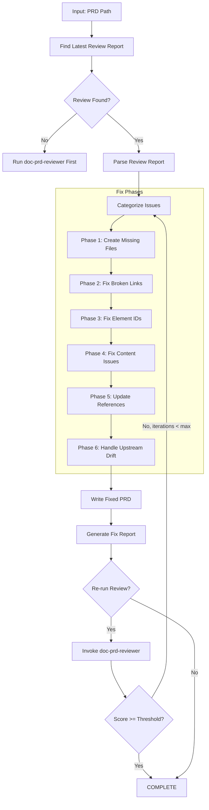
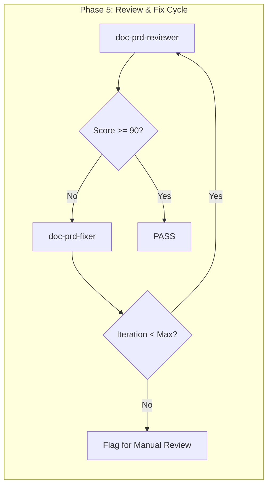

# doc-prd-fixer

## Purpose

Automated **fix skill** that reads the latest review report and applies fixes to PRD documents. This skill bridges the gap between `doc-prd-reviewer` (which identifies issues) and the corrected PRD, enabling iterative improvement cycles.

**Layer**: 2 (PRD Quality Improvement)

**Upstream**: PRD document, Review Report (`PRD-NN.R_review_report_vNNN.md`), BRD (source requirements)

**Downstream**: Fixed PRD, Fix Report (`PRD-NN.F_fix_report_vNNN.md`)

---

## When to Use This Skill

Use `doc-prd-fixer` when:

- **After Review**: Run after `doc-prd-reviewer` identifies issues
- **Iterative Improvement**: Part of Review -> Fix -> Review cycle
- **Automated Pipeline**: CI/CD integration for quality gates
- **Batch Fixes**: Apply fixes to multiple PRDs based on review reports

**Do NOT use when**:
- No review report exists (run `doc-prd-reviewer` first)
- Creating new PRD (use `doc-prd` or `doc-prd-autopilot`)
- Only need validation (use `doc-prd-validator`)

---

## Skill Dependencies

| Skill | Purpose | When Used |
|-------|---------|-----------|
| `doc-prd-reviewer` | Source of issues to fix | Input (reads review report) |
| `doc-naming` | Element ID standards | Fix element IDs |
| `doc-prd` | PRD creation rules | Create missing sections |
| `doc-brd-reviewer` | Upstream BRD validation | Check upstream alignment |

---

## Workflow Overview



---

## Fix Phases

### Phase 1: Create Missing Files

Creates files that are referenced but don't exist.

**Scope**:

| Missing File | Action | Template Used |
|--------------|--------|---------------|
| `PRD-00_GLOSSARY.md` | Create PRD glossary | Glossary template |
| `PRD-NN_APPENDIX_*.md` | Create appendix placeholder | Appendix template |
| Reference docs (`*_REF_*.md`) | Create placeholder | REF template |
| Feature specs | Create placeholder with TODO sections | Feature template |

**PRD Glossary Template**:

```markdown
---
title: "PRD-00: Product Glossary"
tags:
  - prd
  - glossary
  - reference
custom_fields:
  document_type: glossary
  artifact_type: PRD-REFERENCE
  layer: 2
---

# PRD-00: Product Glossary

Common terminology used across all Product Requirements Documents.

## Product Terms

| Term | Definition | Context |
|------|------------|---------|
| Feature | Discrete unit of product functionality | Scope definition |
| User Story | User-centric requirement format | Requirements |
| Acceptance Criteria | Conditions for feature completion | Validation |

## Technical Terms

| Term | Definition | Context |
|------|------------|---------|
| API | Application Programming Interface | Integration |
| UI | User Interface | Frontend |
| UX | User Experience | Design |

## Domain Terms

<!-- Add project-specific terminology below -->

| Term | Definition | Context |
|------|------------|---------|
| [Term] | [Definition] | [Where used] |
```

**Feature Placeholder Template**:

```markdown
---
title: "Feature Specification: [Feature Name]"
tags:
  - prd
  - feature-spec
  - reference
custom_fields:
  document_type: feature-spec
  status: placeholder
  created_by: doc-prd-fixer
---

# Feature Specification: [Feature Name]

> **Status**: Placeholder - Requires completion

## 1. Feature Overview

[TODO: Document feature overview]

## 2. User Stories

| Story ID | As a... | I want to... | So that... |
|----------|---------|--------------|------------|
| US-XX-01 | [Role] | [Action] | [Benefit] |

## 3. Acceptance Criteria

[TODO: Document acceptance criteria]

## 4. Dependencies

[TODO: Document feature dependencies]

---

*Created by doc-prd-fixer as placeholder. Complete this document to resolve broken link issues.*
```

---

### Phase 2: Fix Broken Links

Updates links to point to correct locations.

**Fix Actions**:

| Issue Code | Issue | Fix Action |
|------------|-------|------------|
| REV-L001 | Broken internal link | Update path or create target file |
| REV-L002 | External link unreachable | Add warning comment, keep link |
| REV-L003 | Absolute path used | Convert to relative path |
| REV-L004 | Broken BRD reference | Update to correct BRD path |

**Path Resolution Logic**:

```python
def fix_link_path(prd_location: str, target_path: str) -> str:
    """Calculate correct relative path based on PRD location."""

    # Monolithic PRD: docs/02_PRD/PRD-01.md
    # Sectioned PRD: docs/02_PRD/PRD-01_slug/PRD-01.3_section.md

    if is_sectioned_prd(prd_location):
        # Need to go up one more level
        return "../" + calculate_relative_path(prd_location, target_path)
    else:
        return calculate_relative_path(prd_location, target_path)
```

**BRD Link Fix**:

| PRD Type | Original Link | Fixed Link |
|----------|---------------|------------|
| Monolithic | `../01_BRD/BRD-01.md` | `../01_BRD/BRD-01.md` |
| Sectioned | `../01_BRD/BRD-01.md` | `../../01_BRD/BRD-01.md` |

---

### Phase 3: Fix Element IDs

Converts invalid element IDs to correct format.

**Conversion Rules**:

| Pattern | Issue | Conversion |
|---------|-------|------------|
| `PRD.NN.25.SS` | Code 25 invalid for PRD | `PRD.NN.01.SS` (Functional Requirement) |
| `PRD.NN.33.SS` | Code 33 invalid for PRD | `PRD.NN.22.SS` (Feature Item) |
| `FR-XXX` | Legacy pattern | `PRD.NN.01.SS` |
| `US-XXX` | Legacy pattern | `PRD.NN.05.SS` |
| `AC-XXX` | Legacy pattern | `PRD.NN.06.SS` |

**Type Code Mapping** (PRD-specific valid codes: 01-09, 11, 22, 24):

| Invalid Code | Valid Code | Element Type |
|--------------|------------|--------------|
| 25 | 01 | Functional Requirement |
| 33 | 22 | Feature Item |
| 35 | 06 | Acceptance Criterion |
| 10 | 09 | Business Rule |
| 12 | 11 | Interface Requirement |

**Regex Patterns**:

```python
# Find element IDs with invalid type codes for PRD
invalid_prd_type_25 = r'PRD\.(\d{2})\.25\.(\d{2})'
replacement_25 = r'PRD.\1.01.\2'

invalid_prd_type_33 = r'PRD\.(\d{2})\.33\.(\d{2})'
replacement_33 = r'PRD.\1.22.\2'

# Find legacy patterns
legacy_fr = r'###\s+FR-(\d+):'
legacy_us = r'###\s+US-(\d+):'
legacy_ac = r'###\s+AC-(\d+):'
```

---

### Phase 4: Fix Content Issues

Addresses placeholders and incomplete content.

**Fix Actions**:

| Issue Code | Issue | Fix Action |
|------------|-------|------------|
| REV-P001 | `[TODO]` placeholder | Flag for manual completion (cannot auto-fix) |
| REV-P002 | `[TBD]` placeholder | Flag for manual completion (cannot auto-fix) |
| REV-P003 | Template date `YYYY-MM-DD` | Replace with current date |
| REV-P004 | Template name `[Name]` | Replace with metadata author or flag |
| REV-P005 | Empty section | Add minimum template content |
| REV-P006 | Missing user story format | Flag for manual review |

**Auto-Replacements**:

```python
replacements = {
    'YYYY-MM-DDTHH:MM:SS': datetime.now().strftime('%Y-%m-%dT%H:%M:%S'),
    'YYYY-MM-DD': datetime.now().strftime('%Y-%m-%d'),
    'MM/DD/YYYY': datetime.now().strftime('%m/%d/%Y'),
    '[Current date]': datetime.now().strftime('%Y-%m-%dT%H:%M:%S'),
    '[Product Name]': extract_product_name_from_metadata(),
}
```

---

### Phase 5: Update References

Ensures traceability and cross-references are correct.

**Fix Actions**:

| Issue | Fix Action |
|-------|------------|
| Missing `@ref:` for created files | Add reference tag |
| Incorrect cross-PRD path | Update to correct relative path |
| Missing BRD traceability | Add BRD reference with `@trace: BRD-NN` |
| Missing traceability entry | Add to traceability matrix |

**Traceability Format**:

```markdown
<!-- Traceability to BRD -->
@trace: BRD-01.22.01 -> PRD-01.22.01

<!-- Reference to upstream -->
@ref: [BRD-01 Section 3](../01_BRD/BRD-01.md#3-business-requirements)
```

---

### Phase 6: Handle Upstream Drift

Addresses issues where upstream BRD documents have changed since PRD creation.

**Drift Issue Codes** (from `doc-prd-reviewer` Check #9):

| Code | Severity | Description | Auto-Fix Possible |
|------|----------|-------------|-------------------|
| REV-D001 | Warning | BRD modified after PRD | No (flag for review) |
| REV-D002 | Warning | Referenced BRD section content changed | No (flag for review) |
| REV-D003 | Info | BRD version incremented | Yes (update @ref version) |
| REV-D004 | Info | New requirements added to BRD | No (flag for review) |
| REV-D005 | Error | Critical BRD modification (>20% change) | No (flag for review) |

**Fix Actions**:

| Issue | Auto-Fix | Action |
|-------|----------|--------|
| REV-D001/D002/D004/D005 | No | Add `[DRIFT]` marker to affected references, generate drift summary |
| REV-D003 (version change) | Yes | Update `@ref:` tag to include current version |

**Drift Marker Format**:

```markdown
<!-- DRIFT: BRD-01.md modified 2026-02-08 (PRD created 2026-02-05) -->
@ref: [BRD-01 Section 3](../01_BRD/BRD-01.md#3-business-requirements)
```

**Drift Summary Block** (added to Fix Report):

```markdown
## Upstream Drift Summary

| Upstream Document | Reference | Modified | PRD Updated | Days Stale | Action Required |
|-------------------|-----------|----------|-------------|------------|-----------------|
| BRD-01.md | PRD-01.1:L57 | 2026-02-08 | 2026-02-05 | 3 | Review for changes |
| BRD-02.md | PRD-01.3:L319 | 2026-02-10 | 2026-02-05 | 5 | Review requirement updates |

**Recommendation**: Review upstream BRD documents and update PRD sections if requirements have changed.
Sections potentially affected:
- PRD-01.1 Section 3 (Feature Requirements)
- PRD-01.3 Section 13.1 (Upstream Dependencies)
```

**Drift Cache Update**:

After processing drift issues, update `.drift_cache.json`:

```json
{
  "prd_version": "1.0",
  "prd_updated": "2026-02-10",
  "drift_reviewed": "2026-02-10",
  "upstream_hashes": {
    "../01_BRD/BRD-01.md#3": "a1b2c3d4...",
    "../01_BRD/BRD-02.md": "e5f6g7h8..."
  },
  "acknowledged_drift": [
    {
      "document": "BRD-01.md",
      "acknowledged_date": "2026-02-10",
      "reason": "Reviewed - no PRD impact"
    }
  ]
}
```

**Drift Acknowledgment Workflow**:

When drift is flagged but no PRD update is needed:

1. Run `/doc-prd-fixer PRD-01 --acknowledge-drift`
2. Fixer prompts: "Review drift for BRD-01.md?"
3. User confirms no PRD changes needed
4. Fixer adds to `acknowledged_drift` array
5. Future reviews skip this drift until upstream changes again

---

## Command Usage

### Basic Usage

```bash
# Fix PRD based on latest review
/doc-prd-fixer PRD-01

# Fix with explicit review report
/doc-prd-fixer PRD-01 --review-report PRD-01.R_review_report_v001.md

# Fix and re-run review
/doc-prd-fixer PRD-01 --revalidate

# Fix with iteration limit
/doc-prd-fixer PRD-01 --revalidate --max-iterations 3
```

### Options

| Option | Default | Description |
|--------|---------|-------------|
| `--review-report` | latest | Specific review report to use |
| `--revalidate` | false | Run reviewer after fixes |
| `--max-iterations` | 3 | Max fix-review cycles |
| `--fix-types` | all | Specific fix types (comma-separated) |
| `--create-missing` | true | Create missing reference files |
| `--backup` | true | Backup PRD before fixing |
| `--dry-run` | false | Preview fixes without applying |
| `--acknowledge-drift` | false | Interactive drift acknowledgment mode |
| `--update-drift-cache` | true | Update .drift_cache.json after fixes |

### Fix Types

| Type | Description |
|------|-------------|
| `missing_files` | Create missing glossary, appendix, feature docs |
| `broken_links` | Fix link paths |
| `element_ids` | Convert invalid/legacy element IDs |
| `content` | Fix placeholders, dates, names |
| `references` | Update traceability and cross-references |
| `drift` | Handle upstream drift detection issues |
| `all` | All fix types (default) |

---

## Output Artifacts

### Fix Report

**File Naming**: `PRD-NN.F_fix_report_vNNN.md`

**Location**: Same folder as the PRD document.

**Structure**:

```markdown
---
title: "PRD-NN.F: Fix Report v001"
tags:
  - prd
  - fix-report
  - quality-assurance
custom_fields:
  document_type: fix-report
  artifact_type: PRD-FIX
  layer: 2
  parent_doc: PRD-NN
  source_review: PRD-NN.R_review_report_v001.md
  fix_date: "YYYY-MM-DDTHH:MM:SS"
  fix_tool: doc-prd-fixer
  fix_version: "1.0"
---

# PRD-NN Fix Report v001

## Summary

| Metric | Value |
|--------|-------|
| Source Review | PRD-NN.R_review_report_v001.md |
| Issues in Review | 12 |
| Issues Fixed | 10 |
| Issues Remaining | 2 (manual review required) |
| Files Created | 2 |
| Files Modified | 4 |

## Files Created

| File | Type | Location |
|------|------|----------|
| PRD-00_GLOSSARY.md | Product Glossary | docs/02_PRD/ |
| PRD-01_APPENDIX_A.md | Appendix Placeholder | docs/02_PRD/ |

## Fixes Applied

| # | Issue Code | Issue | Fix Applied | File |
|---|------------|-------|-------------|------|
| 1 | REV-L001 | Broken glossary link | Created PRD-00_GLOSSARY.md | PRD-01.3_features.md |
| 2 | REV-L004 | Broken BRD reference | Updated path to ../01_BRD/BRD-01.md | PRD-01.1_core.md |
| 3 | REV-N004 | Element type 25 invalid | Converted to type 01 | PRD-01.1_core.md |
| 4 | REV-L003 | Absolute path used | Converted to relative | PRD-01.2_requirements.md |

## Issues Requiring Manual Review

| # | Issue Code | Issue | Location | Reason |
|---|------------|-------|----------|--------|
| 1 | REV-P001 | [TODO] placeholder | PRD-01.2:L45 | Product decision needed |
| 2 | REV-P006 | Missing user story format | PRD-01.2:L120 | Story refinement required |

## Validation After Fix

| Metric | Before | After | Delta |
|--------|--------|-------|-------|
| Review Score | 92 | 97 | +5 |
| Errors | 2 | 0 | -2 |
| Warnings | 4 | 1 | -3 |

## Next Steps

1. Complete PRD-01_APPENDIX_A.md placeholder
2. Address remaining [TODO] placeholders
3. Run `/doc-prd-reviewer PRD-01` to verify fixes
```

---

## Integration with Autopilot

This skill is invoked by `doc-prd-autopilot` in the Review -> Fix cycle:



**Autopilot Integration Points**:

| Phase | Action | Skill |
|-------|--------|-------|
| Phase 5a | Run initial review | `doc-prd-reviewer` |
| Phase 5b | Apply fixes if issues found | `doc-prd-fixer` |
| Phase 5c | Re-run review | `doc-prd-reviewer` |
| Phase 5d | Repeat until pass or max iterations | Loop |

---

## Error Handling

### Recovery Actions

| Error | Action |
|-------|--------|
| Review report not found | Prompt to run `doc-prd-reviewer` first |
| Cannot create file (permissions) | Log error, continue with other fixes |
| Cannot parse review report | Abort with clear error message |
| Max iterations exceeded | Generate report, flag for manual review |
| BRD not found | Log warning, skip BRD-dependent fixes |

### Backup Strategy

Before applying any fixes:

1. Create backup in `tmp/backup/PRD-NN_YYYYMMDD_HHMMSS/`
2. Copy all PRD files to backup location
3. Apply fixes to original files
4. If error during fix, restore from backup

---

## Related Skills

| Skill | Relationship |
|-------|--------------|
| `doc-prd-reviewer` | Provides review report (input) |
| `doc-prd-autopilot` | Orchestrates Review -> Fix cycle |
| `doc-prd-validator` | Structural validation |
| `doc-naming` | Element ID standards |
| `doc-prd` | PRD creation rules |
| `doc-brd-reviewer` | Upstream BRD validation |

---

## Version History

| Version | Date | Changes |
|---------|------|---------|
| 1.0 | 2026-02-10 | Initial skill creation; 6-phase fix workflow; Glossary and feature file creation; Element ID conversion for PRD codes (01-09, 11, 22, 24); Broken link fixes; BRD drift detection; Integration with autopilot Review->Fix cycle |
