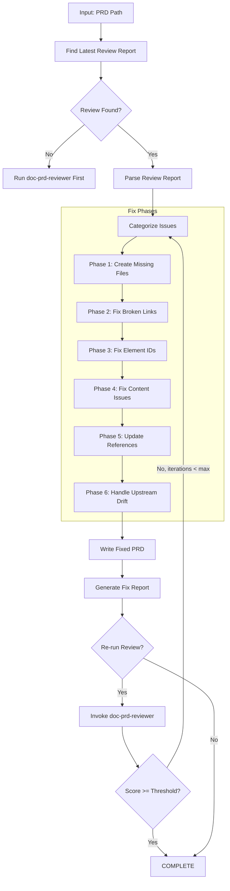
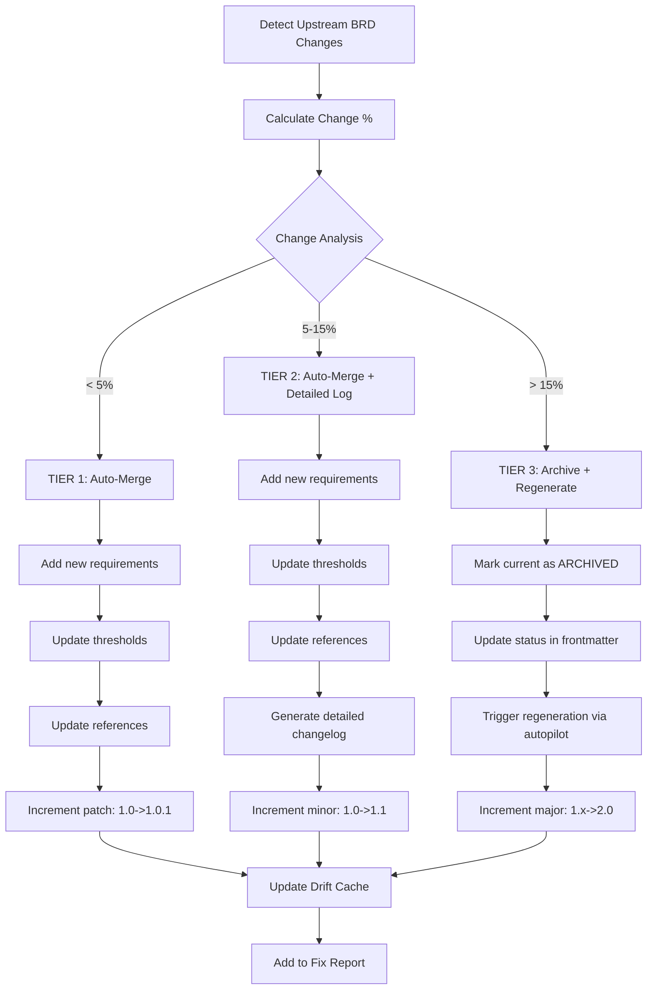
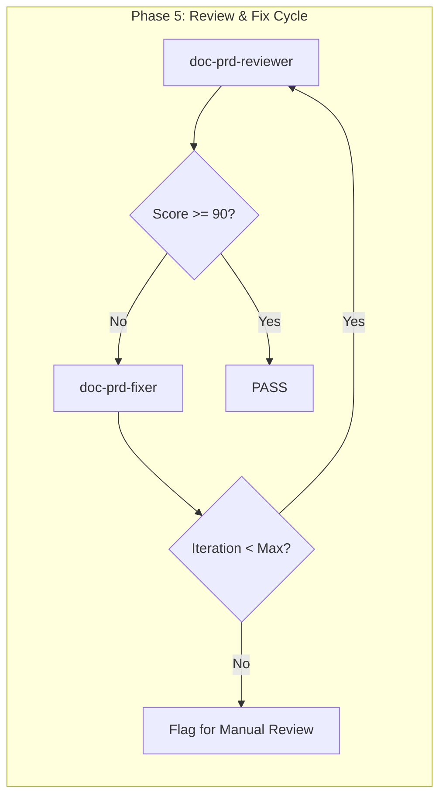

# doc-prd-fixer

## Purpose

Automated **fix skill** that reads the latest review report and applies fixes to PRD documents. This skill bridges the gap between `doc-prd-reviewer` (which identifies issues) and the corrected PRD, enabling iterative improvement cycles.

**Layer**: 2 (PRD Quality Improvement)

**Upstream**: PRD document, Review Report (`PRD-NN.R_review_report_vNNN.md`), BRD (source requirements)

**Downstream**: Fixed PRD, Fix Report (`PRD-NN.F_fix_report_vNNN.md`)

---

## When to Use This Skill

Use `doc-prd-fixer` when:

- **After Review**: Run after `doc-prd-reviewer` identifies issues
- **Iterative Improvement**: Part of Review -> Fix -> Review cycle
- **Automated Pipeline**: CI/CD integration for quality gates
- **Batch Fixes**: Apply fixes to multiple PRDs based on review reports

**Do NOT use when**:
- No review report exists (run `doc-prd-reviewer` first)
- Creating new PRD (use `doc-prd` or `doc-prd-autopilot`)
- Only need validation (use `doc-prd-validator`)

---

## Skill Dependencies

| Skill | Purpose | When Used |
|-------|---------|-----------|
| `doc-prd-reviewer` | Source of issues to fix | Input (reads review report) |
| `doc-naming` | Element ID standards | Fix element IDs |
| `doc-prd` | PRD creation rules | Create missing sections |
| `doc-brd-reviewer` | Upstream BRD validation | Check upstream alignment |

---

## Workflow Overview



---

## Fix Phases

### Phase 1: Create Missing Files

Creates files that are referenced but don't exist.

**Scope**:

| Missing File | Action | Template Used |
|--------------|--------|---------------|
| `PRD-00_GLOSSARY.md` | Create PRD glossary | Glossary template |
| `PRD-NN_APPENDIX_*.md` | Create appendix placeholder | Appendix template |
| Reference docs (`*_REF_*.md`) | Create placeholder | REF template |
| Feature specs | Create placeholder with TODO sections | Feature template |

**PRD Glossary Template**:

```markdown
---
title: "PRD-00: Product Glossary"
tags:
  - prd
  - glossary
  - reference
custom_fields:
  document_type: glossary
  artifact_type: PRD-REFERENCE
  layer: 2
---

# PRD-00: Product Glossary

Common terminology used across all Product Requirements Documents.

## Product Terms

| Term | Definition | Context |
|------|------------|---------|
| Feature | Discrete unit of product functionality | Scope definition |
| User Story | User-centric requirement format | Requirements |
| Acceptance Criteria | Conditions for feature completion | Validation |

## Technical Terms

| Term | Definition | Context |
|------|------------|---------|
| API | Application Programming Interface | Integration |
| UI | User Interface | Frontend |
| UX | User Experience | Design |

## Domain Terms

<!-- Add project-specific terminology below -->

| Term | Definition | Context |
|------|------------|---------|
| [Term] | [Definition] | [Where used] |
```

**Feature Placeholder Template**:

```markdown
---
title: "Feature Specification: [Feature Name]"
tags:
  - prd
  - feature-spec
  - reference
custom_fields:
  document_type: feature-spec
  status: placeholder
  created_by: doc-prd-fixer
---

# Feature Specification: [Feature Name]

> **Status**: Placeholder - Requires completion

## 1. Feature Overview

[TODO: Document feature overview]

## 2. User Stories

| Story ID | As a... | I want to... | So that... |
|----------|---------|--------------|------------|
| US-XX-01 | [Role] | [Action] | [Benefit] |

## 3. Acceptance Criteria

[TODO: Document acceptance criteria]

## 4. Dependencies

[TODO: Document feature dependencies]

---

*Created by doc-prd-fixer as placeholder. Complete this document to resolve broken link issues.*
```

---

### Phase 2: Fix Broken Links

Updates links to point to correct locations.

**Fix Actions**:

| Issue Code | Issue | Fix Action |
|------------|-------|------------|
| REV-L001 | Broken internal link | Update path or create target file |
| REV-L002 | External link unreachable | Add warning comment, keep link |
| REV-L003 | Absolute path used | Convert to relative path |
| REV-L004 | Broken BRD reference | Update to correct BRD path |

**Path Resolution Logic**:

```python
def fix_link_path(prd_location: str, target_path: str) -> str:
    """Calculate correct relative path based on PRD location."""

    # Monolithic PRD: docs/02_PRD/PRD-01.md
    # Sectioned PRD: docs/02_PRD/PRD-01_slug/PRD-01.3_section.md

    if is_sectioned_prd(prd_location):
        # Need to go up one more level
        return "../" + calculate_relative_path(prd_location, target_path)
    else:
        return calculate_relative_path(prd_location, target_path)
```

**BRD Link Fix**:

| PRD Type | Original Link | Fixed Link |
|----------|---------------|------------|
| Monolithic | `../01_BRD/BRD-01.md` | `../01_BRD/BRD-01.md` |
| Sectioned | `../01_BRD/BRD-01.md` | `../../01_BRD/BRD-01.md` |

---

### Phase 3: Fix Element IDs

Converts invalid element IDs to correct format.

**Conversion Rules**:

| Pattern | Issue | Conversion |
|---------|-------|------------|
| `PRD.NN.25.SS` | Code 25 invalid for PRD | `PRD.NN.01.SS` (Functional Requirement) |
| `PRD.NN.33.SS` | Code 33 invalid for PRD | `PRD.NN.22.SS` (Feature Item) |
| `FR-XXX` | Legacy pattern | `PRD.NN.01.SS` |
| `US-XXX` | Legacy pattern | `PRD.NN.05.SS` |
| `AC-XXX` | Legacy pattern | `PRD.NN.06.SS` |

**Type Code Mapping** (PRD-specific valid codes: 01-09, 11, 22, 24):

| Invalid Code | Valid Code | Element Type |
|--------------|------------|--------------|
| 25 | 01 | Functional Requirement |
| 33 | 22 | Feature Item |
| 35 | 06 | Acceptance Criterion |
| 10 | 09 | Business Rule |
| 12 | 11 | Interface Requirement |

**Regex Patterns**:

```python
# Find element IDs with invalid type codes for PRD
invalid_prd_type_25 = r'PRD\.(\d{2})\.25\.(\d{2})'
replacement_25 = r'PRD.\1.01.\2'

invalid_prd_type_33 = r'PRD\.(\d{2})\.33\.(\d{2})'
replacement_33 = r'PRD.\1.22.\2'

# Find legacy patterns
legacy_fr = r'###\s+FR-(\d+):'
legacy_us = r'###\s+US-(\d+):'
legacy_ac = r'###\s+AC-(\d+):'
```

---

### Phase 4: Fix Content Issues

Addresses placeholders and incomplete content.

**Fix Actions**:

| Issue Code | Issue | Fix Action |
|------------|-------|------------|
| REV-P001 | `[TODO]` placeholder | Flag for manual completion (cannot auto-fix) |
| REV-P002 | `[TBD]` placeholder | Flag for manual completion (cannot auto-fix) |
| REV-P003 | Template date `YYYY-MM-DD` | Replace with current date |
| REV-P004 | Template name `[Name]` | Replace with metadata author or flag |
| REV-P005 | Empty section | Add minimum template content |
| REV-P006 | Missing user story format | Flag for manual review |

**Auto-Replacements**:

```python
replacements = {
    'YYYY-MM-DDTHH:MM:SS': datetime.now().strftime('%Y-%m-%dT%H:%M:%S'),
    'YYYY-MM-DD': datetime.now().strftime('%Y-%m-%d'),
    'MM/DD/YYYY': datetime.now().strftime('%m/%d/%Y'),
    '[Current date]': datetime.now().strftime('%Y-%m-%dT%H:%M:%S'),
    '[Product Name]': extract_product_name_from_metadata(),
}
```

---

### Phase 5: Update References

Ensures traceability and cross-references are correct.

**Fix Actions**:

| Issue | Fix Action |
|-------|------------|
| Missing `@ref:` for created files | Add reference tag |
| Incorrect cross-PRD path | Update to correct relative path |
| Missing BRD traceability | Add BRD reference with `@trace: BRD-NN` |
| Missing traceability entry | Add to traceability matrix |

**Traceability Format**:

```markdown
<!-- Traceability to BRD -->
@trace: BRD-01.22.01 -> PRD-01.22.01

<!-- Reference to upstream -->
@ref: [BRD-01 Section 3](../01_BRD/BRD-01.md#3-business-requirements)
```

---

### Phase 6: Handle Upstream Drift (Auto-Merge)

Automatically merges upstream BRD changes into the PRD document based on change percentage thresholds.

**Drift Detection Workflow**:



---

#### 6.1 Change Percentage Calculation

```python
def calculate_change_percentage(upstream_old: str, upstream_new: str) -> dict:
    """
    Calculate change percentage between upstream BRD versions.

    Returns:
        {
            'total_change_pct': float,      # Overall change percentage
            'additions_pct': float,          # New content added
            'modifications_pct': float,      # Existing content modified
            'deletions_pct': float,          # Content removed (tracked, not applied)
            'change_type': str               # 'minor' | 'moderate' | 'major'
        }
    """
    old_lines = upstream_old.strip().split('\n')
    new_lines = upstream_new.strip().split('\n')

    # Use difflib for precise change detection
    import difflib
    diff = difflib.unified_diff(old_lines, new_lines)

    additions = sum(1 for line in diff if line.startswith('+') and not line.startswith('+++'))
    deletions = sum(1 for line in diff if line.startswith('-') and not line.startswith('---'))

    total_lines = max(len(old_lines), len(new_lines))
    total_change_pct = ((additions + deletions) / total_lines) * 100 if total_lines > 0 else 0

    return {
        'total_change_pct': round(total_change_pct, 2),
        'additions_pct': round((additions / total_lines) * 100, 2) if total_lines > 0 else 0,
        'modifications_pct': round((min(additions, deletions) / total_lines) * 100, 2) if total_lines > 0 else 0,
        'deletions_pct': round((deletions / total_lines) * 100, 2) if total_lines > 0 else 0,
        'change_type': 'minor' if total_change_pct < 5 else 'moderate' if total_change_pct < 15 else 'major'
    }
```

---

#### 6.2 Tier 1: Auto-Merge (< 5% Change)

**Trigger**: Total change percentage < 5%

**Actions**:

| Change Type | Auto-Action | Example |
|-------------|-------------|---------|
| New requirement added | Append with generated ID | `PRD.01.01.13` |
| Threshold value changed | Find & replace value | `timeout: 30 -> 45` |
| Reference updated | Update `@ref:` path | Path correction |
| Version incremented | Update version reference | `v1.2 -> v1.3` |

**ID Generation for New Requirements**:

```python
def generate_next_id(doc_type: str, doc_num: str, element_type: str, existing_ids: list) -> str:
    """
    Generate next sequential ID for new requirement.

    Args:
        doc_type: 'PRD', 'BRD', etc.
        doc_num: '01', '02', etc.
        element_type: '01' (Functional), '05' (User Story), etc.
        existing_ids: List of existing IDs in document

    Returns:
        Next available ID (e.g., 'PRD.01.01.13')
    """
    pattern = f"{doc_type}.{doc_num}.{element_type}."
    matching = [id for id in existing_ids if id.startswith(pattern)]

    if not matching:
        return f"{pattern}01"

    max_seq = max(int(id.split('.')[-1]) for id in matching)
    return f"{pattern}{str(max_seq + 1).zfill(2)}"
```

**ID Pattern for PRD**: `PRD.NN.TT.SS` where:
- `NN` = Document number (01, 02, etc.)
- `TT` = Type code (01=Functional, 05=User Story, 06=Acceptance Criterion, etc.)
- `SS` = Sequence number (01, 02, etc.)

**Auto-Merge Template for New Requirements**:

```markdown
### {GENERATED_ID}: {Requirement Title}

**Source**: Auto-merged from {upstream_brd} ({change_date})

**Requirement**: {requirement_text}

**User Stories**:
{user_stories}

**Acceptance Criteria**:
{acceptance_criteria}

**Priority**: {priority}

<!-- AUTO-MERGED: {timestamp} from {upstream_brd}#{section} -->
```

**Version Update**:
- Increment patch version: `1.0` -> `1.0.1`
- Update `last_updated` in frontmatter
- Add changelog entry

---

#### 6.3 Tier 2: Auto-Merge with Detailed Log (5-15% Change)

**Trigger**: Total change percentage between 5% and 15%

**Actions**: Same as Tier 1, plus:

| Additional Action | Description |
|-------------------|-------------|
| Detailed changelog | Section-by-section change log |
| Impact analysis | Which downstream artifacts affected (EARS, BDD) |
| Merge markers | `<!-- MERGED: ... -->` comments |
| Version history | Detailed version history entry |

**Changelog Entry Format**:

```markdown
## Changelog

### Version 1.1 (2026-02-10T16:00:00)

**Upstream Sync**: Auto-merged 8.5% changes from upstream BRD documents

| Change | Source | Section | Description |
|--------|--------|---------|-------------|
| Added | BRD-01.1_core.md | 3.5 | New passkey authentication requirement |
| Updated | BRD-01.2_requirements.md | 4.2 | Session timeout changed 30->45 min |
| Added | BRD-01.3_quality_ops.md | 7.2 | New performance requirement |

**New Requirements Added**:
- PRD.01.01.13: Passkey Authentication Support
- PRD.01.01.14: WebAuthn Fallback Mechanism

**Thresholds Updated**:
- PRD.01.02.05: session_idle_timeout: 30->45 min

**Impact**: EARS-01, BDD-01, ADR-01 may require review
```

**Version Update**:
- Increment minor version: `1.0` -> `1.1`
- Update `last_updated` in frontmatter
- Add detailed changelog entry

---

#### 6.4 Tier 3: Archive and Regenerate (> 15% Change)

**Trigger**: Total change percentage > 15%

**Actions**:

| Step | Action | Result |
|------|--------|--------|
| 1 | Mark current version as ARCHIVED | Status update in frontmatter |
| 2 | Create archive copy | `PRD-01_v1.0_archived.md` |
| 3 | Update frontmatter status | `status: archived` |
| 4 | Trigger autopilot regeneration | New version generated |
| 5 | Increment major version | `1.x` -> `2.0` |

**Archive Frontmatter Update**:

```yaml
---
title: "PRD-01: F1 Identity & Access Management"
custom_fields:
  version: "1.2"
  status: "archived"                    # Changed from 'current'
  archived_date: "2026-02-10T16:00:00"
  archived_reason: "upstream_drift_major"
  superseded_by: "PRD-01_v2.0"
  upstream_change_pct: 18.5
---
```

**Archive File Naming**:

```
docs/02_PRD/PRD-01_f1_iam/
├── PRD-01.0_index.md              # Current (v2.0)
├── PRD-01.1_core.md               # Current (v2.0)
├── .archive/
│   ├── v1.2/
│   │   ├── PRD-01.0_index.md      # Archived v1.2
│   │   ├── PRD-01.1_core.md
│   │   └── ARCHIVE_MANIFEST.md    # Archive metadata
```

**ARCHIVE_MANIFEST.md**:

```markdown
# Archive Manifest: PRD-01 v1.2

| Field | Value |
|-------|-------|
| Archived Version | 1.2 |
| Archived Date | 2026-02-10T16:00:00 |
| Reason | Upstream drift > 15% (18.5%) |
| Superseded By | v2.0 |
| Upstream Changes | BRD-01 (major revision) |

## Change Summary

| Upstream Document | Change % | Key Changes |
|-------------------|----------|-------------|
| BRD-01.1_core.md | 18.5% | New auth methods, revised security model |

## Downstream Impact

Documents requiring update after regeneration:
- EARS-01 (derived from PRD-01)
- BDD-01 (test scenarios)
- ADR-01 (architecture decisions)
```

**No Deletion Policy**:

- Upstream content marked as deleted is **NOT** removed from document
- Instead, marked with `[DEPRECATED]` status:

```markdown
### PRD.01.01.05: Legacy Authentication Method [DEPRECATED]

> **Status**: DEPRECATED (upstream removed 2026-02-10T16:00:00)
> **Reason**: Replaced by PRD.01.01.13 (Passkey Authentication)
> **Action**: Retain for traceability; do not implement

**Original Requirement**: {original_text}
```

---

#### 6.5 Drift Cache Update

After processing drift, update `.drift_cache.json`:

```json
{
  "document_version": "1.1",
  "last_synced": "2026-02-10T16:00:00",
  "sync_status": "auto-merged",
  "upstream_state": {
    "../01_BRD/BRD-01.1_core.md": {
      "hash": "sha256:a1b2c3d4e5f6...",
      "version": "2.3",
      "last_modified": "2026-02-10T15:30:00",
      "change_pct": 4.2,
      "sync_action": "tier1_auto_merge"
    },
    "../01_BRD/BRD-01.2_requirements.md": {
      "hash": "sha256:g7h8i9j0k1l2...",
      "version": "1.5",
      "last_modified": "2026-02-10T14:00:00",
      "change_pct": 8.7,
      "sync_action": "tier2_auto_merge_detailed"
    }
  },
  "merge_history": [
    {
      "date": "2026-02-10T16:00:00",
      "tier": 1,
      "change_pct": 4.2,
      "items_added": 1,
      "items_updated": 2,
      "version_before": "1.0",
      "version_after": "1.0.1"
    }
  ],
  "deprecated_items": [
    {
      "id": "PRD.01.01.05",
      "deprecated_date": "2026-02-10T16:00:00",
      "reason": "Upstream removal",
      "replaced_by": "PRD.01.01.13"
    }
  ]
}
```

---

#### 6.6 Fix Report: Drift Section

**Drift Summary in Fix Report**:

```markdown
## Phase 6: Upstream Drift Resolution

### Drift Analysis Summary

| Upstream Document | Change % | Tier | Action Taken |
|-------------------|----------|------|--------------|
| BRD-01.1_core.md | 4.2% | 1 | Auto-merged |
| BRD-01.2_requirements.md | 8.7% | 2 | Auto-merged (detailed) |
| BRD-01.3_quality_ops.md | 18.5% | 3 | Archived + Regenerated |

### Tier 1 Auto-Merges (< 5%)

| ID | Type | Source | Description |
|----|------|--------|-------------|
| PRD.01.01.13 | Added | BRD-01.1:3.5 | Passkey authentication support |
| PRD.01.02.05 | Updated | BRD-01.1:4.2 | Session timeout 30->45 min |

### Tier 2 Auto-Merges (5-15%)

| ID | Type | Source | Description |
|----|------|--------|-------------|
| PRD.01.01.14 | Added | BRD-01.2:5.3 | WebAuthn fallback mechanism |
| PRD.01.07.04 | Added | BRD-01.2:7.2 | New risk: credential phishing |

### Tier 3 Archives (> 15%)

| Document | Previous Version | New Version | Reason |
|----------|------------------|-------------|--------|
| PRD-01.2_requirements.md | 1.2 | 2.0 | 18.5% upstream change |

**Archive Location**: `docs/02_PRD/PRD-01_f1_iam/.archive/v1.2/`

### Deprecated Items (No Deletion)

| ID | Deprecated Date | Reason | Replaced By |
|----|-----------------|--------|-------------|
| PRD.01.01.05 | 2026-02-10T16:00:00 | Upstream removed | PRD.01.01.13 |

### Version Changes

| File | Before | After | Change Type |
|------|--------|-------|-------------|
| PRD-01.1_core.md | 1.0 | 1.0.1 | Patch (Tier 1) |
| PRD-01.2_requirements.md | 1.0 | 1.1 | Minor (Tier 2) |
| PRD-01.3_features.md | 1.2 | 2.0 | Major (Tier 3) |
```

---

## Command Usage

### Basic Usage

```bash
# Fix PRD based on latest review
/doc-prd-fixer PRD-01

# Fix with explicit review report
/doc-prd-fixer PRD-01 --review-report PRD-01.R_review_report_v001.md

# Fix and re-run review
/doc-prd-fixer PRD-01 --revalidate

# Fix with iteration limit
/doc-prd-fixer PRD-01 --revalidate --max-iterations 3
```

### Options

| Option | Default | Description |
|--------|---------|-------------|
| `--review-report` | latest | Specific review report to use |
| `--revalidate` | false | Run reviewer after fixes |
| `--max-iterations` | 3 | Max fix-review cycles |
| `--fix-types` | all | Specific fix types (comma-separated) |
| `--create-missing` | true | Create missing reference files |
| `--backup` | true | Backup PRD before fixing |
| `--dry-run` | false | Preview fixes without applying |
| `--acknowledge-drift` | false | Interactive drift acknowledgment mode |
| `--update-drift-cache` | true | Update .drift_cache.json after fixes |

### Fix Types

| Type | Description |
|------|-------------|
| `missing_files` | Create missing glossary, appendix, feature docs |
| `broken_links` | Fix link paths |
| `element_ids` | Convert invalid/legacy element IDs |
| `content` | Fix placeholders, dates, names |
| `references` | Update traceability and cross-references |
| `drift` | Handle upstream drift detection issues |
| `all` | All fix types (default) |

---

## Output Artifacts

### Fix Report

**Nested Folder Rule**: ALL PRDs use nested folders (`PRD-NN_{slug}/`) regardless of size. Fix reports are stored alongside the PRD document in the nested folder.

**File Naming**: `PRD-NN.F_fix_report_vNNN.md`

**Location**: Inside the PRD nested folder: `docs/02_PRD/PRD-NN_{slug}/`

**Structure**:

```markdown
---
title: "PRD-NN.F: Fix Report v001"
tags:
  - prd
  - fix-report
  - quality-assurance
custom_fields:
  document_type: fix-report
  artifact_type: PRD-FIX
  layer: 2
  parent_doc: PRD-NN
  source_review: PRD-NN.R_review_report_v001.md
  fix_date: "YYYY-MM-DDTHH:MM:SS"
  fix_tool: doc-prd-fixer
  fix_version: "2.0"
---

# PRD-NN Fix Report v001

## Summary

| Metric | Value |
|--------|-------|
| Source Review | PRD-NN.R_review_report_v001.md |
| Issues in Review | 12 |
| Issues Fixed | 10 |
| Issues Remaining | 2 (manual review required) |
| Files Created | 2 |
| Files Modified | 4 |

## Files Created

| File | Type | Location |
|------|------|----------|
| PRD-00_GLOSSARY.md | Product Glossary | docs/02_PRD/ |
| PRD-01_APPENDIX_A.md | Appendix Placeholder | docs/02_PRD/ |

## Fixes Applied

| # | Issue Code | Issue | Fix Applied | File |
|---|------------|-------|-------------|------|
| 1 | REV-L001 | Broken glossary link | Created PRD-00_GLOSSARY.md | PRD-01.3_features.md |
| 2 | REV-L004 | Broken BRD reference | Updated path to ../01_BRD/BRD-01.md | PRD-01.1_core.md |
| 3 | REV-N004 | Element type 25 invalid | Converted to type 01 | PRD-01.1_core.md |
| 4 | REV-L003 | Absolute path used | Converted to relative | PRD-01.2_requirements.md |

## Issues Requiring Manual Review

| # | Issue Code | Issue | Location | Reason |
|---|------------|-------|----------|--------|
| 1 | REV-P001 | [TODO] placeholder | PRD-01.2:L45 | Product decision needed |
| 2 | REV-P006 | Missing user story format | PRD-01.2:L120 | Story refinement required |

## Validation After Fix

| Metric | Before | After | Delta |
|--------|--------|-------|-------|
| Review Score | 92 | 97 | +5 |
| Errors | 2 | 0 | -2 |
| Warnings | 4 | 1 | -3 |

## Next Steps

1. Complete PRD-01_APPENDIX_A.md placeholder
2. Address remaining [TODO] placeholders
3. Run `/doc-prd-reviewer PRD-01` to verify fixes
```

---

## Integration with Autopilot

This skill is invoked by `doc-prd-autopilot` in the Review -> Fix cycle:



**Autopilot Integration Points**:

| Phase | Action | Skill |
|-------|--------|-------|
| Phase 5a | Run initial review | `doc-prd-reviewer` |
| Phase 5b | Apply fixes if issues found | `doc-prd-fixer` |
| Phase 5c | Re-run review | `doc-prd-reviewer` |
| Phase 5d | Repeat until pass or max iterations | Loop |

---

## Error Handling

### Recovery Actions

| Error | Action |
|-------|--------|
| Review report not found | Prompt to run `doc-prd-reviewer` first |
| Cannot create file (permissions) | Log error, continue with other fixes |
| Cannot parse review report | Abort with clear error message |
| Max iterations exceeded | Generate report, flag for manual review |
| BRD not found | Log warning, skip BRD-dependent fixes |

### Backup Strategy

Before applying any fixes:

1. Create backup in `tmp/backup/PRD-NN_YYYYMMDD_HHMMSS/`
2. Copy all PRD files to backup location
3. Apply fixes to original files
4. If error during fix, restore from backup

---

## Related Skills

| Skill | Relationship |
|-------|--------------|
| `doc-prd-reviewer` | Provides review report (input) |
| `doc-prd-autopilot` | Orchestrates Review -> Fix cycle |
| `doc-prd-validator` | Structural validation |
| `doc-naming` | Element ID standards |
| `doc-prd` | PRD creation rules |
| `doc-brd-reviewer` | Upstream BRD validation |

---

## Version History

| Version | Date | Changes |
|---------|------|---------|
| 2.0 | 2026-02-10T16:00:00 | **Major**: Implemented tiered auto-merge system - Tier 1 (<5%): auto-merge additions/updates with patch version increment; Tier 2 (5-15%): auto-merge with detailed changelog and minor version increment; Tier 3 (>15%): archive current version and trigger regeneration with major version increment; No deletion policy (mark as DEPRECATED instead); Auto-generated IDs for new requirements (PRD.NN.TT.SS format); Archive manifest creation; Enhanced drift cache with merge history |
| 1.0 | 2026-02-10T15:00:00 | Initial skill creation; 6-phase fix workflow; Glossary and feature file creation; Element ID conversion for PRD codes (01-09, 11, 22, 24); Broken link fixes; BRD drift detection; Integration with autopilot Review->Fix cycle |
