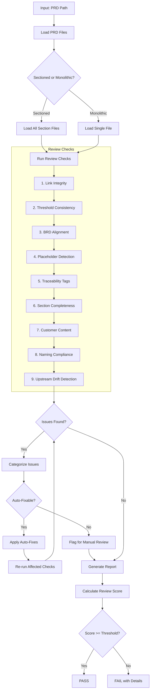
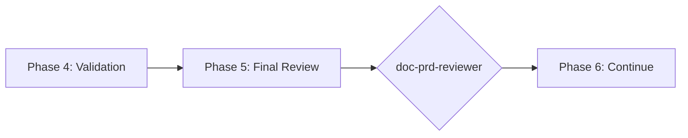

# doc-prd-reviewer

## Purpose

Comprehensive **content review and quality assurance** for Product Requirements Documents (PRD). This skill performs deep content analysis beyond structural validation, checking link integrity, threshold consistency, BRD alignment, and identifying issues that require manual business review.

**Layer**: 2 (PRD Quality Assurance)

**Upstream**: PRD (from `doc-prd-autopilot` or `doc-prd`)

**Downstream**: None (final QA gate before EARS generation)

---

## When to Use This Skill

Use `doc-prd-reviewer` when:

- **After PRD Generation**: Run immediately after `doc-prd-autopilot` completes
- **Manual PRD Edits**: After making manual changes to a PRD
- **Pre-EARS Check**: Before running `doc-ears-autopilot`
- **Periodic Review**: Regular quality checks on existing PRDs
- **CI/CD Integration**: Automated review gate in documentation pipelines

**Do NOT use when**:
- PRD does not exist yet (use `doc-prd` or `doc-prd-autopilot` first)
- Need structural/schema validation only (use `doc-prd-validator`)
- Generating new PRD content (use `doc-prd`)

---

## Skill vs Validator: Key Differences

| Aspect | `doc-prd-validator` | `doc-prd-reviewer` |
|--------|---------------------|-------------------|
| **Focus** | Schema compliance, EARS-Ready score | Content quality, cross-document consistency |
| **Checks** | Required sections, field formats | Link integrity, threshold alignment, placeholders |
| **Auto-Fix** | Structural issues only | Content issues (links, dates, placeholders) |
| **Output** | EARS-Ready score (numeric) | Review score + issue list |
| **Phase** | Phase 4 (Validation) | Phase 5 (Final Review) |
| **Blocking** | EARS-Ready < threshold blocks | Review score < threshold flags |

---

## Review Workflow



---

## Review Checks

### 1. Link Integrity

Validates all internal document links resolve correctly.

**Scope**:
- Navigation links (`[Previous: ...]`, `[Next: ...]`)
- Section cross-references (`[See Section 8.2](...)`)
- Index to section links
- External documentation links (warns if unreachable)

**Detection**:
```
Scanning PRD-01 for internal links...
├── PRD-01.0_index.md: 17 links found
│   ├── PRD-01.1_document_control.md ✓
│   ├── PRD-01.2_executive_summary.md ✓
│   ├── PRD-01.18_missing_section.md ✗ NOT FOUND
│   └── ...
└── Result: 1 broken link found
```

**Auto-Fix**:
- Remove broken links to non-existent sections
- Correct path typos if target exists with similar name
- Update relative paths if file was moved

**Error Codes**:
| Code | Severity | Description |
|------|----------|-------------|
| REV-L001 | Error | Broken internal link |
| REV-L002 | Warning | External link unreachable |
| REV-L003 | Info | Link path uses absolute instead of relative |

---

### 2. Threshold Consistency

Verifies performance metrics match across all sections.

**Scope**:
- Section 5 (Success Metrics) thresholds
- Section 9 (Quality Attributes) performance targets
- Section 17/20 (Appendix B.1) timing profile matrix
- Cross-references to BRD thresholds

**Detection**:
```
Comparing thresholds across sections...
├── Operation: auth.p99
│   ├── Section 5 (Success Metrics): 100ms ✓
│   ├── Section 9 (Quality Attributes): 100ms ✓
│   ├── Section 17 (Timing Matrix): 100ms ✓
│   └── BRD-01 (Source): 100ms ✓
├── Operation: authz.p99
│   ├── Section 5: 10ms ✓
│   ├── Section 9: 15ms ✗ MISMATCH
│   ├── Section 17: 10ms ✓
│   └── BRD-01: 10ms ✓
└── Result: 1 inconsistency found
```

**Auto-Fix**:
- Align PRD values to BRD source (authoritative)
- Update all sections to use consistent value
- Add comment noting auto-fix with timestamp

**Error Codes**:
| Code | Severity | Description |
|------|----------|-------------|
| REV-T001 | Error | Threshold mismatch across PRD sections |
| REV-T002 | Error | Threshold differs from BRD source |
| REV-T003 | Warning | Threshold unit inconsistency (ms vs s) |
| REV-T004 | Info | Threshold stricter than BRD (acceptable) |

---

### 3. BRD Alignment

Validates PRD requirements accurately reflect BRD source.

**Scope**:
- Every PRD requirement maps to a BRD requirement
- No orphaned requirements (PRD without BRD source)
- No missing requirements (BRD without PRD mapping)
- Scope boundaries match

**Detection**:
```
Verifying PRD requirements map to BRD source...
├── PRD.01.01.01 → BRD.01.01.01 (Multi-Provider Auth) ✓
├── PRD.01.01.02 → BRD.01.01.02 (4D Authorization) ✓
├── PRD.01.01.03 → BRD.01.01.03 (Trust Levels) ✓
├── PRD.01.01.09 → ??? ✗ NO BRD MAPPING
├── BRD.01.01.10 → ??? ✗ NO PRD MAPPING (deferred)
└── Result: 11/12 aligned, 1 orphan, 1 missing

Scope Alignment:
├── PRD In-Scope vs BRD In-Scope: MATCH ✓
├── PRD Out-Scope vs BRD Out-Scope: MATCH ✓
└── Deferred items: 2 (correctly marked)
```

**Manual Review Required**:
- Orphaned requirements need justification
- Missing requirements need explicit deferral note
- Scope mismatches need business decision

**Error Codes**:
| Code | Severity | Description |
|------|----------|-------------|
| REV-A001 | Error | PRD requirement without BRD source |
| REV-A002 | Warning | BRD requirement without PRD mapping |
| REV-A003 | Error | Scope mismatch (PRD vs BRD) |
| REV-A004 | Info | Requirement correctly marked as deferred |

---

### 4. Placeholder Detection

Identifies incomplete content requiring replacement.

**Scope**:
- `[TODO]`, `[TBD]`, `[PLACEHOLDER]` text
- Template dates: `YYYY-MM-DDTHH:MM:SS`, `MM/DD/YYYY`
- Template names: `[Name]`, `[Author]`, `[Reviewer]`
- Empty sections: `<!-- Content here -->`
- Lorem ipsum or sample text

**Detection**:
```
Scanning for placeholder text...
├── [TODO]: 0 found ✓
├── [TBD]: 1 found
│   └── PRD-01.10_customer_content.md:42: "[TBD: Marketing copy]"
├── YYYY-MM-DDTHH:MM:SS: 0 found ✓
├── [Name]: 0 found ✓
├── Empty sections: 0 found ✓
└── Result: 1 placeholder found
```

**Auto-Fix**:
- Replace `YYYY-MM-DDTHH:MM:SS` with current datetime
- Replace `[Name]` with document author from metadata
- Remove empty comment placeholders
- Flag `[TODO]`/`[TBD]` for manual completion

**Error Codes**:
| Code | Severity | Description |
|------|----------|-------------|
| REV-P001 | Error | [TODO] placeholder found |
| REV-P002 | Error | [TBD] placeholder found |
| REV-P003 | Warning | Template date not replaced |
| REV-P004 | Warning | Template name not replaced |
| REV-P005 | Warning | Empty section content |

---

### 5. Traceability Tags

Validates `@brd:`, `@depends:`, and `@discoverability:` tags.

**Scope**:
- All `@brd: BRD.XX.XX.XX` tags reference valid BRD IDs
- `@depends: PRD-XX` references exist
- `@discoverability: PRD-XX` references exist
- Tag format follows convention

**Detection**:
```
Validating traceability tags...
├── @brd tags: 15 found
│   ├── BRD.01.01.01 ✓ (exists in BRD-01)
│   ├── BRD.01.01.02 ✓
│   ├── BRD.01.99.01 ✗ NOT FOUND in BRD
│   └── ...
├── @depends tags: 2 found
│   ├── PRD-06 ✓ (exists)
│   └── PRD-07 ✓ (exists)
├── @discoverability tags: 2 found
│   ├── PRD-02 ✗ (planned, not yet created)
│   └── PRD-03 ✗ (planned, not yet created)
└── Result: 1 invalid @brd, 2 forward references (acceptable)
```

**Auto-Fix**:
- Remove invalid `@brd` tags
- Correct typos in tag IDs if close match exists
- Add `(planned)` suffix to forward references

**Error Codes**:
| Code | Severity | Description |
|------|----------|-------------|
| REV-TR001 | Error | @brd tag references non-existent BRD ID |
| REV-TR002 | Warning | @depends references non-existent PRD |
| REV-TR003 | Info | @discoverability is forward reference |
| REV-TR004 | Warning | Tag format malformed |

---

### 6. Section Completeness

Verifies all required sections have substantive content.

**Scope**:
- Minimum word count per section (configurable)
- Section headers present
- Tables have data rows (not just headers)
- Mermaid diagrams render properly

**Detection**:
```
Checking section completeness...
├── Section 1 (Document Control): 150 words ✓
├── Section 2 (Executive Summary): 280 words ✓
├── Section 10 (Customer Content): 45 words ⚠ THIN
├── Section 17 (Appendices): 820 words ✓
├── Table check: 12 tables, all have data rows ✓
├── Mermaid check: 3 diagrams, all valid ✓
└── Result: 16/17 complete, 1 thin section
```

**Minimum Word Counts** (configurable):
| Section | Minimum Words |
|---------|---------------|
| Executive Summary | 100 |
| Problem Statement | 75 |
| Functional Requirements | 200 |
| Quality Attributes | 100 |
| Customer Content | 100 |
| Risk Assessment | 75 |
| Appendices | 200 |

**Error Codes**:
| Code | Severity | Description |
|------|----------|-------------|
| REV-S001 | Error | Required section missing entirely |
| REV-S002 | Warning | Section below minimum word count |
| REV-S003 | Warning | Table has no data rows |
| REV-S004 | Error | Mermaid diagram syntax error |

---

### 7. Customer Content Review

Flags Section 10 for mandatory business/marketing review.

**Scope**:
- Section 10 (Customer-Facing Content) exists
- Content is substantive (not placeholder)
- Marketing language appropriate
- No technical jargon in customer-facing text

**Detection**:
```
Reviewing customer-facing content (Section 10)...
├── Section exists: ✓
├── Word count: 180 words ✓
├── Placeholder check: PASS ✓
├── Technical jargon scan:
│   ├── "4D Matrix" - technical term found
│   ├── "OIDC" - acronym may need explanation
│   └── "mTLS" - technical term found
└── Result: FLAG for marketing review (3 technical terms)
```

**Manual Review Required**:
- All Section 10 content requires business sign-off
- Technical terms need customer-friendly alternatives
- Messaging alignment with brand guidelines

**Error Codes**:
| Code | Severity | Description |
|------|----------|-------------|
| REV-C001 | Error | Section 10 missing |
| REV-C002 | Warning | Section 10 is placeholder content |
| REV-C003 | Info | Technical jargon in customer content |
| REV-C004 | Flag | Requires marketing/business review |

---

### 8. Naming Compliance

Validates element IDs and threshold tags follow `doc-naming` standards.

**Scope**:
- Element IDs use `PRD.NN.TT.SS` format
- Element type codes valid for PRD (01-09, 11, 22, 24)
- Threshold tags use `@threshold: PRD.NN.key` format
- No legacy patterns (US-NNN, FR-NNN, AC-NNN, F-NNN)

**Detection**:
```
Validating naming compliance (per doc-naming skill)...
├── Element IDs: 24 found
│   ├── PRD.01.01.01 ✓ (valid format, code 01 valid for PRD)
│   ├── PRD.01.09.05 ✓ (valid format, code 09 valid for PRD)
│   ├── PRD.01.25.01 ✗ (code 25 not valid for PRD - EARS only)
│   └── ...
├── Threshold tags: 8 found
│   ├── @threshold: PRD.01.perf.auth.p99 ✓
│   ├── @threshold: perf.auth.p99 ✗ (missing PRD.NN prefix)
│   └── ...
├── Legacy patterns: 2 found
│   ├── US-001 ✗ (deprecated - use PRD.NN.09.SS)
│   └── FR-003 ✗ (deprecated - use PRD.NN.01.SS)
└── Result: 3 naming violations
```

**Auto-Fix**:
- Convert legacy patterns to unified format
- Add missing `PRD.NN` prefix to threshold tags
- Suggest correct element type codes

**Error Codes**:
| Code | Severity | Description |
|------|----------|-------------|
| REV-N001 | Error | Invalid element ID format |
| REV-N002 | Error | Element type code not valid for PRD |
| REV-N003 | Error | Legacy pattern detected (US-NNN, FR-NNN, etc.) |
| REV-N004 | Error | Threshold tag missing document reference |
| REV-N005 | Warning | Threshold key format non-standard |

**Reference**: See `doc-naming` skill for complete naming rules.

---

### 9. Upstream Drift Detection (Mandatory Cache)

Detects when upstream source documents have been modified after the PRD was created or last updated. **The drift cache is mandatory** - the reviewer MUST create/update it after every review.

**Purpose**: Identifies stale PRD content that may not reflect current BRD documentation. When upstream documents (BRD specifications, business requirements) change, the PRD may need updates to maintain alignment.

**Scope**:
- `@ref:` tag targets (BRD documents, technical specifications)
- `@brd:` tag references
- Traceability section upstream artifact links
- Any markdown links to `../01_BRD/` or source documents

---

#### 9.1 Drift Cache File (MANDATORY)

**Location**: `docs/02_PRD/{PRD_folder}/.drift_cache.json`

**IMPORTANT**: The reviewer MUST:
1. **Read** the cache if it exists (for hash comparison)
2. **Create** the cache if it doesn't exist
3. **Update** the cache after every review with current hashes

**Cache Schema**:

```json
{
  "schema_version": "1.0",
  "document_id": "PRD-01",
  "document_version": "1.0",
  "last_reviewed": "2026-02-10T17:00:00",
  "reviewer_version": "1.4",
  "upstream_documents": {
    "../../01_BRD/BRD-01_f1_iam/BRD-01.0_index.md": {
      "hash": "sha256:a1b2c3d4e5f6g7h8i9j0...",
      "last_modified": "2026-02-10T15:34:26",
      "file_size": 50781,
      "version": "1.0",
      "sections_tracked": ["#7-functional-requirements", "#8-non-functional-requirements"]
    },
    "../../01_BRD/BRD-01_f1_iam/BRD-01.7_functional_requirements.md": {
      "hash": "sha256:k1l2m3n4o5p6q7r8s9t0...",
      "last_modified": "2026-02-10T15:34:21",
      "file_size": 4730,
      "version": "1.0",
      "sections_tracked": ["#authentication", "#authorization"]
    }
  },
  "review_history": [
    {
      "date": "2026-02-10T16:30:00",
      "score": 97,
      "drift_detected": false,
      "report_version": "v002"
    }
  ]
}
```

---

#### 9.2 Detection Algorithm (Three-Phase)

```
PHASE 1: Load Cache (if exists)
=========================================
1. Check for .drift_cache.json in PRD folder
2. If exists:
   - Load cached hashes and metadata
   - Set detection_mode = "hash_comparison"
3. If not exists:
   - Set detection_mode = "timestamp_only"
   - Will create cache at end of review

PHASE 2: Detect Drift
=========================================
For each upstream reference in PRD:

  A. Extract reference:
     - @ref: tags → [path, section anchor]
     - @brd: tags → [BRD ID, requirement ID]
     - Links to ../01_BRD/ → [path]
     - Traceability table upstream artifacts → [path]

  B. Resolve and validate:
     - Resolve path to absolute file path
     - Check file exists (skip if covered by Check #1)
     - Get file stats: mtime, size

  C. Compare (based on detection_mode):

     IF detection_mode == "hash_comparison":
       - Compute SHA-256 hash of current file content
       - Compare to cached hash
       - IF hash differs:
           - Calculate change_percentage
           - Flag as CONTENT_DRIFT (REV-D002)
           - IF change > 20%: Flag as CRITICAL (REV-D005)

     ELSE (timestamp_only):
       - Compare file mtime > PRD last_updated
       - IF mtime > PRD date:
           - Flag as TIMESTAMP_DRIFT (REV-D001)

  D. Check version field (if YAML frontmatter):
     - Extract version from upstream doc
     - Compare to cached version
     - IF version incremented: Flag REV-D003

PHASE 3: Update Cache (MANDATORY)
=========================================
1. Compute SHA-256 hash for ALL upstream documents
2. Create/update .drift_cache.json with:
   - Current hashes
   - Current timestamps
   - Current file sizes
   - Review metadata
3. Append to review_history array
```

---

#### 9.3 Hash Calculation

```python
import hashlib
from pathlib import Path

def compute_file_hash(file_path: str) -> str:
    """Compute SHA-256 hash of file content."""
    sha256 = hashlib.sha256()
    with open(file_path, 'rb') as f:
        for chunk in iter(lambda: f.read(8192), b''):
            sha256.update(chunk)
    return f"sha256:{sha256.hexdigest()}"

def compute_section_hash(file_path: str, section_anchor: str) -> str:
    """Compute hash of specific section (for anchor references)."""
    content = Path(file_path).read_text()
    # Extract section from anchor to next heading
    section_pattern = f"#{section_anchor.lstrip('#')}"
    # ... section extraction logic ...
    section_content = extract_section(content, section_pattern)
    return f"sha256:{hashlib.sha256(section_content.encode()).hexdigest()}"

def calculate_change_percentage(old_hash: str, new_content: str) -> float:
    """Estimate change percentage using content diff."""
    # Use difflib to calculate similarity ratio
    import difflib
    # ... comparison logic ...
    return change_percentage
```

---

#### 9.4 Error Codes

| Code | Severity | Description | Trigger |
|------|----------|-------------|---------|
| REV-D001 | Warning | Upstream document modified after PRD creation | mtime > PRD date (no cache) |
| REV-D002 | Warning | Referenced content has changed | hash mismatch (with cache) |
| REV-D003 | Info | Upstream document version incremented | version field changed |
| REV-D004 | Info | New content added to upstream | file size increased >10% |
| REV-D005 | Error | Critical modification (>20% change) | hash diff >20% |
| REV-D006 | Info | Cache created (first review) | no prior cache existed |

---

#### 9.5 Report Output

```markdown
## 9. Upstream Drift Detection (5/5)

### Cache Status

| Field | Value |
|-------|-------|
| Cache File | `.drift_cache.json` |
| Cache Status | ✅ Updated |
| Detection Mode | Hash Comparison |
| Documents Tracked | 2 |

### Upstream Document Analysis

| Upstream Document | Hash Status | Last Modified | Change % | Status |
|-------------------|-------------|---------------|----------|--------|
| BRD-01.0_index.md | ✅ Match | 2026-02-10T15:34:26 | 0% | Current |
| BRD-01.7_functional_requirements.md | ✅ Match | 2026-02-10T15:34:21 | 0% | Current |

### Drift Summary

| Status | Count | Details |
|--------|-------|---------|
| ✅ Current | 2 | All upstream documents synchronized |
| ⚠️ Warning | 0 | No drift detected |
| ❌ Critical | 0 | No major changes |

**Cache updated**: 2026-02-10T17:00:00
```

---

#### 9.6 Configuration

| Setting | Default | Description |
|---------|---------|-------------|
| `cache_enabled` | **true** | **Mandatory** - always create/update cache |
| `drift_threshold_days` | 7 | Days before timestamp drift becomes Warning |
| `critical_change_pct` | 20 | Percentage change for critical drift |
| `track_sections` | true | Track individual section hashes for anchored refs |
| `max_history_entries` | 10 | Maximum review_history entries to retain |

---

## Review Score Calculation

**Scoring Formula**:

| Category | Weight | Calculation |
|----------|--------|-------------|
| Link Integrity | 14% | (valid_links / total_links) × 14 |
| Threshold Consistency | 14% | (consistent_thresholds / total_thresholds) × 14 |
| BRD Alignment | 24% | (aligned_requirements / total_requirements) × 24 |
| Placeholder Detection | 10% | (no_placeholders ? 10 : 10 - (placeholder_count × 2)) |
| Traceability Tags | 9% | (valid_tags / total_tags) × 9 |
| Section Completeness | 9% | (complete_sections / total_sections) × 9 |
| Customer Content | 5% | (exists && substantive ? 5 : 0) |
| Naming Compliance | 10% | (valid_ids / total_ids) × 10 |
| Upstream Drift | 5% | (fresh_refs / total_refs) × 5 |

**Total**: Sum of all categories (max 100)

**Thresholds**:
- **PASS**: ≥ 90 (configurable)
- **WARNING**: 80-89
- **FAIL**: < 80

---

## Command Usage

### Basic Usage

```bash
# Review specific PRD
/doc-prd-reviewer PRD-01

# Review PRD by path
/doc-prd-reviewer docs/02_PRD/PRD-01_f1_iam/

# Review all PRDs
/doc-prd-reviewer all
```

### Options

| Option | Default | Description |
|--------|---------|-------------|
| `--min-score` | 90 | Minimum passing review score |
| `--auto-fix` | true | Apply automatic fixes |
| `--no-auto-fix` | false | Disable auto-fix (report only) |
| `--check` | all | Specific checks to run (comma-separated) |
| `--skip` | none | Checks to skip (comma-separated) |
| `--verbose` | false | Detailed output per check |
| `--report` | true | Generate markdown report |
| `--report-path` | auto | Report location (auto = alongside document) |
| `--version` | auto | Review version (auto = auto-increment) |

### Examples

```bash
# Review with verbose output
/doc-prd-reviewer PRD-01 --verbose

# Report only (no auto-fix)
/doc-prd-reviewer PRD-01 --no-auto-fix

# Run only specific checks
/doc-prd-reviewer PRD-01 --check links,placeholders

# Skip customer content check
/doc-prd-reviewer PRD-01 --skip customer

# Lower threshold for draft review
/doc-prd-reviewer PRD-01 --min-score 80
```

---

## Configuration

```yaml
# config/prd_reviewer.yaml
prd_reviewer:
  version: "1.0"

  scoring:
    min_score: 90
    weights:
      link_integrity: 15
      threshold_consistency: 20
      brd_alignment: 25
      placeholder_detection: 15
      traceability_tags: 10
      section_completeness: 10
      customer_content: 5

  checks:
    links:
      enabled: true
      check_external: false
      auto_fix: true
    thresholds:
      enabled: true
      source_priority: brd  # brd or prd
      auto_fix: true
    alignment:
      enabled: true
      allow_orphans: false
      require_deferral_notes: true
    placeholders:
      enabled: true
      patterns:
        - "[TODO]"
        - "[TBD]"
        - "[PLACEHOLDER]"
        - "YYYY-MM-DDTHH:MM:SS"
        - "[Name]"
      auto_fix_dates: true
      auto_fix_names: true
    traceability:
      enabled: true
      allow_forward_refs: true
      auto_fix_typos: true
    completeness:
      enabled: true
      min_words:
        executive_summary: 100
        problem_statement: 75
        functional_requirements: 200
        quality_attributes: 100
        customer_content: 100
        risk_assessment: 75
        appendices: 200
    customer:
      enabled: true
      flag_always: true
      jargon_patterns:
        - "OIDC"
        - "mTLS"
        - "JWT"
        - "4D Matrix"

  output:
    report_format: markdown
    report_path: auto  # auto = alongside reviewed document
    versioning:
      enabled: true
      pattern: "_vNNN"  # e.g., _v001, _v002
      auto_increment: true
    include_line_numbers: true
    include_fix_diff: true
    include_delta_report: true  # Compare with previous version
```

---

## Output Report

### File Naming & Versioning

**Pattern**: `PRD-NN.R_review_report_vNNN.md`

**Nested Folder Rule**: ALL PRDs use nested folders (`PRD-NN_{slug}/`) regardless of size. This ensures review reports, fix reports, and drift cache files are organized with their parent document.

**Location**: Inside the PRD nested folder: `docs/02_PRD/PRD-NN_{slug}/`

**Versioning Rules**:

1. **First Review**: Creates `PRD-NN.R_review_report_v001.md`
2. **Subsequent Reviews**: Auto-increments version (v002, v003, etc.)
3. **Same-Day Reviews**: Each review gets unique version number

**Example Directory**:

```
docs/02_PRD/PRD-01_f1_iam/
├── PRD-01.0_index.md
├── PRD-01.R_review_report_v001.md    # First review
├── PRD-01.R_review_report_v002.md    # After fixes
└── PRD-01.R_review_report_v003.md    # Final review
```

### Report Structure

```markdown
# PRD Review Report: PRD-01 (v003)

**Review Date**: 2026-02-08T14:30:00
**Review Version**: v003
**PRD**: PRD-01 (F1 Identity & Access Management)
**Status**: PASS
**Review Score**: 95/100

---

## Summary

| Check | Status | Score | Issues |
|-------|--------|-------|--------|
| Link Integrity | PASS | 15/15 | 0 |
| Threshold Consistency | PASS | 20/20 | 0 |
| BRD Alignment | PASS | 23/25 | 2 deferred |
| Placeholder Detection | PASS | 15/15 | 0 |
| Traceability Tags | PASS | 10/10 | 0 |
| Section Completeness | PASS | 10/10 | 0 |
| Customer Content | FLAG | 2/5 | Needs review |
| **Total** | **PASS** | **95/100** | |

---

## Issues Detail

### Flagged for Manual Review

| File | Line | Issue | Code |
|------|------|-------|------|
| PRD-01.10_customer_content.md | 42 | Technical jargon: "4D Matrix" | REV-C003 |
| PRD-01.10_customer_content.md | 58 | Technical jargon: "OIDC" | REV-C003 |
| PRD-01.10_customer_content.md | - | Requires marketing review | REV-C004 |

### Auto-Fixes Applied

| File | Line | Fix | Code |
|------|------|-----|------|
| PRD-01.1_document_control.md | 15 | Date: YYYY-MM-DDTHH:MM:SS → 2026-02-08T14:30:00 | REV-P003 |

### Deferred Items (Acceptable)

| Requirement | Reason | Note |
|-------------|--------|------|
| BRD.01.01.10 | Device Trust | Marked P3, post-MVP |
| BRD.01.01.12 | Time-Based Access | Marked P3, post-MVP |

---

## Recommendations

1. **Section 10 Review**: Schedule marketing review for customer-facing content
2. **Technical Terms**: Consider adding glossary link for "4D Matrix", "OIDC"
3. **Deferred Items**: Confirm P3 priority with stakeholders

---

**Generated By**: doc-prd-reviewer v1.1
**Report Location**: docs/02_PRD/PRD-01_f1_iam/PRD-01.R_review_report_v003.md
**Previous Review**: v002 (Score: 91/100)
```

### Delta Reporting

When previous reviews exist, include score comparison:

```markdown
## Score Comparison (v002 → v003)

| Metric | Previous (v002) | Current (v003) | Delta |
|--------|-----------------|----------------|-------|
| Overall Score | 91 | 95 | +4 |
| Errors | 2 | 0 | -2 |
| Warnings | 5 | 3 | -2 |
| Issues Resolved | - | 4 | - |
| New Issues | - | 0 | - |
```

See `REVIEW_DOCUMENT_STANDARDS.md` for complete versioning requirements.

---

## Integration with doc-prd-autopilot

This skill is automatically invoked during Phase 5 of `doc-prd-autopilot`:



**Autopilot Integration**:
```yaml
# In doc-prd-autopilot config
review:
  enabled: true
  skill: doc-prd-reviewer
  options:
    min_score: 90
    auto_fix: true
    flag_customer_content: true
```

---

## Standalone vs Integrated Use

| Use Case | Command | Notes |
|----------|---------|-------|
| After autopilot | Automatic | Invoked as Phase 5 |
| Manual PRD edit | `/doc-prd-reviewer PRD-01` | Run explicitly |
| Pre-EARS check | `/doc-prd-reviewer PRD-01` | Verify before EARS |
| Periodic audit | `/doc-prd-reviewer all` | Review all PRDs |

---

## Error Recovery

### Common Issues

| Error | Cause | Resolution |
|-------|-------|------------|
| `PRDNotFoundError` | PRD path invalid | Check path or PRD ID |
| `BRDNotFoundError` | BRD source missing | Verify BRD exists for alignment check |
| `LowScoreError` | Score below threshold | Fix flagged issues |

### Recovery Commands

```bash
# Re-run after fixes
/doc-prd-reviewer PRD-01

# Run with lower threshold (for drafts)
/doc-prd-reviewer PRD-01 --min-score 75

# Skip failing check temporarily
/doc-prd-reviewer PRD-01 --skip alignment
```

---

## Related Skills

| Skill | Relationship |
|-------|--------------|
| `doc-naming` | Naming standards for Check #8 |
| `doc-prd-autopilot` | Invokes this skill in Phase 5 |
| `doc-prd-validator` | Structural validation (Phase 4) |
| `doc-prd-fixer` | Applies fixes based on review findings |
| `doc-prd` | PRD creation rules |
| `doc-brd-validator` | BRD source validation |
| `doc-ears-autopilot` | Downstream consumer |

---

## Version History

| Version | Date | Changes |
|---------|------|---------|
| 1.4 | 2026-02-10T17:00:00 | **Mandatory drift cache**: Reviewer MUST create/update `.drift_cache.json` after every review; Three-phase detection algorithm; SHA-256 hash computation; Hash comparison mode when cache exists; REV-D006 code for cache creation; Cache schema with review_history tracking |
| 1.3 | 2026-02-10 | Added Check #9: Upstream Drift Detection - detects when BRD documents modified after PRD creation; REV-D001-D005 error codes; drift configuration; Added doc-prd-fixer to related skills |
| 1.2 | 2026-02-10 | Added review versioning support (_vNNN pattern); Delta reporting for score comparison |
| 1.1 | 2026-02-08 | Added Check #8: Naming Compliance (doc-naming integration) |
| 1.0 | 2026-02-08 | Initial skill creation with 7 review checks |
