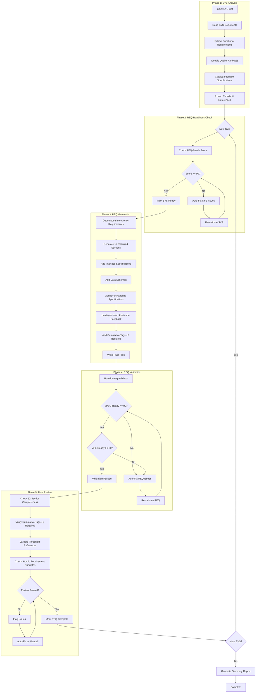

# doc-req-autopilot

## Purpose

Automated **Atomic Requirements (REQ)** generation pipeline that processes SYS documents and generates implementation-ready requirements using REQ v3.0 format with 12 sections, dual readiness scoring (SPEC-Ready + IMPL-Ready), and cumulative traceability.

**Layer**: 7 (REQ Generation)

**Upstream**: BRD (Layer 1), PRD (Layer 2), EARS (Layer 3), BDD (Layer 4), ADR (Layer 5), SYS (Layer 6)

**Downstream Artifacts**: CTR (Layer 9), SPEC (Layer 10)

---

## Skill Dependencies

This autopilot orchestrates the following skills:

| Skill | Purpose | Phase |
|-------|---------|-------|
| `doc-naming` | Element ID format (REQ.NN.TT.SS), type codes 01/05/06/27 | All Phases |
| `doc-sys-validator` | Validate SYS SPEC-Ready score | Phase 2: SYS Readiness |
| `doc-req` | REQ creation rules, REQ v3.0 12-section structure, template | Phase 3: REQ Generation |
| `quality-advisor` | Real-time quality feedback during REQ generation | Phase 3: REQ Generation |
| `doc-req-validator` | Validate REQ structure, content, SPEC-Ready score | Phase 4: REQ Validation |

**Delegation Principle**: The autopilot orchestrates workflow but delegates:
- REQ structure/content rules -> `doc-req` skill
- Real-time quality feedback -> `quality-advisor` skill
- REQ validation logic -> `doc-req-validator` skill
- SYS validation logic -> `doc-sys-validator` skill
- Element ID standards -> `doc-naming` skill

---

## When to Use This Skill

**Use `doc-req-autopilot` when**:
- You have one or more completed SYS documents ready for REQ generation
- You want automated decomposition of system requirements into atomic units
- You need REQ-Ready score validation before generation
- You want automatic SPEC-Ready score validation after REQ creation
- You need to generate REQ v3.0 documents with 12 sections

**Do NOT use when**:
- Creating a single REQ with extensive manual customization (use `doc-req` directly)
- SYS documents are incomplete or in Draft status
- You need fine-grained control over each REQ section
- SYS REQ-Ready score is below 90%

---

## Workflow Overview



---

## Detailed Workflow

### Phase 1: SYS Analysis

Analyze SYS documents to extract requirements for REQ decomposition.

**Input Sources** (from SYS):

| SYS Section | REQ Content | Mapping |
|-------------|-------------|---------|
| Section 4: Functional Requirements | Core capabilities | Section 2: Functional Requirements |
| Section 5: Quality Attributes | Performance/Security | Section 7: Quality Attributes |
| Section 6: Interface Specifications | APIs, protocols | Section 3: Interface Specifications |
| Section 7: Data Management | Schemas, models | Section 4: Data Schemas |
| Section 8: Testing Requirements | Verification | Section 10: Verification Methods |
| Section 11: Acceptance Criteria | Test conditions | Section 9: Acceptance Criteria |
| Section 13: Traceability | Upstream refs | Section 11: Traceability |

**Analysis Process**:

```bash
# Check for SYS documents
ls -la docs/SYS/

# Expected structure:
# - SYS-NN_{slug}.md (monolithic)
# - SYS-NN_{slug}/ (sectioned with SYS-NN.S_{section}.md files)
```

**Output**: Requirement decomposition plan with atomic units, threshold references, and traceability links.

### Phase 2: REQ Readiness Check

Validate that source SYS documents meet REQ-Ready requirements before generation.

> **Skill Delegation**: This phase uses validation rules from `doc-sys-validator` skill.
> See: `.claude/skills/doc-sys-validator/SKILL.md` for complete SYS validation rules.

**REQ-Ready Scoring Criteria (100%)**:

| Category | Weight | Criteria |
|----------|--------|----------|
| Functional Completeness | 35% | All FR-NNN requirements documented with priority |
| Quality Attributes | 25% | Performance, reliability, security categories present |
| Interface Specifications | 20% | API contracts, protocols defined |
| Data Management | 10% | Data schemas, storage requirements documented |
| Traceability | 10% | 5 upstream tags present (@brd, @prd, @ears, @bdd, @adr) |

**Minimum Score**: 90% (configurable)

**Auto-Fix Actions**:

| Issue | Auto-Fix Action |
|-------|-----------------|
| Missing Performance category | Add p50/p95/p99 template table |
| Missing Security category | Add authentication/authorization template |
| Incomplete Interface Specifications | Add protocol template structure |
| Missing upstream tags | Add with placeholder references |
| Missing quality attribute metrics | Add MTBF/MTTR template |

**Validation Command** (internal):

```bash
python ai_dev_flow/scripts/validate_sys.py \
  --sys docs/SYS/SYS-NN_{slug}.md \
  --min-score 90 \
  --auto-fix
```

### Phase 3: REQ Generation

Generate REQ documents from validated SYS with real-time quality feedback.

> **Skill Delegation**: This phase follows rules defined in `doc-req` skill.
> See: `.claude/skills/doc-req/SKILL.md` for complete REQ creation guidance.
>
> **Quality Guidance**: Uses `quality-advisor` skill for real-time feedback during generation.
> See: `.claude/skills/quality-advisor/SKILL.md` for quality monitoring.

**Generation Process**:

1. **Reserve REQ ID**:
   ```bash
   # Check for next available ID
   ls docs/REQ/REQ-*.md docs/REQ/*/REQ-*.md 2>/dev/null | \
     grep -oP 'REQ-\K\d+' | sort -n | tail -1
   # Increment for new REQ
   ```

2. **Load REQ Template**:
   - Primary: `ai_dev_flow/07_REQ/REQ-MVP-TEMPLATE.md`
   - Section templates: For sectioned REQ (>50KB)

3. **Generate Document Control Section**:

   | Field | Value |
   |-------|-------|
   | REQ ID | REQ-NN |
   | Status | Draft (initial) |
   | Version | 0.1.0 |
   | Date Created | Current date (YYYY-MM-DD) |
   | Last Updated | Current date (YYYY-MM-DD) |
   | Author | System Architect |
   | Priority | From SYS priority (P1-P4) |
   | Category | Functional |
   | Source Document | SYS-NN section X.Y.Z |
   | Verification Method | BDD + Integration Test |
   | Assigned Team | From SYS context |
   | SPEC-Ready Score | Calculated after generation |
   | IMPL-Ready Score | Calculated after generation |
   | Template Version | 3.0 |

4. **Decompose into Atomic Requirements**:

   **Atomic Requirement Principles**:
   - **Single Responsibility**: Each REQ defines exactly one requirement
   - **Measurable**: Acceptance criteria provide true/false outcomes
   - **Self-Contained**: Understandable without external context
   - **SPEC-Ready**: Contains ALL information for automated SPEC generation
   - **Modal Language**: SHALL (mandatory), SHOULD (preferred), MAY (optional)

5. **Generate All 12 Required Sections**:

   **Section 1: Description**
   - Atomic requirement statement with SHALL/SHOULD/MAY language
   - Context and scenario
   - Business justification

   **Section 2: Functional Requirements**
   - Core capabilities using REQ.NN.01.SS format
   - Business rules
   - Input/output specifications

   **Section 3: Interface Specifications**
   - Protocol/ABC definitions with type hints
   - DTO definitions (dataclass or Pydantic)
   - REST endpoints (if applicable)

   **Section 4: Data Schemas**
   - JSON Schema (draft-07)
   - Pydantic BaseModel with validators
   - Database schema (if applicable)

   **Section 5: Error Handling Specifications**
   - Exception catalog with codes
   - Error response schema
   - Circuit breaker configuration
   - State machine for error recovery

   **Section 6: Configuration Specifications**
   - YAML schema for settings
   - Environment variables
   - Validation rules

   **Section 7: Quality Attributes**
   - Performance targets (p50/p95/p99)
   - Reliability metrics (MTBF/MTTR)
   - Security requirements
   - Scalability targets
   - All with @threshold references

   **Section 8: Implementation Guidance**
   - Recommended algorithms/patterns
   - Concurrency/async considerations
   - Dependency injection patterns

   **Section 9: Acceptance Criteria**
   - Minimum 15 measurable criteria using REQ.NN.06.SS format
   - Categories: Primary Functional (5), Error/Edge Case (5), Quality/Constraint (3), Data Validation (2), Integration (3)

   **Section 10: Verification Methods**
   - BDD scenarios
   - Unit test specifications
   - Integration test specifications
   - Contract test specifications
   - Performance test specifications

   **Section 11: Traceability**
   - Cumulative tags (6 required)
   - Upstream source links
   - Downstream artifact placeholders

   **Section 12: Change History**
   - Version control table
   - Change descriptions

6. **Real-Time Quality Feedback** (via `quality-advisor` skill):
   - Monitor section completion as content is generated
   - Detect anti-patterns (incomplete Protocol/ABC, missing schemas)
   - Validate cumulative tagging (6 required tags for Layer 7)
   - Check element ID format compliance (REQ.NN.TT.SS)
   - Validate acceptance criteria count (>=15)
   - Flag issues early to reduce post-generation rework

7. **Add Element IDs by Type**:

   | Element Type | Code | Example |
   |--------------|------|---------|
   | Functional Requirement | 01 | REQ.02.01.01 |
   | Dependency | 05 | REQ.02.05.01 |
   | Acceptance Criteria | 06 | REQ.02.06.01 |
   | Atomic Requirement | 27 | REQ.02.27.01 |

8. **Add Cumulative Traceability Tags** (6 Required):

   ```markdown
   ## 11. Traceability

   **Required Tags** (Cumulative Tagging Hierarchy - Layer 7):
   @brd: BRD.01.01.03
   @prd: PRD.01.07.02
   @ears: EARS.01.25.01
   @bdd: BDD.01.14.01
   @adr: ADR-033, ADR-045
   @sys: SYS.01.01.01, SYS.01.02.07
   ```

9. **Add Threshold References**:

   ```markdown
   ### Thresholds Referenced

   | Threshold ID | Category | Value | Source |
   |--------------|----------|-------|--------|
   | @threshold: PRD.01.perf.api.p95 | Performance | 100ms | PRD Section 14 |
   | @threshold: PRD.01.timeout.circuit_breaker | Timeout | 30s | PRD Section 20.1 |
   | @threshold: PRD.01.retry.max_attempts | Retry | 3 | PRD Section 20.4 |
   ```

10. **File Output**:
    - **Flat**: `docs/REQ/REQ-NN_{slug}.md`
    - **Domain-based**: `docs/REQ/{domain}/REQ-NN_{slug}.md`
    - **Subdomain**: `docs/REQ/{domain}/{subdomain}/REQ-NN_{slug}.md`
    - **Sectioned** (>50KB): `docs/REQ/REQ-NN_{slug}/REQ-NN.S_{section}.md`

### Phase 4: REQ Validation

After REQ generation, validate structure and dual readiness scores.

> **Skill Delegation**: This phase uses validation rules from `doc-req-validator` skill.
> See: `.claude/skills/doc-req-validator/SKILL.md` for complete validation rules.

**Validation Command**:

```bash
python ai_dev_flow/scripts/validate_req.py docs/REQ/REQ-NN_{slug}.md --verbose
```

**Validation Checks**:

| Check | Requirement | Error Code |
|-------|-------------|------------|
| YAML Frontmatter | Valid metadata fields | REQ-E001 to REQ-E005 |
| Section Structure | All 12 sections present | REQ-E006 |
| Document Control | All 14 required fields | REQ-E009 |
| Interface Specifications | Protocol/ABC definition | REQ-E010, REQ-E015 |
| Data Schemas | JSON Schema or Pydantic | REQ-E011, REQ-E016 |
| Error Handling | Exception catalog | REQ-E012, REQ-E017 |
| Acceptance Criteria | >=15 criteria | REQ-E013, REQ-W002 |
| Element ID Format | REQ.NN.TT.SS (4-segment) | REQ-E020 |
| Cumulative Tags | 6 tags present | REQ-W003 |
| SPEC-Ready Score | >= 90% | REQ-W001 |
| IMPL-Ready Score | >= 90% | REQ-W001 |

**Auto-Fix Actions**:

| Issue | Auto-Fix Action |
|-------|-----------------|
| Missing section | Insert from template |
| Missing Protocol/ABC | Add interface template |
| Missing JSON Schema | Add schema template |
| Missing Exception Catalog | Add error handling template |
| Acceptance criteria < 15 | Add placeholder criteria |
| Invalid element ID format | Convert to REQ.NN.TT.SS format |
| Missing cumulative tags | Add with placeholder references |
| Missing SPEC-Ready Score | Calculate and insert |

**Validation Loop**:

```
LOOP (max 3 iterations):
  1. Run doc-req-validator
  2. IF errors found: Apply auto-fixes
  3. IF warnings found: Review and address if critical
  4. IF SPEC-Ready Score < 90%: Enhance sections
  5. IF IMPL-Ready Score < 90%: Add implementation guidance
  6. IF clean: Mark VALIDATED, proceed
  7. IF max iterations: Log issues, flag for manual review
```

### Phase 5: Final Review

Comprehensive final review before marking REQ complete.

**Review Checks**:

1. **12-Section Completeness**:
   - All 12 sections present and substantive
   - No placeholder or stub content
   - Template Version = 3.0

2. **Cumulative Tag Validation** (6 Tags Required):
   - @brd tag references valid BRD elements
   - @prd tag references valid PRD elements
   - @ears tag references valid EARS elements
   - @bdd tag references valid BDD elements
   - @adr tag references valid ADR documents
   - @sys tag references valid SYS elements

3. **Threshold Reference Validation**:
   - All @threshold tags reference valid PRD thresholds
   - No magic numbers in quality attributes
   - Threshold values match source

4. **Atomic Requirement Principles**:
   - Each REQ defines single responsibility
   - Acceptance criteria are measurable
   - Self-contained without external context
   - Uses modal language (SHALL/SHOULD/MAY)

5. **Dual Readiness Score Report**:

   ```
   REQ Readiness Score Breakdown
   =============================
   SPEC-Ready Score:
     Interface Completeness:     20/20
     Data Schema:                15/15
     Error Handling:             15/15
     Configuration:              10/10
     Quality Attributes:         15/15
     Implementation Guidance:    10/10
     Acceptance Criteria:        10/10
     Traceability:                5/5
   ----------------------------
   SPEC-Ready Total:           100/100 (Target: >= 90)

   IMPL-Ready Score:
     Implementation Guidance:    25/25
     Architecture Patterns:      20/20
     Concurrency Handling:       15/15
     DI Patterns:                15/15
     Algorithm Specifications:   15/15
     Testing Strategy:           10/10
   ----------------------------
   IMPL-Ready Total:           100/100 (Target: >= 90)

   Status: READY FOR SPEC/IMPL CREATION
   ```

6. **Traceability Matrix Update**:

   ```bash
   # Update REQ-00_TRACEABILITY_MATRIX.md
   python ai_dev_flow/scripts/update_traceability_matrix.py \
     --req docs/REQ/REQ-NN_{slug}.md \
     --matrix docs/REQ/REQ-00_TRACEABILITY_MATRIX.md
   ```

---

## REQ v3.0 Section Reference

### Required Sections (12 Total)

| Section | Purpose | Required Elements |
|---------|---------|-------------------|
| Document Control | Metadata | 14 fields including dual readiness scores |
| 1. Description | Atomic requirement | SHALL/SHOULD/MAY language, context |
| 2. Functional Requirements | Core capabilities | REQ.NN.01.SS format, business rules |
| 3. Interface Specifications | APIs, protocols | Protocol/ABC, DTOs, REST endpoints |
| 4. Data Schemas | Models, validation | JSON Schema, Pydantic, Database |
| 5. Error Handling | Exceptions, recovery | Exception catalog, circuit breaker |
| 6. Configuration | Settings, flags | YAML schema, environment variables |
| 7. Quality Attributes | Performance, security | p50/p95/p99, @threshold references |
| 8. Implementation Guidance | Patterns, algorithms | DI, concurrency, architecture |
| 9. Acceptance Criteria | Test conditions | >=15 criteria, 5 categories |
| 10. Verification Methods | Testing | BDD, unit, integration, contract |
| 11. Traceability | References | 6 cumulative tags |
| 12. Change History | Version control | Revision table |

---

## Execution Modes

### Single SYS Mode

Generate REQ from one SYS document.

```bash
# Example: Generate REQ from SYS-01
python ai_dev_flow/scripts/req_autopilot.py \
  --sys docs/SYS/SYS-01_order_management.md \
  --output docs/REQ/ \
  --id 01 \
  --slug order_validation
```

### Batch Mode

Generate REQ from multiple SYS documents in sequence.

```bash
# Example: Generate REQ from all SYS
python ai_dev_flow/scripts/req_autopilot.py \
  --batch config/req_batch.yaml \
  --output docs/REQ/
```

**Batch Configuration** (`config/req_batch.yaml`):

```yaml
req_generation:
  - id: "01"
    slug: "order_validation"
    sys: "SYS-01"
    domain: "trading"
    priority: 1

  - id: "02"
    slug: "risk_limits"
    sys: "SYS-02"
    domain: "risk"
    priority: 1

  - id: "03"
    slug: "data_collection"
    sys: "SYS-03"
    domain: "data"
    priority: 2

execution:
  parallel: false
  fail_fast: true
```

### Dry Run Mode

Preview execution plan without generating files.

```bash
python ai_dev_flow/scripts/req_autopilot.py \
  --sys docs/SYS/SYS-01_order_management.md \
  --dry-run
```

---

## Configuration

### Default Configuration

```yaml
# config/req_autopilot.yaml
req_autopilot:
  version: "1.0"

  scoring:
    req_ready_min: 90
    spec_ready_min: 90
    impl_ready_min: 90
    strict_mode: false

  execution:
    max_parallel: 3        # HARD LIMIT - do not exceed
    chunk_size: 3          # Documents per chunk
    pause_between_chunks: true
    auto_fix: true
    continue_on_error: false
    timeout_per_sys: 300  # seconds

  output:
    structure: auto  # auto, flat, domain-based, sectioned
    size_threshold_kb: 50
    report_format: markdown

  validation:
    skip_validation: false
    fix_iterations_max: 3

  review:
    enabled: true
    check_sections: true
    check_tags: true
    check_thresholds: true
    check_atomicity: true
    auto_fix_sections: true
    min_acceptance_criteria: 15
```

### Command Line Options

| Option | Default | Description |
|--------|---------|-------------|
| `--min-req-ready` | 90 | Minimum REQ-Ready score (SYS) |
| `--min-spec-ready` | 90 | Minimum SPEC-Ready score (REQ) |
| `--min-impl-ready` | 90 | Minimum IMPL-Ready score (REQ) |
| `--no-auto-fix` | false | Disable auto-fix (manual only) |
| `--continue-on-error` | false | Continue if one SYS fails |
| `--dry-run` | false | Preview execution plan only |
| `--output-format` | auto | Force flat, domain-based, or sectioned |
| `--skip-review` | false | Skip final review phase |
| `--domain` | auto | Force domain for output path |

---

## Output Artifacts

### Generated Files

| File | Purpose | Location |
|------|---------|----------|
| REQ-NN_{slug}.md | Main REQ document (flat) | `docs/REQ/` |
| REQ-NN_{slug}.md | Domain-based REQ | `docs/REQ/{domain}/` |
| REQ-NN_{slug}/ | REQ folder (sectioned) | `docs/REQ/` |
| REQ-NN.S_{section}.md | Section files | `docs/REQ/REQ-NN_{slug}/` |

### Validation Reports

| Report | Purpose | Location |
|--------|---------|----------|
| req_validation_report.json | Validation results | `tmp/` |
| spec_ready_score.json | SPEC-Ready breakdown | `tmp/` |
| impl_ready_score.json | IMPL-Ready breakdown | `tmp/` |
| autopilot_log.md | Execution log | `tmp/` |

---

## Error Handling

### Error Categories

| Category | Handling | Example |
|----------|----------|---------|
| SYS Missing | Abort with message | No SYS document found |
| REQ-Ready Below 90% | Auto-fix SYS, retry | SYS score at 85% |
| Validation Failure | Auto-fix, retry | Missing required section |
| SPEC-Ready Below 90% | Enhance sections, retry | Score at 88% |
| IMPL-Ready Below 90% | Add implementation guidance | Score at 87% |
| Max Retries Exceeded | Flag for manual review | Persistent errors |

### Recovery Actions

```python
def handle_error(error_type: str, context: dict) -> Action:
    match error_type:
        case "SYS_MISSING":
            return Action.ABORT_WITH_MESSAGE
        case "REQ_READY_LOW":
            return Action.AUTO_FIX_SYS
        case "VALIDATION_FAILURE":
            if context["retry_count"] < 3:
                return Action.AUTO_FIX_RETRY
            return Action.FLAG_MANUAL_REVIEW
        case "SPEC_READY_LOW":
            return Action.ENHANCE_SECTIONS
        case "IMPL_READY_LOW":
            return Action.ADD_IMPLEMENTATION_GUIDANCE
        case _:
            return Action.FLAG_MANUAL_REVIEW
```

---

## Integration Points

### Pre-Execution Hooks

```bash
# Hook: pre_req_generation
# Runs before REQ generation starts
./hooks/pre_req_generation.sh

# Example: Validate SYS exists and is ready
if [ ! -f "docs/SYS/SYS-01_*.md" ]; then
  echo "ERROR: SYS-01 required"
  exit 1
fi
```

### Post-Execution Hooks

```bash
# Hook: post_req_generation
# Runs after REQ generation completes
./hooks/post_req_generation.sh

# Example: Trigger SPEC autopilot for validated REQ
if [ "$REQ_VALIDATED" = "true" ]; then
  python ai_dev_flow/scripts/spec_autopilot.py \
    --req "$REQ_PATH" \
    --output docs/SPEC/
fi
```

### CI/CD Integration

```yaml
# .github/workflows/req_autopilot.yml
name: REQ Autopilot

on:
  push:
    paths:
      - 'docs/SYS/**'

jobs:
  generate-req:
    runs-on: ubuntu-latest
    steps:
      - uses: actions/checkout@v4

      - name: Run REQ Autopilot
        run: |
          python ai_dev_flow/scripts/req_autopilot.py \
            --sys docs/SYS/ \
            --output docs/REQ/ \
            --validate

      - name: Upload Validation Report
        uses: actions/upload-artifact@v4
        with:
          name: req-validation
          path: tmp/req_validation_report.json
```

---

## Quality Gates

### Phase Gates

| Phase | Gate | Criteria |
|-------|------|----------|
| Phase 1 | Input Gate | At least one SYS document found |
| Phase 2 | Readiness Gate | SYS REQ-Ready Score >= 90% |
| Phase 3 | Generation Gate | All 12 sections generated |
| Phase 4 | Validation Gate | SPEC-Ready >= 90% AND IMPL-Ready >= 90% |
| Phase 5 | Review Gate | No blocking issues remaining |

### Blocking vs Non-Blocking

| Issue Type | Blocking | Action |
|------------|----------|--------|
| Missing required section | Yes | Must fix before proceeding |
| SPEC-Ready Score < 90% | Yes | Must enhance sections |
| IMPL-Ready Score < 90% | Yes | Must add implementation guidance |
| Acceptance criteria < 15 | Yes | Must add more criteria |
| Missing Protocol/ABC | Yes | Must add interface definition |
| Missing @threshold tags | No | Log warning, continue |
| Style/formatting issues | No | Auto-fix, continue |

---

## Validation Checklist

After autopilot completion:

- [ ] All target REQ documents generated
- [ ] Each REQ has SPEC-Ready score >= 90%
- [ ] Each REQ has IMPL-Ready score >= 90%
- [ ] Each REQ uses Template Version 3.0
- [ ] All 12 required sections completed
- [ ] Traceability matrix updated (`REQ-00_TRACEABILITY_MATRIX.md`)
- [ ] Each REQ references all 6 upstream tags (@brd, @prd, @ears, @bdd, @adr, @sys)
- [ ] Section 3: Interface Specifications has Protocol/ABC definition
- [ ] Section 4: Data Schemas has JSON Schema or Pydantic models
- [ ] Section 5: Error Handling has Exception Catalog
- [ ] Section 7: Quality Attributes has @threshold references
- [ ] Section 9: Acceptance Criteria has >= 15 measurable criteria
- [ ] Element IDs use REQ.NN.TT.SS format (codes: 01, 05, 06, 27)
- [ ] No legacy ID patterns (AC-XXX, FR-XXX, R-XXX)
- [ ] Each requirement is atomic (single responsibility)

---

## Quick Reference

| Input | Output | Key Metrics |
|-------|--------|-------------|
| SYS(s) | REQ(s) | SPEC-Ready >= 90%, IMPL-Ready >= 90% |

**Usage**:
```
/doc-req-autopilot <SYS-LIST> [OPTIONS]
```

**Common Commands**:
```bash
# Single SYS
/doc-req-autopilot SYS-01

# All SYS (automatic)
/doc-req-autopilot all --auto

# Preview only
/doc-req-autopilot all --dry-run

# Resume after failure
/doc-req-autopilot resume

# Domain-based output
/doc-req-autopilot SYS-01 --domain risk
```

---

## Related Resources

### Skills (Delegated)

- **REQ Skill**: `.claude/skills/doc-req/SKILL.md` - REQ creation rules and 12-section structure
- **REQ Validator Skill**: `.claude/skills/doc-req-validator/SKILL.md` - Validation rules and error codes
- **SYS Validator Skill**: `.claude/skills/doc-sys-validator/SKILL.md` - SYS readiness validation
- **Quality Advisor Skill**: `.claude/skills/quality-advisor/SKILL.md` - Real-time quality feedback
- **Naming Standards Skill**: `.claude/skills/doc-naming/SKILL.md` - Element ID format

### Templates and Rules

- **REQ Template**: `ai_dev_flow/07_REQ/REQ-MVP-TEMPLATE.md`
- **REQ Schema**: `ai_dev_flow/07_REQ/REQ_SCHEMA.yaml`
- **REQ Creation Rules**: `ai_dev_flow/07_REQ/REQ_CREATION_RULES.md`
- **REQ Validation Rules**: `ai_dev_flow/07_REQ/REQ_VALIDATION_RULES.md`

### Section Templates (for documents >50KB)

- Index template: `ai_dev_flow/07_REQ/REQ-SECTION-0-TEMPLATE.md`
- Content template: `ai_dev_flow/07_REQ/REQ-SECTION-TEMPLATE.md`
- Reference: `ai_dev_flow/ID_NAMING_STANDARDS.md` (Section-Based File Splitting)

### Framework References

- **SDD Workflow**: `ai_dev_flow/SPEC_DRIVEN_DEVELOPMENT_GUIDE.md`
- **MVP Autopilot**: `ai_dev_flow/AUTOPILOT/MVP_AUTOPILOT.md`
- **SYS Autopilot Skill**: `.claude/skills/doc-sys-autopilot/SKILL.md` (if available)
- **EARS Autopilot Skill**: `.claude/skills/doc-ears-autopilot/SKILL.md`

---

## Version History

| Version | Date | Changes |
|---------|------|---------|
| 1.0 | 2026-02-08 | Initial skill creation with 5-phase workflow; Integrated doc-naming, doc-req, doc-req-validator, quality-advisor skills; Added REQ v3.0 12-section structure; Dual readiness scoring (SPEC-Ready + IMPL-Ready); 6 cumulative tags required (@brd, @prd, @ears, @bdd, @adr, @sys); Element ID types 01/05/06/27 |
