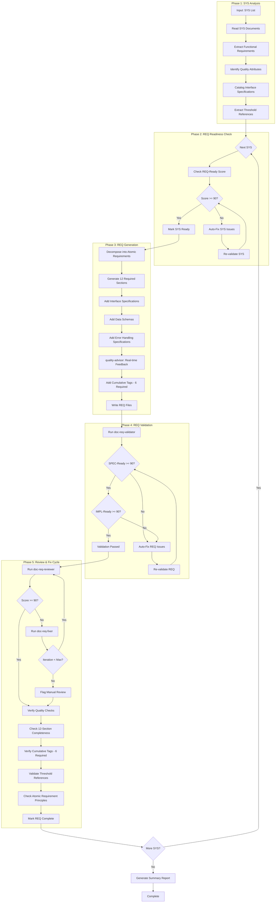
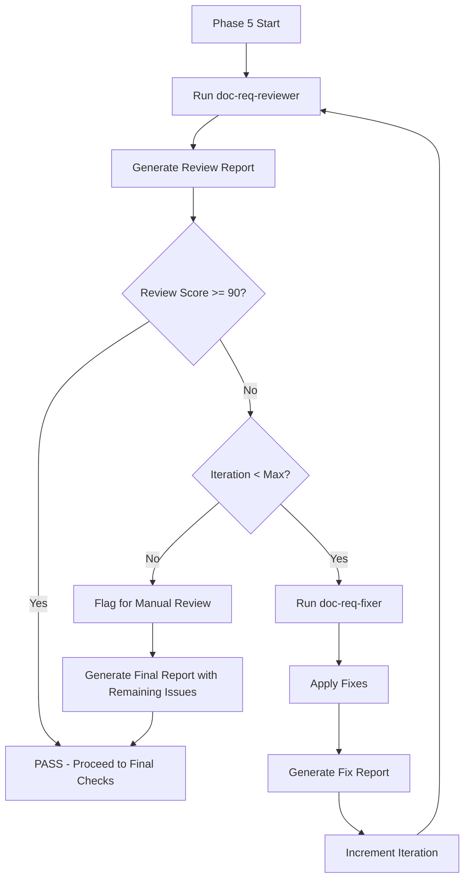
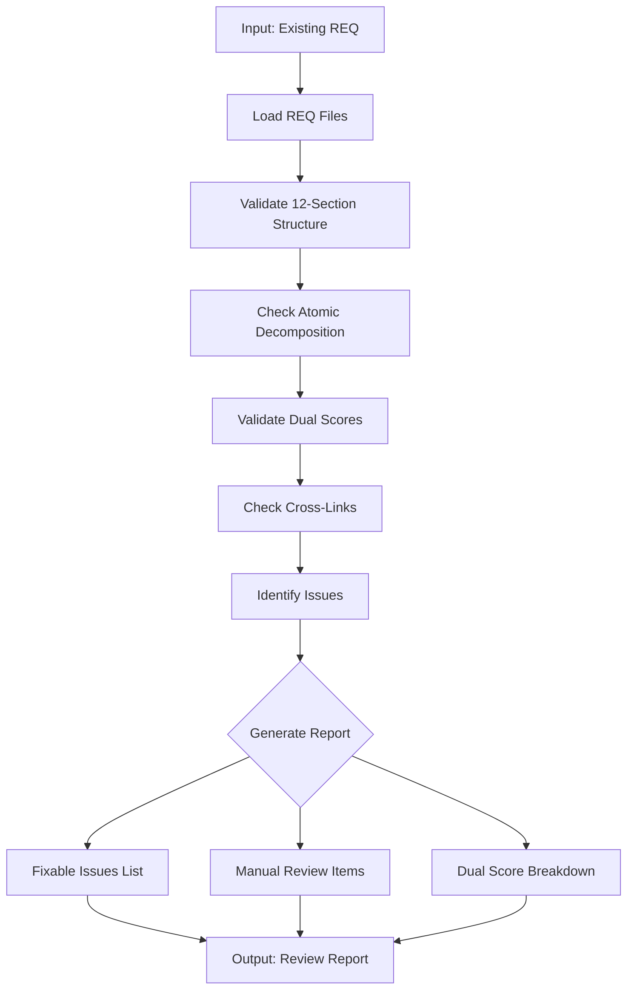

# doc-req-autopilot

## Purpose

Automated **Atomic Requirements (REQ)** generation pipeline that processes SYS documents and decomposes them into **multiple atomic REQ files** (one per capability), using REQ v3.0 format with 12 sections, dual readiness scoring (SPEC-Ready + IMPL-Ready), and cumulative traceability.

**Layer**: 7 (REQ Generation)

**Upstream**: BRD (Layer 1), PRD (Layer 2), EARS (Layer 3), BDD (Layer 4), ADR (Layer 5), SYS (Layer 6)

**Downstream Artifacts**: CTR (Layer 9), SPEC (Layer 10)

**Key Enhancement (v2.0)**: Based on Trading Nexus REQ layer analysis, this skill now generates **atomic file decomposition** (10-15 files per module) instead of monolithic REQ documents. See [Phase 1.5: Atomic Decomposition](#phase-15-atomic-decomposition-new-in-v20).

---

## Skill Dependencies

This autopilot orchestrates the following skills:

| Skill | Purpose | Phase |
|-------|---------|-------|
| `doc-naming` | Element ID format (REQ.NN.TT.SS), type codes 01/05/06/27 | All Phases |
| `doc-sys-validator` | Validate SYS SPEC-Ready score | Phase 2: SYS Readiness |
| `doc-req` | REQ creation rules, REQ v3.0 12-section structure, template | Phase 3: REQ Generation |
| `quality-advisor` | Real-time quality feedback during REQ generation | Phase 3: REQ Generation |
| `doc-req-validator` | Validate REQ structure, content, SPEC-Ready score | Phase 4: REQ Validation |
| `doc-req-reviewer` | Content review, link validation, quality scoring | Phase 5: Review |
| `doc-req-fixer` | Apply fixes from review report, create missing files | Phase 5: Fix |

**Delegation Principle**: The autopilot orchestrates workflow but delegates:
- REQ structure/content rules -> `doc-req` skill
- Real-time quality feedback -> `quality-advisor` skill
- REQ validation logic -> `doc-req-validator` skill
- Content review and scoring -> `doc-req-reviewer` skill
- Issue resolution and fixes -> `doc-req-fixer` skill
- SYS validation logic -> `doc-sys-validator` skill
- Element ID standards -> `doc-naming` skill

---

## Smart Document Detection

The autopilot automatically determines the action based on the input document type.

### Input Type Recognition

| Input | Detected As | Action |
|-------|-------------|--------|
| `REQ-NN` | Self type | Review existing REQ document |
| `SYS-NN` | Upstream type | Generate if missing, review if exists |

### Detection Algorithm

```
1. Parse input: Extract TYPE and NN from "{TYPE}-{NN}"
2. Determine action:
   - IF TYPE == "REQ": Review Mode
   - ELSE IF TYPE == "SYS": Generate/Find Mode
   - ELSE: Error (invalid type for this autopilot)
3. For Generate/Find Mode:
   - Check: Does REQ-{NN} exist in docs/07_REQ/?
   - IF exists: Switch to Review Mode for REQ-{NN}
   - ELSE: Proceed with Generation from SYS-{NN}
```

### File Existence Check

```bash
# Check for nested folder structure (mandatory)
ls docs/07_REQ/REQ-{NN}_*/
```

### Examples

```bash
# Review mode (same type - REQ input)
/doc-req-autopilot REQ-01           # Reviews existing REQ-01

# Generate/Find mode (upstream type - SYS input)
/doc-req-autopilot SYS-01           # Generates REQ-01 if missing, or reviews existing REQ-01

# Multiple inputs
/doc-req-autopilot SYS-01,SYS-02    # Generates/reviews REQ-01 and REQ-02
/doc-req-autopilot REQ-01,REQ-02    # Reviews REQ-01 and REQ-02
```

### Action Determination Output

```
Input: SYS-01
├── Detected Type: SYS (upstream)
├── Expected REQ: REQ-01
├── REQ Exists: Yes → docs/07_REQ/REQ-01_f1_iam/
└── Action: REVIEW MODE - Running doc-req-reviewer on REQ-01

Input: SYS-05
├── Detected Type: SYS (upstream)
├── Expected REQ: REQ-05
├── REQ Exists: No
└── Action: GENERATE MODE - Creating REQ-05 from SYS-05

Input: REQ-03
├── Detected Type: REQ (self)
└── Action: REVIEW MODE - Running doc-req-reviewer on REQ-03
```

---

## When to Use This Skill

**Use `doc-req-autopilot` when**:
- You have one or more completed SYS documents ready for REQ generation
- You want automated decomposition of system requirements into atomic units
- You need REQ-Ready score validation before generation
- You want automatic SPEC-Ready score validation after REQ creation
- You need to generate REQ v3.0 documents with 12 sections

**Do NOT use when**:
- Creating a single REQ with extensive manual customization (use `doc-req` directly)
- SYS documents are incomplete or in Draft status
- You need fine-grained control over each REQ section
- SYS REQ-Ready score is below 90%

---

## Workflow Overview



---

## Detailed Workflow

### Phase 1: SYS Analysis

Analyze SYS documents to extract requirements for REQ decomposition.

**Input Sources** (from SYS):

| SYS Section | REQ Content | Mapping |
|-------------|-------------|---------|
| Section 4: Functional Requirements | Core capabilities | Section 2: Functional Requirements |
| Section 5: Quality Attributes | Performance/Security | Section 7: Quality Attributes |
| Section 6: Interface Specifications | APIs, protocols | Section 3: Interface Specifications |
| Section 7: Data Management | Schemas, models | Section 4: Data Schemas |
| Section 8: Testing Requirements | Verification | Section 10: Verification Methods |
| Section 11: Acceptance Criteria | Test conditions | Section 9: Acceptance Criteria |
| Section 13: Traceability | Upstream refs | Section 11: Traceability |

**Analysis Process**:

```bash
# Check for SYS documents
ls -la docs/06_SYS/

# Expected structure:
# - SYS-NN_{slug}.md (monolithic)
# - SYS-NN_{slug}/ (sectioned with SYS-NN.S_{section}.md files)
```

**Output**: Requirement decomposition plan with atomic units, threshold references, and traceability links.

### Phase 1.5: Atomic Decomposition (NEW in v2.0)

Decompose SYS functional requirements into separate atomic REQ files.

> **Reference**: Based on Trading Nexus project patterns (`/opt/data/trading_nexus_v4.2/Nexus_Platform_v4.2/docs/07_REQ/REQ-01_f1_iam/`)

**Decomposition Strategy**:

1. **One REQ File Per Capability**: Each SYS.NN.MM.SS functional requirement maps to one REQ-NN.MM file
2. **Self-Contained Files**: Each file is complete with all 12 sections
3. **Cross-Linked**: Files reference siblings via `@discoverability` tags

**Output Structure Example** (for F1 IAM module):

```
docs/07_REQ/REQ-01_f1_iam/
├── REQ-01.00_index.md                    # Index with capability matrix
├── REQ-01.01_jwt_authentication.md       # SYS.01.01.01
├── REQ-01.02_token_refresh_mechanism.md  # SYS.01.01.02
├── REQ-01.03_token_revocation.md         # SYS.01.01.03
├── REQ-01.04_session_binding.md          # SYS.01.01.04
├── REQ-01.05_rbac_enforcement.md         # SYS.01.02.01
├── REQ-01.06_4d_authorization_matrix.md  # SYS.01.02.02
├── REQ-01.07_permission_inheritance.md   # SYS.01.02.03
├── REQ-01.08_context_aware_access.md     # SYS.01.02.04
├── REQ-01.09_mfa_integration.md          # SYS.01.03.01
├── REQ-01.10_api_key_management.md       # SYS.01.03.02
├── REQ-01.11_audit_logging.md            # SYS.01.04.01
└── REQ-01.12_compliance_reporting.md     # SYS.01.04.02
```

**Decomposition Rules**:

| Rule | Description |
|------|-------------|
| **File Naming** | `REQ-{module}.{sequence}_{capability_slug}.md` |
| **Minimum Files** | ≥3 atomic files per SYS module (configurable) |
| **Maximum Size** | 30KB per file (triggers additional split) |
| **Index Required** | `REQ-NN.00_index.md` for navigation |
| **Cross-Links** | Each file references related capabilities |

**Index File Template** (`REQ-NN.00_index.md`):

```markdown
# REQ-01: F1 Identity & Access Management - Atomic Requirements Index

## Capability Matrix

| REQ ID | Capability | SYS Source | Priority | SPEC-Ready |
|--------|------------|------------|----------|------------|
| REQ-01.01 | JWT Authentication | SYS.01.01.01 | P1 | 94% |
| REQ-01.02 | Token Refresh | SYS.01.01.02 | P1 | 92% |
| REQ-01.03 | Token Revocation | SYS.01.01.03 | P1 | 91% |
| ... | ... | ... | ... | ... |

## Cross-Reference Matrix

| REQ | Depends On | Discovered By |
|-----|------------|---------------|
| REQ-01.01 | - | REQ-01.02, REQ-01.11 |
| REQ-01.02 | REQ-01.01 | REQ-01.03 |
| REQ-01.06 | REQ-01.05, REQ-01.07, REQ-01.08 | REQ-01.11, REQ-01.12 |
```

**When NOT to Decompose** (use monolithic):

- SYS module has ≤2 functional requirements
- Total estimated REQ content < 20KB
- `--monolithic` flag explicitly set

### Phase 2: REQ Readiness Check

Validate that source SYS documents meet REQ-Ready requirements before generation.

> **Skill Delegation**: This phase uses validation rules from `doc-sys-validator` skill.
> See: `.claude/skills/doc-sys-validator/SKILL.md` for complete SYS validation rules.

**REQ-Ready Scoring Criteria (100%)**:

| Category | Weight | Criteria |
|----------|--------|----------|
| Functional Completeness | 35% | All FR-NNN requirements documented with priority |
| Quality Attributes | 25% | Performance, reliability, security categories present |
| Interface Specifications | 20% | API contracts, protocols defined |
| Data Management | 10% | Data schemas, storage requirements documented |
| Traceability | 10% | 5 upstream tags present (@brd, @prd, @ears, @bdd, @adr) |

**Minimum Score**: 90% (configurable)

**Auto-Fix Actions**:

| Issue | Auto-Fix Action |
|-------|-----------------|
| Missing Performance category | Add p50/p95/p99 template table |
| Missing Security category | Add authentication/authorization template |
| Incomplete Interface Specifications | Add protocol template structure |
| Missing upstream tags | Add with placeholder references |
| Missing quality attribute metrics | Add MTBF/MTTR template |

**Validation Command** (internal):

```bash
python ai_dev_flow/scripts/validate_sys.py \
  --sys docs/06_SYS/SYS-NN_{slug}.md \
  --min-score 90 \
  --auto-fix
```

### Phase 3: REQ Generation

Generate REQ documents from validated SYS with real-time quality feedback.

> **Skill Delegation**: This phase follows rules defined in `doc-req` skill.
> See: `.claude/skills/doc-req/SKILL.md` for complete REQ creation guidance.
>
> **Quality Guidance**: Uses `quality-advisor` skill for real-time feedback during generation.
> See: `.claude/skills/quality-advisor/SKILL.md` for quality monitoring.

**Generation Process**:

1. **Reserve REQ ID**:
   ```bash
   # Check for next available ID
   ls docs/07_REQ/REQ-*.md docs/07_REQ/*/REQ-*.md 2>/dev/null | \
     grep -oP 'REQ-\K\d+' | sort -n | tail -1
   # Increment for new REQ
   ```

2. **Load REQ Template**:
   - Primary: `ai_dev_flow/07_REQ/REQ-MVP-TEMPLATE.md`
   - Section templates: For sectioned REQ (>50KB)

3. **Generate Document Control Section**:

   | Field | Value |
   |-------|-------|
   | REQ ID | REQ-NN |
   | Status | Draft (initial) |
   | Version | 0.1.0 |
   | Date Created | Current date (YYYY-MM-DD) |
   | Last Updated | Current date (YYYY-MM-DD) |
   | Author | System Architect |
   | Priority | From SYS priority (P1-P4) |
   | Category | Functional |
   | Source Document | SYS-NN section X.Y.Z |
   | Verification Method | BDD + Integration Test |
   | Assigned Team | From SYS context |
   | SPEC-Ready Score | Calculated after generation |
   | IMPL-Ready Score | Calculated after generation |
   | Template Version | 3.0 |

4. **Decompose into Atomic Requirements**:

   **Atomic Requirement Principles**:
   - **Single Responsibility**: Each REQ defines exactly one requirement
   - **Measurable**: Acceptance criteria provide true/false outcomes
   - **Self-Contained**: Understandable without external context
   - **SPEC-Ready**: Contains ALL information for automated SPEC generation
   - **Modal Language**: SHALL (mandatory), SHOULD (preferred), MAY (optional)

5. **Generate All 12 Required Sections**:

   **Section 1: Description**
   - Atomic requirement statement with SHALL/SHOULD/MAY language
   - Context and scenario
   - Business justification

   **Section 2: Functional Requirements**
   - Core capabilities using REQ.NN.01.SS format
   - Business rules
   - Input/output specifications

   **Section 3: Interface Specifications**
   - Protocol/ABC definitions with type hints
   - DTO definitions (dataclass or Pydantic)
   - REST endpoints (if applicable)

   **Section 4: Data Schemas**
   - JSON Schema (draft-07)
   - Pydantic BaseModel with validators
   - Database schema (if applicable)

   **Section 5: Error Handling Specifications**
   - Exception catalog with codes
   - Error response schema
   - Circuit breaker configuration
   - State machine for error recovery

   **Section 6: Configuration Specifications**
   - YAML schema for settings
   - Environment variables
   - Validation rules

   **Section 7: Quality Attributes**
   - Performance targets (p50/p95/p99)
   - Reliability metrics (MTBF/MTTR)
   - Security requirements
   - Scalability targets
   - All with @threshold references

   **Section 8: Implementation Guidance**
   - Recommended algorithms/patterns
   - Concurrency/async considerations
   - Dependency injection patterns

   **Section 9: Acceptance Criteria**
   - Minimum 15 measurable criteria using REQ.NN.06.SS format
   - Categories: Primary Functional (5), Error/Edge Case (5), Quality/Constraint (3), Data Validation (2), Integration (3)

   **Section 8: Testing Requirements** (ENHANCED in v2.0)
   - Unit tests with category prefixes (see below)
   - Integration test checklist
   - BDD scenario references

   **Unit Test Category Format** (NEW in v2.0):

   | Category   | Prefix         | Description                     | Min Count |
   |------------|----------------|---------------------------------|-----------|
   | Logic      | `[Logic]`      | Core business logic tests       | 3         |
   | Validation | `[Validation]` | Input validation tests          | 2         |
   | State      | `[State]`      | State machine/transition tests  | 1         |
   | Edge       | `[Edge]`       | Edge case and boundary tests    | 2         |
   | Security   | `[Security]`   | Security-specific tests         | 1         |

   **Example Unit Test Table**:

   ```markdown
   | Test Case                      | Input                  | Expected Output      | Coverage     |
   |--------------------------------|------------------------|----------------------|--------------|
   | **[Logic] Valid login**        | Valid email/password   | 200 with tokens      | REQ.01.01.01 |
   | **[Validation] Invalid email** | "not-an-email"         | 400 INVALID_EMAIL    | REQ.01.21.01 |
   | **[State] Locked account**     | Locked user            | 403 ACCOUNT_LOCKED   | REQ.01.27.01 |
   | **[Edge] Rate limit boundary** | 5th attempt            | 200 OK (not blocked) | REQ.01.06.07 |
   | **[Security] Missing token**   | No Authorization header| 401 Unauthorized     | REQ.01.02.02 |
   ```

   **Section 9: Acceptance Criteria** (ENHANCED in v2.0)
   - Minimum 15 measurable criteria (split into subsections)
   - 9.1 Functional Acceptance (≥10 criteria)
   - 9.2 Quality Acceptance (≥5 criteria)
   - Status checkbox for tracking

   **Section 10: Traceability** (ENHANCED in v2.0)
   - 10.1 Upstream Sources table
   - 10.2 Downstream Artifacts table
   - 10.3 Traceability Tags (6 required)
   - 10.4 Traceability Matrix
   - **10.5 Cross-Links (NEW)** - See below

   **Section 10.5 Cross-Links Format** (NEW in v2.0):

   ```markdown
   ### 10.5 Cross-Links

   @depends: REQ-NN.XX (direct dependency description)
   @discoverability: REQ-NN.YY (interaction context); REQ-NN.ZZ (shared resource)
   ```

   **Example from Trading Nexus REQ-01.06**:

   ```markdown
   @discoverability: REQ-01.05 (role policies feed the matrix);
                     REQ-01.07 (inheritance inputs drive matrix entries);
                     REQ-01.08 (context dimensions align with matrix factors);
                     REQ-01.11 (authz decisions must be audit-covered);
                     REQ-01.12 (matrix outputs support compliance evidence)
   ```

   **Section 11: Implementation Notes** (ENHANCED in v2.0)
   - 11.1 Technical Approach (specific patterns and libraries)
   - 11.2 Code Implementation Paths (NEW - mandatory)
   - 11.3 Dependencies table (NEW - mandatory)

   **Section 11.2 Code Implementation Paths Format** (NEW):

   ```markdown
   ### 11.2 Code Implementation Paths

   - **Primary**: `src/foundation/f1_iam/auth/jwt_auth.py`
   - **Tests**: `tests/foundation/f1_iam/test_jwt_auth.py`
   - **Integration**: `tests/integration/test_auth_endpoints.py`
   ```

   **Section 12: Change History**
   - Version control table
   - Change descriptions

6. **Real-Time Quality Feedback** (via `quality-advisor` skill):
   - Monitor section completion as content is generated
   - Detect anti-patterns (incomplete Protocol/ABC, missing schemas)
   - Validate cumulative tagging (6 required tags for Layer 7)
   - Check element ID format compliance (REQ.NN.TT.SS)
   - Validate acceptance criteria count (>=15)
   - Flag issues early to reduce post-generation rework

7. **Add Element IDs by Type**:

   | Element Type | Code | Example |
   |--------------|------|---------|
   | Functional Requirement | 01 | REQ.02.01.01 |
   | Dependency | 05 | REQ.02.05.01 |
   | Acceptance Criteria | 06 | REQ.02.06.01 |
   | Atomic Requirement | 27 | REQ.02.27.01 |

8. **Add Cumulative Traceability Tags** (6 Required):

   ```markdown
   ## 11. Traceability

   **Required Tags** (Cumulative Tagging Hierarchy - Layer 7):
   @brd: BRD.01.01.03
   @prd: PRD.01.07.02
   @ears: EARS.01.25.01
   @bdd: BDD.01.14.01
   @adr: ADR-033, ADR-045
   @sys: SYS.01.01.01, SYS.01.02.07
   ```

9. **Add Threshold References**:

   ```markdown
   ### Thresholds Referenced

   | Threshold ID | Category | Value | Source |
   |--------------|----------|-------|--------|
   | @threshold: PRD.01.perf.api.p95 | Performance | 100ms | PRD Section 14 |
   | @threshold: PRD.01.timeout.circuit_breaker | Timeout | 30s | PRD Section 20.1 |
   | @threshold: PRD.01.retry.max_attempts | Retry | 3 | PRD Section 20.4 |
   ```

10. **File Output** (ALWAYS use nested folder):
    - **Monolithic** (<20k tokens): `docs/07_REQ/REQ-NN_{slug}/REQ-NN_{slug}.md`
    - **Domain-based**: `docs/07_REQ/{domain}/REQ-NN_{slug}/REQ-NN_{slug}.md`
    - **Subdomain**: `docs/07_REQ/{domain}/{subdomain}/REQ-NN_{slug}/REQ-NN_{slug}.md`
    - **Sectioned** (≥20k tokens): `docs/07_REQ/REQ-NN_{slug}/REQ-NN.0_index.md`, `REQ-NN.1_core.md`, etc.
    - **Master Index** (always): `docs/07_REQ/REQ-00_index.md` (create or update)

    **Nested Folder Rule**: ALL REQ use nested folders (`REQ-NN_{slug}/`) regardless of size. This keeps companion files (review reports, fix reports, drift cache) organized with their parent document.

### Phase 4: REQ Validation

After REQ generation, validate structure and dual readiness scores.

> **Skill Delegation**: This phase uses validation rules from `doc-req-validator` skill.
> See: `.claude/skills/doc-req-validator/SKILL.md` for complete validation rules.

**Validation Command**:

```bash
python ai_dev_flow/scripts/validate_req.py docs/07_REQ/REQ-NN_{slug}.md --verbose
```

**Validation Checks**:

| Check                   | Requirement                        | Error Code             |
|-------------------------|------------------------------------|-----------------------|
| YAML Frontmatter        | Valid metadata fields              | REQ-E001 to REQ-E005  |
| Section Structure       | All 12 sections present            | REQ-E006              |
| Document Control        | All 14 required fields             | REQ-E009              |
| Interface Specifications| Protocol/ABC definition            | REQ-E010, REQ-E015    |
| Data Schemas            | JSON Schema or Pydantic            | REQ-E011, REQ-E016    |
| Error Handling          | Exception catalog                  | REQ-E012, REQ-E017    |
| Acceptance Criteria     | >=15 criteria                      | REQ-E013, REQ-W002    |
| Element ID Format       | REQ.NN.TT.SS (4-segment)           | REQ-E020              |
| Cumulative Tags         | 6 tags present                     | REQ-W003              |
| SPEC-Ready Score        | >= 90%                             | REQ-W001              |
| IMPL-Ready Score        | >= 90%                             | REQ-W001              |

**NEW Validation Checks (v2.0)**:

| Check                   | Requirement                        | Error Code  |
|-------------------------|------------------------------------|-----------  |
| Unit Test Categories    | All 5 categories present           | REQ-E025    |
| Cross-Links Section     | Section 10.5 exists                | REQ-E026    |
| Error Catalog Depth     | ≥5 error codes documented          | REQ-E027    |
| Recovery Strategy       | Recovery table present             | REQ-E028    |
| Code Paths              | Section 11.2 present               | REQ-E029    |
| Acceptance Criteria Count| ≥15 total criteria                | REQ-E030    |
| AC Split                | 9.1 Functional + 9.2 Quality       | REQ-E031    |
| Atomic Decomposition    | ≥3 files if strategy=atomic        | REQ-E032    |
| Dependencies Table      | Section 11.3 present               | REQ-E033    |
| Index File              | REQ-NN.00_index.md exists          | REQ-E034    |

**Auto-Fix Actions**:

| Issue | Auto-Fix Action |
|-------|-----------------|
| Missing section | Insert from template |
| Missing Protocol/ABC | Add interface template |
| Missing JSON Schema | Add schema template |
| Missing Exception Catalog | Add error handling template |
| Acceptance criteria < 15 | Add placeholder criteria |
| Invalid element ID format | Convert to REQ.NN.TT.SS format |
| Missing cumulative tags | Add with placeholder references |
| Missing SPEC-Ready Score | Calculate and insert |

**Validation Loop**:

```
LOOP (max 3 iterations):
  1. Run doc-req-validator
  2. IF errors found: Apply auto-fixes
  3. IF warnings found: Review and address if critical
  4. IF SPEC-Ready Score < 90%: Enhance sections
  5. IF IMPL-Ready Score < 90%: Add implementation guidance
  6. IF clean: Mark VALIDATED, proceed
  7. IF max iterations: Log issues, flag for manual review
```

### Phase 5: Review & Fix Cycle (v2.1)

Iterative review and fix cycle to ensure REQ quality before completion.



#### 5.1 Initial Review

Run `doc-req-reviewer` to identify issues.

```bash
/doc-req-reviewer REQ-NN
```

**Output**: `REQ-NN.R_review_report_v001.md`

#### 5.2 Fix Cycle

If review score < 90%, invoke `doc-req-fixer`.

```bash
/doc-req-fixer REQ-NN --revalidate
```

**Fix Categories**:

| Category | Fixes Applied |
|----------|---------------|
| Missing Files | Create index, reference docs |
| Broken Links | Update paths, create targets |
| Element IDs | Convert legacy patterns (AC-XXX, FR-XXX, R-XXX), fix invalid type codes |
| Content | Replace template placeholders, update dates |
| References | Update traceability tags, @threshold references |
| Cross-Links | Add missing @discoverability tags |
| Criteria | Add missing test category prefixes, add placeholder criteria |

**Output**: `REQ-NN.F_fix_report_v001.md`

#### 5.3 Re-Review

After fixes, automatically re-run reviewer.

```bash
/doc-req-reviewer REQ-NN
```

**Output**: `REQ-NN.R_review_report_v002.md`

#### 5.4 Iteration Control

| Parameter | Default | Description |
|-----------|---------|-------------|
| `max_iterations` | 3 | Maximum fix-review cycles |
| `target_score` | 90 | Minimum passing score |
| `stop_on_manual` | false | Stop if only manual issues remain |

**Iteration Example**:

```
Iteration 1:
  Review v001: Score 84 (4 errors, 6 warnings)
  Fix v001: Fixed 8 issues, updated 3 files

Iteration 2:
  Review v002: Score 92 (0 errors, 4 warnings)
  Status: PASS (score >= 90)
```

#### 5.5 Quality Checks (Post-Fix)

After passing the fix cycle:

1. **12-Section Completeness**:
   - All 12 sections present and substantive
   - No placeholder or stub content
   - Template Version = 3.0

2. **Cumulative Tag Validation** (6 Tags Required):
   - @brd tag references valid BRD elements
   - @prd tag references valid PRD elements
   - @ears tag references valid EARS elements
   - @bdd tag references valid BDD elements
   - @adr tag references valid ADR documents
   - @sys tag references valid SYS elements

3. **Threshold Reference Validation**:
   - All @threshold tags reference valid PRD thresholds
   - No magic numbers in quality attributes
   - Threshold values match source

4. **Atomic Requirement Principles**:
   - Each REQ defines single responsibility
   - Acceptance criteria are measurable
   - Self-contained without external context
   - Uses modal language (SHALL/SHOULD/MAY)

5. **Dual Readiness Score Report**:

   ```
   REQ Readiness Score Breakdown
   =============================
   SPEC-Ready Score:
     Interface Completeness:     20/20
     Data Schema:                15/15
     Error Handling:             15/15
     Configuration:              10/10
     Quality Attributes:         15/15
     Implementation Guidance:    10/10
     Acceptance Criteria:        10/10
     Traceability:                5/5
   ----------------------------
   SPEC-Ready Total:           100/100 (Target: >= 90)

   IMPL-Ready Score:
     Implementation Guidance:    25/25
     Architecture Patterns:      20/20
     Concurrency Handling:       15/15
     DI Patterns:                15/15
     Algorithm Specifications:   15/15
     Testing Strategy:           10/10
   ----------------------------
   IMPL-Ready Total:           100/100 (Target: >= 90)

   Status: READY FOR SPEC/IMPL CREATION
   ```

6. **Traceability Matrix Update**:

   ```bash
   # Update REQ-00_TRACEABILITY_MATRIX.md
   python ai_dev_flow/scripts/update_traceability_matrix.py \
     --req docs/07_REQ/REQ-NN_{slug}.md \
     --matrix docs/07_REQ/REQ-00_TRACEABILITY_MATRIX.md
   ```

---

## REQ v3.0 Section Reference

### Required Sections (12 Total)

| Section | Purpose | Required Elements |
|---------|---------|-------------------|
| Document Control | Metadata | 14 fields including dual readiness scores |
| 1. Description | Atomic requirement | SHALL/SHOULD/MAY language, context |
| 2. Functional Requirements | Core capabilities | REQ.NN.01.SS format, business rules |
| 3. Interface Specifications | APIs, protocols | Protocol/ABC, DTOs, REST endpoints |
| 4. Data Schemas | Models, validation | JSON Schema, Pydantic, Database |
| 5. Error Handling | Exceptions, recovery | Exception catalog, circuit breaker |
| 6. Configuration | Settings, flags | YAML schema, environment variables |
| 7. Quality Attributes | Performance, security | p50/p95/p99, @threshold references |
| 8. Implementation Guidance | Patterns, algorithms | DI, concurrency, architecture |
| 9. Acceptance Criteria | Test conditions | >=15 criteria, 5 categories |
| 10. Verification Methods | Testing | BDD, unit, integration, contract |
| 11. Traceability | References | 6 cumulative tags |
| 12. Change History | Version control | Revision table |

---

## Execution Modes

### Single SYS Mode

Generate REQ from one SYS document.

```bash
# Example: Generate REQ from SYS-01
python ai_dev_flow/scripts/req_autopilot.py \
  --sys docs/06_SYS/SYS-01_order_management.md \
  --output docs/07_REQ/ \
  --id 01 \
  --slug order_validation
```

### Batch Mode

Generate REQ from multiple SYS documents in sequence.

```bash
# Example: Generate REQ from all SYS
python ai_dev_flow/scripts/req_autopilot.py \
  --batch config/req_batch.yaml \
  --output docs/07_REQ/
```

**Batch Configuration** (`config/req_batch.yaml`):

```yaml
req_generation:
  - id: "01"
    slug: "order_validation"
    sys: "SYS-01"
    domain: "trading"
    priority: 1

  - id: "02"
    slug: "risk_limits"
    sys: "SYS-02"
    domain: "risk"
    priority: 1

  - id: "03"
    slug: "data_collection"
    sys: "SYS-03"
    domain: "data"
    priority: 2

execution:
  parallel: false
  fail_fast: true
```

### Dry Run Mode

Preview execution plan without generating files.

```bash
python ai_dev_flow/scripts/req_autopilot.py \
  --sys docs/06_SYS/SYS-01_order_management.md \
  --dry-run
```

### Review Mode (v2.1)

Validate existing REQ documents and generate a quality report without modification.

**Purpose**: Audit existing REQ documents for compliance, quality scores, and identify issues.

**Command**:

```bash
# Review single REQ folder
python ai_dev_flow/scripts/req_autopilot.py \
  --req docs/07_REQ/REQ-01_f1_iam/ \
  --mode review

# Review all REQ folders
python ai_dev_flow/scripts/req_autopilot.py \
  --req docs/07_REQ/ \
  --mode review \
  --output-report tmp/req_review_report.md
```

**Review Process**:



**Review Report Structure**:

```markdown
# REQ Review Report: REQ-01_f1_iam

## Summary
- **SPEC-Ready Score**: 88% 🟡
- **IMPL-Ready Score**: 85% 🟡
- **Total Files**: 12 atomic REQ files
- **Total Issues**: 15
- **Auto-Fixable**: 11
- **Manual Review**: 4

## Dual Score Breakdown

### SPEC-Ready Score (88%)
| Component | Score | Status |
|-----------|-------|--------|
| Interface Completeness | 18/20 | 🟡 |
| Data Schema | 14/15 | ✅ |
| Error Handling | 13/15 | 🟡 |
| Configuration | 9/10 | ✅ |
| Quality Attributes | 14/15 | ✅ |
| Implementation Guidance | 8/10 | 🟡 |
| Acceptance Criteria | 9/10 | ✅ |
| Traceability | 5/5 | ✅ |

### IMPL-Ready Score (85%)
| Component | Score | Status |
|-----------|-------|--------|
| Implementation Guidance | 22/25 | 🟡 |
| Architecture Patterns | 18/20 | 🟡 |
| Concurrency Handling | 13/15 | 🟡 |
| DI Patterns | 14/15 | ✅ |
| Algorithm Specifications | 12/15 | 🟡 |
| Testing Strategy | 9/10 | ✅ |

## Atomic Decomposition Check
| Check | Status | Details |
|-------|--------|---------|
| Index File Present | ✅ | REQ-01.00_index.md exists |
| Cross-Links Valid | 🟡 | 3 files missing @discoverability |
| Section 11.2 Code Paths | ❌ | 4 files missing implementation paths |
| Acceptance Criteria Count | 🟡 | 2 files below 15 criteria |

## v2.0 Compliance
| Check | Status | Details |
|-------|--------|---------|
| 12 Sections Present | ✅ | All atomic files complete |
| Element ID Format | 🟡 | 2 legacy IDs found |
| Test Category Prefixes | ❌ | Missing [Logic]/[Validation] tags |
| Recovery Strategy Table | ❌ | 3 files missing recovery table |
| @threshold References | ✅ | All numeric values parameterized |
| 6 Cumulative Tags | ✅ | All present |

## Auto-Fixable Issues
| # | Issue | Location | Fix Action |
|---|-------|----------|------------|
| 1 | Missing @discoverability | REQ-01.03 | Add cross-link tags |
| 2 | Legacy element ID | REQ-01.05:L45 | Convert AC-001 to REQ.01.06.01 |
| 3 | Missing test category | REQ-01.07:AC-003 | Add [Logic] prefix |
| ... | ... | ... | ... |

## Manual Review Required
| # | Issue | Location | Reason |
|---|-------|----------|--------|
| 1 | Incomplete interface spec | REQ-01.04:S3 | Domain knowledge needed |
| 2 | Missing algorithm | REQ-01.08:S8 | Architecture decision required |
| ... | ... | ... | ... |
```

**Review Configuration**:

```yaml
review_mode:
  enabled: true
  checks:
    - section_completeness     # All 12 sections
    - atomic_decomposition     # File structure
    - element_id_compliance    # REQ.NN.TT.SS format
    - acceptance_criteria      # >= 15 count
    - cross_links              # @discoverability tags
    - cumulative_tags          # 6 upstream tags
    - dual_score_calculation   # SPEC-Ready + IMPL-Ready
    - test_categories          # [Logic]/[Validation] prefixes
  output:
    format: markdown
    include_fix_suggestions: true
  thresholds:
    spec_ready_pass: 90
    impl_ready_pass: 90
    warning: 85
```

### Fix Mode (v2.1)

Auto-repair existing REQ documents while preserving manual content.

**Purpose**: Apply automated fixes to REQ documents to improve quality scores and compliance.

**Command**:

```bash
# Fix single REQ folder
python ai_dev_flow/scripts/req_autopilot.py \
  --req docs/07_REQ/REQ-01_f1_iam/ \
  --mode fix

# Fix with backup
python ai_dev_flow/scripts/req_autopilot.py \
  --req docs/07_REQ/REQ-01_f1_iam/ \
  --mode fix \
  --backup

# Fix specific issue types only
python ai_dev_flow/scripts/req_autopilot.py \
  --req docs/07_REQ/REQ-01_f1_iam/ \
  --mode fix \
  --fix-types "element_ids,sections,cross_links"

# Dry-run fix (preview changes)
python ai_dev_flow/scripts/req_autopilot.py \
  --req docs/07_REQ/REQ-01_f1_iam/ \
  --mode fix \
  --dry-run
```

**Fix Categories and Actions**:

| Category | Issue | Auto-Fix Action | Preserves Content |
|----------|-------|-----------------|-------------------|
| **Element IDs** | Legacy AC-XXX format | Convert to REQ.NN.06.SS | ✅ |
| **Element IDs** | Legacy FR-XXX format | Convert to REQ.NN.01.SS | ✅ |
| **Element IDs** | Legacy R-XXX format | Convert to REQ.NN.27.SS | ✅ |
| **Sections** | Missing section | Insert from template | ✅ |
| **Sections** | Missing SPEC-Ready Score | Calculate and insert | ✅ |
| **Sections** | Missing IMPL-Ready Score | Calculate and insert | ✅ |
| **Cross-Links** | Missing @discoverability | Add related REQ references | ✅ |
| **Cross-Links** | Missing Section 10.5 | Add cross-link section | ✅ |
| **Criteria** | Missing test category | Add [Logic]/[Validation] prefix | ✅ |
| **Criteria** | Count below 15 | Add placeholder criteria | ✅ |
| **Traceability** | Missing cumulative tags | Add with placeholder references | ✅ |
| **Index** | Outdated capability matrix | Regenerate from files | ✅ |

**Content Preservation Rules**:

1. **Never delete** existing acceptance criteria
2. **Never modify** functional requirement text
3. **Never change** interface specifications
4. **Only add** missing sections and metadata
5. **Only convert** legacy element IDs
6. **Backup first** if `--backup` flag is set

**Fix Report Structure**:

```markdown
# REQ Fix Report: REQ-01_f1_iam

## Summary
- **Before SPEC-Ready Score**: 88% 🟡
- **After SPEC-Ready Score**: 94% ✅
- **Before IMPL-Ready Score**: 85% 🟡
- **After IMPL-Ready Score**: 92% ✅
- **Issues Fixed**: 11
- **Issues Remaining**: 4 (manual review required)

## Fixes Applied
| # | Issue | Location | Fix Applied |
|---|-------|----------|-------------|
| 1 | Legacy element ID | REQ-01.05:L45 | Converted AC-001 → REQ.01.06.01 |
| 2 | Missing @discoverability | REQ-01.03 | Added cross-links to REQ-01.01, REQ-01.11 |
| 3 | Missing test category | REQ-01.07:AC-003 | Added [Logic] prefix |
| 4 | Below 15 criteria | REQ-01.09 | Added 3 placeholder criteria |
| ... | ... | ... | ... |

## Files Modified
- docs/07_REQ/REQ-01_f1_iam/REQ-01.00_index.md
- docs/07_REQ/REQ-01_f1_iam/REQ-01.03_token_revocation.md
- docs/07_REQ/REQ-01_f1_iam/REQ-01.05_rbac_enforcement.md
- docs/07_REQ/REQ-01_f1_iam/REQ-01.07_permission_inheritance.md
- docs/07_REQ/REQ-01_f1_iam/REQ-01.09_mfa_integration.md

## Backup Location
- tmp/backup/REQ-01_f1_iam_20260209_143022/

## Dual Score Impact
### SPEC-Ready
| Component | Before | After | Delta |
|-----------|--------|-------|-------|
| Interface Completeness | 18/20 | 19/20 | +1 |
| Error Handling | 13/15 | 15/15 | +2 |
| Acceptance Criteria | 9/10 | 10/10 | +1 |

### IMPL-Ready
| Component | Before | After | Delta |
|-----------|--------|-------|-------|
| Implementation Guidance | 22/25 | 24/25 | +2 |
| Architecture Patterns | 18/20 | 19/20 | +1 |
| Algorithm Specifications | 12/15 | 14/15 | +2 |

## Next Steps
1. Complete interface spec in REQ-01.04
2. Add algorithm details to REQ-01.08
3. Re-run validation to confirm scores
```

**Fix Configuration**:

```yaml
fix_mode:
  enabled: true
  backup:
    enabled: true
    location: "tmp/backup/"
    retention_days: 7

  fix_categories:
    element_ids: true        # Legacy ID conversion
    sections: true           # Missing required sections
    cross_links: true        # @discoverability tags
    criteria: true           # Acceptance criteria
    traceability: true       # Cumulative tags
    index: true              # Regenerate index

  preservation:
    acceptance_criteria: true   # Never delete criteria
    functional_requirements: true
    interface_specs: true
    comments: true

  validation:
    re_validate_after_fix: true
    require_score_improvement: false
    max_fix_iterations: 3

  element_id_migration:
    AC_XXX_to_REQ_NN_06_SS: true   # AC-001 → REQ.01.06.01
    FR_XXX_to_REQ_NN_01_SS: true   # FR-001 → REQ.01.01.01
    R_XXX_to_REQ_NN_27_SS: true    # R-001 → REQ.01.27.01
```

**Command Line Options (Review/Fix)**:

| Option | Mode | Default | Description |
|--------|------|---------|-------------|
| `--mode review` | Review | - | Run review mode only |
| `--mode fix` | Fix | - | Run fix mode |
| `--output-report` | Both | auto | Report output path |
| `--backup` | Fix | true | Create backup before fixing |
| `--fix-types` | Fix | all | Comma-separated fix categories |
| `--dry-run` | Fix | false | Preview fixes without applying |
| `--preserve-all` | Fix | false | Extra cautious preservation |

---

## Configuration

### Default Configuration

```yaml
# config/req_autopilot.yaml
req_autopilot:
  version: "2.0"

  # NEW in v2.0: Atomic decomposition settings
  decomposition:
    strategy: atomic          # atomic | monolithic | auto
    min_files: 3              # Minimum files for atomic decomposition
    max_file_size_kb: 30      # Trigger additional split if exceeds
    create_index: true        # Generate REQ-NN.00_index.md
    require_cross_links: true # Mandate Section 10.5

  scoring:
    req_ready_min: 90
    spec_ready_min: 90
    impl_ready_min: 90
    strict_mode: false

  execution:
    max_parallel: 3        # HARD LIMIT - do not exceed
    chunk_size: 3          # Documents per chunk
    pause_between_chunks: true
    auto_fix: true
    continue_on_error: false
    timeout_per_sys: 300  # seconds

  output:
    structure: atomic  # atomic (default v2.0) | monolithic | auto
    size_threshold_kb: 30
    report_format: markdown

  validation:
    skip_validation: false
    fix_iterations_max: 3
    # NEW in v2.0: Enhanced validation rules
    min_acceptance_criteria: 15
    require_test_categories: true   # [Logic]/[Validation]/etc
    require_error_catalog: true     # Full error table
    require_recovery_strategy: true # Recovery table
    require_code_paths: true        # Section 11.2 mandatory

  review:
    enabled: true
    check_sections: true
    check_tags: true
    check_thresholds: true
    check_atomicity: true
    auto_fix_sections: true
    min_acceptance_criteria: 15
    # NEW in v2.0
    check_cross_links: true
    check_test_categories: true
```

### Command Line Options

| Option | Default | Description |
|--------|---------|-------------|
| `--min-req-ready` | 90 | Minimum REQ-Ready score (SYS) |
| `--min-spec-ready` | 90 | Minimum SPEC-Ready score (REQ) |
| `--min-impl-ready` | 90 | Minimum IMPL-Ready score (REQ) |
| `--no-auto-fix` | false | Disable auto-fix (manual only) |
| `--continue-on-error` | false | Continue if one SYS fails |
| `--dry-run` | false | Preview execution plan only |
| `--output-format` | auto | Force flat, domain-based, or sectioned |
| `--skip-review` | false | Skip final review phase |
| `--domain` | auto | Force domain for output path |

---

## Output Artifacts

### Generated Files

**All REQ use nested folders** (`REQ-NN_{slug}/`) regardless of size. Document sectioning (monolithic vs sectioned) depends only on document size (>20k tokens = sectioned).

| File | Purpose | Location |
|------|---------|----------|
| REQ-NN_{slug}/ | REQ folder (ALWAYS created) | `docs/07_REQ/` or `docs/07_REQ/{domain}/` |
| REQ-NN_{slug}.md | Main REQ document (monolithic <20k tokens) | `docs/07_REQ/REQ-NN_{slug}/` |
| REQ-NN.0_index.md | Section index (sectioned ≥20k tokens) | `docs/07_REQ/REQ-NN_{slug}/` |
| REQ-NN.S_{section}.md | Section files (sectioned ≥20k tokens) | `docs/07_REQ/REQ-NN_{slug}/` |
| REQ-NN.R_review_report_v{VVV}.md | Review report | `docs/07_REQ/REQ-NN_{slug}/` |
| REQ-NN.F_fix_report_v{VVV}.md | Fix report | `docs/07_REQ/REQ-NN_{slug}/` |
| .drift_cache.json | Drift detection cache | `docs/07_REQ/REQ-NN_{slug}/` |

### Validation Reports

| Report | Purpose | Location |
|--------|---------|----------|
| req_validation_report.json | Validation results | `tmp/` |
| spec_ready_score.json | SPEC-Ready breakdown | `tmp/` |
| impl_ready_score.json | IMPL-Ready breakdown | `tmp/` |
| autopilot_log.md | Execution log | `tmp/` |

---

## Error Handling

### Error Categories

| Category | Handling | Example |
|----------|----------|---------|
| SYS Missing | Abort with message | No SYS document found |
| REQ-Ready Below 90% | Auto-fix SYS, retry | SYS score at 85% |
| Validation Failure | Auto-fix, retry | Missing required section |
| SPEC-Ready Below 90% | Enhance sections, retry | Score at 88% |
| IMPL-Ready Below 90% | Add implementation guidance | Score at 87% |
| Max Retries Exceeded | Flag for manual review | Persistent errors |

### Recovery Actions

```python
def handle_error(error_type: str, context: dict) -> Action:
    match error_type:
        case "SYS_MISSING":
            return Action.ABORT_WITH_MESSAGE
        case "REQ_READY_LOW":
            return Action.AUTO_FIX_SYS
        case "VALIDATION_FAILURE":
            if context["retry_count"] < 3:
                return Action.AUTO_FIX_RETRY
            return Action.FLAG_MANUAL_REVIEW
        case "SPEC_READY_LOW":
            return Action.ENHANCE_SECTIONS
        case "IMPL_READY_LOW":
            return Action.ADD_IMPLEMENTATION_GUIDANCE
        case _:
            return Action.FLAG_MANUAL_REVIEW
```

---

## Context Management

### Chunked Parallel Execution (MANDATORY)

**CRITICAL**: To prevent conversation context overflow errors ("Prompt is too long", "Conversation too long"), all autopilot operations MUST follow chunked execution rules:

**Chunk Size Limit**: Maximum 3 documents per chunk

**Chunking Rules**:

1. **Chunk Formation**: Group SYS-derived REQ documents into chunks of maximum 3 at a time
2. **Sequential Chunk Processing**: Process one chunk at a time, completing all documents in a chunk before starting the next
3. **Context Pause**: After completing each chunk, provide a summary and pause for user acknowledgment
4. **Progress Tracking**: Display chunk progress (e.g., "Chunk 2/4: Processing REQ-04, REQ-05, REQ-06...")

**Why Chunking is Required**:

- Prevents "Conversation too long" errors during batch processing
- Allows context compaction between chunks
- Enables recovery from failures without losing all progress
- Provides natural checkpoints for user review

**Execution Pattern**:

```
For REQ batch from multiple SYS documents:
  Chunk 1: REQ-01, REQ-02, REQ-03 → Complete → Summary
  [Context compaction opportunity]
  Chunk 2: REQ-04, REQ-05, REQ-06 → Complete → Summary
  [Context compaction opportunity]
  ...continue until all documents processed
```

**Chunk Completion Template**:

```markdown
## Chunk N/M Complete

Generated:
- REQ-XX: SPEC-Ready 94%, IMPL-Ready 92%
- REQ-YY: SPEC-Ready 91%, IMPL-Ready 93%
- REQ-ZZ: SPEC-Ready 95%, IMPL-Ready 94%

Proceeding to next chunk...
```

---

## Integration Points

### Pre-Execution Hooks

```bash
# Hook: pre_req_generation
# Runs before REQ generation starts
./hooks/pre_req_generation.sh

# Example: Validate SYS exists and is ready
if [ ! -f "docs/06_SYS/SYS-01_*.md" ]; then
  echo "ERROR: SYS-01 required"
  exit 1
fi
```

### Post-Execution Hooks

```bash
# Hook: post_req_generation
# Runs after REQ generation completes
./hooks/post_req_generation.sh

# Example: Trigger SPEC autopilot for validated REQ
if [ "$REQ_VALIDATED" = "true" ]; then
  python ai_dev_flow/scripts/spec_autopilot.py \
    --req "$REQ_PATH" \
    --output docs/SPEC/
fi
```

### CI/CD Integration

```yaml
# .github/workflows/req_autopilot.yml
name: REQ Autopilot

on:
  push:
    paths:
      - 'docs/06_SYS/**'

jobs:
  generate-req:
    runs-on: ubuntu-latest
    steps:
      - uses: actions/checkout@v4

      - name: Run REQ Autopilot
        run: |
          python ai_dev_flow/scripts/req_autopilot.py \
            --sys docs/06_SYS/ \
            --output docs/07_REQ/ \
            --validate

      - name: Upload Validation Report
        uses: actions/upload-artifact@v4
        with:
          name: req-validation
          path: tmp/req_validation_report.json
```

---

## Quality Gates

### Phase Gates

| Phase | Gate | Criteria |
|-------|------|----------|
| Phase 1 | Input Gate | At least one SYS document found |
| Phase 2 | Readiness Gate | SYS REQ-Ready Score >= 90% |
| Phase 3 | Generation Gate | All 12 sections generated |
| Phase 4 | Validation Gate | SPEC-Ready >= 90% AND IMPL-Ready >= 90% |
| Phase 5 | Review Gate | No blocking issues remaining |

### Blocking vs Non-Blocking

| Issue Type | Blocking | Action |
|------------|----------|--------|
| Missing required section | Yes | Must fix before proceeding |
| SPEC-Ready Score < 90% | Yes | Must enhance sections |
| IMPL-Ready Score < 90% | Yes | Must add implementation guidance |
| Acceptance criteria < 15 | Yes | Must add more criteria |
| Missing Protocol/ABC | Yes | Must add interface definition |
| Missing @threshold tags | No | Log warning, continue |
| Style/formatting issues | No | Auto-fix, continue |

---

## Validation Checklist

After autopilot completion:

- [ ] All target REQ documents generated
- [ ] Each REQ has SPEC-Ready score >= 90%
- [ ] Each REQ has IMPL-Ready score >= 90%
- [ ] Each REQ uses Template Version 3.0
- [ ] All 12 required sections completed
- [ ] Traceability matrix updated (`REQ-00_TRACEABILITY_MATRIX.md`)
- [ ] Each REQ references all 6 upstream tags (@brd, @prd, @ears, @bdd, @adr, @sys)
- [ ] Section 3: Interface Specifications has Protocol/ABC definition
- [ ] Section 4: Data Schemas has JSON Schema or Pydantic models
- [ ] Section 5: Error Handling has Exception Catalog
- [ ] Section 7: Quality Attributes has @threshold references
- [ ] Section 9: Acceptance Criteria has >= 15 measurable criteria
- [ ] Element IDs use REQ.NN.TT.SS format (codes: 01, 05, 06, 27)
- [ ] No legacy ID patterns (AC-XXX, FR-XXX, R-XXX)
- [ ] Each requirement is atomic (single responsibility)

---

## Quick Reference

| Input | Output | Key Metrics |
|-------|--------|-------------|
| SYS(s) | REQ(s) | SPEC-Ready >= 90%, IMPL-Ready >= 90% |

**Usage**:
```
/doc-req-autopilot <SYS-LIST> [OPTIONS]
```

**Common Commands**:
```bash
# Single SYS
/doc-req-autopilot SYS-01

# All SYS (automatic)
/doc-req-autopilot all --auto

# Preview only
/doc-req-autopilot all --dry-run

# Resume after failure
/doc-req-autopilot resume

# Domain-based output
/doc-req-autopilot SYS-01 --domain risk
```

---

## Related Resources

### Skills (Delegated)

- **REQ Skill**: `.claude/skills/doc-req/SKILL.md` - REQ creation rules and 12-section structure
- **REQ Validator Skill**: `.claude/skills/doc-req-validator/SKILL.md` - Validation rules and error codes
- **SYS Validator Skill**: `.claude/skills/doc-sys-validator/SKILL.md` - SYS readiness validation
- **Quality Advisor Skill**: `.claude/skills/quality-advisor/SKILL.md` - Real-time quality feedback
- **Naming Standards Skill**: `.claude/skills/doc-naming/SKILL.md` - Element ID format

### Templates and Rules

- **REQ Template**: `ai_dev_flow/07_REQ/REQ-MVP-TEMPLATE.md`
- **REQ Schema**: `ai_dev_flow/07_REQ/REQ_SCHEMA.yaml`
- **REQ Creation Rules**: `ai_dev_flow/07_REQ/REQ_CREATION_RULES.md`
- **REQ Validation Rules**: `ai_dev_flow/07_REQ/REQ_VALIDATION_RULES.md`

### Section Templates (for documents >50KB)

- Index template: `ai_dev_flow/07_REQ/REQ-SECTION-0-TEMPLATE.md`
- Content template: `ai_dev_flow/07_REQ/REQ-SECTION-TEMPLATE.md`
- Reference: `ai_dev_flow/ID_NAMING_STANDARDS.md` (Section-Based File Splitting)

### Framework References

- **SDD Workflow**: `ai_dev_flow/SPEC_DRIVEN_DEVELOPMENT_GUIDE.md`
- **MVP Autopilot**: `ai_dev_flow/AUTOPILOT/MVP_AUTOPILOT.md`
- **SYS Autopilot Skill**: `.claude/skills/doc-sys-autopilot/SKILL.md` (if available)
- **EARS Autopilot Skill**: `.claude/skills/doc-ears-autopilot/SKILL.md`

---

## Review Document Standards (v2.2)

Review reports generated by this skill are formal project documents and MUST comply with shared standards.

**Reference**: See `REVIEW_DOCUMENT_STANDARDS.md` in the skills directory for complete requirements.

**Key Requirements**:

1. **Storage Location**: Same folder as the reviewed REQ document
2. **File Naming**: `REQ-NN-SSS.R_review_report.md` (for atomic files) or `REQ-NN.R_review_report.md` (for module index)
3. **YAML Frontmatter**: Required with `artifact_type: REQ-REVIEW`, `layer: 7`
4. **Score Fields**: `spec_ready_score_claimed/validated` and `impl_ready_score_claimed/validated`
5. **Parent Reference**: Must link to parent REQ document

**Example Location**:

```
docs/07_REQ/REQ-03_f3_observability/
├── REQ-03.0_index.md
├── REQ-03-001_telemetry_collection.md
├── REQ-03-002_metrics_export.md
└── REQ-03.R_review_report.md    # ← Review stored here
```

---

## Version History

| Version | Date       | Changes |
|---------|------------|---------|
| 2.4     | 2026-02-11 | **Smart Document Detection**: Added automatic document type recognition; Self-type input (REQ-NN) triggers review mode; Upstream-type input (SYS-NN) triggers generate-if-missing or find-and-review; Updated input patterns table with type-based actions |
| 2.3     | 2026-02-10 | **Review & Fix Cycle**: Replaced Phase 5 with iterative Review -> Fix cycle using `doc-req-reviewer` and `doc-req-fixer`; Added `doc-req-fixer` skill dependency; Phase 5 now includes flowchart, iteration control, and quality checks sections (5.1-5.5) |
| 2.2     | 2026-02-10 | Added Review Document Standards section; Review reports now stored alongside reviewed documents with proper YAML frontmatter and parent references |
| 2.1     | 2026-02-09 | Added Review Mode for validating existing REQ documents without modification; Added Fix Mode for auto-repairing REQ documents while preserving manual content; Added fix categories (element_ids, sections, cross_links, criteria, traceability, index); Added content preservation rules; Added backup functionality for fix operations; Added review/fix report generation with dual score impact (SPEC-Ready + IMPL-Ready); Added element ID migration support (AC_XXX, FR_XXX, R_XXX to unified format) |
| 2.0     | 2026-02-09 | **Major Enhancement**: Added Phase 1.5 Atomic Decomposition based on Trading Nexus REQ layer analysis; New atomic file output (10-15 files per module); Enhanced Section 8 with unit test category prefixes ([Logic]/[Validation]/[State]/[Edge]/[Security]); New Section 10.5 Cross-Links with @discoverability tags; Enhanced Section 11 with mandatory Code Implementation Paths (11.2) and Dependencies table (11.3); Enhanced error catalog format with Recovery Strategy table; Minimum 15 acceptance criteria split into Functional (10+) and Quality (5+); New validation rules REQ-E025 through REQ-E032 |
| 1.0     | 2026-02-08 | Initial skill creation with 5-phase workflow; Integrated doc-naming, doc-req, doc-req-validator, quality-advisor skills; Added REQ v3.0 12-section structure; Dual readiness scoring (SPEC-Ready + IMPL-Ready); 6 cumulative tags required (@brd, @prd, @ears, @bdd, @adr, @sys); Element ID types 01/05/06/27 |
