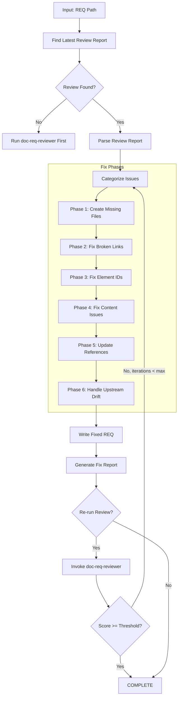
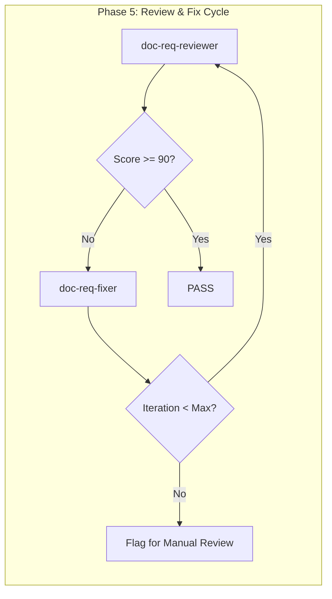

# doc-req-fixer

## Purpose

Automated **fix skill** that reads the latest review report and applies fixes to REQ (Requirements Specification) documents. This skill bridges the gap between `doc-req-reviewer` (which identifies issues) and the corrected REQ, enabling iterative improvement cycles.

**Layer**: 7 (REQ Quality Improvement)

**Upstream**: REQ document, Review Report (`REQ-NN.R_fix_report_vNNN.md` or `REQ-NN-SSS.R_review_report_vNNN.md`), SYS (for system design alignment)

**Downstream**: Fixed REQ, Fix Report (`REQ-NN.F_fix_report_vNNN.md` or `REQ-NN-SSS.F_fix_report_vNNN.md`)

---

## When to Use This Skill

Use `doc-req-fixer` when:

- **After Review**: Run after `doc-req-reviewer` identifies issues
- **Iterative Improvement**: Part of Review -> Fix -> Review cycle
- **Automated Pipeline**: CI/CD integration for quality gates
- **Batch Fixes**: Apply fixes to multiple REQ documents based on review reports

**Do NOT use when**:
- No review report exists (run `doc-req-reviewer` first)
- Creating new REQ (use `doc-req` or `doc-req-autopilot`)
- Only need validation (use `doc-req-validator`)

---

## Skill Dependencies

| Skill | Purpose | When Used |
|-------|---------|-----------|
| `doc-req-reviewer` | Source of issues to fix | Input (reads review report) |
| `doc-naming` | Element ID standards | Fix element IDs |
| `doc-req` | REQ creation rules | Create missing sections |
| `doc-sys` | SYS alignment reference | Verify system traceability |

---

## Workflow Overview



---

## Fix Phases

### Phase 1: Create Missing Files

Creates files that are referenced but don't exist.

**Scope**:

| Missing File | Action | Template Used |
|--------------|--------|---------------|
| `REQ-00_INDEX.md` | Create REQ index | Index template |
| `REQ-00_GLOSSARY.md` | Create requirements glossary | Glossary template |
| `UC_*.md` | Create placeholder use case doc | Use Case template |
| Reference docs (`*_REF_*.md`) | Create placeholder | REF template |

**REQ Index Template**:

```markdown
---
title: "REQ-00: Requirements Specifications Index"
tags:
  - req
  - index
  - reference
custom_fields:
  document_type: index
  artifact_type: REQ-REFERENCE
  layer: 7
---

# REQ-00: Requirements Specifications Index

Master index of all Requirements Specifications for this project.

## Functional Requirements

| REQ ID | Module | Status | Priority | SYS Refs |
|--------|--------|--------|----------|----------|
| REQ-01 | [Name] | Draft/Approved | P1/P2/P3 | SYS-01 |

## Non-Functional Requirements

| REQ ID | Category | Status | Priority |
|--------|----------|--------|----------|
| REQ-NFR-01 | Performance | Draft | P1 |
| REQ-NFR-02 | Security | Draft | P1 |

## Requirements by Priority

| Priority | REQ IDs | Count |
|----------|---------|-------|
| P1 (Critical) | | 0 |
| P2 (Important) | | 0 |
| P3 (Nice-to-have) | | 0 |

## Coverage Matrix

| SYS Component | REQ Coverage | Gaps |
|---------------|--------------|------|
| SYS-01 | REQ-01, REQ-02 | None |

---

*Maintained by doc-req-fixer. Update when adding new REQ documents.*
```

**REQ Glossary Template**:

```markdown
---
title: "REQ-00: Requirements Glossary"
tags:
  - req
  - glossary
  - reference
custom_fields:
  document_type: glossary
  artifact_type: REQ-REFERENCE
  layer: 7
---

# REQ-00: Requirements Glossary

Common terminology used across all Requirements Specification documents.

## Requirement Types

| Term | Definition | Example |
|------|------------|---------|
| FR | Functional Requirement | System shall authenticate users |
| NFR | Non-Functional Requirement | Response time < 200ms |
| UC | Use Case | User login flow |
| AC | Acceptance Criteria | Given/When/Then statement |

## Priority Levels

| Level | Definition | SLA |
|-------|------------|-----|
| P1 | Critical - Must have for MVP | Immediate |
| P2 | Important - Should have | Sprint N+1 |
| P3 | Nice-to-have - Could have | Backlog |

## Status Values

| Status | Definition | Next State |
|--------|------------|------------|
| Draft | Initial documentation | Review |
| Review | Under stakeholder review | Approved/Rejected |
| Approved | Accepted for implementation | Implemented |
| Implemented | Code complete | Verified |
| Verified | Testing complete | Closed |

## Domain Terms

<!-- Add project-specific terminology below -->

| Term | Definition | Context |
|------|------------|---------|
| [Term] | [Definition] | [Where used] |

---

*Maintained by doc-req-fixer. Update when terminology changes.*
```

**Use Case Placeholder Template**:

```markdown
---
title: "Use Case: [Use Case Name]"
tags:
  - use-case
  - requirements
  - reference
custom_fields:
  document_type: use-case
  status: placeholder
  created_by: doc-req-fixer
---

# Use Case: [Use Case Name]

> **Status**: Placeholder - Requires completion

## 1. Overview

| Attribute | Value |
|-----------|-------|
| UC ID | UC-NN |
| Actor | [Primary Actor] |
| Priority | P1/P2/P3 |
| Status | Placeholder |

## 2. Description

[TODO: Describe the use case purpose]

## 3. Preconditions

| # | Precondition |
|---|--------------|
| 1 | [Condition that must be true] |

## 4. Main Flow

| Step | Actor | System |
|------|-------|--------|
| 1 | [Actor action] | [System response] |

## 5. Alternative Flows

[TODO: Document alternative scenarios]

## 6. Postconditions

| # | Postcondition |
|---|---------------|
| 1 | [State after successful completion] |

## 7. Acceptance Criteria

| AC ID | Criteria | Type |
|-------|----------|------|
| AC-01 | [Given/When/Then] | Functional |

---

*Created by doc-req-fixer as placeholder. Complete this document to resolve broken link issues.*
```

---

### Phase 2: Fix Broken Links

Updates links to point to correct locations.

**Fix Actions**:

| Issue Code | Issue | Fix Action |
|------------|-------|------------|
| REV-L001 | Broken internal link | Update path or create target file |
| REV-L002 | External link unreachable | Add warning comment, keep link |
| REV-L003 | Absolute path used | Convert to relative path |
| REV-L004 | Missing SYS traceability link | Add link to corresponding SYS |

**Path Resolution Logic**:

```python
def fix_link_path(req_location: str, target_path: str) -> str:
    """Calculate correct relative path based on REQ location."""

    # Monolithic REQ: docs/07_REQ/REQ-01.md
    # Sectioned REQ: docs/07_REQ/REQ-01_slug/REQ-01-003_section.md

    if is_sectioned_req(req_location):
        # Need to go up one more level
        return "../" + calculate_relative_path(req_location, target_path)
    else:
        return calculate_relative_path(req_location, target_path)
```

**Cross-Layer Link Fix**:

| Source | Target | Link Pattern |
|--------|--------|--------------|
| REQ | SYS | `../06_SYS/SYS-NN.md` |
| REQ | CTR | `../08_CTR/CTR-NN.md` |
| REQ | SPEC | `../09_SPEC/SPEC-NN.md` |

---

### Phase 3: Fix Element IDs

Converts invalid element IDs to correct format.

**Conversion Rules**:

| Pattern | Issue | Conversion |
|---------|-------|------------|
| `REQ.NN.13.SS` | Code 13 invalid for REQ | `REQ.NN.01.SS` (Functional Req) |
| `FR-XXX` | Legacy pattern | `REQ.NN.01.SS` |
| `NFR-XXX` | Legacy pattern | `REQ.NN.27.SS` |
| `UC-XXX` | Legacy pattern | `REQ.NN.05.SS` |
| `AC-XXX` | Legacy pattern | `REQ.NN.06.SS` |

**Type Code Mapping** (REQ-specific valid codes: 01, 05, 06, 27):

| Code | Element Type | Description |
|------|--------------|-------------|
| 01 | Functional Requirement | System function specification |
| 05 | Use Case | User interaction scenario |
| 06 | Acceptance Criteria | Testable success criteria |
| 27 | Non-Functional Requirement | Quality attribute requirement |

**Invalid Code Conversions**:

| Invalid Code | Valid Code | Element Type |
|--------------|------------|--------------|
| 13 | 01 | Functional Requirement (was Decision Context) |
| 14 | 05 | Use Case (was Decision Statement) |
| 17 | 01 | Functional Requirement (was Component) |
| 18 | 06 | Acceptance Criteria (was Interface) |
| 22 | 01 | Functional Requirement (was Feature Item) |

**Regex Patterns**:

```python
# Find element IDs with invalid type codes for REQ
invalid_req_type_13 = r'REQ\.(\d{2})\.13\.(\d{2})'
replacement_13 = r'REQ.\1.01.\2'

invalid_req_type_14 = r'REQ\.(\d{2})\.14\.(\d{2})'
replacement_14 = r'REQ.\1.05.\2'

invalid_req_type_17 = r'REQ\.(\d{2})\.17\.(\d{2})'
replacement_17 = r'REQ.\1.01.\2'

# Find legacy patterns
legacy_fr = r'###\s+FR-(\d+):'
legacy_nfr = r'###\s+NFR-(\d+):'
legacy_uc = r'###\s+UC-(\d+):'
legacy_ac = r'###\s+AC-(\d+):'
```

---

### Phase 4: Fix Content Issues

Addresses placeholders and incomplete content.

**Fix Actions**:

| Issue Code | Issue | Fix Action |
|------------|-------|------------|
| REV-P001 | `[TODO]` placeholder | Flag for manual completion (cannot auto-fix) |
| REV-P002 | `[TBD]` placeholder | Flag for manual completion (cannot auto-fix) |
| REV-P003 | Template date `YYYY-MM-DD` | Replace with current date |
| REV-P004 | Template name `[Name]` | Replace with metadata author or flag |
| REV-P005 | Empty section | Add minimum template content |
| REV-P006 | Missing requirement status | Add "Draft" as default status |
| REV-P007 | Missing priority | Add "P2" as default priority |

**Auto-Replacements**:

```python
replacements = {
    'YYYY-MM-DDTHH:MM:SS': datetime.now().strftime('%Y-%m-%dT%H:%M:%S'),
    'YYYY-MM-DD': datetime.now().strftime('%Y-%m-%d'),
    'MM/DD/YYYY': datetime.now().strftime('%m/%d/%Y'),
    '[Current date]': datetime.now().strftime('%Y-%m-%dT%H:%M:%S'),
    '[Status]': 'Draft',
    '[Priority]': 'P2',
    '[Version]': '0.1',
}
```

**REQ-Specific Content Fixes**:

| Section | Missing Content | Auto-Fill |
|---------|-----------------|-----------|
| Status | Empty | "Draft" |
| Priority | Empty | "P2" |
| Version | Empty | "0.1" |
| Last Updated | Empty | Current date |
| Verification Method | Empty | "Test" |

---

### Phase 5: Update References

Ensures traceability and cross-references are correct.

**Fix Actions**:

| Issue | Fix Action |
|-------|------------|
| Missing `@ref:` for created files | Add reference tag |
| Incorrect cross-REQ path | Update to correct relative path |
| Missing SYS traceability | Add `@trace: SYS-NN.SS` tag |
| Missing CTR forward reference | Add `@trace: CTR-NN.SS` tag |
| Missing SPEC forward reference | Add `@trace: SPEC-NN.SS` tag |

**Traceability Matrix Update**:

```markdown
## Traceability

| REQ Element | Traces From | Traces To | Type |
|-------------|-------------|-----------|------|
| REQ.01.01.01 | SYS.01.17.01 | SPEC.01.01.01 | Requirement->Spec |
| REQ.01.05.01 | SYS.01.05.01 | BDD.01.09.01 | UseCase->Behavior |
| REQ.01.06.01 | REQ.01.01.01 | TSPEC.01.01.01 | Criteria->TestSpec |
```

---

### Phase 6: Handle Upstream Drift (Auto-Merge)

Addresses issues where upstream source documents (SYS) have changed since REQ creation. This phase implements a tiered auto-merge system that automatically integrates upstream changes based on change magnitude.

**Upstream**: SYS (Layer 6 - System Design)
**Downstream**: CTR (Layer 8 - Contracts), SPEC (Layer 9 - Specifications)

**ID Pattern**: `REQ.NN.TT.SS` where:
- `NN` = Module number (01-99)
- `TT` = Type code (01=Functional, 05=UseCase, 06=AcceptanceCriteria, 27=NFR)
- `SS` = Sequence number (01-99)

---

#### Tiered Auto-Merge Thresholds

| Tier | Change % | Action | Version Bump | Human Review |
|------|----------|--------|--------------|--------------|
| **Tier 1** | < 5% | Auto-merge additions | Patch (1.0 -> 1.0.1) | No |
| **Tier 2** | 5-15% | Auto-merge with changelog | Minor (1.0 -> 1.1) | Optional |
| **Tier 3** | > 15% | Archive + Regenerate | Major (1.x -> 2.0) | Yes |

---

#### Change Percentage Calculation

```python
def calculate_change_percentage(sys_current: str, sys_baseline: str) -> float:
    """
    Calculate percentage of change between SYS versions.

    Algorithm:
    1. Tokenize both documents (sections, components, interfaces)
    2. Calculate added tokens (new content)
    3. Calculate modified tokens (changed content)
    4. Calculate removed tokens (deleted content - weighted 2x)
    5. Return: (added + modified + 2*removed) / total_baseline * 100
    """
    baseline_tokens = tokenize_sys_document(sys_baseline)
    current_tokens = tokenize_sys_document(sys_current)

    added = len(current_tokens - baseline_tokens)
    removed = len(baseline_tokens - current_tokens)
    modified = count_modified_tokens(baseline_tokens, current_tokens)

    total_baseline = len(baseline_tokens)
    if total_baseline == 0:
        return 100.0  # New document = 100% change

    change_score = added + modified + (2 * removed)
    return (change_score / total_baseline) * 100

def tokenize_sys_document(content: str) -> set:
    """Extract meaningful tokens from SYS document."""
    tokens = set()
    # Extract component definitions (SYS.NN.17.SS)
    tokens.update(re.findall(r'SYS\.\d{2}\.17\.\d{2}', content))
    # Extract interface definitions (SYS.NN.18.SS)
    tokens.update(re.findall(r'SYS\.\d{2}\.18\.\d{2}', content))
    # Extract decision references (SYS.NN.13.SS)
    tokens.update(re.findall(r'SYS\.\d{2}\.13\.\d{2}', content))
    # Extract section headers
    tokens.update(re.findall(r'^##+ .+$', content, re.MULTILINE))
    return tokens
```

---

#### Tier 1: Auto-Merge Additions (< 5% Change)

**Trigger**: Minor additions to SYS that extend existing components.

**Actions**:
1. Identify new SYS elements (components, interfaces)
2. Generate corresponding REQ elements with auto-assigned IDs
3. Insert new requirements in appropriate sections
4. Increment patch version (1.0 -> 1.0.1)
5. Update drift cache with merge record

**Auto-ID Generation**:

```python
def generate_next_req_id(existing_ids: list, module: str, type_code: str) -> str:
    """
    Generate next available REQ ID.

    Example: If REQ.01.01.12 exists, next is REQ.01.01.13
    """
    pattern = f"REQ.{module}.{type_code}."
    max_seq = 0

    for id in existing_ids:
        if id.startswith(pattern):
            seq = int(id.split('.')[-1])
            max_seq = max(max_seq, seq)

    next_seq = str(max_seq + 1).zfill(2)
    return f"REQ.{module}.{type_code}.{next_seq}"

# Example: REQ.01.01.12 exists -> new ID is REQ.01.01.13
```

**Tier 1 Merge Template**:

```markdown
<!-- AUTO-MERGED from SYS-01 v1.2 | Tier 1 | 2026-02-10T16:00:00 -->
### REQ.01.01.13: [New Requirement Title]

| Attribute | Value |
|-----------|-------|
| ID | REQ.01.01.13 |
| Status | Draft |
| Priority | P2 |
| Source | SYS.01.17.05 (auto-merged) |
| Version Added | 1.0.1 |

**Description**: [Auto-extracted from SYS component description]

**Acceptance Criteria**:
- [ ] AC-01: [Derived from SYS interface contracts]

@trace: SYS.01.17.05
```

---

#### Tier 2: Auto-Merge with Changelog (5-15% Change)

**Trigger**: Moderate changes including new sections or modified components.

**Actions**:
1. Perform all Tier 1 actions
2. Generate detailed changelog section
3. Mark modified existing requirements with `[UPDATED]` tag
4. Increment minor version (1.0 -> 1.1)
5. Create merge summary for optional human review

**Changelog Format**:

```markdown
## Changelog (Auto-Merged v1.1)

**Merge Date**: 2026-02-10T16:00:00
**Source**: SYS-01 v1.3 (baseline: v1.1)
**Change Percentage**: 8.5%
**Tier**: 2 (Auto-Merge with Changelog)

### Added Requirements

| REQ ID | Title | Source SYS Element |
|--------|-------|-------------------|
| REQ.01.01.13 | New Data Validation | SYS.01.17.05 |
| REQ.01.01.14 | Extended Logging | SYS.01.17.06 |

### Updated Requirements

| REQ ID | Change Type | Previous | Current |
|--------|-------------|----------|---------|
| REQ.01.01.03 | Priority | P3 | P2 |
| REQ.01.01.07 | Description | [truncated] | [truncated] |

### Deprecated (No Deletion)

| REQ ID | Reason | Superseded By |
|--------|--------|---------------|
| REQ.01.01.02 | Component removed in SYS | REQ.01.01.13 |
```

**No Deletion Policy**:

Requirements are NEVER deleted. Instead, mark as deprecated:

```markdown
### REQ.01.01.02: Legacy Authentication [DEPRECATED]

> **DEPRECATED**: This requirement is superseded by REQ.01.01.13 as of v1.1.
> Reason: Source component SYS.01.17.02 removed in SYS v1.3.
> Retained for historical traceability.

| Attribute | Value |
|-----------|-------|
| ID | REQ.01.01.02 |
| Status | **Deprecated** |
| Deprecated Date | 2026-02-10 |
| Superseded By | REQ.01.01.13 |
```

---

#### Tier 3: Archive and Regenerate (> 15% Change)

**Trigger**: Major architectural changes in SYS requiring fundamental REQ restructure.

**Actions**:
1. Create archive manifest
2. Archive current REQ version
3. Trigger full REQ regeneration via `doc-req-autopilot`
4. Increment major version (1.x -> 2.0)
5. Require human review before finalization

**Archive Manifest**:

```markdown
---
title: "REQ-01 Archive Manifest"
archive_date: "2026-02-10T16:00:00"
archive_reason: "Tier 3 upstream drift (>15% change)"
archived_version: "1.2"
new_version: "2.0"
---

# REQ-01 Archive Manifest

## Archive Summary

| Attribute | Value |
|-----------|-------|
| Document | REQ-01 |
| Archived Version | 1.2 |
| Archive Date | 2026-02-10T16:00:00 |
| Change Percentage | 23.7% |
| Trigger | Tier 3 Upstream Drift |
| Upstream Source | SYS-01 v2.0 |

## Archived Files

| File | Archive Location | Hash |
|------|------------------|------|
| REQ-01.md | archive/REQ-01_v1.2/ | sha256:abc123... |
| REQ-01.F_fix_report_v003.md | archive/REQ-01_v1.2/ | sha256:def456... |

## Migration Notes

| Old REQ ID | Status | New REQ ID | Notes |
|------------|--------|------------|-------|
| REQ.01.01.01 | Retained | REQ.01.01.01 | No change |
| REQ.01.01.02 | Deprecated | - | Functionality removed |
| REQ.01.01.03 | Merged | REQ.01.01.02 | Combined with REQ.01.01.04 |
| - | New | REQ.01.01.10 | New from SYS.01.17.08 |

## Regeneration Trigger

```bash
/doc-req-autopilot SYS-01 --from-archive REQ-01_v1.2 --target-version 2.0
```
```

**Archive Directory Structure**:

```
docs/07_REQ/
├── archive/
│   └── REQ-01_v1.2/
│       ├── ARCHIVE_MANIFEST.md
│       ├── REQ-01.md
│       ├── REQ-01.F_fix_report_v003.md
│       └── .drift_cache.json
├── REQ-01.md (v2.0 - regenerated)
└── REQ-00_INDEX.md
```

---

#### Enhanced Drift Cache with Merge History

After processing drift issues, update `.drift_cache.json`:

```json
{
  "req_version": "1.1",
  "req_updated": "2026-02-10T16:00:00",
  "drift_reviewed": "2026-02-10T16:00:00",
  "upstream_hashes": {
    "../../06_SYS/SYS-01.md": "sha256:a1b2c3d4e5f6...",
    "../../06_SYS/SYS-01.md#component-3": "sha256:g7h8i9j0k1l2..."
  },
  "merge_history": [
    {
      "merge_date": "2026-02-10T16:00:00",
      "tier": 2,
      "change_percentage": 8.5,
      "version_before": "1.0",
      "version_after": "1.1",
      "upstream_version": "SYS-01 v1.3",
      "added_ids": ["REQ.01.01.13", "REQ.01.01.14"],
      "updated_ids": ["REQ.01.01.03", "REQ.01.01.07"],
      "deprecated_ids": ["REQ.01.01.02"]
    }
  ],
  "acknowledged_drift": [
    {
      "document": "SYS-01.md",
      "acknowledged_date": "2026-02-08",
      "reason": "Reviewed - cosmetic changes only",
      "hash_at_acknowledgment": "sha256:xyz789..."
    }
  ],
  "downstream_notifications": {
    "CTR-01": {
      "notified": "2026-02-10T16:05:00",
      "req_version": "1.1",
      "pending_review": true
    },
    "SPEC-01": {
      "notified": "2026-02-10T16:05:00",
      "req_version": "1.1",
      "pending_review": true
    }
  }
}
```

---

#### Drift Issue Codes (Updated)

| Code | Severity | Description | Tier | Auto-Fix |
|------|----------|-------------|------|----------|
| REV-D001 | Info | SYS minor addition (< 5%) | 1 | Yes |
| REV-D002 | Warning | SYS moderate change (5-15%) | 2 | Yes |
| REV-D003 | Info | Upstream version incremented | 1 | Yes |
| REV-D004 | Warning | New component added to SYS | 1-2 | Yes |
| REV-D005 | Error | Major upstream modification (> 15%) | 3 | No (archive) |
| REV-D006 | Warning | Deprecated upstream element | 2 | Yes (mark deprecated) |

---

#### Command Options for Drift Handling

```bash
# Auto-merge with tier detection
/doc-req-fixer REQ-01 --auto-merge

# Force specific tier (override auto-detection)
/doc-req-fixer REQ-01 --auto-merge --force-tier 2

# Preview merge without applying
/doc-req-fixer REQ-01 --auto-merge --dry-run

# Acknowledge drift without merge
/doc-req-fixer REQ-01 --acknowledge-drift

# View merge history
/doc-req-fixer REQ-01 --show-merge-history

# Restore from archive
/doc-req-fixer REQ-01 --restore-archive v1.2
```

---

## Command Usage

### Basic Usage

```bash
# Fix REQ based on latest review
/doc-req-fixer REQ-01

# Fix sectioned REQ
/doc-req-fixer REQ-01-003

# Fix with explicit review report
/doc-req-fixer REQ-01 --review-report REQ-01.R_review_report_v001.md

# Fix and re-run review
/doc-req-fixer REQ-01 --revalidate

# Fix with iteration limit
/doc-req-fixer REQ-01 --revalidate --max-iterations 3
```

### Options

| Option | Default | Description |
|--------|---------|-------------|
| `--review-report` | latest | Specific review report to use |
| `--revalidate` | false | Run reviewer after fixes |
| `--max-iterations` | 3 | Max fix-review cycles |
| `--fix-types` | all | Specific fix types (comma-separated) |
| `--create-missing` | true | Create missing reference files |
| `--backup` | true | Backup REQ before fixing |
| `--dry-run` | false | Preview fixes without applying |
| `--acknowledge-drift` | false | Interactive drift acknowledgment mode |
| `--update-drift-cache` | true | Update .drift_cache.json after fixes |
| `--auto-merge` | false | Enable tiered auto-merge for upstream drift |
| `--force-tier` | auto | Force specific merge tier (1, 2, or 3) |
| `--show-merge-history` | false | Display merge history from drift cache |
| `--restore-archive` | none | Restore REQ from archived version (e.g., v1.2) |
| `--notify-downstream` | true | Notify CTR/SPEC of REQ changes after merge |

### Fix Types

| Type | Description |
|------|-------------|
| `missing_files` | Create missing index, glossary, use case docs |
| `broken_links` | Fix link paths |
| `element_ids` | Convert invalid/legacy element IDs |
| `content` | Fix placeholders, dates, status, priority |
| `references` | Update traceability and cross-references |
| `drift` | Handle upstream drift detection issues |
| `drift_merge` | Auto-merge upstream SYS changes (tiered) |
| `drift_archive` | Archive current version for Tier 3 changes |
| `deprecate` | Mark obsolete requirements as deprecated (no deletion) |
| `all` | All fix types (default) |

---

## Output Artifacts

### Fix Report

**Nested Folder Rule**: ALL REQ use nested folders (`REQ-NN_{slug}/`) regardless of size. Fix reports are stored alongside the REQ document in the nested folder.

**File Naming**: `REQ-NN.F_fix_report_vNNN.md` or `REQ-NN-SSS.F_fix_report_vNNN.md`

**Location**: Inside the REQ nested folder: `docs/REQ/REQ-NN_{slug}/`

**Structure**:

```markdown
---
title: "REQ-NN.F: Fix Report v001"
tags:
  - req
  - fix-report
  - quality-assurance
custom_fields:
  document_type: fix-report
  artifact_type: REQ-FIX
  layer: 7
  parent_doc: REQ-NN
  source_review: REQ-NN.R_review_report_v001.md
  fix_date: "YYYY-MM-DDTHH:MM:SS"
  fix_tool: doc-req-fixer
  fix_version: "1.0"
---

# REQ-NN Fix Report v001

## Summary

| Metric | Value |
|--------|-------|
| Source Review | REQ-NN.R_review_report_v001.md |
| Issues in Review | 18 |
| Issues Fixed | 15 |
| Issues Remaining | 3 (manual review required) |
| Files Created | 3 |
| Files Modified | 5 |

## Files Created

| File | Type | Location |
|------|------|----------|
| REQ-00_INDEX.md | REQ Index | docs/07_REQ/ |
| REQ-00_GLOSSARY.md | REQ Glossary | docs/07_REQ/ |
| UC_UserLogin.md | Use Case Placeholder | docs/00_REF/use-cases/ |

## Fixes Applied

| # | Issue Code | Issue | Fix Applied | File |
|---|------------|-------|-------------|------|
| 1 | REV-L001 | Broken index link | Created REQ-00_INDEX.md | REQ-01.md |
| 2 | REV-L001 | Broken glossary link | Created REQ-00_GLOSSARY.md | REQ-01.md |
| 3 | REV-L001 | Broken use case link | Created placeholder UC file | REQ-01.md |
| 4 | REV-N004 | Element type 13 invalid | Converted to type 01 | REQ-01.md |
| 5 | REV-N004 | Legacy FR-XXX pattern | Converted to REQ.NN.01.SS | REQ-01.md |
| 6 | REV-P007 | Missing priority | Added P2 default | REQ-02.md |

## Issues Requiring Manual Review

| # | Issue Code | Issue | Location | Reason |
|---|------------|-------|----------|--------|
| 1 | REV-P001 | [TODO] placeholder | REQ-01:L67 | Domain expertise needed |
| 2 | REV-D001 | SYS drift detected | REQ-01:L145 | Review system changes |
| 3 | REV-R001 | Missing acceptance criteria | REQ-01:L200 | Define testable criteria |

## Validation After Fix

| Metric | Before | After | Delta |
|--------|--------|-------|-------|
| Review Score | 82 | 93 | +11 |
| Errors | 5 | 0 | -5 |
| Warnings | 8 | 3 | -5 |

## Next Steps

1. Complete UC_UserLogin.md placeholder
2. Address remaining [TODO] placeholders
3. Add missing acceptance criteria for requirements
4. Review SYS drift and update requirements if needed
5. Run `/doc-req-reviewer REQ-01` to verify fixes
```

---

## Integration with Autopilot

This skill is invoked by `doc-req-autopilot` in the Review -> Fix cycle:



**Autopilot Integration Points**:

| Phase | Action | Skill |
|-------|--------|-------|
| Phase 5a | Run initial review | `doc-req-reviewer` |
| Phase 5b | Apply fixes if issues found | `doc-req-fixer` |
| Phase 5c | Re-run review | `doc-req-reviewer` |
| Phase 5d | Repeat until pass or max iterations | Loop |

---

## Error Handling

### Recovery Actions

| Error | Action |
|-------|--------|
| Review report not found | Prompt to run `doc-req-reviewer` first |
| Cannot create file (permissions) | Log error, continue with other fixes |
| Cannot parse review report | Abort with clear error message |
| Max iterations exceeded | Generate report, flag for manual review |

### Backup Strategy

Before applying any fixes:

1. Create backup in `tmp/backup/REQ-NN_YYYYMMDD_HHMMSS/`
2. Copy all REQ files to backup location
3. Apply fixes to original files
4. If error during fix, restore from backup

---

## Related Skills

| Skill | Relationship |
|-------|--------------|
| `doc-req-reviewer` | Provides review report (input) |
| `doc-req-autopilot` | Orchestrates Review -> Fix cycle |
| `doc-req-validator` | Structural validation |
| `doc-naming` | Element ID standards |
| `doc-req` | REQ creation rules |
| `doc-sys` | Upstream system design |
| `doc-ctr` | Downstream contracts reference |
| `doc-spec` | Downstream specifications reference |

---

## Version History

| Version | Date | Changes |
|---------|------|---------|
| 2.0 | 2026-02-10 | **Enhanced Phase 6 Auto-Merge System**: Tiered auto-merge thresholds (Tier 1 <5%, Tier 2 5-15%, Tier 3 >15%); Change percentage calculation algorithm; Auto-generated IDs for new requirements (REQ.NN.TT.SS pattern); No deletion policy - mark as [DEPRECATED] instead; Archive manifest creation for Tier 3; Enhanced drift cache with merge history and downstream notifications; New options: --auto-merge, --force-tier, --show-merge-history, --restore-archive, --notify-downstream; New fix types: drift_merge, drift_archive, deprecate; Semantic versioning (patch/minor/major) based on change tier |
| 1.0 | 2026-02-10 | Initial skill creation; 6-phase fix workflow; REQ Index, Glossary, and Use Case file creation; Element ID conversion (types 01, 05, 06, 27); Broken link fixes; SYS upstream drift handling; Support for sectioned REQ naming (REQ-NN-SSS); Integration with autopilot Review->Fix cycle |
