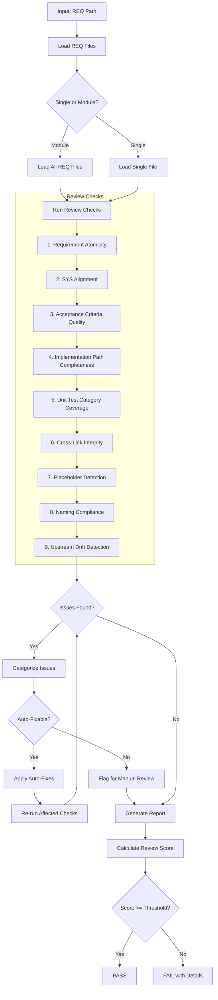
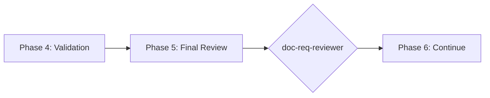

# doc-req-reviewer

## Purpose

Comprehensive **content review and quality assurance** for Atomic Requirements (REQ) documents. This skill performs deep content analysis beyond structural validation, checking requirement atomicity, SYS alignment, implementation paths, unit test coverage, and identifying issues that require manual review.

**Layer**: 7 (REQ Quality Assurance)

**Upstream**: REQ (from `doc-req-autopilot` or `doc-req`)

**Downstream**: None (final QA gate before SPEC/CTR generation)

---

## When to Use This Skill

Use `doc-req-reviewer` when:

- **After REQ Generation**: Run immediately after `doc-req-autopilot` completes
- **Manual REQ Edits**: After making manual changes to REQ
- **Pre-SPEC Check**: Before running `doc-spec-autopilot`
- **Pre-CTR Check**: Before running `doc-ctr-autopilot`
- **Periodic Review**: Regular quality checks on existing REQs

**Do NOT use when**:
- REQ does not exist yet (use `doc-req` or `doc-req-autopilot` first)
- Need structural/schema validation only (use `doc-req-validator`)
- Generating new REQ content (use `doc-req`)

---

## Skill vs Validator: Key Differences

| Aspect | `doc-req-validator` | `doc-req-reviewer` |
|--------|---------------------|-------------------|
| **Focus** | Schema compliance, SPEC-Ready score | Content quality, implementation readiness |
| **Checks** | Required sections, 12-section format | Atomicity, implementation paths, test coverage |
| **Auto-Fix** | Structural issues only | Content issues (links, formatting) |
| **Output** | SPEC-Ready + IMPL-Ready scores | Review score + issue list |
| **Phase** | Phase 4 (Validation) | Phase 5 (Final Review) |
| **Blocking** | Score < threshold blocks | Review score < threshold flags |

---

## Review Workflow



---

## Review Checks

### 1. Requirement Atomicity

Validates each requirement is truly atomic.

**Scope**:
- Single responsibility
- No compound requirements
- Independently testable
- Clear scope boundaries

**Error Codes**:

| Code | Severity | Description |
|------|----------|-------------|
| REV-RA001 | Error | Requirement has multiple responsibilities |
| REV-RA002 | Warning | Compound requirement (contains AND/OR) |
| REV-RA003 | Warning | Not independently testable |
| REV-RA004 | Info | Scope boundaries could be clearer |

---

### 2. SYS Alignment

Validates REQ traces to SYS requirements.

**Scope**:
- Every REQ maps to SYS requirement
- Decomposition is complete
- No orphaned requirements
- Functional coverage maintained

**Error Codes**:

| Code | Severity | Description |
|------|----------|-------------|
| REV-SA001 | Error | REQ without SYS source |
| REV-SA002 | Warning | SYS requirement not fully decomposed |
| REV-SA003 | Warning | Orphaned requirement detected |
| REV-SA004 | Info | Multiple REQs from single SYS (acceptable) |

---

### 3. Acceptance Criteria Quality

Validates acceptance criteria are comprehensive.

**Scope**:
- Minimum 10 functional criteria
- Minimum 5 quality criteria
- Categories covered ([Logic], [Validation], [State], [Edge], [Security])
- Measurable outcomes

**Error Codes**:

| Code | Severity | Description |
|------|----------|-------------|
| REV-AC001 | Error | Less than 10 functional criteria |
| REV-AC002 | Error | Less than 5 quality criteria |
| REV-AC003 | Warning | Missing [Security] criteria |
| REV-AC004 | Warning | Criterion not measurable |
| REV-AC005 | Info | [Edge] case criteria could be expanded |

---

### 4. Implementation Path Completeness

Validates Section 11 implementation guidance.

**Scope**:
- Code implementation paths defined
- Module locations specified
- Dependencies documented
- Method signatures suggested

**Error Codes**:

| Code | Severity | Description |
|------|----------|-------------|
| REV-IP001 | Error | No implementation paths defined |
| REV-IP002 | Warning | Module location not specified |
| REV-IP003 | Warning | Dependencies not documented |
| REV-IP004 | Info | Method signatures not suggested |

---

### 5. Unit Test Category Coverage

Validates Section 8 test categories.

**Scope**:
- All 5 categories present ([Logic], [Validation], [State], [Edge], [Security])
- Minimum test cases per category
- Test rationale documented

**Error Codes**:

| Code | Severity | Description |
|------|----------|-------------|
| REV-UT001 | Error | Missing test category |
| REV-UT002 | Warning | Insufficient tests in category |
| REV-UT003 | Info | Test rationale not documented |

---

### 6. Cross-Link Integrity

Validates Section 10.5 cross-links.

**Scope**:
- @discoverability tags valid
- Related REQs exist
- Bidirectional links present

**Error Codes**:

| Code | Severity | Description |
|------|----------|-------------|
| REV-CL001 | Error | Broken cross-link |
| REV-CL002 | Warning | Missing bidirectional link |
| REV-CL003 | Info | @discoverability target not yet created |

---

### 7. Placeholder Detection

Identifies incomplete content requiring replacement.

**Error Codes**:

| Code | Severity | Description |
|------|----------|-------------|
| REV-P001 | Error | [TODO] placeholder found |
| REV-P002 | Error | [TBD] placeholder found |
| REV-P003 | Warning | Template value not replaced |

---

### 8. Naming Compliance

Validates element IDs follow `doc-naming` standards.

**Scope**:
- Element IDs use `REQ.NN.TT.SS` format
- Element type codes valid for REQ (01, 05, 06, 27)
- Atomic file naming convention

**Error Codes**:

| Code | Severity | Description |
|------|----------|-------------|
| REV-N001 | Error | Invalid element ID format |
| REV-N002 | Error | Element type code not valid for REQ |
| REV-N003 | Error | Legacy pattern detected |

---

### 9. Upstream Drift Detection (Mandatory Cache)

Detects when upstream SYS documents have been modified after the REQ was created or last updated.

**The drift cache is mandatory** - the reviewer MUST create/update it after every review.

**Purpose**: Identifies stale REQ content that may not reflect current system requirements. When SYS documents change, the REQ may need updates to maintain alignment with system-level specifications.

**Upstream Documents**:
- **SYS documents**: System Requirements that REQ atomic requirements decompose from

**Scope**:
- `@sys:` tag targets (SYS document references)
- Traceability section upstream artifact links
- Any markdown links to `../06_SYS/`
- Section 10 parent requirement references

**Detection Methods**:

| Method | Description | Precision |
|--------|-------------|-----------|
| **Timestamp Comparison** | Compares SYS doc `mtime` vs REQ creation/update date | Medium |
| **Content Hash** | SHA-256 hash of referenced SYS requirement sections | High |
| **Version Tracking** | Checks `version` field in YAML frontmatter | High |

**Drift Cache File** (MANDATORY):

Location: `docs/07_REQ/.drift_cache.json`

```json
{
  "cache_version": "1.0",
  "last_review": "2026-02-10T17:00:00",
  "reviewer_version": "1.3",
  "upstream_hashes": {
    "docs/06_SYS/SYS-01_f1_iam.md": {
      "hash": "a1b2c3d4e5f6...",
      "mtime": "2026-02-08T10:15:00",
      "version": "1.0"
    },
    "docs/06_SYS/SYS-03_f3_observability.md": {
      "hash": "e5f6g7h8i9j0...",
      "mtime": "2026-02-10T14:30:00",
      "version": "1.2"
    }
  },
  "req_states": {
    "REQ-01": {
      "last_reviewed": "2026-02-10T17:00:00",
      "upstream_refs": ["docs/06_SYS/SYS-01_f1_iam.md"]
    },
    "REQ-03": {
      "last_reviewed": "2026-02-10T17:00:00",
      "upstream_refs": ["docs/06_SYS/SYS-03_f3_observability.md"]
    }
  }
}
```

**Three-Phase Detection Algorithm**:

```
Phase 1: Load Cache
─────────────────────
1. Check if docs/07_REQ/.drift_cache.json exists
2. If exists:
   a. Load cached upstream hashes
   b. Load cached REQ states
3. If not exists:
   a. Initialize empty cache structure
   b. Flag as first review (REV-D006)

Phase 2: Detect Drift
─────────────────────
1. Extract all upstream references from REQ:
   - @sys: tags → [SYS document ID, requirement ID]
   - Links to ../06_SYS/ → [path]
   - Traceability table upstream artifacts → [path]
   - Section 10 parent SYS requirement → [SYS.NN.TT.SS]

2. For each upstream reference:
   a. Resolve path to absolute file path
   b. Check file exists (already covered by Check #2)
   c. Compute current SHA-256 hash
   d. Compare to cached hash
   e. If hash differs → flag as DRIFT (REV-D002)
   f. If mtime > REQ last_reviewed → flag as TIMESTAMP_DRIFT (REV-D001)

3. Calculate drift severity:
   a. Compute content diff percentage
   b. If >20% change → Critical (REV-D005)
   c. If version incremented → Info (REV-D003)

Phase 3: Update Cache (MANDATORY)
─────────────────────────────────
1. For each upstream document reviewed:
   a. Compute current SHA-256 hash
   b. Record current mtime
   c. Extract version from frontmatter
2. Update req_states with review timestamp
3. Write updated cache to docs/07_REQ/.drift_cache.json
4. Cache update is MANDATORY - never skip this step
```

**Hash Calculation**:

```python
import hashlib

def compute_upstream_hash(file_path: str) -> str:
    """Compute SHA-256 hash of upstream document content."""
    with open(file_path, 'r', encoding='utf-8') as f:
        content = f.read()
    return hashlib.sha256(content.encode('utf-8')).hexdigest()
```

**Error Codes**:

| Code | Severity | Description |
|------|----------|-------------|
| REV-D001 | Warning | Upstream SYS modified after REQ creation |
| REV-D002 | Warning | Referenced SYS requirement section has changed (hash mismatch) |
| REV-D003 | Info | Upstream SYS version incremented |
| REV-D004 | Info | New content added to upstream SYS |
| REV-D005 | Error | Critical SYS substantially modified (>20% change) |
| REV-D006 | Info | Cache created - first review |

**Report Output**:

```markdown
## Upstream Drift Analysis

**Cache Status**: Updated | Created | N/A
**Cache Location**: docs/07_REQ/.drift_cache.json

| Upstream Document | REQ Reference | Last Modified | REQ Updated | Days Stale | Severity |
|-------------------|---------------|---------------|-------------|------------|----------|
| SYS-01_f1_iam.md | @sys Section 3.2 | 2026-02-08T10:15:00 | 2026-02-05T09:00:00 | 3 | Warning |
| SYS-03_f3_observability.md | Traceability | 2026-02-10T14:30:00 | 2026-02-05T09:00:00 | 5 | Warning |

**Recommendation**: Review upstream SYS changes and update REQ if system requirements have changed.
```

**Auto-Actions**:
- Update `docs/07_REQ/.drift_cache.json` with current hashes after review (MANDATORY)
- Add `[DRIFT]` marker to affected @sys tags (optional)
- Generate drift summary in review report

**Configuration**:

| Setting | Default | Description |
|---------|---------|-------------|
| `cache_enabled` | true (Mandatory) | Cache is always enabled |
| `drift_threshold_days` | 7 | Days before drift becomes Warning |
| `critical_threshold_days` | 30 | Days before drift becomes Error |
| `tracked_patterns` | `@sys:` | Patterns to track for drift |

---

## Review Score Calculation

**Scoring Formula**:

| Category | Weight | Calculation |
|----------|--------|-------------|
| Requirement Atomicity | 14% | (atomic / total_reqs) × 14 |
| SYS Alignment | 14% | (aligned / total_reqs) × 14 |
| Acceptance Criteria Quality | 19% | (quality_score) × 19 |
| Implementation Path Completeness | 14% | (complete_paths / total) × 14 |
| Unit Test Category Coverage | 14% | (covered_categories / 5) × 14 |
| Cross-Link Integrity | 5% | (valid_links / total) × 5 |
| Placeholder Detection | 5% | (no_placeholders ? 5 : 5 - count) |
| Naming Compliance | 10% | (valid_ids / total_ids) × 10 |
| Upstream Drift | 5% | (fresh_refs / total_refs) × 5 |

**Total**: Sum of all categories (max 100)

**Thresholds**:
- **PASS**: ≥ 90
- **WARNING**: 80-89
- **FAIL**: < 80

---

## Command Usage

```bash
# Review specific REQ module
/doc-req-reviewer REQ-03

# Review specific atomic REQ
/doc-req-reviewer REQ-03-001

# Review REQ by path
/doc-req-reviewer docs/07_REQ/REQ-03_f3_observability/

# Review all REQs
/doc-req-reviewer all
```

---

## Output Report

Review reports are stored alongside the reviewed document per project standards.

**Nested Folder Rule**: ALL REQ use nested folders (`REQ-NN_{slug}/`) regardless of size. This ensures review reports, fix reports, and drift cache files are organized with their parent document.

**File Naming**: `REQ-NN.R_review_report_vNNN.md` (module-level) or `REQ-NN-SSS.R_review_report_vNNN.md` (atomic-level)

**Location**: Inside the REQ nested folder: `docs/REQ/REQ-NN_{slug}/`

### Versioning Rules

1. **First Review**: Creates `REQ-NN.R_review_report_v001.md`
2. **Subsequent Reviews**: Auto-increments version (v002, v003, etc.)
3. **Same-Day Reviews**: Each review gets unique version number

**Version Detection**: Scans folder for existing `REQ-NN.R_review_report_v*.md` files and increments.

**Example**:

```
docs/REQ/REQ-03_f3_observability/
├── REQ-03-001_metrics_collection.md
├── REQ-03-001.R_review_report_v001.md    # First review
├── REQ-03-001.R_review_report_v002.md    # After fixes
└── .drift_cache.json
```

### Delta Reporting

When previous reviews exist, include score comparison in the report.

See `REVIEW_DOCUMENT_STANDARDS.md` for complete versioning requirements.

---

## Integration with doc-req-autopilot

This skill is invoked during Phase 5 of `doc-req-autopilot`:



---

## Related Skills

| Skill | Relationship |
|-------|--------------|
| `doc-naming` | Naming standards for Check #8 |
| `doc-req-autopilot` | Invokes this skill in Phase 5 |
| `doc-req-validator` | Structural validation (Phase 4) |
| `doc-req-fixer` | Applies fixes based on review findings |
| `doc-req` | REQ creation rules |
| `doc-sys-reviewer` | Upstream QA |
| `doc-spec-autopilot` | Downstream consumer |
| `doc-ctr-autopilot` | Downstream consumer (for external APIs) |

---

## Version History

| Version | Date | Changes |
|---------|------|---------|
| 1.3 | 2026-02-10 | Made drift cache mandatory; Three-phase detection algorithm (Load/Detect/Update); Added REV-D006 error code for first review; Cache location standardized to docs/07_REQ/.drift_cache.json; Added cache status to report output |
| 1.2 | 2026-02-10 | Added Check #9: Upstream Drift Detection - detects when SYS documents modified after REQ creation; REV-D001-D005 error codes; drift cache support; configurable thresholds; Added doc-req-fixer to Related Skills |
| 1.1 | 2026-02-10 | Added review versioning support (_vNNN pattern); Delta reporting for score comparison |
| 1.0 | 2026-02-10 | Initial skill creation with 8 review checks; Atomicity validation; Acceptance criteria quality; Implementation path completeness |
