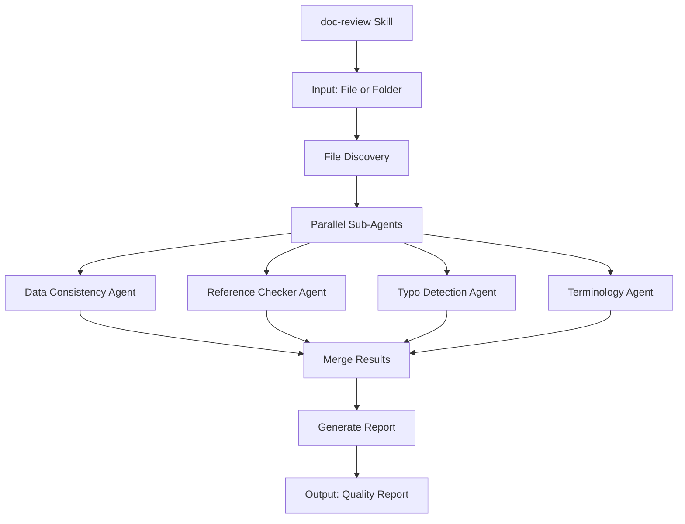

# doc-review

**Description**: Multi-agent documentation quality review system that analyzes a single file or all files in a folder for data inconsistencies, reference errors, typos, and unclear terminology.

**Category**: Quality Assurance

**Complexity**: High (multi-agent coordination)

---

## Purpose

Comprehensive documentation quality review using specialized sub-agents to detect:
- **Data inconsistencies**: Contradictory information, wrong data, confusing content
- **Reference errors**: Broken links, invalid cross-references, missing anchors
- **Typos and spelling**: Misspellings, grammatical errors, formatting issues
- **Terminology issues**: Undefined terms, inconsistent naming, ambiguous language

---

## Analysis Modes

| Mode | Input | Behavior |
|------|-------|----------|
| **Single File** | `/doc-review path/to/file.md` | Analyzes one file in depth |
| **Folder** | `/doc-review path/to/folder/` | Analyzes ALL files in folder together, including cross-file consistency |

**Folder mode** provides additional cross-file checks:
- Terminology consistency across all documents
- Cross-document reference validation
- Duplicate content detection across files
- Consistent naming conventions

---

## When to Use This Skill

**Use doc-review when**:
- Reviewing documentation before publication
- Validating files after batch creation
- Performing quality audits on markdown/YAML files
- Checking cross-reference integrity
- Pre-commit quality validation
- Reviewing a single file or entire folder

**Do NOT use when**:
- Full traceability validation needed (use trace-check)
- Code-specific review needed (use code-review)
- Single document structure validation (use doc-*-validator skills)

---

## Skill Inputs

| Input | Type | Required | Description | Example |
|-------|------|----------|-------------|---------|
| path | string | Yes | Single file path or folder path to review | `ai_dev_flow/PRD/PRD-001.md`, `docs/EARS/` |
| scope | string | No | Review scope | `"full"` (default), `"quick"`, `"deep"` |
| focus | array | No | Specific checks to run | `["data", "references", "typos", "terms"]` |
| report_format | string | No | Output format | `"markdown"` (default), `"json"`, `"summary"` |
| auto_fix | boolean | No | Attempt automatic fixes | `false` (default) |

---

## Sub-Agent Architecture

The skill coordinates **4 specialized sub-agents** that run in parallel:



### Sub-Agent 1: Data Consistency Agent

**Purpose**: Detect inconsistent, wrong, or confusing information

**Checks**:
- Contradictory statements within same document
- Numerical inconsistencies (counts, dates, versions)
- Status field mismatches (metadata vs content)
- Duplicate content with variations
- Logical contradictions
- Outdated information markers

**Detection Patterns**:
```yaml
data_consistency_checks:
  count_mismatch:
    pattern: "\\d+ (requirements|items|sections)"
    validate: "count matches actual items"
    error_code: "DATA-E001"

  status_mismatch:
    pattern: "Status:\\s*(Draft|Approved|Implemented)"
    validate: "matches content maturity"
    error_code: "DATA-E002"

  date_inconsistency:
    pattern: "\\d{4}-\\d{2}-\\d{2}"
    validate: "Last Updated >= Created"
    error_code: "DATA-E003"

  version_format:
    pattern: "Version:\\s*[\\d.]+"
    validate: "semantic versioning compliance"
    error_code: "DATA-E004"

  duplicate_content:
    pattern: "similar paragraphs >80%"
    validate: "intentional or error"
    error_code: "DATA-W001"
```

### Sub-Agent 2: Reference Checker Agent

**Purpose**: Validate all links, references, and cross-document connections

**Checks**:
- Markdown link resolution (`[text](path#anchor)`)
- Internal anchor existence (`#section-id`)
- Cross-document reference validity
- Relative path correctness
- External URL accessibility (optional)
- Traceability tag format (`@brd:`, `@prd:`, etc.)

**Detection Patterns**:
```yaml
reference_checks:
  broken_link:
    pattern: "\\[.*?\\]\\(.*?\\)"
    validate: "target file exists"
    error_code: "REF-E001"

  invalid_anchor:
    pattern: "\\[.*?\\]\\(.*?#.*?\\)"
    validate: "anchor exists in target"
    error_code: "REF-E002"

  orphan_anchor:
    pattern: "^#{1,6}\\s+.*$"
    validate: "has incoming references"
    error_code: "REF-W001"

  relative_path:
    pattern: "\\.\\./|\\./"
    validate: "path resolves correctly"
    error_code: "REF-E003"

  tag_format:
    pattern: "@(brd|prd|ears|bdd|adr|sys|req|spec|impl|ctr|tasks|iplan):"
    validate: "follows TYPE.NN.TT.SS format"
    error_code: "REF-E004"

  circular_reference:
    pattern: "A→B→...→A"
    validate: "no circular chains"
    error_code: "REF-E005"
```

### Sub-Agent 3: Typo Detection Agent

**Purpose**: Find spelling errors, grammatical issues, and formatting problems

**Checks**:
- Common misspellings
- Technical term spelling
- Capitalization inconsistencies
- Punctuation errors
- Whitespace issues
- Markdown syntax errors

**Detection Patterns**:
```yaml
typo_checks:
  common_misspellings:
    dictionary: "en_US + technical_terms"
    error_code: "TYPO-E001"

  case_inconsistency:
    pattern: "same term, different cases"
    examples: ["GitHub/github", "API/api", "JavaScript/Javascript"]
    error_code: "TYPO-W001"

  double_words:
    pattern: "\\b(\\w+)\\s+\\1\\b"
    error_code: "TYPO-E002"

  markdown_syntax:
    patterns:
      - "unclosed_code_block"
      - "mismatched_brackets"
      - "broken_table"
    error_code: "TYPO-E003"

  punctuation:
    patterns:
      - "double_period: \\.\\."
      - "space_before_comma: \\s,"
      - "missing_space_after_period: \\.[A-Z]"
    error_code: "TYPO-W002"

  whitespace:
    patterns:
      - "trailing_whitespace"
      - "multiple_blank_lines"
      - "tabs_vs_spaces"
    error_code: "TYPO-W003"
```

### Sub-Agent 4: Terminology Agent

**Purpose**: Identify unclear, undefined, or inconsistent terminology

**Checks**:
- Undefined acronyms
- Inconsistent term usage
- Ambiguous language
- Jargon without definition
- Conflicting definitions
- Domain-specific term validation

**Detection Patterns**:
```yaml
terminology_checks:
  undefined_acronym:
    pattern: "\\b[A-Z]{2,}\\b"
    validate: "defined on first use or in glossary"
    error_code: "TERM-E001"

  inconsistent_naming:
    examples:
      - "user/User/USER"
      - "login/sign-in/authenticate"
      - "config/configuration/settings"
    error_code: "TERM-E002"

  ambiguous_terms:
    flagged_words:
      - "it"
      - "this"
      - "that"
      - "they"
    context: "unclear antecedent"
    error_code: "TERM-W001"

  subjective_qualifiers:
    flagged_words:
      - "easy"
      - "simple"
      - "fast"
      - "efficient"
      - "powerful"
    context: "lacks quantification"
    error_code: "TERM-W002"

  undefined_jargon:
    pattern: "domain-specific terms without definition"
    error_code: "TERM-W003"

  conflicting_definitions:
    pattern: "same term, different meanings"
    error_code: "TERM-E003"
```

---

## Workflow Execution

### Step 1: File Discovery

```python
# Expand path/pattern to file list
def discover_files(path_pattern):
    if is_glob_pattern(path_pattern):
        return glob.glob(path_pattern, recursive=True)
    elif os.path.isfile(path_pattern):
        return [path_pattern]
    elif os.path.isdir(path_pattern):
        return glob.glob(f"{path_pattern}/**/*.md", recursive=True)
    else:
        raise FileNotFoundError(f"Path not found: {path_pattern}")
```

### Step 2: Launch Parallel Sub-Agents

```python
# Launch 4 sub-agents in parallel using Task tool
async def run_review(files, scope, focus):
    tasks = []

    if "data" in focus or focus == "all":
        tasks.append(Task(
            subagent_type="general-purpose",
            prompt=f"Review files for data consistency: {files}",
            description="Data consistency check"
        ))

    if "references" in focus or focus == "all":
        tasks.append(Task(
            subagent_type="general-purpose",
            prompt=f"Validate all references and links: {files}",
            description="Reference validation"
        ))

    if "typos" in focus or focus == "all":
        tasks.append(Task(
            subagent_type="general-purpose",
            prompt=f"Check for typos and formatting: {files}",
            description="Typo detection"
        ))

    if "terms" in focus or focus == "all":
        tasks.append(Task(
            subagent_type="general-purpose",
            prompt=f"Validate terminology consistency: {files}",
            description="Terminology review"
        ))

    # Run all tasks in parallel
    results = await asyncio.gather(*tasks)
    return merge_results(results)
```

### Step 3: Merge and Prioritize Results

```python
def merge_results(agent_results):
    merged = {
        "errors": [],      # Severity: ERROR (must fix)
        "warnings": [],    # Severity: WARNING (should fix)
        "info": [],        # Severity: INFO (consider)
        "stats": {}
    }

    for result in agent_results:
        merged["errors"].extend(result.get("errors", []))
        merged["warnings"].extend(result.get("warnings", []))
        merged["info"].extend(result.get("info", []))

    # Deduplicate and sort by severity
    merged["errors"] = deduplicate(merged["errors"])
    merged["warnings"] = deduplicate(merged["warnings"])

    return merged
```

### Step 4: Generate Report

Output format based on `report_format` parameter.

---

## Error Codes Reference

### Data Consistency (DATA)

| Code | Severity | Description | Auto-Fix |
|------|----------|-------------|----------|
| DATA-E001 | ERROR | Count mismatch (stated vs actual) | Yes |
| DATA-E002 | ERROR | Status/content maturity mismatch | Manual |
| DATA-E003 | ERROR | Date inconsistency | Yes |
| DATA-E004 | ERROR | Invalid version format | Yes |
| DATA-W001 | WARNING | Potential duplicate content | Manual |
| DATA-W002 | WARNING | Outdated information marker | Manual |

### References (REF)

| Code | Severity | Description | Auto-Fix |
|------|----------|-------------|----------|
| REF-E001 | ERROR | Broken link (file not found) | Manual |
| REF-E002 | ERROR | Invalid anchor | Manual |
| REF-E003 | ERROR | Relative path error | Yes |
| REF-E004 | ERROR | Invalid traceability tag format | Yes |
| REF-E005 | ERROR | Circular reference detected | Manual |
| REF-W001 | WARNING | Orphan anchor (no incoming refs) | Manual |

### Typos (TYPO)

| Code | Severity | Description | Auto-Fix |
|------|----------|-------------|----------|
| TYPO-E001 | ERROR | Misspelled word | Yes |
| TYPO-E002 | ERROR | Double word | Yes |
| TYPO-E003 | ERROR | Markdown syntax error | Manual |
| TYPO-W001 | WARNING | Case inconsistency | Manual |
| TYPO-W002 | WARNING | Punctuation issue | Yes |
| TYPO-W003 | WARNING | Whitespace issue | Yes |

### Terminology (TERM)

| Code | Severity | Description | Auto-Fix |
|------|----------|-------------|----------|
| TERM-E001 | ERROR | Undefined acronym | Manual |
| TERM-E002 | ERROR | Inconsistent term usage | Manual |
| TERM-E003 | ERROR | Conflicting definitions | Manual |
| TERM-W001 | WARNING | Ambiguous pronoun | Manual |
| TERM-W002 | WARNING | Subjective qualifier | Manual |
| TERM-W003 | WARNING | Undefined jargon | Manual |

---

## Usage Examples

### Example 1: Review Single File

```
/doc-review ai_dev_flow/EARS/EARS_CREATION_RULES.md
```

**Output**:
```
=== Documentation Review Report ===
File: ai_dev_flow/EARS/EARS_CREATION_RULES.md
Mode: Single File
Scope: full

Data Consistency: 2 issues
  [DATA-E001] Line 547: States "total_requirements: 135" but only 130 found
  [DATA-W001] Line 89-95: Similar content to lines 105-111

References: 1 issue
  [REF-E002] Line 137: Anchor #cross-reference-link-format-mandatory not found

Typos: 0 issues

Terminology: 1 issue
  [TERM-W002] Line 26: "Complete reference" - subjective qualifier

Summary: 4 issues (2 errors, 2 warnings)
```

### Example 2: Review All Files in Folder

```
/doc-review docs/EARS/
```

**Output**:
```
=== Documentation Review Report ===
Folder: docs/EARS/
Mode: Folder (all files together)
Files analyzed: 12
Scope: full

Cross-File Analysis:
  [TERM-E002] Inconsistent term: "requirement" vs "EARS requirement" across 4 files
  [REF-E001] Broken cross-reference: EARS-001.md → EARS-005.md#section-missing

Per-File Issues:
  EARS-001.md: 2 errors, 1 warning
  EARS-002.md: 0 errors, 3 warnings
  ...

Summary: 8 errors, 15 warnings across 12 files
```

### Example 3: Focus on Specific Checks

```
/doc-review ai_dev_flow/PRD/ --focus references,typos
```

### Example 4: Quick Pre-Commit Check

```
/doc-review docs/ --scope quick --report_format summary
```

**Output**:
```
Quick Review: docs/
Files scanned: 87
Errors: 3
Warnings: 12
Status: NEEDS ATTENTION (fix errors before commit)
```

---

## Integration Points

### With Other Skills

| Skill | Integration |
|-------|-------------|
| trace-check | Shares reference validation logic |
| doc-validator | Complementary (cross-doc vs single-file) |
| quality-advisor | Real-time vs batch validation |
| code-review | Source code vs documentation focus |

### With CI/CD

```yaml
# .github/workflows/docs-review.yml
name: Documentation Review

on: [pull_request]

jobs:
  doc-review:
    runs-on: ubuntu-latest
    steps:
      - uses: actions/checkout@v3
      - name: Run doc review
        run: |
          claude-code /doc-review docs/ --scope quick --report_format json > review.json
      - name: Check for errors
        run: |
          if jq '.errors | length > 0' review.json; then
            echo "Documentation errors found"
            exit 1
          fi
```

---

## Quality Gates

### Definition of Done

- [ ] All ERROR-level issues resolved
- [ ] WARNING-level issues reviewed and addressed or justified
- [ ] No broken links
- [ ] All acronyms defined
- [ ] Terminology consistent across documents
- [ ] No typos in headers or critical content

### Severity Thresholds

| Scope | Errors Allowed | Warnings Allowed |
|-------|----------------|------------------|
| quick | 0 | 10 |
| full | 0 | 5 |
| deep | 0 | 0 |

---

## Sub-Agent Prompts

### Data Consistency Agent Prompt

```
You are a data consistency reviewer. Analyze the following file(s) for:

1. **Count Mismatches**: Find stated counts that don't match actual items
   - "N requirements" should match actual requirement count
   - "N sections" should match actual section count

2. **Status Inconsistencies**: Check metadata vs content alignment
   - Status: Approved but content has TBD markers
   - Version mismatches between header and changelog

3. **Date Inconsistencies**: Validate date logic
   - Last Updated should be >= Created date
   - Referenced dates should be valid

4. **Duplicate Content**: Flag similar paragraphs that may be errors

Output format: JSON with error_code, line_number, description, severity
```

### Reference Checker Agent Prompt

```
You are a reference validation expert. Analyze the following file(s) for:

1. **Broken Links**: Verify all markdown links resolve
   - [text](path) - file exists
   - [text](path#anchor) - anchor exists

2. **Invalid Cross-References**: Check traceability tags
   - @brd: BRD.NN.TT.SS format
   - @prd: PRD.NN.TT.SS format
   - Document referenced must exist

3. **Relative Path Errors**: Validate ../ paths resolve correctly

4. **Orphan Anchors**: Find headers with no incoming links (optional)

Output format: JSON with error_code, line_number, target, description, severity
```

### Typo Detection Agent Prompt

```
You are a proofreading expert. Analyze the following file(s) for:

1. **Spelling Errors**: Common misspellings and technical terms
   - Use standard English dictionary + technical glossary
   - Flag words not in either

2. **Markdown Syntax**: Validate proper formatting
   - Unclosed code blocks
   - Mismatched brackets/parentheses
   - Broken table syntax

3. **Punctuation Issues**: Common punctuation errors
   - Double periods, missing spaces after periods
   - Comma usage

4. **Whitespace Problems**: Formatting consistency
   - Trailing whitespace
   - Multiple blank lines
   - Inconsistent indentation

Output format: JSON with error_code, line_number, word/pattern, suggestion, severity
```

### Terminology Agent Prompt

```
You are a terminology consistency expert. Analyze the following file(s) for:

1. **Undefined Acronyms**: Find uppercase abbreviations without definitions
   - Check if defined on first use
   - Check if in glossary section

2. **Inconsistent Naming**: Same concept, different names
   - user/User/USER
   - login/sign-in/authenticate
   - Build term consistency map

3. **Ambiguous Language**: Unclear references
   - Pronouns with unclear antecedents (it, this, that)
   - Vague quantifiers (some, many, few)

4. **Subjective Qualifiers**: Unmeasurable claims
   - "easy to use", "fast", "efficient"
   - "simple configuration"

Output format: JSON with error_code, line_number, term, issue, suggestion, severity
```

---

## Configuration

### Custom Dictionary

Add project-specific terms to skip false positives:

```yaml
# .doc-review.yaml
custom_dictionary:
  - "EARS"
  - "BDD"
  - "ADR"
  - "Gherkin"
  - "SDD"
  - "traceability"

ignored_patterns:
  - "node_modules/"
  - "*.min.js"
  - "vendor/"

severity_overrides:
  TERM-W002: "INFO"  # Downgrade subjective qualifiers to INFO
```

---

## Performance

### Benchmarks

| Files | Scope | Time | Memory |
|-------|-------|------|--------|
| 10 | quick | <5s | 50MB |
| 50 | full | <30s | 200MB |
| 100 | deep | <60s | 400MB |

### Optimization

- Parallel sub-agents reduce wall-clock time by ~60%
- Caching of dictionary lookups
- Incremental mode for changed files only

---

## Limitations

1. Cannot understand semantic meaning deeply (may miss logical contradictions)
2. May produce false positives for domain-specific terminology
3. External URL validation requires network access
4. Auto-fix limited to simple patterns (typos, formatting)
5. Complex reference chains require manual review

---

## Version Information

**Version**: 1.0.0
**Created**: 2026-01-01
**Status**: Active
**Author**: AI Dev Flow Framework

**Change Log**:
- 1.1.0 (2026-01-01): Renamed to doc-review, clarified analysis modes
  - Single file mode: deep analysis of one file
  - Folder mode: analyze all files together with cross-file checks
  - Added cross-file consistency checks in folder mode
- 1.0.0 (2026-01-01): Initial release as file-review with 4 sub-agents
  - Data consistency checking
  - Reference validation
  - Typo detection
  - Terminology review
  - Parallel execution support
  - Multiple output formats
