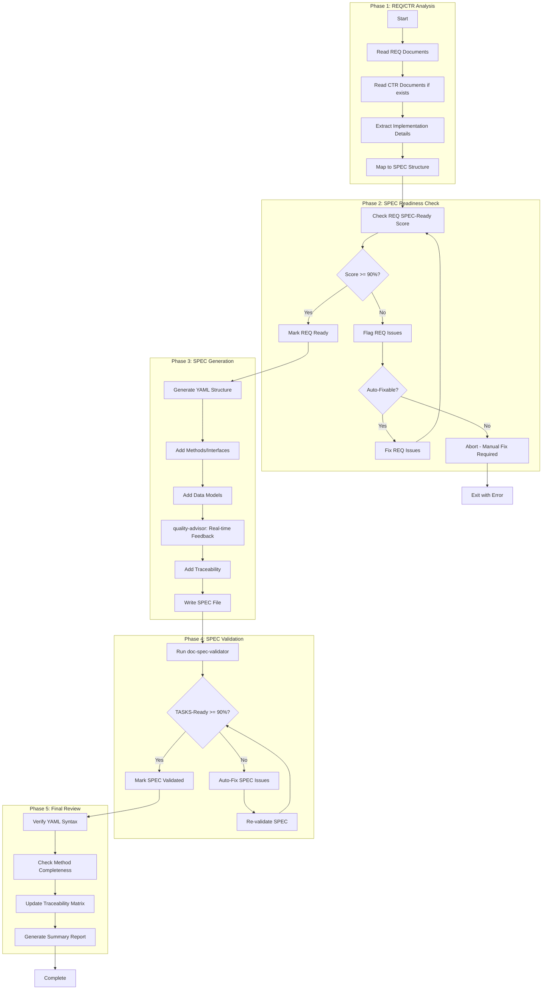
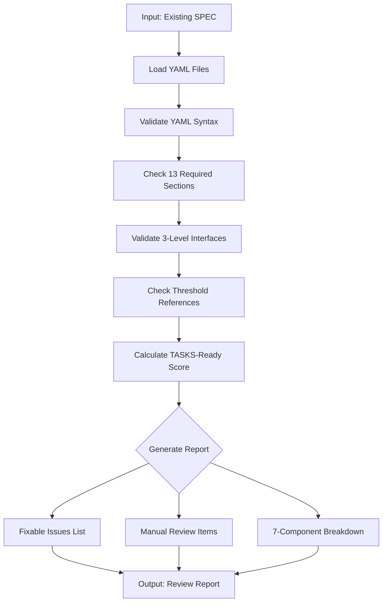

# doc-spec-autopilot

## Purpose

Automated **Technical Specifications (SPEC)** generation pipeline that processes REQ documents (and optional CTR) to generate implementation-ready YAML specifications with TASKS-Ready scoring.

**Layer**: 9

**Upstream**: REQ (Layer 7), CTR (Layer 8 - optional)

**Downstream**: TSPEC (Layer 10), TASKS (Layer 11)

---

## Skill Dependencies

| Skill | Purpose | Phase |
|-------|---------|-------|
| `doc-naming` | Element ID format (SPEC.NN.TT.SS, codes 15, 16, 17, 21, 28) | All Phases |
| `doc-req-validator` | Validate REQ SPEC-Ready score | Phase 2 |
| `doc-spec` | SPEC creation rules, YAML format | Phase 3 |
| `quality-advisor` | Real-time quality feedback | Phase 3 |
| `doc-spec-validator` | Validation with TASKS-Ready scoring | Phase 4 |

---

## Workflow Overview



---

## SPEC YAML Format (13 Required Sections)

Trading Nexus patterns require comprehensive 13-section YAML structure:

```yaml
# SPEC-NN: Specification Title
# Required sections (all 13 mandatory)

metadata:
  spec_id: SPEC-01
  title: "Component Specification"
  version: "1.0.0"
  status: "approved"
  created_date: "2026-02-09"
  last_updated: "2026-02-09"
  task_ready_score: "✅ 95% (Target: ≥90%)"
  authors: [{name: "...", email: "...", role: "..."}]
  reviewers: [{name: "...", email: "...", role: "..."}]

traceability:
  upstream_sources:
    business_requirements:
      - id: "BRD.01.01.03"
        link: "../01_BRD/BRD-01.md#BRD.01.01.03"
        relationship: "Business driver"
    product_requirements:
      - id: "PRD.01.07.02"
        link: "../02_PRD/PRD-01.md#PRD.01.07.02"
    atomic_requirements:
      - id: "REQ-01.01.01"
        # CRITICAL: Use nested REQ path format
        link: "../07_REQ/SYS-01_iam/REQ-01.01_jwt_authentication.md"
  cumulative_tags:
    brd: ["BRD.01.01.03"]
    prd: ["PRD.01.07.02"]
    ears: ["EARS.01.25.01"]
    bdd: ["BDD.01.14.01"]
    adr: ["ADR-01"]
    sys: ["SYS.01.26.01"]
    req: ["REQ.01.27.01"]
    ctr: ["CTR.01.16.01"]
    threshold: ["perf.auth.p95_latency", "sla.uptime.target"]  # 9th layer

interfaces:
  # Level 1: External APIs (REST)
  external_apis:
    - endpoint: "POST /api/v1/auth/login"
      method: "POST"
      auth: "None"
      rate_limit: "5 req/5 min per IP"
      request_schema:
        type: "object"
        required: ["email", "password"]
        properties:
          email: { type: "string", format: "email" }
          password: { type: "string", minLength: 12 }
      response_schema:
        type: "object"
        properties:
          access_token: { type: "string" }
          token_type: { type: "string", enum: ["Bearer"] }
      latency_target_ms: "@threshold:perf.auth.p95_latency"

  # Level 2: Internal APIs (Service signatures)
  internal_apis:
    - interface: "AuthService.authenticate()"
      signature: "async def authenticate(email: str, password: str) -> TokenPair"
      purpose: |
        1. Fetch user by email from Identity Platform.
        2. Verify password via Argon2id.
        3. Issue JWT token pair.

  # Level 3: Classes (OOP structure)
  classes:
    - name: "IAMService"
      description: "Facade combining auth, token, and authz services"
      constructor:
        params:
          config: { type: object, required: true }
      methods:
        - name: "initialize"
          input: { }
          output: { success: boolean }

data_models:
  - id: SPEC.01.17.01
    name: "RequestModel"
    json_schema:
      type: object
      properties:
        id: { type: string }
    pydantic_code: |
      from pydantic import BaseModel
      class RequestModel(BaseModel):
          id: str

validation_rules:
  - id: SPEC.01.21.01
    rule: "Email format validation"
    implementation: "Use EmailStr from pydantic"

error_handling:
  catalog:
    INVALID_CREDENTIALS:
      http_status: 401
      message: "Invalid email or password"
    RATE_LIMIT_EXCEEDED:
      http_status: 429
      message: "Too many attempts"

configuration:
  environment_variables:
    - name: JWT_SECRET
      required: true
      description: "JWT signing secret"
  feature_flags:
    - name: MFA_REQUIRED
      default: false

performance:
  latency_targets:
    login_p95_ms: "@threshold:perf.auth.p95_latency"
  throughput_targets:
    auth_rps: "@threshold:perf.auth.throughput"

behavior:
  login_flow:
    pseudocode: |
      def login(email, password):
          enforce_rate_limit(ip, "login")
          user = idp.get_user(email)
          if not user or not verify_password(password, user.hash):
              raise AuthenticationError("INVALID_CREDENTIALS")
          return token_service.issue_tokens(user)

behavioral_examples:
  api_example_login:
    request:
      endpoint: "/api/v1/auth/login"
      payload: { email: "user@example.com", password: "SecureP@ss!" }
    response:
      status: 200
      body: { access_token: "<jwt>", token_type: "Bearer" }

architecture:
  component_structure:
    - name: "AuthService"
      responsibility: "User authentication"
      dependencies: ["GCP Identity Platform", "Redis"]
  resilience:
    circuit_breaker_enabled: true
    retry_policy:
      max_attempts: 3
      backoff_strategy: "exponential"

operations:
  slo:
    uptime: "@threshold:sla.uptime.target"
    error_rate: "<1%"
  monitoring_metrics: ["auth_login_latency_p95_ms", "auth_errors_total"]

req_implementations:
  - req_id: "REQ-01.01"
    req_link: "../07_REQ/SYS-01_iam/REQ-01.01.md"
    implementation:
      interfaces:
        - class: "AuthService"
          method: "login"
          signature: "async def login(...) -> LoginResult"
      data_models:
        - name: "LoginRequest"
          fields: ["email", "password"]
      validation_rules:
        - rule: "Rate limit login attempts"
          implementation: "5 attempts/5 minutes per IP"
      error_handling:
        - error_code: "INVALID_CREDENTIALS"
          http_status: 401
      test_approach:
        unit_tests: ["hash verification rejects wrong password"]
        integration_tests: ["login flow returns token pair"]

threshold_references:
  registry_document: "PRD-01_thresholds"
  keys_used:
    performance:
      - key: "perf.auth.p95_latency"
        usage: "performance.latency_targets.login"
    sla:
      - key: "sla.uptime.target"
        usage: "operations.slo.uptime"
```

---

## Element Type Codes

| Code | Element Type | Example |
|------|--------------|---------|
| 15 | Step | SPEC.01.15.01 |
| 16 | Interface | SPEC.01.16.01 |
| 17 | Data Model | SPEC.01.17.01 |
| 21 | Validation Rule | SPEC.01.21.01 |
| 28 | Specification Element | SPEC.01.28.01 |

---

## Cumulative Tags (7-8 Required)

```markdown
@brd: BRD.NN.TT.SS
@prd: PRD.NN.TT.SS
@ears: EARS.NN.TT.SS
@bdd: BDD.NN.TT.SS
@adr: ADR-NN
@sys: SYS.NN.TT.SS
@req: REQ.NN.TT.SS
@ctr: CTR.NN.TT.SS  # Optional
```

---

## Configuration

### Default Configuration

```yaml
spec_autopilot:
  version: "2.0"

  scoring:
    spec_ready_min: 90
    tasks_ready_min: 90
    strict_mode: false
    # NEW: 7-component scoring weights
    scoring_weights:
      interface_completeness: 25  # All 3 levels defined
      data_models: 20             # Pydantic + JSON Schema
      validation_rules: 15        # Input/output validation
      error_handling: 15          # Error catalog with HTTP status
      test_approach: 10           # Unit + integration tests
      traceability: 10            # All 9 cumulative tags
      performance_specs: 5        # Latency targets with thresholds

  execution:
    max_parallel: 3        # HARD LIMIT - do not exceed
    chunk_size: 3          # Documents per chunk
    pause_between_chunks: true
    auto_fix: true
    continue_on_error: false
    timeout_per_req: 180  # seconds

  output:
    format: yaml
    report_format: markdown
    # NEW: File splitting strategy
    max_file_size_kb: 66
    split_strategy: auto  # auto, single, nested

  validation:
    skip_validation: false
    fix_iterations_max: 3
    # NEW: Enhanced validation
    require_all_13_sections: true
    require_three_interface_levels: true
    require_threshold_registry: true
    require_req_implementations: true
    require_nested_req_paths: true

  traceability:
    # NEW: 9-layer cumulative tags
    required_layers: 9
    include_threshold_references: true
```

### 7-Component TASKS-Ready Scoring

| Component | Weight | Criteria |
|-----------|--------|----------|
| Interface Completeness | 25% | external_apis, internal_apis, classes defined |
| Data Models | 20% | Pydantic code + JSON Schema present |
| Validation Rules | 15% | Input/output validation specified |
| Error Handling | 15% | Error catalog with HTTP status codes |
| Test Approach | 10% | Unit + integration tests in req_implementations |
| Traceability | 10% | All 9 cumulative tags populated |
| Performance Specs | 5% | Latency targets with @threshold references |

**Score Display Format**:
```
✅ 95% (Target: ≥90%)  # Passing
🟡 87% (Target: ≥90%)  # Near threshold
❌ 75% (Target: ≥90%)  # Failing
```

---

## Context Management

### Chunked Parallel Execution (MANDATORY)

**CRITICAL**: To prevent conversation context overflow errors ("Prompt is too long", "Conversation too long"), all autopilot operations MUST follow chunked execution rules:

**Chunk Size Limit**: Maximum 3 documents per chunk

**Chunking Rules**:

1. **Chunk Formation**: Group REQ-derived SPEC documents into chunks of maximum 3 at a time
2. **Sequential Chunk Processing**: Process one chunk at a time, completing all documents in a chunk before starting the next
3. **Context Pause**: After completing each chunk, provide a summary and pause for user acknowledgment
4. **Progress Tracking**: Display chunk progress (e.g., "Chunk 2/4: Processing SPEC-04, SPEC-05, SPEC-06...")

**Why Chunking is Required**:

- Prevents "Conversation too long" errors during batch processing
- Allows context compaction between chunks
- Enables recovery from failures without losing all progress
- Provides natural checkpoints for user review

**Chunk Completion Template**:

```markdown
## Chunk N/M Complete

Generated:
- SPEC-XX: TASKS-Ready Score 94%
- SPEC-YY: TASKS-Ready Score 92%
- SPEC-ZZ: TASKS-Ready Score 95%

Proceeding to next chunk...
```

---

## Execution Modes

### Single SPEC Mode

Generate SPEC from one REQ document.

```bash
python ai_dev_flow/scripts/spec_autopilot.py \
  --req docs/REQ/REQ-01_authentication.md \
  --output docs/SPEC/ \
  --id 01
```

### Batch Mode

Generate SPEC from multiple REQ documents.

```bash
python ai_dev_flow/scripts/spec_autopilot.py \
  --batch config/spec_batch.yaml \
  --output docs/SPEC/
```

### Dry Run Mode

Preview execution plan without generating files.

```bash
python ai_dev_flow/scripts/spec_autopilot.py \
  --req docs/REQ/ \
  --dry-run
```

### Review Mode (v2.1)

Validate existing SPEC documents and generate a quality report without modification.

**Purpose**: Audit existing SPEC documents for compliance, quality scores, and identify issues.

**Command**:

```bash
# Review single SPEC
python ai_dev_flow/scripts/spec_autopilot.py \
  --spec docs/SPEC/SPEC-01.yaml \
  --mode review

# Review all SPECs
python ai_dev_flow/scripts/spec_autopilot.py \
  --spec docs/SPEC/ \
  --mode review \
  --output-report tmp/spec_review_report.md
```

**Review Process**:



**Review Report Structure**:

```markdown
# SPEC Review Report: SPEC-01.yaml

## Summary
- **TASKS-Ready Score**: 87% 🟡
- **Total Issues**: 9
- **Auto-Fixable**: 6
- **Manual Review**: 3

## 7-Component Score Breakdown
| Component | Score | Status |
|-----------|-------|--------|
| Interface Completeness | 23/25 | 🟡 |
| Data Models | 18/20 | 🟡 |
| Validation Rules | 14/15 | ✅ |
| Error Handling | 13/15 | 🟡 |
| Test Approach | 9/10 | ✅ |
| Traceability | 8/10 | 🟡 |
| Performance Specs | 4/5 | 🟡 |

## Section Completeness
| Section | Present | Status |
|---------|---------|--------|
| metadata | ✅ | Complete |
| traceability | ✅ | Missing @ctr tag |
| interfaces | 🟡 | Missing internal_apis |
| data_models | ✅ | Complete |
| validation_rules | ✅ | Complete |
| error_handling | ✅ | Complete |
| configuration | ✅ | Complete |
| performance | 🟡 | Hardcoded values |
| behavior | ✅ | Complete |
| behavioral_examples | ✅ | Complete |
| architecture | ✅ | Complete |
| operations | ✅ | Complete |
| req_implementations | ❌ | Missing |

## v2.0 Compliance
| Check | Status | Details |
|-------|--------|---------|
| 13 Sections Present | ❌ | Missing req_implementations |
| Three Interface Levels | 🟡 | Missing internal_apis |
| Threshold Registry | ✅ | Present |
| Nested REQ Paths | ✅ | Correct format |
| 9-Layer Traceability | 🟡 | Missing @ctr |
| @threshold Format | ❌ | 2 hardcoded values |

## Auto-Fixable Issues
| # | Issue | Location | Fix Action |
|---|-------|----------|------------|
| 1 | Missing @ctr tag | traceability | Add placeholder @ctr reference |
| 2 | Hardcoded latency | performance.latency_targets | Replace with @threshold:perf.api.p95 |
| 3 | Missing req_implementations | root | Add template section |
| ... | ... | ... | ... |

## Manual Review Required
| # | Issue | Location | Reason |
|---|-------|----------|--------|
| 1 | Missing internal_apis | interfaces | Architecture decision needed |
| 2 | Incomplete behavior | behavior.login_flow | Domain knowledge required |
| ... | ... | ... | ... |
```

**Review Configuration**:

```yaml
review_mode:
  enabled: true
  checks:
    - yaml_syntax              # Valid YAML structure
    - section_completeness     # All 13 sections present
    - interface_levels         # 3-level interface hierarchy
    - threshold_references     # @threshold format
    - cumulative_tags          # 9-layer traceability
    - score_calculation        # TASKS-Ready score
    - file_size                # <66KB check
  output:
    format: markdown
    include_fix_suggestions: true
  thresholds:
    pass: 90
    warning: 85
    fail: 0
```

### Fix Mode (v2.1)

Auto-repair existing SPEC documents while preserving manual content.

**Purpose**: Apply automated fixes to SPEC documents to improve quality scores and compliance.

**Command**:

```bash
# Fix single SPEC
python ai_dev_flow/scripts/spec_autopilot.py \
  --spec docs/SPEC/SPEC-01.yaml \
  --mode fix

# Fix with backup
python ai_dev_flow/scripts/spec_autopilot.py \
  --spec docs/SPEC/SPEC-01.yaml \
  --mode fix \
  --backup

# Fix specific issue types only
python ai_dev_flow/scripts/spec_autopilot.py \
  --spec docs/SPEC/SPEC-01.yaml \
  --mode fix \
  --fix-types "sections,thresholds,traceability"

# Dry-run fix (preview changes)
python ai_dev_flow/scripts/spec_autopilot.py \
  --spec docs/SPEC/SPEC-01.yaml \
  --mode fix \
  --dry-run
```

**Fix Categories and Actions**:

| Category | Issue | Auto-Fix Action | Preserves Content |
|----------|-------|-----------------|-------------------|
| **Sections** | Missing req_implementations | Add template section | ✅ |
| **Sections** | Missing threshold_references | Add template section | ✅ |
| **Sections** | Missing metadata fields | Add required fields | ✅ |
| **Thresholds** | Hardcoded numeric values | Replace with @threshold:xxx | ✅ |
| **Thresholds** | Invalid @threshold format | Convert to category.field format | ✅ |
| **Traceability** | Missing cumulative tags | Add with placeholder references | ✅ |
| **Traceability** | Wrong REQ path format | Convert to nested format | ✅ |
| **Interfaces** | Missing level placeholder | Add template structure | ✅ |
| **Interfaces** | Missing method signatures | Flag for manual (content needed) | N/A |
| **YAML** | Formatting issues | Auto-format with ruamel.yaml | ✅ |
| **Score** | Missing TASKS-Ready score | Calculate and insert | ✅ |

**Content Preservation Rules**:

1. **Never delete** existing interface definitions
2. **Never modify** method signatures or logic
3. **Never change** data model schemas
4. **Only add** missing sections and metadata
5. **Only replace** hardcoded values with threshold references
6. **Backup first** if `--backup` flag is set

**Fix Report Structure**:

```markdown
# SPEC Fix Report: SPEC-01.yaml

## Summary
- **Before TASKS-Ready Score**: 87% 🟡
- **After TASKS-Ready Score**: 94% ✅
- **Issues Fixed**: 6
- **Issues Remaining**: 3 (manual review required)

## Fixes Applied
| # | Issue | Location | Fix Applied |
|---|-------|----------|-------------|
| 1 | Missing req_implementations | root | Added template section |
| 2 | Hardcoded latency | performance.latency_targets | Replaced with @threshold:perf.api.p95 |
| 3 | Missing @ctr tag | traceability | Added @ctr: CTR.01.16.01 |
| ... | ... | ... | ... |

## Files Modified
- docs/SPEC/SPEC-01.yaml

## Backup Location
- tmp/backup/SPEC-01_20260209_143022.yaml

## 7-Component Score Impact
| Component | Before | After | Delta |
|-----------|--------|-------|-------|
| Interface Completeness | 23/25 | 24/25 | +1 |
| Data Models | 18/20 | 18/20 | 0 |
| Validation Rules | 14/15 | 14/15 | 0 |
| Error Handling | 13/15 | 13/15 | 0 |
| Test Approach | 9/10 | 10/10 | +1 |
| Traceability | 8/10 | 10/10 | +2 |
| Performance Specs | 4/5 | 5/5 | +1 |

## Next Steps
1. Add internal_apis level to interfaces section
2. Complete behavior.login_flow pseudocode
3. Re-run validation to confirm score
```

**Fix Configuration**:

```yaml
fix_mode:
  enabled: true
  backup:
    enabled: true
    location: "tmp/backup/"
    retention_days: 7

  fix_categories:
    sections: true           # Missing required sections
    thresholds: true         # @threshold references
    traceability: true       # Cumulative tags
    interfaces: false        # Interface placeholders (risky)
    yaml: true               # YAML formatting

  preservation:
    interfaces: true         # Never modify existing interfaces
    data_models: true        # Never modify schemas
    behavior: true           # Never modify logic
    comments: true           # Preserve YAML comments

  validation:
    re_validate_after_fix: true
    require_score_improvement: false
    max_fix_iterations: 3
```

**Command Line Options (Review/Fix)**:

| Option | Mode | Default | Description |
|--------|------|---------|-------------|
| `--mode review` | Review | - | Run review mode only |
| `--mode fix` | Fix | - | Run fix mode |
| `--output-report` | Both | auto | Report output path |
| `--backup` | Fix | true | Create backup before fixing |
| `--fix-types` | Fix | all | Comma-separated fix categories |
| `--dry-run` | Fix | false | Preview fixes without applying |
| `--preserve-all` | Fix | false | Extra cautious preservation |

---

## Related Resources

- **SPEC Skill**: `.claude/skills/doc-spec/SKILL.md`
- **SPEC Validator**: `.claude/skills/doc-spec-validator/SKILL.md`
- **Naming Standards**: `.claude/skills/doc-naming/SKILL.md`
- **Quality Advisor**: `.claude/skills/quality-advisor/SKILL.md`
- **SPEC Template**: `ai_dev_flow/09_SPEC/SPEC-TEMPLATE.yaml`

---

## Validation Rules (v2.0)

| Check | Requirement | Error Code |
|-------|-------------|------------|
| 13 Sections | All required sections present | SPEC-E030 |
| Three Interface Levels | external_apis, internal_apis, classes | SPEC-E031 |
| Threshold Registry | threshold_references section present | SPEC-E032 |
| REQ Implementation | req_implementations section present | SPEC-E033 |
| Nested REQ Paths | `../07_REQ/SYS-XX_domain/REQ-XX.YY.md` format | SPEC-E034 |
| 7-Component Score | All components calculated | SPEC-E035 |
| File Size | <66KB or split into micro-SPECs | SPEC-E036 |
| 9-Layer Traceability | All 9 cumulative_tags populated | SPEC-E037 |
| Threshold Format | `@threshold:category.field` syntax | SPEC-E038 |

---

## File Splitting Strategy

| Condition | Strategy | Result |
|-----------|----------|--------|
| <66KB | Single file | `SPEC-NN.yaml` |
| >66KB | Split | `SPEC-NN.01.yaml`, `SPEC-NN.02.yaml` |
| >3 splits | Nested folder | `SPEC-NN_module/` with sub-files |

---

## Version History

| Version | Date | Changes |
|---------|------|---------|
| 2.1 | 2026-02-09 | Added Review Mode for validating existing SPEC documents without modification; Added Fix Mode for auto-repairing SPEC documents while preserving manual content; Added fix categories (sections, thresholds, traceability, interfaces, yaml); Added content preservation rules; Added backup functionality for fix operations; Added review/fix report generation with 7-component score impact; Added execution modes section (single, batch, dry-run, review, fix) |
| 2.0 | 2026-02-09 | Added 13-section YAML structure; Added 9-layer cumulative traceability; Added three-level interface specification (external, internal, classes); Added threshold registry pattern; Added req_implementations section for REQ-to-implementation bridges; Added 7-component TASKS-Ready scoring; Added file splitting strategy (<66KB); Added validation rules SPEC-E030 to SPEC-E038 |
| 1.0 | 2026-02-08 | Initial skill creation with 5-phase workflow; Integrated doc-naming, doc-spec, quality-advisor, doc-spec-validator |
