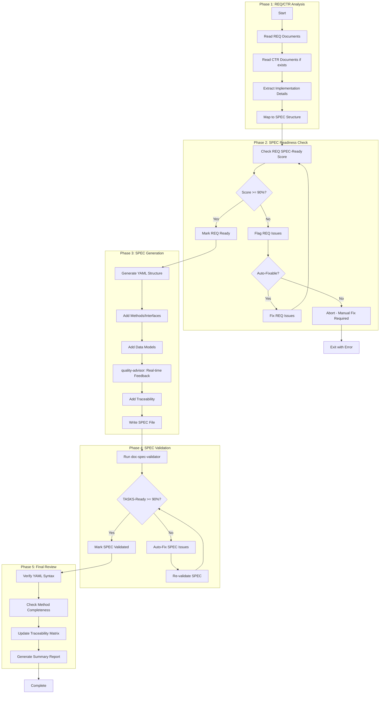

# doc-spec-autopilot

## Purpose

Automated **Technical Specifications (SPEC)** generation pipeline that processes REQ documents (and optional CTR) to generate implementation-ready YAML specifications with TASKS-Ready scoring.

**Layer**: 9

**Upstream**: REQ (Layer 7), CTR (Layer 8 - optional)

**Downstream**: TSPEC (Layer 10), TASKS (Layer 11)

---

## Skill Dependencies

| Skill | Purpose | Phase |
|-------|---------|-------|
| `doc-naming` | Element ID format (SPEC.NN.TT.SS, codes 15, 16, 17, 21, 28) | All Phases |
| `doc-req-validator` | Validate REQ SPEC-Ready score | Phase 2 |
| `doc-spec` | SPEC creation rules, YAML format | Phase 3 |
| `quality-advisor` | Real-time quality feedback | Phase 3 |
| `doc-spec-validator` | Validation with TASKS-Ready scoring | Phase 4 |

---

## Workflow Overview



---

## SPEC YAML Format

```yaml
# SPEC-NN: Specification Title
metadata:
  spec_id: SPEC-01
  title: "Component Specification"
  version: "1.0.0"
  status: "approved"
  task_ready_score: "95%"

traceability:
  brd: ["BRD.01.01.01"]
  prd: ["PRD.01.09.01"]
  ears: ["EARS.01.25.01"]
  bdd: ["BDD.01.14.01"]
  adr: ["ADR-01"]
  sys: ["SYS.01.26.01"]
  req: ["REQ.01.27.01"]
  ctr: ["CTR.01.16.01"]  # Optional

methods:
  - id: SPEC.01.28.01
    name: "processRequest"
    description: "Process incoming request"
    inputs:
      - name: request
        type: RequestModel
    outputs:
      - name: response
        type: ResponseModel
    exceptions:
      - ValidationError
      - ProcessingError

interfaces:
  - id: SPEC.01.16.01
    name: "IRequestProcessor"
    methods: ["processRequest"]

data_models:
  - id: SPEC.01.17.01
    name: "RequestModel"
    fields:
      - name: id
        type: string
        required: true
```

---

## Element Type Codes

| Code | Element Type | Example |
|------|--------------|---------|
| 15 | Step | SPEC.01.15.01 |
| 16 | Interface | SPEC.01.16.01 |
| 17 | Data Model | SPEC.01.17.01 |
| 21 | Validation Rule | SPEC.01.21.01 |
| 28 | Specification Element | SPEC.01.28.01 |

---

## Cumulative Tags (7-8 Required)

```markdown
@brd: BRD.NN.TT.SS
@prd: PRD.NN.TT.SS
@ears: EARS.NN.TT.SS
@bdd: BDD.NN.TT.SS
@adr: ADR-NN
@sys: SYS.NN.TT.SS
@req: REQ.NN.TT.SS
@ctr: CTR.NN.TT.SS  # Optional
```

---

## Related Resources

- **SPEC Skill**: `.claude/skills/doc-spec/SKILL.md`
- **SPEC Validator**: `.claude/skills/doc-spec-validator/SKILL.md`
- **Naming Standards**: `.claude/skills/doc-naming/SKILL.md`
- **Quality Advisor**: `.claude/skills/quality-advisor/SKILL.md`
- **SPEC Template**: `ai_dev_flow/09_SPEC/SPEC-TEMPLATE.yaml`

---

## Version History

| Version | Date | Changes |
|---------|------|---------|
| 1.0 | 2026-02-08 | Initial skill creation with 5-phase workflow; Integrated doc-naming, doc-spec, quality-advisor, doc-spec-validator |
