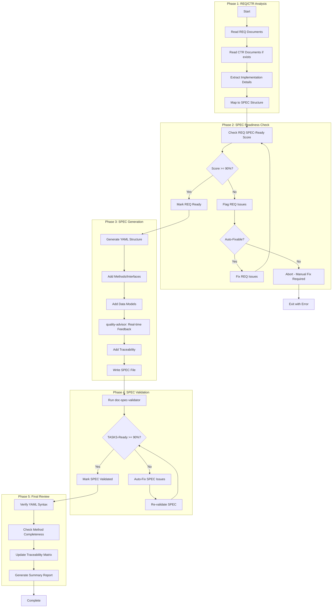

# doc-spec-autopilot

## Purpose

Automated **Technical Specifications (SPEC)** generation pipeline that processes REQ documents (and optional CTR) to generate implementation-ready YAML specifications with TASKS-Ready scoring.

**Layer**: 9

**Upstream**: REQ (Layer 7), CTR (Layer 8 - optional)

**Downstream**: TSPEC (Layer 10), TASKS (Layer 11)

---

## Skill Dependencies

| Skill | Purpose | Phase |
|-------|---------|-------|
| `doc-naming` | Element ID format (SPEC.NN.TT.SS, codes 15, 16, 17, 21, 28) | All Phases |
| `doc-req-validator` | Validate REQ SPEC-Ready score | Phase 2 |
| `doc-spec` | SPEC creation rules, YAML format | Phase 3 |
| `quality-advisor` | Real-time quality feedback | Phase 3 |
| `doc-spec-validator` | Validation with TASKS-Ready scoring | Phase 4 |

---

## Workflow Overview



---

## SPEC YAML Format (13 Required Sections)

Trading Nexus patterns require comprehensive 13-section YAML structure:

```yaml
# SPEC-NN: Specification Title
# Required sections (all 13 mandatory)

metadata:
  spec_id: SPEC-01
  title: "Component Specification"
  version: "1.0.0"
  status: "approved"
  created_date: "2026-02-09"
  last_updated: "2026-02-09"
  task_ready_score: "✅ 95% (Target: ≥90%)"
  authors: [{name: "...", email: "...", role: "..."}]
  reviewers: [{name: "...", email: "...", role: "..."}]

traceability:
  upstream_sources:
    business_requirements:
      - id: "BRD.01.01.03"
        link: "../01_BRD/BRD-01.md#BRD.01.01.03"
        relationship: "Business driver"
    product_requirements:
      - id: "PRD.01.07.02"
        link: "../02_PRD/PRD-01.md#PRD.01.07.02"
    atomic_requirements:
      - id: "REQ-01.01.01"
        # CRITICAL: Use nested REQ path format
        link: "../07_REQ/SYS-01_iam/REQ-01.01_jwt_authentication.md"
  cumulative_tags:
    brd: ["BRD.01.01.03"]
    prd: ["PRD.01.07.02"]
    ears: ["EARS.01.25.01"]
    bdd: ["BDD.01.14.01"]
    adr: ["ADR-01"]
    sys: ["SYS.01.26.01"]
    req: ["REQ.01.27.01"]
    ctr: ["CTR.01.16.01"]
    threshold: ["perf.auth.p95_latency", "sla.uptime.target"]  # 9th layer

interfaces:
  # Level 1: External APIs (REST)
  external_apis:
    - endpoint: "POST /api/v1/auth/login"
      method: "POST"
      auth: "None"
      rate_limit: "5 req/5 min per IP"
      request_schema:
        type: "object"
        required: ["email", "password"]
        properties:
          email: { type: "string", format: "email" }
          password: { type: "string", minLength: 12 }
      response_schema:
        type: "object"
        properties:
          access_token: { type: "string" }
          token_type: { type: "string", enum: ["Bearer"] }
      latency_target_ms: "@threshold:perf.auth.p95_latency"

  # Level 2: Internal APIs (Service signatures)
  internal_apis:
    - interface: "AuthService.authenticate()"
      signature: "async def authenticate(email: str, password: str) -> TokenPair"
      purpose: |
        1. Fetch user by email from Identity Platform.
        2. Verify password via Argon2id.
        3. Issue JWT token pair.

  # Level 3: Classes (OOP structure)
  classes:
    - name: "IAMService"
      description: "Facade combining auth, token, and authz services"
      constructor:
        params:
          config: { type: object, required: true }
      methods:
        - name: "initialize"
          input: { }
          output: { success: boolean }

data_models:
  - id: SPEC.01.17.01
    name: "RequestModel"
    json_schema:
      type: object
      properties:
        id: { type: string }
    pydantic_code: |
      from pydantic import BaseModel
      class RequestModel(BaseModel):
          id: str

validation_rules:
  - id: SPEC.01.21.01
    rule: "Email format validation"
    implementation: "Use EmailStr from pydantic"

error_handling:
  catalog:
    INVALID_CREDENTIALS:
      http_status: 401
      message: "Invalid email or password"
    RATE_LIMIT_EXCEEDED:
      http_status: 429
      message: "Too many attempts"

configuration:
  environment_variables:
    - name: JWT_SECRET
      required: true
      description: "JWT signing secret"
  feature_flags:
    - name: MFA_REQUIRED
      default: false

performance:
  latency_targets:
    login_p95_ms: "@threshold:perf.auth.p95_latency"
  throughput_targets:
    auth_rps: "@threshold:perf.auth.throughput"

behavior:
  login_flow:
    pseudocode: |
      def login(email, password):
          enforce_rate_limit(ip, "login")
          user = idp.get_user(email)
          if not user or not verify_password(password, user.hash):
              raise AuthenticationError("INVALID_CREDENTIALS")
          return token_service.issue_tokens(user)

behavioral_examples:
  api_example_login:
    request:
      endpoint: "/api/v1/auth/login"
      payload: { email: "user@example.com", password: "SecureP@ss!" }
    response:
      status: 200
      body: { access_token: "<jwt>", token_type: "Bearer" }

architecture:
  component_structure:
    - name: "AuthService"
      responsibility: "User authentication"
      dependencies: ["GCP Identity Platform", "Redis"]
  resilience:
    circuit_breaker_enabled: true
    retry_policy:
      max_attempts: 3
      backoff_strategy: "exponential"

operations:
  slo:
    uptime: "@threshold:sla.uptime.target"
    error_rate: "<1%"
  monitoring_metrics: ["auth_login_latency_p95_ms", "auth_errors_total"]

req_implementations:
  - req_id: "REQ-01.01"
    req_link: "../07_REQ/SYS-01_iam/REQ-01.01.md"
    implementation:
      interfaces:
        - class: "AuthService"
          method: "login"
          signature: "async def login(...) -> LoginResult"
      data_models:
        - name: "LoginRequest"
          fields: ["email", "password"]
      validation_rules:
        - rule: "Rate limit login attempts"
          implementation: "5 attempts/5 minutes per IP"
      error_handling:
        - error_code: "INVALID_CREDENTIALS"
          http_status: 401
      test_approach:
        unit_tests: ["hash verification rejects wrong password"]
        integration_tests: ["login flow returns token pair"]

threshold_references:
  registry_document: "PRD-01_thresholds"
  keys_used:
    performance:
      - key: "perf.auth.p95_latency"
        usage: "performance.latency_targets.login"
    sla:
      - key: "sla.uptime.target"
        usage: "operations.slo.uptime"
```

---

## Element Type Codes

| Code | Element Type | Example |
|------|--------------|---------|
| 15 | Step | SPEC.01.15.01 |
| 16 | Interface | SPEC.01.16.01 |
| 17 | Data Model | SPEC.01.17.01 |
| 21 | Validation Rule | SPEC.01.21.01 |
| 28 | Specification Element | SPEC.01.28.01 |

---

## Cumulative Tags (7-8 Required)

```markdown
@brd: BRD.NN.TT.SS
@prd: PRD.NN.TT.SS
@ears: EARS.NN.TT.SS
@bdd: BDD.NN.TT.SS
@adr: ADR-NN
@sys: SYS.NN.TT.SS
@req: REQ.NN.TT.SS
@ctr: CTR.NN.TT.SS  # Optional
```

---

## Configuration

### Default Configuration

```yaml
spec_autopilot:
  version: "2.0"

  scoring:
    spec_ready_min: 90
    tasks_ready_min: 90
    strict_mode: false
    # NEW: 7-component scoring weights
    scoring_weights:
      interface_completeness: 25  # All 3 levels defined
      data_models: 20             # Pydantic + JSON Schema
      validation_rules: 15        # Input/output validation
      error_handling: 15          # Error catalog with HTTP status
      test_approach: 10           # Unit + integration tests
      traceability: 10            # All 9 cumulative tags
      performance_specs: 5        # Latency targets with thresholds

  execution:
    max_parallel: 3        # HARD LIMIT - do not exceed
    chunk_size: 3          # Documents per chunk
    pause_between_chunks: true
    auto_fix: true
    continue_on_error: false
    timeout_per_req: 180  # seconds

  output:
    format: yaml
    report_format: markdown
    # NEW: File splitting strategy
    max_file_size_kb: 66
    split_strategy: auto  # auto, single, nested

  validation:
    skip_validation: false
    fix_iterations_max: 3
    # NEW: Enhanced validation
    require_all_13_sections: true
    require_three_interface_levels: true
    require_threshold_registry: true
    require_req_implementations: true
    require_nested_req_paths: true

  traceability:
    # NEW: 9-layer cumulative tags
    required_layers: 9
    include_threshold_references: true
```

### 7-Component TASKS-Ready Scoring

| Component | Weight | Criteria |
|-----------|--------|----------|
| Interface Completeness | 25% | external_apis, internal_apis, classes defined |
| Data Models | 20% | Pydantic code + JSON Schema present |
| Validation Rules | 15% | Input/output validation specified |
| Error Handling | 15% | Error catalog with HTTP status codes |
| Test Approach | 10% | Unit + integration tests in req_implementations |
| Traceability | 10% | All 9 cumulative tags populated |
| Performance Specs | 5% | Latency targets with @threshold references |

**Score Display Format**:
```
✅ 95% (Target: ≥90%)  # Passing
🟡 87% (Target: ≥90%)  # Near threshold
❌ 75% (Target: ≥90%)  # Failing
```

---

## Context Management

### Chunked Parallel Execution (MANDATORY)

**CRITICAL**: To prevent conversation context overflow errors ("Prompt is too long", "Conversation too long"), all autopilot operations MUST follow chunked execution rules:

**Chunk Size Limit**: Maximum 3 documents per chunk

**Chunking Rules**:

1. **Chunk Formation**: Group REQ-derived SPEC documents into chunks of maximum 3 at a time
2. **Sequential Chunk Processing**: Process one chunk at a time, completing all documents in a chunk before starting the next
3. **Context Pause**: After completing each chunk, provide a summary and pause for user acknowledgment
4. **Progress Tracking**: Display chunk progress (e.g., "Chunk 2/4: Processing SPEC-04, SPEC-05, SPEC-06...")

**Why Chunking is Required**:

- Prevents "Conversation too long" errors during batch processing
- Allows context compaction between chunks
- Enables recovery from failures without losing all progress
- Provides natural checkpoints for user review

**Chunk Completion Template**:

```markdown
## Chunk N/M Complete

Generated:
- SPEC-XX: TASKS-Ready Score 94%
- SPEC-YY: TASKS-Ready Score 92%
- SPEC-ZZ: TASKS-Ready Score 95%

Proceeding to next chunk...
```

---

## Related Resources

- **SPEC Skill**: `.claude/skills/doc-spec/SKILL.md`
- **SPEC Validator**: `.claude/skills/doc-spec-validator/SKILL.md`
- **Naming Standards**: `.claude/skills/doc-naming/SKILL.md`
- **Quality Advisor**: `.claude/skills/quality-advisor/SKILL.md`
- **SPEC Template**: `ai_dev_flow/09_SPEC/SPEC-TEMPLATE.yaml`

---

## Validation Rules (v2.0)

| Check | Requirement | Error Code |
|-------|-------------|------------|
| 13 Sections | All required sections present | SPEC-E030 |
| Three Interface Levels | external_apis, internal_apis, classes | SPEC-E031 |
| Threshold Registry | threshold_references section present | SPEC-E032 |
| REQ Implementation | req_implementations section present | SPEC-E033 |
| Nested REQ Paths | `../07_REQ/SYS-XX_domain/REQ-XX.YY.md` format | SPEC-E034 |
| 7-Component Score | All components calculated | SPEC-E035 |
| File Size | <66KB or split into micro-SPECs | SPEC-E036 |
| 9-Layer Traceability | All 9 cumulative_tags populated | SPEC-E037 |
| Threshold Format | `@threshold:category.field` syntax | SPEC-E038 |

---

## File Splitting Strategy

| Condition | Strategy | Result |
|-----------|----------|--------|
| <66KB | Single file | `SPEC-NN.yaml` |
| >66KB | Split | `SPEC-NN.01.yaml`, `SPEC-NN.02.yaml` |
| >3 splits | Nested folder | `SPEC-NN_module/` with sub-files |

---

## Version History

| Version | Date | Changes |
|---------|------|---------|
| 2.0 | 2026-02-09 | Added 13-section YAML structure; Added 9-layer cumulative traceability; Added three-level interface specification (external, internal, classes); Added threshold registry pattern; Added req_implementations section for REQ-to-implementation bridges; Added 7-component TASKS-Ready scoring; Added file splitting strategy (<66KB); Added validation rules SPEC-E030 to SPEC-E038 |
| 1.0 | 2026-02-08 | Initial skill creation with 5-phase workflow; Integrated doc-naming, doc-spec, quality-advisor, doc-spec-validator |
