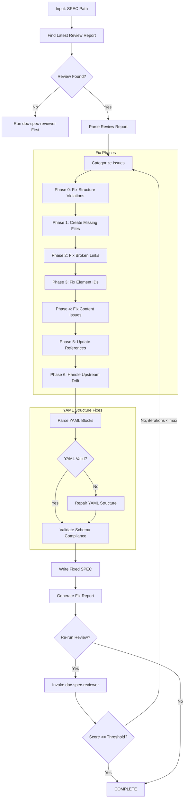
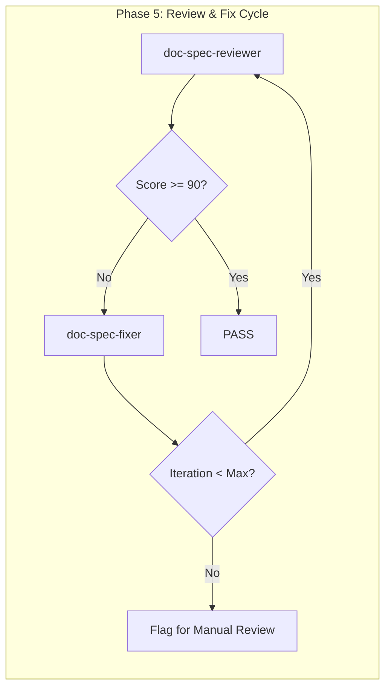

# doc-spec-fixer

## Purpose

Automated **fix skill** that reads the latest review report and applies fixes to SPEC (Specification) documents. This skill bridges the gap between `doc-spec-reviewer` (which identifies issues) and the corrected SPEC, enabling iterative improvement cycles.

**Layer**: 9 (SPEC Quality Improvement)

**Upstream**: REQ documents, CTR documents, SPEC document, Review Report (`SPEC-NN.R_review_report_vNNN.md`)

**Downstream**: Fixed SPEC, Fix Report (`SPEC-NN.F_fix_report_vNNN.md`)

---

## When to Use This Skill

Use `doc-spec-fixer` when:

- **After Review**: Run after `doc-spec-reviewer` identifies issues
- **Iterative Improvement**: Part of Review -> Fix -> Review cycle
- **Automated Pipeline**: CI/CD integration for quality gates
- **Batch Fixes**: Apply fixes to multiple SPECs based on review reports
- **YAML Structure Issues**: SPEC contains malformed YAML blocks

**Do NOT use when**:
- No review report exists (run `doc-spec-reviewer` first)
- Creating new SPEC (use `doc-spec` or `doc-spec-autopilot`)
- Only need validation (use `doc-spec-validator`)

---

## Skill Dependencies

| Skill | Purpose | When Used |
|-------|---------|-----------|
| `doc-spec-reviewer` | Source of issues to fix | Input (reads review report) |
| `doc-naming` | Element ID standards | Fix element IDs |
| `doc-spec` | SPEC creation rules | Create missing sections |
| `doc-req` | REQ traceability | Validate upstream links |
| `doc-ctr` | CTR traceability | Validate contract links |

---

## Workflow Overview



---

## Fix Phases

### Phase 0: Fix Structure Violations (CRITICAL)

Fixes SPEC documents that are not in nested folders. This phase runs FIRST because all subsequent phases depend on correct folder structure.

**Nested Folder Rule**: ALL SPEC documents MUST be in nested folders regardless of document size.

**Required Structure**:
| SPEC Type | Required Location |
|-----------|-------------------|
| YAML | `docs/09_SPEC/SPEC-NN_{slug}/SPEC-NN_{slug}.yaml` |

**Fix Actions**:

| Issue Code | Issue | Fix Action |
|------------|-------|------------|
| REV-STR001 | SPEC not in nested folder | Create folder, move file, update all links |
| REV-STR002 | SPEC folder name doesn't match SPEC ID | Rename folder to match |
| REV-STR003 | SPEC >25KB should be sectioned | Flag for manual review |

**Structure Fix Workflow**:

```python
def fix_spec_structure(spec_path: str) -> list[Fix]:
    """Fix SPEC structure violations."""
    fixes = []

    filename = os.path.basename(spec_path)
    parent_folder = os.path.dirname(spec_path)

    # Extract SPEC ID and slug from filename
    match = re.match(r'SPEC-(\d+)_([^/]+)\.yaml', filename)
    if not match:
        return []  # Cannot auto-fix invalid filename

    spec_id = match.group(1)
    slug = match.group(2)
    expected_folder = f"SPEC-{spec_id}_{slug}"

    # Check if already in nested folder
    if os.path.basename(parent_folder) != expected_folder:
        # Create nested folder
        new_folder = os.path.join(os.path.dirname(parent_folder), expected_folder)
        os.makedirs(new_folder, exist_ok=True)

        # Move file
        new_path = os.path.join(new_folder, filename)
        shutil.move(spec_path, new_path)
        fixes.append(f"Moved {spec_path} to {new_path}")

        # Update upstream references in YAML file
        content = Path(new_path).read_text()
        updated_content = content.replace('../08_CTR/', '../../08_CTR/')
        updated_content = updated_content.replace('../07_REQ/', '../../07_REQ/')
        Path(new_path).write_text(updated_content)
        fixes.append(f"Updated relative links for nested folder structure")

    return fixes
```

**Link Path Updates After Move**:

| Original Path | Updated Path |
|---------------|--------------|
| `../08_CTR/CTR-01_slug/CTR-01.yaml` | `../../08_CTR/CTR-01_slug/CTR-01.yaml` |
| `../07_REQ/REQ-01_slug/REQ-01.md` | `../../07_REQ/REQ-01_slug/REQ-01.md` |

---

### Phase 1: Create Missing Files

Creates files that are referenced but don't exist.

**Scope**:

| Missing File | Action | Template Used |
|--------------|--------|---------------|
| `SPEC-NN_schemas.yaml` | Create schema definitions file | Schema template |
| `SPEC-NN_config.yaml` | Create configuration spec | Config template |
| Reference docs | Create placeholder | REF template |

**SPEC Schema Template**:

```yaml
# SPEC-NN: Schema Definitions
# Auto-generated by doc-spec-fixer - requires completion

schemas:
  version: "1.0.0"
  spec_id: SPEC-NN
  created: "YYYY-MM-DD"
  status: draft

definitions:
  # TODO: Add schema definitions
  ExampleSchema:
    type: object
    properties:
      id:
        type: string
        description: "Unique identifier"
    required:
      - id

validation_rules:
  # TODO: Define validation rules
  - rule_id: VR-001
    description: "Placeholder validation rule"
    severity: error
```

**SPEC Configuration Template**:

```yaml
# SPEC-NN: Configuration Specification
# Auto-generated by doc-spec-fixer - requires completion

configuration:
  spec_id: SPEC-NN
  version: "1.0.0"
  created: "YYYY-MM-DD"

environments:
  development:
    # TODO: Add development settings
    log_level: debug

  staging:
    # TODO: Add staging settings
    log_level: info

  production:
    # TODO: Add production settings
    log_level: warn

feature_flags:
  # TODO: Define feature flags
  - name: placeholder_flag
    description: "Placeholder feature flag"
    default: false
```

---

### Phase 2: Fix Broken Links

Updates links to point to correct locations.

**Fix Actions**:

| Issue Code | Issue | Fix Action |
|------------|-------|------------|
| REV-L001 | Broken internal link | Update path or create target file |
| REV-L002 | External link unreachable | Add warning comment, keep link |
| REV-L003 | Absolute path used | Convert to relative path |
| REV-L006 | YAML include broken | Update YAML !include path |
| REV-L007 | Schema $ref invalid | Fix JSON Schema $ref path |

**Path Resolution Logic**:

```python
def fix_link_path(spec_location: str, target_path: str) -> str:
    """Calculate correct relative path based on SPEC location."""

    # SPEC files: docs/09_SPEC/SPEC-01.md
    # Schema files: docs/09_SPEC/schemas/
    # Config files: docs/09_SPEC/config/

    if is_yaml_include(target_path):
        return fix_yaml_include(spec_location, target_path)
    elif is_schema_reference(target_path):
        return fix_schema_ref(spec_location, target_path)
    else:
        return calculate_relative_path(spec_location, target_path)
```

**YAML Include Fix**:

| Reference Type | Original | Fixed |
|----------------|----------|-------|
| Schema include | `!include schema.yaml` | `!include ./schemas/schema.yaml` |
| Config include | `!include config.yaml` | `!include ./config/config.yaml` |
| Relative include | `!include ../other.yaml` | Validate path exists |

---

### Phase 3: Fix Element IDs

Converts invalid element IDs to correct format.

**SPEC Element ID Format**:

SPEC documents are primarily YAML-based and use a different ID structure. Element IDs in SPEC follow the pattern: `SPEC-NN.field.path` for YAML elements.

**Conversion Rules**:

| Pattern | Issue | Conversion |
|---------|-------|------------|
| `SPEC.NN.XX.SS` | Legacy numeric format | Convert to YAML path format |
| `SPEC-NN-XXX` | Invalid slug format | `SPEC-NN.section.element` |
| Missing IDs | No element identifier | Generate based on YAML path |

**YAML Path ID Generation**:

```python
def generate_yaml_element_id(spec_id: str, yaml_path: list) -> str:
    """Generate element ID from YAML path.

    Example:
        spec_id: "SPEC-01"
        yaml_path: ["schemas", "definitions", "UserSchema"]
        returns: "SPEC-01.schemas.definitions.UserSchema"
    """
    return f"{spec_id}.{'.'.join(yaml_path)}"
```

**ID Normalization**:

| Invalid ID | Normalized ID |
|------------|---------------|
| `SPEC-01 Schema 1` | `SPEC-01.schemas.schema_1` |
| `SPEC-01/config/db` | `SPEC-01.config.db` |
| `spec_01_auth` | `SPEC-01.auth` |

---

### Phase 4: Fix Content Issues

Addresses placeholders and incomplete content.

**Fix Actions**:

| Issue Code | Issue | Fix Action |
|------------|-------|------------|
| REV-P001 | `[TODO]` placeholder | Flag for manual completion (cannot auto-fix) |
| REV-P002 | `[TBD]` placeholder | Flag for manual completion (cannot auto-fix) |
| REV-P003 | Template date `YYYY-MM-DD` | Replace with current date |
| REV-P004 | Template name `[Name]` | Replace with metadata author or flag |
| REV-P005 | Empty section | Add minimum template content |
| REV-Y001 | Invalid YAML syntax | Attempt YAML repair |
| REV-Y002 | Missing required YAML field | Add field with placeholder |
| REV-Y003 | Invalid YAML type | Convert to correct type |
| REV-Y004 | Duplicate YAML keys | Remove duplicates |

**Auto-Replacements**:

```python
replacements = {
    'YYYY-MM-DDTHH:MM:SS': datetime.now().strftime('%Y-%m-%dT%H:%M:%S'),
    'YYYY-MM-DD': datetime.now().strftime('%Y-%m-%d'),
    'MM/DD/YYYY': datetime.now().strftime('%m/%d/%Y'),
    '[Current date]': datetime.now().strftime('%Y-%m-%dT%H:%M:%S'),
    '"1.0.0"': f'"{calculate_version()}"',
}
```

**YAML Structure Repair**:

| YAML Issue | Repair Action |
|------------|---------------|
| Missing quotes | Add quotes around string values |
| Invalid indentation | Fix to 2-space indent |
| Duplicate keys | Keep first, log warning |
| Missing colons | Add colons after keys |
| Invalid boolean | Convert to true/false |
| Invalid null | Convert to null or ~ |
| Trailing spaces | Remove trailing whitespace |
| Missing list dash | Add - for list items |

---

### Phase 5: Update References

Ensures traceability and cross-references are correct.

**Fix Actions**:

| Issue | Fix Action |
|-------|------------|
| Missing `@req:` reference | Add REQ traceability tag |
| Missing `@ctr:` reference | Add CTR traceability tag |
| Incorrect upstream path | Update to correct relative path |
| Missing traceability entry | Add to traceability matrix |

**REQ/CTR Traceability Fix**:

```markdown
<!-- Before -->
## 3. Schema Definitions

<!-- After -->
## 3. Schema Definitions

@req: [REQ-01.28.01](../07_REQ/REQ-01.md#req-01-28-01)
@ctr: [CTR-01-API](../08_CTR/CTR-01-API.md)
```

---

### Phase 6: Handle Upstream Drift (Auto-Merge)

Addresses issues where upstream REQ/CTR documents have changed since SPEC creation using a tiered auto-merge system.

**SPEC ID Pattern**: `SPEC-NN-COMPONENT-SS`

- `NN`: Sequential spec number (01-99)
- `COMPONENT`: Component identifier (e.g., AUTH, API, DATA)
- `SS`: Sub-spec number within component (01-99)

Example: `SPEC-01-AUTH-13`, `SPEC-02-API-05`, `SPEC-03-DATA-21`

**Drift Issue Codes** (from `doc-spec-reviewer`):

| Code | Severity | Description | Change % | Auto-Fix Possible |
|------|----------|-------------|----------|-------------------|
| REV-D001 | Info | Minor upstream modification | < 5% | Yes (Tier 1) |
| REV-D002 | Warning | Moderate upstream modification | 5-15% | Yes (Tier 2) |
| REV-D003 | Info | Upstream document version incremented | N/A | Yes (update @ref version) |
| REV-D004 | Warning | New requirements added to upstream | 5-15% | Yes (Tier 2) |
| REV-D005 | Error | Critical upstream modification | > 15% | Yes (Tier 3) |

#### Tiered Auto-Merge System

**Tier 1: Minor Changes (< 5% drift)**

| Aspect | Behavior |
|--------|----------|
| Trigger | Change percentage < 5% |
| Action | Auto-merge spec updates |
| Version | Increment PATCH (1.0.0 -> 1.0.1) |
| Logging | Brief changelog entry |
| Review | No manual review required |

**Tier 2: Moderate Changes (5-15% drift)**

| Aspect | Behavior |
|--------|----------|
| Trigger | Change percentage 5-15% |
| Action | Auto-merge with detailed changelog |
| Version | Increment MINOR (1.0.0 -> 1.1.0) |
| Logging | Detailed changelog with diff summary |
| Review | Optional review recommended |

**Tier 3: Major Changes (> 15% drift)**

| Aspect | Behavior |
|--------|----------|
| Trigger | Change percentage > 15% |
| Action | Archive current version, trigger regeneration |
| Version | Increment MAJOR (1.0.0 -> 2.0.0) |
| Logging | Full archive manifest creation |
| Review | Manual review required post-regeneration |

#### Change Percentage Calculation

```python
def calculate_drift_percentage(
    upstream_doc: str,
    spec_references: list,
    upstream_modified: datetime,
    spec_created: datetime
) -> float:
    """Calculate drift percentage between upstream and SPEC.

    Factors:
    - Line diff percentage in referenced sections
    - Number of new/removed requirements
    - Structural changes (new sections, moved content)
    - Time since last sync (decay factor)

    Returns:
        float: Drift percentage (0.0 - 100.0)
    """
    line_changes = count_line_changes(upstream_doc, spec_references)
    total_lines = count_referenced_lines(upstream_doc, spec_references)

    if total_lines == 0:
        return 0.0

    base_percentage = (line_changes / total_lines) * 100

    # Apply time decay factor (older drift = more significant)
    days_stale = (datetime.now() - spec_created).days
    decay_factor = min(1.0 + (days_stale / 30) * 0.1, 1.5)

    return min(base_percentage * decay_factor, 100.0)
```

#### Auto-Generated SPEC IDs

```python
def generate_spec_id(
    spec_number: int,
    component: str,
    sub_spec: int
) -> str:
    """Generate SPEC ID following SPEC-NN-COMPONENT-SS pattern.

    Args:
        spec_number: Main spec number (1-99)
        component: Component identifier (e.g., AUTH, API, DATA)
        sub_spec: Sub-spec number (1-99)

    Returns:
        str: Formatted SPEC ID

    Example:
        generate_spec_id(1, "AUTH", 13) -> "SPEC-01-AUTH-13"
    """
    return f"SPEC-{spec_number:02d}-{component.upper()}-{sub_spec:02d}"
```

#### No-Deletion Policy

**CRITICAL**: SPECs are NEVER deleted. Mark as deprecated instead.

```markdown
<!-- DEPRECATED: 2026-02-10 - Superseded by SPEC-01-AUTH-14 -->
<!-- Reason: Major upstream drift (>15%) triggered regeneration -->
<!-- Archive: archive/SPEC-01-AUTH-13_v1.2.0_20260210.md -->
---
title: "[DEPRECATED] SPEC-01-AUTH-13: Authentication Flow"
status: deprecated
superseded_by: SPEC-01-AUTH-14
---
```

**Deprecation Rules**:

| Rule | Description |
|------|-------------|
| Never delete | SPECs are marked [DEPRECATED], not removed |
| Preserve history | Original content remains for audit trail |
| Add superseded_by | Link to replacement SPEC if applicable |
| Archive location | `archive/` folder with version and date |

#### Archive Manifest (Tier 3)

When Tier 3 triggers regeneration, create an archive manifest:

```yaml
# archive/SPEC-01-AUTH-13_archive_manifest.yaml
archive_manifest:
  spec_id: SPEC-01-AUTH-13
  archived_version: "1.2.0"
  archive_date: "2026-02-10T16:00:00"
  archive_reason: "Major upstream drift (>15%)"

  drift_details:
    upstream_documents:
      - doc: REQ-01.md
        drift_percentage: 23.5
        lines_changed: 47
        sections_affected: [3, 5, 7]
      - doc: CTR-01-API.yaml
        drift_percentage: 18.2
        endpoints_changed: 5
        schemas_modified: 3

    total_drift: 20.85
    trigger_tier: 3

  archived_files:
    - source: docs/09_SPEC/SPEC-01-AUTH-13.md
      archive: archive/SPEC-01-AUTH-13_v1.2.0_20260210.md
    - source: docs/09_SPEC/schemas/SPEC-01-AUTH-13_schemas.yaml
      archive: archive/SPEC-01-AUTH-13_schemas_v1.2.0_20260210.yaml

  regeneration:
    triggered: true
    new_spec_id: SPEC-01-AUTH-14
    new_version: "2.0.0"

  downstream_impact:
    tspec_documents:
      - TSPEC-01-AUTH-13 (requires update)
    tasks_documents:
      - TASKS-01-AUTH-13 (requires review)
```

#### Enhanced Drift Cache

The `.drift_cache.json` file tracks drift state and merge history:

```json
{
  "cache_version": "2.0",
  "last_updated": "2026-02-10T16:00:00",
  "specs": {
    "SPEC-01-AUTH-13": {
      "current_version": "1.2.0",
      "created": "2026-02-05T10:00:00",
      "last_sync": "2026-02-08T14:30:00",
      "upstream_refs": {
        "REQ-01.md": {
          "last_known_hash": "a1b2c3d4",
          "last_modified": "2026-02-08T09:00:00",
          "sections_tracked": ["3.1", "3.2", "5.4"]
        },
        "CTR-01-API.yaml": {
          "last_known_hash": "e5f6g7h8",
          "last_modified": "2026-02-07T16:00:00",
          "endpoints_tracked": ["/auth/login", "/auth/refresh"]
        }
      },
      "merge_history": [
        {
          "date": "2026-02-06T11:00:00",
          "tier": 1,
          "drift_percentage": 3.2,
          "version_before": "1.0.0",
          "version_after": "1.0.1",
          "changes_merged": ["REQ-01.md: Updated validation rules"]
        },
        {
          "date": "2026-02-08T14:30:00",
          "tier": 2,
          "drift_percentage": 8.5,
          "version_before": "1.0.1",
          "version_after": "1.1.0",
          "changes_merged": [
            "REQ-01.md: Added new requirement REQ-01.28.05",
            "CTR-01-API.yaml: Modified /auth/refresh response"
          ],
          "changelog_file": "changelogs/SPEC-01-AUTH-13_v1.1.0_changelog.md"
        }
      ],
      "downstream_documents": {
        "tspec": ["TSPEC-01-AUTH-13"],
        "tasks": ["TASKS-01-AUTH-13"]
      }
    }
  }
}
```

#### YAML Spec Format Handling

SPEC documents use embedded YAML blocks. Drift handling preserves YAML structure:

```yaml
# Merged YAML section with drift metadata
schemas:
  _drift_metadata:
    last_merge: "2026-02-08T14:30:00"
    merge_tier: 2
    upstream_version: "REQ-01.md@v1.3.0"

  AuthRequest:
    type: object
    properties:
      username:
        type: string
        # @merged: 2026-02-08 from REQ-01.28.01
        minLength: 3
        maxLength: 64
      password:
        type: string
        format: password
        # @merged: 2026-02-08 from REQ-01.28.02 (new validation)
        minLength: 12
```

#### Fix Actions by Tier

| Tier | Version Change | Auto-Fix Actions |
|------|----------------|------------------|
| 1 | PATCH | Update referenced content, update @ref tags, brief changelog |
| 2 | MINOR | All Tier 1 actions + detailed changelog, diff summary, notification |
| 3 | MAJOR | Archive current, create manifest, mark deprecated, trigger regeneration |

**Drift Marker Format** (Updated for v2.0):

```markdown
<!-- DRIFT-MERGED: Tier 1 | REQ-01.md | 3.2% | 2026-02-08 | v1.0.0 -> v1.0.1 -->
@req: [REQ-01.28.01](../07_REQ/REQ-01.md#req-01-28-01) @version:1.3.0

<!-- DRIFT-MERGED: Tier 2 | CTR-01-API.yaml | 8.5% | 2026-02-08 | v1.0.1 -> v1.1.0 -->
<!-- See: changelogs/SPEC-01-AUTH-13_v1.1.0_changelog.md -->
@ctr: [CTR-01-API](../08_CTR/CTR-01-API.md) @version:2.1.0

<!-- DRIFT-ARCHIVED: Tier 3 | 20.85% | 2026-02-10 | Regeneration triggered -->
<!-- Archive: archive/SPEC-01-AUTH-13_v1.2.0_20260210.md -->
<!-- New SPEC: SPEC-01-AUTH-14 -->
```

---

## YAML Structure Fixes

SPEC documents heavily rely on embedded YAML. This section details specific YAML repair strategies.

### YAML Block Detection

```python
def find_yaml_blocks(content: str) -> list:
    """Find all YAML code blocks in markdown content."""
    pattern = r'```ya?ml\n(.*?)```'
    return re.findall(pattern, content, re.DOTALL)
```

### Schema Validation

| Schema Type | Validation Rules |
|-------------|------------------|
| Data Schema | Must have `type`, `properties` |
| Config Schema | Must have environment sections |
| API Schema | Must have `paths` or `endpoints` |

### Common YAML Fixes

| Issue | Before | After |
|-------|--------|-------|
| Unquoted special chars | `value: @special` | `value: "@special"` |
| Multiline without literal | `desc: line1\nline2` | `desc: \|\n  line1\n  line2` |
| Invalid anchor | `&anchor name` | `&anchor_name` |
| Missing document start | `key: value` | `---\nkey: value` |

---

## Command Usage

### Basic Usage

```bash
# Fix SPEC based on latest review
/doc-spec-fixer SPEC-01

# Fix with explicit review report
/doc-spec-fixer SPEC-01 --review-report SPEC-01.R_review_report_v001.md

# Fix and re-run review
/doc-spec-fixer SPEC-01 --revalidate

# Fix with iteration limit
/doc-spec-fixer SPEC-01 --revalidate --max-iterations 3

# Fix YAML only
/doc-spec-fixer SPEC-01 --fix-types yaml
```

### Options

| Option | Default | Description |
|--------|---------|-------------|
| `--review-report` | latest | Specific review report to use |
| `--revalidate` | false | Run reviewer after fixes |
| `--max-iterations` | 3 | Max fix-review cycles |
| `--fix-types` | all | Specific fix types (comma-separated) |
| `--create-missing` | true | Create missing reference files |
| `--backup` | true | Backup SPEC before fixing |
| `--dry-run` | false | Preview fixes without applying |
| `--validate-yaml` | true | Validate YAML after fixes |
| `--acknowledge-drift` | false | Interactive drift acknowledgment mode |
| `--update-drift-cache` | true | Update .drift_cache.json after fixes |

### Fix Types

| Type | Description |
|------|-------------|
| `missing_files` | Create missing schema, config docs |
| `broken_links` | Fix link paths and YAML includes |
| `element_ids` | Convert invalid element IDs to YAML paths |
| `content` | Fix placeholders, dates, names |
| `references` | Update REQ/CTR traceability and cross-references |
| `drift` | Handle upstream drift detection issues |
| `yaml` | Fix YAML structure and syntax issues |
| `all` | All fix types (default) |

---

## Output Artifacts

### Fix Report

**Nested Folder Rule**: ALL SPEC use nested folders (`SPEC-NN_{slug}/`) regardless of size. Fix reports are stored alongside the SPEC YAML file(s) in the nested folder.

**File Naming**: `SPEC-NN.F_fix_report_vNNN.md`

**Location**: Inside the SPEC nested folder: `docs/09_SPEC/SPEC-NN_{slug}/`

**Structure**:

```markdown
---
title: "SPEC-NN.F: Fix Report v001"
tags:
  - spec
  - fix-report
  - quality-assurance
custom_fields:
  document_type: fix-report
  artifact_type: SPEC-FIX
  layer: 9
  parent_doc: SPEC-NN
  source_review: SPEC-NN.R_review_report_v001.md
  fix_date: "YYYY-MM-DDTHH:MM:SS"
  fix_tool: doc-spec-fixer
  fix_version: "1.0"
---

# SPEC-NN Fix Report v001

## Summary

| Metric | Value |
|--------|-------|
| Source Review | SPEC-NN.R_review_report_v001.md |
| Issues in Review | 18 |
| Issues Fixed | 15 |
| Issues Remaining | 3 (manual review required) |
| Files Created | 2 |
| Files Modified | 1 |
| YAML Blocks Repaired | 4 |

## Files Created

| File | Type | Location |
|------|------|----------|
| SPEC-01_schemas.yaml | Schema Definitions | docs/09_SPEC/schemas/ |
| SPEC-01_config.yaml | Configuration Spec | docs/09_SPEC/config/ |

## YAML Repairs

| Block Location | Issue | Repair Applied |
|----------------|-------|----------------|
| Line 45-62 | Invalid indentation | Fixed to 2-space |
| Line 98-105 | Missing quotes | Added quotes to values |
| Line 142-150 | Duplicate key | Removed duplicate |
| Line 201-215 | Invalid boolean | Converted to true/false |

## Fixes Applied

| # | Issue Code | Issue | Fix Applied | File |
|---|------------|-------|-------------|------|
| 1 | REV-L006 | Broken YAML include | Updated include path | SPEC-01.md |
| 2 | REV-Y001 | Invalid YAML syntax | Repaired 4 blocks | SPEC-01.md |
| 3 | REV-L003 | Absolute path used | Converted to relative | SPEC-01.md |

## Issues Requiring Manual Review

| # | Issue Code | Issue | Location | Reason |
|---|------------|-------|----------|--------|
| 1 | REV-P001 | [TODO] placeholder | SPEC-01.md:L78 | Domain knowledge needed |
| 2 | REV-D002 | REQ content changed | REQ-01.28.01 | Review requirement update |

## Upstream Drift Summary

| Upstream Document | Reference | Modified | SPEC Updated | Days Stale | Action Required |
|-------------------|-----------|----------|--------------|------------|-----------------|
| REQ-01.md | SPEC-01:L57 | 2026-02-08 | 2026-02-05 | 3 | Review for changes |
| CTR-01-API.yaml | SPEC-01:L92 | 2026-02-09 | 2026-02-05 | 4 | Review for changes |

## Validation After Fix

| Metric | Before | After | Delta |
|--------|--------|-------|-------|
| Review Score | 85 | 95 | +10 |
| Errors | 5 | 0 | -5 |
| Warnings | 6 | 2 | -4 |
| YAML Valid | No | Yes | Fixed |

## Next Steps

1. Complete [TODO] placeholders in SPEC-01.md
2. Review upstream REQ/CTR drift
3. Populate schema definitions in SPEC-01_schemas.yaml
4. Run `/doc-spec-reviewer SPEC-01` to verify fixes
```

---

## Integration with Autopilot

This skill is invoked by `doc-spec-autopilot` in the Review -> Fix cycle:



**Autopilot Integration Points**:

| Phase | Action | Skill |
|-------|--------|-------|
| Phase 5a | Run initial review | `doc-spec-reviewer` |
| Phase 5b | Apply fixes if issues found | `doc-spec-fixer` |
| Phase 5c | Re-run review | `doc-spec-reviewer` |
| Phase 5d | Repeat until pass or max iterations | Loop |

---

## Error Handling

### Recovery Actions

| Error | Action |
|-------|--------|
| Review report not found | Prompt to run `doc-spec-reviewer` first |
| Cannot create file (permissions) | Log error, continue with other fixes |
| Cannot parse review report | Abort with clear error message |
| YAML parse error | Attempt repair, flag if unrecoverable |
| Max iterations exceeded | Generate report, flag for manual review |
| Schema validation failure | Log warning, continue with fixes |

### Backup Strategy

Before applying any fixes:

1. Create backup in `tmp/backup/SPEC-NN_YYYYMMDD_HHMMSS/`
2. Copy all SPEC files to backup location
3. Apply fixes to original files
4. If error during fix, restore from backup

---

## Related Skills

| Skill | Relationship |
|-------|--------------|
| `doc-spec-reviewer` | Provides review report (input) |
| `doc-spec-autopilot` | Orchestrates Review -> Fix cycle |
| `doc-spec-validator` | Structural validation |
| `doc-naming` | Element ID standards |
| `doc-spec` | SPEC creation rules |
| `doc-req` | REQ upstream traceability |
| `doc-ctr` | CTR upstream traceability |

---

## Version History

| Version | Date | Changes |
|---------|------|---------|
| 2.1 | 2026-02-11 | **Structure Compliance**: Added Phase 0 for nested folder rule enforcement (REV-STR001-STR003); Runs FIRST before other fix phases |
| 2.0 | 2026-02-10 | Enhanced Phase 6 with tiered auto-merge system (Tier 1: <5%, Tier 2: 5-15%, Tier 3: >15%); Auto-generated SPEC IDs (SPEC-NN-COMPONENT-SS pattern); No-deletion policy with [DEPRECATED] marking; Archive manifest creation for Tier 3; Enhanced drift cache with merge history; YAML spec format handling with drift metadata; Change percentage calculation algorithm |
| 1.0 | 2026-02-10 | Initial skill creation; 6-phase fix workflow; YAML structure repair; Schema and config file generation; YAML path-based element IDs; REQ/CTR drift handling; Integration with autopilot Review->Fix cycle |
