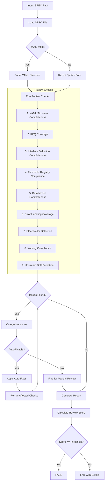
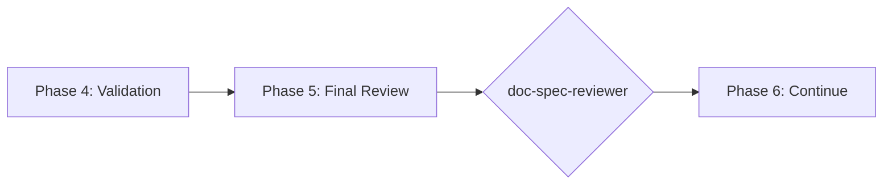

# doc-spec-reviewer

## Purpose

Comprehensive **content review and quality assurance** for Technical Specification (SPEC) documents. This skill performs deep content analysis beyond structural validation, checking YAML structure completeness, REQ coverage, interface definitions, threshold compliance, and identifying issues that require manual review.

**Layer**: 9 (SPEC Quality Assurance)

**Upstream**: SPEC (from `doc-spec-autopilot` or `doc-spec`)

**Downstream**: None (final QA gate before TSPEC/TASKS generation)

---

## When to Use This Skill

Use `doc-spec-reviewer` when:

- **After SPEC Generation**: Run immediately after `doc-spec-autopilot` completes
- **Manual SPEC Edits**: After making manual changes to SPEC
- **Pre-TASKS Check**: Before running `doc-tasks-autopilot`
- **Pre-TSPEC Check**: Before running `doc-tspec-autopilot`
- **Periodic Review**: Regular quality checks on existing SPECs

**Do NOT use when**:
- SPEC does not exist yet (use `doc-spec` or `doc-spec-autopilot` first)
- Need structural/schema validation only (use `doc-spec-validator`)
- Generating new SPEC content (use `doc-spec`)

---

## Skill vs Validator: Key Differences

| Aspect | `doc-spec-validator` | `doc-spec-reviewer` |
|--------|----------------------|---------------------|
| **Focus** | Schema compliance, TASKS-Ready score | Content quality, implementation readiness |
| **Checks** | Required sections, YAML syntax | REQ coverage, interface completeness |
| **Auto-Fix** | Structural issues only | Content issues (formatting) |
| **Output** | TASKS-Ready score (numeric) | Review score + issue list |
| **Phase** | Phase 4 (Validation) | Phase 5 (Final Review) |
| **Blocking** | TASKS-Ready < threshold blocks | Review score < threshold flags |

---

## Review Workflow



---

## Review Checks

### 1. YAML Structure Completeness

Validates 13-section YAML structure is complete.

**Required Sections**:
1. metadata
2. overview
3. traceability
4. interfaces
5. components
6. methods
7. data_models
8. error_handling
9. threshold_registry
10. req_implementations
11. testing_requirements
12. deployment
13. appendices

**Error Codes**:

| Code | Severity | Description |
|------|----------|-------------|
| REV-YS001 | Error | Required YAML section missing |
| REV-YS002 | Error | Invalid YAML syntax |
| REV-YS003 | Warning | Section is empty |
| REV-YS004 | Info | Optional section missing |

---

### 2. REQ Coverage

Validates all REQ requirements implemented in SPEC.

**Scope**:
- Every REQ has corresponding implementation
- req_implementations section complete
- Acceptance criteria mapped
- No orphaned specifications

**Error Codes**:

| Code | Severity | Description |
|------|----------|-------------|
| REV-RC001 | Error | REQ not implemented in SPEC |
| REV-RC002 | Warning | Acceptance criteria not mapped |
| REV-RC003 | Warning | Orphaned specification (no REQ) |
| REV-RC004 | Info | Multiple SPEC items for single REQ (acceptable) |

---

### 3. Interface Definition Completeness

Validates external, internal, and class interfaces.

**Scope**:
- External interfaces documented
- Internal interfaces defined
- Class interfaces specified
- Method signatures complete

**Error Codes**:

| Code | Severity | Description |
|------|----------|-------------|
| REV-IF001 | Error | External interface missing |
| REV-IF002 | Error | Method signature incomplete |
| REV-IF003 | Warning | Internal interface not defined |
| REV-IF004 | Warning | Class interface missing |
| REV-IF005 | Info | Parameter types not specified |

---

### 4. Threshold Registry Compliance

Validates thresholds match upstream documents.

**Scope**:
- Thresholds from REQ/SYS/PRD/BRD consistent
- Performance targets defined
- SLA requirements met
- Monitoring thresholds set

**Error Codes**:

| Code | Severity | Description |
|------|----------|-------------|
| REV-TR001 | Error | Threshold mismatch with REQ |
| REV-TR002 | Error | Performance target not defined |
| REV-TR003 | Warning | SLA requirement may not be met |
| REV-TR004 | Info | Monitoring threshold missing |

---

### 5. Data Model Completeness

Validates data models are implementation-ready.

**Scope**:
- All types defined
- Field specifications complete
- Validation rules documented
- Relationships mapped

**Error Codes**:

| Code | Severity | Description |
|------|----------|-------------|
| REV-DM001 | Error | Type not defined |
| REV-DM002 | Warning | Field specification incomplete |
| REV-DM003 | Warning | Validation rules missing |
| REV-DM004 | Info | Relationship not mapped |

---

### 6. Error Handling Coverage

Validates error scenarios documented.

**Scope**:
- Error codes defined
- Recovery strategies documented
- Error messages specified
- Retry semantics clear

**Error Codes**:

| Code | Severity | Description |
|------|----------|-------------|
| REV-EH001 | Error | No error handling defined |
| REV-EH002 | Warning | Recovery strategy missing |
| REV-EH003 | Warning | Error messages not specified |
| REV-EH004 | Info | Retry semantics not documented |

---

### 7. Placeholder Detection

Identifies incomplete content requiring replacement.

**Error Codes**:

| Code | Severity | Description |
|------|----------|-------------|
| REV-P001 | Error | [TODO] placeholder found |
| REV-P002 | Error | [TBD] placeholder found |
| REV-P003 | Warning | Template value not replaced |

---

### 8. Naming Compliance

Validates element IDs follow `doc-naming` standards.

**Scope**:
- Element IDs use `SPEC.NN.TT.SS` format
- Element type codes valid for SPEC
- Component naming convention

**Error Codes**:

| Code | Severity | Description |
|------|----------|-------------|
| REV-N001 | Error | Invalid element ID format |
| REV-N002 | Error | Element type code not valid for SPEC |
| REV-N003 | Error | Legacy pattern detected |

---

### 9. Upstream Drift Detection

Detects when upstream REQ and CTR documents have been modified after the SPEC was created or last updated.

**Purpose**: Identifies stale SPEC content that may not reflect current REQ and CTR documentation. When REQ documents (requirements, acceptance criteria) or CTR documents (external API contracts) change, the SPEC may need updates to maintain alignment.

**Scope**:
- `@req:` tag targets (REQ documents)
- `@ctr:` tag targets (CTR documents)
- Traceability section upstream artifact links
- Any markdown links to `../07_REQ/` or `../08_CTR/` source documents

**Detection Methods**:

| Method | Description | Precision |
|--------|-------------|-----------|
| **Timestamp Comparison** | Compares source doc `mtime` vs SPEC creation/update date | Medium |
| **Content Hash** | SHA-256 hash of referenced sections | High |
| **Version Tracking** | Checks `version` field in YAML frontmatter | High |

**Algorithm**:

```
1. Extract all upstream references from SPEC:
   - @req: tags → [path, section anchor]
   - @ctr: tags → [path, section anchor]
   - Links to ../07_REQ/ → [path]
   - Links to ../08_CTR/ → [path]
   - Traceability table upstream artifacts → [path]

2. For each upstream reference:
   a. Resolve path to absolute file path
   b. Check file exists (already covered by Check #2)
   c. Get file modification time (mtime)
   d. Compare mtime > SPEC last_updated date
   e. If mtime > SPEC date → flag as DRIFT

3. Optional (high-precision mode):
   a. Extract specific section referenced by anchor
   b. Compute SHA-256 hash of section content
   c. Compare to cached hash (stored in .drift_cache.json)
   d. If hash differs → flag as CONTENT_DRIFT
```

**Drift Cache File** (optional):

Location: `docs/09_SPEC/.drift_cache.json`

```json
{
  "spec_version": "1.0",
  "spec_updated": "2026-02-10",
  "upstream_hashes": {
    "../../07_REQ/REQ-03.yaml#req_implementations": "a1b2c3d4...",
    "../../08_CTR/CTR-03-001.yaml#endpoints": "e5f6g7h8..."
  }
}
```

**Error Codes**:

| Code | Severity | Description |
|------|----------|-------------|
| REV-D001 | Warning | Upstream REQ/CTR document modified after SPEC creation |
| REV-D002 | Warning | Referenced section content has changed (hash mismatch) |
| REV-D003 | Info | Upstream document version incremented |
| REV-D004 | Info | New content added to upstream document |
| REV-D005 | Error | Critical upstream document substantially modified (>20% change) |

**Report Output**:

```markdown
## Upstream Drift Analysis

| Upstream Document | SPEC Reference | Last Modified | SPEC Updated | Days Stale | Severity |
|-------------------|----------------|---------------|--------------|------------|----------|
| REQ-03.yaml | @req Section req_implementations | 2026-02-08 | 2026-02-05 | 3 | Warning |
| CTR-03-001.yaml | @ctr endpoints | 2026-02-10 | 2026-02-05 | 5 | Warning |

**Recommendation**: Review upstream REQ/CTR changes and update SPEC if requirements or contracts have changed.
```

**Auto-Actions**:
- Update `.drift_cache.json` with current hashes after review
- Add `[DRIFT]` marker to affected @req/@ctr tags (optional)
- Generate drift summary in review report

**Configuration**:

| Setting | Default | Description |
|---------|---------|-------------|
| `drift_threshold_days` | 7 | Days before drift becomes Warning |
| `critical_threshold_days` | 30 | Days before drift becomes Error |
| `enable_hash_check` | false | Enable SHA-256 content hashing |
| `tracked_patterns` | `@req:`, `@ctr:` | Patterns to track for drift |

---

## Review Score Calculation

**Scoring Formula**:

| Category | Weight | Calculation |
|----------|--------|-------------|
| YAML Structure Completeness | 14% | (complete_sections / 13) × 14 |
| REQ Coverage | 19% | (implemented / total_reqs) × 19 |
| Interface Definition Completeness | 19% | (complete_interfaces / total) × 19 |
| Threshold Registry Compliance | 10% | (compliant / total_thresholds) × 10 |
| Data Model Completeness | 14% | (complete_models / total) × 14 |
| Error Handling Coverage | 5% | (covered / required) × 5 |
| Placeholder Detection | 5% | (no_placeholders ? 5 : 5 - count) |
| Naming Compliance | 9% | (valid_ids / total_ids) × 9 |
| Upstream Drift | 5% | (fresh_refs / total_refs) × 5 |

**Total**: Sum of all categories (max 100)

**Thresholds**:
- **PASS**: >= 90
- **WARNING**: 80-89
- **FAIL**: < 80

---

## Command Usage

```bash
# Review specific SPEC
/doc-spec-reviewer SPEC-03

# Review SPEC by path
/doc-spec-reviewer docs/09_SPEC/SPEC-03.yaml

# Review all SPECs
/doc-spec-reviewer all
```

---

## Output Report

Review reports are stored alongside the reviewed document per project standards.

**File Naming**: `SPEC-NN.R_review_report_vNNN.md`

**Location**: Same folder as the reviewed SPEC document.

### Versioning Rules

1. **First Review**: Creates `SPEC-NN.R_review_report_v001.md`
2. **Subsequent Reviews**: Auto-increments version (v002, v003, etc.)
3. **Same-Day Reviews**: Each review gets unique version number

**Version Detection**: Scans folder for existing `SPEC-NN.R_review_report_v*.md` files and increments.

**Example**:

```
docs/09_SPEC/
├── SPEC-03.yaml
├── SPEC-03.R_review_report_v001.md    # First review
└── SPEC-03.R_review_report_v002.md    # After fixes
```

### Delta Reporting

When previous reviews exist, include score comparison in the report.

See `REVIEW_DOCUMENT_STANDARDS.md` for complete versioning requirements.

---

## Integration with doc-spec-autopilot

This skill is invoked during Phase 5 of `doc-spec-autopilot`:



---

## Related Skills

| Skill | Relationship |
|-------|--------------|
| `doc-naming` | Naming standards for Check #8 |
| `doc-spec-autopilot` | Invokes this skill in Phase 5 |
| `doc-spec-validator` | Structural validation (Phase 4) |
| `doc-spec-fixer` | Applies fixes based on review findings |
| `doc-spec` | SPEC creation rules |
| `doc-req-reviewer` | Upstream QA |
| `doc-ctr-reviewer` | Upstream QA (for external APIs) |
| `doc-tasks-autopilot` | Downstream consumer |
| `doc-tspec-autopilot` | Downstream consumer |

---

## Version History

| Version | Date | Changes |
|---------|------|---------|
| 1.2 | 2026-02-10 | Added Check #9: Upstream Drift Detection - detects when REQ/CTR documents modified after SPEC creation; REV-D001-D005 error codes; drift cache support; configurable thresholds; added doc-spec-fixer to related skills |
| 1.1 | 2026-02-10 | Added review versioning support (_vNNN pattern); Delta reporting for score comparison |
| 1.0 | 2026-02-10 | Initial skill creation with 8 review checks; YAML structure validation; REQ coverage; Interface completeness; Threshold compliance |
