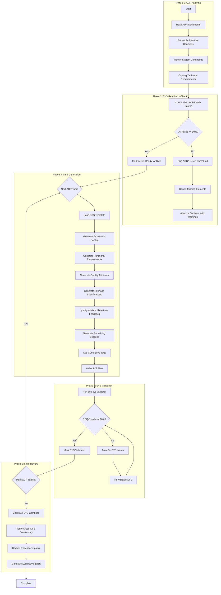

# doc-sys-autopilot

## Purpose

Automated **System Requirements (SYS)** generation pipeline that processes ADR architecture decisions to generate comprehensive system requirements documents with functional requirements, quality attributes, and REQ-Ready scoring.

**Layer**: 6 (System Requirements)

**Upstream**: BRD (Layer 1), PRD (Layer 2), EARS (Layer 3), BDD (Layer 4), ADR (Layer 5)

**Downstream Artifacts**: REQ (Layer 7)

---

## Skill Dependencies

This autopilot orchestrates the following skills:

| Skill | Purpose | Phase |
|-------|---------|-------|
| `doc-naming` | Element ID format (SYS.NN.TT.SS), threshold tags, legacy pattern detection | All Phases |
| `doc-sys` | SYS creation rules, 5-part structure, quality attribute categories | Phase 3: SYS Generation |
| `quality-advisor` | Real-time quality feedback during SYS generation | Phase 3: SYS Generation |
| `doc-sys-validator` | Validate SYS structure, content, REQ-Ready score | Phase 4: SYS Validation |

**Delegation Principle**: The autopilot orchestrates workflow but delegates:
- SYS structure/content rules -> `doc-sys` skill
- Real-time quality feedback -> `quality-advisor` skill
- SYS validation logic -> `doc-sys-validator` skill
- Element ID standards -> `doc-naming` skill

---

## When to Use This Skill

**Use `doc-sys-autopilot` when**:
- ADR documents are complete with SYS-Ready score >= 90%
- Need to generate system requirements from architecture decisions
- Want automated functional requirement and quality attribute generation
- Ensuring consistent SYS quality across the project
- Automating SYS generation in CI/CD pipelines

**Do NOT use when**:
- Manually creating a single SYS with extensive customization (use `doc-sys` directly)
- ADR documents are incomplete or have SYS-Ready score < 90%
- Editing specific SYS sections (use `doc-sys` for guidance)
- Validating existing SYS only (use `doc-sys-validator`)

---

## Workflow Overview



---

## Detailed Workflow

### Phase 1: ADR Analysis

Analyze ADR documents to extract architecture decisions and system constraints.

**Input Sources**:

| Priority | Source | Location | Content Type |
|----------|--------|----------|--------------|
| 1 | ADR Documents | `docs/ADR/ADR-NN_{slug}.md` | Architecture Decisions |
| 2 | ADR-00 Technology Stack | `docs/ADR/ADR-00_technology_stack.md` | Approved Technologies |
| 3 | BRD Section 7.2 | `docs/01_BRD/BRD-NN_{slug}/` | Architecture Decision Requirements |
| 4 | PRD Section 18 | `docs/02_PRD/PRD-NN_{slug}/` | Architecture Decision Requirements |

**Analysis Process**:

```bash
# Locate ADR documents
find docs/ADR/ -name "ADR-*.md" -type f | sort

# Check for SYS-Ready scores in ADRs
grep -E "SYS-Ready.*Score" docs/ADR/ADR-*.md
```

**Required ADR Content per Topic**:

| ADR | Topic Category | Key Content for SYS |
|-----|----------------|---------------------|
| ADR-01 | Infrastructure | Compute, networking, scaling constraints |
| ADR-02 | Data Architecture | Storage, data flow, persistence requirements |
| ADR-03 | Integration | API patterns, messaging, protocol requirements |
| ADR-04 | Security | Authentication, authorization, encryption requirements |
| ADR-05 | Observability | Logging, monitoring, alerting requirements |
| ADR-06 | AI/ML | Model requirements, inference constraints |
| ADR-07 | Technology Selection | Framework, language, tool constraints |

**Output**: System requirements catalog with ADR-derived constraints and technical requirements.

### Phase 2: SYS Readiness Check

Validate that all ADR documents meet the SYS-Ready threshold before proceeding.

> **Skill Delegation**: Element ID validation follows rules in `doc-naming` skill.
> See: `.claude/skills/doc-naming/SKILL.md` for element type codes.

**SYS-Ready Score Requirements**:

| Criteria | Weight | Description |
|----------|--------|-------------|
| Decision Completeness | 30% | Context/Decision/Consequences/Alternatives documented |
| Architecture Clarity | 35% | Mermaid diagrams, component responsibilities |
| Implementation Readiness | 20% | Complexity assessment, dependencies, rollback strategies |
| Verification Approach | 15% | Testing strategy, success metrics, operational readiness |

**Minimum Score**: 90%

**ADR to SYS Mapping**:

| ADR Document | SYS Document | System Domain |
|--------------|--------------|---------------|
| ADR-01 | SYS-01 | Infrastructure System |
| ADR-02 | SYS-02 | Data Management System |
| ADR-03 | SYS-03 | Integration System |
| ADR-04 | SYS-04 | Security System |
| ADR-05 | SYS-05 | Observability System |
| ADR-06 | SYS-06 | AI/ML System |
| ADR-07 | SYS-07 | Technology Platform |

**Readiness Check Process**:

```python
def check_adr_readiness(adr_list: list) -> dict:
    """
    Check SYS-Ready scores for all ADR documents.

    Returns:
        dict with 'ready' (list of ADRs >= 90%)
        and 'not_ready' (list of ADRs < 90% with issues)
    """
    ready = []
    not_ready = []

    for adr in adr_list:
        score = extract_sys_ready_score(adr)
        if score >= 90:
            ready.append(adr)
        else:
            not_ready.append({
                'adr': adr,
                'score': score,
                'issues': identify_missing_elements(adr)
            })

    return {'ready': ready, 'not_ready': not_ready}
```

### Phase 3: SYS Generation

Generate SYS documents with functional requirements and quality attributes.

> **Skill Delegation**: This phase follows rules defined in `doc-sys` skill.
> See: `.claude/skills/doc-sys/SKILL.md` for complete SYS creation guidance.
>
> **Quality Guidance**: Uses `quality-advisor` skill for real-time feedback during generation.
> See: `.claude/skills/quality-advisor/SKILL.md` for quality monitoring.

**Generation Process**:

1. **Reserve SYS ID**:
   ```bash
   # Check for next available ID
   ls docs/SYS/SYS-*.md 2>/dev/null | \
     grep -oP 'SYS-\K\d+' | sort -n | tail -1
   # Increment for new SYS
   ```

2. **Load SYS Template**:
   - Primary: `ai_dev_flow/06_SYS/SYS-MVP-TEMPLATE.md`
   - Comprehensive: `ai_dev_flow/06_SYS/SYS-TEMPLATE.md`

3. **Generate Document Control Section**:

   | Field | Value |
   |-------|-------|
   | Project Name | From BRD |
   | Document Version | 0.1.0 |
   | Date Created | Current date (YYYY-MM-DD) |
   | Last Updated | Current date (YYYY-MM-DD) |
   | Document Owner | From ADR stakeholder analysis |
   | Prepared By | AI Assistant |
   | Status | Draft (or In Review if ADR Accepted) |
   | EARS-Ready Score | From upstream EARS |
   | REQ-Ready Score | Calculated after generation |

4. **Generate Functional Requirements (Part 2 - Section 4)**:

   From ADR Decision and Implementation sections:

   | Element ID | Requirement | Priority | Source | Verification |
   |------------|-------------|----------|--------|--------------|
   | SYS.01.01.01 | The system shall... | Must Have | ADR-01.Decision | Integration Test |
   | SYS.01.01.02 | The system shall... | Should Have | ADR-01.Impl | Unit Test |

   **Element Type Codes** (per `doc-naming` skill):

   | Element Type | Code | Example |
   |--------------|------|---------|
   | Functional Requirement | 01 | SYS.02.01.01 |
   | Quality Attribute | 02 | SYS.02.02.01 |
   | Use Case | 11 | SYS.02.11.01 |
   | System Requirement | 26 | SYS.02.26.01 |

5. **Generate Quality Attributes (Part 2 - Section 5)**:

   From ADR Consequences and Implementation sections:

   **Required Categories**:

   | Category | Source | Metrics |
   |----------|--------|---------|
   | Performance | ADR latency/throughput targets | p50/p95/p99, TPS |
   | Reliability | ADR availability/recovery | Uptime %, MTBF, MTTR |
   | Scalability | ADR scaling decisions | Concurrent users, data volume |
   | Security | ADR-04 Security ADR | Auth latency, encryption |
   | Observability | ADR-05 Observability ADR | Log retention, alert thresholds |
   | Maintainability | ADR deployment decisions | Deploy frequency, coverage |

   **Quality Attribute Format**:
   ```markdown
   | ID | Category | Attribute | Target | Measurement | Source |
   |----|----------|-----------|--------|-------------|--------|
   | SYS.01.02.01 | Performance | API Response Time | p95 < 100ms | APM Monitoring | @threshold: PRD.01.perf.api.p95_latency |
   | SYS.01.02.02 | Reliability | Availability | 99.9% | Uptime Monitoring | @threshold: PRD.01.sla.uptime.target |
   ```

6. **Generate Interface Specifications (Part 3 - Section 6)**:

   From ADR Integration decisions:

   - External APIs (CTR-ready)
   - Internal interfaces
   - Data exchange protocols
   - Message formats

7. **Real-Time Quality Feedback** (via `quality-advisor` skill):
   - Monitor section completion as content is generated
   - Detect anti-patterns (AP-001 to AP-017) during creation
   - Validate element ID format compliance (SYS.NN.TT.SS)
   - Check for placeholder text ([TBD], TODO, XXX)
   - Verify Mermaid diagram presence (recommended for SYS)
   - Validate @threshold tag usage for quantitative values
   - Flag issues early to reduce post-generation rework

8. **Generate Remaining Sections**:
   - Section 7: Data Management Requirements
   - Section 8: Testing and Validation Requirements
   - Section 9: Deployment and Operations Requirements
   - Section 10: Compliance and Regulatory Requirements
   - Section 11: Acceptance Criteria
   - Section 12: Risk Assessment
   - Section 13: Traceability
   - Section 14: Implementation Notes

9. **Add Cumulative Tags (Section 13)**:

   **Layer 6 Required Tags** (5 tags):
   ```markdown
   ## Traceability

   **Required Tags** (Cumulative Tagging Hierarchy - Layer 6):

   @brd: BRD.01.01.03
   @prd: PRD.01.07.02, PRD.01.07.15
   @ears: EARS.01.25.01, EARS.01.25.02
   @bdd: BDD.01.14.01
   @adr: ADR-01, ADR-04
   ```

10. **File Output**:
    - **Monolithic** (<25KB): `docs/SYS/SYS-NN_{slug}.md`
    - **Sectioned** (>=25KB): `docs/SYS/SYS-NN_{slug}/SYS-NN.S_{section}.md`

### Phase 4: SYS Validation

After SYS generation, validate structure and REQ-Ready score.

> **Skill Delegation**: This phase uses validation rules from `doc-sys-validator` skill.
> See: `.claude/skills/doc-sys-validator/SKILL.md` for complete validation rules.

**Validation Command**:

```bash
python ai_dev_flow/scripts/validate_sys.py docs/SYS/SYS-NN_{slug}.md --verbose
```

**Validation Checks** (8 Total):

| Check | Type | Description |
|-------|------|-------------|
| CHECK 1 | Error | Required Document Control Fields (9 fields) |
| CHECK 2 | Error | ADR Compliance Validation |
| CHECK 3 | Error | REQ-Ready Score Validation (format, threshold) |
| CHECK 4 | Error | Quality Attribute Quantification |
| CHECK 5 | Warning | System Boundaries |
| CHECK 6 | Warning | Interface Specifications (CTR-ready) |
| CHECK 7 | Warning | Upstream Traceability |
| CHECK 8 | Error | Element ID Format Compliance (unified 4-segment) |

**REQ-Ready Scoring Criteria (100%)**:

| Category | Weight | Criteria |
|----------|--------|----------|
| Requirements Decomposition Clarity | 35% | System boundaries, functional decomposition, dependencies, ADR alignment |
| Quality Attributes Quantification | 30% | Performance percentiles, reliability SLAs, security compliance, scalability metrics |
| Interface Specifications | 20% | External APIs (CTR-ready), internal interfaces, data exchange protocols |
| Implementation Readiness | 15% | Testing requirements, deployment/ops, monitoring/observability |

**Minimum Score**: 90%

**Auto-Fix Actions**:

| Issue | Auto-Fix Action |
|-------|-----------------|
| Invalid element ID format | Convert to SYS.NN.TT.SS format |
| Missing traceability section | Insert from template |
| Missing Document Control fields | Add placeholder fields |
| Legacy patterns (FR-XXX, QA-XXX, SR-XXX) | Convert to unified format |
| Missing REQ-Ready Score | Calculate and insert |
| Missing @threshold tags | Add template references |
| Hardcoded numeric values | Replace with @threshold references |

**Validation Loop**:

```
LOOP (max 3 iterations):
  1. Run doc-sys-validator
  2. IF errors found: Apply auto-fixes
  3. IF warnings found: Review and address if critical
  4. IF REQ-Ready Score < 90%: Enhance sections
  5. IF clean: Mark VALIDATED, proceed
  6. IF max iterations: Log issues, flag for manual review
```

### Phase 5: Final Review

Comprehensive final review before marking SYS generation complete.

**Review Checks**:

1. **All SYS Complete**:
   - All ADR-derived system domains addressed
   - Each SYS has REQ-Ready score >= 90%
   - No placeholder text remaining
   - All @threshold tags reference valid registry entries

2. **Cross-SYS Consistency**:
   - No conflicting requirements between SYS documents
   - Quality attribute targets align across systems
   - Interface specifications are compatible
   - Dependencies between SYS documented

3. **Traceability Matrix Update**:
   ```bash
   # Update SYS-00_TRACEABILITY_MATRIX.md
   python ai_dev_flow/scripts/update_traceability_matrix.py \
     --type SYS \
     --matrix docs/SYS/SYS-00_TRACEABILITY_MATRIX.md
   ```

4. **Summary Report Generation**:
   ```
   SYS Generation Summary
   ======================
   Total SYS Generated: 7

   Status Distribution:
     Approved: 5
     In Review: 2
     Draft: 0

   REQ-Ready Scores:
     SYS-01 (Infrastructure):     95%
     SYS-02 (Data Architecture):  92%
     SYS-03 (Integration):        94%
     SYS-04 (Security):           96%
     SYS-05 (Observability):      91%
     SYS-06 (AI/ML):              90%
     SYS-07 (Technology):         93%

   Average REQ-Ready Score: 93%

   Next Steps:
     1. Review In Review SYS documents for stakeholder approval
     2. Run doc-req-autopilot to decompose SYS into atomic REQ
   ```

---

## Execution Modes

### Single SYS Mode

Generate one SYS from a specific ADR.

```bash
# Example: Generate SYS-01 from ADR-01
/doc-sys-autopilot ADR-01

# Output:
# Analyzing ADR-01 (Infrastructure)...
# SYS-Ready Score: 94% (PASS)
# Generating SYS-01_infrastructure.md...
# REQ-Ready Score: 92%
# Complete.
```

### Batch Mode (All ADRs)

Generate all SYS from ADR documents.

```bash
# Example: Generate all SYS from ADR directory
/doc-sys-autopilot all

# Output:
# Scanning ADR directory...
# Found 7 ADR documents:
#   ADR-01 (Infrastructure) - SYS-Ready: 94%
#   ADR-02 (Data Architecture) - SYS-Ready: 92%
#   ADR-03 (Integration) - SYS-Ready: 91%
#   ADR-04 (Security) - SYS-Ready: 95%
#   ADR-05 (Observability) - SYS-Ready: 90%
#   ADR-06 (AI/ML) - SYS-Ready: 91%
#   ADR-07 (Technology) - SYS-Ready: 93%
#
# Generating SYS documents...
# [================>          ] 5/7 Complete
```

### Dry Run Mode

Preview SYS generation plan without creating files.

```bash
/doc-sys-autopilot all --dry-run

# Output:
# SYS Generation Plan (Dry Run)
# ============================
# Source: ADR documents
#
# Planned SYS:
# 1. SYS-01 (Infrastructure) - Full generation
# 2. SYS-02 (Data Architecture) - Full generation
# 3. SYS-03 (Integration) - Full generation
# 4. SYS-04 (Security) - Full generation
# 5. SYS-05 (Observability) - Full generation
# 6. SYS-06 (AI/ML) - Full generation
# 7. SYS-07 (Technology) - Full generation
#
# No files will be created in dry-run mode.
```

---

## Output Artifacts

### Generated Files

| File | Purpose | Location |
|------|---------|----------|
| SYS-NN_{slug}.md | Main SYS document (monolithic) | `docs/SYS/` |
| SYS-NN_{slug}/ | SYS folder (sectioned) | `docs/SYS/` |
| SYS-NN.0_index.md | Section index | `docs/SYS/SYS-NN_{slug}/` |
| SYS-NN.S_{section}.md | Section files | `docs/SYS/SYS-NN_{slug}/` |

### Validation Reports

| Report | Purpose | Location |
|--------|---------|----------|
| sys_validation_report.json | Validation results | `tmp/` |
| req_ready_scores.json | REQ-Ready breakdown | `tmp/` |
| sys_autopilot_log.md | Execution log | `tmp/` |

---

## Error Handling

### Error Categories

| Category | Handling | Example |
|----------|----------|---------|
| ADR SYS-Ready < 90% | Abort with message | ADR-01 score at 85% |
| ADR Not Found | Skip or abort | ADR-08 does not exist |
| Validation Failure | Auto-fix, retry | Missing required section |
| REQ-Ready Below 90% | Enhance sections, retry | Score at 88% |
| Max Retries Exceeded | Flag for manual review | Persistent validation errors |

### Recovery Actions

```python
def handle_error(error_type: str, context: dict) -> Action:
    match error_type:
        case "ADR_SYS_READY_LOW":
            return Action.ABORT_WITH_MESSAGE
        case "ADR_NOT_FOUND":
            return Action.SKIP_OR_ABORT
        case "VALIDATION_FAILURE":
            if context["retry_count"] < 3:
                return Action.AUTO_FIX_RETRY
            return Action.FLAG_MANUAL_REVIEW
        case "REQ_READY_LOW":
            return Action.ENHANCE_SECTIONS
        case _:
            return Action.FLAG_MANUAL_REVIEW
```

---

## Configuration

### Default Configuration

```yaml
# config/sys_autopilot.yaml
sys_autopilot:
  version: "1.0"

  scoring:
    sys_ready_min: 90  # ADR threshold
    req_ready_min: 90  # SYS output threshold
    strict_mode: false

  execution:
    max_parallel: 3        # HARD LIMIT - do not exceed
    chunk_size: 3          # Documents per chunk
    pause_between_chunks: true
    auto_fix: true
    continue_on_error: false
    timeout_per_adr: 180  # seconds

  output:
    structure: auto  # auto, monolithic, sectioned
    size_threshold_kb: 25
    report_format: markdown

  validation:
    skip_validation: false
    fix_iterations_max: 3
    require_threshold_tags: true

  quality_attributes:
    require_performance: true
    require_reliability: true
    require_security: true
    require_scalability: false
    require_observability: true
    require_maintainability: false
```

### Command Line Options

| Option | Default | Description |
|--------|---------|-------------|
| `--min-sys-ready` | 90 | Minimum ADR SYS-Ready score |
| `--min-req-ready` | 90 | Minimum SYS REQ-Ready score |
| `--no-auto-fix` | false | Disable auto-fix (manual only) |
| `--continue-on-error` | false | Continue if one ADR fails |
| `--dry-run` | false | Preview execution plan only |
| `--output-format` | auto | Force monolithic or sectioned output |
| `--skip-validation` | false | Skip validation phase |

---

## Context Management

### Chunked Parallel Execution (MANDATORY)

**CRITICAL**: To prevent conversation context overflow errors ("Prompt is too long", "Conversation too long"), all autopilot operations MUST follow chunked execution rules:

**Chunk Size Limit**: Maximum 3 documents per chunk

**Chunking Rules**:

1. **Chunk Formation**: Group ADR-derived SYS documents into chunks of maximum 3 at a time
2. **Sequential Chunk Processing**: Process one chunk at a time, completing all documents in a chunk before starting the next
3. **Context Pause**: After completing each chunk, provide a summary and pause for user acknowledgment
4. **Progress Tracking**: Display chunk progress (e.g., "Chunk 2/3: Processing SYS-04, SYS-05, SYS-06...")

**Why Chunking is Required**:

- Prevents "Conversation too long" errors during batch processing
- Allows context compaction between chunks
- Enables recovery from failures without losing all progress
- Provides natural checkpoints for user review

**Execution Pattern**:

```
For SYS batch of 7 ADR-derived documents:
  Chunk 1: SYS-01, SYS-02, SYS-03 → Complete → Summary
  [Context compaction opportunity]
  Chunk 2: SYS-04, SYS-05, SYS-06 → Complete → Summary
  [Context compaction opportunity]
  Chunk 3: SYS-07 → Complete → Summary
```

**Chunk Completion Template**:

```markdown
## Chunk N/M Complete

Generated:
- SYS-XX (Infrastructure): REQ-Ready Score 94%
- SYS-YY (Data Architecture): REQ-Ready Score 92%
- SYS-ZZ (Integration): REQ-Ready Score 95%

Proceeding to next chunk...
```

---

## Integration Points

### Pre-Execution Hooks

```bash
# Hook: pre_sys_generation
# Runs before SYS generation starts
./hooks/pre_sys_generation.sh

# Example: Verify ADR SYS-Ready scores
for adr in docs/ADR/ADR-*.md; do
  score=$(grep -oP 'SYS-Ready.*\K\d+' "$adr")
  if [ "$score" -lt 90 ]; then
    echo "ERROR: $adr SYS-Ready score below 90%"
    exit 1
  fi
done
```

### Post-Execution Hooks

```bash
# Hook: post_sys_generation
# Runs after SYS generation completes
./hooks/post_sys_generation.sh

# Example: Trigger REQ autopilot for validated SYS
if [ "$ALL_SYS_VALIDATED" = "true" ]; then
  python ai_dev_flow/scripts/req_autopilot.py \
    --sys-dir docs/SYS/ \
    --output docs/REQ/
fi
```

### CI/CD Integration

```yaml
# .github/workflows/sys_autopilot.yml
name: SYS Autopilot

on:
  push:
    paths:
      - 'docs/ADR/**/ADR-*.md'

jobs:
  generate-sys:
    runs-on: ubuntu-latest
    steps:
      - uses: actions/checkout@v4

      - name: Run SYS Autopilot
        run: |
          python ai_dev_flow/scripts/sys_autopilot.py \
            --adr docs/ADR/ \
            --output docs/SYS/ \
            --validate

      - name: Upload Validation Report
        uses: actions/upload-artifact@v4
        with:
          name: sys-validation
          path: tmp/sys_validation_report.json
```

---

## Quality Gates

### Phase Gates

| Phase | Gate | Criteria |
|-------|------|----------|
| Phase 1 | ADR Gate | ADR documents exist with architecture decisions |
| Phase 2 | Readiness Gate | All ADRs have SYS-Ready score >= 90% |
| Phase 3 | Generation Gate | All 5 parts generated per system |
| Phase 4 | Validation Gate | REQ-Ready Score >= 90% |
| Phase 5 | Review Gate | No blocking issues remaining |

### Blocking vs Non-Blocking

| Issue Type | Blocking | Action |
|------------|----------|--------|
| Missing Functional Requirements | Yes | Must fix before proceeding |
| Missing Quality Attributes | Yes | Must fix before proceeding |
| REQ-Ready Score < 90% | Yes | Must enhance sections |
| Invalid element ID format | Yes | Must convert to unified format |
| Missing @threshold tags | Yes | Must add registry references |
| Hardcoded numeric values | Yes | Must replace with @threshold |
| Missing optional section | No | Log warning, continue |
| Style/formatting issues | No | Auto-fix, continue |

---

## Related Resources

- **SYS Creation Skill**: `.claude/skills/doc-sys/SKILL.md`
- **SYS Validator Skill**: `.claude/skills/doc-sys-validator/SKILL.md`
- **Quality Advisor Skill**: `.claude/skills/quality-advisor/SKILL.md`
- **Naming Standards Skill**: `.claude/skills/doc-naming/SKILL.md`
- **SYS Template**: `ai_dev_flow/06_SYS/SYS-MVP-TEMPLATE.md`
- **SYS Creation Rules**: `ai_dev_flow/06_SYS/SYS_CREATION_RULES.md`
- **SYS Validation Rules**: `ai_dev_flow/06_SYS/SYS_VALIDATION_RULES.md`
- **ADR Autopilot Skill**: `.claude/skills/doc-adr-autopilot/SKILL.md`

---

## Quick Reference

| Input | Output | Key Metric |
|-------|--------|------------|
| ADR Documents | SYS-01 to SYS-07 | REQ-Ready >= 90% |

**Usage**:
```
/doc-sys-autopilot <ADR-ID|all> [OPTIONS]
```

**Common Commands**:
```bash
# Generate all SYS from ADRs
/doc-sys-autopilot all

# Generate single SYS from specific ADR
/doc-sys-autopilot ADR-01

# Preview only
/doc-sys-autopilot all --dry-run

# Resume after failure
/doc-sys-autopilot resume
```

**ADR to SYS Mapping**:

| ADR | SYS | System Domain |
|-----|-----|---------------|
| ADR-01 | SYS-01 | Infrastructure |
| ADR-02 | SYS-02 | Data Architecture |
| ADR-03 | SYS-03 | Integration |
| ADR-04 | SYS-04 | Security |
| ADR-05 | SYS-05 | Observability |
| ADR-06 | SYS-06 | AI/ML |
| ADR-07 | SYS-07 | Technology Selection |

**Element ID Codes (SYS.NN.TT.SS)**:

| Type | Code | Example |
|------|------|---------|
| Functional Requirement | 01 | SYS.02.01.01 |
| Quality Attribute | 02 | SYS.02.02.01 |
| Use Case | 11 | SYS.02.11.01 |
| System Requirement | 26 | SYS.02.26.01 |

**Cumulative Tags Required** (Layer 6 - 5 tags):
```markdown
@brd: BRD.NN.TT.SS
@prd: PRD.NN.TT.SS
@ears: EARS.NN.TT.SS
@bdd: BDD.NN.TT.SS
@adr: ADR-NN
```

---

## Version History

| Version | Date | Changes |
|---------|------|---------|
| 1.0 | 2026-02-08 | Initial skill creation with 5-phase workflow; Integrated doc-naming, doc-sys, doc-sys-validator, quality-advisor skills; Added ADR to SYS mapping; Functional requirements and quality attributes generation; REQ-Ready scoring |
