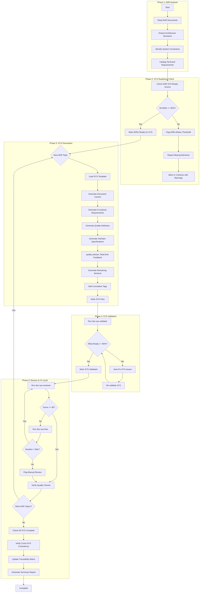
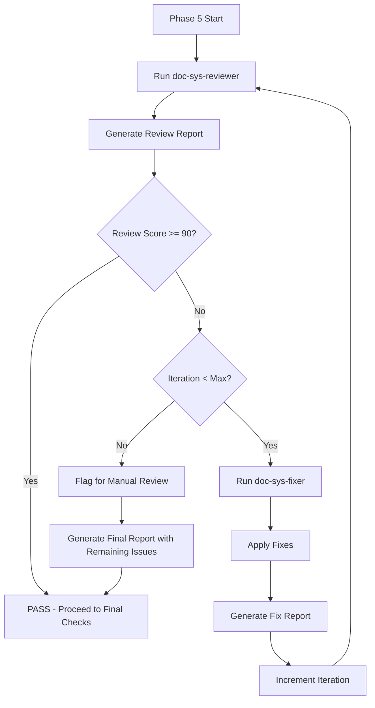
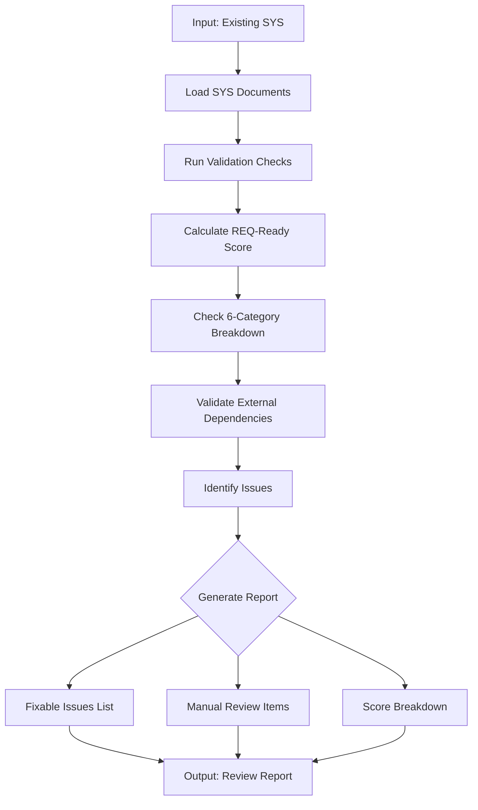
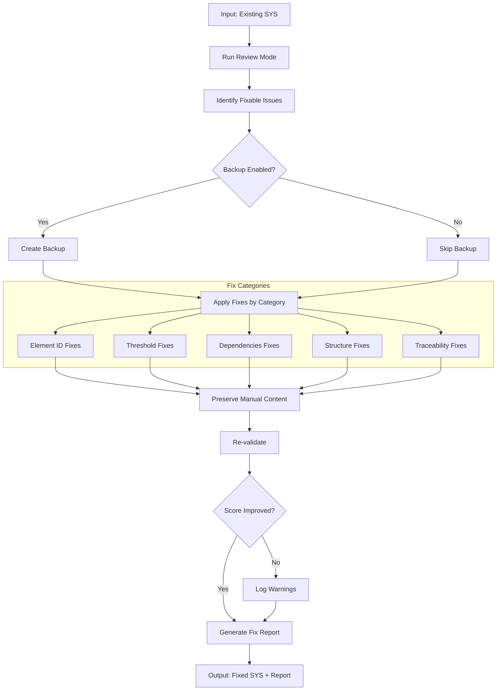

# doc-sys-autopilot

## Purpose

Automated **System Requirements (SYS)** generation pipeline that processes ADR architecture decisions to generate comprehensive system requirements documents with functional requirements, quality attributes, and REQ-Ready scoring.

**Layer**: 6 (System Requirements)

**Upstream**: BRD (Layer 1), PRD (Layer 2), EARS (Layer 3), BDD (Layer 4), ADR (Layer 5)

**Downstream Artifacts**: REQ (Layer 7)

---

## Skill Dependencies

This autopilot orchestrates the following skills:

| Skill | Purpose | Phase |
|-------|---------|-------|
| `doc-naming` | Element ID format (SYS.NN.TT.SS), threshold tags, legacy pattern detection | All Phases |
| `doc-sys` | SYS creation rules, 5-part structure, quality attribute categories | Phase 3: SYS Generation |
| `quality-advisor` | Real-time quality feedback during SYS generation | Phase 3: SYS Generation |
| `doc-sys-validator` | Validate SYS structure, content, REQ-Ready score | Phase 4: SYS Validation |
| `doc-sys-reviewer` | Content review, link validation, quality scoring | Phase 5: Review |
| `doc-sys-fixer` | Apply fixes from review report, create missing files | Phase 5: Fix |

**Delegation Principle**: The autopilot orchestrates workflow but delegates:
- SYS structure/content rules -> `doc-sys` skill
- Real-time quality feedback -> `quality-advisor` skill
- SYS validation logic -> `doc-sys-validator` skill
- Content review and scoring -> `doc-sys-reviewer` skill
- Issue resolution and fixes -> `doc-sys-fixer` skill
- Element ID standards -> `doc-naming` skill

---

## Smart Document Detection

The autopilot automatically determines the action based on the input document type.

### Input Type Recognition

| Input | Detected As | Action |
|-------|-------------|--------|
| `SYS-NN` | Self type | Review existing SYS document |
| `ADR-NN` | Upstream type | Generate if missing, review if exists |

### Detection Algorithm

```
1. Parse input: Extract TYPE and NN from "{TYPE}-{NN}"
2. Determine action:
   - IF TYPE == "SYS": Review Mode
   - ELSE IF TYPE == "ADR": Generate/Find Mode
   - ELSE: Error (invalid type for this autopilot)
3. For Generate/Find Mode:
   - Check: Does SYS-{NN} exist in docs/06_SYS/?
   - IF exists: Switch to Review Mode for SYS-{NN}
   - ELSE: Proceed with Generation from ADR-{NN}
```

### File Existence Check

```bash
# Check for nested folder structure (mandatory)
ls docs/06_SYS/SYS-{NN}_*/
```

### Examples

```bash
# Review mode (same type - SYS input)
/doc-sys-autopilot SYS-01           # Reviews existing SYS-01

# Generate/Find mode (upstream type - ADR input)
/doc-sys-autopilot ADR-01           # Generates SYS-01 if missing, or reviews existing SYS-01

# Multiple inputs
/doc-sys-autopilot ADR-01,ADR-02    # Generates/reviews SYS-01 and SYS-02
/doc-sys-autopilot SYS-01,SYS-02    # Reviews SYS-01 and SYS-02
```

### Action Determination Output

```
Input: ADR-01
├── Detected Type: ADR (upstream)
├── Expected SYS: SYS-01
├── SYS Exists: Yes → docs/06_SYS/SYS-01_f1_iam/
└── Action: REVIEW MODE - Running doc-sys-reviewer on SYS-01

Input: ADR-05
├── Detected Type: ADR (upstream)
├── Expected SYS: SYS-05
├── SYS Exists: No
└── Action: GENERATE MODE - Creating SYS-05 from ADR-05

Input: SYS-03
├── Detected Type: SYS (self)
└── Action: REVIEW MODE - Running doc-sys-reviewer on SYS-03
```

---

## When to Use This Skill

**Use `doc-sys-autopilot` when**:
- ADR documents are complete with SYS-Ready score >= 90%
- Need to generate system requirements from architecture decisions
- Want automated functional requirement and quality attribute generation
- Ensuring consistent SYS quality across the project
- Automating SYS generation in CI/CD pipelines

**Do NOT use when**:
- Manually creating a single SYS with extensive customization (use `doc-sys` directly)
- ADR documents are incomplete or have SYS-Ready score < 90%
- Editing specific SYS sections (use `doc-sys` for guidance)
- Validating existing SYS only (use `doc-sys-validator`)

---

## Workflow Overview



---

## Detailed Workflow

### Phase 1: ADR Analysis

Analyze ADR documents to extract architecture decisions and system constraints.

**Input Sources**:

| Priority | Source | Location | Content Type |
|----------|--------|----------|--------------|
| 1 | ADR Documents | `docs/05_ADR/ADR-NN_{slug}.md` | Architecture Decisions |
| 2 | ADR-00 Technology Stack | `docs/05_ADR/ADR-00_technology_stack.md` | Approved Technologies |
| 3 | BRD Section 7.2 | `docs/01_BRD/BRD-NN_{slug}/` | Architecture Decision Requirements |
| 4 | PRD Section 18 | `docs/02_PRD/PRD-NN_{slug}/` | Architecture Decision Requirements |

**Analysis Process**:

```bash
# Locate ADR documents
find docs/05_ADR/ -name "ADR-*.md" -type f | sort

# Check for SYS-Ready scores in ADRs
grep -E "SYS-Ready.*Score" docs/05_ADR/ADR-*.md
```

**Required ADR Content per Topic**:

| ADR | Topic Category | Key Content for SYS |
|-----|----------------|---------------------|
| ADR-01 | Infrastructure | Compute, networking, scaling constraints |
| ADR-02 | Data Architecture | Storage, data flow, persistence requirements |
| ADR-03 | Integration | API patterns, messaging, protocol requirements |
| ADR-04 | Security | Authentication, authorization, encryption requirements |
| ADR-05 | Observability | Logging, monitoring, alerting requirements |
| ADR-06 | AI/ML | Model requirements, inference constraints |
| ADR-07 | Technology Selection | Framework, language, tool constraints |

**Output**: System requirements catalog with ADR-derived constraints and technical requirements.

### Phase 2: SYS Readiness Check

Validate that all ADR documents meet the SYS-Ready threshold before proceeding.

> **Skill Delegation**: Element ID validation follows rules in `doc-naming` skill.
> See: `.claude/skills/doc-naming/SKILL.md` for element type codes.

**SYS-Ready Score Requirements**:

| Criteria | Weight | Description |
|----------|--------|-------------|
| Decision Completeness | 30% | Context/Decision/Consequences/Alternatives documented |
| Architecture Clarity | 35% | Mermaid diagrams, component responsibilities |
| Implementation Readiness | 20% | Complexity assessment, dependencies, rollback strategies |
| Verification Approach | 15% | Testing strategy, success metrics, operational readiness |

**Minimum Score**: 90%

**ADR to SYS Mapping**:

| ADR Document | SYS Document | System Domain |
|--------------|--------------|---------------|
| ADR-01 | SYS-01 | Infrastructure System |
| ADR-02 | SYS-02 | Data Management System |
| ADR-03 | SYS-03 | Integration System |
| ADR-04 | SYS-04 | Security System |
| ADR-05 | SYS-05 | Observability System |
| ADR-06 | SYS-06 | AI/ML System |
| ADR-07 | SYS-07 | Technology Platform |

**Readiness Check Process**:

```python
def check_adr_readiness(adr_list: list) -> dict:
    """
    Check SYS-Ready scores for all ADR documents.

    Returns:
        dict with 'ready' (list of ADRs >= 90%)
        and 'not_ready' (list of ADRs < 90% with issues)
    """
    ready = []
    not_ready = []

    for adr in adr_list:
        score = extract_sys_ready_score(adr)
        if score >= 90:
            ready.append(adr)
        else:
            not_ready.append({
                'adr': adr,
                'score': score,
                'issues': identify_missing_elements(adr)
            })

    return {'ready': ready, 'not_ready': not_ready}
```

### Phase 3: SYS Generation

Generate SYS documents with functional requirements and quality attributes.

> **Skill Delegation**: This phase follows rules defined in `doc-sys` skill.
> See: `.claude/skills/doc-sys/SKILL.md` for complete SYS creation guidance.
>
> **Quality Guidance**: Uses `quality-advisor` skill for real-time feedback during generation.
> See: `.claude/skills/quality-advisor/SKILL.md` for quality monitoring.

**Generation Process**:

1. **Reserve SYS ID**:
   ```bash
   # Check for next available ID
   ls docs/06_SYS/SYS-*.md 2>/dev/null | \
     grep -oP 'SYS-\K\d+' | sort -n | tail -1
   # Increment for new SYS
   ```

2. **Load SYS Template**:
   - Primary: `ai_dev_flow/06_SYS/SYS-MVP-TEMPLATE.md`
   - Comprehensive: `ai_dev_flow/06_SYS/SYS-TEMPLATE.md`

3. **Generate Document Control Section**:

   | Field | Value |
   |-------|-------|
   | Project Name | From BRD |
   | Document Version | 0.1.0 |
   | Date Created | Current date (YYYY-MM-DD) |
   | Last Updated | Current date (YYYY-MM-DD) |
   | Document Owner | From ADR stakeholder analysis |
   | Prepared By | AI Assistant |
   | Status | Draft (or In Review if ADR Accepted) |
   | EARS-Ready Score | From upstream EARS |
   | REQ-Ready Score | Calculated after generation |

4. **Generate Functional Requirements (Part 2 - Section 4)**:

   From ADR Decision and Implementation sections:

   | Element ID | Requirement | Priority | Source | Verification |
   |------------|-------------|----------|--------|--------------|
   | SYS.01.01.01 | The system shall... | Must Have | ADR-01.Decision | Integration Test |
   | SYS.01.01.02 | The system shall... | Should Have | ADR-01.Impl | Unit Test |

   **Element Type Codes** (per `doc-naming` skill):

   | Element Type | Code | Example |
   |--------------|------|---------|
   | Functional Requirement | 01 | SYS.02.01.01 |
   | Quality Attribute | 02 | SYS.02.02.01 |
   | Use Case | 11 | SYS.02.11.01 |
   | System Requirement | 26 | SYS.02.26.01 |

5. **Generate Quality Attributes (Part 2 - Section 5)**:

   From ADR Consequences and Implementation sections:

   **Required Categories**:

   | Category | Source | Metrics |
   |----------|--------|---------|
   | Performance | ADR latency/throughput targets | p50/p95/p99, TPS |
   | Reliability | ADR availability/recovery | Uptime %, MTBF, MTTR |
   | Scalability | ADR scaling decisions | Concurrent users, data volume |
   | Security | ADR-04 Security ADR | Auth latency, encryption |
   | Observability | ADR-05 Observability ADR | Log retention, alert thresholds |
   | Maintainability | ADR deployment decisions | Deploy frequency, coverage |

   **Quality Attribute Format**:
   ```markdown
   | ID | Category | Attribute | Target | Measurement | Source |
   |----|----------|-----------|--------|-------------|--------|
   | SYS.01.02.01 | Performance | API Response Time | p95 < 100ms | APM Monitoring | @threshold: PRD.01.perf.api.p95_latency |
   | SYS.01.02.02 | Reliability | Availability | 99.9% | Uptime Monitoring | @threshold: PRD.01.sla.uptime.target |
   ```

6. **Generate Interface Specifications (Part 3 - Section 6)**:

   From ADR Integration decisions:

   - External APIs (CTR-ready)
   - Internal interfaces
   - Data exchange protocols
   - Message formats

7. **Real-Time Quality Feedback** (via `quality-advisor` skill):
   - Monitor section completion as content is generated
   - Detect anti-patterns (AP-001 to AP-017) during creation
   - Validate element ID format compliance (SYS.NN.TT.SS)
   - Check for placeholder text ([TBD], TODO, XXX)
   - Verify Mermaid diagram presence (recommended for SYS)
   - Validate @threshold tag usage for quantitative values
   - Flag issues early to reduce post-generation rework

8. **Generate Remaining Sections**:
   - Section 7: Data Management Requirements
   - Section 8: Testing and Validation Requirements
   - Section 9: Deployment and Operations Requirements
   - Section 10: Compliance and Regulatory Requirements
   - Section 11: Acceptance Criteria
   - Section 12: Risk Assessment
   - Section 13: Traceability
   - Section 14: Implementation Notes

9. **Add Cumulative Tags (Section 13)**:

   **Layer 6 Required Tags** (5 tags):
   ```markdown
   ## Traceability

   **Required Tags** (Cumulative Tagging Hierarchy - Layer 6):

   @brd: BRD.01.01.03
   @prd: PRD.01.07.02, PRD.01.07.15
   @ears: EARS.01.25.01, EARS.01.25.02
   @bdd: BDD.01.14.01
   @adr: ADR-01, ADR-04
   ```

10. **File Output** (ALWAYS use nested folder):
    - **Monolithic** (<20k tokens): `docs/06_SYS/SYS-NN_{slug}/SYS-NN_{slug}.md`
    - **Sectioned** (≥20k tokens): `docs/06_SYS/SYS-NN_{slug}/SYS-NN.0_index.md`, `SYS-NN.1_core.md`, etc.
    - **Modular** (v2.0): `docs/06_SYS/SYS-NN_{slug}/SYS-NN.MM_{capability}.md`
    - **Master Index** (always): `docs/06_SYS/SYS-00_index.md` (create or update)

    **Nested Folder Rule**: ALL SYS use nested folders (`SYS-NN_{slug}/`) regardless of size. This keeps companion files (review reports, fix reports, drift cache) organized with their parent document.

---

## Modular Splitting Pattern (v2.0)

### Per-Capability Decomposition

For complex SYS documents, split into atomic files per functional capability:

```
docs/06_SYS/SYS-01_f1_iam/
├── SYS-01.00_index.md                    # Index with REQ-Ready score
├── SYS-01.01_authentication.md           # Auth capabilities
├── SYS-01.02_authorization.md            # Authz capabilities
├── SYS-01.03_session_management.md       # Session handling
├── SYS-01.04_audit_logging.md            # Audit requirements
└── SYS-01.05_mfa_integration.md          # MFA requirements
```

### Modular File Structure

Each modular SYS file contains:

| Section | Content |
|---------|---------|
| Header | YAML frontmatter with parent reference |
| Functional Requirements | Capability-specific FRs (SYS.NN.01.SS) |
| Quality Attributes | Capability-specific QAs (SYS.NN.02.SS) |
| Interface Specifications | APIs for this capability |
| External Dependencies | Capability-specific dependencies |
| Traceability | Capability-level tags |

### Modular SYS Template

```markdown
---
parent_doc: SYS-01
capability_id: SYS-01.01
capability_name: Authentication
version: 1.0.0
status: Draft
---

# SYS-01.01: Authentication

## Functional Requirements

| ID | Requirement | Priority | Source | Verification |
|----|-------------|----------|--------|--------------|
| SYS.01.01.01 | The system SHALL authenticate users via JWT | Must Have | ADR-01 | Integration Test |
| SYS.01.01.02 | The system SHALL validate tokens within @threshold:PRD.01.perf.auth.p95_latency | Must Have | ADR-01 | Performance Test |

## Quality Attributes

| ID | Category | Attribute | Target | Measurement |
|----|----------|-----------|--------|-------------|
| SYS.01.02.01 | Performance | Auth latency | p95 < @threshold:PRD.01.perf.auth.p95_latency | APM |
| SYS.01.02.02 | Reliability | Auth availability | @threshold:PRD.01.sla.auth.uptime | Uptime Monitor |

## External Dependencies

| Dependency | Type | Fallback Strategy | Timeout |
|------------|------|-------------------|---------|
| GCP Identity Platform | Infrastructure | Local JWT validation cache | @threshold:PRD.01.timeout.idp.max |
| Redis Session Store | Data | In-memory session cache | @threshold:PRD.01.timeout.redis.max |

## Traceability

@brd: BRD.01.02.01
@prd: PRD.01.07.01
@ears: EARS.01.25.01
@bdd: BDD.01.14.01
@adr: ADR-01
```

---

## External Dependencies Table (v2.0)

### Required Format

All SYS documents MUST include an External Dependencies table with fallback strategy:

| Column | Required | Description |
|--------|----------|-------------|
| Dependency | Yes | Service/system name |
| Type | Yes | infrastructure/data/integration/security/observability |
| Fallback Strategy | Yes | What happens when dependency fails |
| Timeout | Yes | @threshold reference for timeout value |
| Health Check | No | Health check endpoint/method |
| Circuit Breaker | No | Circuit breaker configuration |

### Example External Dependencies Table

```markdown
## External Dependencies

| Dependency | Type | Fallback Strategy | Timeout | Health Check |
|------------|------|-------------------|---------|--------------|
| GCP Identity Platform | infrastructure | JWT validation cache; fallback to local auth | @threshold:PRD.01.timeout.idp.max | /health/ready |
| Cloud SQL (PostgreSQL) | data | Read replica; local cache | @threshold:PRD.01.timeout.db.max | TCP check |
| Redis Cache | data | In-memory cache; proceed without | @threshold:PRD.01.timeout.cache.max | PING |
| Cloud Pub/Sub | integration | Retry with backoff; local queue | @threshold:PRD.01.timeout.pubsub.max | List topics |
| Cloud Secret Manager | security | Cached secrets; fail-safe defaults | @threshold:PRD.01.timeout.secrets.max | Access check |
| Cloud Monitoring | observability | Local metrics buffer; log to stdout | @threshold:PRD.01.timeout.monitoring.max | Write test |
```

### Fallback Strategy Guidelines

| Dependency Type | Recommended Fallback Patterns |
|-----------------|-------------------------------|
| Authentication Provider | JWT cache, local validation, graceful degradation |
| Database | Read replica, cache, retry with backoff |
| Cache | In-memory cache, proceed without cache |
| Message Queue | Local queue, retry with backoff, dead letter |
| Secrets Manager | Cached secrets, environment variables |
| Monitoring | Local buffer, stdout logging, fire-and-forget |

---

## 6-Category REQ-Ready Scoring (v2.0)

### Scoring Breakdown

| Category | Weight | Criteria |
|----------|--------|----------|
| Functional Decomposition | 25% | System boundaries, FR categories, dependencies |
| Quality Attributes | 20% | All 6 QA categories with @threshold references |
| Interface Specifications | 20% | External APIs, internal interfaces, protocols |
| Data Management | 15% | Data schemas, storage requirements, migrations |
| Testing Requirements | 10% | Test categories, coverage targets, test data |
| Traceability | 10% | All 5 cumulative tags, ADR alignment |

### Score Display Format

```
REQ-Ready Score: ✅ 94% (Target: ≥90%)

Category Breakdown:
├── Functional Decomposition:  24/25 ✅
├── Quality Attributes:        20/20 ✅
├── Interface Specifications:  18/20 🟡
├── Data Management:           14/15 ✅
├── Testing Requirements:       9/10 ✅
└── Traceability:              10/10 ✅

External Dependencies:
├── Dependencies Documented:   ✅ 6/6
├── Fallback Strategies:       ✅ 6/6
└── Threshold References:      ✅ 12/12
```

### Visual Indicators

| Icon | Score Range | Meaning |
|------|-------------|---------|
| ✅ | >= 90% | Target met |
| 🟡 | 85-89% | Near threshold, review recommended |
| ❌ | < 85% | Below threshold, must improve |

### Phase 4: SYS Validation

After SYS generation, validate structure and REQ-Ready score.

> **Skill Delegation**: This phase uses validation rules from `doc-sys-validator` skill.
> See: `.claude/skills/doc-sys-validator/SKILL.md` for complete validation rules.

**Validation Command**:

```bash
python ai_dev_flow/scripts/validate_sys.py docs/06_SYS/SYS-NN_{slug}.md --verbose
```

**Validation Checks** (14 Total for v2.0):

| Check | Type | Description |
|-------|------|-------------|
| CHECK 1 | Error | Required Document Control Fields (9 fields) |
| CHECK 2 | Error | ADR Compliance Validation |
| CHECK 3 | Error | REQ-Ready Score Validation (format, threshold) |
| CHECK 4 | Error | Quality Attribute Quantification |
| CHECK 5 | Warning | System Boundaries |
| CHECK 6 | Warning | Interface Specifications (CTR-ready) |
| CHECK 7 | Warning | Upstream Traceability |
| CHECK 8 | Error | Element ID Format Compliance (unified 4-segment) |
| SYS-E040 | Error | External Dependencies table present |
| SYS-E041 | Error | Fallback Strategy column in dependencies |
| SYS-E042 | Error | 6-Category REQ-Ready scoring breakdown |
| SYS-E043 | Warning | Modular file structure (if >25KB) |
| SYS-E044 | Error | @threshold references for all numeric values |
| SYS-E045 | Warning | Health Check endpoints documented |

**REQ-Ready Scoring Criteria (100%)**:

| Category | Weight | Criteria |
|----------|--------|----------|
| Requirements Decomposition Clarity | 35% | System boundaries, functional decomposition, dependencies, ADR alignment |
| Quality Attributes Quantification | 30% | Performance percentiles, reliability SLAs, security compliance, scalability metrics |
| Interface Specifications | 20% | External APIs (CTR-ready), internal interfaces, data exchange protocols |
| Implementation Readiness | 15% | Testing requirements, deployment/ops, monitoring/observability |

**Minimum Score**: 90%

**Auto-Fix Actions**:

| Issue | Auto-Fix Action |
|-------|-----------------|
| Invalid element ID format | Convert to SYS.NN.TT.SS format |
| Missing traceability section | Insert from template |
| Missing Document Control fields | Add placeholder fields |
| Legacy patterns (FR-XXX, QA-XXX, SR-XXX) | Convert to unified format |
| Missing REQ-Ready Score | Calculate and insert |
| Missing @threshold tags | Add template references |
| Hardcoded numeric values | Replace with @threshold references |

**Validation Loop**:

```
LOOP (max 3 iterations):
  1. Run doc-sys-validator
  2. IF errors found: Apply auto-fixes
  3. IF warnings found: Review and address if critical
  4. IF REQ-Ready Score < 90%: Enhance sections
  5. IF clean: Mark VALIDATED, proceed
  6. IF max iterations: Log issues, flag for manual review
```

### Phase 5: Review & Fix Cycle (v2.1)

Iterative review and fix cycle to ensure SYS quality before completion.



#### 5.1 Initial Review

Run `doc-sys-reviewer` to identify issues.

```bash
/doc-sys-reviewer SYS-NN
```

**Output**: `SYS-NN.R_review_report_v001.md`

#### 5.2 Fix Cycle

If review score < 90%, invoke `doc-sys-fixer`.

```bash
/doc-sys-fixer SYS-NN --revalidate
```

**Fix Categories**:

| Category | Fixes Applied |
|----------|---------------|
| Missing Files | Create glossary, reference docs |
| Broken Links | Update paths, create targets |
| Element IDs | Convert legacy patterns (FR-XXX, QA-XXX, SR-XXX), fix invalid type codes |
| Content | Replace template placeholders, update dates |
| References | Update traceability tags, @threshold references |
| Dependencies | Add missing fallback strategies, timeout values |

**Output**: `SYS-NN.F_fix_report_v001.md`

#### 5.3 Re-Review

After fixes, automatically re-run reviewer.

```bash
/doc-sys-reviewer SYS-NN
```

**Output**: `SYS-NN.R_review_report_v002.md`

#### 5.4 Iteration Control

| Parameter | Default | Description |
|-----------|---------|-------------|
| `max_iterations` | 3 | Maximum fix-review cycles |
| `target_score` | 90 | Minimum passing score |
| `stop_on_manual` | false | Stop if only manual issues remain |

**Iteration Example**:

```
Iteration 1:
  Review v001: Score 86 (3 errors, 5 warnings)
  Fix v001: Fixed 6 issues, updated 2 tables

Iteration 2:
  Review v002: Score 93 (0 errors, 3 warnings)
  Status: PASS (score >= 90)
```

#### 5.5 Quality Checks (Post-Fix)

After passing the fix cycle:

1. **All SYS Complete**:
   - All ADR-derived system domains addressed
   - Each SYS has REQ-Ready score >= 90%
   - No placeholder text remaining
   - All @threshold tags reference valid registry entries

2. **Cross-SYS Consistency**:
   - No conflicting requirements between SYS documents
   - Quality attribute targets align across systems
   - Interface specifications are compatible
   - Dependencies between SYS documented

3. **Traceability Matrix Update**:
   ```bash
   # Update SYS-00_TRACEABILITY_MATRIX.md
   python ai_dev_flow/scripts/update_traceability_matrix.py \
     --type SYS \
     --matrix docs/06_SYS/SYS-00_TRACEABILITY_MATRIX.md
   ```

4. **REQ-Ready Report**:
   ```
   REQ-Ready Score Breakdown
   =========================
   Functional Decomposition:     24/25 (System boundaries clear)
   Quality Attributes:           20/20 (All 6 categories present)
   Interface Specifications:     19/20 (CTR-ready)
   Data Management:              14/15 (Schemas documented)
   Testing Requirements:          9/10 (Coverage targets)
   Traceability:                 10/10 (All 5 tags present)
   ----------------------------
   Total REQ-Ready Score:        96/100 (Target: >= 90)
   Status: READY FOR REQ GENERATION
   ```

5. **Summary Report Generation**:
   ```
   SYS Generation Summary
   ======================
   Total SYS Generated: 7

   Status Distribution:
     Approved: 5
     In Review: 2
     Draft: 0

   REQ-Ready Scores:
     SYS-01 (Infrastructure):     95%
     SYS-02 (Data Architecture):  92%
     SYS-03 (Integration):        94%
     SYS-04 (Security):           96%
     SYS-05 (Observability):      91%
     SYS-06 (AI/ML):              90%
     SYS-07 (Technology):         93%

   Average REQ-Ready Score: 93%

   Next Steps:
     1. Review In Review SYS documents for stakeholder approval
     2. Run doc-req-autopilot to decompose SYS into atomic REQ
   ```

---

## Execution Modes

### Single SYS Mode

Generate one SYS from a specific ADR.

```bash
# Example: Generate SYS-01 from ADR-01
/doc-sys-autopilot ADR-01

# Output:
# Analyzing ADR-01 (Infrastructure)...
# SYS-Ready Score: 94% (PASS)
# Generating SYS-01_infrastructure.md...
# REQ-Ready Score: 92%
# Complete.
```

### Batch Mode (All ADRs)

Generate all SYS from ADR documents.

```bash
# Example: Generate all SYS from ADR directory
/doc-sys-autopilot all

# Output:
# Scanning ADR directory...
# Found 7 ADR documents:
#   ADR-01 (Infrastructure) - SYS-Ready: 94%
#   ADR-02 (Data Architecture) - SYS-Ready: 92%
#   ADR-03 (Integration) - SYS-Ready: 91%
#   ADR-04 (Security) - SYS-Ready: 95%
#   ADR-05 (Observability) - SYS-Ready: 90%
#   ADR-06 (AI/ML) - SYS-Ready: 91%
#   ADR-07 (Technology) - SYS-Ready: 93%
#
# Generating SYS documents...
# [================>          ] 5/7 Complete
```

### Dry Run Mode

Preview SYS generation plan without creating files.

```bash
/doc-sys-autopilot all --dry-run

# Output:
# SYS Generation Plan (Dry Run)
# ============================
# Source: ADR documents
#
# Planned SYS:
# 1. SYS-01 (Infrastructure) - Full generation
# 2. SYS-02 (Data Architecture) - Full generation
# 3. SYS-03 (Integration) - Full generation
# 4. SYS-04 (Security) - Full generation
# 5. SYS-05 (Observability) - Full generation
# 6. SYS-06 (AI/ML) - Full generation
# 7. SYS-07 (Technology) - Full generation
#
# No files will be created in dry-run mode.
```

### Review Mode (v2.1)

Validate existing SYS documents and generate a quality report without modification.

**Purpose**: Audit existing SYS documents for compliance, quality scores, and identify issues.

**Command**:

```bash
# Review single SYS document
python ai_dev_flow/scripts/sys_autopilot.py \
  --sys docs/06_SYS/SYS-01_f1_iam.md \
  --mode review

# Review all SYS documents
python ai_dev_flow/scripts/sys_autopilot.py \
  --sys docs/06_SYS/ \
  --mode review \
  --output-report tmp/sys_review_report.md
```

**Review Process**:



**Review Report Structure**:

```markdown
# SYS Review Report: SYS-01_f1_iam

## Summary
- **REQ-Ready Score**: 87% 🟡
- **Total Issues**: 14
- **Auto-Fixable**: 10
- **Manual Review**: 4

## 6-Category Score Breakdown
| Category | Score | Status |
|----------|-------|--------|
| Functional Decomposition | 23/25 | 🟡 |
| Quality Attributes | 18/20 | 🟡 |
| Interface Specifications | 18/20 | 🟡 |
| Data Management | 14/15 | ✅ |
| Testing Requirements | 8/10 | 🟡 |
| Traceability | 10/10 | ✅ |

## External Dependencies Check
| Check | Status | Details |
|-------|--------|---------|
| Dependencies Table Present | ✅ | 6 dependencies documented |
| Fallback Strategies | ❌ | 2 dependencies missing fallback |
| Timeout Thresholds | 🟡 | 4 hardcoded values found |
| Health Check Endpoints | ❌ | 3 dependencies missing health check |

## v2.0 Compliance
| Check | Status | Details |
|-------|--------|---------|
| Modular Structure | ✅ | Per-capability split (5 files) |
| 6-Category Scoring | 🟡 | Missing testing requirements detail |
| @threshold References | ❌ | 8 hardcoded numeric values |
| Fallback Strategy Column | ❌ | Missing in 2 dependencies |
| Visual Score Indicators | ✅ | Present in index |

## Auto-Fixable Issues
| # | Issue | Location | Fix Action |
|---|-------|----------|------------|
| 1 | Hardcoded timeout value | SYS-01.01:L45 | Replace with @threshold:PRD.01.timeout.auth |
| 2 | Missing fallback strategy | SYS-01.03:L78 | Add fallback column |
| 3 | Legacy element ID | SYS-01.02:L23 | Convert FR-001 to SYS.01.01.01 |
| ... | ... | ... | ... |

## Manual Review Required
| # | Issue | Location | Reason |
|---|-------|----------|--------|
| 1 | Incomplete quality attribute | SYS-01.02:L102 | Domain knowledge needed |
| 2 | Missing interface specification | SYS-01.03 | API design decision required |
| ... | ... | ... | ... |

## Recommendations
1. Run fix mode to address 10 auto-fixable issues
2. Review 4 items requiring manual attention
3. Add missing external dependency fallback strategies
```

**Review Configuration**:

```yaml
review_mode:
  enabled: true
  checks:
    - structure_validation      # Document control, sections
    - element_id_compliance     # SYS.NN.TT.SS format
    - threshold_references      # @threshold format and validity
    - external_dependencies     # Table, fallback, timeouts
    - quality_attributes        # 6 categories present
    - cumulative_tags           # 5 upstream tags
    - score_calculation         # REQ-Ready score
    - modular_structure         # If >25KB
  output:
    format: markdown           # markdown, json, html
    include_line_numbers: true
    include_fix_suggestions: true
  thresholds:
    pass: 90
    warning: 85
    fail: 0
```

### Fix Mode (v2.1)

Auto-repair existing SYS documents while preserving manual content.

**Purpose**: Apply automated fixes to SYS documents to improve quality scores and compliance.

**Command**:

```bash
# Fix single SYS document
python ai_dev_flow/scripts/sys_autopilot.py \
  --sys docs/06_SYS/SYS-01_f1_iam.md \
  --mode fix

# Fix with backup
python ai_dev_flow/scripts/sys_autopilot.py \
  --sys docs/06_SYS/SYS-01_f1_iam.md \
  --mode fix \
  --backup

# Fix specific issue types only
python ai_dev_flow/scripts/sys_autopilot.py \
  --sys docs/06_SYS/SYS-01_f1_iam.md \
  --mode fix \
  --fix-types "element_ids,thresholds,dependencies"

# Dry-run fix (preview changes)
python ai_dev_flow/scripts/sys_autopilot.py \
  --sys docs/06_SYS/SYS-01_f1_iam.md \
  --mode fix \
  --dry-run
```

**Fix Process**:



**Fix Categories and Actions**:

| Category | Issue | Auto-Fix Action | Preserves Content |
|----------|-------|-----------------|-------------------|
| **Element IDs** | Legacy FR-XXX format | Convert to SYS.NN.01.SS | ✅ |
| **Element IDs** | Legacy QA-XXX format | Convert to SYS.NN.02.SS | ✅ |
| **Element IDs** | Invalid segment count | Restructure to 4-segment | ✅ |
| **Thresholds** | Hardcoded numeric values | Replace with @threshold:PRD.NN.xxx | ✅ |
| **Thresholds** | Invalid threshold format | Convert to @threshold:PRD.NN.category.field | ✅ |
| **Dependencies** | Missing fallback column | Add Fallback Strategy column | ✅ |
| **Dependencies** | Missing timeout @threshold | Add @threshold reference | ✅ |
| **Dependencies** | Missing health check | Add placeholder health check | ✅ |
| **Structure** | Missing REQ-Ready score | Calculate and insert | ✅ |
| **Structure** | Missing 6-category breakdown | Add breakdown table | ✅ |
| **Structure** | Missing traceability section | Insert from template | ✅ |
| **Traceability** | Missing cumulative tags | Add with placeholder references | ✅ |
| **Traceability** | Incomplete @adr reference | Link to source ADR | ✅ |

**Content Preservation Rules**:

1. **Never delete** existing functional requirements
2. **Never modify** quality attribute targets
3. **Never change** interface specification content
4. **Only add** missing columns and metadata
5. **Only replace** hardcoded values with threshold references
6. **Backup first** if `--backup` flag is set

**Fix Report Structure**:

```markdown
# SYS Fix Report: SYS-01_f1_iam

## Summary
- **Before REQ-Ready Score**: 87% 🟡
- **After REQ-Ready Score**: 94% ✅
- **Issues Fixed**: 10
- **Issues Remaining**: 4 (manual review required)

## Fixes Applied
| # | Issue | Location | Fix Applied |
|---|-------|----------|-------------|
| 1 | Legacy element ID | SYS-01.01:L23 | Converted FR-001 → SYS.01.01.01 |
| 2 | Hardcoded timeout | SYS-01.02:L45 | Replaced with @threshold:PRD.01.timeout.auth |
| 3 | Missing fallback | SYS-01.03:L78 | Added "JWT cache; local validation" |
| ... | ... | ... | ... |

## Files Modified
- docs/06_SYS/SYS-01_f1_iam/SYS-01.00_index.md
- docs/06_SYS/SYS-01_f1_iam/SYS-01.01_authentication.md
- docs/06_SYS/SYS-01_f1_iam/SYS-01.02_authorization.md
- docs/06_SYS/SYS-01_f1_iam/SYS-01.03_session_management.md

## Backup Location
- tmp/backup/SYS-01_f1_iam_20260209_143022/

## Remaining Issues (Manual Review)
| # | Issue | Location | Reason |
|---|-------|----------|--------|
| 1 | Incomplete QA target | SYS-01.02:L102 | Domain expertise needed |
| 2 | Missing interface spec | SYS-01.03 | API design decision |
| ... | ... | ... | ... |

## 6-Category Score Impact
| Category | Before | After | Delta |
|----------|--------|-------|-------|
| Functional Decomposition | 23/25 | 25/25 | +2 |
| Quality Attributes | 18/20 | 19/20 | +1 |
| Interface Specifications | 18/20 | 19/20 | +1 |
| Data Management | 14/15 | 14/15 | 0 |
| Testing Requirements | 8/10 | 9/10 | +1 |
| Traceability | 10/10 | 10/10 | 0 |

## Next Steps
1. Review manually flagged items
2. Re-run validation to confirm score
3. Commit changes if satisfied
```

**Fix Configuration**:

```yaml
fix_mode:
  enabled: true
  backup:
    enabled: true
    location: "tmp/backup/"
    retention_days: 7

  fix_categories:
    element_ids: true        # Legacy ID conversion
    thresholds: true         # @threshold references
    dependencies: true       # External dependencies table
    structure: true          # Document sections
    traceability: true       # Cumulative tags

  preservation:
    functional_requirements: true   # Never modify FR content
    quality_attributes: true        # Never modify QA targets
    interface_specs: true           # Never modify interface content
    comments: true                  # Preserve user comments

  validation:
    re_validate_after_fix: true
    require_score_improvement: false
    max_fix_iterations: 3

  element_id_migration:
    FR_XXX_to_SYS_NN_01_SS: true   # FR-001 → SYS.01.01.01
    QA_XXX_to_SYS_NN_02_SS: true   # QA-001 → SYS.01.02.01
    SR_XXX_to_SYS_NN_26_SS: true   # SR-001 → SYS.01.26.01
```

**Command Line Options (Review/Fix)**:

| Option | Mode | Default | Description |
|--------|------|---------|-------------|
| `--mode review` | Review | - | Run review mode only |
| `--mode fix` | Fix | - | Run fix mode |
| `--output-report` | Both | auto | Report output path |
| `--backup` | Fix | true | Create backup before fixing |
| `--fix-types` | Fix | all | Comma-separated fix categories |
| `--dry-run` | Fix | false | Preview fixes without applying |
| `--preserve-all` | Fix | false | Extra cautious preservation |
| `--min-score-gain` | Fix | 0 | Minimum score improvement required |

---

## Output Artifacts

### Generated Files

**All SYS use nested folders** (`SYS-NN_{slug}/`) regardless of size. Document sectioning (monolithic vs sectioned) depends only on document size (>20k tokens = sectioned).

| File | Purpose | Location |
|------|---------|----------|
| SYS-NN_{slug}/ | SYS folder (ALWAYS created) | `docs/06_SYS/` |
| SYS-NN_{slug}.md | Main SYS document (monolithic <20k tokens) | `docs/06_SYS/SYS-NN_{slug}/` |
| SYS-NN.0_index.md | Section index (sectioned ≥20k tokens) | `docs/06_SYS/SYS-NN_{slug}/` |
| SYS-NN.S_{section}.md | Section files (sectioned ≥20k tokens) | `docs/06_SYS/SYS-NN_{slug}/` |
| SYS-NN.R_review_report_v{VVV}.md | Review report | `docs/06_SYS/SYS-NN_{slug}/` |
| SYS-NN.F_fix_report_v{VVV}.md | Fix report | `docs/06_SYS/SYS-NN_{slug}/` |
| .drift_cache.json | Drift detection cache | `docs/06_SYS/SYS-NN_{slug}/` |

### Validation Reports

| Report | Purpose | Location |
|--------|---------|----------|
| sys_validation_report.json | Validation results | `tmp/` |
| req_ready_scores.json | REQ-Ready breakdown | `tmp/` |
| sys_autopilot_log.md | Execution log | `tmp/` |

---

## Error Handling

### Error Categories

| Category | Handling | Example |
|----------|----------|---------|
| ADR SYS-Ready < 90% | Abort with message | ADR-01 score at 85% |
| ADR Not Found | Skip or abort | ADR-08 does not exist |
| Validation Failure | Auto-fix, retry | Missing required section |
| REQ-Ready Below 90% | Enhance sections, retry | Score at 88% |
| Max Retries Exceeded | Flag for manual review | Persistent validation errors |

### Recovery Actions

```python
def handle_error(error_type: str, context: dict) -> Action:
    match error_type:
        case "ADR_SYS_READY_LOW":
            return Action.ABORT_WITH_MESSAGE
        case "ADR_NOT_FOUND":
            return Action.SKIP_OR_ABORT
        case "VALIDATION_FAILURE":
            if context["retry_count"] < 3:
                return Action.AUTO_FIX_RETRY
            return Action.FLAG_MANUAL_REVIEW
        case "REQ_READY_LOW":
            return Action.ENHANCE_SECTIONS
        case _:
            return Action.FLAG_MANUAL_REVIEW
```

---

## Configuration

### Default Configuration

```yaml
# config/sys_autopilot.yaml
sys_autopilot:
  version: "2.0"

  scoring:
    sys_ready_min: 90  # ADR threshold
    req_ready_min: 90  # SYS output threshold
    strict_mode: false
    # NEW: Visual score indicators
    score_display:
      pass_icon: "✅"      # >= 90%
      warning_icon: "🟡"   # 85-89%
      fail_icon: "❌"      # < 85%
    # NEW: 6-category scoring weights
    scoring_weights:
      functional_decomposition: 25
      quality_attributes: 20
      interface_specifications: 20
      data_management: 15
      testing_requirements: 10
      traceability: 10

  execution:
    max_parallel: 3        # HARD LIMIT - do not exceed
    chunk_size: 3          # Documents per chunk
    pause_between_chunks: true
    auto_fix: true
    continue_on_error: false
    timeout_per_adr: 180  # seconds

  output:
    structure: auto  # auto, monolithic, sectioned, modular
    size_threshold_kb: 25
    report_format: markdown
    # NEW: Modular splitting options
    modular_splitting:
      enabled: true
      strategy: per_capability  # per_capability, per_section
      max_file_size_kb: 50

  validation:
    skip_validation: false
    fix_iterations_max: 3
    require_threshold_tags: true
    # NEW: Enhanced validation checks
    require_external_dependencies: true
    require_fallback_strategy: true
    require_6_category_coverage: true

  quality_attributes:
    require_performance: true
    require_reliability: true
    require_security: true
    require_scalability: false
    require_observability: true
    require_maintainability: false

  # NEW: External Dependencies Configuration
  external_dependencies:
    require_table: true
    require_fallback: true
    categories:
      - infrastructure  # GCP, AWS, Azure
      - data           # Databases, caches
      - integration    # APIs, message queues
      - security       # Identity providers
      - observability  # Monitoring, logging
```

### Command Line Options

| Option | Default | Description |
|--------|---------|-------------|
| `--min-sys-ready` | 90 | Minimum ADR SYS-Ready score |
| `--min-req-ready` | 90 | Minimum SYS REQ-Ready score |
| `--no-auto-fix` | false | Disable auto-fix (manual only) |
| `--continue-on-error` | false | Continue if one ADR fails |
| `--dry-run` | false | Preview execution plan only |
| `--output-format` | auto | Force monolithic or sectioned output |
| `--skip-validation` | false | Skip validation phase |

---

## Context Management

### Chunked Parallel Execution (MANDATORY)

**CRITICAL**: To prevent conversation context overflow errors ("Prompt is too long", "Conversation too long"), all autopilot operations MUST follow chunked execution rules:

**Chunk Size Limit**: Maximum 3 documents per chunk

**Chunking Rules**:

1. **Chunk Formation**: Group ADR-derived SYS documents into chunks of maximum 3 at a time
2. **Sequential Chunk Processing**: Process one chunk at a time, completing all documents in a chunk before starting the next
3. **Context Pause**: After completing each chunk, provide a summary and pause for user acknowledgment
4. **Progress Tracking**: Display chunk progress (e.g., "Chunk 2/3: Processing SYS-04, SYS-05, SYS-06...")

**Why Chunking is Required**:

- Prevents "Conversation too long" errors during batch processing
- Allows context compaction between chunks
- Enables recovery from failures without losing all progress
- Provides natural checkpoints for user review

**Execution Pattern**:

```
For SYS batch of 7 ADR-derived documents:
  Chunk 1: SYS-01, SYS-02, SYS-03 → Complete → Summary
  [Context compaction opportunity]
  Chunk 2: SYS-04, SYS-05, SYS-06 → Complete → Summary
  [Context compaction opportunity]
  Chunk 3: SYS-07 → Complete → Summary
```

**Chunk Completion Template**:

```markdown
## Chunk N/M Complete

Generated:
- SYS-XX (Infrastructure): REQ-Ready Score 94%
- SYS-YY (Data Architecture): REQ-Ready Score 92%
- SYS-ZZ (Integration): REQ-Ready Score 95%

Proceeding to next chunk...
```

---

## Integration Points

### Pre-Execution Hooks

```bash
# Hook: pre_sys_generation
# Runs before SYS generation starts
./hooks/pre_sys_generation.sh

# Example: Verify ADR SYS-Ready scores
for adr in docs/05_ADR/ADR-*.md; do
  score=$(grep -oP 'SYS-Ready.*\K\d+' "$adr")
  if [ "$score" -lt 90 ]; then
    echo "ERROR: $adr SYS-Ready score below 90%"
    exit 1
  fi
done
```

### Post-Execution Hooks

```bash
# Hook: post_sys_generation
# Runs after SYS generation completes
./hooks/post_sys_generation.sh

# Example: Trigger REQ autopilot for validated SYS
if [ "$ALL_SYS_VALIDATED" = "true" ]; then
  python ai_dev_flow/scripts/req_autopilot.py \
    --sys-dir docs/06_SYS/ \
    --output docs/07_REQ/
fi
```

### CI/CD Integration

```yaml
# .github/workflows/sys_autopilot.yml
name: SYS Autopilot

on:
  push:
    paths:
      - 'docs/05_ADR/**/ADR-*.md'

jobs:
  generate-sys:
    runs-on: ubuntu-latest
    steps:
      - uses: actions/checkout@v4

      - name: Run SYS Autopilot
        run: |
          python ai_dev_flow/scripts/sys_autopilot.py \
            --adr docs/05_ADR/ \
            --output docs/06_SYS/ \
            --validate

      - name: Upload Validation Report
        uses: actions/upload-artifact@v4
        with:
          name: sys-validation
          path: tmp/sys_validation_report.json
```

---

## Quality Gates

### Phase Gates

| Phase | Gate | Criteria |
|-------|------|----------|
| Phase 1 | ADR Gate | ADR documents exist with architecture decisions |
| Phase 2 | Readiness Gate | All ADRs have SYS-Ready score >= 90% |
| Phase 3 | Generation Gate | All 5 parts generated per system |
| Phase 4 | Validation Gate | REQ-Ready Score >= 90% |
| Phase 5 | Review Gate | No blocking issues remaining |

### Blocking vs Non-Blocking

| Issue Type | Blocking | Action |
|------------|----------|--------|
| Missing Functional Requirements | Yes | Must fix before proceeding |
| Missing Quality Attributes | Yes | Must fix before proceeding |
| REQ-Ready Score < 90% | Yes | Must enhance sections |
| Invalid element ID format | Yes | Must convert to unified format |
| Missing @threshold tags | Yes | Must add registry references |
| Hardcoded numeric values | Yes | Must replace with @threshold |
| Missing optional section | No | Log warning, continue |
| Style/formatting issues | No | Auto-fix, continue |

---

## Related Resources

- **SYS Creation Skill**: `.claude/skills/doc-sys/SKILL.md`
- **SYS Validator Skill**: `.claude/skills/doc-sys-validator/SKILL.md`
- **Quality Advisor Skill**: `.claude/skills/quality-advisor/SKILL.md`
- **Naming Standards Skill**: `.claude/skills/doc-naming/SKILL.md`
- **SYS Template**: `ai_dev_flow/06_SYS/SYS-MVP-TEMPLATE.md`
- **SYS Creation Rules**: `ai_dev_flow/06_SYS/SYS_CREATION_RULES.md`
- **SYS Validation Rules**: `ai_dev_flow/06_SYS/SYS_VALIDATION_RULES.md`
- **ADR Autopilot Skill**: `.claude/skills/doc-adr-autopilot/SKILL.md`

---

## Quick Reference

| Input | Output | Key Metric |
|-------|--------|------------|
| ADR Documents | SYS-01 to SYS-07 | REQ-Ready >= 90% |

**Usage**:
```
/doc-sys-autopilot <ADR-ID|all> [OPTIONS]
```

**Common Commands**:
```bash
# Generate all SYS from ADRs
/doc-sys-autopilot all

# Generate single SYS from specific ADR
/doc-sys-autopilot ADR-01

# Preview only
/doc-sys-autopilot all --dry-run

# Resume after failure
/doc-sys-autopilot resume
```

**ADR to SYS Mapping**:

| ADR | SYS | System Domain |
|-----|-----|---------------|
| ADR-01 | SYS-01 | Infrastructure |
| ADR-02 | SYS-02 | Data Architecture |
| ADR-03 | SYS-03 | Integration |
| ADR-04 | SYS-04 | Security |
| ADR-05 | SYS-05 | Observability |
| ADR-06 | SYS-06 | AI/ML |
| ADR-07 | SYS-07 | Technology Selection |

**Element ID Codes (SYS.NN.TT.SS)**:

| Type | Code | Example |
|------|------|---------|
| Functional Requirement | 01 | SYS.02.01.01 |
| Quality Attribute | 02 | SYS.02.02.01 |
| Use Case | 11 | SYS.02.11.01 |
| System Requirement | 26 | SYS.02.26.01 |

**Cumulative Tags Required** (Layer 6 - 5 tags):
```markdown
@brd: BRD.NN.TT.SS
@prd: PRD.NN.TT.SS
@ears: EARS.NN.TT.SS
@bdd: BDD.NN.TT.SS
@adr: ADR-NN
```

---

## Review Document Standards (v2.2)

**IMPORTANT**: Review reports generated by this autopilot are formal project documents.

See: `.claude/skills/REVIEW_DOCUMENT_STANDARDS.md` for complete standards.

### Quick Reference

| Requirement | Value |
|-------------|-------|
| Storage Location | Same folder as reviewed SYS |
| File Name | `SYS-NN.R_review_report.md` |
| YAML Frontmatter | MANDATORY - see shared standards |
| Parent Reference | MANDATORY - link to SYS document |

**Example Location**:

```
docs/06_SYS/
├── SYS-03_f3_observability.md
└── SYS-03.R_review_report.md    # ← Review report stored here
```

---

## Version History

| Version | Date | Changes |
|---------|------|---------|
| 2.4 | 2026-02-11 | **Smart Document Detection**: Added automatic document type recognition; Self-type input (SYS-NN) triggers review mode; Upstream-type input (ADR-NN) triggers generate-if-missing or find-and-review; Updated input patterns table with type-based actions |
| 2.3 | 2026-02-10 | **Review & Fix Cycle**: Replaced Phase 5 with iterative Review -> Fix cycle using `doc-sys-reviewer` and `doc-sys-fixer`; Added `doc-sys-fixer` skill dependency; Phase 5 now includes flowchart, iteration control, and quality checks sections (5.1-5.5) |
| 2.2 | 2026-02-10 | Added Review Document Standards: review reports stored alongside reviewed documents with YAML frontmatter and parent references |
| 2.1 | 2026-02-09 | Added Review Mode for validating existing SYS documents without modification; Added Fix Mode for auto-repairing SYS documents while preserving manual content; Added fix categories (element_ids, thresholds, dependencies, structure, traceability); Added content preservation rules; Added backup functionality for fix operations; Added review/fix report generation with 6-category score impact; Added element ID migration support (FR_XXX, QA_XXX, SR_XXX to unified format) |
| 2.0 | 2026-02-09 | Added modular splitting pattern with per-capability decomposition; Added External Dependencies table with fallback strategy requirement; Added 6-category REQ-Ready scoring with weighted breakdown; Added visual score indicators (✅/🟡/❌); Added validation rules SYS-E040 to SYS-E045 for new features; Added modular SYS template for atomic files; Added fallback strategy guidelines by dependency type |
| 1.0 | 2026-02-08 | Initial skill creation with 5-phase workflow; Integrated doc-naming, doc-sys, doc-sys-validator, quality-advisor skills; Added ADR to SYS mapping; Functional requirements and quality attributes generation; REQ-Ready scoring |
