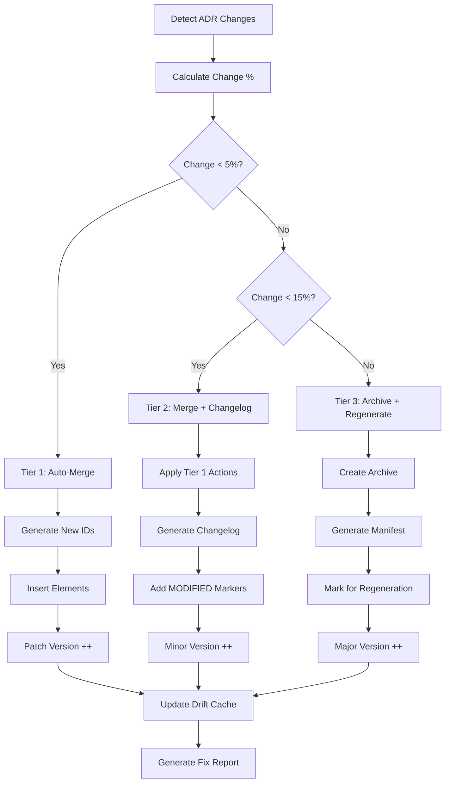

# doc-sys-fixer

## Purpose

Automated **fix skill** that reads the latest review report and applies fixes to SYS (System Design Specification) documents. This skill bridges the gap between `doc-sys-reviewer` (which identifies issues) and the corrected SYS, enabling iterative improvement cycles.

**Layer**: 6 (SYS Quality Improvement)

**Upstream**: SYS document, Review Report (`SYS-NN.F_fix_report_vNNN.md`), ADR (for architecture alignment)

**Downstream**: Fixed SYS, Fix Report (`SYS-NN.F_fix_report_vNNN.md`)

---

## When to Use This Skill

Use `doc-sys-fixer` when:

- **After Review**: Run after `doc-sys-reviewer` identifies issues
- **Iterative Improvement**: Part of Review -> Fix -> Review cycle
- **Automated Pipeline**: CI/CD integration for quality gates
- **Batch Fixes**: Apply fixes to multiple SYS documents based on review reports

**Do NOT use when**:
- No review report exists (run `doc-sys-reviewer` first)
- Creating new SYS (use `doc-sys` or `doc-sys-autopilot`)
- Only need validation (use `doc-sys-validator`)

---

## Skill Dependencies

| Skill | Purpose | When Used |
|-------|---------|-----------|
| `doc-sys-reviewer` | Source of issues to fix | Input (reads review report) |
| `doc-naming` | Element ID standards | Fix element IDs |
| `doc-sys` | SYS creation rules | Create missing sections |
| `doc-adr` | ADR alignment reference | Verify architecture traceability |

---

## Workflow Overview


---

## Fix Phases

### Phase 1: Create Missing Files

Creates files that are referenced but don't exist.

**Scope**:

| Missing File | Action | Template Used |
|--------------|--------|---------------|
| `SYS-00_INDEX.md` | Create SYS index | Index template |
| `COMP_*.md` | Create placeholder component doc | Component template |
| `INT_*.md` | Create placeholder interface doc | Interface template |
| Reference docs (`*_REF_*.md`) | Create placeholder | REF template |

**SYS Index Template**:

```markdown
---
title: "SYS-00: System Design Specifications Index"
tags:
  - sys
  - index
  - reference
custom_fields:
  document_type: index
  artifact_type: SYS-REFERENCE
  layer: 6
---

# SYS-00: System Design Specifications Index

Master index of all System Design Specifications for this project.

## System Components

| SYS ID | Component | Status | Last Updated | ADR Refs |
|--------|-----------|--------|--------------|----------|
| SYS-01 | [Name] | Draft/Final | YYYY-MM-DD | ADR-01, ADR-02 |

## Component Relationships

| Component | Depends On | Depended By |
|-----------|------------|-------------|
| SYS-01 | | |

## Interface Catalog

| Interface ID | Type | Provider | Consumer |
|--------------|------|----------|----------|
| INT-01 | API | SYS-01 | SYS-02 |

---

*Maintained by doc-sys-fixer. Update when adding new SYS documents.*
```

**Component Placeholder Template**:

```markdown
---
title: "Component Specification: [Component Name]"
tags:
  - component
  - system-design
  - reference
custom_fields:
  document_type: component
  status: placeholder
  created_by: doc-sys-fixer
---

# Component Specification: [Component Name]

> **Status**: Placeholder - Requires completion

## 1. Overview

[TODO: Document component overview]

## 2. Responsibilities

| Responsibility | Description |
|----------------|-------------|
| [Name] | [What it handles] |

## 3. Interfaces

| Interface | Type | Direction | Connected To |
|-----------|------|-----------|--------------|
| [Name] | REST/gRPC/Event | In/Out | [Component] |

## 4. Data Structures

[TODO: Document key data structures]

## 5. Architecture Decisions

| ADR | Title | Impact |
|-----|-------|--------|
| ADR-NN | [Title] | [How it affects this component] |

---

*Created by doc-sys-fixer as placeholder. Complete this document to resolve broken link issues.*
```

**Interface Placeholder Template**:

```markdown
---
title: "Interface Specification: [Interface Name]"
tags:
  - interface
  - system-design
  - reference
custom_fields:
  document_type: interface
  status: placeholder
  created_by: doc-sys-fixer
---

# Interface Specification: [Interface Name]

> **Status**: Placeholder - Requires completion

## 1. Overview

[TODO: Document interface purpose]

## 2. Protocol

| Attribute | Value |
|-----------|-------|
| Type | REST / gRPC / Event / Message |
| Format | JSON / Protobuf / Avro |
| Authentication | JWT / API Key / mTLS |

## 3. Operations

| Operation | Method | Path/Topic | Description |
|-----------|--------|------------|-------------|
| [Name] | GET/POST | /path | [Description] |

## 4. Data Models

[TODO: Document request/response models]

---

*Created by doc-sys-fixer as placeholder. Complete this document to resolve broken link issues.*
```

---

### Phase 2: Fix Broken Links

Updates links to point to correct locations.

**Fix Actions**:

| Issue Code | Issue | Fix Action |
|------------|-------|------------|
| REV-L001 | Broken internal link | Update path or create target file |
| REV-L002 | External link unreachable | Add warning comment, keep link |
| REV-L003 | Absolute path used | Convert to relative path |
| REV-L004 | Missing ADR traceability link | Add link to corresponding ADR |

**Path Resolution Logic**:

```python
def fix_link_path(sys_location: str, target_path: str) -> str:
    """Calculate correct relative path based on SYS location."""

    # Monolithic SYS: docs/06_SYS/SYS-01.md
    # Sectioned SYS: docs/06_SYS/SYS-01_slug/SYS-01.3_section.md

    if is_sectioned_sys(sys_location):
        # Need to go up one more level
        return "../" + calculate_relative_path(sys_location, target_path)
    else:
        return calculate_relative_path(sys_location, target_path)
```

**Cross-Layer Link Fix**:

| Source | Target | Link Pattern |
|--------|--------|--------------|
| SYS | ADR | `../05_ADR/ADR-NN.md` |
| SYS | REQ | `../07_REQ/REQ-NN.md` |
| SYS | CTR | `../08_CTR/CTR-NN.md` |

---

### Phase 3: Fix Element IDs

Converts invalid element IDs to correct format.

**Conversion Rules**:

| Pattern | Issue | Conversion |
|---------|-------|------------|
| `SYS.NN.06.SS` | Code 06 invalid for SYS | `SYS.NN.17.SS` (Component) |
| `COMP-XXX` | Legacy pattern | `SYS.NN.17.SS` |
| `INT-XXX` | Legacy pattern | `SYS.NN.18.SS` |
| `MOD-XXX` | Legacy pattern | `SYS.NN.19.SS` |
| `DEP-XXX` | Legacy pattern | `SYS.NN.20.SS` |
| `FLOW-XXX` | Legacy pattern | `SYS.NN.21.SS` |

**Type Code Mapping** (SYS-specific valid codes: 01, 05, 17, 18, 19, 20, 21):

| Code | Element Type | Description |
|------|--------------|-------------|
| 01 | Functional Requirement | System function specification |
| 05 | Use Case | System use case |
| 17 | Component | System component |
| 18 | Interface | System interface |
| 19 | Module | Software module |
| 20 | Dependency | External dependency |
| 21 | Data Flow | Data flow specification |

**Invalid Code Conversions**:

| Invalid Code | Valid Code | Element Type |
|--------------|------------|--------------|
| 06 | 01 | Functional Requirement (was Acceptance Criteria) |
| 13 | 17 | Component (was Decision Context) |
| 14 | 18 | Interface (was Decision Statement) |
| 22 | 19 | Module (was Feature Item) |

**Regex Patterns**:

```python
# Find element IDs with invalid type codes for SYS
invalid_sys_type_06 = r'SYS\.(\d{2})\.06\.(\d{2})'
replacement_06 = r'SYS.\1.01.\2'

invalid_sys_type_13 = r'SYS\.(\d{2})\.13\.(\d{2})'
replacement_13 = r'SYS.\1.17.\2'

# Find legacy patterns
legacy_comp = r'###\s+COMP-(\d+):'
legacy_int = r'###\s+INT-(\d+):'
legacy_mod = r'###\s+MOD-(\d+):'
legacy_dep = r'###\s+DEP-(\d+):'
legacy_flow = r'###\s+FLOW-(\d+):'
```

---

### Phase 4: Fix Content Issues

Addresses placeholders and incomplete content.

**Fix Actions**:

| Issue Code | Issue | Fix Action |
|------------|-------|------------|
| REV-P001 | `[TODO]` placeholder | Flag for manual completion (cannot auto-fix) |
| REV-P002 | `[TBD]` placeholder | Flag for manual completion (cannot auto-fix) |
| REV-P003 | Template date `YYYY-MM-DD` | Replace with current date |
| REV-P004 | Template name `[Name]` | Replace with metadata author or flag |
| REV-P005 | Empty section | Add minimum template content |
| REV-P006 | Missing component status | Add "Draft" as default status |

**Auto-Replacements**:

```python
replacements = {
    'YYYY-MM-DDTHH:MM:SS': datetime.now().strftime('%Y-%m-%dT%H:%M:%S'),
    'YYYY-MM-DD': datetime.now().strftime('%Y-%m-%d'),
    'MM/DD/YYYY': datetime.now().strftime('%m/%d/%Y'),
    '[Current date]': datetime.now().strftime('%Y-%m-%dT%H:%M:%S'),
    '[Status]': 'Draft',
    '[Version]': '0.1',
}
```

**SYS-Specific Content Fixes**:

| Section | Missing Content | Auto-Fill |
|---------|-----------------|-----------|
| Status | Empty | "Draft" |
| Version | Empty | "0.1" |
| Last Updated | Empty | Current date |
| Component Type | Empty | "[Specify type]" |

---

### Phase 5: Update References

Ensures traceability and cross-references are correct.

**Fix Actions**:

| Issue | Fix Action |
|-------|------------|
| Missing `@ref:` for created files | Add reference tag |
| Incorrect cross-SYS path | Update to correct relative path |
| Missing ADR traceability | Add `@trace: ADR-NN.SS` tag |
| Missing REQ forward reference | Add `@trace: REQ-NN.SS` tag |

**Traceability Matrix Update**:

```markdown
## Traceability

| SYS Element | Traces From | Traces To | Type |
|-------------|-------------|-----------|------|
| SYS.01.17.01 | ADR.01.14.01 | REQ.01.01.01 | Component->Requirement |
| SYS.01.18.01 | ADR.01.14.02 | CTR.01.09.01 | Interface->Contract |
```

---

### Phase 6: Handle Upstream Drift (Auto-Merge)

Addresses issues where upstream source documents (ADR) have changed since SYS creation. Uses a tiered auto-merge system based on change percentage.

**Upstream**: ADR (Architecture Decision Records)
**Downstream**: REQ (Requirements Specifications)
**ID Pattern**: `SYS.NN.TT.SS` (Document.Type.Sequence)

#### Tiered Auto-Merge System

| Tier | Change % | Action | Version Impact |
|------|----------|--------|----------------|
| Tier 1 | < 5% | Auto-merge additions | Patch (+0.0.1) |
| Tier 2 | 5-15% | Auto-merge with detailed changelog | Minor (+0.1.0) |
| Tier 3 | > 15% | Archive current, trigger regeneration | Major (+1.0.0) |

#### Change Percentage Calculation

```python
def calculate_change_percentage(upstream_diff: dict) -> float:
    """Calculate change percentage from upstream ADR modifications.

    Args:
        upstream_diff: Dict containing added, modified, deprecated counts

    Returns:
        Change percentage (0.0 to 100.0)
    """
    total_elements = upstream_diff.get('total_elements', 0)
    if total_elements == 0:
        return 0.0

    added = upstream_diff.get('added', 0)
    modified = upstream_diff.get('modified', 0)
    deprecated = upstream_diff.get('deprecated', 0)

    # Additions count less than modifications
    weighted_changes = (added * 0.5) + (modified * 1.0) + (deprecated * 0.3)

    return min(100.0, (weighted_changes / total_elements) * 100)
```

#### Tier 1: Auto-Merge Additions (< 5%)

**Trigger**: Minor additions from ADR that do not affect existing SYS elements.

**Actions**:

1. Parse new ADR decisions/constraints
2. Generate new SYS element IDs (auto-increment sequence)
3. Insert new elements in appropriate sections
4. Increment patch version (e.g., 1.0.0 -> 1.0.1)

**Auto-Generated ID Pattern**:

```python
def generate_sys_id(sys_doc_num: str, type_code: str, existing_ids: list) -> str:
    """Generate next available SYS element ID.

    Args:
        sys_doc_num: Document number (e.g., "01")
        type_code: Element type code (e.g., "17" for Component)
        existing_ids: List of existing IDs for this type

    Returns:
        Next available ID (e.g., "SYS.01.17.13")
    """
    # Extract sequence numbers from existing IDs
    sequences = [int(id.split('.')[-1]) for id in existing_ids
                 if id.startswith(f'SYS.{sys_doc_num}.{type_code}.')]

    next_seq = max(sequences, default=0) + 1
    return f'SYS.{sys_doc_num}.{type_code}.{next_seq:02d}'

# Example: If SYS-01 has SYS.01.17.01 through SYS.01.17.12
# New ID: SYS.01.17.13
```

**Tier 1 Fix Report Entry**:

```markdown
## Tier 1 Auto-Merge Applied

| ADR Source | New SYS Element | Section | Description |
|------------|-----------------|---------|-------------|
| ADR-01.14.05 | SYS.01.17.13 | Components | New auth cache component |
| ADR-01.14.06 | SYS.01.18.08 | Interfaces | New event bus interface |

**Version**: 1.0.0 -> 1.0.1
**Change Percentage**: 3.2%
```

#### Tier 2: Auto-Merge with Changelog (5-15%)

**Trigger**: Moderate changes requiring documentation but not restructuring.

**Actions**:

1. Apply all Tier 1 actions
2. Generate detailed changelog section
3. Update traceability matrix
4. Add `[MODIFIED]` markers to affected elements
5. Increment minor version (e.g., 1.0.1 -> 1.1.0)

**Changelog Format**:

```markdown
## Changelog (Auto-Generated)

### Version 1.1.0 (2026-02-10)

**Upstream Trigger**: ADR-01.md v2.0 (modified 2026-02-09)

#### Added
- SYS.01.17.13: Authentication cache component (from ADR-01.14.05)
- SYS.01.17.14: Rate limiting component (from ADR-01.14.06)
- SYS.01.18.08: Event bus interface (from ADR-01.14.07)

#### Modified
- SYS.01.17.03: Updated auth flow to include cache [MODIFIED]
- SYS.01.18.02: Added rate limit headers to API interface [MODIFIED]

#### Deprecated
- None

**Traceability Impact**: 5 REQ elements may need review
```

**Modified Element Marker**:

```markdown
### SYS.01.17.03: Authentication Service [MODIFIED]

<!-- MODIFIED: 2026-02-10 via auto-merge from ADR-01.14.05 -->
<!-- Previous version: 1.0.1 -->

**Component**: Authentication Service
**Status**: Active
**Modified Reason**: ADR-01 added caching requirement

[Component details...]
```

#### Tier 3: Archive and Regenerate (> 15%)

**Trigger**: Significant upstream changes requiring SYS restructuring.

**Actions**:

1. Create archive of current SYS version
2. Generate archive manifest
3. Flag for regeneration via `doc-sys-autopilot`
4. Increment major version (e.g., 1.1.0 -> 2.0.0)
5. Preserve deprecated elements with `[DEPRECATED]` markers

**Archive Manifest Format**:

```json
{
  "archive_id": "SYS-01_v1.1.0_20260210",
  "archive_date": "2026-02-10T16:30:00",
  "archived_version": "1.1.0",
  "new_version": "2.0.0",
  "archive_location": "tmp/archive/SYS-01_v1.1.0_20260210/",
  "trigger": {
    "upstream_document": "ADR-01.md",
    "upstream_version": "3.0",
    "change_percentage": 23.5,
    "tier": 3
  },
  "preserved_files": [
    "SYS-01.md",
    "SYS-01.1_components.md",
    "SYS-01.2_interfaces.md"
  ],
  "regeneration_required": true,
  "regeneration_command": "/doc-sys-autopilot ADR-01 --from-archive SYS-01_v1.1.0_20260210"
}
```

**Archive Directory Structure**:

```
tmp/archive/SYS-01_v1.1.0_20260210/
├── MANIFEST.json
├── SYS-01.md
├── SYS-01.1_components.md
├── SYS-01.2_interfaces.md
├── .drift_cache.json
└── CHANGELOG.md
```

#### No-Deletion Policy

Elements are NEVER deleted during auto-merge. Instead, mark as deprecated:

**Deprecated Element Format**:

```markdown
### SYS.01.17.05: Legacy Cache Service [DEPRECATED]

<!-- DEPRECATED: 2026-02-10 -->
<!-- Deprecation Reason: Superseded by SYS.01.17.13 per ADR-01.14.05 -->
<!-- Replaced By: SYS.01.17.13 -->
<!-- Original Version: 1.0.0 -->

> **Status**: DEPRECATED - Do not use in new implementations
> **Superseded By**: [SYS.01.17.13](#sys011713-authentication-cache)
> **Deprecation Date**: 2026-02-10

[Original content preserved for reference...]
```

**Deprecation Tracking**:

```markdown
## Deprecated Elements

| Element ID | Deprecated | Reason | Replaced By |
|------------|------------|--------|-------------|
| SYS.01.17.05 | 2026-02-10 | ADR-01.14.05 supersedes | SYS.01.17.13 |
| SYS.01.18.03 | 2026-02-10 | Interface redesign | SYS.01.18.08 |
```

#### Enhanced Drift Cache

After processing drift issues, update `.drift_cache.json` with merge history:

```json
{
  "sys_version": "1.1.0",
  "sys_updated": "2026-02-10T16:30:00",
  "drift_reviewed": "2026-02-10T16:30:00",
  "upstream_type": "ADR",
  "downstream_type": "REQ",
  "upstream_hashes": {
    "../../05_ADR/ADR-01.md": "a1b2c3d4e5f6...",
    "../../05_ADR/ADR-01.md#decision-3": "g7h8i9j0k1l2...",
    "../../05_ADR/ADR-03.md": "m3n4o5p6q7r8..."
  },
  "merge_history": [
    {
      "merge_date": "2026-02-10T16:30:00",
      "tier": 2,
      "change_percentage": 8.5,
      "version_before": "1.0.1",
      "version_after": "1.1.0",
      "elements_added": ["SYS.01.17.13", "SYS.01.18.08"],
      "elements_modified": ["SYS.01.17.03", "SYS.01.18.02"],
      "elements_deprecated": [],
      "upstream_trigger": "ADR-01.md v2.0"
    }
  ],
  "acknowledged_drift": [
    {
      "document": "ADR-03.md",
      "acknowledged_date": "2026-02-08",
      "reason": "Informational only - no SYS impact"
    }
  ],
  "pending_regeneration": null
}
```

#### Drift Detection Issue Codes

| Code | Severity | Description | Tier | Auto-Fix |
|------|----------|-------------|------|----------|
| REV-D001 | Info | Minor ADR addition (< 5% impact) | 1 | Yes |
| REV-D002 | Warning | Moderate ADR changes (5-15% impact) | 2 | Yes |
| REV-D003 | Error | Major ADR restructure (> 15% impact) | 3 | Partial |
| REV-D004 | Info | New ADR added to project | 1 | Yes |
| REV-D005 | Warning | ADR version incremented | 1-3 | Depends |

#### Drift Fix Workflow



#### Command Options for Drift Handling

| Option | Default | Description |
|--------|---------|-------------|
| `--auto-merge` | true | Enable tiered auto-merge system |
| `--merge-tier` | auto | Force specific tier (1, 2, 3, or auto) |
| `--acknowledge-drift` | false | Interactive drift acknowledgment mode |
| `--archive-path` | tmp/archive/ | Location for Tier 3 archives |
| `--preserve-deprecated` | true | Keep deprecated elements (no-deletion policy) |
| `--changelog-detail` | standard | Changelog verbosity (minimal, standard, verbose) |
| `--notify-downstream` | true | Flag REQ documents for review after merge |

---

## Command Usage

### Basic Usage

```bash
# Fix SYS based on latest review
/doc-sys-fixer SYS-01

# Fix with explicit review report
/doc-sys-fixer SYS-01 --review-report SYS-01.R_review_report_v001.md

# Fix and re-run review
/doc-sys-fixer SYS-01 --revalidate

# Fix with iteration limit
/doc-sys-fixer SYS-01 --revalidate --max-iterations 3
```

### Options

| Option | Default | Description |
|--------|---------|-------------|
| `--review-report` | latest | Specific review report to use |
| `--revalidate` | false | Run reviewer after fixes |
| `--max-iterations` | 3 | Max fix-review cycles |
| `--fix-types` | all | Specific fix types (comma-separated) |
| `--create-missing` | true | Create missing reference files |
| `--backup` | true | Backup SYS before fixing |
| `--dry-run` | false | Preview fixes without applying |
| `--acknowledge-drift` | false | Interactive drift acknowledgment mode |
| `--update-drift-cache` | true | Update .drift_cache.json after fixes |

### Fix Types

| Type | Description |
|------|-------------|
| `missing_files` | Create missing index, component, interface docs |
| `broken_links` | Fix link paths |
| `element_ids` | Convert invalid/legacy element IDs |
| `content` | Fix placeholders, dates, status |
| `references` | Update traceability and cross-references |
| `drift` | Handle upstream drift detection issues |
| `all` | All fix types (default) |

---

## Output Artifacts

### Fix Report

**Nested Folder Rule**: ALL SYS use nested folders (`SYS-NN_{slug}/`) regardless of size. Fix reports are stored alongside the SYS document in the nested folder.

**File Naming**: `SYS-NN.F_fix_report_vNNN.md`

**Location**: Inside the SYS nested folder: `docs/SYS/SYS-NN_{slug}/`

**Structure**:

```markdown
---
title: "SYS-NN.F: Fix Report v001"
tags:
  - sys
  - fix-report
  - quality-assurance
custom_fields:
  document_type: fix-report
  artifact_type: SYS-FIX
  layer: 6
  parent_doc: SYS-NN
  source_review: SYS-NN.R_review_report_v001.md
  fix_date: "YYYY-MM-DDTHH:MM:SS"
  fix_tool: doc-sys-fixer
  fix_version: "1.0"
---

# SYS-NN Fix Report v001

## Summary

| Metric | Value |
|--------|-------|
| Source Review | SYS-NN.R_review_report_v001.md |
| Issues in Review | 15 |
| Issues Fixed | 12 |
| Issues Remaining | 3 (manual review required) |
| Files Created | 3 |
| Files Modified | 4 |

## Files Created

| File | Type | Location |
|------|------|----------|
| SYS-00_INDEX.md | SYS Index | docs/06_SYS/ |
| COMP_AuthService.md | Component Placeholder | docs/00_REF/components/ |
| INT_UserAPI.md | Interface Placeholder | docs/00_REF/interfaces/ |

## Fixes Applied

| # | Issue Code | Issue | Fix Applied | File |
|---|------------|-------|-------------|------|
| 1 | REV-L001 | Broken index link | Created SYS-00_INDEX.md | SYS-01.md |
| 2 | REV-L001 | Broken component link | Created placeholder COMP file | SYS-01.md |
| 3 | REV-N004 | Element type 06 invalid | Converted to type 01 | SYS-01.md |
| 4 | REV-L003 | Absolute path used | Converted to relative | SYS-02.md |
| 5 | REV-N004 | Legacy COMP-XXX pattern | Converted to SYS.NN.17.SS | SYS-01.md |

## Issues Requiring Manual Review

| # | Issue Code | Issue | Location | Reason |
|---|------------|-------|----------|--------|
| 1 | REV-P001 | [TODO] placeholder | SYS-01:L67 | System expertise needed |
| 2 | REV-D001 | ADR drift detected | SYS-01:L145 | Review architecture changes |
| 3 | REV-R001 | Missing interface contract | SYS-01:L200 | Define API contract |

## Validation After Fix

| Metric | Before | After | Delta |
|--------|--------|-------|-------|
| Review Score | 85 | 94 | +9 |
| Errors | 4 | 0 | -4 |
| Warnings | 6 | 3 | -3 |

## Next Steps

1. Complete COMP_AuthService.md placeholder
2. Complete INT_UserAPI.md placeholder
3. Address remaining [TODO] placeholders
4. Review ADR drift and update system design if needed
5. Run `/doc-sys-reviewer SYS-01` to verify fixes
```

---

## Integration with Autopilot

This skill is invoked by `doc-sys-autopilot` in the Review -> Fix cycle:


**Autopilot Integration Points**:

| Phase | Action | Skill |
|-------|--------|-------|
| Phase 5a | Run initial review | `doc-sys-reviewer` |
| Phase 5b | Apply fixes if issues found | `doc-sys-fixer` |
| Phase 5c | Re-run review | `doc-sys-reviewer` |
| Phase 5d | Repeat until pass or max iterations | Loop |

---

## Error Handling

### Recovery Actions

| Error | Action |
|-------|--------|
| Review report not found | Prompt to run `doc-sys-reviewer` first |
| Cannot create file (permissions) | Log error, continue with other fixes |
| Cannot parse review report | Abort with clear error message |
| Max iterations exceeded | Generate report, flag for manual review |

### Backup Strategy

Before applying any fixes:

1. Create backup in `tmp/backup/SYS-NN_YYYYMMDD_HHMMSS/`
2. Copy all SYS files to backup location
3. Apply fixes to original files
4. If error during fix, restore from backup

---

## Related Skills

| Skill | Relationship |
|-------|--------------|
| `doc-sys-reviewer` | Provides review report (input) |
| `doc-sys-autopilot` | Orchestrates Review -> Fix cycle |
| `doc-sys-validator` | Structural validation |
| `doc-naming` | Element ID standards |
| `doc-sys` | SYS creation rules |
| `doc-adr` | Upstream architecture decisions |
| `doc-req` | Downstream requirements reference |

---

## Version History

| Version | Date | Changes |
|---------|------|---------|
| 2.0 | 2026-02-10 | Enhanced Phase 6 with tiered auto-merge system (Tier 1: <5% auto-merge, Tier 2: 5-15% with changelog, Tier 3: >15% archive and regenerate); Added change percentage calculation; Auto-generated IDs for new elements (SYS.NN.TT.SS pattern); No-deletion policy with [DEPRECATED] markers; Archive manifest creation; Enhanced drift cache with merge history; ADR upstream / REQ downstream integration |
| 1.0 | 2026-02-10 | Initial skill creation; 6-phase fix workflow; SYS Index, Component, and Interface file creation; Element ID conversion (types 01, 05, 17, 18, 19, 20, 21); Broken link fixes; ADR upstream drift handling; Integration with autopilot Review->Fix cycle |
