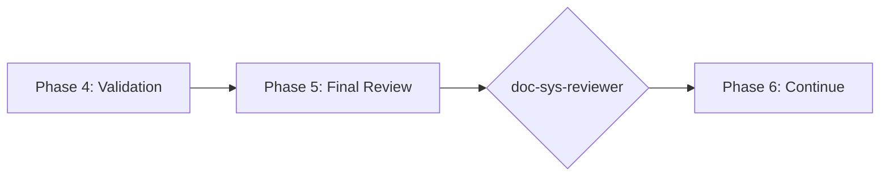

# doc-sys-reviewer

## Purpose

Comprehensive **content review and quality assurance** for System Requirements (SYS) documents. This skill performs deep content analysis beyond structural validation, checking requirement completeness, ADR alignment, quality attribute coverage, interface definitions, and identifying issues that require manual architectural review.

**Layer**: 6 (SYS Quality Assurance)

**Upstream**: SYS (from `doc-sys-autopilot` or `doc-sys`)

**Downstream**: None (final QA gate before REQ generation)

---

## When to Use This Skill

Use `doc-sys-reviewer` when:

- **After SYS Generation**: Run immediately after `doc-sys-autopilot` completes
- **Manual SYS Edits**: After making manual changes to SYS
- **Pre-REQ Check**: Before running `doc-req-autopilot`
- **Periodic Review**: Regular quality checks on existing SYS
- **Architecture Reviews**: During system design reviews

**Do NOT use when**:
- SYS does not exist yet (use `doc-sys` or `doc-sys-autopilot` first)
- Need structural/schema validation only (use `doc-sys-validator`)
- Generating new SYS content (use `doc-sys`)

---

## Skill vs Validator: Key Differences

| Aspect | `doc-sys-validator` | `doc-sys-reviewer` |
|--------|---------------------|-------------------|
| **Focus** | Schema compliance, REQ-Ready score | Content quality, ADR alignment |
| **Checks** | Required sections, format | Quality attributes, interface completeness |
| **Auto-Fix** | Structural issues only | Content issues (links, formatting) |
| **Output** | REQ-Ready score (numeric) | Review score + issue list |
| **Phase** | Phase 4 (Validation) | Phase 5 (Final Review) |
| **Blocking** | REQ-Ready < threshold blocks | Review score < threshold flags |

---

## Review Checks

### 1. Functional Requirement Completeness

Validates all functional requirements are complete.

**Scope**:
- Each requirement has description
- Acceptance criteria defined
- Priority assigned
- Dependencies documented
- Rationale provided

**Error Codes**:

| Code | Severity | Description |
|------|----------|-------------|
| REV-FR001 | Error | Requirement missing description |
| REV-FR002 | Error | No acceptance criteria |
| REV-FR003 | Warning | Priority not assigned |
| REV-FR004 | Info | Dependencies not documented |
| REV-FR005 | Info | Rationale missing |

---

### 2. ADR Alignment

Validates SYS requirements trace to ADR decisions.

**Scope**:
- Requirements implement ADR decisions
- No conflicting requirements
- Technology choices consistent
- Architectural constraints honored

**Error Codes**:

| Code | Severity | Description |
|------|----------|-------------|
| REV-AA001 | Error | Requirement conflicts with ADR decision |
| REV-AA002 | Warning | Technology choice not in ADR |
| REV-AA003 | Warning | Requirement without ADR traceability |
| REV-AA004 | Info | Architectural constraint may be violated |

---

### 3. Quality Attribute Coverage

Validates non-functional requirements coverage.

**Scope**:
- Performance requirements defined
- Security requirements present
- Reliability/availability specified
- Scalability addressed
- Maintainability considered

**Error Codes**:

| Code | Severity | Description |
|------|----------|-------------|
| REV-QA001 | Error | No performance requirements |
| REV-QA002 | Error | Security requirements missing |
| REV-QA003 | Warning | Availability not specified |
| REV-QA004 | Warning | Scalability not addressed |
| REV-QA005 | Info | Maintainability not considered |

---

### 4. Interface Definition Completeness

Validates system interfaces are well-defined.

**Scope**:
- External interfaces documented
- Internal interfaces defined
- Data formats specified
- Protocols identified
- Error handling defined

**Error Codes**:

| Code | Severity | Description |
|------|----------|-------------|
| REV-IF001 | Error | External interface not documented |
| REV-IF002 | Warning | Data format not specified |
| REV-IF003 | Warning | Protocol not identified |
| REV-IF004 | Info | Error handling not defined |

---

### 5. Constraint Validation

Validates system constraints are reasonable.

**Scope**:
- Resource constraints realistic
- Time constraints achievable
- Budget constraints considered
- Technology constraints compatible

**Error Codes**:

| Code | Severity | Description |
|------|----------|-------------|
| REV-CV001 | Warning | Resource constraint may be unrealistic |
| REV-CV002 | Warning | Time constraint may be unachievable |
| REV-CV003 | Info | Budget constraint not documented |
| REV-CV004 | Warning | Technology constraint may be incompatible |

---

### 6. Placeholder Detection

Identifies incomplete content requiring replacement.

**Error Codes**:

| Code | Severity | Description |
|------|----------|-------------|
| REV-P001 | Error | [TODO] placeholder found |
| REV-P002 | Error | [TBD] placeholder found |
| REV-P003 | Warning | Template value not replaced |

---

### 7. Naming Compliance

Validates element IDs follow `doc-naming` standards.

**Scope**:
- Element IDs use `SYS.NN.TT.SS` format
- Element type codes valid for SYS (01, 05, 17, 18, 19, 20, 21)
- No legacy patterns (SR-NNN, SYS-NNN)

**Error Codes**:

| Code | Severity | Description |
|------|----------|-------------|
| REV-N001 | Error | Invalid element ID format |
| REV-N002 | Error | Element type code not valid for SYS |
| REV-N003 | Error | Legacy pattern detected |

---

## Review Score Calculation

**Scoring Formula**:

| Category | Weight | Calculation |
|----------|--------|-------------|
| Functional Requirement Completeness | 25% | (complete / total_reqs) × 25 |
| ADR Alignment | 20% | (aligned / total_reqs) × 20 |
| Quality Attribute Coverage | 20% | (covered / required_attrs) × 20 |
| Interface Definition Completeness | 15% | (complete_interfaces / total) × 15 |
| Constraint Validation | 5% | (valid_constraints / total) × 5 |
| Placeholder Detection | 5% | (no_placeholders ? 5 : 5 - count) |
| Naming Compliance | 10% | (valid_ids / total_ids) × 10 |

**Total**: Sum of all categories (max 100)

**Thresholds**:
- **PASS**: ≥ 90
- **WARNING**: 80-89
- **FAIL**: < 80

---

## Command Usage

```bash
# Review specific SYS
/doc-sys-reviewer SYS-01

# Review SYS by path
/doc-sys-reviewer docs/06_SYS/SYS-01_f1_iam.md

# Review all SYS
/doc-sys-reviewer all
```

---

## Output Report

Review reports are stored alongside the reviewed document per project standards.

**File Naming**: `SYS-NN.R_review_report_vNNN.md`

**Location**: Same folder as the reviewed SYS document.

### Versioning Rules

1. **First Review**: Creates `SYS-NN.R_review_report_v001.md`
2. **Subsequent Reviews**: Auto-increments version (v002, v003, etc.)
3. **Same-Day Reviews**: Each review gets unique version number

**Version Detection**: Scans folder for existing `SYS-NN.R_review_report_v*.md` files and increments.

**Example**:

```
docs/06_SYS/
├── SYS-01_f1_iam.md
├── SYS-01.R_review_report_v001.md    # First review
└── SYS-01.R_review_report_v002.md    # After fixes
```

### Delta Reporting

When previous reviews exist, include score comparison in the report.

See `REVIEW_DOCUMENT_STANDARDS.md` for complete versioning requirements.

---

## Integration with doc-sys-autopilot

This skill is invoked during Phase 5 of `doc-sys-autopilot`:



---

## Related Skills

| Skill | Relationship |
|-------|--------------|
| `doc-naming` | Naming standards for Check #7 |
| `doc-sys-autopilot` | Invokes this skill in Phase 5 |
| `doc-sys-validator` | Structural validation (Phase 4) |
| `doc-sys` | SYS creation rules |
| `doc-adr-reviewer` | Upstream QA |
| `doc-req-autopilot` | Downstream consumer |

---

## Version History

| Version | Date | Changes |
|---------|------|---------|
| 1.1 | 2026-02-10 | Added review versioning support (_vNNN pattern); Delta reporting for score comparison |
| 1.0 | 2026-02-10 | Initial skill creation with 7 review checks; ADR alignment; Quality attribute coverage; Interface completeness |
