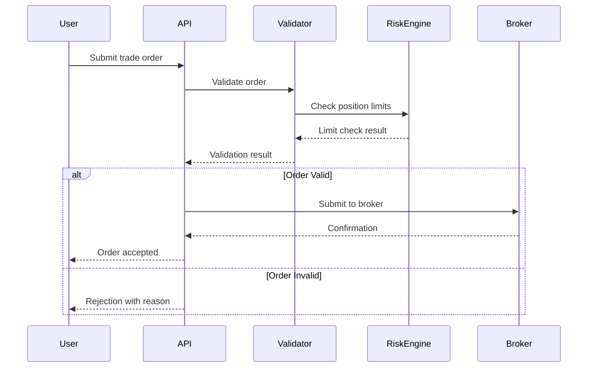

# doc-sys

## Purpose

Create **System Requirements (SYS)** documents - Layer 6 artifact in the SDD workflow that defines technical system requirements including functional capabilities and quality attributes.

**Layer**: 6

**Upstream**: BRD (Layer 1), PRD (Layer 2), EARS (Layer 3), BDD (Layer 4), ADR (Layer 5)

**Downstream Artifacts**: REQ (Layer 7), Code (Layer 13)

## Prerequisites

### Upstream Artifact Verification (CRITICAL)

**Before creating this document, you MUST:**

1. **List existing upstream artifacts**:
   ```bash
   ls docs/BRD/ docs/PRD/ docs/EARS/ docs/BDD/ docs/ADR/ docs/SYS/ docs/REQ/ 2>/dev/null
   ```

2. **Reference only existing documents** in traceability tags
3. **Use `null`** only when upstream artifact type genuinely doesn't exist
4. **NEVER use placeholders** like `BRD-XXX` or `TBD`
5. **Do NOT create missing upstream artifacts** - skip functionality instead


Before creating SYS, read:

1. **Shared Standards**: `.claude/skills/doc-flow/SHARED_CONTENT.md`
2. **Upstream ADR**: Read architecture decisions constraining system
3. **Template**: `ai_dev_flow/SYS/SYS-TEMPLATE.md`
4. **Creation Rules**: `ai_dev_flow/SYS/SYS_CREATION_RULES.md`
5. **Validation Rules**: `ai_dev_flow/SYS/SYS_VALIDATION_RULES.md`

## When to Use This Skill

Use `doc-sys` when:
- Have completed BRD through ADR (Layers 1-5)
- Need to define system-level technical requirements
- Translating architecture decisions into requirements
- Specifying functional system behavior and quality attributes
- You are at Layer 6 of the SDD workflow

## SYS-Specific Guidance

### 1. Required Sections

**Document Control** (MANDATORY - First section before all numbered sections)

**Core Sections**:
1. **Introduction**: System overview and scope
2. **System Requirements**: All requirements (functional and quality attributes)
3. **System Flows**: Interaction diagrams and workflows
4. **Technical Constraints**: ADR-imposed limitations
5. **Traceability**: Section 7 format

### 2. System Requirements

**Format**: Sequential numbering for all requirements (unified approach)

```markdown
## System Requirements

### 001: Trade Order Validation
**Description**: System SHALL validate all trade orders before submission
**Input**: Trade order (symbol, quantity, price, account)
**Processing**:
- Validate symbol exists and is tradeable
- Validate quantity is positive integer
- Validate price within reasonable range
- Validate account has sufficient buying power
**Output**: Validation result (pass/fail) with error details
**Source**: EARS.01.24.01, ADR-033
**Verification**: BDD.01.13.01

### 002: Order Validation Performance
**Description**: Order validation SHALL complete within 50ms at P95
**Measurement**: P50 <25ms, P95 <50ms, P99 <100ms
**Rationale**: User experience requires sub-second feedback per PRD-01
**Source**: PRD.01.07.02, EARS.01.24.02
**Verification**: Performance benchmarks, load testing
**Traceability**: @brd: BRD.01.01.02 | @prd: PRD.01.07.02

### 003: System Availability
**Description**: System SHALL maintain 99.9% uptime during market hours
**Measurement**: Monthly uptime >99.9% (43.2 minutes downtime max)
**Rationale**: Trading system criticality requires high availability
**Source**: BRD.01.01.03
**Verification**: Uptime monitoring, incident tracking
**Traceability**: @brd: BRD.01.01.03
```

**Note**: All requirements use sequential numbering (`001`, `002`, `003`...). Use folder structure, tags, or document sections for categorization if needed.

### 3. System Flows

**Use Mermaid diagrams ONLY** (text-based diagrams prohibited per `ai_dev_flow/DIAGRAM_STANDARDS.md`):

```markdown
## System Flows

### Flow 1: Trade Order Submission


```

### 4. Technical Constraints

**From ADR decisions**:

```markdown
## Technical Constraints

### TC-001: Database Technology
**Constraint**: System MUST use PostgreSQL per ADR-033
**Impact**: All data models use PostgreSQL-specific features
**Verification**: Architecture review, code inspection

### TC-002: API Protocol
**Constraint**: External APIs MUST use REST per ADR-045
**Impact**: No GraphQL or gRPC for external interfaces
**Verification**: API design review, contract validation
```

## Tag Format Convention (By Design)

The SDD framework uses two distinct notation systems for cross-references:

| Notation | Format        | Artifacts                               | Purpose                                                             |
|----------|---------------|----------------------------------------|---------------------------------------------------------------------|
| Dash     | TYPE-NN      | ADR, SPEC, CTR, IPLAN, ICON            | Technical artifacts - references to files/documents                 |
| Dot      | TYPE.NN.TT.SS | BRD, PRD, EARS, BDD, SYS, REQ, IMPL, TASKS | Hierarchical artifacts - references to elements inside documents |

**Key Distinction**:
- `@adr: ADR-033` → Points to the document `ADR-033_risk_limit_enforcement.md`
- `@brd: BRD.17.01.01` → Points to element 01.01 inside document `BRD-017.md`

## Unified Element ID Format (MANDATORY)

**For hierarchical requirements (BRD, PRD, EARS, BDD, SYS, REQ)**:
- **Always use**: `TYPE.NN.TT.SS` (dot separator, 4-segment unified format)
- **Never use**: `TYPE-NN:NNN` (colon separator - DEPRECATED)
- **Never use**: `TYPE.NN.TT` (3-segment format - DEPRECATED)

Examples:
- `@brd: BRD.17.01.01` ✅
- `@brd: BRD.017.001` ❌ (old 3-segment format)


## Cumulative Tagging Requirements

**Layer 6 (SYS)**: Must include tags from Layers 1-5 (BRD, PRD, EARS, BDD, ADR)

**Tag Count**: 5 tags (@brd, @prd, @ears, @bdd, @adr)

**Format**:
```markdown
## Traceability

**Required Tags** (Cumulative Tagging Hierarchy - Layer 6):
```markdown
@brd: BRD.01.01.03
@prd: PRD.01.07.02, PRD.01.07.15
@ears: EARS.01.24.01, EARS.01.24.02
@bdd: BDD.01.13.01
@adr: ADR-033, ADR-045
```

**Upstream Sources**:
- [BRD-01](../BRD/BRD-01_platform.md#BRD-01)
- [PRD-01](../PRD/PRD-01_integration.md#PRD-01)
- [EARS-01](../EARS/EARS-01_risk.md#EARS-01)
- [BDD-01](../BDD/BDD-01_limits.feature)
- [ADR-033](../ADR/ADR-033_database.md#ADR-033)

**Downstream Artifacts**:
- REQ-NN (to be created) - Atomic requirements
```

## Upstream/Downstream Artifacts

**Upstream Sources**:
- **BRD** (Layer 1) - Business requirements
- **PRD** (Layer 2) - Product features
- **EARS** (Layer 3) - Formal requirements
- **BDD** (Layer 4) - Test scenarios
- **ADR** (Layer 5) - Architecture decisions (CRITICAL - defines constraints)

**Downstream Artifacts**:
- **REQ** (Layer 7) - Atomic requirements decomposed from SYS
- **Code** (Layer 13) - Implementation of system requirements

**Same-Type Document Relationships** (conditional):
- `@related-sys: SYS-NN` - SYS documents sharing system context
- `@depends-sys: SYS-NN` - SYS that must be implemented first

## Creation Process

### Step 1: Read Upstream Artifacts

Especially focus on ADR (Layer 5) - architecture decisions constrain system requirements.

### Step 2: Reserve ID Number

Check `ai_dev_flow/SYS/` for next available ID number.

### Step 3: Create SYS File

**Location**: `docs/SYS/SYS-NN_{slug}.md` (template available at `ai_dev_flow/SYS/`)

**Example**: `docs/SYS/SYS-01_order_management.md`

### Step 4: Fill Document Control Section

Complete metadata and Document Revision History table.

### Step 5: Define System Requirements

For each requirement (functional or quality attribute):
- Number sequentially as `NNN` (001, 002, 003...)
- Specify inputs, processing, outputs (for functional)
- Specify measurable criteria (for quality attributes)
- Reference upstream EARS/PRD
- Link to BDD verification or define verification method

### Step 6: Create System Flows

Use Mermaid diagrams (not Python code) to visualize:
- Sequence diagrams for interactions
- Flowcharts for logic
- State diagrams for workflows

### Step 7: Document Technical Constraints

From ADR decisions:
- List each constraint
- Explain impact
- Define verification

### Step 8: Add Cumulative Tags

Include all 5 upstream tags (@brd, @prd, @ears, @bdd, @adr).

### Step 9: Create/Update Traceability Matrix

**MANDATORY**: Update traceability matrix (template: `ai_dev_flow/SYS/SYS-000_TRACEABILITY_MATRIX-TEMPLATE.md`)

### Step 10: Validate SYS

```bash
# Validate cumulative tagging (script available)
python ai_dev_flow/scripts/validate_tags_against_docs.py --artifact SYS-01 --expected-layers brd,prd,ears,bdd,adr --strict

# Note: SYS-specific template validation script is planned but not yet available.
# Use manual checklist below and cross-document validation instead.
```

### Step 11: Commit Changes

Commit SYS file and traceability matrix.

## Validation

### Automated Validation

```bash
# Quality gates (from repository root)
./scripts/validate_quality_gates.sh docs/SYS/SYS-01_order.md

# Cumulative tagging validation
python ai_dev_flow/scripts/validate_tags_against_docs.py \
  --artifact SYS-01 \
  --expected-layers brd,prd,ears,bdd,adr \
  --strict

# Cross-document validation with auto-fix
python ai_dev_flow/scripts/validate_cross_document.py --document docs/SYS/SYS-01_order.md --auto-fix
```

### Manual Checklist

- [ ] Document Control section at top
- [ ] Requirements numbered sequentially (001, 002, 003...)
- [ ] Each requirement has measurable criteria
- [ ] System flows use Mermaid diagrams
- [ ] Technical constraints from ADR documented
- [ ] Cumulative tags: @brd, @prd, @ears, @bdd, @adr included
- [ ] Each requirement references upstream source
- [ ] Verification method specified for each requirement
- [ ] Traceability matrix updated

### Diagram Standards
All diagrams MUST use Mermaid syntax. Text-based diagrams (ASCII art, box drawings) are prohibited.
See: `ai_dev_flow/DIAGRAM_STANDARDS.md` and `mermaid-gen` skill.

## Common Pitfalls

1. **Vague requirements**: Must be measurable (not "fast" but "P95 <50ms")
2. **Missing ADR constraints**: System requirements must respect ADR decisions
3. **Text-based diagrams**: Use Mermaid ONLY, not ASCII art or code blocks
4. **Missing cumulative tags**: Layer 6 must include all 5 upstream tags
5. **No verification method**: Each requirement needs test approach

## Post-Creation Validation (MANDATORY - NO CONFIRMATION)

**CRITICAL**: Execute this validation loop IMMEDIATELY after document creation. Do NOT proceed to next document until validation passes.

### Automatic Validation Loop

```
LOOP:
  1. Run: python ai_dev_flow/scripts/validate_cross_document.py --document {doc_path} --auto-fix
  2. IF errors fixed: GOTO LOOP (re-validate)
  3. IF warnings fixed: GOTO LOOP (re-validate)
  4. IF unfixable issues: Log for manual review, continue
  5. IF clean: Mark VALIDATED, proceed
```

### Validation Command

```bash
# Per-document validation (Phase 1)
python ai_dev_flow/scripts/validate_cross_document.py --document docs/SYS/SYS-NN_slug.md --auto-fix

# Layer validation (Phase 2) - run when all SYS documents complete
python ai_dev_flow/scripts/validate_cross_document.py --layer SYS --auto-fix
```

### Layer-Specific Upstream Requirements

| This Layer | Required Upstream Tags | Count |
|------------|------------------------|-------|
| SYS (Layer 6) | @brd, @prd, @ears, @bdd, @adr | 5 tags |

### Auto-Fix Actions (No Confirmation Required)

| Issue | Fix Action |
|-------|------------|
| Missing @brd/@prd/@ears/@bdd/@adr tag | Add with upstream document reference |
| Invalid tag format | Correct to TYPE.NN.TT.SS (4-segment) or TYPE-NN format |
| Broken link | Recalculate path from current location |
| Missing traceability section | Insert from template |

### Validation Codes Reference

| Code | Description | Severity |
|------|-------------|----------|
| XDOC-001 | Referenced requirement ID not found | ERROR |
| XDOC-002 | Missing cumulative tag | ERROR |
| XDOC-003 | Upstream document not found | ERROR |
| XDOC-006 | Tag format invalid | ERROR |
| XDOC-007 | Gap in cumulative tag chain | ERROR |
| XDOC-009 | Missing traceability section | ERROR |

### Quality Gate

**Blocking**: YES - Cannot proceed to next document until Phase 1 validation passes with 0 errors.

---

## Next Skill

After creating SYS, use:

**`doc-req`** - Create Atomic Requirements (Layer 7)

The REQ will:
- Decompose SYS into atomic requirements
- Include all 6 upstream tags (@brd through @sys)
- Use REQ v3.0 format (12 sections)
- Achieve ≥90% SPEC-readiness

## Reference Documents

SYS artifacts do not support REF documents. Reference documents are limited to **BRD and ADR types only** per the SDD framework.

For supplementary documentation needs, create:
- **BRD-REF**: Business context documentation
- **ADR-REF**: System architecture guides, QA attribute catalogs

## Related Resources

- **Template**: `ai_dev_flow/SYS/SYS-TEMPLATE.md` (primary authority)
- **SYS Creation Rules**: `ai_dev_flow/SYS/SYS_CREATION_RULES.md`
- **SYS Validation Rules**: `ai_dev_flow/SYS/SYS_VALIDATION_RULES.md`
- **SYS README**: `ai_dev_flow/SYS/README.md`
- **Shared Standards**: `.claude/skills/doc-flow/SHARED_CONTENT.md`

**Section Templates** (for documents >25K tokens):
- Index template: `ai_dev_flow/SYS/SYS-SECTION-0-TEMPLATE.md`
- Content template: `ai_dev_flow/SYS/SYS-SECTION-TEMPLATE.md`
- Reference: `ai_dev_flow/ID_NAMING_STANDARDS.md` (Section-Based File Splitting)

## Quick Reference

**SYS Purpose**: Define system-level technical requirements

**Layer**: 6

**Tags Required**: @brd, @prd, @ears, @bdd, @adr (5 tags)

**Key Sections**:
- System Requirements (sequential numbering: 001, 002, 003...)
- System Flows (Mermaid diagrams)
- Technical Constraints (from ADR)

**Next**: doc-req
