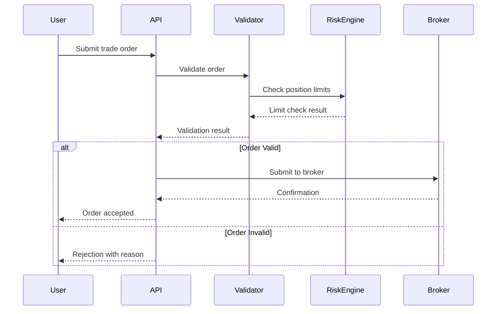

# doc-sys

## Purpose

Create **System Requirements (SYS)** documents - Layer 6 artifact in the SDD workflow that defines technical system requirements including functional capabilities and non-functional qualities.

**Layer**: 6

**Upstream**: BRD (Layer 1), PRD (Layer 2), EARS (Layer 3), BDD (Layer 4), ADR (Layer 5)

**Downstream Artifacts**: REQ (Layer 7), Code (Layer 13)

## Prerequisites

### Upstream Artifact Verification (CRITICAL)

**Before creating this document, you MUST:**

1. **List existing upstream artifacts**:
   ```bash
   ls docs/BRD/ docs/PRD/ docs/EARS/ docs/BDD/ docs/ADR/ docs/SYS/ docs/REQ/ 2>/dev/null
   ```

2. **Reference only existing documents** in traceability tags
3. **Use `null`** only when upstream artifact type genuinely doesn't exist
4. **NEVER use placeholders** like `BRD-XXX` or `TBD`
5. **Do NOT create missing upstream artifacts** - skip functionality instead


Before creating SYS, read:

1. **Shared Standards**: `.claude/skills/doc-flow/SHARED_CONTENT.md`
2. **Upstream ADR**: Read architecture decisions constraining system
3. **Template**: `ai_dev_flow/SYS/SYS-TEMPLATE.md`
4. **Creation Rules**: `ai_dev_flow/SYS/SYS_CREATION_RULES.md`
5. **Validation Rules**: `ai_dev_flow/SYS/SYS_VALIDATION_RULES.md`

## When to Use This Skill

Use `doc-sys` when:
- Have completed BRD through ADR (Layers 1-5)
- Need to define system-level technical requirements
- Translating architecture decisions into requirements
- Specifying functional and non-functional system behavior
- You are at Layer 6 of the SDD workflow

## SYS-Specific Guidance

### 1. Required Sections

**Document Control** (MANDATORY - First section before all numbered sections)

**Core Sections**:
1. **Introduction**: System overview and scope
2. **Functional Requirements**: What system must do
3. **Non-Functional Requirements**: Quality attributes
4. **System Flows**: Interaction diagrams and workflows
5. **Technical Constraints**: ADR-imposed limitations
6. **Traceability**: Section 7 format

### 2. Functional Requirements

**Format**: Numbered functional requirements

```markdown
## Functional Requirements

### FR-001: Trade Order Validation
**Description**: System SHALL validate all trade orders before submission
**Input**: Trade order (symbol, quantity, price, account)
**Processing**:
- Validate symbol exists and is tradeable
- Validate quantity is positive integer
- Validate price within reasonable range
- Validate account has sufficient buying power
**Output**: Validation result (pass/fail) with error details
**Source**: EARS-001:E01, ADR-033
**Verification**: BDD-001:scenario-order-validation
```

### 3. Non-Functional Requirements

**Categories**:
- **Performance**: Latency, throughput, resource usage
- **Reliability**: Uptime, error rates, failover
- **Security**: Authentication, authorization, encryption
- **Scalability**: Load handling, horizontal scaling
- **Maintainability**: Code quality, testability
- **Observability**: Logging, metrics, tracing

**Format**:
```markdown
## Non-Functional Requirements

### NFR-001: Order Validation Performance
**Category**: Performance
**Requirement**: Order validation SHALL complete within 50ms at P95
**Measurement**: P50 <25ms, P95 <50ms, P99 <100ms
**Rationale**: User experience requires sub-second feedback per PRD-001
**Source**: PRD-001:KPI-performance, EARS-001:WITHIN-constraint
**Verification**: Performance benchmarks, load testing

### NFR-002: System Availability
**Category**: Reliability
**Requirement**: System SHALL maintain 99.9% uptime during market hours
**Measurement**: Monthly uptime >99.9% (43.2 minutes downtime max)
**Rationale**: Trading system criticality requires high availability
**Source**: BRD-001:success-criteria
**Verification**: Uptime monitoring, incident tracking
```

### 4. System Flows

**Use Mermaid diagrams** (per documentation standards - no Python code):

```markdown
## System Flows

### Flow 1: Trade Order Submission


```

### 5. Technical Constraints

**From ADR decisions**:

```markdown
## Technical Constraints

### TC-001: Database Technology
**Constraint**: System MUST use PostgreSQL per ADR-033
**Impact**: All data models use PostgreSQL-specific features
**Verification**: Architecture review, code inspection

### TC-002: API Protocol
**Constraint**: External APIs MUST use REST per ADR-045
**Impact**: No GraphQL or gRPC for external interfaces
**Verification**: API design review, contract validation
```

## Cumulative Tagging Requirements

**Layer 6 (SYS)**: Must include tags from Layers 1-5 (BRD, PRD, EARS, BDD, ADR)

**Tag Count**: 5 tags (@brd, @prd, @ears, @bdd, @adr)

**Format**:
```markdown
## Traceability

**Required Tags** (Cumulative Tagging Hierarchy - Layer 6):
```markdown
@brd: BRD-001:section-3
@prd: PRD-001:feature-2, PRD-001:kpi-performance
@ears: EARS-001:E01, EARS-001:S02
@bdd: BDD-001:scenario-order-validation
@adr: ADR-033, ADR-045
```

**Upstream Sources**:
- [BRD-001](../BRD/BRD-001_platform.md#BRD-001)
- [PRD-001](../PRD/PRD-001_integration.md#PRD-001)
- [EARS-001](../EARS/EARS-001_risk.md#EARS-001)
- [BDD-001](../BDD/BDD-001_limits.feature)
- [ADR-033](../ADR/ADR-033_database.md#ADR-033)

**Downstream Artifacts**:
- REQ-NNN (to be created) - Atomic requirements
```

## Upstream/Downstream Artifacts

**Upstream Sources**:
- **BRD** (Layer 1) - Business requirements
- **PRD** (Layer 2) - Product features
- **EARS** (Layer 3) - Formal requirements
- **BDD** (Layer 4) - Test scenarios
- **ADR** (Layer 5) - Architecture decisions (CRITICAL - defines constraints)

**Downstream Artifacts**:
- **REQ** (Layer 7) - Atomic requirements decomposed from SYS
- **Code** (Layer 13) - Implementation of system requirements

**Same-Type Document Relationships** (conditional):
- `@related-sys: SYS-NNN` - SYS documents sharing system context
- `@depends-sys: SYS-NNN` - SYS that must be implemented first

## Creation Process

### Step 1: Read Upstream Artifacts

Especially focus on ADR (Layer 5) - architecture decisions constrain system requirements.

### Step 2: Reserve ID Number

Check `ai_dev_flow/SYS/` for next available ID number.

### Step 3: Create SYS File

**Location**: `docs/SYS/SYS-NNN_{slug}.md` (template available at `ai_dev_flow/SYS/`)

**Example**: `docs/SYS/SYS-001_order_management.md`

### Step 4: Fill Document Control Section

Complete metadata and Document Revision History table.

### Step 5: Define Functional Requirements

For each capability:
- Number as FR-NNN
- Specify inputs, processing, outputs
- Reference upstream EARS/PRD
- Link to BDD verification

### Step 6: Define Non-Functional Requirements

For each quality attribute:
- Number as NFR-NNN
- Specify measurable criteria
- Define verification method
- Reference upstream KPIs

### Step 7: Create System Flows

Use Mermaid diagrams (not Python code) to visualize:
- Sequence diagrams for interactions
- Flowcharts for logic
- State diagrams for workflows

### Step 8: Document Technical Constraints

From ADR decisions:
- List each constraint
- Explain impact
- Define verification

### Step 9: Add Cumulative Tags

Include all 5 upstream tags (@brd, @prd, @ears, @bdd, @adr).

### Step 10: Create/Update Traceability Matrix

**MANDATORY**: Update `ai_dev_flow/SYS/SYS-000_TRACEABILITY_MATRIX.md`

### Step 11: Validate SYS

```bash
./ai_dev_flow/scripts/validate_sys_template.sh ai_dev_flow/SYS/SYS-001_*.md

python ai_dev_flow/scripts/validate_tags_against_docs.py --artifact SYS-001 --expected-layers brd,prd,ears,bdd,adr --strict
```

### Step 12: Commit Changes

Commit SYS file and traceability matrix.

## Validation

### Automated Validation

```bash
# Quality gates
./scripts/validate_quality_gates.sh ai_dev_flow/SYS/SYS-001_order.md

# Cumulative tagging
python ai_dev_flow/scripts/validate_tags_against_docs.py \
  --artifact SYS-001 \
  --expected-layers brd,prd,ears,bdd,adr \
  --strict
```

### Manual Checklist

- [ ] Document Control section at top
- [ ] Functional requirements numbered (FR-NNN)
- [ ] Non-functional requirements categorized (NFR-NNN)
- [ ] Each requirement has measurable criteria
- [ ] System flows use Mermaid diagrams
- [ ] Technical constraints from ADR documented
- [ ] Cumulative tags: @brd, @prd, @ears, @bdd, @adr included
- [ ] Each requirement references upstream source
- [ ] Verification method specified for each requirement
- [ ] Traceability matrix updated

## Common Pitfalls

1. **Vague NFRs**: Must be measurable (not "fast" but "P95 <50ms")
2. **Missing ADR constraints**: System requirements must respect ADR decisions
3. **Python code in diagrams**: Use Mermaid, not code blocks
4. **Missing cumulative tags**: Layer 6 must include all 5 upstream tags
5. **No verification method**: Each requirement needs test approach

## Next Skill

After creating SYS, use:

**`doc-req`** - Create Atomic Requirements (Layer 7)

The REQ will:
- Decompose SYS into atomic requirements
- Include all 6 upstream tags (@brd through @sys)
- Use REQ v3.0 format (12 sections)
- Achieve ≥90% SPEC-readiness

## Related Resources

- **SYS Creation Rules**: `ai_dev_flow/SYS/SYS_CREATION_RULES.md`
- **SYS Validation Rules**: `ai_dev_flow/SYS/SYS_VALIDATION_RULES.md`
- **SYS README**: `ai_dev_flow/SYS/README.md`
- **Shared Standards**: `.claude/skills/doc-flow/SHARED_CONTENT.md`

## Quick Reference

**SYS Purpose**: Define system-level technical requirements

**Layer**: 6

**Tags Required**: @brd, @prd, @ears, @bdd, @adr (5 tags)

**Key Sections**:
- Functional Requirements (FR-NNN)
- Non-Functional Requirements (NFR-NNN with categories)
- System Flows (Mermaid diagrams)
- Technical Constraints (from ADR)

**Next**: doc-req
