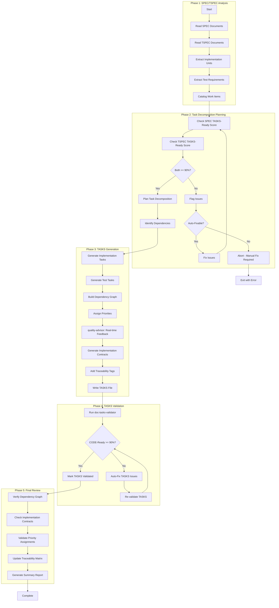
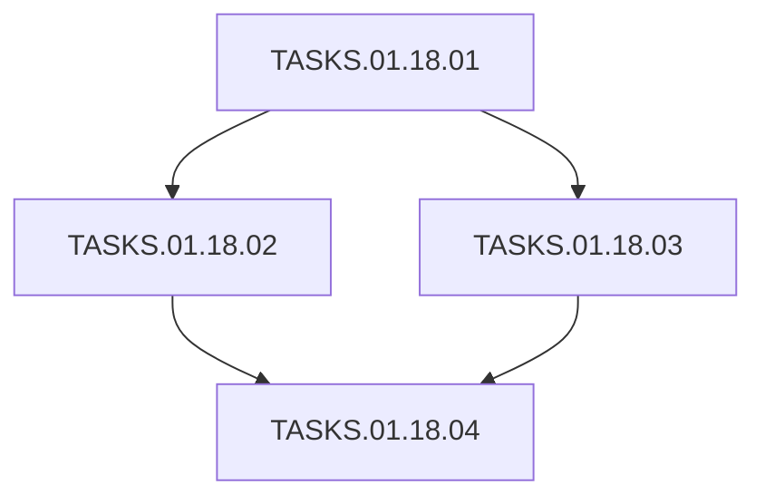

# doc-tasks-autopilot

## Purpose

Automated **Task Breakdown (TASKS)** generation pipeline that processes SPEC and TSPEC documents to generate AI-structured TODO tasks for implementation with CODE-Ready scoring.

**Layer**: 11 (Final documentation layer before code)

**Upstream**: SPEC (Layer 9), TSPEC (Layer 10)

**Downstream**: Code (Layer 12 - execution layer)

---

## Skill Dependencies

| Skill | Purpose | Phase |
|-------|---------|-------|
| `doc-naming` | Element ID format (TASKS.NN.TT.SS, codes 18, 30) | All Phases |
| `doc-spec-validator` | Validate SPEC TASKS-Ready score | Phase 2 |
| `doc-tspec-validator` | Validate TSPEC TASKS-Ready score | Phase 2 |
| `doc-tasks` | TASKS creation rules, TODO format | Phase 3 |
| `quality-advisor` | Real-time quality feedback | Phase 3 |
| `doc-tasks-validator` | Validation with CODE-Ready scoring | Phase 4 |

---

## Workflow Overview



---

## Task Structure

### Element ID Format

| Element Type | Code | Pattern | Example |
|--------------|------|---------|---------|
| Task | 18 | TASKS.NN.18.SS | TASKS.01.18.01 |
| Task Item | 30 | TASKS.NN.30.SS | TASKS.01.30.01 |

### Priority Levels

| Priority | Code | Description |
|----------|------|-------------|
| P0 | Critical | Must complete first, blocks all others |
| P1 | High | Core functionality |
| P2 | Medium | Important but not blocking |
| P3 | Low | Nice to have, can defer |

---

## TASKS Document Structure

```markdown
# TASKS-01: Component Implementation

## Document Control
| Field | Value |
|-------|-------|
| Status | Draft |
| CODE-Ready Score | 95% |

## 1. Task Overview
Summary of implementation tasks derived from SPEC-01.

## 2. Dependency Graph


## 3. Implementation Tasks

### TASKS.01.18.01: Setup Project Structure
- **Priority**: P0
- **Upstream**: None
- **Downstream**: TASKS.01.18.02, TASKS.01.18.03
- **SPEC Reference**: SPEC.01.28.01
- **Estimated Complexity**: 2/5

### TASKS.01.18.02: Implement Core Logic
- **Priority**: P1
- **Upstream**: TASKS.01.18.01
- **Downstream**: TASKS.01.18.04
- **SPEC Reference**: SPEC.01.28.02

## 7. Implementation Contracts
[Protocol interfaces, exception hierarchies, state machine contracts]

## 8. Traceability
@brd: BRD.01.01.01
@prd: PRD.01.09.01
...
```

---

## Implementation Contracts

Per `IMPLEMENTATION_CONTRACTS_GUIDE.md`, generate contracts when:
- TASKS file has 3+ downstream dependencies
- Shared interfaces across multiple sessions
- Complex state machines or exception hierarchies

**Contract Types**:
1. Protocol Interfaces
2. Exception Hierarchies
3. State Machine Contracts
4. Data Models
5. Dependency Injection Interfaces

---

## Cumulative Tags (9 Required)

```markdown
@brd: BRD.NN.TT.SS
@prd: PRD.NN.TT.SS
@ears: EARS.NN.TT.SS
@bdd: BDD.NN.TT.SS
@adr: ADR-NN
@sys: SYS.NN.TT.SS
@req: REQ.NN.TT.SS
@spec: SPEC.NN.TT.SS
@tspec: TSPEC.NN.TT.SS
@ctr: CTR.NN.TT.SS  # Optional
```

---

## Related Resources

- **TASKS Skill**: `.claude/skills/doc-tasks/SKILL.md`
- **TASKS Validator**: `.claude/skills/doc-tasks-validator/SKILL.md`
- **Naming Standards**: `.claude/skills/doc-naming/SKILL.md`
- **Quality Advisor**: `.claude/skills/quality-advisor/SKILL.md`
- **TASKS Template**: `ai_dev_flow/11_TASKS/TASKS-TEMPLATE.md`
- **Implementation Contracts**: `ai_dev_flow/11_TASKS/IMPLEMENTATION_CONTRACTS_GUIDE.md`

---

## Version History

| Version | Date | Changes |
|---------|------|---------|
| 1.0 | 2026-02-08 | Initial skill creation with 5-phase workflow; Integrated doc-naming, doc-tasks, quality-advisor, doc-tasks-validator; Added implementation contracts support |
